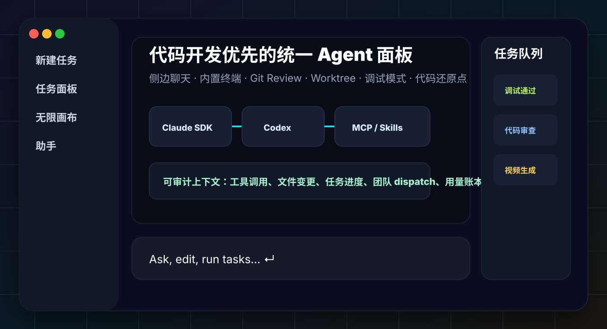
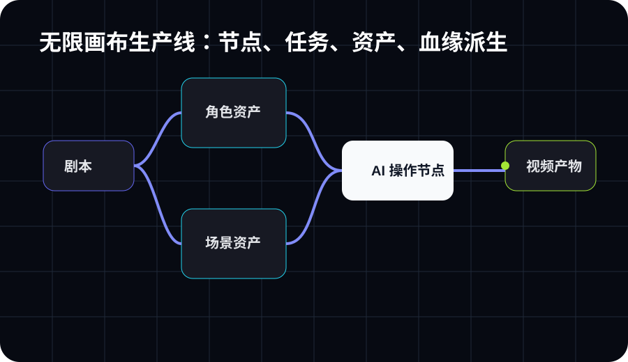
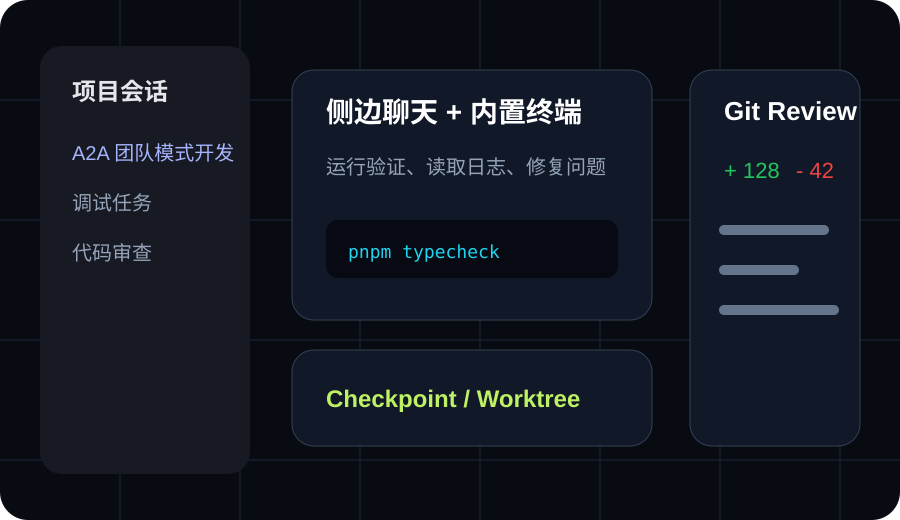
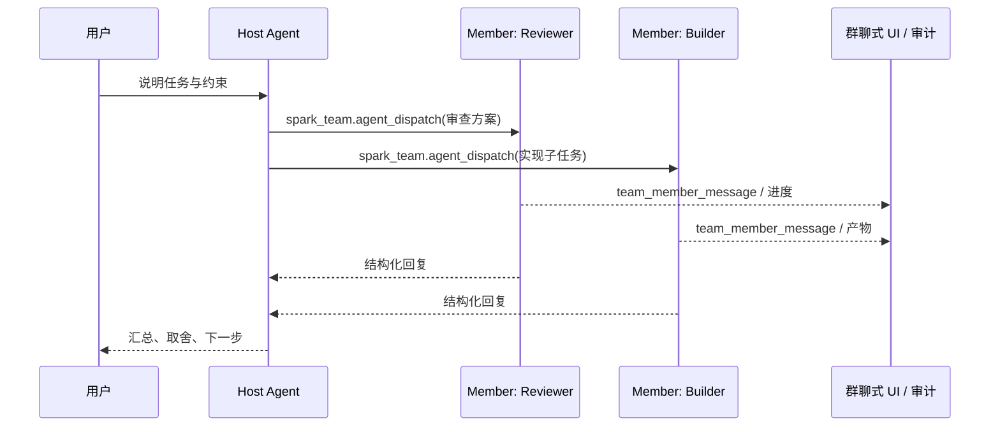
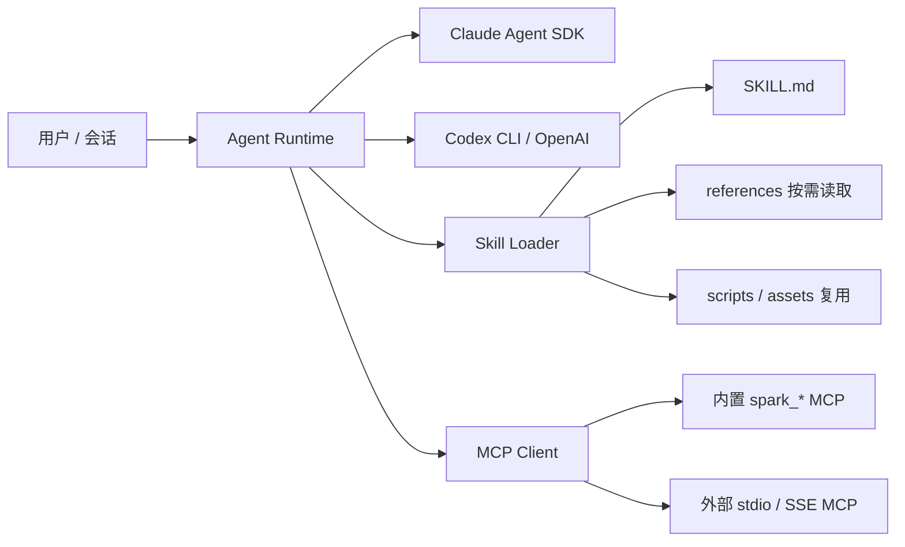
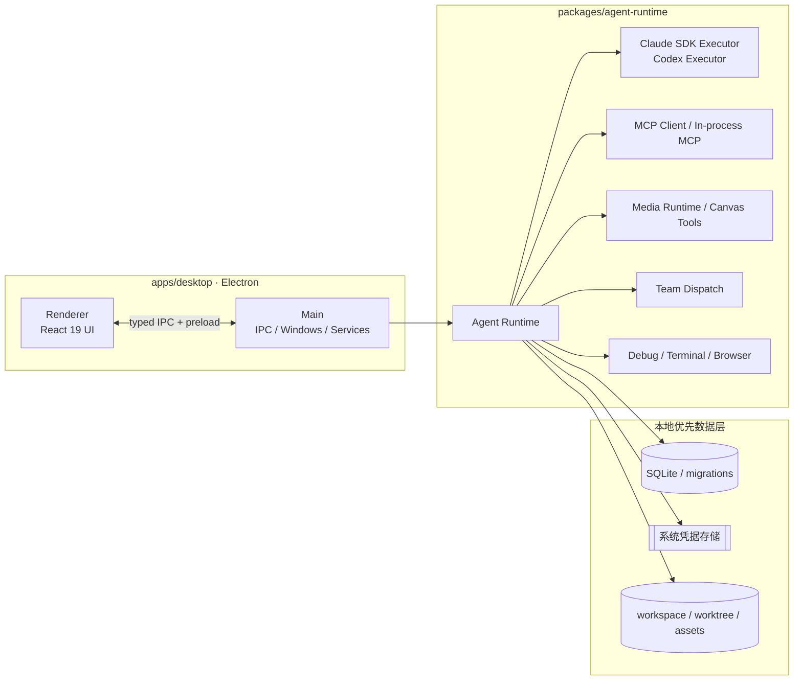

# Spark Agent

> **本地优先的 AI Agent 工作台** —— 把代码开发、调试审查、团队 Agent、远程连接、定时任务，以及无限画布内容创作放进一个可观察、可扩展、可审计的桌面应用。

Spark Agent 不是又一个聊天客户端，而是一套面向真实生产的 **Agent Operating Workbench**。它以 Electron 桌面端为入口，用统一 Agent Runtime 串起 **Claude Agent SDK + Codex 双内核**、多模型 Provider、MCP/Skills 生态、Git Worktree 隔离、代码还原点、调试模式、任务面板、远程连接，以及影视级无限画布。所有会话、项目、资产、审计与运行数据优先保存在本机，适合开发者、创作者、高级用户和小团队长期使用。



> 当前项目仍处于快速开发阶段，API、数据结构和部分交互可能继续调整。欢迎 Star、Issue 和 PR。

---

## 为什么是 Spark Agent？

- **先开发，后创作**：官网与 README 的功能顺序按当前产品重心重排，代码开发、调试、审查、团队协作、双内核与平台治理优先呈现；无限画布与多媒体生产作为同一个工作台里的创作扩展。
- **不是黑盒 Agent**：终端、文件变更、Git Review、任务队列、上下文、工具审批、用量账本、Hooks、审计事件都可见、可追踪、可回滚。
- **不是单模型壳子**：Claude Agent SDK 与 Codex 可按会话/Agent 切换，Provider 覆盖文本、多模态、图片、语音、视频，MCP 与 Skill 可渐进式扩展。
- **不是孤立会话**：项目、工作区、worktree、远程连接、团队成员、资产中心、画布节点与任务历史被组织成长期上下文。

## 功能一览（不少于 10 个核心能力）

| #   | 能力                        | 说明                                                                                                         |
| --- | --------------------------- | ------------------------------------------------------------------------------------------------------------ |
| 1   | **双内核运行时**            | 同时支持 Claude Agent SDK 与 Codex（CLI/OpenAI）两套执行路径，按 Agent、会话和任务选择最合适内核。           |
| 2   | **代码开发 Agent**          | 读取/修改项目、执行命令、生成补丁、解释代码、重构、补测试，和本地 workspace 深度绑定。                       |
| 3   | **调试模式**                | 围绕“假设 → 插桩 → 运行 → 读日志 → 修复”闭环，结合 `spark_debug`、内置终端与持久日志服务定位问题。           |
| 4   | **代码还原点 / Checkpoint** | 会话步骤、文件补丁和工作区状态可形成可回退节点，降低 Agent 自动修改代码的风险。                              |
| 5   | **Git Worktree 隔离**       | 为会话创建独立 worktree，让 Agent 在隔离分支工作；主工作区保持干净，后续再合并/清理。                        |
| 6   | **统一面板**                | 侧边聊天、内置终端、代码审查、文件目录、任务面板、帮助与模板入口聚合在一个工作台内。                         |
| 7   | **代码审查 / HunkDiff**     | 右侧 Git Review 逐文件/逐块查看差异，支持接受、拒绝、回滚和提交前验证建议。                                  |
| 8   | **任务面板**                | 聚合进行中/已完成/失败任务，支持多媒体任务进度、Agent 执行状态和结果回写。                                   |
| 9   | **团队模式（A2A）**         | Host Agent 通过 `spark_team` 调度成员 Agent，成员拥有自己的模型、工具、Skills 与 MCP，过程以群聊式 UI 展示。 |
| 10  | **渐进式披露 Skill 方案**   | Skill 只在需要时加载说明、引用和脚本，避免把所有知识一次性塞进上下文。                                       |
| 11  | **内置工具与内置 Agent**    | 平台管理、联网搜索、媒体生成、画布操作、团队调度、调试、浏览器自动化等能力开箱可用。                         |
| 12  | **远程连接**                | 支持把本地桌面工作台连接到远程项目/环境，适合服务器代码、云端工作区和跨机器协作。                            |
| 13  | **定时任务**                | 面向周期性 Agent 工作流：定期检查、生成日报、同步资料、跑脚本或触发内容生产。                                |
| 14  | **上下文可视化审计**        | 将模型输入、工具调用、文件变更、团队 dispatch、用量与审计事件显性化，便于复盘和治理。                        |
| 15  | **无限画布**                | 多画布、多节点、多任务队列，文本、Prompt、图片、视频和素材在画布中编排、连接与派生。                         |
| 16  | **资产中心**                | 管理剧本、角色、场景、道具、分镜、提示词库和生成产物，保留项目级资产沉淀。                                   |
| 17  | **3D 导演台**               | 通过导演台配置角色、相机、视角、运动与构图，将空间调度转换为可生成的镜头描述。                               |
| 18  | **内置 AI 操作节点**        | 文生图、图生图、图片编辑、多图合成、文生视频、图生视频、语音等节点化执行。                                   |
| 19  | **画布专属助手**            | 在画布上下文内让 Agent 拆解任务、创建节点、调度模型、检查结果并继续派生。                                    |
| 20  | **多主题界面**              | 截图展示的是暗色主题，平台同时支持多色主题与浅色体验。                                                       |

## 产品截图与概念图

> 用户提供的截图展示了暗色主题下的无限画布、资产中心、3D 导演台、媒体任务配置、开发模式、团队模式与 Git Review。仓库内同时提供可版本化的 SVG 配图，便于 README 与官网长期维护。

<p align="center">
  
  
</p>

## 功能图谱

```mermaid
graph TB
    Core["Spark Agent<br/>本地优先 Agent 工作台"]
    Core --> Dev["代码开发与调试"]
    Core --> Team["团队 Agent 协作"]
    Core --> Runtime["双内核与平台治理"]
    Core --> Canvas["无限画布内容创作"]

    Dev --> D1["侧边聊天 / 内置终端 / 文件目录"]
    Dev --> D2["Git Review / HunkDiff / 代码还原点"]
    Dev --> D3["Debug 模式 / 浏览器自动化"]
    Dev --> D4["Worktree 隔离 / 远程连接"]

    Team --> T1["Host 调度 Member"]
    Team --> T2["成员级模型 / MCP / Skills"]
    Team --> T3["群聊式过程 / 预算 / 超时 / 嵌套治理"]

    Runtime --> R1["Claude SDK + Codex 双内核"]
    Runtime --> R2["Provider / MCP / Skill 商店"]
    Runtime --> R3["权限审批 / 用量账本 / Hooks / 审计"]
    Runtime --> R4["任务面板 / 定时任务 / 上下文可视化"]

    Canvas --> C1["无限画布 / 资产中心"]
    Canvas --> C2["3D 导演台 / Prompt Library"]
    Canvas --> C3["图片 / 视频 / 语音 AI 操作节点"]
    Canvas --> C4["血缘派生 / 画布专属助手"]
```



## 代码开发工作流



1. **选择项目与内核**：在 Composer 选择项目、分支、模型、Agent 与 Claude/Codex 执行内核。
2. **隔离执行**：需要高风险修改时开启 worktree，让 Agent 在独立工作树里完成任务。
3. **统一面板协作**：侧边聊天承接需求，内置终端执行验证，文件目录和任务面板同步状态。
4. **调试模式定位**：通过 Debug 模式插桩、读取日志、复现实验，并把结论回写会话。
5. **审查与还原**：Git Review 查看每个文件/每个 hunk；必要时回到代码还原点。
6. **提交与交付**：运行类型检查/测试，生成总结，提交或推送。

## 团队模式（A2A）



团队模式不是简单“多开几个聊天窗口”。Host 会根据成员清单、可用工具、上下文、预算和深度限制调度成员；成员结果以事件流写入会话，方便回放、审计和复盘。

## 双内核与渐进式 Skill



- **Claude Agent SDK** 更适合工具调用、长上下文协作、MCP 与多步骤任务。
- **Codex** 更适合代码修改、命令执行、补丁生成和开发者习惯的 CLI 工作流。
- **Skill** 采用渐进式披露：先读 `SKILL.md`，只有需要时才读取引用、脚本与资产，减少上下文污染。

## 无限画布与内容生产


画布把内容创作拆成可观察节点：剧本、角色、场景、道具、分镜、Prompt、参考图、生成图、生成视频都能被连接和复用。内置 AI 操作节点通过 `spark_media` / `spark_image` / `spark_canvas` 调用多模型 Provider，输出自动回写画布并保留血缘。

### 画布能力示例

- 剧本导入与场景拆解。
- 角色、场景、道具、特效、分镜分组与资产中心。
- Prompt Library：镜头焦距、光圈、景别、构图、色彩、运镜、曝光、质感等电影语言模板。
- 3D 导演台：相机、角色、站位、面向、远近、姿态和画幅参数可视化。
- 文生图、图生图、图片编辑、多图合成、文生视频、图生视频、语音合成。
- 任务队列：运行中、失败、完成、产物数量与节点状态回写。
- 画布专属助手：基于当前节点和项目资产继续拆解、生成、检查与迭代。

## 架构总览



## 内置 MCP / 工具

| 命名空间                      | 能力                                         |
| ----------------------------- | -------------------------------------------- |
| `spark_search`                | 供应商无关联网搜索、网页正文抓取与自动降级。 |
| `spark_media` / `spark_image` | 图片、视频、语音生成与编辑。                 |
| `spark_canvas`                | 无限画布节点、任务、产物和项目上下文操作。   |
| `spark_team`                  | A2A 团队成员调度、事件流与结果汇总。         |
| `spark_debug`                 | 调试模式插桩、日志收集与分析。               |
| `spark_platform`              | 平台管理、Agent/Skill/Provider 管理能力。    |
| `playwright`（managed）       | 浏览器自动化，支持网页操作、验证和采集。     |

## 技术栈

- **桌面框架**：Electron、electron-vite、electron-builder
- **前端**：React 19、TypeScript、Tailwind CSS、@lobehub/ui、antd、XYFlow
- **运行时**：Node.js、Claude Agent SDK、Codex CLI/OpenAI、MCP、Provider/Media Adapter
- **数据与安全**：SQLite/better-sqlite3、keytar、workspace/worktree、本地文件协议
- **工程化**：pnpm workspace、Vitest、Playwright、ESLint、Prettier

## 目录结构

```text
.
├── apps/
│   ├── desktop/          # Electron 桌面应用（renderer + main）
│   ├── server/           # 服务端子项目（认证 / 云同步，实施中）
│   └── website/          # 官网
├── packages/
│   ├── agent-runtime/    # Agent Runtime、双内核、Provider、MCP、媒体、团队、调试
│   ├── protocol/         # IPC、事件协议、Zod schemas
│   ├── shared/           # 通用工具、日志、错误、KeyStore
│   └── storage/          # SQLite 存储、迁移、Repository
├── docs/                 # 架构、设计、发布和开发文档
├── skills/               # 项目内 Skills 资源
└── images/               # README/官网配图资源
```

## 环境要求

- Node.js >= 22
- pnpm >= 10
- Git

Windows 用户建议安装 Visual Studio Build Tools，以便 `better-sqlite3`、`keytar` 等原生依赖在需要时能够正确构建。

## 快速开始

```bash
git clone https://github.com/alexanderizh/spark-agent.git
cd spark-agent
pnpm install
pnpm dev
```

## 常用命令

```bash
pnpm dev          # 启动桌面端开发环境
pnpm typecheck    # 类型检查
pnpm test:unit    # 运行单元测试
pnpm test         # 运行全部测试
pnpm lint         # 代码检查
pnpm format       # 格式化
pnpm build        # 构建桌面端
```

桌面端打包命令位于 `apps/desktop/package.json`：

```bash
pnpm --filter @spark/desktop build:win
pnpm --filter @spark/desktop build:mac
pnpm --filter @spark/desktop build:linux
```

官网：

```bash
pnpm --filter @spark/website build
pnpm --filter @spark/website dev
```

## 文档

- [Desktop Agent Development Guide](docs/desktop-agent-development-guide.md)
- [Agents Workflows](docs/agents-workflows.md)
- [团队模式（Team Agent Mode）](docs/团队模式开发.md)
- [AI 无限画布 MVP](docs/ai-infinite-canvas-mvp.md)
- [多媒体模型 Provider](docs/multimedia-model-providers.md)
- [内置联网搜索](docs/builtin-web-search.md)
- [浏览器自动化](docs/skills/browser-automation.md)
- [Remote Connections](docs/remote-connections.md)
- [GitHub Release Auto Update](docs/github-release-auto-update.md)

## 贡献

欢迎通过 Issue 和 Pull Request 参与贡献。适合贡献的方向包括：代码开发体验、调试模式、团队模式、双内核执行、MCP/Skills、无限画布、媒体 Provider、远程连接、定时任务、审计治理、跨平台打包与测试。

## 安全

如果你发现安全问题，请不要在公开 Issue 中披露敏感细节。可以先通过仓库维护者可用的私有联系方式沟通，确认影响范围后再公开修复说明。

## 许可证

仓库暂未在 README 中声明明确许可证；如需商用或二次分发，请先联系维护者确认。
