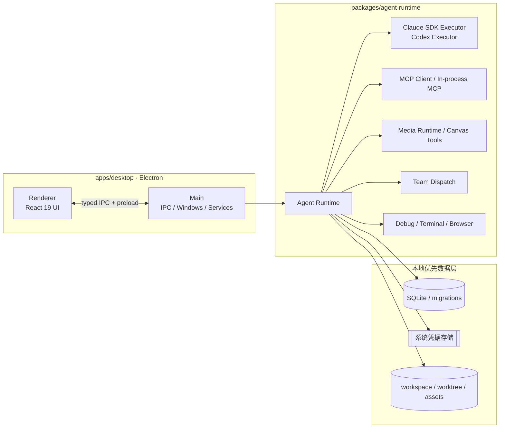

# Spark Agent

> 本地优先的 AI Agent 桌面工作台——代码开发、团队协作、运行时治理与无限画布创作，整合进同一个可观察、可扩展、可审计的应用。

[](#许可证)
[](apps/desktop)
[](apps/desktop)
[](tsconfig.base.json)
[](package.json)
[](#下载)

[官网](https://spark-agent.dev) ·
[下载](#下载) ·
[文档](#文档) ·
[Roadmap](https://spark-agent.dev/roadmap) ·
[更新日志](CHANGELOG.md)

---

Spark Agent 是一个基于 Electron 的本地优先（local-first）桌面应用。与其在编辑器、终端、聊天客户端和各类 AI 工具之间来回切换，它把这些能力聚合进同一个工作台：你可以在这里和 Agent 一起改代码、调试、跑多 Agent 团队任务、管理 Provider 与工具生态，或在无限画布上做内容创作。

所有数据默认留在本机——结构化数据存入 SQLite，敏感凭据进入系统钥匙串，工作区与产物保留在本地文件系统。**无需注册账号，也不依赖任何云端服务。**

> 项目处于快速开发阶段，API、数据结构与 UI 细节仍在持续调整。欢迎 Star / Issue / PR。

## 截图

| 代码开发工作台 | 无限画布 |
| :---: | :---: |
|  |  |

| 团队模式（A2A） | 资产中心 · 提示词库 |
| :---: | :---: |
|  |  |

| 3D 导演台 | 媒体节点配置 |
| :---: | :---: |
|  |  |

## 功能

Spark Agent 围绕四条主线组织能力，下图为整体全景，各主线详情见其后分节。

```mermaid
graph TB
    Core["Spark Agent<br/>本地优先 Agent 工作台"]
    Core --> Dev["代码开发与调试"]
    Core --> Team["团队 Agent 协作"]
    Core --> Runtime["双内核与平台治理"]
    Core --> Canvas["无限画布内容创作"]

    Dev --> D1["侧边聊天 / 内置终端 / 文件目录"]
    Dev --> D2["Git Review / HunkDiff / 代码还原点"]
    Dev --> D3["Debug 模式 / 浏览器自动化"]
    Dev --> D4["Worktree 隔离 / 远程连接"]

    Team --> T1["Host 调度 Member"]
    Team --> T2["成员级模型 / MCP / Skills"]
    Team --> T3["群聊式过程 / 预算 / 超时"]

    Runtime --> R1["Claude SDK + Codex 双内核"]
    Runtime --> R2["Provider / MCP / Skill 商店"]
    Runtime --> R3["权限审批 / 用量账本 / Hooks / 审计"]
    Runtime --> R4["任务面板 / 定时任务 / 上下文可视化"]

    Canvas --> C1["无限画布 / 资产中心"]
    Canvas --> C2["3D 导演台 / 360 场景预览 / Prompt Library"]
    Canvas --> C3["图片 / 视频 / 语音 AI 操作节点"]
    Canvas --> C4["血缘派生 / 画布专属助手"]
```



### 代码开发与调试

- 在你的真实项目里与 Agent 结对：读取 / 修改文件、执行命令、生成补丁、解释与重构代码、补齐测试；
- Debug 模式围绕“假设 → 插桩 → 运行 → 读日志 → 修复”闭环，配合 `spark_debug`、内置终端与持久日志定位问题；
- 右侧 Git Review 以 HunkDiff 逐块查看改动，可接受、拒绝、回滚，并在提交前验证；
- 代码还原点：会话步骤、文件补丁与工作区状态可回退，降低 Agent 自动改动的风险；
- Worktree 隔离：为会话创建独立工作树，Agent 在隔离分支作业，主工作区保持干净；
- 浏览器自动化（Playwright）：网页操作、验证与数据采集。

### 团队 Agent（A2A）

- Host Agent 通过 `spark_team` 调度多个成员 Agent，每个成员可独立配置模型、工具、Skills 与 MCP；
- 调度过程以群聊式 UI 呈现，可设成员级预算、超时与上下文上限。

### 双内核运行时与平台治理

- 双内核：Claude Agent SDK 与 Codex（CLI / OpenAI）可按会话、Agent 或任务切换执行路径；
- Provider / MCP / Skill 商店，Skill 采用渐进式披露，仅在需要时加载说明与脚本，避免上下文膨胀；
- 治理面：权限审批、用量账本、Rules、Hooks、审计事件与上下文可视化，便于复盘与管控；
- 任务面板聚合进行中 / 已完成 / 失败任务，支持多媒体任务进度与结果回写；
- 远程连接到远端项目或环境；定时任务跑周期性工作流（巡检、日报、同步、脚本、内容生产）。

### 无限画布内容创作

- 多画布、多节点、多任务队列：文本、Prompt、图片、视频与素材在画布上编排、连接与派生；
- 资产中心沉淀剧本、角色、场景、道具、分镜、提示词库与生成产物；
- 3D 导演台配置角色、相机、视角、运动与构图，并转换为可生成的镜头描述；360° 预览多角度检查一致性；
- 内置 AI 操作节点：文生图、图生图、图片编辑、多图合成、文生视频、图生视频、语音合成；
- 画布专属助手：在画布上下文内拆解任务、创建节点、调度模型、检查结果并继续派生。

## 快速开始

### 环境要求

- Node.js ≥ 22
- pnpm ≥ 10
- Git

Windows 用户建议安装 Visual Studio Build Tools，以便 `better-sqlite3`、`keytar` 等原生依赖在需要时正确构建。

### 从源码运行

```bash
git clone https://github.com/alexanderizh/spark-agent.git
cd spark-agent
pnpm install
pnpm dev          # 启动桌面端开发环境
```

常用脚本：

```bash
pnpm typecheck    # 类型检查
pnpm test:unit    # 运行单元测试
pnpm test         # 运行全部测试
pnpm lint         # 代码检查
pnpm format       # 格式化
pnpm build        # 构建桌面端
```

桌面端跨平台打包（位于 `apps/desktop/package.json`）：

```bash
pnpm --filter @spark/desktop build:win
pnpm --filter @spark/desktop build:mac
pnpm --filter @spark/desktop build:linux
```

### 下载

不想自行构建？直接使用已发布版本：[GitHub Releases](https://github.com/alexanderizh/spark-agent/releases)

- macOS（Apple Silicon / Intel，DMG）
- Windows（x64，安装包与便携版）
- Linux（AppImage / deb）

## 架构



### 内置 MCP / 工具

| 命名空间 | 能力 |
| --- | --- |
| `spark_search` | 供应商无关联网搜索、网页正文抓取与自动降级。 |
| `spark_media` / `spark_image` | 图片、视频、语音生成与编辑。 |
| `spark_canvas` | 无限画布节点、任务、产物与项目上下文操作。 |
| `spark_team` | A2A 团队成员调度、事件流与结果汇总。 |
| `spark_debug` | 调试模式插桩、日志收集与分析。 |
| `spark_platform` | 平台管理、Agent / Skill / Provider 管理。 |
| `playwright`（managed） | 浏览器自动化，支持网页操作、验证与采集。 |

## 仓库结构

```text
.
├── apps/
│   ├── desktop/          # Electron 桌面应用（renderer + main）
│   ├── server/           # 服务端子项目（认证 / 云同步，实施中）
│   └── website/          # 官网
├── packages/
│   ├── agent-runtime/    # Agent Runtime、双内核、Provider、MCP、媒体、团队、调试
│   ├── protocol/         # IPC、事件协议、Zod schemas
│   ├── shared/           # 通用工具、日志、错误、KeyStore
│   └── storage/          # SQLite 存储、迁移、Repository
├── docs/                 # 架构、设计、发布和开发文档
├── skills/               # 项目内 Skills 资源
└── images/               # README / 官网配图资源
```

## 技术栈

- **桌面框架**：Electron、electron-vite、electron-builder
- **前端**：React 19、TypeScript、Tailwind CSS、@lobehub/ui、antd、XYFlow
- **运行时**：Node.js、Claude Agent SDK、Codex CLI / OpenAI、MCP、Provider / Media Adapter
- **数据与安全**：SQLite / better-sqlite3、keytar、workspace / worktree、本地文件协议
- **工程化**：pnpm workspace、Vitest、Playwright、ESLint、Prettier

## 文档

- [Desktop Agent Development Guide](docs/desktop-agent-development-guide.md)
- [Agents Workflows](docs/agents-workflows.md)
- [团队模式（Team Agent Mode）](docs/团队模式开发.md)
- [AI 无限画布 MVP](docs/ai-infinite-canvas-mvp.md)
- [多媒体模型 Provider](docs/multimedia-model-providers.md)
- [内置联网搜索](docs/builtin-web-search.md)
- [浏览器自动化](docs/skills/browser-automation.md)
- [Remote Connections](docs/remote-connections.md)
- [GitHub Release Auto Update](docs/github-release-auto-update.md)

更多内容见 [`docs/`](docs) 目录。

## 贡献

欢迎通过 Issue 与 Pull Request 参与贡献。适合贡献的方向包括：

- 代码开发体验、调试模式、Worktree 隔离
- 团队模式（Host / Member 调度、事件流、预算与超时）
- 双内核执行（Claude Agent SDK / Codex）
- MCP / Skill 生态与渐进式披露
- 无限画布、媒体 Provider、3D 导演台
- 远程连接、定时任务、审计与治理
- 跨平台打包、CI 与自动化测试

提交前请确保本地检查通过：

```bash
pnpm typecheck && pnpm lint && pnpm test
```

## 安全

如果你发现安全问题，请**不要**在公开 Issue 中披露敏感细节。先通过仓库维护者可用的私有联系方式沟通，确认影响范围后再公开修复说明。

## 许可证

本项目采用基于 Apache License 2.0 的个人使用许可证，详见 [LICENSE](LICENSE)。
个人学习、研究、评估和自用可以使用、复制、修改和分发；任何商业用途、公司/机构内部使用、为客户交付、付费服务或商业产品集成都需要先获得维护者书面授权。

注意：该许可证附加了个人使用限制，并非标准 SPDX `Apache-2.0` 许可证。

---

<sub>Built with Electron · React · TypeScript · pnpm.</sub>
