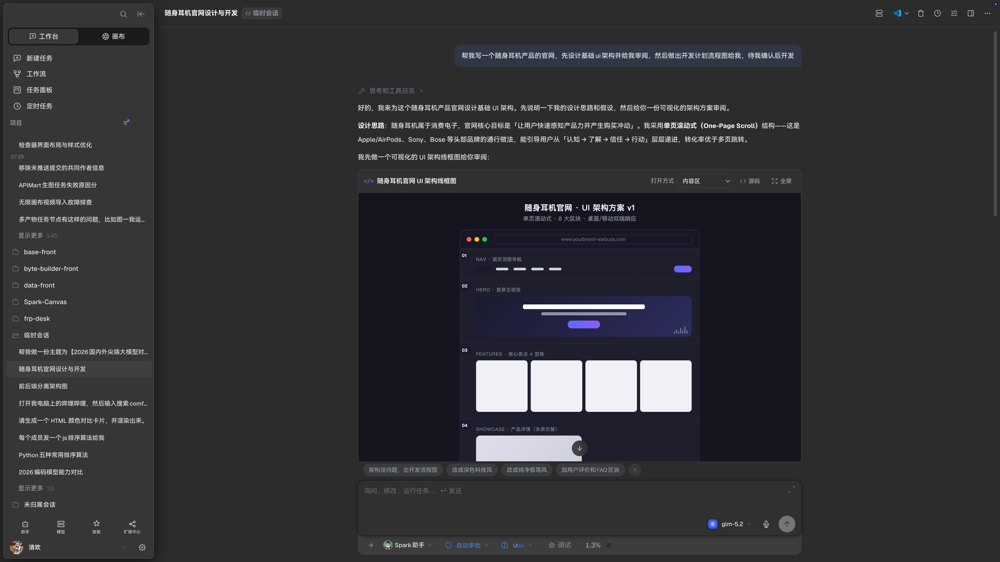
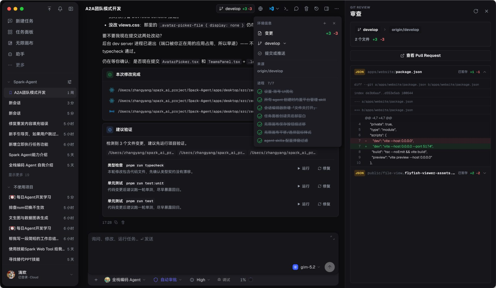
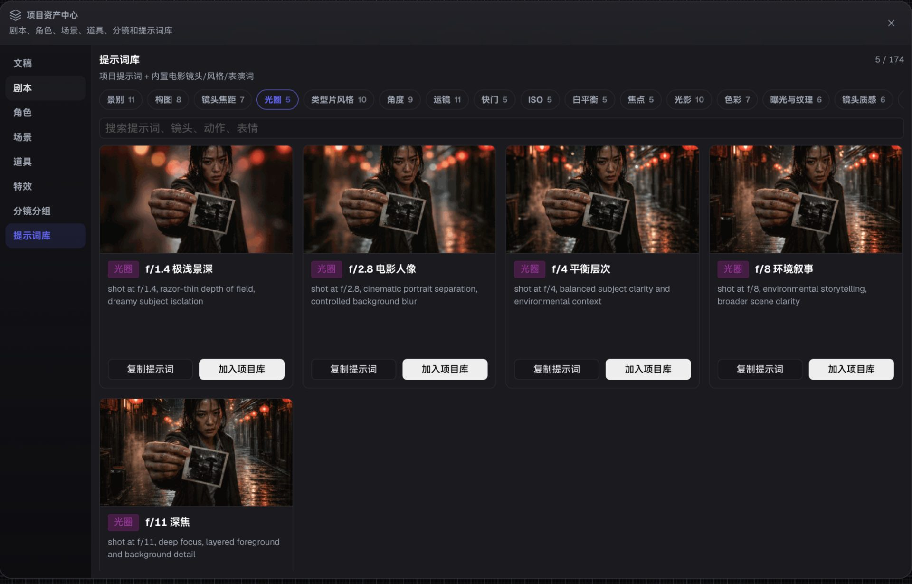
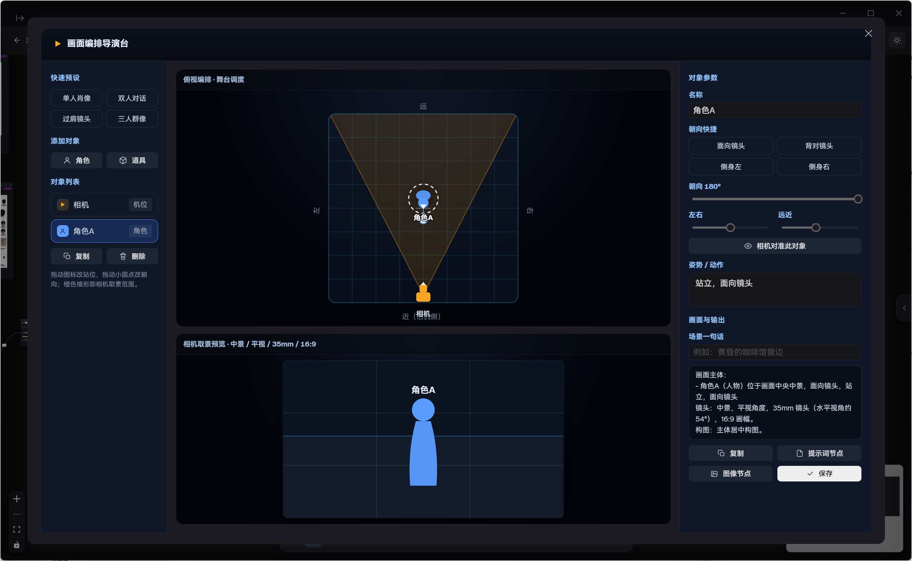
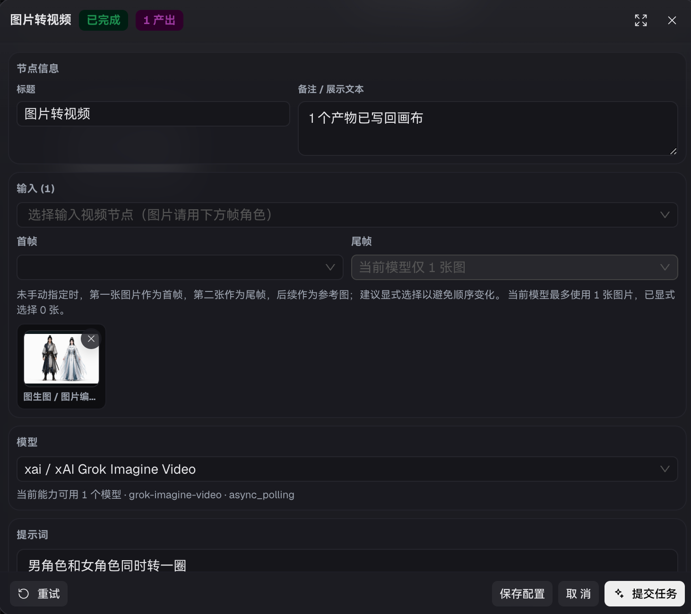
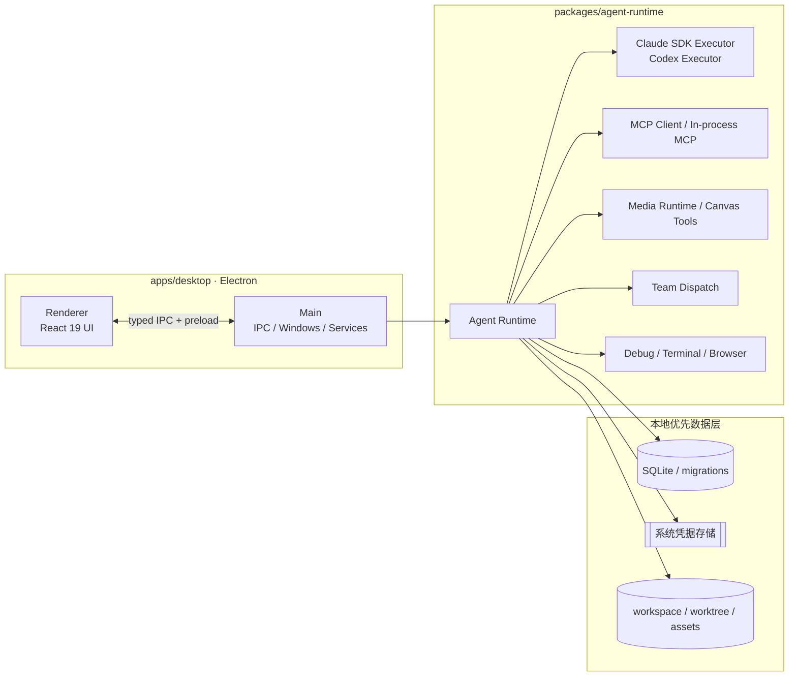

# Spark Agent

> 本地优先的 AI Agent 工作台：把代码开发、调试审查、团队 Agent、运行时治理、Provider / MCP / Skill 生态和无限画布内容创作放进同一个可观察、可扩展、可审计的桌面应用。

[](#许可证)
[](apps/desktop)
[](apps/desktop)
[](tsconfig.base.json)
[](package.json)
[](#下载)

[官网](https://spark-agent.dev) ·
[下载](#下载) ·
[文档](#文档) ·
[Roadmap](https://spark-agent.dev/roadmap) ·
[更新日志](CHANGELOG.md)

---

## 项目简介

Spark Agent 是一个基于 Electron 的本地桌面应用，把 Agent 真正会用到的几样东西放在同一个工作台里：

- **代码开发与调试**：侧边聊天、内置终端、文件目录、Git Review、HunkDiff、Worktree 隔离、Debug 模式、Checkpoint 和浏览器自动化；
- **团队 Agent（A2A）**：Host 调度成员 Agent，成员可独立配置模型、工具、Skills、MCP、预算、超时和上下文；
- **双内核运行时**：Claude Agent SDK 与 Codex（CLI / OpenAI）按会话、Agent 或任务切换执行路径；
- **平台治理**：Provider / MCP / Skill 管理、权限审批、用量账本、Rules、Hooks、审计事件和上下文可视化；
- **无限画布创作**：剧本、角色、场景、提示词库、3D 导演台、AI 操作节点、媒体产物和资产血缘在画布上编排与派生。

所有会话、项目、资产、审计与运行数据默认保存在本机（SQLite + 本地文件系统 + 系统凭据存储），不需要账号或云端服务即可使用。



> 项目处于快速开发阶段，API、数据结构、UI 细节仍在调整。欢迎 Star / Issue / PR。

## 官网

官网位于 [`apps/website`](apps/website)，是一个 Vite + React 19 静态站，面向开发者、创作者和团队决策者说明产品边界。

- 首页：产品定位、真实截图、能力主线、架构摘要、工作流和下载入口；
- 功能页：代码开发、审查隔离、团队 A2A、双内核、内置工具、审计、无限画布、资产中心和 Provider 生态；
- 画布页：节点类型、影视工具区、3D 导演台和英文 AI 搜索问答；
- 架构页：Electron、Typed IPC、Agent Runtime、MCP、Provider、Storage 和本地优先数据层；
- 下载页：自动识别平台并统一跳转 GitHub Releases；
- 文档页：连接仓库内 docs，按真实工作流组织快速开始、代码开发、团队模式、画布和生态配置；
- AI 可读入口：[`/llms.txt`](apps/website/public/llms.txt)、[`/llms-full.txt`](apps/website/public/llms-full.txt)、[`/sitemap.xml`](apps/website/public/sitemap.xml)。

## 截图

| 代码开发工作台 | 无限画布 |
| :---: | :---: |
|  |  |

| 团队模式（A2A） | 资产中心 · 提示词库 |
| :---: | :---: |
|  |  |

| 3D 导演台 | 媒体节点配置 |
| :---: | :---: |
|  |  |

## 功能

| # | 能力 | 说明 |
| - | --- | --- |
| 1 | 双内核运行时 | 同时支持 Claude Agent SDK 与 Codex（CLI / OpenAI），按 Agent、会话、任务切换执行路径。 |
| 2 | 代码开发 Agent | 读取 / 修改项目、执行命令、生成补丁、解释代码、重构、补测试，与本地 workspace 深度绑定。 |
| 3 | 调试模式 | 围绕“假设 → 插桩 → 运行 → 读日志 → 修复”闭环，结合 `spark_debug`、内置终端与持久日志定位问题。 |
| 4 | 代码还原点 | 会话步骤、文件补丁与工作区状态可形成可回退节点，降低 Agent 自动改代码的风险。 |
| 5 | Git Worktree 隔离 | 为会话创建独立 worktree，让 Agent 在隔离分支工作；主工作区保持干净，后续再合并或清理。 |
| 6 | 统一面板 | 侧边聊天、内置终端、代码审查、文件目录、任务面板、帮助与模板入口聚合在一个工作台。 |
| 7 | 代码审查 / HunkDiff | 右侧 Git Review 逐文件 / 逐块查看差异，支持接受、拒绝、回滚与提交前验证。 |
| 8 | 任务面板 | 聚合进行中 / 已完成 / 失败任务，支持多媒体任务进度、Agent 状态与结果回写。 |
| 9 | 团队模式（A2A） | Host Agent 通过 `spark_team` 调度成员 Agent；成员拥有自己的模型、工具、Skills 与 MCP；过程以群聊式 UI 展示。 |
| 10 | 渐进式披露 Skill | Skill 仅在需要时加载说明、引用与脚本，避免一次性塞入上下文。 |
| 11 | 内置工具与内置 Agent | 平台管理、联网搜索、媒体生成、画布操作、团队调度、调试、浏览器自动化等能力开箱可用。 |
| 12 | 远程连接 | 将本地桌面工作台连接到远程项目 / 环境，适合服务器代码、云端工作区与跨机器协作。 |
| 13 | 定时任务 | 面向周期性 Agent 工作流：定期检查、生成日报、同步资料、跑脚本或触发内容生产。 |
| 14 | 上下文可视化审计 | 将模型输入、工具调用、文件变更、团队 dispatch、用量与审计事件显性化，便于复盘和治理。 |
| 15 | 无限画布 | 多画布、多节点、多任务队列，文本、Prompt、图片、视频与素材在画布中编排、连接与派生。 |
| 16 | 资产中心 | 管理剧本、角色、场景、道具、分镜、提示词库与生成产物，保留项目级资产沉淀。 |
| 17 | 3D 导演台 | 通过导演台配置角色、相机、视角、运动与构图，将空间调度转换为可生成的镜头描述。 |
| 18 | 内置 AI 操作节点 | 文生图、图生图、图片编辑、多图合成、文生视频、图生视频、语音合成等节点化执行。 |
| 19 | 画布专属助手 | 在画布上下文内让 Agent 拆解任务、创建节点、调度模型、检查结果并继续派生。 |
| 20 | 多主题界面 | 同时支持深色、浅色与多色主题，可按用户偏好切换。 |

这些能力在官网功能页中按「功能入口、证据模块、适用场景」重新组织，避免把 Provider 依赖能力写成固定承诺。

## 功能图谱

```mermaid
graph TB
    Core["Spark Agent<br/>本地优先 Agent 工作台"]
    Core --> Dev["代码开发与调试"]
    Core --> Team["团队 Agent 协作"]
    Core --> Runtime["双内核与平台治理"]
    Core --> Canvas["无限画布内容创作"]

    Dev --> D1["侧边聊天 / 内置终端 / 文件目录"]
    Dev --> D2["Git Review / HunkDiff / 代码还原点"]
    Dev --> D3["Debug 模式 / 浏览器自动化"]
    Dev --> D4["Worktree 隔离 / 远程连接"]

    Team --> T1["Host 调度 Member"]
    Team --> T2["成员级模型 / MCP / Skills"]
    Team --> T3["群聊式过程 / 预算 / 超时"]

    Runtime --> R1["Claude SDK + Codex 双内核"]
    Runtime --> R2["Provider / MCP / Skill 商店"]
    Runtime --> R3["权限审批 / 用量账本 / Hooks / 审计"]
    Runtime --> R4["任务面板 / 定时任务 / 上下文可视化"]

    Canvas --> C1["无限画布 / 资产中心"]
    Canvas --> C2["3D 导演台 / Prompt Library"]
    Canvas --> C3["图片 / 视频 / 语音 AI 操作节点"]
    Canvas --> C4["血缘派生 / 画布专属助手"]
```



## 架构



### 内置 MCP / 工具

| 命名空间 | 能力 |
| --- | --- |
| `spark_search` | 供应商无关联网搜索、网页正文抓取与自动降级。 |
| `spark_media` / `spark_image` | 图片、视频、语音生成与编辑。 |
| `spark_canvas` | 无限画布节点、任务、产物与项目上下文操作。 |
| `spark_team` | A2A 团队成员调度、事件流与结果汇总。 |
| `spark_debug` | 调试模式插桩、日志收集与分析。 |
| `spark_platform` | 平台管理、Agent / Skill / Provider 管理。 |
| `playwright`（managed） | 浏览器自动化，支持网页操作、验证与采集。 |

## 仓库结构

```text
.
├── apps/
│   ├── desktop/          # Electron 桌面应用（renderer + main）
│   ├── server/           # 服务端子项目（认证 / 云同步，实施中）
│   └── website/          # 官网
├── packages/
│   ├── agent-runtime/    # Agent Runtime、双内核、Provider、MCP、媒体、团队、调试
│   ├── protocol/         # IPC、事件协议、Zod schemas
│   ├── shared/           # 通用工具、日志、错误、KeyStore
│   └── storage/          # SQLite 存储、迁移、Repository
├── docs/                 # 架构、设计、发布和开发文档
├── skills/               # 项目内 Skills 资源
└── images/               # README / 官网配图资源
```

## 技术栈

- **桌面框架**：Electron、electron-vite、electron-builder
- **前端**：React 19、TypeScript、Tailwind CSS、@lobehub/ui、antd、XYFlow
- **运行时**：Node.js、Claude Agent SDK、Codex CLI / OpenAI、MCP、Provider / Media Adapter
- **数据与安全**：SQLite / better-sqlite3、keytar、workspace / worktree、本地文件协议
- **工程化**：pnpm workspace、Vitest、Playwright、ESLint、Prettier

## 环境要求

- Node.js ≥ 22
- pnpm ≥ 10
- Git

Windows 用户建议安装 Visual Studio Build Tools，以便 `better-sqlite3`、`keytar` 等原生依赖在需要时正确构建。

## 安装

```bash
git clone https://github.com/alexanderizh/spark-agent.git
cd spark-agent
pnpm install
```

## 使用

```bash
pnpm dev          # 启动桌面端开发环境
pnpm typecheck    # 类型检查
pnpm test:unit    # 运行单元测试
pnpm test         # 运行全部测试
pnpm lint         # 代码检查
pnpm format       # 格式化
pnpm build        # 构建桌面端
```

桌面端跨平台打包（位于 `apps/desktop/package.json`）：

```bash
pnpm --filter @spark/desktop build:win
pnpm --filter @spark/desktop build:mac
pnpm --filter @spark/desktop build:linux
```

官网开发与构建：

```bash
pnpm --filter @spark/website dev
pnpm --filter @spark/website build
```

官网主要内容文件：

```text
apps/website/src/content/features.ts      # 功能矩阵、图标 key、证据说明
apps/website/src/content/downloads.ts     # 平台下载与安装提示
apps/website/src/content/docs.ts          # 文档入口与工作流步骤
apps/website/src/content/architecture.ts  # 架构层级与 Runtime 模块
apps/website/src/routes/*.tsx             # 站点页面
apps/website/src/components/*.tsx         # Layout、FeatureCard、DownloadPanel 等复用组件
```

## 下载

最新发布版本见 [GitHub Releases](https://github.com/alexanderizh/spark-agent/releases)。当前下载入口由官网和 README 统一指向 Releases：

- macOS（Apple Silicon / Intel，DMG）
- Windows（x64，安装包与便携版）
- Linux（AppImage / deb）

## 文档

- [Desktop Agent Development Guide](docs/desktop-agent-development-guide.md)
- [Agents Workflows](docs/agents-workflows.md)
- [团队模式（Team Agent Mode）](docs/团队模式开发.md)
- [AI 无限画布 MVP](docs/ai-infinite-canvas-mvp.md)
- [多媒体模型 Provider](docs/multimedia-model-providers.md)
- [内置联网搜索](docs/builtin-web-search.md)
- [浏览器自动化](docs/skills/browser-automation.md)
- [Remote Connections](docs/remote-connections.md)
- [GitHub Release Auto Update](docs/github-release-auto-update.md)

## 贡献

欢迎通过 Issue 与 Pull Request 参与贡献。适合贡献的方向包括：

- 代码开发体验、调试模式、Worktree 隔离
- 团队模式（Host / Member 调度、事件流、预算与超时）
- 双内核执行（Claude Agent SDK / Codex）
- MCP / Skill 生态与渐进式披露
- 无限画布、媒体 Provider、3D 导演台
- 远程连接、定时任务、审计与治理
- 跨平台打包、CI 与自动化测试

提交前请确保：

```bash
pnpm typecheck && pnpm lint && pnpm test
```

通过本地检查后再发起 PR。

## 安全

如果你发现安全问题，请**不要**在公开 Issue 中披露敏感细节。先通过仓库维护者可用的私有联系方式沟通，确认影响范围后再公开修复说明。

## 许可证

本项目采用基于 Apache License 2.0 的非商业许可证，详见 [LICENSE](LICENSE)。
你可以在非商业场景下使用、复制、修改和分发；商业用途、付费服务、商业产品集成或企业内部商业运营使用需先获得维护者书面授权。

注意：该许可证附加了非商业限制，并非标准 SPDX `Apache-2.0` 许可证。

---

<sub>Built with Electron · React · TypeScript · pnpm.</sub>
