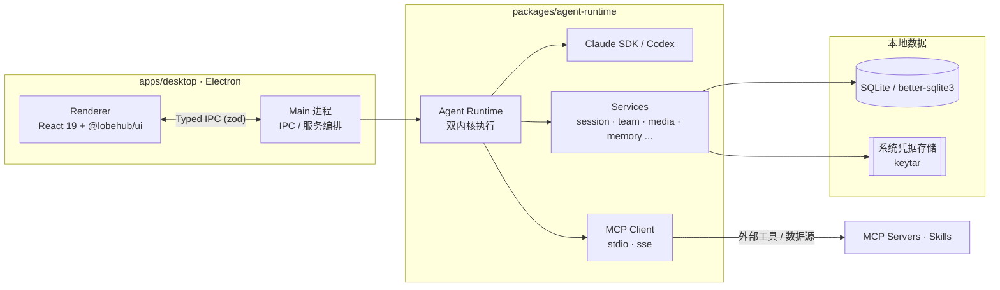
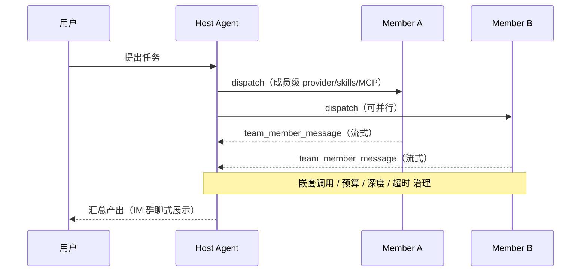
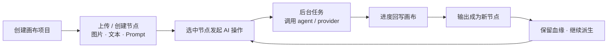

# Spark Agent

> **本地优先的 AI 内容创作工作台** —— 把「代码开发、多媒体创作、多 Agent 团队协作」装进一个可观察、可扩展、可审计的桌面应用。

Spark Agent 不是又一个聊天客户端，而是一个**以创作为核心的 Agent 操作系统**。它用一套统一的 Agent Runtime 串起 **双内核执行（Claude Agent SDK + Codex）**、**多模型 Provider（文本 / 多模态 / 图片 / 语音 / 视频）**、**MCP 与 Skills 即插即用生态**、**无限画布多媒体生产**、以及 **A2A 团队模式多 Agent 协作**——所有会话、项目、资产和运行数据优先保存在本机。

基于 Electron + React 19 + TypeScript 构建，面向开发者、创作者、高级用户与团队协作场景。

> 当前项目仍处于快速开发阶段，API、数据结构和部分交互可能继续调整。欢迎 Star、Issue 和 PR。

---

## ✨ 核心特点

| 特点 | 说明 |
|------|------|
| 🎨 **内容创作工作台** | 以无限画布为中心的多模态创作：文生图、图生图、图片编辑、多图合成、文生视频、图生视频、语音合成，节点保留来源血缘可持续派生 |
| 💻 **代码开发能力** | 内置 PTY 终端、Git Worktree 会话隔离、HunkDiff 逐块审阅/回滚、会话检查点恢复、Debug 调试模式、浏览器自动化 |
| 🔌 **即插即用生态** | MCP（stdio / SSE）服务器接入、Skill 商店一键安装、内置多个开箱即用的 `spark_*` MCP，无需配置即可使用 |
| 🧠 **双内核运行时** | 同时支持 **Claude Agent SDK** 与 **Codex（CLI / OpenAI）** 两套执行内核，按会话/Agent 自由切换 |
| 🌐 **多模型支持** | 统一 Provider 管理，覆盖文本、多模态、图片、语音、视频模型；密钥经系统凭据存储安全保管 |
| 👥 **A2A 团队模式** | 主持 Agent 在对话中动态调度成员 Agent，以 IM 群聊形式协作，支持嵌套调用与资源治理 |
| 🔎 **内置联网搜索** | 供应商无关的 `spark_search`，多后端自动降级（Bing/百度/DuckDuckGo + 可选增强源），全员默认挂载 |
| 🛡️ **可审计治理** | 工具调用权限审批、用量与成本账本、Hooks、规则层级合成、审计事件——本地优先、可复盘 |

---

## 🗺️ 功能图谱

```mermaid
graph TB
    Core["🎨 Spark Agent<br/>本地 AI 内容创作工作台"]

    Core --> Create["🎨 多媒体创作"]
    Core --> Code["💻 代码开发"]
    Core --> Team["👥 团队协作"]
    Core --> Platform["🔌 平台与生态"]

    Create --> C1["无限画布 / 多画布管理"]
    Create --> C2["文生图 · 图生图 · 图片编辑 · 多图合成"]
    Create --> C3["文生视频 · 图生视频 · 语音合成"]
    Create --> C4["资产管理 · Film Asset Center · 血缘派生"]

    Code --> D1["内置 PTY 终端"]
    Code --> D2["Git Worktree 会话隔离"]
    Code --> D3["HunkDiff 逐块审阅 / 回滚 · 检查点恢复"]
    Code --> D4["Debug 调试模式 · 浏览器自动化"]

    Team --> T1["A2A 团队模式（Host 调度 Member）"]
    Team --> T2["IM 群聊式多 Agent 协作"]
    Team --> T3["嵌套调用 · 预算 / 深度 / 超时治理"]

    Platform --> P1["双内核：Claude SDK + Codex"]
    Platform --> P2["多模型 Provider（文/图/语音/视频）"]
    Platform --> P3["MCP 接入 · Skill 商店"]
    Platform --> P4["权限审批 · 用量账本 · Hooks · 审计"]
```



---

## 🧩 四大支柱

### 🎨 多媒体创作 —— 产品核心

以**项目 → 无限画布**为入口的多模态创作工作台。在画布上放置图片、视频、文本、Prompt、参考素材与 AI 任务结果；选中一个或多个节点即可发起生成、编辑、合成、改写、图生视频等操作。任务在后台执行、进度回写画布，输出自动成为新节点，并保留**来源血缘（lineage）**以便持续派生。配套资产侧栏、资产管理面板、Film Asset Center 与底部工具坞，对标内容创作工作台形态。

由 `spark_media` / `spark_image` / `spark_canvas` MCP 与 manifest 驱动的多平台媒体适配器支撑，可对接 OpenAI Images、Google/Veo、Volcengine、xAI、APIMart、Kling、PixVerse、MiniMax-Hailuo 等多种生成能力。

### 💻 代码开发

面向开发者的完整 Agent 闭环：会话内可开启**内置交互式终端**、把 Agent 跑在**隔离的 Git Worktree** 里避免污染主工作区、用 **HunkDiff 逐块接受/拒绝**改动并支持反向回滚、**检查点恢复**回到任意一步；**Debug 调试模式**通过长驻日志服务做"假设→插桩→读日志→分析→修复"闭环；**浏览器自动化**经 managed Playwright MCP 让 Agent 操作网页。

### 👥 团队协作（A2A）

底部 Agent 选择器开启「团队模式」后，主持 Agent（Host）可在对话中通过工具动态调度被授权的成员 Agent（Member），以 IM 群聊形式展示多 Agent 协作。成员以自身 provider/model/skills/MCP 运行，支持成员级工具、嵌套调用（深度上限）、单轮 dispatch 预算、超时与取消传播。

### 🔌 平台与生态

统一 Provider 管理（CRUD + 健康检查 + 密钥安全存储）、**双内核**执行、**MCP** 服务器接入与 **Skill 商店**、规则层级合成、工具调用权限审批、用量与成本账本、Hooks 与审计事件——把"可配置、可扩展、可审计"做进底座。

#### 开箱即用的内置 MCP

| MCP 命名空间 | 能力 |
|------|------|
| `spark_search` | 供应商无关联网搜索 + 网页正文抓取 |
| `spark_media` / `spark_image` | 图片 / 视频 / 语音生成与编辑 |
| `spark_canvas` | 无限画布节点与任务操作 |
| `spark_team` | A2A 团队成员调度 |
| `spark_debug` | 调试模式插桩与日志分析 |
| `spark_platform` | 平台管理能力 |
| `playwright`（managed） | 浏览器自动化 |

---

## 🏗️ 架构总览



### A2A 团队模式协作



### 无限画布生产闭环



---

## 🛠️ 技术栈

- **桌面框架**：Electron、electron-vite、electron-builder
- **前端**：React 19、TypeScript、Tailwind CSS、@lobehub/ui、antd、XYFlow（画布 / DAG）
- **后端运行时**：Node.js、better-sqlite3、keytar
- **Agent / AI**：Claude Agent SDK、Codex（CLI / OpenAI）、OpenAI SDK、MCP、Provider / Media Adapter
- **工程化**：pnpm workspace、Vitest、Playwright、ESLint、Prettier

## 📁 目录结构

```text
.
├── apps/
│   ├── desktop/          # Electron 桌面应用（renderer + main）
│   └── server/           # 服务端子项目（认证 / 云同步，实施中）
├── packages/
│   ├── agent-runtime/    # Agent Runtime、双内核、Provider、MCP、媒体、记忆、团队
│   ├── protocol/         # IPC、事件协议、Zod schemas
│   ├── shared/           # 通用工具、日志、错误、KeyStore
│   └── storage/          # SQLite 存储、迁移、Repository
├── docs/                 # 架构、设计、发布和开发文档
├── skills/               # 项目内 Skills 资源
└── images/               # 项目图片资源
```

## ⚙️ 环境要求

- Node.js >= 22
- pnpm >= 10
- Git

Windows 用户建议安装 Visual Studio Build Tools，以便 `better-sqlite3`、`keytar` 等原生依赖在需要时能够正确构建。

## 🚀 快速开始

```bash
git clone https://github.com/alexanderizh/spark-agent.git
cd spark-agent
pnpm install
pnpm dev
```

## 📜 常用命令

```bash
pnpm dev          # 启动桌面端开发环境
pnpm typecheck    # 类型检查
pnpm test:unit    # 运行单元测试
pnpm test         # 运行全部测试
pnpm lint         # 代码检查
pnpm format       # 格式化
pnpm build        # 构建桌面端
```

桌面端打包命令位于 `apps/desktop/package.json`：

```bash
pnpm --filter @spark/desktop build:win
pnpm --filter @spark/desktop build:mac
pnpm --filter @spark/desktop build:linux
```

## 📚 文档

- [Desktop Agent Development Guide](docs/desktop-agent-development-guide.md)
- [Agents Workflows](docs/agents-workflows.md)
- [团队模式（Team Agent Mode）](docs/团队模式开发.md)
- [AI 无限画布 MVP](docs/ai-infinite-canvas-mvp.md)
- [多媒体模型 Provider](docs/multimedia-model-providers.md)
- [内置联网搜索](docs/builtin-web-search.md)
- [浏览器自动化](docs/skills/browser-automation.md)
- [Remote Connections](docs/remote-connections.md)
- [GitHub Release Auto Update](docs/github-release-auto-update.md)

更多架构决策可以查看 [docs/adr](docs/adr)。文档头部均带「状态 + 最后核对日期」标记，详见 [AGENTS.md](AGENTS.md) 的「文档保鲜」约定。

## 🤝 开发约定

- 使用 pnpm workspace 管理 monorepo。
- 前端 UI 优先使用 `@lobehub/ui`，其次使用 `antd`。
- 不新增或恢复 Arco Design、Radix、`@spark/ui-kit` 等已移除 UI 栈。
- 敏感凭据应通过系统凭据存储管理，不应写入日志、前端状态或仓库文件。
- 提交 PR 前请尽量运行 `pnpm typecheck`、`pnpm lint` 和相关测试。

## 🙌 贡献

欢迎通过 Issue 和 Pull Request 参与贡献。建议在提交较大改动前先创建 Issue 说明背景、目标和设计取舍，方便讨论和减少返工。

适合贡献的方向包括：

- 无限画布与多媒体创作体验
- Agent Runtime 与双内核 / Provider Adapter
- MCP / Skills 集成与生态
- 团队模式（A2A）多 Agent 协作
- 桌面端交互体验
- 测试、文档和示例
- 跨平台打包与发布

## 🔒 安全

如果你发现安全问题，请不要在公开 Issue 中披露敏感细节。可以先通过仓库维护者可用的私有联系方式沟通，确认影响范围后再公开修复说明。

## 📄 许可证

本项目基于 [MIT License](LICENSE) 开源。
