<div align="center">

# SparkWork

**本地优先的桌面 AI Agent 工作台：在一个应用里完成对话、开发、调研、文档、多媒体创作与自动化。**

[官网](https://www.yiqibyte.com/) · [下载](#下载安装) · [能力图解](#能力图解) · [功能特性](#功能特性) · [快速开始](#快速开始) · [从源码构建](#从源码构建) · [工程手册](https://alexanderizh.github.io/spark-agent/) · [贡献指南](CONTRIBUTING.md) · [更新日志](CHANGELOG.md)

[](#许可证)
[](apps/desktop)
[](apps/desktop)
[](tsconfig.base.json)
[](package.json)
[](#下载安装)

</div>

## ✨ 项目简介

SparkWork（仓库名 Spark Agent）是一个运行在 macOS、Windows 和 Linux 上的桌面 AI Agent 工作台。

> 项目仍在快速迭代，部分功能和界面可能继续调整。

## 📷 界面预览

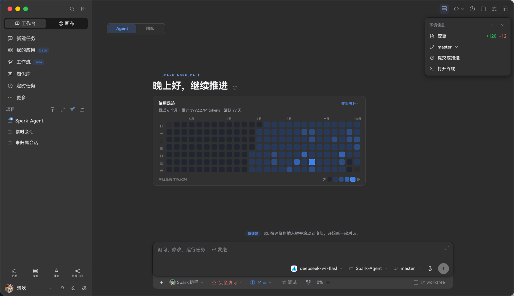

## 能力图解

下面八张图对应八条能力线的主链路；逐项细节见[官网文档中心](https://www.yiqibyte.com/docs)与[工程手册](https://alexanderizh.github.io/spark-agent/capabilities.html)。

<table>
<tr>
<td width="50%" valign="top">

**长期记忆：一轮对话的写入与读取闭环**

每轮结束异步抽取写入、每轮开始混合检索注入；写入过五道闸门，读取走 FTS5 与向量双路、RRF 融合后按 token 预算裁剪。

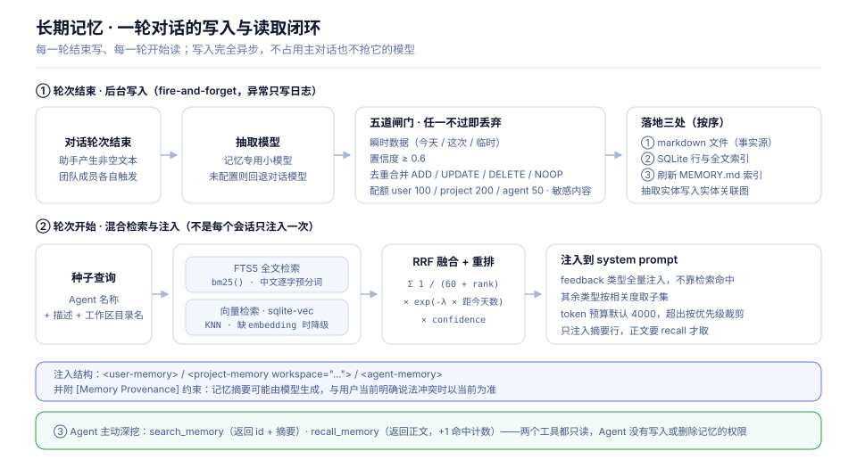

</td>
<td width="50%" valign="top">

**知识库：从生成到读取的架构**

三条生成管道（对话沉淀 / 技能提议 / Repo Wiki）都先出草案、再人工确认，写入收敛到同一原语；读取零预注入，人机同源，先检索、再按需取正文。

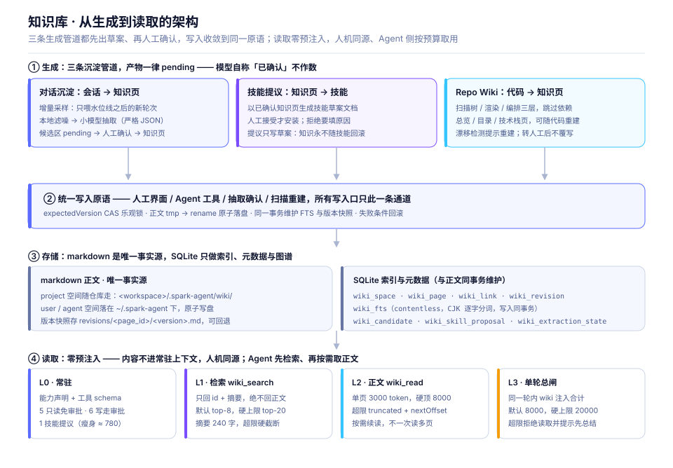

</td>
</tr>
<tr>
<td width="50%" valign="top">

**工作流：一张图的真实执行**

13 种节点类型经拓扑调度逐个真实派发：agent 节点是同一会话内的成员 turn，工具节点可配置成不经 LLM 的确定性直调；快照落库支持断点续跑。

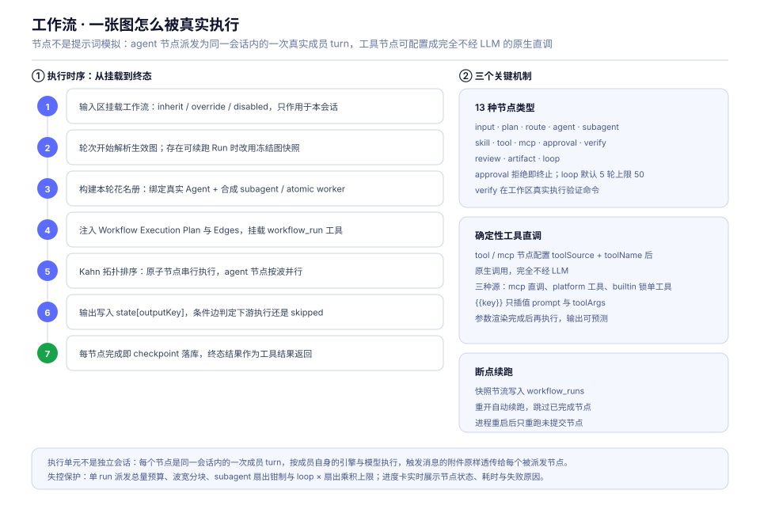

</td>
<td width="50%" valign="top">

**自定义工具：从工程到 Agent 工具面**

多文件工程安装为不可变版本，密钥只进系统凭据库；过完整门禁启用后挂进会话工具面，包变更下一轮热生效。

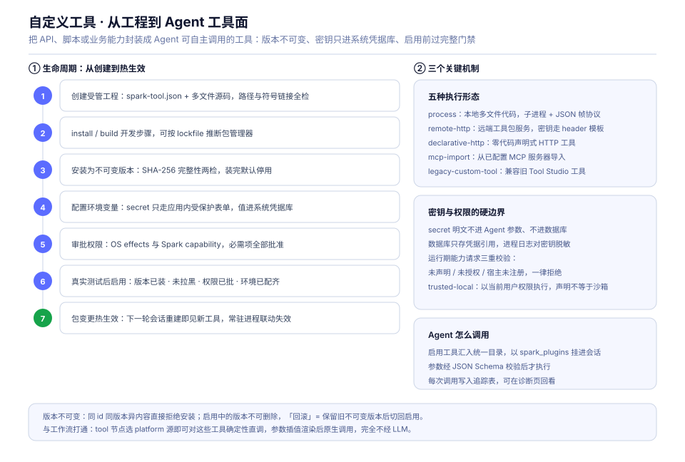

</td>
</tr>
<tr>
<td width="50%" valign="top">

**自动路由：一轮分流与降级阶梯**

分流器逐轮判强度，宿主在轮次开始前替换 provider 与 model；分流失败一律降级，不会中断本轮执行。

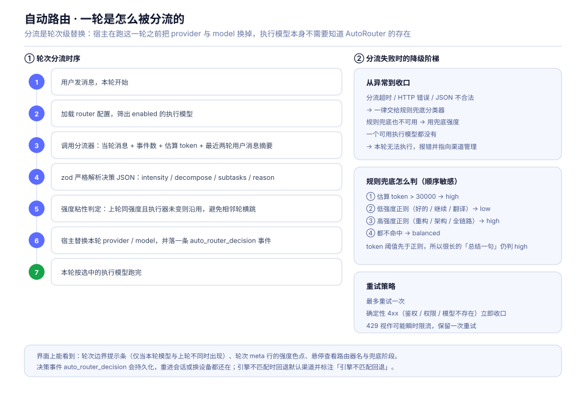

</td>
<td width="50%" valign="top">

**性能保护：采样、定级与四档滞回**

2 秒采样六类指标、逐项定级后取最高档，升级快降级慢；只有危急档才弹窗提醒，前两档只在性能页可见。

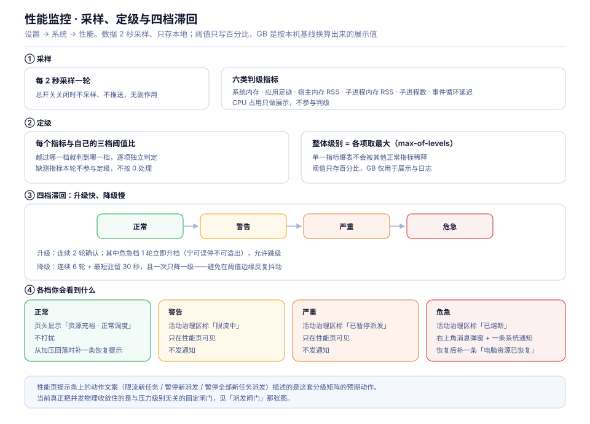

</td>
</tr>
<tr>
<td width="50%" valign="top">

**安全与密钥：一枚密钥的受控旅程**

密钥明文直接被拒，只走受保护表单进系统凭据库；环境变量按六级作用域合并注入子进程，hooks 分观察与可拦截双轨，全程日志脱敏。

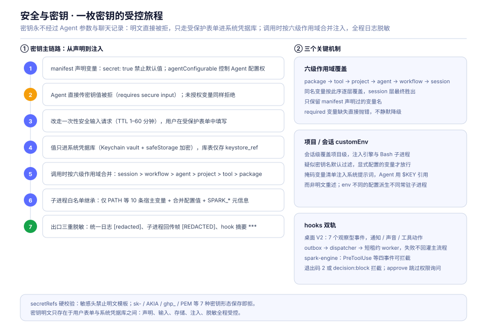

</td>
<td width="50%" valign="top">

**上下文工程：长上下文的节流与可信**

技能目录只注入元数据、全文按需加载；超长工具输出归档为内容寻址制品、按需读回；压缩只追加事件、档案无损可检；跨会话只读引用须显式授权。

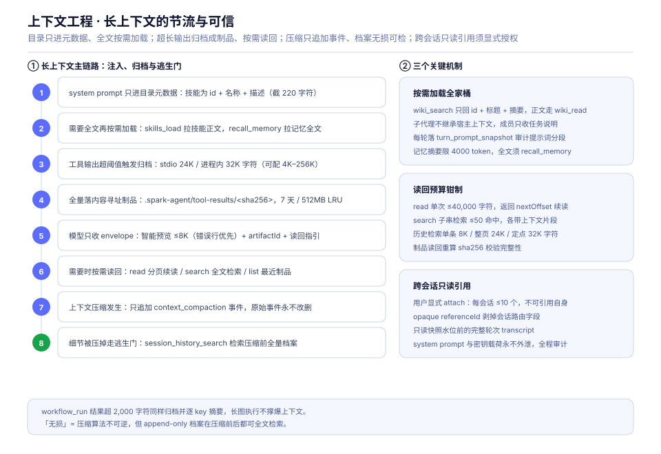

</td>
</tr>
</table>

记忆生命周期、知识库沉淀管道、router 组成与双池闸门这四张图在[工程手册 · 能力架构](https://alexanderizh.github.io/spark-agent/capabilities.html)里。

## 功能特性

### 🤖 Agent、工作流与团队

- 👤 **自定义 Agent**：为不同角色配置模型、提示词、权限、Skills、Rules、Hooks 和工具
- 🔀 **可视化工作流**：通过节点和连线编排输入、计划、Agent、工具、审批、验证与交付
- 🧷 **会话内挂载工作流**：在输入区为当前会话选择、覆盖或停用工作流，只作用于本会话，不改动 Agent 自身配置
- 👥 **团队 Agent**：Host 调度多个成员 Agent 分工执行，成员间可互相通信协作
- 🧠 **长期记忆**：按用户、项目和 Agent 三层隔离，每轮对话结束后台抽取、下一轮混合检索注入；支持记忆有效期、候选确认区与语义整合，旧记忆只标失效不删除
- 📖 **知识库（Wiki）**：把方案、教程与踩坑记录写成可检索、可双链、可回看版本的知识页；内容零预注入，读取受四层 token 预算约束，Agent 写入走审批
- 🗂 **看板任务面板**：待办、执行中、修复、完成与验收状态集中管理
- ⏱ **全局定时任务**：跨会话的计划任务调度

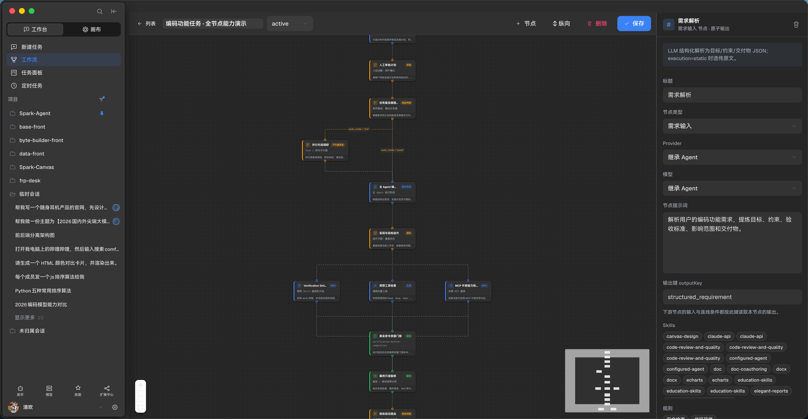

### 🧩 扩展生态与模型接入

- 🔧 **自定义工具**：把 API、脚本或业务能力封装成 Agent 可自主调用的工具；支持从空白、cURL、模板导入，定义输入 Schema，草稿与发布版本隔离，可测试、发布、启停与回滚，密钥进入加密凭据库
- 📦 **Tool Package**：多文件工具包统一管理运行环境、配置、权限与版本
- 🧩 **自定义应用（子应用）**：在对话中让 Agent 开发小应用，代码与数据独立保存，支持发布、回滚与归档，可运行在内容区、侧边面板、浮层、独立窗口或桌面宠物
- 🔌 **插件系统**：安装平台插件扩展 Agent 能力
- 📡 **远程连接**：将 Telegram、飞书、QQ、微信消息桥接进会话，在外部聊天中驱动 Agent
- ☁️ **多 Provider 管理**：OpenAI 兼容 / Anthropic 协议、自定义渠道与多媒体模型渠道统一管理
- 🧭 **自动路由**：配置「分流器 + 三档执行模型」后，逐轮判定任务强度并分派到对应档位；带强度粘性避免相邻轮横跳，分流失败走规则兜底而不是中断本轮


### ⚙️ 性能与资源保护

- 📊 **性能面板**：设置 → 系统 → 性能 一页看全资源总览、历史趋势、活动治理、最近降级与恢复事件，以及各项保护配置
- 🚦 **双池派发闸门**：后台子进程派发按形态分「主池 + 嵌套防死锁池」，由全局并发预算与成员并发硬顶双旋钮收敛，超出部分排队等待而不是同时启动
- 🛡 **四档压力分级**：六类指标逐项定级后取最高档（正常 / 警告 / 严重 / 危急），阈值只存百分比、按本机内存与 CPU 核数换算；升级快降级慢，只有危急档才会通知你

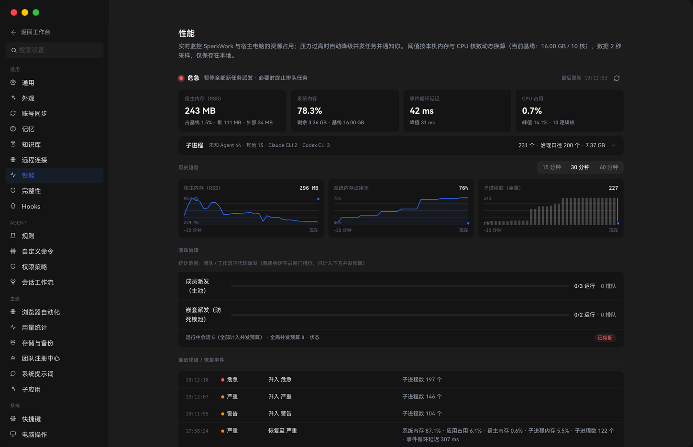

### 💬 工作台对话

与 Agent 协作的完整闭环：从输入、排队、审批到追问、分叉、定时唤醒，长任务不丢线索。

- 📎 **富输入**：文件 / 图片 / 目录引用一次最多挂 20 个；支持拖拽投递、粘贴图片、长文本粘贴自动转附件（不撑爆输入框）；每个会话独立保存草稿
- 🗣 **语音输入**：Ctrl+Shift+D 随时口述，实时转写追加到输入草稿
- 🔗 **三种上下文引用**：历史会话作为只读参考挂载、内置浏览器「选取元素」把网页片段变为上下文、代码查看器中选中代码一键插入为引用
- ⌨️ **命令**：内置命令 + 自定义命令（可增删、导入导出），输入 `/` 即达
- 🔄 **消息排队**：Agent 忙碌时继续输入即自动排队；队列支持拖动排序、编辑、单条立即执行与移除；回复异常时自动暂停且不丢消息，可切换模型后重试或跳过继续
- ✏️ **消息级操作**：任意用户消息可重发（原文与附件回填输入区）、从此处分支、回复指定消息或删除
- 💬 **结构化追问与快捷回复**：Agent 可发起单选 / 多选 / 填空的问题向导，支持前进后退与跳过；输入区上方还会给出可一键发送的快捷回复
- 📋 **计划审批**：计划模式下 Agent 先提交计划再动手，可批准、编辑后批准或拒绝，提案历史全程留痕
- 🛡 **分级权限审批**：工具调用内联审批卡，允许一次 / 会话内允许 / 拒绝 / 会话内拒绝四档控制
- 🎯 **目标验收契约**：用验收标准、约束与验证命令锁定目标，Agent 多轮迭代自检，轮次间自动小结并给出终态判定
- 🌿 **会话分叉**：从任意轮次派生新会话，携带已完成历史，与来源互不影响
- ⏰ **会话定时唤醒**：单次 / 固定间隔 / Cron 三种触发，到点自动在本会话继续任务，适合轮询与稍后跟进
- 📜 **历史导入**：并行扫描并导入 Codex、Claude Code、ZCode 的既有本地会话记录
- 🛰 **长任务稳定性**：流式断线自动重连、失败明细与一键重试、Codex 运行时缺失自动引导修复；运行中轮次实时显示耗时
- 🐞 **交互式调试**：疑难 Bug 走「假设 → 临时插桩 → 复现 → 验证 → 清理插桩」的人在回路闭环
- 🎁 **富输出**：Markdown 与代码高亮、HTML 交互沙箱、Mermaid / Markmap 图表（可全屏）、docx / xlsx / pptx / pdf 文档卡片、图片音频视频内联播放、diff 着色、带参数与耗时的工具调用卡片、可折叠思考过程、上下文压缩摘要、Computer Use 操作时间线

### 🖥️ 统一侧边面板

对话右侧是一套可多开、可切换的面板体系——任务的每个侧面都能边看边聊。

- 🖥 **终端**：多标签，支持新建 / 重命名 / 关闭，未读输出红点提示，切换标签不中断进程
- 📝 **代码**：Monaco 编辑器 + 文件树 + 文件搜索 + 全文搜索 + Git diff 视图，选中代码可直接插入为对话引用
- 🌐 **浏览器**：多标签与地址栏、视口尺寸预设、页面元素拾取进会话，可在面板与独立窗口之间切换
- 🔍 **代码审查**：按文件、按 Hunk 查看工作区改动、添加代码或文件到会话
- 📋 **计划**：审批进行中的计划，回看提案历史
- 💬 **侧聊**：不打断主线的辅助小会话，可随时切换或新建
- 🧩 **子应用**：面板型自定义应用自动入驻侧边面板
- 📊 **会话检查器**：随时展开的运行白盒——Token 用量与缓存命中率、TTFT / 中位吞吐 / 生成时间占比与慢轮标记、逐轮 Token 图表、上下文窗口软硬双水位、子 Agent 状态、Worktree 信息、项目上下文预算、两级环境变量与提示词快照

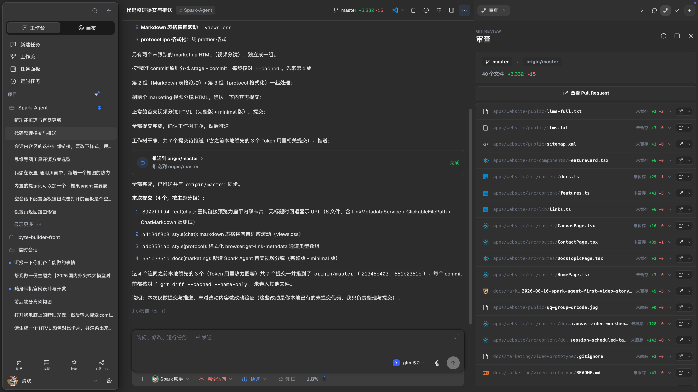

### 🗂 会话与任务管理

- 📚 **项目分组侧边栏**：项目与会话拖拽排序、置顶、时间筛选与搜索，会话标题由首轮内容自动生成
- ✅ **任务面板**：会话内 TodoList 实时展示完成度与各项状态
- 🗄 **还原点时间线**：自动记录每轮受影响的文件，可展开清单一键还原，还原前自动备份
- 🔔 **通知中心**：任务完成与异常集中提醒
- 🧭 **全局导航**：命令面板、会话搜索、Cmd+B 全局快捷任务（随时丢一个任务给 Agent 立即执行），快捷键均可在设置中改键
- 🔥 **用量热力图**：空会话首页直观回顾使用节奏

### 💻 开发与自动化

- 🌳 **独立工作区（Worktree）**：会话在单独分支目录中执行，多任务互不干扰
- 🖱️ **Computer Use**：按单次任务治理地操作本机应用，支持查看状态、接管与停止
- 🔧 **环境变量**：项目级与会话级配置，支持 JSON 一键导入导出

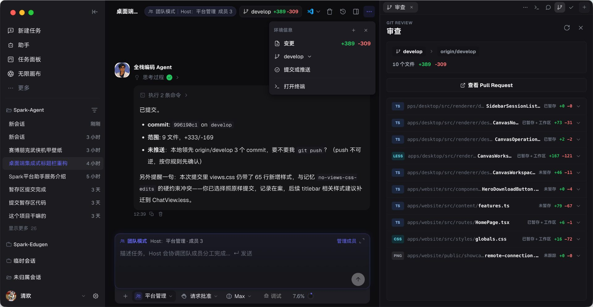

### 🎨 无限画布与多媒体创作

- 🖼 **无限画布**：缩放平移的画布上组织文本、图片、视频、音频与分组节点，保留来源关系
- 🤖 **画布 Agent**：读取当前选择与项目结构，创建、连接、整理节点并继续执行工作流
- 🎬 **多媒体生成**：文生图、图生图、图片编辑与合成、文生视频、图生视频、视频编辑、配音与语音转写
- ⚡ **快速创作**：在画布内直接发起图片/视频创作与提示词反推，可从页头切到独立窗口运行，与主界面共用同一套任务流与后台任务
- 🗃 **资产中心**：管理角色、场景、道具、分镜与生成结果，适合持续迭代的内容项目
- 🎞 **影视工具链**：分镜、关键帧、视频工作台、3D 导演台与 360° 全景
- 📄 **文档与演示生成**：课件、调研报告、数据分析报告，输出 HTML / PPTX / DOCX / Markdown

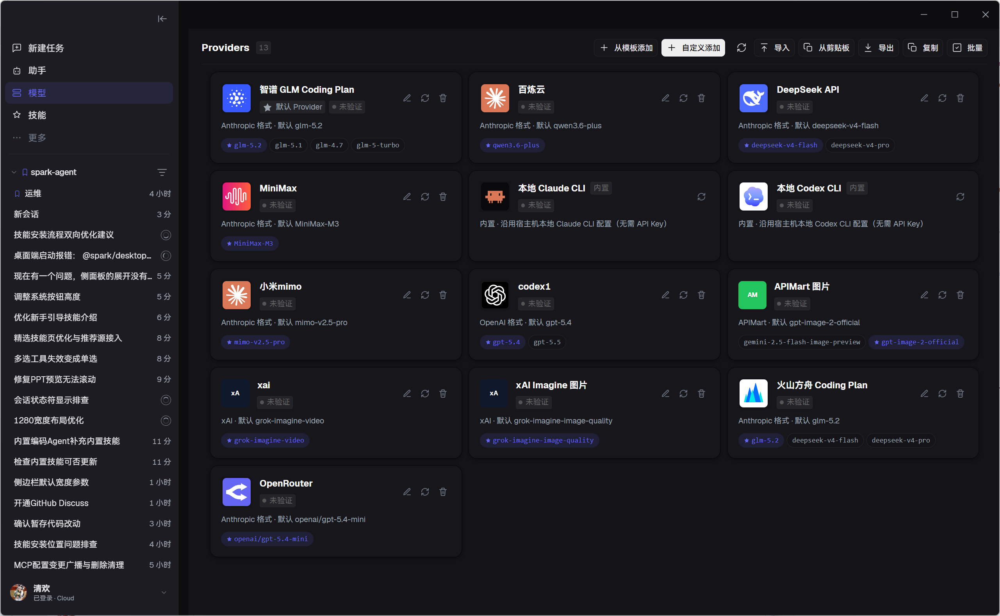

### 🔒 本地优先与安全

- 🗄 结构化数据保存在本地 SQLite，项目文件与生成产物留在本地工作区
- 🔐 敏感凭据通过系统凭据能力与加密凭据库管理，不写入普通项目配置
- 🛡 文件、命令、网络、桌面操作和外部工具受权限模式与工具策略控制
- 🎨 深浅色主题、多窗口（画布 / 浏览器独立窗口）等桌面级体验

## 下载安装

在 [GitHub Releases](https://github.com/alexanderizh/spark-agent/releases) 获取最新安装包：

| 平台    | 格式                 |
| ------- | -------------------- |
| macOS   | `.dmg`               |
| Windows | `.exe` / NSIS 安装包 |
| Linux   | `.AppImage` / `.deb` |

> 桌面应用已内置 spark-engine（SDK 进程内运行），日常使用无需额外安装 CLI。

### Spark CLI（可选）

仅当需要在终端里使用 `spark` 命令 / TUI 时才单独安装；CLI 与桌面应用共用 `~/.spark` 数据根，可复用桌面端已配置的渠道凭据。

**macOS / Linux**（要求 Node.js `>=22.14 <23`）：

```sh
curl -fsSL https://raw.githubusercontent.com/alexanderizh/spark-agent/spark-cli-releases/install.sh | sh
```

**Windows**（PowerShell）：

```powershell
irm https://raw.githubusercontent.com/alexanderizh/spark-agent/spark-cli-releases/install.ps1 | iex
```

安装脚本会下载对应版本的 npm tarball 并对照 `latest.json` 校验 sha256，支持指定版本与离线安装：

```sh
sh install.sh --version 0.4.0            # 安装固定版本
sh install.sh --tarball ./spark-agent-0.4.0.tgz   # 本地 tarball 离线安装
```

**更新**（事务式自更新，失败自动回滚）：

```sh
spark update                     # 检查并更新到最新版
spark update --check             # 仅检查是否有新版本
spark update --target 0.4.0      # 安装 / 回退到指定版本
spark update --allow-prerelease  # 允许预发布版本
```

安装或更新后运行 `spark --version` 与 `spark doctor` 验证环境。

首次启动会在选择器里选一次模型，之后选择会写入 `~/.spark/config.toml`（`[agent].model`）自动复用，不再每次询问；切换用 `/model` 或 `spark --model <route-id>`（仅当次生效）。

**会话管理**：会话按目录持久化在 `~/.spark/projects/` 下，可随时恢复：

```sh
spark --continue            # 继续当前目录最近一次会话（-c）
spark --resume              # 打开会话选择器（TUI 内也可用 /sessions 切换）
spark --resume <session-id> # 恢复指定会话
spark sessions              # 列出当前目录的历史会话
```

## 快速开始

1. 安装应用，配置一种 Provider（OpenAI 兼容 / Anthropic 协议），或启用本地 Claude / Codex CLI
2. 新建临时会话，或打开一个本地项目
3. 描述目标，按需附加文件、目录、图片或引用其他会话；Agent 提交计划后确认执行
4. 在对话右侧打开终端、代码、浏览器或审查面板边看边聊，继续追问、调整消息队列或从还原点回退

## 从源码构建

### 环境要求

- Node.js `>=22.14.0 <23`
- pnpm `>=11.13.0 <12`
- Git

Windows 从源码安装时建议准备 Visual Studio Build Tools，以便构建 `better-sqlite3`、`keytar` 等原生依赖。

```bash
git clone https://github.com/alexanderizh/spark-agent.git
cd spark-agent
pnpm install
pnpm dev
```

常用检查与打包：

```bash
pnpm typecheck   # 类型检查
pnpm lint        # 代码检查
pnpm test        # 单元测试
pnpm build       # 构建

pnpm --filter @spark/desktop build:mac    # macOS 打包
pnpm --filter @spark/desktop build:win    # Windows 打包
pnpm --filter @spark/desktop build:linux  # Linux 打包
```

## 📦 项目结构

```text
spark-agent/
├── apps/
│   ├── desktop/        # Electron 桌面应用（主进程 + React 渲染端）
│   └── website/        # 旧官网（已停更，见 apps/website/DEPRECATED.md）与 README 截图素材
├── packages/
│   ├── agent-runtime/  # 会话运行时与服务编排
│   ├── protocol/       # 跨进程 IPC 协议与类型
│   ├── storage/        # SQLite 存储层
│   ├── shared/         # 跨进程共享工具
│   ├── ui-kit/         # 共享 UI 组件
│   └── plugin-sdk/     # 插件 SDK
└── spark-engine/       # 终端交互子项目
```

主要技术栈：Electron 43 · React 19 · TypeScript · Tailwind CSS · Ant Design · XYFlow · Claude Agent SDK · Codex · MCP · SQLite · pnpm workspace · Vitest · Playwright

## 🤝 参与贡献

欢迎提交 Issue 和 Pull Request。提交前建议运行：

```bash
pnpm typecheck && pnpm lint && pnpm test
```

如果发现安全问题，请不要在公开 Issue 中披露敏感细节，请先通过仓库维护者提供的私有联系方式沟通。

## 🧑‍💻 贡献者

感谢每一位为 SparkWork 贡献代码的人：

<a href="https://github.com/RileyBear013" title="RileyBear013">
  
</a>
<a href="https://github.com/fizzlx001" title="fizzlx001">
  
</a>

## ⭐ Star History

<a href="https://star-history.dera.page/#alexanderizh/spark-agent&Date">
  <picture>
    <source media="(prefers-color-scheme: dark)" srcset="https://star-history.dera.page/svg?repos=alexanderizh/spark-agent&type=Date&theme=dark" />
    <source media="(prefers-color-scheme: light)" srcset="https://star-history.dera.page/svg?repos=alexanderizh/spark-agent&type=Date" />
    
  </picture>
</a>

## 许可证

本项目使用基于 Apache License 2.0、附加个人用途限制的许可证，详情见 [LICENSE](LICENSE)。个人学习、研究、评估与非商业自用可以使用；公司/机构内部使用、客户交付、付费服务或其他商业用途需要事先获得书面授权。

该许可证不是标准 SPDX `Apache-2.0` 许可证。

---

<div align="center">
<sub>Built with Electron · React · TypeScript · pnpm.</sub>
</div>
