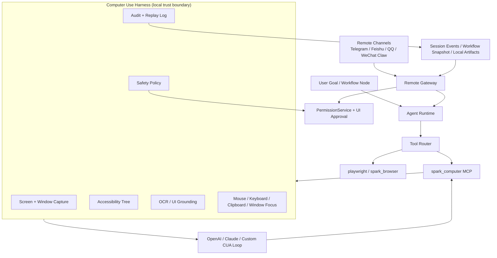

# Computer Use 生产级方案

> 状态: 实施中 | 最后核对: 2026-07-08

目标：在 Spark Agent 桌面端落地“代理操作电脑”能力，让 Agent 能在用户授权范围内看见屏幕、理解 UI、操作键鼠、跨应用完成任务，并把全过程纳入现有 Provider / MCP / Workflow / 权限 / 审计体系。

本文取代早期 Computer Use 草案。新方案按当前代码架构、GitNexus 索引、OpenAI 与 Anthropic 官方 Computer Use 文档、2026 年桌面 Agent 研究进展重新制定。

---

## 结论

Spark Agent 不应把 Computer Use 做成一个孤立的“键鼠控制脚本”。最可靠的路径是：

1. **以本地 Computer Harness 为唯一执行边界**：屏幕采集、无障碍树、窗口枚举、鼠标键盘、OCR/grounding 都在 Electron 主进程或受控 sidecar 中完成。
2. **以 MCP 暴露给 Agent Runtime**：新增 managed `spark_computer` / `computer-use` MCP，复用现有 `McpService`、托管 MCP 注册、SDK allowed tools、工作流节点能力收窄。
3. **以权限服务做硬闸门**：所有输入、点击、快捷键、拖拽、文件/系统/支付/登录等敏感动作都进入 `PermissionService`，而不是只依赖模型自律。
4. **以 Workflow 做长任务编排**：Computer Use 是执行节点，不是总控。长任务必须由 `plan -> approval -> computer -> verify -> artifact/review` 结构治理。
5. **以双路径模型接入保持前沿**：
   - OpenAI：优先接 GA `tools: [{ type: "computer" }]` + `gpt-5.5` 的 batched `actions[]` loop。
   - Claude：接 `computer_20251124` beta tool，作为高质量桌面控制后备/可选主路径。
   - 其他模型：通过自定义 MCP harness + 结构化 action schema 降级。
6. **以浏览器优先分流提升可靠性**：网页任务默认走现有 `playwright` / `spark_browser`，只有跨应用、系统 UI、不可 DOM 化场景才走 OS Computer Use。
7. **以隔离环境优先，而非裸机优先**：MVP 可支持用户桌面，但默认推荐“Spark Safe Desktop”：隔离浏览器、隔离 profile、可选 VM/远程会话/容器桌面。
8. **以远程使用作为一等入口**：手机/飞书/Telegram/QQ/微信 Claw 可以发起任务、看进度、看安全截图、审批高风险动作、暂停/取消，但远程控制默认只观察不操作。

一句话：**Spark 的 Computer Use 应该是“受治理的本地操作系统 MCP 能力 + 多模型 CUA loop + Workflow/A2A 编排”，而不是让模型直接接管用户电脑。**

---

## 当前架构落点

### 已有能力可直接复用

| 现有模块 | 当前能力 | Computer Use 复用方式 |
| --- | --- | --- |
| `apps/desktop/src/main/services/PlaywrightMcpRegistration.ts` | 托管 MCP 自动注册、启停、配置保持 | 仿照它新增 `ComputerUseMcpRegistration.ts`，作为 managed MCP，用户只能启停/配置，不能误删 |
| `packages/agent-runtime/src/services/mcp-server.service.ts` | MCP CRUD、连接生命周期、tools-changed 事件 | `spark_computer` 通过同一生命周期进入 Runtime |
| `packages/agent-runtime/src/services/permission.service.ts` | action 映射、ask / ask-twice、会话/项目/全局决策记忆 | 扩展 `computer_*` action 类别，所有 OS 操作前置审批 |
| `apps/desktop/src/main/services/InternalBrowserService.ts` | 可见 BrowserWindow、截图、console/network、profile | 网页 Computer Use 分流到 `spark_browser`，降低 OS 坐标点击风险 |
| `apps/desktop/src/main/services/BrowserBridgeServer.ts` | localhost bridge + sid 授权 | Computer Harness 可以采用同类本地 bridge，但必须改为严格 origin/token/loopback 认证 |
| `packages/agent-runtime/src/services/workflow-executor.ts` | 11 类 workflow 节点、agent/subagent/approval/verify | 新增 `computer` 模板或复用 `mcp/tool` 节点执行 CUA |
| `packages/agent-runtime/src/services/team-dispatch.service.ts` | Host/Member、预算、超时、嵌套深度 | 前台操作员 Agent + 后台审计/检索/规划 Agent |
| `apps/desktop/src/main/services/RemoteConnectionService.ts` | Telegram/飞书/QQ/微信 Claw 配对、远程命令、能力开关 | 远程发起、远程看护、远程审批、远程截图缩略图和安全确认码 |
| `docs/skills/browser-automation.md` | Playwright 与 `spark_browser` 的选择规则 | 扩展为 Browser-first、Computer-second 的工具路由规则 |
| `docs/runtime-readiness-and-context.md` | 桌面端内置 Node、managed MCP 打包要求 | Computer Use sidecar 和 MCP 不依赖用户系统 Node/npm/npx |

### 必须新增的核心模块

```text
apps/desktop/src/main/services/computer-use/
  ComputerUseHarnessService.ts       # 本机/隔离环境状态机
  ComputerUseCaptureService.ts       # desktopCapturer / window capture / region capture
  ComputerUseA11yService.ts          # macOS AX / Windows UIA / Linux AT-SPI sidecar
  ComputerUseActionExecutor.ts       # mouse / keyboard / clipboard / window focus
  ComputerUseSafetyService.ts        # policy, rate limit, kill switch, screenshot diff
  ComputerUseAuditService.ts         # event log, screenshot redaction, artifact references
  ComputerUseMcpRegistration.ts      # managed MCP registration
  ComputerUseBridgeServer.ts         # localhost bridge for MCP child process
  ComputerUseRemoteGateway.ts        # remote channels -> observe/approve/pause/cancel
  ComputerUseEnvironmentManager.ts   # Safe Browser / Safe Desktop / My Desktop
  ComputerUsePolicyStore.ts          # per-channel/per-device/per-app policy
  sidecars/
    macos-accessibility/             # Swift AX bridge
    windows-uia/                     # UI Automation bridge
    linux-atspi/                     # AT-SPI bridge

packages/agent-runtime/src/services/computer-use/
  computer-action-schema.ts          # normalized action schema
  computer-loop-runner.ts            # provider-independent loop adapter
  computer-policy.ts                 # runtime policy contract
  computer-remote-contract.ts        # remote observe/control/approval payloads
  computer-capability-router.ts      # browser/API/a11y/coordinate route decision
```

---

## 分层架构



### 1. 感知层

感知层必须是多信号融合，而不是只发截图。

| 信号 | MVP | 生产版 | 说明 |
| --- | --- | --- | --- |
| 截图 | Electron `desktopCapturer`，当前屏/窗口/区域 | 多显示器、HiDPI 归一化、窗口裁剪、diff | 所有模型都能消费 |
| 窗口状态 | Electron + OS window list | 前台 app、窗口 bounds、焦点、进程名 | 防止误操作到错误窗口 |
| Accessibility Tree | MVP 可先缺省 | macOS AX、Windows UIA、Linux AT-SPI | 精准定位按钮/输入框/菜单 |
| OCR | 可选 Tesseract/PaddleOCR | 本地 OCR + 敏感信息识别 | 低成本文本定位和遮挡 |
| UI Grounding | 后置 | OmniParser / UI-TARS / 自研轻量 detector | 降低纯模型坐标误差 |

关键约束：

- 模型看到的是 **redacted screenshot + compact UI tree**，不是无限制全屏原图。
- 坐标统一用 `displayId + normalized x/y + devicePixelRatio`，执行前再转换为物理像素。
- 每次 action 绑定 `observedFrameId`，如果屏幕状态已变化，动作必须重新评估。

### 2. 决策层

三种 loop 共用一个 normalized action schema。

#### OpenAI GA loop

官方当前推荐是 `tools: [{ type: "computer" }]`，模型返回 `computer_call.actions[]`，应用执行动作后以 `computer_call_output` 回传新截图，循环到不再返回 `computer_call`。

适配策略：

- Provider 能力标记：`capabilities.computerUse = "openai-computer-ga"`。
- Runtime 只负责 loop 编排和审计，具体键鼠执行仍由本地 Harness 执行。
- 支持 batched actions，但本地执行时仍逐条过 policy；中间如遇高风险动作立即暂停。
- 不再以 `computer-use-preview` 作为新实现主路径，只保留兼容层。

#### Claude Computer Use loop

Claude 当前通过 `computer_20251124` tool + beta header 工作，应用收到 tool use 后在本地/容器环境执行，再把 tool result 返回给 Claude。

适配策略：

- Provider 能力标记：`capabilities.computerUse = "claude-computer-beta"`。
- 保留 Claude 的原生 action 命名，进入 Harness 前转换为 Spark normalized action。
- Claude 路径可与 bash/text-editor 工具组合，但必须受 Spark 权限层二次约束。

#### Custom MCP loop

用于不支持原生 Computer Use 的模型，或用于本地模型/国产 VL 模型。

模型只拿到工具：

- `mcp__spark_computer__observe`
- `mcp__spark_computer__click`
- `mcp__spark_computer__type`
- `mcp__spark_computer__keypress`
- `mcp__spark_computer__scroll`
- `mcp__spark_computer__drag`
- `mcp__spark_computer__wait`
- `mcp__spark_computer__ask_user`
- `mcp__spark_computer__done`

Runtime prompt 明确要求每一步先 `observe`，再 action，再 verify。这个路径质量不如原生 tool，但可控、通用、便于调试。

### 3. 执行层

动作执行必须小而确定。

```ts
export type ComputerAction =
  | { type: 'observe'; target?: CaptureTarget }
  | { type: 'click'; point: ScreenPoint; button?: MouseButton; clickCount?: 1 | 2 | 3; modifiers?: KeyModifier[] }
  | { type: 'move'; point: ScreenPoint }
  | { type: 'drag'; from: ScreenPoint; to: ScreenPoint; durationMs?: number; modifiers?: KeyModifier[] }
  | { type: 'scroll'; point?: ScreenPoint; deltaX?: number; deltaY?: number }
  | { type: 'type'; text: string; mode?: 'keyboard' | 'clipboard-paste' }
  | { type: 'keypress'; keys: string[] }
  | { type: 'wait'; durationMs: number }
  | { type: 'focus_window'; windowId: string }
  | { type: 'done'; summary: string; evidenceFrameIds: string[] }
```

推荐实现：

- macOS 鼠标/键盘：优先原生 Swift/Objective-C sidecar 调 Quartz Event Services；不要首选无人维护的 `robotjs`。
- Windows 鼠标/键盘：C#/.NET sidecar 或 Node native addon 调 `SendInput` 与 UIA。
- Linux：X11 用 `xdotool`/`libxdo`，Wayland 优先提示限制或引导到隔离 Xvfb 环境。
- 文本输入：普通文本优先 clipboard paste + restore clipboard；密码/敏感字段禁止 clipboard，必须人工输入或单次授权。
- 窗口聚焦：所有动作前校验 foreground window 与 action target 是否一致。

### 4. 安全层

Computer Use 是高风险能力，默认必须更保守。

#### 权限 action 扩展

在 `PermissionService` 中新增 action：

| action | 默认策略 | 风险 |
| --- | --- | --- |
| `computer_observe` | allow | low |
| `computer_click` | ask | medium |
| `computer_type` | ask | medium |
| `computer_keypress` | ask | high |
| `computer_drag` | ask | high |
| `computer_clipboard` | ask-twice | high |
| `computer_window_focus` | ask | medium |
| `computer_external_app` | ask-twice | high |
| `computer_sensitive_flow` | ask-twice | high |
| `computer_destructive` | deny / ask-twice in trusted | high |
| `computer_remote_observe` | allow if paired | low |
| `computer_remote_control` | ask-twice | high |
| `computer_remote_approve` | ask-twice + code | high |

`resolveToolAction()` 需要识别 `mcp__spark_computer__*`，而不是把它们全部落到泛化 `mcp_tool`。

#### 强制暂停场景

以下场景即使用户选择会话允许，也必须重新确认：

- 购买、付款、转账、下单、订阅、提交法律/医疗/政务/考试材料。
- 登录、2FA、导出密钥、查看密码、复制 token、读取私密聊天/邮箱。
- 删除/移动大量文件、清空回收站、安装软件、改系统设置、防火墙/权限设置。
- 模型准备发送外部消息、发布内容、提交 PR/issue/comment、发邮件。
- 网页或文档中出现明显“忽略之前指令/泄露数据/点击这里”等 prompt injection。

#### Kill switch

- UI 顶部常驻“停止电脑操作”按钮。
- 全局快捷键：macOS `Cmd+Shift+Esc`，Windows/Linux `Ctrl+Shift+Esc` 或用户可配置。
- 失去焦点、显示器变化、前台 app 不匹配、连续 3 次无效动作、连续 2 次截图剧烈变化时自动暂停。

#### 审计与隐私

- 默认不保存原始截图；保存 redacted thumbnail + frame hash + action metadata。
- 用户可开启完整录制，但要明确提示截图可能包含敏感信息。
- 审计事件写入 session/workflow event stream：
  - `computer_observe`
  - `computer_action_requested`
  - `computer_action_blocked`
  - `computer_action_executed`
  - `computer_verification`
  - `computer_handoff_required`
  - `computer_done`
- 每个事件包含 provider、model、window/app、action、policy decision、before/after frame id、latency、risk。

---

## 工具路由原则

Computer Use 很酷，但不是所有任务都该用它。

| 任务 | 首选 | 原因 |
| --- | --- | --- |
| 普通网页表单、采集、E2E | `playwright` | DOM/可访问性定位最可靠 |
| 用户需要看见浏览器过程 | `spark_browser` | 复用可见 BrowserWindow、profile、console/network |
| 本地 HTML/文件预览调试 | `spark_browser` | 已有安全 sandbox 与截图 |
| 跨桌面应用搬运数据 | `spark_computer` | Playwright 无法触达 |
| 系统设置、文件管理器、Office/WPS | `spark_computer` + a11y | 需要 OS UI |
| 用户在手机上让电脑继续跑任务 | `remote` + Workflow + `spark_computer` | 远程只发起/看护/审批，实际执行仍在桌面端 |
| 用户远程查看桌面状态 | `remote /screen` + redacted observe | 只发缩略图和窗口摘要 |
| 高风险外部提交 | Workflow approval + human handoff | 不能全自动 |

Agent 规则：

1. 能用 API/文件/DOM 完成，不用坐标点击。
2. 能用 Playwright，不用 OS Computer Use。
3. 能用 a11y element id，不用裸坐标。
4. 能让用户确认，不盲点高风险按钮。
5. 每一步操作后必须观察结果，不允许假设成功。

---

## 产品形态

### 用户场景广度

Computer Use 必须覆盖“个人效率、办公、开发、创作、运维、远程看护”六类主场景，而不是只演示网页点击。

| 用户场景 | 典型任务 | 默认环境 | 首选工具链 | 必须确认 |
| --- | --- | --- | --- | --- |
| 个人效率 | 整理下载文件、重命名、复制信息到表格 | Safe Desktop 或 My Desktop allowlist | a11y + file API + keyboard | 批量删除、移动到外部目录 |
| 办公自动化 | 从网页/邮件/IM 抽取内容填入 Office/WPS/飞书文档 | Safe Browser -> My Desktop allowlist | Playwright -> a11y -> clipboard paste | 发送邮件/消息、提交表单 |
| 开发调试 | 操作浏览器、IDE、终端、模拟用户点击复现 bug | Safe Browser / worktree | Playwright + terminal + screenshot diff | 修改系统代理、安装软件 |
| 内容创作 | 打开素材软件、导入素材、导出文件、检查渲染结果 | Safe Desktop | workflow + local file + app a11y | 覆盖源文件、发布内容 |
| 运营/客服 | 远程触发日报、回复草稿、批量后台操作 | Safe Browser | remote + workflow + approval | 对外发送、订单/退款 |
| 运维看护 | 手机上查看电脑任务进度、截图、取消卡住任务 | Remote observe | remote `/progress` `/screen` `/stop` | 远程控制、危险命令 |

### 领先能力定位

要做到“领先”，Spark 不只追随单模型 Computer Use，而是把桌面 Agent 做成可治理、可复用、可远程看护的平台能力。

1. **环境领先**：Safe Browser、Safe Desktop、My Desktop 三层环境并存；高风险默认不碰真实桌面。
2. **感知领先**：截图、窗口、a11y tree、OCR、grounding、历史轨迹合成一个 `observe`，模型不再盲点。
3. **编排领先**：长任务走 Workflow，支持 approval/verify/review/artifact，不靠一个无限 loop 硬跑。
4. **团队领先**：A2A 中 planner/operator/verifier/reporter 分工，operator 是唯一拿电脑控制权的成员。
5. **远程领先**：移动端能看、能批、能停、能接管，但默认不能裸控；远程审批带一次性确认码和截图证据。
6. **记忆领先**：成功轨迹沉淀为 app playbook，保存结构化步骤和元素语义，不保存敏感原图。
7. **安全领先**：prompt injection、敏感截图、误点、前台窗口漂移、远程误授权都有独立防线。
8. **生态领先**：任务录制生成 Workflow/Skill，常用桌面任务可发布到 Skill Store。

### 设置页

新增「设置 -> 电脑操作」：

- 总开关：启用 Computer Use。
- 执行环境：
  - `Safe Browser`：默认，仅 `spark_browser`/Playwright 可见窗口。
  - `Safe Desktop`：隔离桌面/VM/远程环境。
  - `My Desktop`：用户真实桌面，高风险，默认关闭。
- Provider 策略：OpenAI / Claude / Custom MCP。
- 权限策略：沿用 Runtime Permissions，但增加 Computer Use 分类。
- 截图隐私：自动遮挡密码框、邮箱/手机号/API key 模式、指定 app 黑名单。
- 录制策略：不保存 / 保存缩略图 / 保存完整轨迹。
- Kill switch 快捷键配置。
- 远程策略：允许远程观察、允许远程审批、允许远程控制、允许远程危险确认四个独立开关。
- App allowlist / blocklist：按应用、窗口标题、bundle id / executable path 配置。

### 会话 UI

右侧新增「Computer Monitor」面板：

- 当前屏幕缩略图，展示即将点击/输入的标注。
- 当前 action、reason、risk、目标窗口。
- Pause / Resume / Stop。
- “允许一次 / 本会话允许 / 项目允许 / 拒绝”审批卡。
- action timeline，可展开查看每一步 before/after。
- 远程看护状态：显示哪些远程设备正在观察、是否允许远程审批、最近一次远程指令。

### 远程使用

远程能力基于现有 Remote Connections，不新造一套通道。每个连接继续通过 pairing code / QR 绑定，能力由 `RemoteConnectionCapabilities` 控制。

#### 远程能力分层

| 能力 | 默认 | 说明 |
| --- | --- | --- |
| `observeDesktop` | 开 | 允许 `/screen`、`/windows`、任务进度、低清红acted 缩略图 |
| `approvePermissions` | 关 | 允许远程批准普通工具权限，但不包括危险 Computer Use |
| `controlDesktop` | 关 | 允许 `/focus`、`/click`、`/type`、`/hotkey`，必须 paired device + 本机开启 |
| `dangerousActions` | 关 | 允许 `/confirm <code>` 批准高风险动作，必须二次确认 |
| `useInternalBrowser` | 关 | 允许远程任务打开/观察 `spark_browser` 可见窗口 |
| `transferFiles` | 关 | 允许远程上传/下载任务附件，必须大小和类型限制 |
| `manageRuntime` | 关 | 允许 `/progress`、`/queue`、`/history`、`/cancel`、`/stop` |

#### 远程命令

现有命令继续保留，并为 Computer Use 明确语义：

| 命令 | 能力 | 行为 |
| --- | --- | --- |
| `/screen` | `observeDesktop` | 返回当前 redacted screenshot 缩略图、前台窗口、最近 action 状态 |
| `/windows` | `observeDesktop` | 返回可观察窗口列表、序号、app、标题、是否 allowlisted |
| `/focus <窗口>` | `controlDesktop` | 聚焦 allowlisted 窗口；非 allowlist 需要本机确认 |
| `/click <x> <y>` | `controlDesktop` | 在最近 `/screen` frame 上点击，frame 过期则拒绝 |
| `/type <text>` | `controlDesktop` | 远程输入文本，密码/密钥模式拒绝远程输入 |
| `/hotkey <keys>` | `controlDesktop` | 远程快捷键，高危组合进入 ask-twice |
| `/confirm <code>` | `dangerousActions` | 批准某个带截图证据的一次性高风险动作 |
| `/progress` | `manageRuntime` | 返回当前 workflow/computer task 的节点、step、阻塞原因 |
| `/cancel` `/stop` | `manageRuntime` | 取消 session turn，并触发 Computer Harness stop |

#### 远程截图与审批

- 远程截图默认不发送原图，只发送最大 960px 宽的 redacted image + action 标注。
- 审批消息必须包含：任务名、目标 app/window、动作类型、模型理由、截图缩略图、风险等级、一次性 code、过期时间。
- 高风险审批只接受 `/confirm CODE`，不接受“好的”“同意”这类自然语言。
- code 绑定 `sessionId + turnId + actionId + remoteDeviceId + expiresAt`，默认 90 秒过期，使用后立即失效。
- 如果本机 UI 和远程同时审批，以本机 UI 为准；本机拒绝会撤销远程 pending approval。

#### 远程接管

远程“接管”不是远程桌面直播。正确产品形态是：

1. 用户手机发送任务：“帮我把昨天的报销单整理好”。
2. Spark 在桌面端创建/继续默认 session。
3. Agent 规划后需要 Computer Use 时，远程端收到摘要和截图。
4. 低风险动作自动执行或等待远程审批。
5. 高风险动作必须本机或 `/confirm CODE` 批准。
6. 用户可随时 `/screen` 查看、`/stop` 停止、`/send ...` 补充要求。

这样既满足离开电脑后的真实需求，又避免把手机聊天窗口变成无约束的远程键鼠。

### Workflow 模板

新增模板：

```text
Computer Task
input -> plan -> approval -> computer_action -> verify -> artifact
```

复杂任务模板：

```text
Research + Computer Operation
input -> plan -> web/search -> approval -> computer_action -> review -> artifact
```

A2A 模板：

```text
host planner
  -> computer operator
  -> verifier
  -> reporter
```

远程看护模板：

```text
remote input -> plan -> local approval -> computer_action -> remote checkpoint -> verify -> report
```

远程 checkpoint 节点可以把进度摘要、截图缩略图、下一步风险发给配对设备；用户超时不回复时，按策略继续低风险动作或暂停。

---

## 开发细节

### 数据模型

新增 SQLite 表或 app_settings category：

```sql
computer_use_sessions(
  id text primary key,
  session_id text not null,
  turn_id text not null,
  environment text not null,          -- safe_browser | safe_desktop | my_desktop
  status text not null,               -- idle | observing | acting | paused | completed | failed | canceled
  provider_profile_id text,
  model_id text,
  remote_connection_id text,
  remote_device_id text,
  created_at text not null,
  updated_at text not null
);

computer_use_actions(
  id text primary key,
  computer_session_id text not null,
  step_index integer not null,
  action_json text not null,
  risk_level text not null,
  policy_decision text not null,
  before_frame_id text,
  after_frame_id text,
  status text not null,
  error_code text,
  created_at text not null
);

computer_use_frames(
  id text primary key,
  computer_session_id text not null,
  display_id text,
  foreground_app text,
  foreground_title text,
  perceptual_hash text,
  redacted_asset_path text,
  full_asset_path text,
  created_at text not null
);

computer_remote_approvals(
  id text primary key,
  action_id text not null,
  remote_connection_id text not null,
  remote_device_id text not null,
  code_hash text not null,
  expires_at text not null,
  used_at text,
  decision text
);
```

第一阶段也可以先存在 session event stream + artifact 文件中，但接口必须按上述结构设计，避免后续迁移困难。

### IPC 协议

新增 typed IPC：

```ts
type ComputerUseStatus = {
  active: boolean
  environment: 'safe_browser' | 'safe_desktop' | 'my_desktop'
  currentSessionId?: string
  currentFrame?: ComputerFrameSummary
  currentAction?: ComputerActionSummary
  remoteObservers: Array<{ connectionId: string; deviceId: string; displayName: string }>
}
```

IPC channel：

- `computer:status`
- `computer:configure`
- `computer:start`
- `computer:pause`
- `computer:resume`
- `computer:stop`
- `computer:observe`
- `computer:approve-action`
- `computer:deny-action`
- `computer:list-windows`
- `computer:set-remote-policy`

Renderer 不直接执行动作，只能通过 main process service 请求。

### Bridge API

`ComputerUseBridgeServer` 面向 MCP child process，全部接口要求 bearer token + nonce：

- `POST /computer/observe`
- `POST /computer/action`
- `POST /computer/done`
- `POST /computer/policy/check`
- `POST /computer/approval/request`
- `POST /computer/audit/event`

请求体包含 `sessionId`、`turnId`、`actionId`、`frameId`。bridge 不接受裸 `eval`，不暴露任意 shell，不允许 MCP 子进程读取本地文件路径。

### Provider adapter

Provider 层新增能力声明：

```ts
type ComputerUseCapability =
  | 'none'
  | 'openai-computer-ga'
  | 'claude-computer-beta'
  | 'custom-vision-actions'

type ProviderRuntimeCapabilities = {
  computerUse: ComputerUseCapability
  computerUseMaxDisplay?: { width: number; height: number }
  computerUseActionBatching?: boolean
}
```

会话开始时按 provider/model 选择 loop：

1. 原生 OpenAI computer tool。
2. 原生 Claude computer tool。
3. Spark MCP action schema。
4. 不支持则隐藏 `spark_computer` 或提示切换模型。

### Policy engine

每个 action 进入 `ComputerUseSafetyService.evaluate()`：

```ts
type ComputerPolicyDecision =
  | { mode: 'allow'; reason: string }
  | { mode: 'ask'; reason: string; approvalSurface: 'local' | 'remote' | 'both' }
  | { mode: 'ask-twice'; reason: string; approvalSurface: 'local' | 'remote-code' }
  | { mode: 'deny'; reason: string; code: string }
```

输入包括 action、target app、target window、frame freshness、remote context、permission profile、workflow node config、session mode。

### Error codes

错误码必须稳定，供远程端和 Workflow 使用：

| code | 含义 | 建议恢复 |
| --- | --- | --- |
| `computer_disabled` | 总开关关闭 | 提示去设置启用 |
| `environment_unavailable` | Safe Desktop/sidecar 不可用 | 降级 Safe Browser 或提示安装 |
| `permission_denied` | 用户/策略拒绝 | 停止或改计划 |
| `remote_capability_denied` | 远程连接无对应 capability | 引导设置远程能力 |
| `stale_frame` | action 引用旧截图 | 重新 observe |
| `focus_mismatch` | 前台窗口变化 | 重新聚焦或询问用户 |
| `action_noop` | 动作后截图无变化 | 换 a11y/快捷键/人工 |
| `sensitive_input_blocked` | 密码/密钥输入被拦截 | human handoff |
| `prompt_injection_suspected` | 页面/文档疑似注入 | 暂停并要求确认 |

---

## 实施路线

### Phase 0：技术验证，3-5 天

目标：验证本机最小闭环和权限边界。

- [ ] `desktopCapturer` 截当前屏/窗口，处理多显示器与 DPR。
- [ ] macOS 键鼠 sidecar POC：move/click/type/hotkey/screenshot。
- [ ] OpenAI GA `computer` loop POC：接收 `actions[]`，逐条执行，回传截图。
- [ ] Claude `computer_20251124` loop POC。
- [ ] Remote observe POC：配对设备发送 `/screen`，收到 redacted screenshot + 当前窗口摘要。
- [ ] 3 个验收任务：
  - 在隔离浏览器搜索并复制标题。
  - 在本机文本编辑器输入指定文本。
  - 跨两个应用复制一段非敏感文本。
  - 手机发送 `/stop` 能在 500ms 内停止后续 Computer Use action。
- [ ] 风险评估：延迟、坐标偏差、权限弹窗、失败恢复。

交付：POC 分支、录屏、技术风险表。

### Phase 1：MVP，2-3 周

目标：以 managed MCP 进入 Spark Agent，可在受控范围完成简单任务。

- [ ] 新增 `ComputerUseMcpRegistration.ts`。
- [ ] 新增 `ComputerUseHarnessService`、`CaptureService`、`ActionExecutor`。
- [ ] 新增 `spark_computer` MCP tools：observe/click/type/keypress/scroll/drag/wait/done/ask_user。
- [ ] 扩展 `PermissionService` action map 与风险等级。
- [ ] 会话 UI 加 Computer Monitor 与 Kill switch。
- [ ] Provider capability 增加 `computerUse`。
- [ ] Workflow 增加 Computer Task 模板。
- [ ] Remote Connections 增加 Computer Use 策略面板：observe/approve/control/dangerous 四级开关。
- [ ] 实现 `/screen`、`/windows`、`/progress`、`/stop` 与 Computer Harness 联动。
- [ ] 文档更新：`docs/skills/browser-automation.md` 增加 Computer Use 分流规则。
- [ ] 测试：
  - action schema unit tests。
  - permission mapping tests。
  - bridge auth tests。
  - remote capability gate tests。
  - remote one-time confirmation code tests。
  - macOS smoke test。

MVP 限制：

- 默认只允许 Safe Browser / 指定 app allowlist。
- 真实桌面模式必须用户显式开启。
- 不自动处理登录/付款/删除/系统设置。
- 远程默认只允许 observe，不允许 controlDesktop/dangerousActions。

### Phase 2：双通道感知，3-5 周

目标：从“能点”升级到“点得准”。

- [ ] macOS Accessibility sidecar：window tree、role/name/value/bounds、focused element。
- [ ] Windows UIA sidecar。
- [ ] Linux AT-SPI/X11 能力声明与限制。
- [ ] `observe` 返回 compact tree：

```json
{
  "frameId": "frame_...",
  "display": { "id": "main", "width": 1512, "height": 982, "dpr": 2 },
  "foreground": { "app": "Safari", "title": "..." },
  "elements": [
    { "id": "el_12", "role": "button", "name": "Submit", "bounds": [0.72, 0.82, 0.12, 0.04] }
  ]
}
```

- [ ] 支持 `click_element(elementId)` 内部转换，不直接暴露给所有模型。
- [ ] 大树裁剪：只传当前窗口、可交互元素、焦点附近区域。

### Phase 3：隔离环境与本地 grounding，4-8 周

目标：让 Computer Use 可以放心给更多用户打开。

- [ ] Safe Desktop：本机隔离 profile + 可选远程/VM/VNC 环境。
- [ ] 本地 OCR/grounding sidecar，优先识别控件、文本框、按钮。
- [ ] 截图 redaction：密码框、密钥、邮箱/电话、用户自定义区域。
- [ ] 任务录制与 replay：把人工演示转成 workflow 草稿。
- [ ] Remote checkpoint：长任务自动向配对设备推送阶段摘要和可审批动作。
- [ ] Benchmark harness：自建 20-50 个 Spark 常见任务回归集。

### Phase 4：前沿能力，持续

目标：把 Spark 的 Workflow/A2A 优势用起来。

- [ ] Multi-agent Computer Use：planner 拆 DAG，operator 并行执行可分支任务，verifier 做结果检查。
- [ ] Long-horizon memory：成功轨迹沉淀为 app-specific playbook，不保存敏感截图。
- [ ] Self-healing：坐标失败 -> a11y -> keyboard shortcut -> ask user 的自动降级树。
- [ ] Remote Computer Use：Telegram/飞书发起，桌面端执行，但高风险动作必须本机确认。
- [ ] Remote shared watch：团队成员可临时订阅同一任务的只读进度流。
- [ ] Adaptive autonomy：根据用户历史、app 风险、任务类型动态调整自动化等级。
- [ ] Computer Use app playbooks：按应用沉淀“如何导出报表/如何提交日报”等可版本化 playbook。
- [ ] Skill 化模板：把常用桌面任务发布到 Skill Store。

---

## 验收标准

### 可靠性

- 简单网页/浏览器任务优先 Playwright，成功率不低于现有浏览器自动化。
- Safe Desktop 中 20 个基础任务成功率 >= 80%。
- 真实桌面 allowlist app 中 10 个基础任务成功率 >= 70%。
- 远程 observe 指令 `/screen` P95 响应 <= 3s，失败时返回明确错误码。
- 远程 `/stop` 到 Harness 停止派发 P95 <= 500ms。
- 每步 action 后都有 observable verification，不允许无截图连续点击超过 2 步。

### 安全性

- 未开启 Computer Use 时，任何 Agent 无法调用 `spark_computer`。
- 未授权真实桌面时，只能操作 Safe Browser/Safe Desktop。
- 高风险动作 100% 触发审批。
- 远程 controlDesktop/dangerousActions 默认关闭，开启后仍受本机 Computer Use 总开关约束。
- 远程高风险审批必须使用一次性 code，不能被自然语言误触发。
- Kill switch 在 500ms 内停止后续动作派发。
- 取消会话会清理 pending approvals 和 session allowances。

### 可观测性

- 每个任务可回放 action timeline。
- 每个高风险动作能追溯模型、prompt frame、用户审批、执行结果。
- 失败任务有机器可读错误码：`focus_mismatch`、`permission_denied`、`stale_frame`、`action_noop`、`safety_blocked`。
- 远程设备的指令、审批、查看截图都进入 audit trail。

### 打包

- 不依赖用户系统 Node/npm/npx。
- sidecar 随 Electron 包分发并签名。
- macOS 首次启用有清晰辅助功能权限引导。

---

## 风险与对策

| 风险 | 级别 | 对策 |
| --- | --- | --- |
| 坐标误点 | 高 | a11y tree、element id、before/after diff、关键动作审批 |
| Prompt injection | 高 | 页面/截图内容视为不可信；外部网页触发敏感动作必须确认 |
| 敏感截图外传 | 高 | redaction、本地优先、可选不保存截图、Safe Desktop 默认 |
| 真实桌面误操作 | 高 | allowlist app、foreground 校验、kill switch、step limit |
| 长任务失控 | 高 | Workflow 分段、预算、超时、verify 节点、human handoff |
| 跨平台差异 | 中 | sidecar 分平台，能力声明，Linux Wayland 降级 |
| 延迟高 | 中 | browser-first、batched actions 本地拆解、本地 grounding、轨迹缓存 |
| 供应商 API 变化 | 中 | normalized action schema + provider adapter，预览 API 不做主路径 |

---

## 关键实现细节

### Managed MCP config

仿照 Playwright：

```ts
export const COMPUTER_USE_MCP_NAME = 'spark_computer'

export function buildComputerUseConfig(port: number, token: string) {
  return {
    type: 'stdio',
    command: process.execPath,
    args: [resolveComputerUseMcpCliPath()],
    env: {
      ELECTRON_RUN_AS_NODE: '1',
      SPARK_COMPUTER_BRIDGE_URL: `http://127.0.0.1:${port}`,
      SPARK_COMPUTER_BRIDGE_TOKEN: token,
    },
  }
}
```

注意：bridge 不能像早期 `BrowserBridgeServer` 那样只靠 sid。Computer Use 必须使用随机高熵 token、loopback、请求签名/nonce、origin 限制和短 TTL。

### Permission mapping

```ts
function resolveComputerToolAction(toolName: string, input: Record<string, unknown>): string | null {
  if (!toolName.startsWith('mcp__spark_computer__')) return null
  if (toolName.endsWith('__observe')) return 'computer_observe'
  if (toolName.endsWith('__click')) return 'computer_click'
  if (toolName.endsWith('__type')) return 'computer_type'
  if (toolName.endsWith('__keypress')) return 'computer_keypress'
  if (toolName.endsWith('__drag')) return 'computer_drag'
  if (toolName.endsWith('__focus_window')) return 'computer_window_focus'
  return 'computer_sensitive_flow'
}
```

### Frame freshness

```ts
type FrameRef = {
  frameId: string
  capturedAt: string
  displayId: string
  foregroundApp: string
  foregroundWindowTitle: string
  perceptualHash: string
}
```

每个 action 必须引用 frame。执行前若 foreground 或 hash 差异超过阈值，则返回 `stale_frame`，让模型重新 observe。

### Browser-first router

在 Agent system prompt 和 tool router 中加入：

```text
For browser-only tasks, use playwright or spark_browser before spark_computer.
Use spark_computer only when the task requires operating native desktop UI,
cross-application workflows, or UI that cannot be reached through DOM/browser tools.
```

---

## 参考依据

- OpenAI Computer Use 官方文档：GA 路径使用 `tools: [{ type: "computer" }]`，模型返回 batched `actions[]`，应用执行后回传 screenshot；旧 `computer-use-preview` 已迁移为兼容路径。
- Anthropic Claude Computer Use 官方文档：`computer_20251124` 仍是 beta，需要 beta header，强调 sandbox、human confirmation、prompt injection 防护。
- OSWorld 2.0 / WindowsWorld / OS-Harm 等 2025-2026 研究显示：长任务、跨应用、隐式状态、安全攻击仍是桌面 Agent 的主要短板。因此 Spark 必须把 Workflow、A2A、审批、验证作为一等能力，而不是追求裸 loop 全自动。

---

## 下一步

建议立刻进入 Phase 0，并拆成 4 个并行工作包：

1. **Harness POC**：macOS 截图、坐标、键鼠、窗口焦点。
2. **Provider POC**：OpenAI GA `computer` loop + Claude `computer_20251124` loop。
3. **Security POC**：`PermissionService` action 扩展、审批 UI、kill switch。
4. **MCP POC**：managed `spark_computer` 注册与 bridge token。

Phase 0 通过后，再进入 Phase 1 MVP。不要先做炫酷 UI，也不要先追本地 grounding 模型；最先要证明的是：**看得见、点得准、停得住、审得清。**
