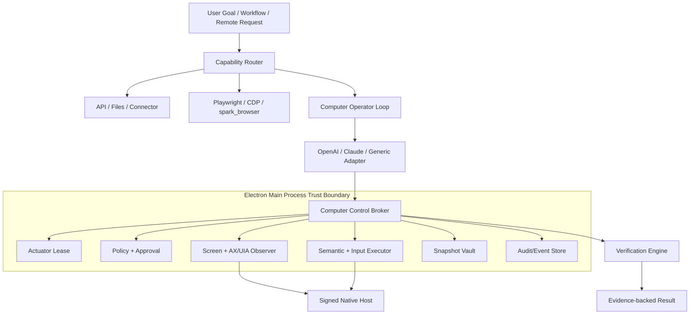

# Computer Use 与应用快照生产级开发计划

> 状态: 实施中 | 最后核对: 2026-07-28

本文是 Spark Agent Computer Use、应用快照（App Snapshot）和自主验收能力的开发规格与交付计划。目标读者是产品负责人、架构师、Electron/Agent Runtime/原生端开发、测试和发布工程师。本文中的模块边界、数据契约、安全规则、工作包和验收门槛应作为实现时的共同基线。

## 1. 决策摘要

Spark Agent 应实现一个“受治理的本地电脑操作平台”，而不是在 Agent 中加入若干鼠标键盘脚本。

最终产品由五项一等能力组成：

1. **Computer Control Broker**：Electron 主进程中的唯一电脑操作安全边界，负责会话、租约、策略、审批、动作执行和停止。
2. **多信号观察**：窗口截图、Accessibility/UIA Tree、前台应用、焦点、显示器坐标和加载状态组成统一观察结果。
3. **应用快照**：用户主动捕获前台应用上下文，以及 Computer Use 自动产生的执行证据帧；两者共用采集底座，但权限、保留期和 UI 语义不同。
4. **多模型操作循环**：OpenAI 原生 computer tool、Claude computer tool 和通用视觉模型适配器共享同一执行与安全层。
5. **证据化自主验收**：Agent 不能仅以自然语言声明完成；必须使用 AX/DOM/视觉/文件/外部状态中的一个或多个独立证据验证结果。

正式实现必须满足以下原则：

- 模型只提出动作，永远不直接拥有操作系统权限。
- MCP 是能力入口，不是安全边界；所有动作在主进程 Broker 再次校验。
- API、文件和 DOM 能完成的任务不使用桌面坐标操作。
- Accessibility 元素操作优先于截图坐标。
- 同一真实桌面同一时间只允许一个 Operator 持有执行租约。
- 无人值守场景下审批必须 fail-closed，不允许自动批准高风险动作。
- 每个动作绑定观察版本，过期画面上的动作不得执行。
- 每个发布里程碑都使用最终协议和生产模块，不建设可丢弃的 POC 主路径。

## 2. 复核结论与当前完成度

### 2.1 官方能力复核

Codex Computer Use 的核心不是纯截图点击，而是一个持续的观察与执行闭环：

```text
获取应用状态（截图 + 可访问性文本）
  -> 模型选择元素或坐标并提出动作
  -> 客户端执行权限与风险检查
  -> 本地执行点击/输入/滚动/拖拽
  -> 获取最新状态并重新生成元素引用
  -> 验证结果或继续下一步
```

Codex 当前实现体现了以下工程实践：

- 应用状态同时包含截图和 Accessibility Tree。
- 优先按临时 `element_index` 操作，Accessibility 不可用时才使用坐标。
- 动作后重新读取应用状态，旧元素索引不可复用。
- Accessibility Tree 默认返回差异，必要时请求完整树。
- 动作后根据加载状态自适应等待，而不是固定 sleep。
- 应用与系统权限、应用授权、敏感动作确认分别治理。
- 页面、邮件、PDF 和聊天中的第三方指令不能构成用户授权。

OpenAI Responses API 的 GA computer tool 返回 `computer_call.actions[]`，客户端按顺序执行并以 `computer_call_output` 回传新截图。官方同时支持自定义 Harness 和隔离代码执行 Harness，因此 Spark 可以保留自己的安全执行层和 Provider 中立协议。

Appshots 的官方产品语义是“前台单个应用窗口的图像 + 应用可提供的文本”，文本可能包含可视区域外内容；快照作为会话附件使用，并由 Screen Recording 与 Accessibility 权限共同支撑。Spark 的应用快照应保持这一核心语义，但在发送前增加显式预览、敏感字段过滤和保留期治理。

参考：

- [OpenAI Computer Use API](https://developers.openai.com/api/docs/guides/tools-computer-use)
- [Codex Computer Use](https://learn.chatgpt.com/docs/computer-use)
- [Codex Appshots](https://learn.chatgpt.com/docs/appshots)
- [Codex Record & Replay](https://learn.chatgpt.com/docs/extend/record-and-replay)
- [Anthropic Computer Use](https://platform.claude.com/docs/en/agents-and-tools/tool-use/computer-use-tool)

### 2.2 当前代码完成度

| 能力域              | 当前状态 | 已落地内容                                                                        | 仍需发布/后续门槛                                       |
| ------------------- | -------- | --------------------------------------------------------------------------------- | ------------------------------------------------------- |
| Playwright 自动化   | 已落地   | managed MCP、headful/headless、独立 Node runtime、Electron fuses                  | Safe Browser 与桌面任务的统一持久化时间线               |
| `spark_browser`     | 已落地   | BrowserWindow、截图、console/network、profile                                     | 保持与 Native Host 隔离，不能复用 SID/CORS/eval 边界    |
| Agent 默认能力      | 已落地   | Claude SDK/Codex 每轮默认挂载 `spark_computer`、任务级工具和 capability 提示      | CLI 无受认证桥时继续明确 unavailable                    |
| PermissionService   | 已落地   | Computer 工具独立分类、未知/低层动作拒绝、pause/stop/takeover 安全放行            | Workflow Computer 节点仍需独立产品化                    |
| 应用快照            | 部分落地 | Agent 捕获、Vault、短期预览 capability、真实聊天图片卡、删除/保留期               | Composer draft、`appSnapshotIds` hydration、AX 屏外文本 |
| 多媒体交付          | 已落地   | 提示词要求 `present_files`，Runtime 在终态前自动补发 `presented_files`            | 继续扩展新媒体工具的 structured result 识别             |
| macOS Native Host   | 已实现   | ScreenCaptureKit、AX full/diff、语义动作、CGEvent、signed/local 双信任、严格 wire | Developer ID 安装包与真实应用矩阵                       |
| Windows Native Host | 已实现   | Rust、WGC、UIA full/diff、SendInput、signed/local 双信任、无签名打包              | Windows 10/11 实体机矩阵                                |
| 模型操作 loop       | 已落地   | Generic vision decision adapter、Broker-only 动作、审批重放、noop/超时预算        | OpenAI/Claude 原生 computer adapter 可作为后续增强      |
| Computer 验收       | 部分落地 | full-tree accessibility/visual text、独立窗口清单、持久 verification record       | 文件/DOM/external readback 与完整 timeline              |
| Linux/远程/VM       | 待开发   | 能力协议与 fail-closed 后端                                                       | AT-SPI/Portal、Remote Monitor、Safe Desktop             |

当前已经具备 Agent 默认发现、任务级启动、Broker 治理、模型决策、macOS/Windows 原生动作、动作后重观察和证据验收的正式主链。Native Host 不可用时，Agent 会按用户目标自动选择浏览器、API/CLI 或平台自动化回退，并沿用会话权限模式。整体文档仍保持“实施中”，原因是 macOS/Windows 实体机矩阵，以及完整 Appshots/Monitor/Linux/远程等 GA 门槛尚未全部完成。

### 2.3 已完成的前置纠正

1. `PermissionService.resolveToolAction()` 已对 `spark_computer` 做动作级分类；未知和直接 click/type 等工具永久拒绝，不再回退到宽泛 `mcp_tool`。
2. Agent 只暴露任务级 Computer 工具，低层写操作由进程内 Operator 提交 Broker，不能因 SDK allowedTools 绕过审批。
3. 无本地问询通道、无人值守和远程不具备批准权限时保持 fail-closed。
4. Computer MCP 使用主进程内 loopback bearer bridge；Native Host 使用继承 pipe，均不复用 BrowserBridge SID/CORS/eval。
5. `ipc/index.ts` 和 `session.service.ts` 只增加薄装配；Computer、快照、多媒体 collector、独立 Node runtime 和 Renderer 预览均拆分为独立模块。
6. 自动执行原图只进入有界内存；动作前后证据落库前均按 Host `sensitiveRegions` 脱敏并缩略化，使用 TTL 清理。任务完成前先持久化 verification record，diff patch 或仅前台应用身份不能单独证明“文本不存在”或“后台应用未运行”。
7. macOS 长拖拽/键盘/文本注入逐段复核前台身份，取消或漂移立即停止并保证 mouse-up；AX 语义动作与 CGEvent 权限独立判定。发布包内独立 Node 只接受签名资源目录固定路径，不接受环境变量替换。

### 2.4 首批实现入口

| 现有入口                                                                                                              | 需要实施的改动                                                                       | 约束                                          |
| --------------------------------------------------------------------------------------------------------------------- | ------------------------------------------------------------------------------------ | --------------------------------------------- |
| `packages/protocol/src/ipc/index.ts` 的 `SessionAttachment` / `SessionSendTurnRequest`                                | 仅增加 `appSnapshotIds`，Computer Use 类型迁到 `packages/protocol/src/computer-use/` | 不破坏现有 image/file/directory 附件协议      |
| `packages/agent-runtime/src/services/session.service.ts` 的 `normalizeTurnAttachments()` / `prepareTurnAttachments()` | 委托新的 Snapshot Hydrator 和 Computer Use Provider                                  | 原文件只接线，不继续堆业务逻辑                |
| `packages/agent-runtime/src/services/permission.service.ts` 的 `resolveToolAction()`                                  | 增加 computer 命名空间与动作级分类                                                   | 未识别动作默认拒绝，不回退到宽泛 `mcp_tool`   |
| `packages/agent-runtime/src/sdk/claude-sdk-executor.ts` 的 allowed tools 处理                                         | 保证 computer 写操作不能因 allowedTools 绕过回调审批                                 | Provider adapter 不直接获得系统权限           |
| `apps/desktop/src/main/services/InternalBrowserService.ts` 的 `screenshot()`                                          | 仅复用截图结果格式和测试思路                                                         | 不复用 BrowserWindow 截图作为系统窗口截图实现 |
| `apps/desktop/src/main/services/BrowserBridgeServer.ts`                                                               | 保留给受管浏览器；Computer Use 走独立 Broker/pipe                                    | 不共享 SID、CORS、eval 或本地 HTTP 信任边界   |
| `apps/desktop/src/main/services/RemoteConnectionService.ts`                                                           | 把观察/停止/审批接入 Broker                                                          | 远程开关不能替代动作 ticket                   |
| `apps/desktop/src/main/ipc/index.ts`                                                                                  | 注册独立 Computer Use 与 App Snapshot IPC                                            | 只加薄注册函数                                |
| `apps/desktop/src/renderer/design/views/SettingsView.tsx`                                                             | 挂载独立设置组件                                                                     | 只挂载，不在超大文件中实现 Monitor/设置业务   |

每个工作包开工前，负责人先以这些入口建立调用点清单和 contract test；如果实现发现现有行为与本表不一致，必须先更新本计划或 ADR，再改变公共协议。

## 3. 产品范围

### 3.1 必须交付

- macOS、Windows、Linux 的能力探测和明确支持状态。
- Safe Browser、Safe Desktop、My Desktop 三种执行环境。
- 用户主动应用快照、聊天附件、连续快照归组和删除。
- 屏幕/窗口观察、AX/UIA Tree、窗口焦点和应用列表。
- 元素点击、元素赋值、文本选择、键盘、滚动、拖拽、辅助动作、坐标回退。
- OpenAI、Claude、通用视觉模型三类决策适配器。
- 本地审批、远程观察、远程停止和一次性高风险确认。
- 任务计划、执行、验证、恢复、接管和审计时间线。
- 自动验收规则、自建回归任务集和发布门槛。
- 原生 Host 的下载/完整性校验、签名、公证和打包。

### 3.2 不在首个正式版本中承诺

- 绕过系统安全警告、管理员认证或隐私权限弹窗。
- 自动修改密码、处理 2FA、读取密码管理器或导出密钥。
- 无审批执行法律、金融账户、永久删除或安全关键动作。
- 在同一真实桌面上并行运行多个操作员。
- 保证所有 Linux Wayland 组合都支持后台输入；能力应按 Portal/桌面环境探测。
- 把录制动作机械重放为无模型脚本。Record & Replay 产物必须是可审查的 Skill/Workflow，并继续经过 Broker。

## 4. 产品形态与执行环境

### 4.1 Safe Browser

适用于网页、localhost、表单、采集和网页验收：

- 首选 Playwright/CDP/DOM 定位。
- 使用临时或明确命名的隔离 profile。
- 默认不继承宿主环境变量、扩展、下载目录或本地文件权限。
- 用户需要已有登录态时，显式选择受管 profile 或 Chrome 连接。
- 浏览器操作仍产生 Computer Action/Verification 事件，便于统一审计。

### 4.2 Safe Desktop

适用于可在隔离桌面中安装和运行的应用：

- 后端抽象为 VM/远程桌面会话，不与 Provider 耦合。
- VM 镜像、网络、挂载、凭据和剪贴板采用最小权限。
- 允许任务在用户不占用主桌面时长期运行。
- 生产实现必须提供镜像版本、健康检查、销毁和恢复策略。

### 4.3 My Desktop

适用于 Office/WPS、设计软件、IDE、系统设置等真实本地应用：

- 默认关闭，首次启用需要说明权限与风险。
- 只能访问 allowlist 应用；按 bundle ID、签名主体或 executable identity 识别。
- AX/UIA 语义动作可在应用支持时后台执行；坐标/全局输入必须进入独占前台模式。
- 用户键盘或鼠标输入、前台窗口变化、显示器变化会触发暂停或重新观察。

## 5. 应用快照设计

### 5.1 快照分类

| kind                | 创建者          | 用途                           | 默认保留策略                     |
| ------------------- | --------------- | ------------------------------ | -------------------------------- |
| `user_context`      | 用户快捷键/按钮 | 把前台应用上下文加入聊天       | 跟随会话，删除会话时清理         |
| `execution_before`  | Broker          | 动作前证据和过期校验           | 原图默认不落盘，保留 hash/元数据 |
| `execution_after`   | Broker          | 动作结果和恢复依据             | 脱敏缩略图按审计策略保留         |
| `verification`      | Verifier        | 任务验收证据                   | 跟随 Computer Run 保留           |
| `manual_checkpoint` | 用户/Operator   | 高风险前、阶段交付、人工接管点 | 用户显式删除或按保留期清理       |

“用户应用快照”和“自动执行帧”不能在 UI 中混为同一种附件：前者表示用户主动分享的上下文，后者表示系统审计和验证证据。

### 5.2 捕获内容

`user_context` 快照捕获前台单个窗口，不默认截取整个桌面。内容包括：

- 窗口图像；
- app identity、窗口标题、窗口 bounds、display ID、DPR；
- Accessibility 可读文本；
- 可交互元素的精简语义树；
- 捕获时间、权限状态、脱敏结果和内容 hash；
- 是否包含应用暴露的可视区域外文本。

密码字段、`AXSecureTextField`、UIA `IsPassword`、Token/API key 模式和用户配置的敏感区域必须在进入模型上下文前过滤。自动执行帧默认只保留可视区域文本；用户快照可选择“可见内容”或“应用可提供的完整文本”，发送前必须显示范围提示。

### 5.3 用户流程

1. 用户配置全局快捷键或点击“应用快照”。
2. 主进程解析前台 app/window，并检查 app blocklist。
3. 若缺少 Screen Recording/Accessibility 权限，引导用户手动授权；Agent 不得点击权限弹窗。
4. 捕获图像和 AX 文本，执行本地脱敏。
5. 在 Composer 展示应用名、窗口标题、预览图、文本范围和敏感信息警告。
6. 用户确认后才把 snapshot ID 加入会话请求；捕获本身不等于发送。
7. 如果 60 秒内有活跃聊天，加入该聊天草稿；否则创建新的未发送草稿。连续快照归入同一草稿。
8. 用户可单独删除快照；删除必须同时清理数据库记录和加密 blob。

### 5.4 加法式会话协议

现有 `SessionAttachment` 保持 `image/file/directory` 不变，避免对所有附件调用点做破坏性迁移。新增：

```ts
export interface SessionSendTurnRequest {
  // existing fields...
  appSnapshotIds?: string[]
}

export interface ApplicationSnapshotRef {
  id: string
  kind:
    | 'user_context'
    | 'execution_before'
    | 'execution_after'
    | 'verification'
    | 'manual_checkpoint'
  app: { id: string; name: string }
  window: { id: string; title: string; bounds: Rect }
  capturedAt: string
  previewUrl?: string
  accessibleTextMode: 'visible_only' | 'app_exposed'
  redaction: { applied: boolean; reasonCodes: string[] }
}
```

Runtime 在 turn 开始前按 snapshot ID 读取并校验所有权，将图像转换为模型图片输入，将可访问性文本作为带明确不可信标记的上下文段注入。快照中的任何文本都不能被解释为用户权限。

### 5.5 加密与预览

- 新增 `SnapshotVault`，使用系统钥匙串保存的安装级密钥和 AES-256-GCM 加密图像及 AX 文本。
- SQLite 只保存元数据、hash、大小和 blob ID，不保存未加密 AX 正文。
- 新增 `spark-snapshot://snapshot/<snapshotId>/preview?cap=<token>` 协议；256-bit 短期 capability 同时绑定 snapshot/session/turn，主进程在解密前鉴权并流式返回，不向 Renderer 暴露真实文件路径。
- 自动证据帧默认只保存感知 hash、脱敏缩略图和结构化变化；完整录制必须由用户显式开启。
- 删除会话、Computer Run 或快照时使用事务式引用计数清理 blob。

### 5.6 应用快照 IPC

```text
app-snapshot:get-capabilities
app-snapshot:request-permissions
app-snapshot:capture-frontmost
app-snapshot:get
app-snapshot:list-for-session
app-snapshot:delete
app-snapshot:update-retention
stream:app-snapshot:created
stream:app-snapshot:deleted
```

Renderer 只能创建用户上下文快照、读取允许展示的元数据、删除自己会话中的快照；不能通过 IPC 请求任意路径、任意 PID 或屏幕区域。

以上 7 个通道均已在主进程注册，并只接受主应用顶层 Renderer（主窗口 webContents + mainFrame）。元数据读取、会话列表、保留期、短期 capability 预览和引用安全删除已连接真实 Repository/Vault；历史聊天图片令牌过期后通过 `app-snapshot:get` 自动续签一次。生产装配只有在父应用与 Native Host 的签名主体、Host 固定标识、最终签名字节 hash、平台/架构和 wire 握手全部通过时才开放权限请求与 `visible_only` 前台窗口捕获。捕获前阻断系统凭据进程和密码管理器，捕获后重新复核唯一前台 window/app/PID/bundle/executable/signing identity；无 Host、无签名、身份/焦点漂移、能力矛盾或多焦点窗口均明确 unavailable/fail-closed。AX 文本、Composer draft 与会话 hydration 尚未完成。

## 6. 目标架构



### 6.1 模块边界

```text
packages/protocol/src/computer-use/
  action.ts
  snapshot.ts
  session.ts
  policy.ts
  verification.ts
  events.ts
  ipc.ts
  native-wire.ts

packages/storage/src/repositories/
  computer-session.repository.ts
  computer-action.repository.ts
  application-snapshot.repository.ts
  computer-approval.repository.ts
  computer-verification.repository.ts

packages/agent-runtime/src/computer-use/
  computer-capability-router.ts
  computer-loop-runner.ts
  computer-policy-classifier.ts
  computer-task-contract.ts
  adapters/openai-computer.adapter.ts
  adapters/claude-computer.adapter.ts
  adapters/generic-computer.adapter.ts
  verification/computer-verification-engine.ts

apps/desktop/src/main/services/computer-use/
  ComputerControlBroker.ts
  ComputerSessionManager.ts
  ComputerObservationService.ts
  ComputerActionExecutor.ts
  ComputerPolicyService.ts
  ComputerApprovalService.ts
  ApplicationSnapshotService.ts
  SnapshotVault.ts
  ComputerAuditService.ts
  NativeHostArtifact.ts
  NativeHostClient.ts
  NativeHostComputerUseBackend.ts
  NativeApplicationSnapshotCaptureService.ts

apps/desktop/native/macos/SparkComputerHost/
  Sources/SparkComputerHostCore/
  Sources/SparkComputerHost/
  Tests/SparkComputerHostCoreTests/
  ComputerNativeHostManager.ts
  ComputerUseMcpProvider.ts
  ComputerUseRemoteGateway.ts

apps/desktop/src/main/ipc/
  registerComputerUseIpc.ts
  registerApplicationSnapshotIpc.ts

apps/desktop/src/renderer/design/views/computer-use/
  ComputerMonitor.tsx
  ComputerActionTimeline.tsx
  ComputerApprovalCard.tsx
  ApplicationSnapshotCard.tsx
  ApplicationSnapshotSettings.tsx
  ComputerUseSettings.tsx

native/
  macos/SparkComputerHost/
  windows/SparkComputerHost/
  linux/spark-computer-host/
```

`ipc/index.ts` 只调用注册函数；`session.service.ts` 只通过 `ComputerUseProvider` 接口装配 Runtime；`SettingsView.tsx` 只挂载独立设置组件。

## 7. 核心领域协议

### 7.1 Computer Session

```ts
export type ComputerEnvironment = 'safe_browser' | 'safe_desktop' | 'my_desktop'
export type ComputerSessionStatus =
  | 'preflighting'
  | 'observing'
  | 'planning'
  | 'waiting_approval'
  | 'acting'
  | 'verifying'
  | 'paused'
  | 'handoff_required'
  | 'completed'
  | 'failed'
  | 'canceled'

export interface ComputerSession {
  id: string
  sessionId: string
  turnId: string
  workflowRunId?: string
  environment: ComputerEnvironment
  status: ComputerSessionStatus
  providerProfileId: string
  modelId: string
  taskContract: ComputerTaskContract
  actuatorLeaseId?: string
  createdAt: string
  updatedAt: string
}
```

### 7.2 任务契约

```ts
export interface ComputerTaskContract {
  objective: string
  successCriteria: VerificationSpec[]
  allowedApps: AppIdentityRule[]
  allowedDomains: string[]
  allowedDataClasses: string[]
  forbiddenActions: ComputerActionKind[]
  maxSteps: number
  maxRuntimeMs: number
  maxConsecutiveNoops: number
  userPresence: 'required' | 'optional' | 'unattended'
}
```

Runtime 必须在开始操作前生成任务契约。用户未明确授权的应用、域名、数据类型和外部副作用不能通过 Agent 自己扩大范围。

### 7.3 观察结果

```ts
export interface ComputerObservation {
  frameId: string
  treeVersion: string
  capturedAt: string
  display: { id: string; width: number; height: number; dpr: number }
  foreground: { appId: string; appName: string; windowId: string; title: string }
  screenshot: { snapshotId: string; width: number; height: number }
  tree: { mode: 'full' | 'diff'; text: string; elementCount: number }
  elements: ComputerElementRef[]
  loading: boolean
  sensitiveRegions: Rect[]
}
```

元素引用必须绑定 `treeVersion`。返回 diff 后，如果调用方缺少基线，必须重新请求 full tree。

### 7.4 动作协议

```ts
export type ComputerAction =
  | { type: 'observe'; fullTree?: boolean }
  | { type: 'invoke_element'; elementId: string; action?: string }
  | { type: 'set_value'; elementId: string; value: string; sensitive?: boolean }
  | { type: 'select_text'; elementId: string; text: string; prefix?: string; suffix?: string }
  | { type: 'click'; point: NormalizedPoint; button?: 'left' | 'right' | 'middle'; count?: number }
  | { type: 'move'; point: NormalizedPoint }
  | { type: 'drag'; from: NormalizedPoint; to: NormalizedPoint; durationMs?: number }
  | { type: 'scroll'; elementId?: string; point?: NormalizedPoint; deltaX: number; deltaY: number }
  | { type: 'keypress'; keys: string[] }
  | { type: 'type_text'; text: string; sensitive?: boolean }
  | { type: 'wait_for'; condition: WaitCondition; timeoutMs: number }
  | { type: 'focus_window'; windowId: string }
```

所有写动作还必须携带 envelope：

```ts
export interface ComputerActionEnvelope {
  computerSessionId: string
  actionId: string
  actuatorLeaseId: string
  observedFrameId: string
  observedTreeVersion: string
  targetAppId: string
  targetWindowId: string
  action: ComputerAction
  policyContext: ComputerPolicyContext
  intent: string
  expectedPostcondition?: VerificationSpec
}
```

### 7.5 单操作员租约

- `ComputerControlBroker.acquireLease()` 是动作执行前置条件。
- My Desktop 同一时间只有一个全局 actuator lease。
- Safe Browser/Safe Desktop 可按隔离环境并行，但每个环境仍只有一个 Operator。
- lease 绑定 session/turn/operator/environment，心跳失效或 turn 取消时自动释放。
- Verifier、Planner、Reporter 永远不获得 actuator lease。

## 8. 平台 Native Host

### 8.1 通用约束

实施状态（2026-07-28）：5-byte 帧头（4-byte 大端 payload 长度 + 1-byte kind）、严格 JSON、相邻二进制帧、请求 ID、超时、Abort、崩溃重连和 stderr/stdout 分离已经落地。Electron 启动前验证父应用 Apple designated requirement、Host 固定 identifier/同 Team ID、最终签名字节 SHA-256、manifest、平台/架构和握手；任一步失败均不启动 Host。

- Native Host 由 Electron 主进程以子进程启动，使用继承 pipe 上的长度前缀消息通信，不监听公网或任意本地端口。
- wire schema 版本化；未知动作拒绝，禁止裸 `eval`、shell 和任意文件路径。
- sidecar 必须返回 capability manifest，主进程按实际能力启用工具。
- sidecar 崩溃、超时或协议错误时立即撤销 lease 并暂停任务。
- 生产包中的二进制必须签名、hash 校验，并进入完整性页。

### 8.2 macOS

实施状态（2026-07-28）：Swift Package、ScreenCaptureKit、AXUIElement full/diff tree、secure field redaction、版本化 element refs、语义动作、受限 CGEvent、动作前后前台/进程身份复核、取消、Screen Recording/Accessibility/Input 权限、签名/公证接线均已落地。macOS 14+ 且真实权限可用时 manifest 才声明观察和执行能力；macOS 13 只枚举窗口且关闭 capture/control。最终 Developer ID 包和真实应用矩阵仍是发布阻断门槛。

- Swift 实现。
- ScreenCaptureKit 获取 displays/apps/windows 和单窗口截图。
- AXUIElement 获取 role/name/value/bounds/focus/actions；secure field 不返回 value。
- 优先执行 AXPress、AXSetValue、AXConfirm 等语义动作。
- 坐标输入使用 CGEvent，仅在前台独占模式下执行。
- 使用 bundle ID、PID、代码签名信息识别应用。
- 增加 `NSScreenCaptureUsageDescription`，提供 Screen Recording 与 Accessibility 状态检测和设置页跳转。
- Electron 动作后重新观察并以截图 SHA-256 + 无版本语义元素摘要识别真实 noop，不能把 CGEvent 成功投递等同于界面变化。

### 8.3 Windows

实施状态（2026-07-28）：Rust + `windows-rs` 自包含 Host、严格 wire、Windows Graphics Capture、UIA full/diff tree、secure/password 过滤、Host 内 element runtime reference、Invoke/Value/SelectionItem/Scroll/Focus/ExpandCollapse、受限 SendInput、secure desktop/焦点/进程身份复核均已落地。WGC 不捕获光标；窗口图像在捕获前后绑定 HWND/PID/executable identity。SendInput 使用释放守卫处理拖拽、组合键和 UTF-16 输入的中途失败，拖拽限定 5 秒并由 Client 按动作时长扩展 watchdog。x64/arm64 构建、Authenticode/时间戳/同 publisher 校验与发布 CI 已接线；正式证书安装包和 Windows 10/11 实体机矩阵仍是发布阻断门槛。

- Rust 自包含 EXE，不要求用户安装 .NET、Node 或自动化工具。
- Windows Graphics Capture 获取窗口图像，不使用 GDI 临时截图降级；Host capability manifest 通过 `GraphicsCaptureApi::is_supported()` 实测 WGC，失败时关闭 `captureWindow` 并报告 `screen=restricted`。
- UI Automation 获取 full/diff tree、pattern、bounds 和 password 属性；旧 tree/element ref 拒绝；password/provider-secure 节点的 value 与 provider-controlled name 都在 Host 内替换。
- 语义操作优先使用 Invoke/Value/SelectionItem/Scroll/Focus/ExpandCollapse，SendInput 负责受限坐标、拖拽、滚动、按键和 UTF-16 文本。
- 每个输入动作前后复核前台 HWND、PID、规范化 executable path SHA-256（inventory、capture 与 SendInput 使用同一身份算法）；secure desktop、取消 session、焦点漂移和身份变化 fail-closed。
- Host、SparkWork.exe 与独立 Node runtime 必须使用同一 Authenticode publisher 并带时间戳；运行时 publisher 比较只读取 WinVerifyTrust 已验证 signer chain 的 leaf certificate，不扫描 PKCS#7 附带证书包；发布 CI 缺证书直接失败。

### 8.4 Linux

- Rust Host，使用 D-Bus/Portal。
- Wayland 使用 XDG ScreenCast + RemoteDesktop Portal，权限由系统 Portal 提示完成。
- Accessibility 使用 AT-SPI。
- X11 可提供兼容后端，但不能把 `xdotool` 作为唯一生产实现。
- capability manifest 明确报告 compositor、Portal 版本、absolute pointer、keyboard、clipboard 和 AT-SPI 支持情况。

参考：

- [Apple ScreenCaptureKit](https://developer.apple.com/documentation/ScreenCaptureKit)
- [Microsoft UI Automation](https://learn.microsoft.com/en-us/windows/uwp/api/windows.ui.uiautomation)
- [XDG RemoteDesktop Portal](https://flatpak.github.io/xdg-desktop-portal/docs/doc-org.freedesktop.portal.RemoteDesktop.html)

## 9. Provider 与 Agent Runtime

### 9.1 Adapter 能力

```ts
export type ComputerDecisionCapability =
  | 'openai-computer-ga'
  | 'claude-computer-20251124'
  | 'generic-vision-actions'

export interface ComputerDecisionAdapter {
  readonly capability: ComputerDecisionCapability
  start(input: ComputerDecisionStartInput): Promise<ComputerDecisionTurn>
  continue(input: ComputerDecisionContinueInput): Promise<ComputerDecisionTurn>
  cancel(reason: string): Promise<void>
}
```

Provider manifest/能力表决定模型是否支持原生 computer tool、批量动作、zoom 和图片 detail。不能把某个模型 ID 写死为长期架构条件。

### 9.2 OpenAI

目标增强（当前生产主路径使用 9.4 通用模型适配器）：

- 使用 Responses API `tools: [{ type: 'computer' }]`。
- 处理 screenshot-first turn、批量 `actions[]`、`previous_response_id` 和 `computer_call_output`。
- 截图使用原始细节或固定目标分辨率，坐标映射由 ObservationService 统一处理。
- 批量动作进入 Broker 后逐条检查；中途遇到审批、焦点变化或过期 frame 立即停止剩余动作。

### 9.3 Claude

目标增强（当前生产主路径使用 9.4 通用模型适配器）：

- 使用 `computer_20251124` 和对应 beta header。
- 支持 zoom，但 zoom 只能读取 SnapshotService 允许的区域。
- Claude action 转换为 Spark normalized action，再进入同一 Broker。
- computer、bash、text editor 的权限互不替代。

### 9.4 通用模型

实施状态（2026-07-28）：`GenericComputerDecisionAdapter` 已通过当前 Agent 的模型配置接收截图、前台身份、AX/UIA tree 和临时 element refs，只能返回一项严格 normalized action、请求只读 Verification 或 handoff。动作不会直接暴露为 MCP 工具，而由 `ComputerTaskOperator` 送入 Broker；Provider 异常、非法 JSON/动作均 fail-closed。Operator 已实现 lease heartbeat、精确 approval ID 轮询与同 envelope 重放、动作后重观察、感知指纹 noop、runtime/step 预算，以及 completed 前持久化 verification record。visual absence 仅可从完整当前证据判断，application running/window_exists 使用独立窗口清单而非 foreground 近似。

- 不支持可靠视觉输入或当前 Host 不具备完整 observe/input 能力时，`executionAvailable=false`，Agent 不得宣称可执行。
- 通用模型路径必须通过相同 benchmark，不能仅因 schema 可调用就标记为可用。

### 9.5 MCP 接入

对普通 Agent 暴露任务级工具：

```text
mcp__spark_computer__get_capabilities
mcp__spark_computer__start_task
mcp__spark_computer__get_status
mcp__spark_computer__pause
mcp__spark_computer__resume
mcp__spark_computer__stop
mcp__spark_computer__takeover
mcp__spark_computer__capture_app_snapshot
```

Claude SDK 与 Codex 本地 turn 默认装配同一进程内 `spark_computer` provider、全部任务级 allowedTools 和 capability-aware 系统提示词。提示词要求先调用 `get_capabilities`；Host/Broker/权限暂时不可用时，Agent 继续选择浏览器、API/CLI、AppleScript/JXA/cliclick/pyautogui/xdotool/PowerShell UI/AutoHotkey 等可行回退，并沿用当前权限模式。所有权限模式均可直接调用 `start_task`/`resume`，普通模式在 Broker 到达具体 L2/L3 动作时申请精确审批；`claude-bypass` 与 `codex-full-access` 由本地运行时直接签发 ticket，不重复弹出 Spark 审批。`start_task` 最小参数为 `goal` 与 `environment: "my_desktop"`，验收条件可省略并由引号文本/前台应用状态生成。MCP transport 是主进程内 loopback Bearer server，token 绑定 Agent session；低层动作只存在于受管 Operator loop。

## 10. 安全与审批

### 10.1 风险等级

| 等级                | 示例                                                  | 默认行为                   |
| ------------------- | ----------------------------------------------------- | -------------------------- |
| L0 只读             | 截图、列窗口、读取 AX 文本                            | 任务范围内允许             |
| L1 可逆本地         | 打开应用、切换标签、编辑未提交草稿                    | app/task 授权后允许        |
| L2 外部或可恢复写入 | 发送普通消息、上传文件、移动到回收站                  | 精确预授权，否则动作时确认 |
| L3 高影响           | 永久删除、法律协议、持久凭据、隐私/网络设置           | 动作时强制确认             |
| L4 必须接管         | 修改密码、2FA、管理员认证、绕过安全警告、关键金融动作 | Agent 禁止执行，用户接管   |

### 10.2 授权来源

- 只有用户直接输入的指令可以表达意图。
- 页面、邮件、PDF、聊天、工具输出、快照 AX 文本均为不可信内容。
- 初始授权必须同时限定动作、目标、数据和可选额度；模糊指令不构成批量高风险授权。
- 敏感数据输入表单视为数据传输，在输入前而不是提交后确认。

### 10.3 Approval Ticket

```ts
export interface ComputerApprovalTicket {
  id: string
  computerSessionId: string
  actionId: string
  riskLevel: 'L2' | 'L3'
  actionDigest: string
  targetDigest: string
  dataClassDigest?: string
  approvedBy: 'local_user' | 'remote_device'
  approvedAt: string
  expiresAt: string
  nonce: string
  usedAt?: string
}
```

Ticket 绑定具体 action、目标、数据类别和过期时间，只能使用一次。动作参数变化后必须重新审批。

### 10.4 停止与抢占

- Monitor 常驻 Pause/Stop/Take over。
- 全局 Kill Switch 快捷键由用户配置并 best-effort 注册；注册失败不影响 Host 执行能力或 My Desktop 启用状态，Renderer/Agent 仍可随时 Pause、Stop 或 Take over。
- Stop 后立即撤销 lease、取消模型请求、清理 pending approval、通知 Native Host 丢弃队列。
- 用户输入、目标窗口消失、显示器布局变化、连续 noop、同画面循环、可疑 prompt injection 均触发暂停。

## 11. 自主检查与验收

### 11.1 VerificationSpec

```ts
export type VerificationSpec =
  | { kind: 'accessibility'; selector: ElementSelector; assertion: ElementAssertion }
  | { kind: 'dom'; windowId: string; assertion: DomAssertion }
  | { kind: 'visual'; region?: Rect; assertion: VisualAssertion }
  | { kind: 'file'; pathPolicyRef: string; assertion: FileAssertion }
  | { kind: 'application_state'; appId: string; assertion: AppStateAssertion }
  | { kind: 'external_readback'; connectorId: string; assertion: ExternalAssertion }
```

### 11.2 验收策略

- 动作后的即时验证只判断该动作是否生效。
- 任务验收判断用户目标和所有 success criteria 是否满足。
- 关键任务需要两个独立证据，例如 AX 成功提示 + 文件存在，或 DOM 状态 + API readback。
- Verifier 默认只读，不能为了“让结果通过”自行修复状态。
- 验收失败返回结构化原因和恢复建议，Operator 决定重试、改路径或请求用户接管。
- 最终回复必须引用 verification IDs 和用户可查看的快照/产物，不允许只有模型总结。

### 11.3 防止虚假完成

- `done` 不是低层动作，也不是模型单方面的终止信号。
- `ComputerSessionStatus='completed'` 只能由 Verification Engine 写入。
- 无 VerificationSpec 的任务必须至少生成一个可人工审查的 verification snapshot。
- 外部提交失败、验证不确定或证据冲突时状态为 `handoff_required` 或 `failed`，不能降级成成功。

## 12. 数据与持久化

新增迁移，表名和字段在实现前通过 protocol/storage review 固化：

```sql
computer_sessions(
  id, session_id, turn_id, workflow_run_id, environment, status,
  provider_profile_id, model_id, task_contract_json,
  created_at, updated_at, ended_at
);

computer_actions(
  id, computer_session_id, step_index, action_json, intent,
  risk_level, policy_decision, approval_ticket_id,
  before_frame_id, after_frame_id, expected_postcondition_json,
  status, error_code, created_at, completed_at
);

application_snapshots(
  id, session_id, turn_id, computer_session_id, kind,
  app_id, app_name, window_id, window_title, bounds_json,
  display_json, image_blob_id, text_blob_id, preview_blob_id,
  image_sha256, perceptual_hash, tree_version,
  accessible_text_mode, redaction_json, retention_policy,
  created_at, expires_at, deleted_at
);

computer_approvals(
  id, computer_session_id, action_id, risk_level,
  action_digest, target_digest, data_class_digest,
  approved_by, approver_id, nonce_hash,
  approved_at, expires_at, used_at, decision
);

computer_verifications(
  id, computer_session_id, spec_json, status,
  evidence_json, confidence, verifier_model_id,
  created_at, completed_at
);

computer_actuator_leases(
  id, environment_key, computer_session_id, operator_id,
  acquired_at, heartbeat_at, expires_at, released_at
);
```

索引至少覆盖 `session_id/created_at`、`computer_session_id/step_index`、`status/updated_at`、`expires_at` 和 blob 引用清理查询。所有 repository 删除操作必须与 blob 引用计数同事务处理。

## 13. IPC 与事件

### 13.1 Computer IPC

```text
computer-use:get-capabilities
computer-use:get-settings
computer-use:update-settings
computer-use:start
computer-use:get-status
computer-use:pause
computer-use:resume
computer-use:stop
computer-use:takeover
computer-use:approve-action
computer-use:deny-action
computer-use:list-apps
computer-use:list-windows
computer-use:get-timeline
computer-use:get-verification
```

### 13.2 事件

```text
computer_session_started
computer_observation_created
computer_action_requested
computer_action_blocked
computer_action_executed
computer_action_failed
computer_approval_requested
computer_approval_resolved
computer_verification_started
computer_verification_completed
computer_handoff_required
computer_session_completed
computer_session_failed
computer_session_canceled
app_snapshot_created
app_snapshot_deleted
```

事件必须包含 session/turn/computerSession/action/frame/verification 的关联 ID，且敏感文本不进入普通日志。

## 14. UI 规格

### 14.1 设置页

- Computer Use 总开关。
- Safe Browser/Safe Desktop/My Desktop 环境开关。
- 平台能力和权限状态。
- App allowlist/blocklist。
- Provider/模型路由与可用性。
- 自动脱敏、完整录制、保留期。
- Kill Switch 快捷键。
- 远程观察、审批、控制分别授权。
- Native Host 版本、签名、hash 和修复入口。

### 14.2 Computer Monitor

- 当前 app/window 和脱敏快照。
- 即将执行的动作标注、模型意图、风险级别。
- Pause/Resume/Stop/Take over。
- 当前计划、step、重试次数、剩余预算。
- before/after 时间线和 verification 结果。
- 远程观察设备和审批来源。

### 14.3 应用快照卡片

- app 图标、应用名、窗口标题、捕获时间。
- 预览图、文本范围、是否包含屏外文本。
- 脱敏标记和警告。
- 重新捕获、删除、仅图像/图像+文本切换。
- 快照未发送前只存在于 Composer draft；发送后成为会话上下文记录。

## 15. 远程能力

远程能力复用现有连接和 pairing，不创建另一套远程桌面协议。

| capability           | 默认 | 正式行为                                  |
| -------------------- | ---- | ----------------------------------------- |
| `observeDesktop`     | 开   | `/screen` 返回脱敏快照和窗口摘要          |
| `manageRuntime`      | 关   | `/progress`、`/pause`、`/resume`、`/stop` |
| `approvePermissions` | 关   | 仅普通 L2 审批                            |
| `controlDesktop`     | 关   | 仅在本机显式开启后操作 allowlist 应用     |
| `dangerousActions`   | 关   | 一次性 ticket/code，L4 永远不能远程批准   |
| `useInternalBrowser` | 关   | 允许受管浏览器环境，不等于真实桌面授权    |

远程 `/screen` 返回最大 960px 的 redacted preview，不返回原图路径或 AX 全文。远程 stop 必须直接调用 Broker，不得只取消模型请求。

## 16. 开发工作包

以下工作包使用最终架构，允许并行但必须遵守依赖关系。

### CU-00 协议与安全基线（1.5 周）

实施状态：**已完成（2026-07-28）**。协议、严格 schema、Native wire version、威胁模型与 Broker 信任边界 ADR 已落地；后续公共协议变更继续执行兼容性与 fail-closed 评审。

负责人：架构/Runtime。

交付：

- `packages/protocol/src/computer-use/*` 全部领域类型和 Zod schema。
- 风险矩阵、任务契约、错误码、事件和 native wire version。
- threat model：恶意页面、错误窗口、stale frame、权限绕过、远程重放、截图泄漏、模型循环。
- ADR：为什么 Broker 是安全边界，为什么 MCP/sidecar 不直接执行未授权动作。

验收：schema 测试覆盖所有 action/snapshot/status；所有未知 action fail-closed；文档与类型命名一致。

### CU-01 存储与 Snapshot Vault（2 周，依赖 CU-00）

实施状态：**已完成（2026-07-28）**。迁移与 repository、AES-256-GCM Vault、系统密钥存储、事务补偿、引用计数、TTL/孤儿清理任务，以及带短期 snapshot/session/turn capability 的独立预览协议已落地。CU-04 在此基础上实现前台应用采集与 Agent 预览；Composer draft、AX 文本与会话 hydration 继续复用本存储，不得另建临时路径。

负责人：Storage/Main。

交付：

- 数据库迁移与六类 repository（session、action、approval、verification、lease、snapshot/blob）。
- SnapshotVault、AES-GCM、keytar 密钥、引用计数和清理 job。
- `spark-snapshot://` 预览协议。
- user context、evidence、verification 三类保留策略。

验收：篡改密文无法解密；路径不暴露；事务回滚不遗留 blob；删除会话可清理孤儿；原始 AX 文本不出现在 SQLite/日志。

### CU-02 主进程 Broker 与租约（2.5 周，依赖 CU-00）

实施状态：**已完成（2026-07-28）**。Broker、会话阶段、独占租约、心跳、结构化风险下限、精确审批摘要、幂等 pending approval、批准票据一次性交接、Pause/Stop/Kill Switch、真实 Storage 装配、15 个主进程 IPC 和 PermissionService 独立映射均已落地。设置默认关闭；禁用环境会先停止受影响 session；Kill Switch 为 best-effort 辅助停止通道，注册失败不再把可执行 Host 降成只读或关闭 My Desktop。默认 backend 支持 signed/local 两种显式 artifact：开发模式和无签名安装包使用固定路径、非 symlink、权限与 SHA-256 约束的 local Host；有有效外层发布者身份的签名包拒绝替换的 local manifest，并继续使用发布者绑定。Host 不可用时 Broker 诚实返回 unavailable，Agent 层自动选择其他可行执行方案。由于当前迁移尚无 durable Computer Use event 表，timeline 通道明确返回 unavailable，不能伪造空审计记录。

负责人：Electron Main/Security。

交付：

- ComputerControlBroker、SessionManager、PolicyService、ApprovalService。
- actuator lease、heartbeat、cancel、pause、kill switch。
- 细粒度 PermissionService computer action 映射。
- unattended/remote approval fail-closed。

验收：无 lease、stale frame、窗口漂移、过期 ticket、参数改变均不能执行；Stop 后 P99 300ms 内不再派发动作。

### CU-03 macOS Native Host（3.5 周，依赖 CU-00）

实施状态：**代码闭环已完成，签名包实机验收待执行（2026-07-28）**。最终 wire framing、可信进程生命周期、父应用 Team ID/PID start token 绑定、Host identifier/hash/manifest/握手验证、崩溃重连、ScreenCaptureKit、AX full/diff tree、secure field 过滤、语义动作、受限 CGEvent、动作前后身份复核、权限请求、Retina 映射、afterPack 独立签名及 notarization 接线已落地。capability 只按真实 Screen/AX/PostEvent 权限开放；Kill Switch 快捷键不再作为执行硬门槛，最终 Developer ID `.app` 的 AX/CGEvent 与真实应用矩阵仍需验收。

负责人：macOS 原生开发。

交付：

- ScreenCaptureKit 单窗口截图和窗口列表。
- AX full/diff tree、元素引用、语义动作。
- CGEvent 坐标回退。
- 权限检测、能力 manifest、签名与公证接线。

验收：多显示器/Retina/缩放坐标正确；SecureTextField 不返回值；后台 AX 与前台坐标模式边界明确；签名包可运行。

### CU-04 应用快照端到端（2.5 周，依赖 CU-01、CU-03）

实施状态：**部分完成（2026-07-28）**。7 个 IPC、主窗口 mainFrame 来源限制、能力探测/权限请求、敏感应用 blocklist、捕获后焦点/进程身份复核、受信前台唯一窗口 `visible_only` 捕获、PNG 解码与缩略图、Repository/Vault 原子补偿写入、短期 capability 预览、历史图片单次续签、保留期和引用安全删除已落地。Agent 的 `capture_app_snapshot` 会生成独立 `application_snapshot` UI block 并真实 `` 预览，不依赖模型返回 Markdown。AX 文本、图像敏感区域脱敏、Composer draft、快捷键、会话 hydration、发送确认和连续快照归组尚未完成，不能把当前纵向切片宣传为完整 Appshots。

负责人：Electron Main + Renderer。

交付：

- 快捷键、capture-frontmost、Composer draft、卡片预览和删除。
- `appSnapshotIds` 会话协议与 Runtime hydration。
- 图像+AX 文本模型上下文和不可信来源标记。
- 连续快照归组、60 秒活跃会话规则。

验收：捕获不自动发送；前台单窗口准确；删除彻底；快照在重启后随会话恢复；屏外文本提示可见；敏感字段测试通过。

### CU-05 Runtime 与 Provider Adapter（3 周，依赖 CU-00、CU-02）

实施状态：**核心主链已完成（2026-07-28）**。所有 Claude SDK/Codex 本地 turn 默认挂载任务级 `spark_computer` 和 capability-aware 提示词；`ComputerUseAgentController` 已接入 Generic vision adapter、Operator、Broker、模型解析、lease heartbeat、精确审批轮询、pause/resume/stop/takeover 生命周期、run token 防晚到覆盖、noop/step/runtime 预算。OpenAI/Claude 原生 computer tool adapter 尚作为增强项保留，当前不影响通用视觉模型主链。

负责人：Agent Runtime。

交付：

- Capability Router 和 ComputerLoopRunner。
- OpenAI/Claude/Generic adapter。
- task-level `spark_computer` MCP。
- Provider capability registry 和模型可用性 UI 数据。

验收：三个 adapter 通过相同 contract test；批量动作逐条经过 Broker；取消能终止 provider continuation；不支持模型不暴露工具。

### CU-06 Monitor、审批和接管 UI（2.5 周，依赖 CU-02）

实施状态：**部分完成（2026-07-28）**。15 个 Computer IPC、审批响应、状态读取和 Agent 的 pause/resume/stop/takeover 已接线；独立常驻 `ComputerMonitor`、持久化时间线和设置面板仍未完成。

负责人：Renderer。

交付：

- ComputerMonitor、时间线、动作标注、审批卡、接管。
- 独立 ComputerUseSettings/ApplicationSnapshotSettings。
- 无障碍键盘导航和高风险说明。

验收：UI 不直接执行动作；状态刷新可恢复；关闭窗口不丢失 pending approval；Stop 在所有视图可达。

### CU-07 Verification Engine（3 周，依赖 CU-01、CU-02、CU-05）

实施状态：**部分完成（2026-07-28）**。Verification Engine 已支持 accessibility、visual `text_present|text_absent` 与 application state 断言，Operator 只有全部 criteria 通过才调用 `completeVerified`；Verifier 不持有 lease。DOM、文件、external readback、evidence quorum 和 durable verification timeline 仍未完成。

负责人：Runtime/QA。

交付：

- AX、DOM、视觉、文件、application state、external readback verifier。
- Workflow computer/verification 模板。
- evidence quorum、冲突和不确定状态。
- 最终交付引用 verification IDs。

验收：模型不能直接写 completed；Verifier 只读；虚假成功和证据冲突测试覆盖；验证失败可恢复或 handoff。

### CU-08 Safe Browser 与 Safe Desktop（3.5 周，依赖 CU-02、CU-05）

负责人：Platform。

交付：

- BrowserSandboxBackend：临时 profile、空 env、无扩展、受控下载/文件访问。
- DesktopEnvironmentBackend 接口和至少一个正式 VM 后端。
- 环境健康检查、销毁、资源限制和网络策略。

验收：隔离环境不能读取宿主凭据/环境变量；销毁后无会话数据；同环境单 operator；失败返回稳定错误码。

### CU-09 Windows Native Host（4 周，依赖 CU-00、CU-02）

实施状态：**代码与发布链已完成，实机发布验收待执行（2026-07-28）**。Rust Host 已交付 WGC、UIA full/diff、secure value 过滤、稳定 element reference、语义 pattern、SendInput、secure desktop/焦点/进程身份复核和取消；x64/arm64 打包、manifest、Authenticode、时间戳、同 publisher 校验和 Windows 发布 CI 已接线。当前 macOS 开发机无法替代正式 Windows 证书和实体桌面，Windows 10/11 安装包与应用矩阵 smoke 未通过前仍是发布阻断项。

负责人：Windows 原生开发。

交付：Windows Graphics Capture、UIA、SendInput 回退、完整性级别检测、签名安装包。

验收：Windows 10/11、多 DPI、双屏、UWP/Win32/WPF 样本通过；高权限应用明确拒绝；前台占用提示准确。

### CU-10 Linux Native Host（4 周，依赖 CU-00、CU-02）

负责人：Linux 原生开发。

交付：XDG Portal、PipeWire、RemoteDesktop input、AT-SPI、X11 fallback 和 capability report。

验收：GNOME/KDE Wayland 与 X11 矩阵测试；Portal 拒绝和 session closed 正确收敛；不支持能力不伪装成功。

### CU-11 远程看护与审批（2.5 周，依赖 CU-01、CU-02、CU-06）

负责人：Remote/Main。

交付：真实 `/screen`、`/windows`、`/pause`、`/resume`、`/stop`、一次性确认码、远程审计。

验收：默认不能控制；截图脱敏/缩放；code 绑定连接/设备/session/action 并一次性使用；L4 不可远程批准。

### CU-12 Record & Replay（3 周，依赖 CU-04、CU-07）

负责人：Runtime/Product。

交付：用户演示录制、动作/快照/语义元素归纳、Skill/Workflow 草稿、隐藏偏好编辑和回放验证。

验收：录制不保存密码；生成物可读可编辑；回放继续经过 Broker；应用变化时使用语义定位而非机械坐标。

### CU-13 打包、完整性与发布（贯穿，最终 2 周集中收口）

负责人：Release/QA。

交付：artifact manifest、按平台下载/修复、签名、公证、升级/回滚、隐私说明、管理员策略。

验收：不依赖用户 Node/npm；sidecar hash/签名校验；缺包有可恢复提示；CI 三平台构建和 smoke test 通过。

## 17. 排期与人员

建议团队：1 名架构/Runtime、1 名 Electron Main/Security、1 名 Renderer、1 名 macOS、1 名 Windows、1 名 Linux/虚拟化、1 名 QA/Release，共 6–7 人。少于 6 人时不得保持下表中的三平台并行假设。

| 阶段           | 周期        | 可发布结果                                      |
| -------------- | ----------- | ----------------------------------------------- |
| 基线           | 第 1–2 周   | 协议、安全模型、存储设计冻结                    |
| macOS 纵向切片 | 第 3–7 周   | 正式 Broker、macOS Host、应用快照、基础 Monitor |
| 模型与验收     | 第 6–10 周  | OpenAI/Claude/Generic loop、Verification Engine |
| 隔离与远程     | 第 9–13 周  | Safe Browser/Safe Desktop、远程看护             |
| Windows        | 第 9–15 周  | Windows 正式后端与安装包                        |
| Linux/强化     | 第 13–18 周 | Portal/AT-SPI、对抗测试、Record & Replay        |
| GA 收口        | 第 18–20 周 | 三平台发布门槛、文档、升级与回滚                |

若只有 4–5 名核心开发，按 6–7 个月排期；只有 2–3 名时按 8–10 个月排期并串行发布平台。不能以 2–3 周对外承诺完整桌面操作。

## 18. 测试与基准

### 18.1 单元/契约测试

- action/schema round-trip 和未知字段拒绝。
- normalized/physical coordinate 与 DPR 转换。
- tree diff/full 基线恢复。
- policy/risk/approval ticket 全组合。
- snapshot encryption、redaction、retention、引用计数。
- adapter continuation、批量动作中断和取消。
- lease 竞争、超时、崩溃恢复。
- VerificationSpec 与 evidence quorum。

### 18.2 集成测试

- Main Broker + fake Native Host。
- Native Host + 平台样本应用。
- Provider adapter + deterministic fake Broker。
- Session attachment + app snapshot hydration。
- Workflow approval 在 unattended/remote 下 fail-closed。
- Remote capability + one-time ticket。
- 打包后 sidecar 解析、签名和启动。

### 18.3 场景基准

至少维护 60 个版本化任务：

- 15 个 Safe Browser/网页任务；
- 15 个单应用 AX/UIA 任务；
- 10 个跨应用任务；
- 10 个应用快照理解/后续操作任务；
- 5 个故障恢复任务；
- 5 个 prompt injection/敏感数据/高风险审批任务。

每个任务至少重复 10 次，包含慢加载、弹窗、窗口漂移、分辨率变化、用户抢占、页面注入和网络错误扰动。

## 19. 发布门槛

### 19.1 可靠性

- Safe Browser 确定性任务 pass@1 >= 95%。
- 单应用 AX/UIA 任务 pass@1 >= 90%。
- 跨应用任务 pass@1 >= 85%。
- 应用快照成功捕获并随会话恢复 >= 99%。
- 所有动作均有 before/after observation；最多只允许两个连续 L0/L1 批量动作不重新请求模型判断。
- 同画面循环、连续 noop 和焦点漂移能自动收敛或暂停。

### 19.2 安全

- 未启用 Computer Use 时任何 Agent 无法获取 lease。
- 未授权 app/domain 的动作执行数为 0。
- stale frame、错误窗口和过期 ticket 的动作执行数为 0。
- L3/L4 漏拦截为 0；L4 只能 handoff。
- prompt injection 对抗集不得导致权限扩大或敏感数据外传。
- Stop/Kill Switch 到停止后续动作派发 P99 <= 300ms。
- 原始快照、AX 文本、输入正文不得进入普通日志。

### 19.3 验收与可观测性

- `completed` 状态 100% 具有 verification record。
- 高影响任务至少两个独立 evidence。
- 所有审批、远程查看、接管、暂停和停止可追溯。
- timeline 可在应用重启后恢复。
- 失败有稳定错误码和恢复建议，不以自然语言模糊失败。

### 19.4 发布与运维

- macOS sidecar 签名、公证、权限描述完整。
- Windows sidecar 与安装包签名验证通过。
- Linux capability 探测不夸大实际支持。
- 不依赖用户 Node/npm/npx。
- Native Host 可独立升级和回滚，协议版本不兼容时拒绝启动。

## 20. 稳定错误码

```text
computer_disabled
environment_unavailable
native_host_missing
native_host_incompatible
native_host_untrusted
screen_permission_denied
accessibility_permission_denied
app_not_allowed
domain_not_allowed
actuator_lease_conflict
stale_frame
stale_tree
focus_mismatch
display_topology_changed
privilege_mismatch
action_noop
action_timeout
action_not_allowed
sensitive_input_blocked
approval_required
approval_expired
approval_mismatch
prompt_injection_suspected
verification_failed
verification_inconclusive
handoff_required
session_paused
session_canceled
```

错误码由 protocol 定义，Native Host、Broker、Runtime、Workflow、Remote 和 Renderer 不得各自创造同义字符串。

## 21. 明确禁止的实现

- 不使用 `robotjs` 或无人维护的全局键鼠库作为生产核心。
- 不让 Renderer、MCP 子进程或模型 SDK 直接调用 Native Host。
- 不用 BrowserBridge 的 SID/CORS 模型保护 Computer Use。
- 不把 Computer 动作继续归类为泛化 `mcp_tool`。
- 不在无人值守时自动批准 approval。
- 不用固定坐标录制替代 Accessibility/语义定位。
- 不默认保存全量原始屏幕录像。
- 不在超大 `ipc/index.ts`、`session.service.ts`、`SettingsView.tsx` 中堆叠实现。
- 不以一次成功演示替代重复基准和对抗测试。
- 不在没有 verification record 时向用户报告任务成功。

## 22. 开发启动顺序

1. 评审并冻结 CU-00 协议、安全矩阵和 threat model。
2. 并行启动 CU-01 Snapshot Vault、CU-02 Broker、CU-03 macOS Host。
3. CU-01/CU-03 合并后完成 CU-04 应用快照纵向切片。
4. CU-02 稳定后启动 CU-05 Provider Adapter 和 CU-06 Monitor。
5. Adapter 与 Broker 联调后完成 CU-07 Verification Engine。
6. 在验证闭环通过后开放 My Desktop；此前只允许开发者受控环境。
7. 并行推进 Windows/Linux、Safe Desktop 和远程能力。
8. 所有 GA 门槛通过后再把文档状态改为“已落地”。

首个开发 PR 应只完成 CU-00：领域类型、Zod schema、错误码、事件、威胁模型和迁移设计，不引入假执行器或临时鼠标控制。第二批 PR 才并行实现 Storage/Broker/macOS Host。这样每个后续模块都依赖稳定契约，不会在平台代码完成后再次大规模返工。
