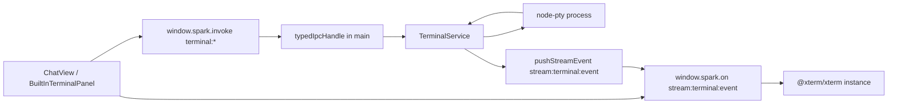

# Spark Agent 内置终端面板实施方案

本文档用于指导后续 agent 在 Spark Agent 桌面端实现类似 Codex Desktop 的内置终端能力：会话内右上角可打开/关闭终端面板，底部弹出可 resize 的终端 dock，支持同一会话内多个终端 tab。

## 1. 当前代码基础

Spark Agent 桌面端是 Electron + React + TypeScript：

- 主进程 IPC：`apps/desktop/src/main/ipc/index.ts`
- 类型安全 IPC 包装：`apps/desktop/src/main/ipc/typed-ipc.ts`
- preload 暴露：`apps/desktop/src/preload/index.ts`，仅暴露 `window.spark.invoke/on`
- IPC 协议：`packages/protocol/src/ipc/index.ts`
- IPC zod schema：`packages/protocol/src/schemas/index.ts`
- 会话页：`apps/desktop/src/renderer/design/views/ChatView.tsx`
- 会话页样式：`apps/desktop/src/renderer/design/views/ChatView.less`
- renderer IPC hooks：`apps/desktop/src/renderer/design/hooks/useIpc.ts`
- 外部 IDE/终端打开能力：`apps/desktop/src/main/services/ExternalToolService.ts` 与 `ChatView.tsx` 中的 `ToolDropdown kind="terminal"`

现状已有两类“terminal”概念：

- 消息流里的 `terminal` block：用于展示 agent 工具执行输出，不是交互式 PTY。
- 外部终端入口：右上角可打开 iTerm/Terminal/Warp 等系统终端，不在应用内。

本方案新增第三类：`BuiltInTerminalPanel`，它是 session-scoped 的交互式 PTY dock，不替代消息流 block，也不删除外部终端入口。

## 2. 目标体验

第一期必须完成：

- 会话页右上角增加“内置终端”图标按钮，位置建议在外部终端入口附近，图标使用 `Icons.Terminal` 或已有 lucide terminal 图标。
- 点击按钮打开/关闭底部终端面板；按钮 active 状态与面板可见状态同步。
- 面板从底部占用固定高度，默认 320px，可拖拽调整高度，范围建议 `180px - min(70vh, 640px)`。
- 面板包含 tab bar：
  - 默认自动创建 1 个 tab，名称优先为 workspace name，例如 `Spark-Agent`。
  - `+` 新建终端。
  - 每个 tab 可关闭；最后一个 tab 关闭时关闭面板并 kill PTY。
  - 支持切换 active tab。
- 终端 cwd 默认使用当前会话 workspace root；没有项目时用 no-project workspace 或用户 home，但 UI 上要明确显示。
- 支持输入、复制、粘贴、命令交互、彩色输出、窗口 resize。
- 会话切换时：
  - 每个 session 保留自己的 terminal tabs。
  - 未关闭的 terminal 进程在主进程中继续运行。
  - 切回会话后重新 attach 并继续显示输出。
- App 退出、session 删除、workspace 关闭时清理对应 PTY。

非第一期：

- agent 自动把命令接入这个终端运行。
- 终端历史持久化到 SQLite。
- 终端分享/远程协同。
- shell 命令沙箱隔离。第一期只做本机开发者终端，权限与 Spark Agent 进程一致。

## 3. 技术选型

推荐依赖：

- renderer：`@xterm/xterm`
- renderer addon：`@xterm/addon-fit`
- 可选 addon：`@xterm/addon-web-links`, `@xterm/addon-search`
- main：`node-pty`

原因：

- xterm.js 是成熟 Web terminal emulator，官方 addon 机制支持 `FitAddon`，可根据 DOM 容器计算 cols/rows。
- node-pty 官方提供 Node/Electron 伪终端能力，API 正好覆盖 `spawn`, `write`, `resize`, `onData`, `onExit`。
- Electron app 已设置 `npmRebuild: true` 且 `asarUnpack: ['**/*.node']`，适合接入 native module；但 node-pty 仍需要重点验证 macOS universal、Windows x64、Linux 打包。

依赖安装建议：

```bash
pnpm --filter @spark/desktop add @xterm/xterm @xterm/addon-fit @xterm/addon-web-links node-pty
```

如果安装 node-pty 后 native build 失败，先按平台补齐构建工具，再跑：

```bash
pnpm --filter @spark/desktop exec electron-rebuild
```

## 4. 总体架构



主原则：

- PTY 只在 main process 创建和管理，renderer 不接触 Node API。
- renderer 只负责 xterm UI、用户输入、fit 后尺寸上报。
- 所有 IPC channel 都走 `@spark/protocol` 类型和 zod schema。
- 输出事件只推送给当前主窗口；后续如支持多窗口，再在 payload 中加 window/session 过滤。

## 5. 协议设计

在 `packages/protocol/src/ipc/index.ts` 新增类型。

### 5.1 基础类型

```ts
export type TerminalId = string

export type TerminalStatus = 'running' | 'exited' | 'error'

export interface TerminalSessionInfo {
  id: TerminalId
  sessionId: SessionId
  workspaceId?: string
  title: string
  cwd: string
  shell: string
  pid?: number
  cols: number
  rows: number
  status: TerminalStatus
  createdAt: string
  updatedAt: string
  exitCode?: number
  signal?: number
}
```

### 5.2 Invoke channels

```ts
export interface TerminalListRequest {
  sessionId: SessionId
}
export interface TerminalListResponse {
  terminals: TerminalSessionInfo[]
}

export interface TerminalCreateRequest {
  sessionId: SessionId
  workspaceId?: string
  cwd?: string
  title?: string
  cols?: number
  rows?: number
}
export interface TerminalCreateResponse {
  terminal: TerminalSessionInfo
  initialOutput?: string
}

export interface TerminalInputRequest {
  terminalId: TerminalId
  data: string
}
export interface TerminalInputResponse {
  accepted: boolean
}

export interface TerminalResizeRequest {
  terminalId: TerminalId
  cols: number
  rows: number
}
export interface TerminalResizeResponse {
  resized: boolean
}

export interface TerminalKillRequest {
  terminalId: TerminalId
}
export interface TerminalKillResponse {
  killed: boolean
}

export interface TerminalRenameRequest {
  terminalId: TerminalId
  title: string
}
export interface TerminalRenameResponse {
  terminal: TerminalSessionInfo
}
```

加入 `IpcChannelMap`：

```ts
'terminal:list': [TerminalListRequest, TerminalListResponse]
'terminal:create': [TerminalCreateRequest, TerminalCreateResponse]
'terminal:input': [TerminalInputRequest, TerminalInputResponse]
'terminal:resize': [TerminalResizeRequest, TerminalResizeResponse]
'terminal:kill': [TerminalKillRequest, TerminalKillResponse]
'terminal:rename': [TerminalRenameRequest, TerminalRenameResponse]
```

### 5.3 Stream channel

建议合并成单一事件，便于 renderer 一个订阅处理全部终端状态：

```ts
export type TerminalStreamEvent =
  | { type: 'created'; terminal: TerminalSessionInfo }
  | { type: 'data'; terminalId: TerminalId; sessionId: SessionId; data: string }
  | { type: 'exit'; terminalId: TerminalId; sessionId: SessionId; exitCode?: number; signal?: number }
  | { type: 'updated'; terminal: TerminalSessionInfo }
  | { type: 'removed'; terminalId: TerminalId; sessionId: SessionId }
  | { type: 'error'; terminalId?: TerminalId; sessionId?: SessionId; message: string }
```

加入 `IpcStreamChannelMap`：

```ts
'stream:terminal:event': TerminalStreamEvent
```

### 5.4 Schema

在 `packages/protocol/src/schemas/index.ts` 加 zod：

- `terminal:list`: `{ sessionId: z.string().min(1) }`
- `terminal:create`: `sessionId` 必填，`workspaceId/cwd/title` 可选，`cols` 10-500，`rows` 3-200
- `terminal:input`: `data` 字符串，建议最大 1MB，避免 paste 巨量内容打爆 IPC
- `terminal:resize`: `cols/rows` int 有界
- `terminal:kill`: `terminalId` 必填
- `terminal:rename`: `title` 1-80

## 6. 主进程实现

新增文件：`apps/desktop/src/main/services/TerminalService.ts`

职责：

- 管理 `Map<TerminalId, TerminalRuntime>`。
- 创建 node-pty 进程。
- 缓存每个 terminal 最近输出 ring buffer，用于 renderer 重新 attach 后补屏。
- 校验 cwd 安全性。
- 处理 input/resize/kill/rename/list。
- App 退出时 dispose 全部 PTY。

建议结构：

```ts
interface TerminalRuntime {
  info: TerminalSessionInfo
  pty: IPty
  buffer: string[]
  bufferBytes: number
}

class TerminalService {
  list(sessionId: string): TerminalSessionInfo[]
  create(req: TerminalCreateRequest): Promise<{ terminal: TerminalSessionInfo; initialOutput?: string }>
  input(terminalId: string, data: string): void
  resize(terminalId: string, cols: number, rows: number): void
  kill(terminalId: string): boolean
  rename(terminalId: string, title: string): TerminalSessionInfo
  disposeBySession(sessionId: string): void
  disposeAll(): void
}
```

### 6.1 Shell 选择

默认 shell：

- macOS/Linux：`process.env.SHELL || '/bin/zsh' || '/bin/bash'`
- Windows：优先 `pwsh.exe`，其次 `powershell.exe`，最后 `cmd.exe`

环境变量：

- 复用 `ShellEnvironmentService.fixShellPath()` 已修正后的 `process.env`。
- 强制设置：
  - `TERM=xterm-256color`
  - `COLORTERM=truecolor`
  - `FORCE_COLOR=1`
  - `PWD=cwd`（非 Windows）

### 6.2 cwd 校验

第一期建议只允许 cwd 在当前 workspace root 之内：

- 如果 `req.cwd` 未传，使用 workspace root。
- 如果传了 `cwd`，用 `realpathSync` 解析后校验必须等于 workspace root 或在 root 子目录。
- workspace root 从 `WorkspaceRepository` 读取，不能信任 renderer 直接传入的 path。
- 没有 workspace 的 no-project 会话，可使用 app 管理的 no-project directory 或 home。

失败时抛业务错误，renderer toast 显示“终端工作目录不可用”。

### 6.3 输出缓存

目的：面板关闭只是隐藏 UI，不 kill 进程；切回 session 或 React remount 后需要补屏。

建议：

- 每个 terminal 缓存最近 1-2MB 输出。
- 使用字符串数组 + byte counter。
- 超过上限从头丢弃。
- `terminal:create/list` 不返回完整历史；新增 `initialOutput` 只在 create 返回欢迎错误等少量内容。
- 后续如需要 attach 补屏，可新增 `terminal:get-buffer`；第一期也可以在 `terminal:list` 返回 `buffers: Record<TerminalId,string>`，但类型会膨胀，不推荐。

更稳的第一期做法：新增 `terminal:get-buffer`：

```ts
'terminal:get-buffer': [TerminalGetBufferRequest, TerminalGetBufferResponse]
```

renderer 激活 tab 时拉一次 buffer，然后后续靠 stream 增量。

### 6.4 生命周期

清理时机：

- `terminal:kill`：kill 单个 PTY 并推送 `removed`。
- session 删除：在现有 `session:delete` handler 成功后调用 `terminalService.disposeBySession(sessionId)`。
- workspace 关闭/删除：dispose 该 workspace 下所有 PTY。
- app `before-quit` 或 `will-quit`：`disposeAll()`。

不要在面板隐藏时 kill PTY；只有关闭 tab 才 kill。

### 6.5 IPC 注册

为了避免 `apps/desktop/src/main/ipc/index.ts` 继续膨胀，建议新增：

- `apps/desktop/src/main/ipc/registerTerminalIpc.ts`

内容：

```ts
export function registerTerminalIpc(): void {
  typedIpcHandle('terminal:list', async (req) => terminalService.list(req.sessionId))
  typedIpcHandle('terminal:create', async (req) => terminalService.create(req))
  typedIpcHandle('terminal:input', async (req) => { terminalService.input(req.terminalId, req.data); return { accepted: true } })
  typedIpcHandle('terminal:resize', async (req) => { terminalService.resize(req.terminalId, req.cols, req.rows); return { resized: true } })
  typedIpcHandle('terminal:kill', async (req) => ({ killed: terminalService.kill(req.terminalId) }))
  typedIpcHandle('terminal:rename', async (req) => ({ terminal: terminalService.rename(req.terminalId, req.title) }))
}
```

然后在 `registerAllIpcHandlers()` 末尾调用 `registerTerminalIpc()`。

注意更新 `apps/desktop/src/main/ipc/__tests__/ipc-handlers.test.ts` 的 namespace 期望值，加入 `terminal`。

## 7. Renderer 实现

建议新增文件：

- `apps/desktop/src/renderer/design/components/BuiltInTerminalPanel.tsx`
- `apps/desktop/src/renderer/design/components/BuiltInTerminalPanel.less`
- `apps/desktop/src/renderer/design/hooks/useTerminalSessions.ts`

### 7.1 ChatView 集成

在 `ChatView.tsx` 增加状态：

```ts
const [showTerminalPanel, setShowTerminalPanel] = useState(false)
```

在 `ChatTabbar` props 增加：

- `showTerminalPanel`
- `setShowTerminalPanel`

在右上角 actions 加按钮：

```tsx
{workspace && (
  <button
    className={`icon-btn ${showTerminalPanel ? 'active' : ''}`}
    title="内置终端"
    aria-label="内置终端"
    onClick={() => setShowTerminalPanel(!showTerminalPanel)}
  >
    <Icons.Terminal size={14} />
  </button>
)}
```

在 `ChatStream` 与 `composerNode` 之间或 `composerNode` 之前插入 panel。推荐在 `ChatStream` 后、`UserQuestionDock` 后、`composerNode` 前：

```tsx
{showTerminalPanel && activeSession && activeWorkspace && (
  <BuiltInTerminalPanel
    sessionId={activeSession.id}
    workspace={activeWorkspace}
    onClose={() => setShowTerminalPanel(false)}
  />
)}
```

如果希望截图中那样 dock 位于窗口最底部并压住聊天/输入区，建议把 `chat-main-active` 改成 flex column：

- top：`ChatTabbar`
- middle：`ChatStream` flex: 1
- dock：`BuiltInTerminalPanel`
- bottom：`composerNode`

这样终端打开时不会遮挡输入框，也不会覆盖消息内容。

### 7.2 TerminalPanel UI

结构：

```tsx
<div className="builtin-terminal-panel" style={{ height }}>
  <div className="terminal-resize-handle" onPointerDown={...} />
  <div className="terminal-tabbar">
    {tabs.map(tab => <button className="terminal-tab">...</button>)}
    <button title="新建终端"><Icons.Plus /></button>
    <button title="关闭终端面板"><Icons.X /></button>
  </div>
  <div className="terminal-body">
    <XtermView terminalId={activeTerminalId} />
  </div>
</div>
```

视觉要求：

- tab 圆角不超过 8px。
- 背景用现有 `--bg`, `--bg-soft`, `--border`, `--text` token。
- 终端 body 不要再套卡片，直接是 dock 的主内容区域。
- 高度稳定，切 tab 不引发布局跳动。
- 字体用 `var(--font-mono)`。
- 面板顶部边框与截图一致，避免强烈阴影。

### 7.3 xterm 初始化

每个 active tab 对应一个 xterm 实例。为降低复杂度，第一期可以只为 active tab 创建 xterm；切 tab 时 dispose 旧实例、拉 buffer、创建新实例。

伪代码：

```ts
const term = new Terminal({
  cursorBlink: true,
  convertEol: true,
  fontFamily: "var(--font-mono), ui-monospace, monospace",
  fontSize: 12,
  lineHeight: 1.35,
  theme: {
    background: getComputedStyle(document.documentElement).getPropertyValue('--term-bg') || '#0f172a',
    foreground: getComputedStyle(document.documentElement).getPropertyValue('--term-fg') || '#e5e7eb',
  },
})
const fitAddon = new FitAddon()
term.loadAddon(fitAddon)
term.open(container)
fitAddon.fit()
term.onData((data) => window.spark.invoke('terminal:input', { terminalId, data }))
window.spark.invoke('terminal:resize', { terminalId, cols: term.cols, rows: term.rows })
```

Resize：

- 使用 `ResizeObserver` 监听 `.terminal-body`。
- debounce 到 50-100ms。
- 每次 `fitAddon.fit()` 后，如果 cols/rows 变化，调用 `terminal:resize`。

Stream：

- `useIpcStream('stream:terminal:event', handler)`
- 只处理 `event.sessionId === currentSessionId`。
- `data` 事件只写入 active terminal 的 xterm；非 active tab 记录 `hasUnreadOutput`。
- `exit` 事件把 tab 标记为 exited，显示 exit code。

### 7.4 多 tab 状态

renderer 维护：

```ts
interface TerminalTabViewState {
  id: string
  title: string
  status: TerminalStatus
  cwd: string
  hasUnreadOutput: boolean
}
```

打开 panel 时：

1. `terminal:list({ sessionId })`
2. 如果为空，`terminal:create({ sessionId, workspaceId, cols: 80, rows: 24 })`
3. active terminal 取最近一次 active id；没有则第一个。

active id 和 panel 高度可存 `localStorage`：

- `spark.terminal.panelHeight`
- `spark.terminal.activeTerminalBySession.${sessionId}`

不要把 terminal output 存 localStorage。

## 8. 安全与权限

node-pty 启动的进程权限等同 Spark Agent 父进程。第一期必须显式承认这个风险，而不是伪装成沙箱：

- UI 第一次打开内置终端时显示一次轻量提示：“内置终端会以当前用户权限运行命令。”
- 不允许远程连接通过 IPC 直接创建终端，除非后续有专门权限模型。
- 不允许 renderer 传任意 shell path；shell 由 main 决定。
- cwd 必须由 main 基于 workspace 校验。
- 输入长度限制，paste 巨量内容需要截断或确认。
- 数据流只在本地主窗口内，不写入会话消息，不上传。

如果未来要让 agent 使用该终端执行命令，需要另起 PR 接入权限审批/沙箱，不要在第一期混做。

## 9. 测试计划

单元测试：

- `TerminalService`：
  - create/list/kill 基本流程。
  - cwd 越界被拒绝。
  - resize 参数边界。
  - output ring buffer 超限裁剪。
  - exit 后状态更新。
- IPC 完整性：
  - `ipc-handlers.test.ts` 通过。
  - schema 对非法 payload 拒绝。

Renderer 测试：

- `BuiltInTerminalPanel` 初始为空时会 create。
- `created/data/exit/removed` stream 正确更新 tabs。
- 切 tab 不丢状态。
- 最后一个 tab 关闭会触发 `onClose`。

手工/E2E：

- macOS：打开 panel，运行 `pwd`, `echo hi`, `git status`。
- Windows：PowerShell 可输入输出，中文路径 cwd 正常。
- Linux：bash/zsh 正常。
- resize 面板后 `stty size` 变化。
- 关闭 panel 不 kill；关闭 tab 会 kill。
- 切 session 后终端隔离。
- App 退出后没有残留 shell 进程。
- `pnpm --filter @spark/desktop run build` 通过。
- 打包后 `node-pty` native module 可加载。

## 10. 分阶段落地

### Phase 0：准备

- 安装依赖。
- 确认 `electron-rebuild` 和 `electron-builder` 打包 node-pty。
- 更新相关 docs，本文件可作为基础。

### Phase 1：PTY backend

- 新增 protocol types/schema。
- 新增 `TerminalService`。
- 新增 `registerTerminalIpc.ts` 并注册。
- 接入 app quit/session delete cleanup。
- 单测覆盖 main service。

### Phase 2：基础 UI

- 新增 `BuiltInTerminalPanel`。
- ChatView 顶部按钮打开/关闭。
- 单 tab 可交互。
- xterm fit + resize。

### Phase 3：多 tab 与 session scoped

- tab bar、新建/关闭/切换。
- session 切换保留 PTY。
- unread output 标识。
- localStorage 记忆高度和 active tab。

### Phase 4：打磨与验收

- 视觉贴近截图：底部 dock、顶部 tab、右侧 close。
- 复制粘贴、快捷键、focus 行为。
- Windows/macOS/Linux 手工验证。
- 运行 typecheck/unit/build。
- 按 AGENTS.md：如修改函数/类，改前对目标 symbol 跑 GitNexus impact；提交前跑 `detect_changes()`；大功能完成后运行 GitNexus 更新记录。

## 11. 关键风险

- `node-pty` native module 打包失败：优先在 macOS arm64/x64 和 Windows x64 验证。
- Windows shell 环境不完整：复用 `ShellEnvironmentService`，并保留 `SystemRoot` 等关键 env。
- 输出过快导致 renderer 卡顿：主进程可按 16-33ms batch 推送 data，renderer 写入 xterm 也要合并。
- 面板布局挤压 composer：优先 flex column，不使用 absolute overlay。
- 权限误解：明确这是本机用户权限终端，不是沙箱。

## 12. 推荐验收定义

完成后应满足：

- 在任意绑定 workspace 的会话中，右上角按钮可打开底部内置终端。
- 默认 cwd 是当前项目 root。
- 能创建至少 3 个 terminal tabs 并独立运行命令。
- 面板隐藏/显示不丢进程。
- 关闭 tab 会结束对应进程。
- 切换会话后终端互不串输出。
- `pnpm --filter @spark/desktop run typecheck`、`pnpm --filter @spark/desktop run test:unit`、`pnpm --filter @spark/desktop run build` 通过。
