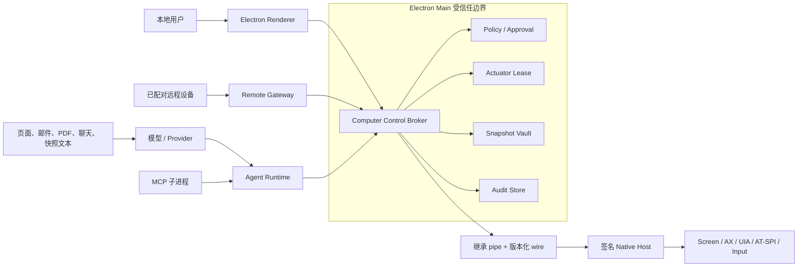

# Computer Use 安全威胁模型

> 状态: 实施中 | 最后核对: 2026-07-28

本文定义 Spark Agent Computer Use、应用快照、远程看护和自主验收的安全边界。它是 `CU-00` 的发布基线；后续 Broker、Native Host、Snapshot Vault、Provider Adapter、Renderer 和 Remote Gateway 的实现不得弱化本文约束。

## 1. 保护目标

必须保护以下资产：

- 用户桌面、窗口图像、Accessibility/UIA/AT-SPI 文本和交互元素；
- 键盘输入、剪贴板、文件、浏览器登录态和应用内账号；
- Computer Session 的任务授权、执行租约、审批票据和验收证据；
- Native Host 二进制、协议消息、应用身份和显示器坐标；
- 本地与远程用户身份、设备配对关系和审计事件；
- 应用快照密文、安装级密钥、保留策略和删除记录。

首要安全目标是：模型、页面内容、Renderer、MCP 子进程、远程设备或被攻陷的 Native Host 均不能单独扩大用户授权或执行未审查动作。

## 2. 信任边界



信任判定：

- 只有 Electron 主进程内的 Broker 可以决定并派发系统动作。
- 用户直接输入是意图来源，但仍受应用、目标、数据和风险范围约束。
- 模型输出、网页、邮件、PDF、聊天、工具结果和 AX 文本全部是不可信数据。
- Renderer 负责展示和收集用户选择，不是权限或动作执行边界。
- MCP、Provider SDK 和 Native Host 都是受限执行组件，不拥有最终授权判断权。
- 远程配对仅证明设备身份，不自动授予观察、控制或审批能力。

## 3. 不可破坏的安全不变量

1. 没有有效 actuator lease 的写动作执行数必须为零。
2. 动作信封中的 frame、tree、app、window 或参数任一变化，原审批和原动作全部失效。
3. My Desktop 同一时间最多一个 Operator；Planner、Verifier、Reporter 永远不能获得 lease。
4. 未启用 Computer Use、未授权应用或未授权域名上的写动作执行数必须为零。
5. L4 动作只能拒绝或用户接管；普通模式下 L3 必须本地动作时确认，远程设备最多批准 L2；用户明确选择完全访问时，本地运行时可直接签发 L2/L3 ticket。
6. 非完全访问模式下，无本地问询通道、无人值守或远程断连时，审批必须暂停或拒绝，不能自动放行。
7. 原始截图、AX 正文、输入正文、nonce 和本地绝对路径不得进入普通日志。
8. 快照只能通过 snapshot ID 鉴权和解密，不向 Renderer、模型或远程端暴露 blob 路径。
9. Native Host 只接受版本化严格消息；未知版本、未知类型、附加字段、shell、eval 和任意路径全部拒绝。
10. `completed` 只能由 Verification Engine 在存在 verification record 时写入。
11. 快照预览必须持有短期、随机、绑定 snapshot/session/turn 的 capability；snapshot ID 本身不是读取凭据。
12. Native Host 认可的 Electron 父进程不得被 RunAsNode、Node options、inspect 或可注入动态库重新用途化。

## 4. 威胁与强制控制

| 编号 | 威胁/攻击路径                                | 影响                     | 强制控制                                                                                             | 验证方式               |
| ---- | -------------------------------------------- | ------------------------ | ---------------------------------------------------------------------------------------------------- | ---------------------- |
| T01  | 页面或邮件中的 prompt injection 要求扩大权限 | 数据泄露、外部副作用     | 非用户内容标记为不可信；任务契约不可由模型扩大；可疑注入暂停                                         | 对抗任务集、策略单测   |
| T02  | 模型在旧截图上点击                           | 错误目标、误提交         | action 绑定 `observedFrameId` 和 `observedTreeVersion`；Broker 执行前重读焦点                        | stale frame 集成测试   |
| T03  | 窗口焦点或应用身份在审批后改变               | 跨应用误操作             | ticket 绑定 action/target/data digest；app/window identity 再校验                                    | focus drift 测试       |
| T04  | 两个 Agent 同时操作真实桌面                  | 动作交叉、不可恢复状态   | 全局 actuator lease、心跳、抢占与崩溃释放                                                            | lease 竞争测试         |
| T05  | Renderer/MCP 直接调用 Native Host            | 绕过策略与审计           | Native Host pipe 仅由主进程持有；不监听本地端口                                                      | 进程权限与负向测试     |
| T06  | 复用 BrowserBridge SID/CORS/eval             | 本地代码或页面执行       | Computer Host 使用独立 wire；禁止 HTTP/CORS/eval                                                     | 架构测试、代码扫描     |
| T07  | 审批 ticket 重放或参数替换                   | 未授权高风险动作         | nonce、短 TTL、单次使用、全参数 digest、事务消费                                                     | replay/TOCTOU 测试     |
| T08  | 远程设备越权批准 L3/L4                       | 高影响副作用             | capability 独立开关；远程只允许 L2；本地可随时撤销                                                   | 远程权限矩阵测试       |
| T09  | 快照文件路径或明文落库                       | 隐私泄露                 | AES-256-GCM、钥匙串密钥、ID 协议、SQLite 只存元数据                                                  | 密文篡改与磁盘扫描测试 |
| T10  | SecureTextField/密码模式进入模型             | 凭据泄露                 | AX/UIA secure 属性过滤、本地模式检测、用户敏感区域                                                   | 平台 secure field 样本 |
| T11  | Native Host 被替换或降级                     | 任意输入、虚假观察       | signed 模式校验签名/公证/hash；local 模式校验固定目录、文件权限/hash；两者均校验严格 manifest 和协议 | 安装/升级完整性测试    |
| T12  | Native Host 伪报能力                         | 调用不安全或不存在的后端 | capability manifest 平台/后端/feature 自洽校验                                                       | contract test          |
| T13  | 坐标、DPR 或多屏映射错误                     | 点击错误区域             | 归一化坐标；显示拓扑版本；动作前后校验                                                               | Retina/多 DPI/双屏矩阵 |
| T14  | 无限循环、noop 或恶意超大消息                | DoS、失控操作            | maxSteps/runtime/noops；消息、树、图像和数组上限；Kill Switch                                        | fuzz/预算测试          |
| T15  | Stop 只取消模型，不停止动作队列              | 停止后仍操作             | Stop 撤销 lease、清队列、取消 Provider、通知 Host                                                    | P99 停止时延测试       |
| T16  | Verifier 为了通过而修改状态                  | 虚假完成                 | Verifier 只读且无 lease；关键任务双证据                                                              | 权限负向测试           |
| T17  | 远程 `/screen` 返回原图或 AX 全文            | 大范围信息泄露           | 最大 960px 脱敏预览；不返回路径/全文                                                                 | API 响应快照测试       |
| T18  | 日志或崩溃报告包含输入、路径和截图           | 持久隐私泄露             | 结构化 error code；日志字段 allowlist；崩溃前清洗                                                    | 日志扫描测试           |
| T19  | 签名 Electron 被当作通用 Node 运行时复用     | 绕过 Host 父进程信任     | 关闭 RunAsNode/NodeOptions/inspect fuses；ASAR integrity + OnlyLoadAppFromAsar                       | afterPack fuse 测试    |
| T20  | iframe、辅助窗口或伪造 Renderer 读取快照     | 越权预览、隐私泄露       | app-snapshot IPC 仅主窗口 mainFrame；短期 capability 绑定归属                                        | IPC 来源负向测试       |

## 5. 审批与 TOCTOU 规则

审批对象不是自然语言描述，而是规范化动作的不可变摘要：

```text
actionDigest = SHA256(canonical(action + intent + observedFrameId + observedTreeVersion))
targetDigest = SHA256(canonical(appIdentity + windowIdentity + targetElementOrPoint))
dataClassDigest = SHA256(canonical(dataClasses + destination)) | null
```

- canonical 编码规则必须在 protocol 中固定并用跨语言测试向量验证。
- 创建 ticket 后，Broker 再次观察目标；摘要不一致即返回 `approval_mismatch`。
- ticket 的 nonce 只在主进程和持久层中存在，不返回 Renderer 或模型。
- ticket 使用和动作入队必须在一个事务/临界区内完成。
- 动作失败、超时或未派发时也不得复用 ticket。

## 6. 快照隐私规则

- `user_context` 捕获完成后先在本地预览，用户确认前不进入 turn。
- `execution_before/after` 默认不保存原图，只保留 hash、结构化变化和脱敏缩略图。
- `verification` 证据按 Computer Run 保留；完整录制默认关闭。
- Vault blob 使用随机 nonce 的 AES-256-GCM；元数据作为 AAD，防止 snapshot ID/会话归属被替换。
- `spark-snapshot://snapshot/<id>/preview?cap=<token>` 在解密前校验短期 bearer；token 使用 256-bit 随机数并绑定 snapshot/session/turn，缺失、过期或错配统一返回 404。
- 只有主应用顶层 Renderer 可以经 `app-snapshot:*` IPC 签发新 token；历史预览加载失败最多自动续签一次。
- 删除会话/Run/快照时，数据库记录和 blob 引用计数必须同事务收敛；清理任务处理崩溃遗留孤儿。

## 7. Native Host 协议规则

- 使用继承 pipe；不得监听 TCP、Unix socket 或命名管道供任意客户端连接。
- 传输为：4 字节大端 payload 长度、1 字节 frame kind（JSON=1、binary=2）、payload；长度与 kind 在分配完整消息前校验，声明 binary descriptor 的 JSON 后必须紧邻对应二进制帧。
- 当前 `protocolVersion=1`；不兼容版本直接拒绝启动，不做静默降级。
- 图像通过 payload descriptor + 二进制帧传输，不使用临时路径和 Base64 JSON。
- Host 错误只返回稳定错误码、清洗后的消息和 retryable，不返回 stack/绝对路径。
- sidecar 崩溃、超时、消息 hash 不符或 schema 失败时，Broker 立即撤销 lease。
- artifact manifest 不能自证签名团队：Host 固定 identifier 且 Team ID 必须等于外层 SparkWork 主可执行文件经 Apple designated requirement 验证后的 Team ID；afterPack hash 必须基于最终签名字节。
- Host 在解析协议或接触 stdin/stdout 前验证直接父进程；macOS 同时绑定 PID、启动时间 token、双次 Security.framework code identity，Windows 同时验证父 PID、映像和 WinVerifyTrust 已验证 signer chain 的 leaf publisher（禁止扫描可被追加的 PKCS#7 certificate bag）。
- Windows WGC 禁止 cursor capture，并在捕获前后绑定 HWND/PID/executable identity；SendInput 的 mouse/key down 都由释放守卫配对，长动作必须短于 Client watchdog 且每步复核焦点。
- Electron 发布包关闭 `RunAsNode`、Node options 与 CLI inspect fuses，并启用 embedded ASAR integrity 和 `OnlyLoadAppFromAsar`。Playwright、MCP 与 shell 工具使用单独打包且签名的 Node runtime；该 runtime 的标识不被 Host 认可为父进程。
- `start_task`/`resume` 对所有权限模式可用；这只解除 SDK 工具层硬阻断，不绕过 Broker 的动作风险判断。普通模式在具体 L2/L3 信封上申请 digest-bound 精确审批，完全访问模式按本轮 effective permission mode 自动签发 ticket。
- `spark-snapshot://` 必须同时满足 Renderer CSP `img-src`、scheme `corsEnabled`、跨源资源策略和短期 capability token；任何一层缺失都视为预览不可用，但不得泄露 Vault 路径或明文。

## 8. 发布阻断条件

以下任一情况存在时，不得启用 My Desktop 或远程控制：

- 未通过 stale frame、窗口漂移、租约竞争、ticket replay 和 Stop 时延测试；
- L3/L4 策略存在漏拦截；
- Native Host 既无有效 signed 信任链也无有效 local manifest/hash，或协议允许未知字段；
- 原始快照、AX 文本、输入正文或 nonce 出现在普通日志；
- 无 verification record 仍可写入 `completed`；
- 非完全访问模式下，无问询通道时 Computer/remote workflow 仍会自动批准；
- Pause/Stop/takeover 均不可用，导致 Kill Switch 注册失败后没有任何受管停止通道。
- 发布包仍允许 `ELECTRON_RUN_AS_NODE`/NodeOptions/inspect，或 standalone Node 与外层应用/Host 未按发布策略签名和时间戳。

## 9. 威胁模型维护

每个 Computer Use 工作包的 PR 必须：

1. 标注是否新增资产、信任边界、数据流或外部副作用；
2. 给出命中的威胁编号和对应测试；
3. 新风险无法由现有条目覆盖时先更新本文；
4. 安全不变量变化必须新增 ADR，不允许只在代码评审评论中决定。
