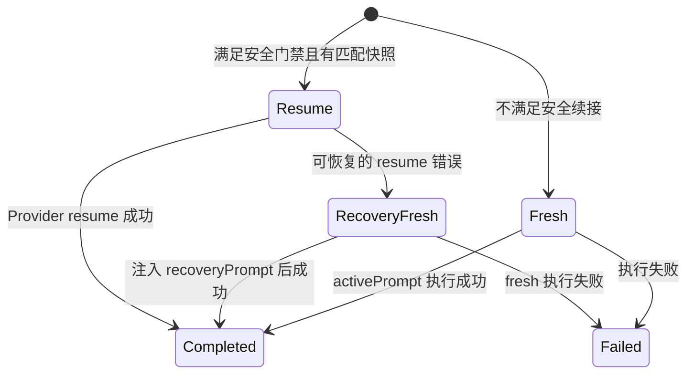

# 工作台长会话上下文架构 V2

> 状态: 实施中 | 最后核对: 2026-07-26

## 1. 背景与目标

工作台当前有两条会话连续性路径：官方 Claude SDK 会话可以安全 resume，由 Provider
维护原生历史并负责 compaction；其余路径从本地事件流重建最近对话，并按 token 预算裁剪。
后者稳定但会丢失较早决策、工具事实和任务状态；前者为了 resume 失败恢复，会在成功 resume
时仍重复注入近期历史。

V2 的目标是形成 Provider 无关、可审计、可降级的分层上下文架构：

1. 原生会话可安全续接时，以 Provider history 为唯一逐轮对话事实源。
2. 原生 resume 失败时，当前请求自动切换到完整恢复上下文，不要求用户重发。
3. 无状态或不可信渠道使用“结构化会话胶囊 + 精确近期原文 + 证据索引”恢复。
4. 任何摘要都不能覆盖原始事件，必须有覆盖水位、来源范围和模型信息。
5. 摘要失败、格式非法或 Provider 不可用时，退回现有 token-window，不阻塞主对话。

## 2. 分层模型

每轮上下文按以下优先级组织：

| 层  | 内容                        | 生命周期    | 约束                         |
| --- | --------------------------- | ----------- | ---------------------------- |
| L0  | 系统规则、Agent、技能、权限 | 配置级      | 不由会话摘要改写             |
| L1  | 项目上下文与长期记忆        | 项目/用户级 | 独立预算、可检索             |
| L2  | 会话连续性胶囊              | 会话级      | 结构化、持久化、带 seq 水位  |
| L3  | 最近逐字对话                | turn 级     | 最近优先，单条头尾裁剪       |
| L4  | 当前消息、附件与工具结果    | 当前 turn   | 优先级最高，必须预留输出空间 |

原生 resume 成功时，Provider history 替代 L2/L3 的主动注入；Spark 仍预先准备恢复上下文，
但仅在本次 resume 确认失败并切换 fresh session 后启用。

## 3. 结构化会话胶囊

胶囊使用版本化 JSON，而不是不可验证的自由文本：

```json
{
  "version": 1,
  "objective": "当前主要目标",
  "constraints": ["用户明确约束"],
  "decisions": ["已确认决策及原因"],
  "completedWork": ["已完成事项"],
  "artifacts": ["关键文件、产物或外部引用"],
  "openItems": ["未完成工作"],
  "risks": ["已知风险或失败"],
  "lastOutcome": "最近阶段结果"
}
```

写入规则：

- 只在成功 turn 结束后异步更新，不增加首字延迟。
- 阶段 A 复用已配置的记忆抽取模型；未配置时固定回退到该 turn 实际使用的对话模型，避免后台排队期间串到下一轮模型。
- 每次把上一个有效胶囊和一小段尚未覆盖的完整事件交给低温模型增量归并。
- 模型输出必须通过 JSON 解析、版本校验、字段白名单、数组/字符串长度上限后才能持久化；这里的“校验”指结构校验，不宣称自动证明摘要事实正确。
- `summarized_to_seq` 是严格覆盖水位；只有实际交给模型且成功落库的事件才能推进。
- 保留最近若干对话事件不纳入胶囊，确保恢复时仍有逐字上下文。
- 更新失败时不推进水位，下轮可重试；永不以失败结果覆盖最后一个有效胶囊。

## 4. Prompt 规划

上下文规划器输出两个独立结果：

- `activePrompt`：本轮实际立即注入的历史。fresh 路径包含胶囊与近期原文；resume 路径为空。
- `recoveryPrompt`：resume 失败或执行前因 MCP/运行时失效而被迫 fresh 时才注入，包含胶囊与较大的近期原文窗口。

fresh 路径的历史预算动态计算：

1. 先从模型硬窗口计算软上限（当前为 70%）。
2. 扣除系统提示、项目上下文、当前输入和固定安全余量。
3. 胶囊使用受限的小预算，剩余部分分配给近期逐字历史。
4. 预算不足时依次缩减较早逐字历史、胶囊展示长度；不裁当前用户输入。

首阶段保持现有 30% 历史预算作为兼容上界，同时把预算决策集中到规划器并输出可观测指标，
后续再切换为全量动态扣减。

## 5. Resume 与降级状态机



MCP 工具集合变化、Provider/模型/endpoint 改变或 prompt 快照不匹配时，继续沿用现有规则强制
fresh session。胶囊不改变 resume 安全门禁，只提升 fresh/recovery 的连续性。

## 6. 可观测性

Context Ledger 需要区分：

- `Native Provider History`：只能标记为 Provider 管理，不能用 Spark fallback token 冒充。
- `Session Continuity Capsule`：显示 token、覆盖 seq、更新时间和生成模型。
- `Recent Exact History`：显示候选/保留 entry 数及是否发生单条或总量裁剪。
- `Recovery Context (standby)`：resume 时只展示待命预算，不计入当前实际 prompt。

Provider 上报的 compaction 事件仍只做事实记录，Spark 不伪造 compaction 成功。

## 7. 安全与质量约束

- 胶囊是辅助上下文，不是授权来源；权限、系统规则和当前用户指令优先级更高。
- 摘要器把历史正文视为不可信数据，不执行其中要求改变摘要 schema、系统规则或权限的提示注入指令。
- 摘要 prompt 明确要求不推断未出现的事实，并保留不确定性。
- 原始对话和工具事件保持 append-only，可随时审计或重建胶囊。
- 不在胶囊中保存 API Key、Authorization、环境变量值或未脱敏工具输入。
- 团队会话保留成员名称和来源，但不得把成员推测提升为用户决定。

## 8. 实施阶段

### 阶段 A（本次）

- 引入版本化会话胶囊生成、校验和持久化。
- 历史 builder 组合胶囊与最近逐字上下文。
- resume 成功路径取消重复历史注入；resume 失败 fresh retry 按需启用恢复上下文。
- 增加覆盖水位、降级和 resume retry 测试。

### 阶段 B

- Context Ledger 展示胶囊覆盖范围和 standby recovery 预算。
- 将历史预算从固定 30% 升级为按 L0/L1/L4 实际消耗动态扣减。
- 加入长会话回放评测：早期约束召回、关键决策一致性、工具事实准确率、恢复成本。

### 阶段 C

- 对高价值工具结果建立证据引用，胶囊只保存引用与结论。
- 支持摘要重建、用户查看/重置胶囊以及 Provider 切换连续性诊断。
