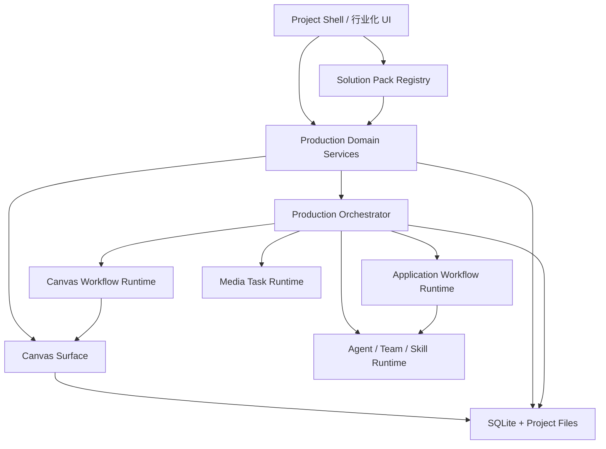

# Spark Work 行业解决方案包架构设计

> 状态: 待开发 | 最后核对: 2026-07-26

## 1. 背景与结论

Spark Work 已经具备 Agent 工作台、应用工作流、无限画布、画布工作流、媒体任务、资产中心、Provider 路由、审批和用量账本等横向能力，但目前缺少承载垂直行业的统一产品层。

现有影视能力主要通过 `CanvasProject.metadata.film`、`CanvasAsset.metadata.kind` 和渲染层专用组件落地。如果继续以相同方式加入广告、电商和教育字段，会出现以下问题：

1. 行业数据与画布展示状态绑定，无法在列表、审核、批量处理和交付阶段独立查询。
2. 每增加一个行业，都需要修改 `CanvasWorkspaceView`、`canvas.api`、Canvas 节点和资产面板。
3. 应用工作流与画布工作流各自拥有定义、版本和运行态，缺少跨运行时的项目级协调层。
4. 审核、成本、交付、版本和上游变更失效属于四个行业的共同能力，目前没有统一领域模型。
5. 单文件已经过大，继续直接追加行业逻辑会显著放大回归风险。

本设计的核心结论是：

> 不把四个行业直接写进 Canvas，也不复制四套应用。新增一个位于 Agent 工作台和无限画布之上的“生产项目 + 行业解决方案包”层；行业包负责声明领域 Schema、项目模板、工作流、校验器、导出器和界面贡献，现有工作流与画布继续作为执行引擎和创作表面。

行业包第一阶段只允许声明式配置和应用内已注册扩展，不加载第三方任意 JavaScript。先保证可迁移、可审计和可测试，未来再考虑签名扩展市场。

## 2. 设计目标

### 2.1 产品目标

- 同一套安装包支持广告、影视、电商、教育和通用模式。
- 用户创建项目时选择行业包，立即获得对应项目结构、表单、工作流、Agent、检查规则和导出格式。
- Agent 工作台与无限画布在同一个生产项目中协作，不再是两块孤立功能。
- 行业包可以独立升级，项目锁定创建时使用的包版本，避免更新后旧项目失效。
- 公共能力只实现一次，行业差异通过 Schema 和扩展点表达。

### 2.2 工程目标

- 兼容现有 Canvas 项目、快照、影视数据和导出包。
- 不直接合并应用 Workflow 与 Canvas Workflow 两套运行时。
- 不在 `CanvasProject.metadata` 中继续堆积新的行业主数据。
- 不在 `CanvasWorkspaceView.tsx` 和 `canvas.api.ts` 中继续增加行业功能。
- 核心领域协议进入 `packages/protocol`，持久化进入 `packages/storage`，业务服务进入 `packages/agent-runtime` 或新的独立包。
- 所有行业数据必须经过版本化 Schema 校验。

### 2.3 非目标

- 第一阶段不做实时多人协作。
- 第一阶段不做第三方可执行代码插件。
- 第一阶段不做完整视频剪辑器、LMS、广告投放系统或电商 ERP。
- 不为了行业化重写现有 Canvas 渲染和媒体 Provider 栈。
- 不把 BoardView 直接升级为行业生产数据库；现有 Board 数据为文件存储，适合作为轻量任务面板，不适合作为行业项目事实源。

## 3. 当前架构评估

### 3.1 可直接复用的能力

| 现有能力 | 行业化用途 | 处理方式 |
| --- | --- | --- |
| Agent / Team / Skill | 调研、策划、拆解、检查和复核 | 行业包声明推荐 Agent、Team 和 Skill |
| 应用 Workflow | 跨工具的计划、审批、执行和验证 | 保持独立运行时，由生产流程协调器调用 |
| Canvas Workflow | 图片、视频、文本等画布节点流水线 | 保持独立运行时，由生产流程协调器调用 |
| Canvas Board / Node | 可视化创作和素材关系 | 作为生产项目的一个 surface，不承担全部行业数据 |
| Canvas Asset | 本地创作资产和节点引用 | 逐步投影到项目资产索引，暂不立即迁移事实源 |
| Media Generation Task | 图片、音频、视频任务生命周期 | 增加项目、阶段和成本归属关联 |
| Usage Ledger | 文本模型 token 成本 | 扩展统一成本条目，不直接塞媒体成本 |
| 项目包导入导出 | 离线迁移和早期客户交付 | 扩展为 Solution Project Package |
| Permission / Audit | 高风险操作治理 | 复用，增加行业动作标签 |

### 3.2 不能直接承载行业化的部分

#### Canvas 快照

当前 `CanvasSnapshot` 把 project、boards、nodes、edges、assets 和 tasks 作为一个 JSON 快照持久化。它适合渲染和离线迁移，但不适合：

- 查询所有待客户审核的资产；
- 按 SKU、镜头、课时统计完成度；
- 追踪实体版本和上游失效；
- 进行跨画布的资产复用；
- 将成本精确归属到行业实体；
- 做稳定的增量同步。

因此 Canvas 快照应继续作为画布 surface 的持久化协议，而不是新的行业数据库。

#### 影视 metadata

影视类型已经验证了“快速用 JSON 扩展”的可行性，也暴露了其上限：大量角色、场景、镜头和引用关系已经散布在项目 metadata、资产 metadata 和多个渲染层 helper 中。

后续不再新增 `metadata.advertising`、`metadata.commerce`、`metadata.education`。影视数据也应在行业内核稳定后逐步投影和迁移到统一领域记录。

#### BoardView

Board 任务当前持久化在 `~/.spark-agent/board-tasks.json`，协议状态固定为开发任务语义。它可以作为个人任务视图，但不能承担项目审核、客户批注、镜头状态、SKU 状态或课程审批。

#### 双 Workflow

应用 Workflow 和 Canvas Workflow 的节点模型、执行器、状态和恢复语义不同，当前数据库也明确要求隔离。强行合并会破坏已落地的运行时。

正确方案是在其上增加轻量协调器，保存跨引擎阶段状态和引用，不复制节点执行逻辑。

### 3.3 代码风险

| 符号/文件 | 当前情况 | 风险 |
| --- | --- | --- |
| `CanvasWorkspaceView.tsx` | 约 10,104 行，承载大量 UI 和行业行为 | CRITICAL |
| `canvas.api.ts` | 约 6,392 行，包含项目、快照、资产、任务、影视和工作流操作 | CRITICAL |
| `CanvasSnapshot` / `CanvasProject` | 大量渲染组件、测试和导入导出依赖 | HIGH |
| `CanvasAsset.metadata` | 资产治理和影视领域同时使用 | HIGH |
| `CanvasPipelineRole` | 已固定为影视生产语义 | HIGH |
| 应用 `workflows` 与画布 `canvas_workflows` | 两套稳定但不同的运行模型 | HIGH |

第一阶段不得通过直接扩展这些核心联合类型来加入四个行业。

## 4. 目标分层架构



### 4.1 表面层：Project Shell

生产项目统一使用一个项目外壳，根据行业包显示不同导航：

- 概览；
- 行业对象；
- 画布；
- 生产运行；
- 审核；
- 资产；
- 成本；
- 交付。

行业包只声明导航和已注册视图，不直接接管应用路由。

### 4.2 行业包层：Solution Pack Registry

负责：

- 扫描内置和已安装行业包；
- 校验 manifest 和资源；
- 检查应用版本与依赖；
- 解析领域 Schema、项目模板和工作流引用；
- 创建项目时固化包版本快照；
- 提供 UI、Agent、验证和导出贡献。

### 4.3 领域层：Production Domain

负责行业无关的项目、记录、关系、修订、审核、资产索引、成本和交付。

### 4.4 协调层：Production Orchestrator

负责把一个行业流程拆成跨引擎阶段：

- Agent 工作流阶段；
- Canvas 工作流阶段；
- 人工审核阶段；
- 批量任务阶段；
- 导出阶段。

协调器只管理阶段状态、输入输出引用、幂等键和恢复点；具体节点执行仍委托现有运行时。

### 4.5 执行层

继续复用现有 Agent、Workflow、Canvas Workflow 和 Media Task，不在行业包内复制执行器。

## 5. 行业包协议

### 5.1 文件结构

```text
solution-packs/
└── advertising-studio/
    ├── manifest.json
    ├── schemas/
    │   ├── brand.schema.json
    │   ├── campaign.schema.json
    │   ├── creative-concept.schema.json
    │   └── script.schema.json
    ├── ui/
    │   ├── navigation.json
    │   └── forms.json
    ├── project-templates/
    │   └── default.json
    ├── workflows/
    │   ├── campaign-planning.workflow.json
    │   └── creative-production.canvas-workflow.json
    ├── validators/
    │   ├── brand-compliance.json
    │   └── delivery-spec.json
    ├── exporters/
    │   └── campaign-delivery.json
    ├── skills/
    │   └── advertising-planner/
    │       └── SKILL.md
    └── assets/
        └── demo-project/
```

### 5.2 Manifest 草案

```ts
export interface SolutionPackManifest {
  schemaVersion: 1
  id: string
  version: string
  name: string
  description: string
  industry: 'advertising' | 'film' | 'commerce' | 'education' | string
  minAppVersion: string
  capabilities: string[]
  recordTypes: SolutionRecordTypeContribution[]
  projectTemplates: ResourceRef[]
  workflows: SolutionWorkflowContribution[]
  agents?: SolutionAgentContribution[]
  skills?: ResourceRef[]
  validators?: SolutionValidatorContribution[]
  exporters?: SolutionExporterContribution[]
  views?: SolutionViewContribution[]
  migrations?: SolutionSchemaMigration[]
}
```

### 5.3 第一阶段安全边界

- Manifest、Schema、模板、规则和工作流均为 JSON/Markdown 资源。
- 行业包只能引用应用内注册的 `viewType`、`validatorType` 和 `exporterType`。
- 不允许从包目录动态执行 JavaScript、Node 模块或 shell。
- 安装时校验路径穿越、资源大小、Schema 深度和依赖。
- 项目保存创建时使用的 pack id、version 和 manifest hash。
- 第三方包市场必须等签名、权限和兼容策略完成后再开放。

## 6. 通用领域模型

### 6.1 生产项目

```ts
interface ProductionProject {
  id: string
  userId: number
  packId: string
  packVersion: string
  packSnapshotHash: string
  title: string
  description?: string
  status: 'active' | 'archived' | 'deleted'
  rootPath?: string
  settings: Record<string, unknown>
  createdAt: string
  updatedAt: string
}
```

一个 ProductionProject 可以拥有多个 surface：

- Canvas 项目；
- Agent session；
- 应用 Workflow；
- 外部目录或交付目录。

```ts
interface ProjectSurface {
  id: string
  projectId: string
  type: 'canvas' | 'session' | 'workspace' | 'external'
  refId: string
  role: string
  metadata: Record<string, unknown>
}
```

这层关系使 Canvas 不再等同于整个行业项目。

### 6.2 领域记录

四个行业需要不同对象，但都可以使用版本化的 typed record：

```ts
interface ProjectRecord {
  id: string
  projectId: string
  type: string
  schemaVersion: number
  parentId?: string
  title: string
  lifecycle: RecordLifecycle
  data: Record<string, unknown>
  currentRevision: number
  createdAt: string
  updatedAt: string
}
```

统一生命周期：

```ts
type RecordLifecycle =
  | 'draft'
  | 'in_review'
  | 'changes_requested'
  | 'approved'
  | 'locked'
  | 'stale'
  | 'archived'
```

行业类型示例：

| 行业包 | Record Types |
| --- | --- |
| 广告 | brand、campaign、brief、creative_concept、script、deliverable_variant |
| 影视 | series、episode、scene、shot、character、location、prop、costume_state |
| 电商 | brand、product、sku、market、platform_listing、creative_variant、claim |
| 教育 | course、learning_outcome、module、lesson、activity、assessment、rubric |

领域数据使用 JSON 保存，但必须满足 pack 中的版本化 JSON Schema。不能向 `data` 写入未声明字段。

### 6.3 记录修订与来源

```ts
interface ProjectRecordRevision {
  recordId: string
  revision: number
  data: Record<string, unknown>
  source: 'human' | 'agent' | 'import' | 'migration'
  sourceRunId?: string
  createdBy?: string
  createdAt: string
}
```

每次重要编辑产生修订，不覆盖历史。普通 UI 布局变化不产生领域修订。

### 6.4 关系与失效传播

```ts
interface ProjectRecordLink {
  id: string
  projectId: string
  sourceRecordId: string
  targetRecordId: string
  relation: 'contains' | 'references' | 'derived_from' | 'validates' | string
  sourceRevision?: number
  metadata: Record<string, unknown>
}
```

当上游记录修订变化时，系统根据 link 和记录的 input revision 标记下游为 `stale`。例如：

- 商品事实变化，使多语言 Listing 和广告图过期；
- 剧本场次变化，使对应镜头和分镜过期；
- 学习目标变化，使课时和测评过期；
- Brand Kit 变化，使尚未交付的广告创意需要复核。

失效只标记，不自动删除或覆盖下游成果。

### 6.5 项目资产索引

第一阶段不立即重写 CanvasAsset。新增项目级资产索引作为跨 surface 的投影和引用层：

```ts
interface ProjectAssetRef {
  id: string
  projectId: string
  sourceType: 'canvas_asset' | 'file' | 'external_url' | 'generated'
  sourceRef: string
  kind: string
  title: string
  recordId?: string
  revision?: number
  provenance?: AssetProvenance
  metadata: Record<string, unknown>
}
```

CanvasAsset 仍由 Canvas 快照管理；ProjectAssetRef 允许审核、交付、成本和行业记录稳定引用它。待投影稳定后，再决定是否把 CanvasAsset 迁移为结构化事实源。

### 6.6 审核

```ts
interface ReviewRequest {
  id: string
  projectId: string
  targetType: 'record' | 'asset' | 'run' | 'delivery'
  targetId: string
  targetRevision?: number
  status: 'open' | 'changes_requested' | 'approved' | 'rejected' | 'closed'
  reviewerRole?: string
  dueAt?: string
  createdAt: string
  resolvedAt?: string
}
```

评论、决定和批注独立存储，不能继续复用 Board task comments JSON。

### 6.7 成本

现有 Usage Ledger 主要面向文本模型 token。新增统一成本条目：

```ts
interface CostEntry {
  id: string
  projectId: string
  runId?: string
  stageId?: string
  recordId?: string
  assetId?: string
  providerId: string
  modelId: string
  category: 'text' | 'image' | 'video' | 'audio' | 'storage' | 'manual'
  quantity: number
  unit: 'token' | 'image' | 'second' | 'request' | 'hour'
  amount: number
  currency: string
  estimated: boolean
  createdAt: string
}
```

Usage Ledger 和媒体任务通过 projector 写入 CostEntry，不改变原始账本语义。

### 6.8 交付

```ts
interface Delivery {
  id: string
  projectId: string
  exporterId: string
  status: 'draft' | 'building' | 'ready' | 'failed' | 'delivered'
  manifest: DeliveryManifest
  outputPath?: string
  createdAt: string
  updatedAt: string
}
```

交付 manifest 记录包含哪些记录、资产、修订和审核结果，保证重新导出可复现。

## 7. 跨引擎生产流程

### 7.1 不合并两套 Workflow

现有隔离应继续保留：

- Application Workflow：适合 Agent、Skill、Tool、Approval、Verify、Review。
- Canvas Workflow：适合画布节点、媒体操作、输入输出契约和血缘。

新增 Solution Process，只协调阶段：

```ts
type ProductionStageKind =
  | 'agent_workflow'
  | 'canvas_workflow'
  | 'batch'
  | 'human_review'
  | 'validator'
  | 'export'

interface ProductionProcessDefinition {
  id: string
  version: number
  stages: ProductionStageDefinition[]
  edges: ProductionStageEdge[]
}
```

每个 stage 只保存：

- 输入记录或资产查询；
- 目标工作流及版本；
- 输出映射；
- 完成条件；
- 重试和人工闸门；
- 幂等键策略。

### 7.2 运行态

```ts
interface ProductionRun {
  id: string
  projectId: string
  processId: string
  processVersion: number
  status: 'queued' | 'running' | 'paused' | 'completed' | 'failed' | 'cancelled'
  inputSnapshot: Record<string, unknown>
  createdAt: string
  updatedAt: string
}

interface ProductionStageRun {
  id: string
  runId: string
  stageId: string
  status: string
  delegatedRuntime?: 'workflow' | 'canvas_workflow' | 'media' | 'none'
  delegatedRunId?: string
  inputRefs: VersionedRef[]
  outputRefs: VersionedRef[]
  error?: Record<string, unknown>
}
```

协调器不复制底层运行数据，只记录关联 run id。

### 7.3 示例：广告 Campaign

```text
brief-normalize      agent_workflow
        ↓
concept-planning     agent_workflow
        ↓
concept-approval     human_review
        ↓
storyboard-create    canvas_workflow
        ↓
variant-batch        batch/canvas_workflow
        ↓
brand-validation     validator
        ↓
client-review        human_review
        ↓
delivery-export      export
```

### 7.4 示例：教育课程

```text
source-index         agent_workflow
        ↓
outcome-design       agent_workflow
        ↓
expert-review        human_review
        ↓
assessment-design    agent_workflow
        ↓
lesson-production    canvas_workflow / batch
        ↓
alignment-check      validator
        ↓
course-export        export
```

## 8. UI 扩展架构

### 8.1 Project Shell

不在 Canvas 内加入四套行业侧栏。新增项目外壳负责全局导航，Canvas 只是其中一个标签页。

```text
项目概览
行业对象
画布
生产运行
审核
资产
成本
交付
```

### 8.2 通用 Schema UI

简单行业记录通过 JSON Schema + UI Schema 渲染：

- 表单；
- 表格；
- 详情；
- 状态；
- 父子层级；
- 引用选择。

影视时间线、3D 导演台、电商变体矩阵等复杂界面使用注册组件：

```ts
interface SolutionViewContribution {
  id: string
  slot: 'project-tab' | 'record-detail' | 'canvas-panel' | 'dashboard-widget'
  viewType: string
  appliesTo?: string[]
  config?: Record<string, unknown>
}
```

Manifest 只能引用已经由应用注册的 `viewType`，避免动态执行 UI 代码。

### 8.3 Canvas 贡献点

行业包可以声明：

- 创建节点菜单项；
- pipeline role 显示配置；
- 资产分类；
- Inspector 面板；
- 默认画板模板；
- 行业命令；
- 记录与 Canvas 节点的绑定规则。

底层不再继续扩大 `CanvasPipelineRole` 联合类型，而应演进为字符串 role + 注册表，并为旧影视 role 保留兼容映射。

## 9. 包与核心的职责边界

| 能力 | Core | Pack |
| --- | --- | --- |
| 项目、记录、修订、关系 | 是 | 声明 record schema |
| Canvas、Workflow、Media 执行 | 是 | 引用定义和模板 |
| 审核、评论、成本、交付 | 是 | 声明流程和规则 |
| 行业对象字段 | 否 | 是 |
| 行业 Prompt 和 Skill | 加载/治理 | 提供内容 |
| 行业校验 | 提供引擎 | 提供规则或注册类型 |
| 通用表单和列表 | 是 | 提供 UI schema |
| 高级行业界面 | 提供扩展槽 | 引用已注册 view |
| 任意代码执行 | 第一阶段禁止 | 禁止 |

## 10. 四个行业包的边界

### 10.1 Advertising Studio Pack

核心记录：brand、campaign、brief、creative_concept、script、deliverable_variant。

专用能力：Brand Kit、创意审批、批量变体、平台规格、客户交付包。

### 10.2 Film Preproduction Pack

核心记录：series、episode、scene、shot、character、location、prop、costume_state。

专用能力：剧本拆解、集场镜层级、连续性、导演台、首尾帧、镜头表导出。

现有 `metadata.film` 先通过 adapter 暴露为只读 ProjectRecord 投影，新写入走双写，稳定后再切换事实源。

### 10.3 Commerce Content Pack

核心记录：brand、product、sku、market、platform_listing、claim、creative_variant。

专用能力：CSV 导入、产品事实锁、语言术语库、平台规格、批量矩阵、SKU 交付包。

### 10.4 Education Content Pack

核心记录：course、learning_outcome、module、lesson、activity、assessment、rubric。

专用能力：资料引用、目标—活动—测评对齐、专家审核、题库和课程包导出。

## 11. 数据库草案

建议新增：

```text
solution_packs
production_projects
project_surfaces
project_records
project_record_revisions
project_record_links
project_asset_refs
review_requests
review_comments
review_decisions
production_processes
production_process_versions
production_runs
production_stage_runs
cost_entries
deliveries
delivery_items
```

原则：

- Pack 定义版本不可变。
- Run 使用定义快照和固定版本。
- Record 修订追加写，当前记录只保存 latest pointer。
- 评论和审核决定不内联 JSON。
- 成本和交付必须有项目归属。
- 删除项目默认软删除；文件清理由单独流程完成。

## 12. 建议代码结构

```text
packages/
├── protocol/src/solution/
│   ├── manifest.ts
│   ├── project.ts
│   ├── record.ts
│   ├── review.ts
│   ├── process.ts
│   ├── cost.ts
│   └── delivery.ts
├── storage/src/repositories/solution/
├── solution-runtime/
│   ├── pack-registry/
│   ├── project-service/
│   ├── record-service/
│   ├── invalidation-service/
│   ├── review-service/
│   ├── orchestrator/
│   ├── cost-projector/
│   └── delivery-service/
└── solution-packs/
    ├── advertising-studio/
    ├── film-preproduction/
    ├── commerce-content/
    └── education-content/

apps/desktop/src/renderer/design/views/solution/
├── SolutionProjectsView.tsx
├── SolutionProjectShell.tsx
├── SolutionOverview.tsx
├── SolutionRecordList.tsx
├── SolutionRecordEditor.tsx
├── SolutionReviewPanel.tsx
├── SolutionCostView.tsx
├── SolutionDeliveryView.tsx
└── registry/
```

`packages/solution-runtime` 是否单独成包可以在第一阶段评估。如果暂时放在 `agent-runtime`，也必须使用独立 `services/solution/` 目录，避免继续扩大 `session.service.ts`。

## 13. 迁移策略

### 13.1 兼容原则

- 旧 Canvas 项目不自动改变显示和执行行为。
- 第一次打开旧项目时可提示“转换为生产项目”，不强制转换。
- 转换先创建 ProductionProject 和 Canvas surface 引用，不移动快照。
- 影视 metadata 通过 adapter 投影为行业记录。
- 新旧数据双写期间必须有一致性检查和可回滚备份。
- 项目导出包同时包含旧 snapshot 和新 solution manifest。

### 13.2 影视数据迁移

分三步：

1. Read adapter：把 film metadata 映射成 ProjectRecord，只读。
2. Dual write：新 UI 写 ProjectRecord，同时回写旧 metadata，旧界面继续工作。
3. Source switch：验证多个版本后，以 ProjectRecord 为事实源，Canvas metadata 只保留必要投影。

不得一次性把全部影视数据从快照搬到新表。

### 13.3 资产迁移

第一阶段创建 ProjectAssetRef，不移动或重写 CanvasAsset。ProjectAssetRef 保存 sourceRef，交付和审核通过引用访问真实资产。

## 14. 开发阶段

### 阶段 0：解耦护栏，2 周

目标：不改变功能，先降低后续开发风险。

- 给 Canvas 核心流程补足 characterization tests。
- 从 `CanvasWorkspaceView.tsx` 拆出项目壳、运行、任务、影视面板和工作台 hooks。
- 从 `canvas.api.ts` 拆出 project、snapshot、asset、task、workflow、film adapter 模块。
- 为 Canvas API 引入 facade，旧调用不立即修改签名。
- 为现有快照和影视 metadata 建立版本化解析器。

验收：

- 现有测试通过；
- 导入导出往返一致；
- 影视项目和普通 Canvas 项目行为不变；
- 新拆分文件单文件控制在 3,000 行以内，核心模块尽量低于 1,000 行。

### 阶段 1：行业包内核，2—3 周

- Solution Pack manifest 和 Schema。
- 内置 Pack Registry。
- production_projects、project_surfaces、project_records 和 revisions。
- 创建项目、列出项目、打开项目。
- 默认 `general` pack，旧 Canvas 项目可转换为 general project。
- Pack 安装安全校验，第一阶段仅内置包。

验收：

- 可以通过纯 manifest 创建两种不同结构的项目；
- 项目锁定 pack version；
- 非法字段和不兼容版本被拒绝；
- 删除 pack 不破坏已有项目的 pack snapshot。

### 阶段 2：公共生产服务，3 周

- ProjectRecord 关系和 stale 传播。
- ReviewRequest、评论和决定。
- ProjectAssetRef。
- CostEntry projector。
- Delivery manifest 和本地交付包。
- Project Shell 的概览、审核、成本和交付页。

验收：

- 修改上游记录会标记下游 stale；
- 批准固定到目标 revision；
- 成本可归属到项目、运行、记录和资产；
- 交付包可复现其输入修订和资产。

### 阶段 3：跨引擎协调器，2—3 周

- Production Process 定义和版本。
- Application Workflow adapter。
- Canvas Workflow adapter。
- Human review、validator、export stage。
- 暂停、恢复、失败重试和幂等。

验收：

- 一次流程可以从 Agent Workflow 进入人工审批，再进入 Canvas Workflow；
- 重启应用后可以恢复；
- 重试不重复创建已完成产物；
- 底层运行详情仍可分别在原工作流界面查看。

### 阶段 4：Advertising Studio Pack，4—6 周

- Brand、Campaign、Brief、Concept、Script、Variant Schema。
- 广告项目模板和演示项目。
- Brand Kit 和创意审批 UI。
- 创意策划 Agent Workflow。
- 分镜和素材 Canvas Workflow。
- 批量变体矩阵。
- 品牌和平台规格 Validator。
- Campaign Delivery Exporter。

验收以真实客户项目为准：完成一个 Brief 到交付包的闭环。

### 阶段 5：影视迁移与第二行业包，4—8 周

- 先迁移现有 Film 数据到 Film Pack adapter。
- 根据市场验证选择 Film 或 Commerce 作为第二个完整行业包。
- Education Pack 只先做 Schema 和工作流原型，不并行开发完整 UI。

## 15. 测试策略

### 15.1 合同测试

- Pack manifest 校验。
- Record JSON Schema 校验。
- Pack version 和迁移。
- View/validator/exporter 注册引用。

### 15.2 持久化测试

- Record/revision/link 事务。
- 审核目标 revision 固定。
- Stale 传播。
- 项目软删除与导出。
- 旧 Canvas 转换和导入导出。

### 15.3 编排测试

- 跨引擎阶段成功路径。
- 审批暂停。
- 应用重启恢复。
- 幂等重试。
- 下游失败不污染上游成果。

### 15.4 每个行业的 Golden Project

每个行业包维护一个小型固定示例项目：

- 广告：单 Campaign、两个创意、三个素材变体。
- 影视：一集、一场、三个镜头。
- 电商：两个 SKU、两个市场、两个平台。
- 教育：两个学习目标、两个课时、一组测评。

每次发布验证从创建、运行、审核到导出完整闭环。

## 16. 风险与决策门

### 16.1 最高风险

1. 直接迁移 Canvas 快照为多表结构。
2. 直接合并两套 Workflow。
3. 用一个无限泛化的 JSON 模型替代所有领域约束。
4. 在 renderer 里实现事实源业务逻辑。
5. 四个行业包同时开发。
6. 第一阶段开放任意代码插件。

### 16.2 决策门

进入阶段 3 前：

- 至少两个不同 Pack 能用同一领域内核创建项目；
- 旧 Canvas 转换无数据丢失；
- Record revision 和 stale 传播稳定。

进入第二行业包前：

- Advertising Pack 至少有 3 个真实项目完成闭环；
- 至少 2 个客户重复使用；
- 公共能力和广告专用能力边界已经通过代码和使用数据验证。

开放第三方 Pack 前：

- 包签名、权限、版本兼容、回滚和恶意资源限制完成；
- 公开 Schema 和扩展 API 有独立兼容测试。

## 17. 推荐实施顺序

最终推荐顺序为：

1. 先拆分 Canvas 巨型文件并建立 facade。
2. 建立 ProductionProject、ProjectSurface 和版本化 ProjectRecord。
3. 建立审核、成本、交付和 stale 传播。
4. 建立只协调、不复制执行的 Production Orchestrator。
5. 完成 Advertising Studio Pack 的真实闭环。
6. 用 adapter 迁移现有影视能力到 Film Pack。
7. 依据付费验证选择 Commerce 或 Film 继续。
8. Education 先做资料引用和课程对齐原型，暂不做完整 LMS。

该顺序会比“先搭一个万能插件框架，再同时开发四个行业”慢一点看到四张新页面，但能显著降低数据和运行时失控风险，并确保每一步都能被真实项目验证。
