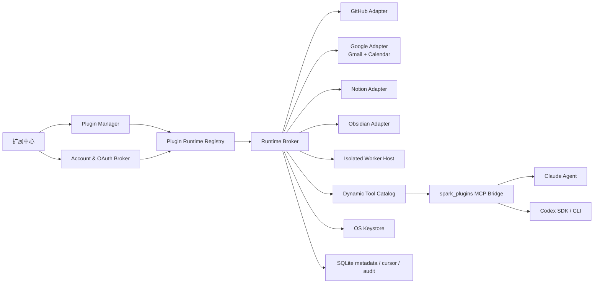

# 插件运行时与首批正式连接器开发计划

> 状态: 实施中 | 最后核对: 2026-08-09

## 1. 目标与不可妥协的约束

本计划把当前“可安装、可授权、可登记资源”的能力包系统推进为 Agent 真正可调用的生产级运行时。首批必须完成 GitHub、Gmail、Notion、Obsidian 和日历；其中“日历”首个正式 Provider 为 Google Calendar，协议保持 Provider-neutral，后续可增加 Apple Calendar、CalDAV、Outlook Calendar，而不修改 Agent 工具协议。

最终产品必须满足：

- 插件是安装来源、签名、权限、启停、升级和卸载的治理边界。
- Connector Runtime 是账号授权、令牌生命周期、API 调用、同步和健康检查的执行边界。
- MCP 是 Agent 消费工具的统一传输层，不承担插件安装或 Provider 账号管理。
- Skill 独立存在，只描述如何使用工具、领域流程和编排，不保存凭据、不代理 API。
- Renderer 和 Electron Main 不加载第三方插件 JavaScript；第三方执行代码只能进入隔离 Runtime Host。
- 所有工具调用都必须在调用时再次检查：插件状态、账号状态、权限、能力范围、资源范围和动作风险。
- Secret 永不进入 SQLite、Renderer、模型上下文、工具 schema、日志或错误文本，只保存 keystore 引用。
- 所有首批实现直接建立在最终 SPI 上，不允许为单个 Provider 增加临时专用架构。

## 2. 当前实现与主要缺口

现有基础可以保留：

- `packages/protocol/src/plugin.ts` 已有能力包 manifest、权限、市场与运行时绑定。
- `PluginManager` 已完成安装、完整性、权限、资源同步、启停和卸载。
- `connector_connections` 已实现“非敏感摘要入库、secret 进入系统 keystore”的基本原则。
- `McpOAuthService` 已实现 loopback callback、state、刷新、DCR 和安全 TokenStore，可抽取为通用 OAuth 基础设施。
- `GitHubConnectorService` 已有真实 REST 调用、仓库范围、写操作开关和运行时 Guard。
- `spark_platform` MCP/Platform Bridge 已证明 Claude SDK、Codex SDK/CLI 都能调用 Electron Main 内的真实服务。

必须解决的结构性问题：

1. `runtime.id` 只支持 host 内置白名单，缺少统一 Runtime SPI、生命周期和动态工具目录。
2. GitHub 服务、IPC、Platform Bridge 和工具名均为专用硬编码，新增 Provider 会复制整条链路。
3. `connector_connections.provider` 唯一，只支持一个 Provider 一个账号，无法支持多个 Gmail、Notion workspace 或 GitHub installation。
4. OAuth 仅挂在 MCP Server 上，尚未成为 Connector Runtime 可复用的账号授权服务。
5. Agent 工具白名单仍包含固定的 GitHub 名称，不能根据插件启用、账号和 capability 动态变化。
6. 缺少统一的写操作确认、幂等、速率限制、审计、健康检查和错误分类。
7. Gmail/Notion 目前只有 manifest；Obsidian 和 Calendar 尚无正式 runtime。

### 2.1 本轮已落地的最终架构部分

截至本次实施，以下部分已经进入代码并有自动化验收覆盖：

- Plugin Protocol v2、runtime contribution、通用 Runtime IPC、多账号账号表和旧 GitHub
  connection 兼容迁移。
- Runtime Registry/Broker、统一 policy/error/audit、keystore credential reference、
  OAuth PKCE loopback broker、refresh token rotation 与并发 refresh single-flight。
- `spark_plugins` Streamable HTTP MCP bridge，按当前账号和 capability 动态生成工具，
  每次 invoke 重新执行插件/账号/scope/风险确认检查。
- GitHub、Google Workspace（Gmail + Calendar）、Notion、Obsidian 四个内置 runtime；
  首批工具不再由 Agent 固定白名单直接硬编码。
- `@spark/plugin-sdk`、contract test helper 和 `examples/plugins/acme-tasks` 开发示例。
- GitHub/Gmail/Notion 的真实 provider acceptance test 已加入；未配置隔离测试凭据时只会
  显式 skip，不会以 mock 结果冒充真实验收。

仍未达到发布完成定义、因此不能标记为“已落地”的部分：隔离 Worker Host（含签名包校验、
资源限制和跨平台沙箱）、Google/Notion 外部 OAuth 审核、完整账号 UI 的通用化迁移、真实
账号 nightly E2E、限流/断路器/同步索引和打包应用验收。这些是后续阶段的发布门禁；在
Worker Host 完成前，市场中的 worker 插件只能安装检查并保持不可执行状态。

## 3. 最终架构



### 3.1 核心模块

建议建立以下最终模块，不继续向 `session.service.ts` 或 `platform-bridge.service.ts` 塞入 Provider 分支：

```text
packages/protocol/src/plugin-runtime.ts
packages/agent-runtime/src/services/plugin-runtime/
  runtime-registry.ts
  runtime-broker.ts
  runtime-policy.ts
  runtime-tool-catalog.ts
  runtime-errors.ts
  runtime-http-client.ts
  account-service.ts
  oauth-broker.ts
  token-service.ts
  audit-service.ts
  sync-service.ts
  adapters/
    github/
    google/
    notion/
    obsidian/
apps/desktop/src/main/services/PluginRuntime/
  registerPluginRuntimeIpc.ts
  DesktopOAuthCallback.ts
  PluginRuntimeHost.ts
packages/plugin-sdk/
  src/index.ts
  src/testing.ts
packages/storage/migrations/
examples/plugins/acme-tasks/
```

### 3.2 Runtime SPI

所有 Provider 实现同一接口。首批 Provider 为 built-in adapter，但调用方式与未来第三方 worker 完全一致。

```ts
export interface ConnectorRuntimeAdapter {
  readonly descriptor: ConnectorRuntimeDescriptor

  connect(ctx: ConnectContext, request: ConnectRequest): Promise<ConnectorAccount>
  disconnect(ctx: RuntimeContext, accountId: string): Promise<void>
  healthCheck(ctx: RuntimeContext, accountId: string): Promise<RuntimeHealth>
  refreshAccount(ctx: RuntimeContext, accountId: string): Promise<ConnectorAccount>

  listTools(ctx: RuntimeContext, accountId: string): Promise<RuntimeToolDefinition[]>
  invokeTool(
    ctx: RuntimeToolContext,
    accountId: string,
    toolName: string,
    input: unknown,
  ): Promise<RuntimeToolResult>
}
```

`RuntimeContext` 只能提供受控能力：

- `credentials.withAccessToken(accountId, callback)`：token 只在 callback 内存生命周期可见。
- `http.request()`：统一超时、重试、代理、User-Agent、速率限制和日志脱敏。
- `files.withGrant(grantId, callback)`：只允许访问用户授权根目录，校验 realpath 和符号链接逃逸。
- `audit.record()`：只记录动作和资源 ID，不记录邮件正文、页面正文、笔记正文或 secret。
- `policy.require()`：调用前验证插件、账号、capability、资源范围和风险授权。

### 3.3 插件协议 v2

保留 v1 读取兼容，新增 v2 runtime contribution；安装时迁移 v1 内置 GitHub manifest，不做破坏性升级。

```json
{
  "schemaVersion": 2,
  "id": "spark.github",
  "version": "2.0.0",
  "permissions": {
    "required": ["network", "secrets.read", "connector.account"],
    "optional": ["filesystem.write"]
  },
  "contributions": {
    "runtimes": [
      {
        "id": "github",
        "kind": "connector",
        "execution": { "type": "builtin", "adapter": "github" },
        "toolNamespace": "github",
        "accountMode": "multiple",
        "activation": "on-demand"
      }
    ],
    "skills": [],
    "mcpServers": [],
    "connectors": []
  }
}
```

后续 execution 类型：

- `builtin`：Spark 官方审核、随应用发布的 adapter。
- `remote-mcp`：标准 HTTP MCP + OAuth 2.1，优先用于厂商提供的正式 MCP。
- `worker`：签名包中的独立进程，运行在 Plugin Runtime Host；默认无网络、文件、进程和 secret 权限。

`worker` 不允许任意 command。manifest 只能引用包内固定 entrypoint；安装器验证摘要和签名，Host 使用专用 Node runtime、随机 bearer、长度限制的 JSON-RPC/stdio，清理环境变量并设置 CPU、内存、请求并发、超时和退出策略。

## 4. 账号、凭据与 OAuth

### 4.1 多账号数据模型

废弃 `provider` 单列唯一约束，迁移到以下模型：

```text
connector_accounts
  id                         Spark 内部稳定 ID
  plugin_id                  所属能力包
  runtime_id                 runtime contribution ID
  provider                   github/google/notion/obsidian/...
  external_account_id        Provider 稳定账号、workspace、installation 或 vault ID
  display_name / avatar_url  非敏感展示摘要
  auth_method
  status
  granted_scopes_json
  enabled_capabilities_json
  resource_scope_json        repo、page、calendar、vault 等范围
  config_json                非敏感设置
  credential_ref             keystore 引用
  token_expires_at
  last_health_at / last_error
  created_at / updated_at

UNIQUE(plugin_id, runtime_id, external_account_id)

connector_account_defaults
  plugin_id
  runtime_id
  account_id

PRIMARY KEY(plugin_id, runtime_id)

connector_sync_cursors
  account_id
  resource_type
  cursor_json

plugin_runtime_audit
  id / plugin_id / runtime_id / account_id
  tool_name / risk / outcome / duration_ms
  resource_ids_json / error_code / created_at
```

旧 GitHub connection 原子迁移为一个 account；旧 IPC 在一个版本周期内转发到 Runtime Broker，随后删除。

### 4.2 OAuth Broker

抽取 `McpOAuthService` 的通用能力，形成 Provider-neutral `OAuthBroker`：

- Authorization Code + PKCE、loopback redirect、state/nonce、精确 redirect URI 校验。
- Device Authorization Grant，支持 GitHub App 桌面登录。
- Token refresh、refresh token rotation、撤销和重新授权。
- 校验实际 granted scopes；部分授权时只关闭对应工具，不把整个账号误报为失败。
- 并发刷新 single-flight，避免多个工具同时刷新导致 refresh token rotation 冲突。
- Access token 只在内存中短暂存在；refresh token 与 client secret 进入 TokenStore/keystore。
- OAuth callback、token endpoint 和外部浏览器打开必须有超时、取消和状态恢复。
- 禁止 token passthrough：MCP 的 bearer 和上游 Provider token 必须是两套凭据。

授权模式：

- `managed`：Spark 官方 OAuth client；需要服务端安全保存 confidential client secret 的 Provider 通过 Spark OAuth Broker 交换 code。
- `native-public-client`：桌面 public client + PKCE/device flow，不保存 client secret。
- `bring-your-own-client`：企业或自托管用户提供 client ID/secret，secret 进入 keystore。
- `manual-token`：PAT/internal integration token，仅作为开发、自托管和应急路径，不作为默认用户体验。

### 4.3 动作风险与确认

每个工具声明 `risk`、`effect` 和 `idempotency`：

```ts
type RuntimeToolDefinition = {
  name: string
  title: string
  description: string
  inputSchema: JSONSchema
  requiredCapabilities: string[]
  risk: 'read' | 'low-write' | 'high-write' | 'destructive'
  effect: 'read' | 'create' | 'update' | 'delete' | 'send' | 'publish'
  idempotency: 'safe' | 'keyed' | 'unsafe'
}
```

- `read`：在插件、账号和 scope 已授权时可直接调用。
- `low-write`：遵循当前会话权限模式，可使用一次性或 standing approval。
- `high-write`：发送邮件、创建 PR、邀请参会人、公开发布等必须在动作时展示准确预览。
- `destructive`：删除邮件、页面、事件、笔记或远程分支必须单独确认；默认不提供永久删除，优先 trash/archive。
- 所有 retry 只对 read 或带 idempotency key 的操作生效。

## 5. Agent 工具暴露

新增 `spark_plugins` MCP Bridge，统一服务 Claude SDK、Codex SDK 和 CLI。Provider 不再直接写入 `spark_platform`。

工具命名固定为：

```text
mcp__spark_plugins__<namespace>_<action>
```

Runtime Tool Catalog 根据当前安装和账号状态生成工具：

1. 会话开始时生成工具快照，避免同一 turn 内工具集合漂移。
2. 插件启停、账号连接或 scope 变化后发送 `notifications/tools/list_changed`；下一 turn 使用新快照。
3. 每次 invoke 仍重新执行 Runtime Policy Guard，不能只依赖工具是否出现在列表中。
4. 多账号工具输入统一支持可选 `account_id`；缺省使用用户设置的 default account，没有默认且存在多个账号时返回结构化 `ACCOUNT_SELECTION_REQUIRED`。
5. Tool result 使用结构化内容，正文按长度限制和分页返回；禁止把任意 Provider HTTP 响应直接透传给模型。

统一错误码：

```text
PLUGIN_DISABLED
RUNTIME_UNAVAILABLE
ACCOUNT_REQUIRED
ACCOUNT_SELECTION_REQUIRED
AUTH_REQUIRED
AUTH_EXPIRED
SCOPE_REQUIRED
CAPABILITY_DISABLED
RESOURCE_OUT_OF_SCOPE
CONFIRMATION_REQUIRED
RATE_LIMITED
CONFLICT
PROVIDER_UNAVAILABLE
INVALID_PROVIDER_RESPONSE
```

## 6. 首批 Provider 实施规格

### 6.1 GitHub

默认认证从 PAT 升级为 GitHub App Device Flow；Fine-grained PAT 保留为“高级/自托管”方式。GitHub 官方建议优先使用 GitHub App，因为它支持细粒度权限、仓库选择和短期 token。

正式工具：

```text
github_get_status
github_list_repositories
github_get_repository
github_read_file
github_list_issues / github_get_issue
github_list_pull_requests / github_get_pull_request
github_create_branch
github_upsert_file
github_create_issue / github_update_issue / github_comment_issue
github_create_pull_request / github_comment_pull_request
```

实现要求：

- 把现有 `GitHubConnectorService` 拆为 adapter + GitHub API client，复用已有行为和测试。
- 默认只读；写 capability 必须单独开启。
- GitHub App installation/repository selection 作为 `resource_scope`，每次调用校验 owner/repo。
- 处理 ETag、pagination、rate-limit/reset、abuse detection 和 GitHub Enterprise base URL。
- 写工具提供 preview；提交文件使用目标分支当前 blob SHA 做并发冲突检测。
- 旧 `plugin-runtime:github:*` IPC 通过通用 IPC 兼容一版，UI 随后改为 `plugin-runtime:account:*`。

验收：使用真实 GitHub 测试账号和专用 repository，Agent 完成“读取 README → 新建分支 → 修改文件 → 创建 PR → 评论 PR”，并验证未授权 repo 被拒绝。

### 6.2 Google Identity、Gmail 与 Google Calendar

Gmail 和 Calendar 共用一个 `google` 账号与 OAuth token，但 capability 和 scope 分开显示、分开启用。Google Desktop OAuth 使用 Authorization Code + PKCE、offline access 和 loopback callback；必须按 token response 检查用户实际授予的 scopes。Google installed app 不支持增量授权：用户以后增加 Gmail 或 Calendar capability 时，必须重新走完整授权并请求当前所选 capability 的 scope 并集，不能尝试在旧 token 上追加 scope。

Gmail 第一批工具：

```text
gmail_search_messages
gmail_get_message
gmail_get_thread
gmail_get_attachment
gmail_list_labels
gmail_create_draft
gmail_update_draft
gmail_send_draft
gmail_modify_labels
```

Scope 分层：

- 基础读取：`gmail.readonly`。
- 标签与已读状态：`gmail.modify`，仅在用户开启管理能力时请求。
- 草稿：`gmail.compose`。
- 发送：优先 `gmail.send`，发送工具始终需要动作确认。
- 不请求 `https://mail.google.com/` 全量 scope。

Gmail 数据策略：

- 默认按需读取，不在本地持久化邮件正文。
- 搜索结果只缓存 ID、thread ID、时间、发件人和 subject，短 TTL；附件必须显式下载到用户选择的位置。
- HTML 邮件先消毒并生成 text/plain；原始 MIME 不直接进入模型。
- 发送流程默认“创建草稿 → 用户预览 → 发送草稿”，不提供无预览自动发送。

Calendar 第一批工具：

```text
calendar_list_calendars
calendar_list_events
calendar_get_event
calendar_query_freebusy
calendar_create_event
calendar_update_event
calendar_cancel_event
```

Calendar 领域模型必须隐藏 Google 特有字段，统一处理 IANA timezone、all-day、recurrence、attendees、conference link 和 ETag。读取使用 `calendar.events.readonly`/`calendar.freebusy`；写能力按需请求 `calendar.events`。创建含 attendee 的事件和取消事件属于 high-write，必须展示时间、时区、参与人和通知策略预览。

验收：

- 一个 Google 测试账号同时连接 Gmail 和 Calendar，只产生一个 account。
- Agent 搜索指定邮件并读取 thread；创建草稿但不发送；确认后发送到测试收件箱。
- Agent 查询空闲时间、创建带时区的测试事件、更新后取消。
- 用户只授权 Calendar 时，Gmail 工具不出现；撤销 Gmail scope 不影响 Calendar。

发布门禁：Google OAuth consent screen、敏感/受限 scope 验证和必要的安全评估必须完成；这些外部审核不能用代码测试替代。

### 6.3 Notion

默认使用 Public Connection OAuth；自托管用户可选择 internal integration token。Public Connection 的 confidential client secret 不能安全内嵌桌面端，因此正式发行必须通过 Spark OAuth Broker 完成 code exchange；本地开源版本提供 BYO client 或 internal token。

正式工具：

```text
notion_search
notion_get_page
notion_get_block_children
notion_query_data_source
notion_create_page
notion_update_page
notion_append_blocks
notion_archive_page
```

实现要求：

- API client 固定并集中管理 `Notion-Version`；当前实现目标版本为 `2026-03-11`。
- 领域模型使用 `data_source`，不得继续以旧 database query shape 作为核心协议。
- 遵循 page picker 和 connection capabilities；搜索不是全量枚举，UI/工具必须说明索引延迟并支持 refresh。
- 读取 page 时分页拉取 blocks，并做最大深度、最大 block 数和 rich-text 长度限制。
- 写操作先生成 block diff/preview；archive 代替永久删除。
- 多 workspace 使用 `workspace_id`/`bot_id` 作为 external account identity。

验收：真实测试 workspace 授权两组不同页面；Agent 只能搜索被分享的页面，能够读取 page、查询 data source、在授权父页面下创建页面并追加 blocks；未分享页面返回 `RESOURCE_OUT_OF_SCOPE` 或 Provider 404 的规范化错误。

### 6.4 Obsidian

Obsidian 是 local-first Provider，不要求云 OAuth。正式方案分两层，但核心能力不能依赖社区插件：

1. `ObsidianVaultAdapter`：Spark 直接在用户授权的 Vault 根目录内读写 Markdown，Obsidian 不运行时也可用。
2. 可选 `Spark Obsidian Companion`：官方 Obsidian Plugin API 插件，通过仅监听 loopback 的随机 bearer RPC 暴露 MetadataCache、active file、links/tags 和 `Vault.process()`；用于更丰富、冲突更安全的体验。

正式工具：

```text
obsidian_list_vaults
obsidian_search_notes
obsidian_get_note
obsidian_get_backlinks
obsidian_create_note
obsidian_update_note
obsidian_move_note
obsidian_trash_note
```

实现要求：

- 用户必须通过目录选择器显式授权 Vault；保存 grant 与稳定 vault ID，不允许模型传入任意绝对路径。
- `realpath` 必须位于 grant root；拒绝 symlink escape、`..`、NUL、设备文件和 `.obsidian` 内敏感配置。
- FTS5 只索引 Markdown 文本、frontmatter、tags 和 links；忽略 `.obsidian`、`.trash`、隐藏目录以及用户配置的 exclude。
- 读取返回规范化 frontmatter + body；写入使用临时文件 + fsync + atomic rename。
- 更新必须携带 `expected_hash`；冲突返回 `CONFLICT`，禁止覆盖用户同时编辑的内容。
- 删除默认移动到 Vault trash；不提供永久删除工具。
- Companion 可用时优先调用 `Vault.process()`，因为官方文档明确建议它避免 stale read/write 覆盖。

验收：对临时 Vault 做索引、搜索、backlink、创建、并发冲突、移动和 trash；再用真实 Obsidian 测试 Vault 验证外部文件变更与 Companion 两种模式。任何测试都不得操作用户主 Vault。

## 7. 扩展中心与账号 UI

卡片继续代表能力包，不重新增加独立“连接器”导航。每张卡片增加通用运行时区域：

- 账号列表、默认账号、连接/重新授权/断开。
- granted scopes、enabled capabilities、resource scope。
- 健康状态、最后检查时间、token 是否即将过期、最近错误。
- 高风险能力开关与授权说明。
- “Agent 工具”列表，明确显示当前可用/不可用原因。

UI 只能调用以下通用 IPC，不再增加 `plugin-runtime:gmail:*` 等 Provider 专用 IPC：

```text
plugin-runtime:list
plugin-runtime:get
plugin-runtime:accounts:list
plugin-runtime:accounts:connect
plugin-runtime:accounts:update
plugin-runtime:accounts:disconnect
plugin-runtime:accounts:set-default
plugin-runtime:accounts:health-check
plugin-runtime:capabilities:update
plugin-runtime:resources:update-scope
plugin-runtime:tools:list
```

Provider-specific 表单由 descriptor schema 驱动；OAuth Provider 只显示授权说明和“连接账号”，PAT/BYO client 才显示字段。Secret 输入提交后立即清空，不回显。

## 8. 开发示例

仓库新增 `packages/plugin-sdk` 和 `examples/plugins/acme-tasks`，示例必须能被测试安装并由 Agent 调用，而不是静态 manifest 样例。

### 8.1 Adapter 示例

```ts
import { defineConnectorRuntime, defineTool } from '@spark/plugin-sdk'
import { z } from 'zod'

export default defineConnectorRuntime({
  descriptor: {
    id: 'acme-tasks',
    provider: 'acme',
    accountMode: 'multiple',
    auth: { type: 'oauth2-pkce' },
    endpoints: { apiBaseUrl: 'https://api.acme.example' },
  },

  tools: [
    defineTool({
      name: 'search_tasks',
      title: '搜索任务',
      description: '按关键词和状态搜索当前账号可访问的任务。',
      input: z.object({ query: z.string().max(200), limit: z.number().int().min(1).max(50) }),
      requiredCapabilities: ['tasks.read'],
      risk: 'read',
      effect: 'read',
      idempotency: 'safe',
      async handler(ctx, input) {
        return ctx.http.get('/v1/tasks', {
          query: input,
          accountId: ctx.account.id,
        })
      },
    }),
  ],
})
```

### 8.2 Manifest 示例

```json
{
  "schemaVersion": 2,
  "id": "com.acme.tasks",
  "version": "1.0.0",
  "displayName": "Acme Tasks",
  "description": "让 Agent 查询和更新 Acme Tasks。",
  "author": { "name": "Acme" },
  "permissions": {
    "required": ["network", "secrets.read", "connector.account"],
    "optional": []
  },
  "contributions": {
    "runtimes": [
      {
        "id": "acme-tasks",
        "kind": "connector",
        "execution": { "type": "worker", "entrypoint": "runtime/index.js" },
        "toolNamespace": "acme",
        "accountMode": "multiple",
        "activation": "on-demand"
      }
    ],
    "skills": [{ "id": "acme-task-planning", "path": "skills/acme-task-planning" }],
    "mcpServers": [],
    "connectors": []
  }
}
```

### 8.3 SDK 必须提供的开发能力

- `defineConnectorRuntime`、`defineTool`、descriptor/auth schema。
- Mock Account、Mock OAuth、Mock HTTP、Mock Policy 和临时 keystore。
- Contract test runner：manifest、tool schema、错误规范化、secret leak、timeout、cancel、scope guard、write confirmation。
- 本地开发命令：校验、启动 worker、列工具、调用工具、打包、签名、生成 SBOM。
- 文档：新增 Provider、OAuth、文件权限、写动作风险、发布与迁移。

## 9. 分阶段实施计划

每一阶段都在最终架构上交付，不产生一次性实现。估算为有效工程人日，不包含 Google/Notion 外部审核等待时间。

### Phase 0：协议与数据模型（4–6 人日）

交付：

- Plugin Protocol v2、Runtime/Tool/Auth/Account 类型和 Zod schema。
- 多账号 migration、旧 GitHub 数据原子迁移与 rollback 测试。
- 通用错误码和风险模型。
- v1 manifest 向后兼容测试。

门禁：protocol、storage、migration、downgrade/upgrade 测试全部通过；不得改现有用户 GitHub secret 引用。

### Phase 1：Runtime Broker、OAuth Broker 与 Tool Bridge（9–13 人日）

交付：

- Runtime Registry/Broker/Policy/Account/Token/HTTP/Audit 服务。
- 从 `McpOAuthService` 抽取通用 OAuth，原 MCP OAuth 继续通过 adapter 使用。
- `spark_plugins` MCP Bridge，覆盖 Claude SDK、Codex SDK 和 CLI。
- 动态 allowed tools、tool snapshot、list_changed、每次调用 Guard。
- 通用 Runtime IPC 和账号 UI 基础组件。

门禁：同一 fake adapter 在三种 Agent consumer 中得到相同工具和结果；插件停用、scope 撤销、账号断开后工具调用立即被拒绝；测试证明 token 不进入日志、IPC 响应或模型输入。

### Phase 2：GitHub 正式迁移（5–7 人日）

交付：

- GitHub adapter、GitHub App Device Flow、PAT fallback、多账号/installation。
- 现有 GitHub 工具迁入动态目录；旧 IPC 兼容层。
- 真实测试 repository 的读写验收。

门禁：现有 GitHub 单元测试无回归，Agent PR 闭环通过，repo scope 和写权限负向测试通过。

### Phase 3：Obsidian Local Runtime（6–9 人日）

交付：

- Vault grant、FTS5 index、watcher、原子写、hash conflict、trash。
- 可选 Companion 的协议和官方 Obsidian sample plugin 工程。
- 临时 Vault 自动化测试与真实测试 Vault 验收。

门禁：路径逃逸、symlink、并发覆盖、用户主 Vault 保护测试全部通过；Obsidian 未运行时核心工具可用。

### Phase 4：Google Account、Gmail 与 Calendar（10–15 人日）

交付：

- Google OAuth native client、多 scope/capability、refresh single-flight、多账号。
- Gmail read/draft/send/labels 工具。
- Provider-neutral Calendar domain + Google Calendar adapter。
- 真实 Google 测试账号 E2E。

门禁：部分 scope、撤销、过期、刷新轮换、发送确认、日历时区/recurrence/attendee 测试通过；生产发布仍受 Google verification/CASA 等外部门禁约束。

### Phase 5：Notion（6–9 人日）

交付：

- Managed OAuth Broker + BYO/internal token 模式。
- 2026-03-11 API client、page/block/data source domain mapper。
- 搜索、读取、查询、创建、更新、append、archive 工具。

门禁：真实 workspace/page picker 验收、索引延迟、分页、未分享页面、refresh token rotation、版本兼容测试通过。

### Phase 6：隔离 Worker Host、SDK 与开发示例（8–12 人日）

交付：

- 签名 worker runtime、资源限制、RPC、崩溃恢复、权限注入。
- `@spark/plugin-sdk`、测试工具、`acme-tasks` 示例、打包签名 CLI、SBOM。
- Marketplace 安装 worker 的供应链验证。

门禁：恶意 fixture 的环境变量、文件、网络、进程、超长消息、死循环和崩溃测试通过；未授权 worker 无法读取 secret。

### Phase 7：系统级硬化与发布（7–10 人日）

交付：

- 速率限制、backoff、circuit breaker、审计查看、诊断导出脱敏。
- 五个 Provider 的账号 UI、工具可用性 UI、升级/卸载/撤销。
- 安装→授权→Agent 调用→停用阻断→重连→卸载的全闭环 E2E。
- 开发文档、运维手册、故障恢复、隐私说明和发布 checklist。

门禁：安全评审、代码审查、负载测试、故障注入、真实账号验收和打包应用验收全部通过。

总估算：55–81 人日。两名熟悉代码库的工程师可以并行推进 Provider adapter，但 Phase 0–1 必须先完成；代码实施约 6–9 周，Google/Notion 应用审核可能额外占用日历时间。

### 9.1 建议的 PR/合并顺序

为减少大分支和交叉返工，按以下可独立验收的 PR 顺序实施；每个 PR 都必须包含测试和对应文档更新：

1. Protocol v2、Runtime 类型、错误码、v1 compatibility。
2. 多账号 migration、Repository 和旧 GitHub 数据迁移。
3. Runtime Registry/Broker/Policy、fake adapter contract suite。
4. TokenService、OAuthBroker、通用 HTTP client 和 secret-leak tests。
5. `spark_plugins` MCP Bridge 及 Claude/Codex 三消费端测试。
6. 通用 Runtime IPC、账号与 capability UI。
7. GitHub adapter + Device Flow + 旧 IPC 兼容层。
8. Obsidian Vault adapter、index、conflict/trash；Companion 独立 PR。
9. Google account/OAuth adapter。
10. Gmail adapter 和真实测试账号 E2E。
11. Calendar domain + Google Calendar adapter 和 E2E。
12. Notion OAuth/API adapter 和 E2E。
13. Isolated Worker Host、Plugin SDK、Acme 示例和恶意 fixture suite。
14. 诊断、审计、故障注入、打包应用 E2E、发布文档。

关键路径是 1→2→3→4→5→6。完成 PR 6 后，GitHub、Obsidian、Google 和 Notion adapter 可以并行开发；Gmail 与 Calendar 共用 Google account/OAuth，必须在 PR 9 后开发。Worker Host 不阻塞首批官方 built-in adapter，但必须在允许市场安装可执行第三方插件之前完成。

### 9.2 开发前必须准备的外部资源

- 注册 Spark GitHub App，启用 Device Flow，配置最小 repository permissions 和测试 installation。
- 创建 Google Cloud 项目、Desktop OAuth client、测试用户和 consent screen；提前启动敏感/受限 scope 审核。
- 创建 Notion Public Connection、OAuth redirect 和隔离测试 workspace；决定 managed OAuth Broker 的部署域名和 secret 管理。
- 确定 OAuth callback 的产品域名、loopback 端口策略、macOS/Windows 防火墙与打包签名要求。
- 为真实 E2E 建立独立 CI secret namespace、测试数据清理任务和调用配额告警。

## 10. 测试矩阵与完成定义

### 10.1 自动测试

- Schema/manifest/property-based/fuzz：路径、大小、JSON、schema、权限提升。
- Adapter contract：connect、refresh、disconnect、health、listTools、invoke、cancel。
- Mock HTTP：分页、429、5xx、timeout、无效 JSON、scope 不足、token 过期。
- Storage：多账号、默认账号、迁移、cursor、审计、keystore 引用。
- Security：secret scanning、日志脱敏、SSRF、redirect、symlink、command injection、tool result size。
- MCP：Claude/Codex 工具一致性、list_changed、动态 allowlist、调用时 Guard。
- UI：连接、取消、部分授权、重新授权、多账号切换、断开、插件停用和卸载。

### 10.2 真实验收环境

必须准备隔离资源：

- GitHub 测试用户、GitHub App、测试 org/repository。
- Google Cloud 测试项目、两个测试账号、Gmail 测试收件箱、专用 Calendar。
- Notion 测试 workspace、公开 connection、隔离 page/data source。
- Obsidian 临时 Vault 和单独的人工验收 Vault。

CI 不保存个人 token；受保护的 nightly job 从 CI secret manager 获取测试账号，日志和 artifact 经过自动 secret/content 扫描。PR 流程使用 mock/contract tests，release candidate 必须跑真实 provider suite。

### 10.3 每个 Provider 的统一 DoD

- 能安装、连接、显示账号、健康检查、重新授权、断开和卸载。
- Agent 能发现并调用所有声明工具，返回稳定结构化结果。
- 插件停用、账号断开、scope/capability/resource scope 不足能即时阻断。
- Read/write/destructive 风险符合统一确认策略。
- 多账号和默认账号行为清晰。
- Token 刷新、撤销、过期和 Provider 限流有确定行为。
- 单元、contract、integration、UI E2E、真实账号 E2E 全部通过。
- 文档、诊断、审计、隐私与故障恢复完成。
- 打包后的 macOS/Windows 应用验收通过，不能只在开发模式工作。

## 11. 明确不采用的方案

- 不为 Gmail、Notion、Calendar 分别复制 GitHub 专用 IPC、Service 和 Platform Bridge 方法。
- 不让插件把 JavaScript 注入 Renderer/Main。
- 不把所有 Provider token 注入 stdio 环境变量或模型提示词。
- 不把“安装成功”“manifest 已登记”显示为“Agent 可用”。
- 不依赖浏览器自动化模拟 Gmail/Notion UI 作为正式运行时。
- 不把 Obsidian Community REST 插件作为核心依赖。
- 不默认请求最大 OAuth scope，不默认开启写能力。
- 不为赶进度绕过真实账号 E2E、打包应用验收或外部 OAuth 审核。

## 12. 参考资料

- [GitHub App user access token 与 Device Flow](https://docs.github.com/en/apps/creating-github-apps/authenticating-with-a-github-app/generating-a-user-access-token-for-a-github-app)
- [GitHub Apps 与 OAuth Apps 的差异](https://docs.github.com/en/apps/oauth-apps/building-oauth-apps/differences-between-github-apps-and-oauth-apps)
- [Google Desktop OAuth 2.0](https://developers.google.com/identity/protocols/oauth2/native-app)
- [Google API OAuth scopes](https://developers.google.com/identity/protocols/oauth2/scopes)
- [Google OAuth 2.0 policies](https://developers.google.com/identity/protocols/oauth2/policies)
- [Notion Authorization](https://developers.notion.com/guides/get-started/authorization)
- [Notion API Authentication](https://developers.notion.com/reference/authentication)
- [Notion Search 限制](https://developers.notion.com/reference/search-optimizations-and-limitations)
- [Obsidian Vault API](https://docs.obsidian.md/Plugins/Vault)
- [Obsidian Plugin API](https://github.com/obsidianmd/obsidian-api)
- [MCP Authorization](https://modelcontextprotocol.io/specification/draft/basic/authorization)
- [MCP Architecture 与动态工具目录](https://modelcontextprotocol.io/docs/learn/architecture)
- 本地参考项目：`../openworker-reference/coworker/connectors/`，重点参考 descriptor-driven setup、generic multi-account、secret isolation、pinned tool subset 和真实账号测试；本计划不复制其文件型 SecretStore，而使用 Spark 已有 OS keystore。
