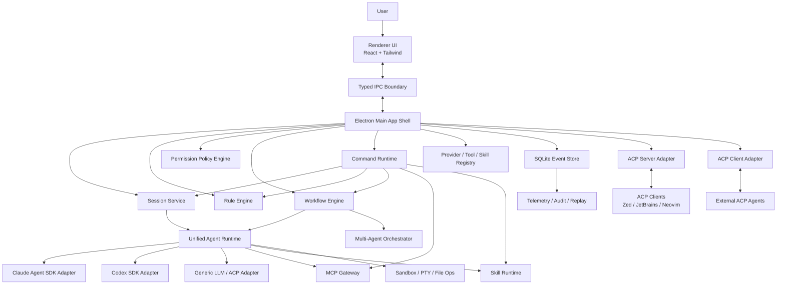
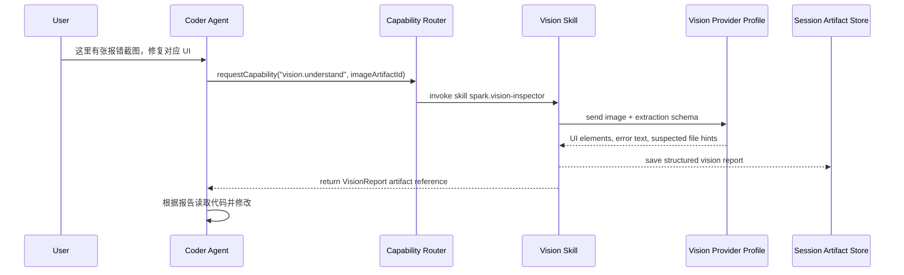
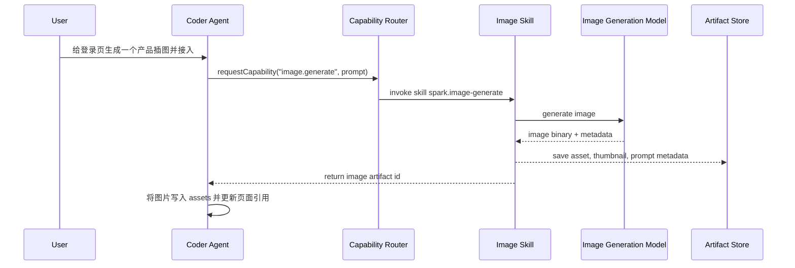

# Spark Agent Desktop Development Guide

> 状态: 实施中 | 最后核对: 2026-06-25

版本: 0.2  
日期: 2026-05-27  
目标: 设计并逐步实现一个综合性的桌面端 agent 程序，融合 Claude Agent SDK 与 Codex SDK 的能力，支持 ACP、MCP、Skills、多层规则、工作流、可视化多 agent、团队协作与高性能本地执行。

---

## 1. 产品定位

Spark Agent 是一个本地优先的桌面端 AI Agent 工作台。它不是单一聊天窗口，而是一个可配置、可扩展、可审计的 agent 操作系统:

- 面向个人开发者: 像 Claude Desktop/Codex Desktop 一样完成代码、文档、研究、自动化任务。
- 面向团队: 提供共享规则、共享技能、协作任务、权限审批、运行记录和可复盘的执行链路。
- 面向高级用户: 支持 ACP 协议、MCP 服务、Skill 包、工作流编排、多 agent/subagent、沙箱、模型路由和自定义提供商。

核心原则:

- 本地优先: 项目文件、规则、会话、工作流、审计日志优先存在本地，可选择同步。
- 协议优先: 内部以 ACP 风格的 session/message/event/tool schema 为核心，外部通过 ACP/MCP 适配。
- SDK 双内核: Claude Agent SDK 和 Codex SDK 是默认强力执行内核，但业务层不直接绑定任一 SDK。
- 可观察、可回放、可治理: 每个 agent 动作都有事件、权限、上下文来源、成本和结果。
- 渐进扩展: 单机 MVP 先跑通，后续扩展团队、多机器、远程执行和插件生态。

---

## 2. 外部能力与约束

### 2.1 Claude Agent SDK

Claude Code SDK 已更名为 Claude Agent SDK。它提供 Python 和 TypeScript SDK，能复用 Claude Code 的工具、agent loop 和上下文管理能力。SDK 支持内置文件读取、命令执行、代码编辑、MCP 配置、权限控制、hooks、checkpoint、成本追踪和 OpenTelemetry。TypeScript SDK 包含平台相关 Claude Code binary，通常不需要单独安装 Claude Code CLI。

设计约束:

- Spark Agent 不应伪装为 Claude Desktop 或 Claude Code。
- 第三方产品默认应使用 Anthropic API key、Bedrock、Vertex、Azure 等官方支持鉴权方式，而不是向最终用户提供 claude.ai 登录或订阅额度代理。
- Claude Agent SDK 是强执行内核之一，但 Spark 的会话、权限、规则、事件与 UI 需要独立建模。

### 2.2 OpenAI Codex SDK

Codex SDK 的 TypeScript 包为 `@openai/codex-sdk`。它通过启动 `@openai/codex` CLI，并用 stdin/stdout JSONL 事件与 CLI 通信，提供 `Codex`、`Thread`、`run()`、`runStreamed()` 等接口。它适合接入代码任务、流式事件、工具调用、文件变更与 usage 信息。

设计约束:

- Codex SDK 的执行环境依赖本机 Codex CLI 能正常运行。
- 需要把 Codex 的 JSONL 事件转换成 Spark 内部统一事件。
- 需要提供 CLI 版本检查、路径选择、登录状态诊断和错误恢复。

### 2.3 ACP

本文中的 ACP 指 Agent Client Protocol。ACP 标准化编辑器客户端与 coding agent 之间的通信，常见实现基于 JSON-RPC 2.0 和双向 stdio，包含 session、prompt、streaming update、tool call、permission 等结构。

Spark 中 ACP 的定位:

- 内部核心协议: 用 ACP 风格 schema 表达 session、turn、message、tool call、permission request、file change、terminal output、agent status。
- 外部 ACP Server: 让 Zed、JetBrains、Neovim 等 ACP client 能连接 Spark Agent 的 agent。
- 外部 ACP Client: 让 Spark Desktop 能连接其他 ACP agent，例如 Claude Code ACP、Codex ACP、Gemini CLI ACP、OpenCode 等。

### 2.4 MCP

MCP 用于连接外部工具与数据源。Spark 需要支持 stdio、HTTP/SSE 或 Streamable HTTP 类型的 MCP 服务，支持系统级、用户级、项目级和会话级配置。

设计约束:

- MCP 工具必须经过权限策略与 allowlist/disallowlist。
- MCP server 的连接状态、工具 schema、错误必须可见。
- 大量 MCP 工具需要 tool search 或工具分组，避免上下文爆炸。

### 2.5 对 Claude Desktop 与 Codex Desktop 的能力吸收

Spark Agent 不复制任何单一产品，而是吸收两类桌面 agent 的优势，并在本地优先、团队治理和可视化编排上做差异化。

Claude Desktop 值得吸收的特长:

- 连接器与 MCP 体验: Claude Desktop 已把本地 desktop extensions 与远程 MCP connectors 作为重要能力。Spark 应提供同样低摩擦的连接体验，并增强本地权限、工具审计和项目级配置。
- Artifacts 思路: Claude 的 artifact 能把对话输出变成可持续迭代的产物。Spark 应把 artifact 扩展为代码 diff、报告、HTML 预览、工作流输出、运行诊断包等多类型资产。
- Projects/上下文体验: Claude 的项目化上下文降低重复说明成本。Spark 应进一步把项目规则、索引、文件选择、会话摘要和 token 预算做成可观察的 Context Ledger。
- 普通用户可理解的工具入口: Claude 的设置、连接器、artifact 浏览更偏产品化。Spark 的高级能力也要有 UI 入口，而不是只依赖配置文件。

Codex Desktop / Codex CLI 值得吸收的特长:

- 代码任务中心化: Codex 的核心优势是围绕本地代码仓库执行、解释、修改、测试、展示 diff。Spark 的 Project Session 应把代码变更、命令输出、测试结果和审批放在主时间线。
- 事件流与运行透明度: Codex SDK/CLI 的流式事件适合做 timeline、trace、usage、tool call 和 resume。Spark 应用统一 AgentEvent 抹平 Claude/Codex 差异。
- `/` 命令系统: Codex 的 slash commands 适合高频切换模型、审批模式、历史、压缩上下文、撤销等操作。Spark 应在输入框中实现更强的命令面板、命令补全、作用域提示和安全预览。
- 本地运行的清晰心智: Codex 强调本地 coding agent。Spark 也应把“当前 agent 正在哪个 workspace、用什么权限、占用多少资源、准备修改哪些文件”持续展示出来。

Spark 的创新方向:

- Context Governor: 把上下文选择、压缩、摘要、预算、来源、污染风险和丢弃策略显式化。
- Resource Governor: 把 CPU、内存、子进程、并发 agent、MCP server、token 成本变成可控预算。
- Visual Agent Graph: 把多 agent/subagent/工具/人类审批变成可暂停、可重跑、可追踪的图。
- Workflow Studio: 把一次性对话提升为可复用、可版本化、可分享的流程编排。
- Command Runtime: 把输入框变成 agent 操作系统的统一入口，而不是只用于发送自然语言。

---

## 3. 推荐技术栈

### 3.1 桌面框架

推荐: Electron + TypeScript + React

原因:

- Claude Agent SDK 和 Codex SDK 都有 TypeScript 路径，Electron 主进程可直接集成 Node 包、CLI 子进程、文件系统、PTY、MCP stdio。
- 相比 Tauri，Electron 更适合快速构建 AI desktop 的 agent runtime、进程管理、插件系统和本地任务编排。
- 性能可通过进程隔离、worker、虚拟列表、事件分页、SQLite WAL 和懒加载解决。

后续可扩展:

- 对高风险执行可引入 Rust sidecar 或微虚拟机沙箱。
- 对重型索引可引入 Rust/Go sidecar。

### 3.2 前端

- React 19 或当前稳定版 React
- TypeScript
- Vite
- Tailwind CSS
- Radix UI / Ariakit 作为无障碍交互基础
- TanStack Query 处理异步状态
- Zustand 或 Jotai 处理局部 UI 状态
- React Flow 或 XYFlow 处理可视化 workflow/multi-agent 图
- Monaco Editor 处理规则、prompt、diff、配置编辑
- xterm.js 处理终端输出
- shiki 或 CodeMirror/Monaco 处理代码块渲染

为什么选 Tailwind CSS:

- 对 AI 辅助开发友好，局部样式可读、迭代快。
- 适合构建复杂工具型界面，配合 design tokens 和组件封装能保持一致。
- Less 更适合传统样式组织，但对快速生成和重构不如 Tailwind 直接。

### 3.3 后端与本地运行时

- Electron main process: 桌面能力、IPC、窗口、权限、进程编排。
- Node worker threads: 规则合成、日志压缩、索引、事件转换。
- Child process / PTY: Claude/Codex CLI、MCP stdio server、用户命令。
- SQLite + WAL: 本地元数据、事件日志、会话、配置、规则、审计。
- LanceDB 或 SQLite FTS5: 初期用于本地检索；后续可接入向量库。
- 本地日志级别：设置页已支持调整 Spark 共享 logger 的 `debug` / `info` / `warn` / `error` 级别。
- OpenTelemetry: trace、span、usage、tool call、错误链路（待开发；设置页暂不展示未接入的 endpoint、采样率、trace 查看入口）。

### 3.4 包管理与工程

- pnpm workspace
- Turborepo 可选；MVP 阶段不强制
- Vitest 单元测试
- Playwright 端到端测试
- ESLint + Prettier
- electron-builder 或 Electron Forge 打包

---

## 4. 总体架构



核心分层:

- UI 层: 显示会话、任务、工作流、权限弹窗、文件 diff、终端、设置。
- App Shell 层: 管理窗口、IPC、安全边界、系统托盘、全局快捷键。
- Agent Runtime 层: 将不同 SDK/agent 统一成 Spark 内部事件模型。
- Protocol Gateway 层: ACP、MCP、Skill、工具调用的适配与治理。
- Command Runtime 层: 输入框 `/` 命令、命令补全、命令预览、命令审计。
- Workflow 层: 多 agent 图、任务队列、依赖、重试、人工审批。
- Persistence 层: 事件溯源、配置、规则、密钥引用、运行状态、审计。

---

## 5. 核心功能设计

### 5.0 核心特色能力

Spark Agent 的产品特色不应只停留在“接入更多模型和工具”。它需要形成几项用户能明显感知、开发上也能落地的核心能力。

#### 5.0.1 Context Governor 上下文智能控制

目标: 让用户知道 agent 正在使用哪些上下文、为什么使用、占用多少预算、哪些内容被压缩或丢弃，并能随时接管。

能力:

- Context Ledger: 每次 run 记录上下文来源，包括用户消息、规则、项目文件、MCP resources、Skill 文档、会话摘要、手动 pin 的内容。
- Token Budget Planner: 运行前估算上下文预算，按 system/rules/files/history/tools/output reserve 分配。
- Smart Context Packs: 根据任务自动构建上下文包，例如 `architecture-pack`、`bugfix-pack`、`release-pack`、`review-pack`。
- Context Pinning: 用户可 pin 文件、目录、代码片段、规则、MCP resource，保证不被自动压缩。
- Context Exclusion: 用户可排除大文件、敏感目录、生成产物、锁文件、日志。
- Summarization Ladder: 会话过长时分层摘要，包括 turn summary、topic summary、decision summary、artifact summary。
- Context Diff: 当上下文自动变化时，UI 显示“新增/移除/压缩了什么”。
- Pollution Detector: 检测过期规则、冲突需求、无关搜索结果、重复文件、异常大上下文。
- Manual Override: 用户可在发送前切换自动/手动/最小上下文模式。

上下文模式:

```ts
type ContextMode =
  | "minimal"       // 只使用当前消息和显式附件
  | "project-smart" // 默认模式，使用项目索引和规则
  | "deep-research" // 扩大检索范围，适合调研和架构
  | "surgical"      // 精准修改，严格限制文件范围
  | "review"        // 读取 diff、测试、相关规则
  | "manual";       // 用户手动选择上下文
```

UI 表现:

- 输入框左侧显示当前上下文模式。
- 右侧 Inspector 显示上下文预算环形图。
- Timeline 中每个 agent run 可展开 Context Ledger。
- 当 agent 请求读取新文件时，显示原因、路径、大小和风险。

#### 5.0.2 Resource Governor 系统资源占用控制

目标: 桌面 agent 不能把用户电脑拖慢。Spark 需要像任务管理器一样管理 agent、MCP、索引、终端命令和模型调用。

能力:

- Run Budget: 每次运行可设置 token、成本、时间、文件写入数、命令数、网络调用数。
- Process Budget: 限制并发子进程、PTY、MCP server、worker thread。
- CPU/Memory Watchdog: 监控 Electron、adapter、MCP server、indexer、shell command 的 CPU 与内存。
- Adaptive Throttling: 用户正在高负载工作时降低索引频率、暂停后台摘要、限制并发 subagent。
- Background Queue: 长任务进入后台队列，支持暂停、恢复、取消、优先级。
- Thermal Mode: 笔记本电池供电或高温时自动切换省电策略。
- Workspace Quotas: 每个项目可配置最大索引大小、最大 artifact 存储、最大日志保留天数。
- Kill Switch: 一键停止当前 workspace 的所有 agent、命令和 MCP server。

资源档位:

```ts
type ResourceProfile = {
  id: "eco" | "balanced" | "turbo" | "custom";
  maxConcurrentRuns: number;
  maxSubagentsPerRun: number;
  maxMcpServers: number;
  maxShellProcesses: number;
  maxMemoryMb: number;
  maxRunMinutes: number;
  backgroundIndexing: "off" | "low" | "normal";
};
```

默认策略:

- `eco`: 适合电池模式，只允许 1 个 run、暂停后台索引。
- `balanced`: 默认模式，允许 2-3 个 run，后台任务低优先级。
- `turbo`: 插电和高性能机器使用，允许更多 subagent 并行。

#### 5.0.3 Workflow Studio 流程编排能力

目标: 把优秀的一次性 agent 工作沉淀成可复用流程。

能力:

- 可视化 DAG 编排，支持 agent、tool、script、approval、branch、parallel、merge、artifact 节点。
- 节点级模型、上下文、规则、权限、资源预算。
- 输入输出 schema，节点之间通过 typed artifact 传递。
- 从任意节点重跑，不必重跑整个流程。
- Human-in-the-loop 审批节点。
- Workflow Templates: 功能开发、代码审查、Issue triage、发布检查、研究报告、文档生成。
- Run Replay: 复盘每个节点使用的上下文、工具、输出和耗时。
- Workflow Versioning: 流程版本化，团队可共享稳定版本。

Spark 创新点:

- Conversation-to-Workflow: 用户可把一次成功的会话“提炼”为工作流模板。
- Workflow Guardrails: 每个流程携带安全边界，例如禁止生产环境命令、限制外部网络、强制 review 节点。
- Workflow Scorecard: 每次运行输出成功率、重试次数、人工介入次数、成本和耗时。

#### 5.0.4 Visual Agent Graph agent 可视化

目标: 让用户看见多 agent 正在如何协作，而不是只看到混杂的聊天记录。

能力:

- Agent Graph: 展示 primary agent、subagent、tool、MCP server、human approval 的实时拓扑。
- Status Overlay: 每个节点展示 idle/running/waiting/failed/completed、当前模型、权限、资源占用。
- Message Edges: 展示 agent 之间传递了什么 artifact 或上下文包。
- Drilldown: 点击节点查看 prompt、规则、上下文、工具调用、产物、错误。
- Control Surface: 用户可以暂停单个 agent、取消分支、重跑节点、接管输出。
- Diff-aware Visualization: 文件修改按 agent 归属着色，便于追责和回滚。
- Team Presence: 团队成员可在图上认领审批或评论某个节点。

#### 5.0.5 Command Runtime 输入即操作系统

目标: 输入框既能接受自然语言，也能执行结构化命令。它是 Spark 的统一操作入口。

能力:

- `/` 命令补全。
- **三层命令架构**: SDK 原生命令 → 程序内置命令 → Agent 技能命令。
- 命令分组（12 组）、搜索、别名、最近使用。
- 参数表单化输入。
- 命令执行前预览影响范围。
- 命令可由 SDK、系统、Skill、MCP、Workflow、Team policy 注册。
- 命令可被权限引擎拦截。
- 命令执行结果进入 timeline，成为可审计事件。
- 支持 Claude Agent SDK 21 命令 + Codex CLI ~40 命令的原生映射。

#### 5.0.6 Run Capsule 可复盘运行胶囊

目标: 每次重要运行都可复盘、复用、分享。

Run Capsule 包含:

- 输入需求。
- 有效规则包。
- 上下文清单。
- 模型路由。
- 工具/MCP 清单。
- 权限决策。
- 文件 diff。
- 测试输出。
- 成本与耗时。
- 最终 artifact。

用途:

- 复盘失败原因。
- 团队异步 review。
- 生成 PR 描述。
- 创建 workflow 模板。
- 作为合规审计证据。

### 5.1 工作台首页

首页不是营销页，而是实际工作入口。

功能:

- 最近会话、最近项目、正在运行任务、失败任务。
- 快速开始:
  - 新建聊天
  - 打开项目
  - 运行工作流
  - 连接 MCP
  - 创建 Skill
  - 启动团队任务
- Agent 状态栏:
  - Claude/Codex 可用性
  - API key/login 状态
  - MCP server 状态
  - 当前沙箱模式
  - 今日 token/成本

### 5.2 会话系统

会话分组原则:

- Project 是会话的一级分组。用户进入应用后，所有 Chat、Project、Workflow、Multi-Agent、Team run 都优先挂在某个 Project 下。
- Project 以一个本地文件夹地址为基础，`rootPath` 是项目身份的核心字段。
- 同一个文件夹地址默认对应一个 Project；如果路径移动，需要通过“重新定位项目”维护历史会话。
- 支持创建空白文件夹作为新项目。用户选择父目录和项目名后，Spark 创建文件夹，并初始化 `.spark/` 与 `.agent_spark/`。
- 支持打开已有文件夹作为项目。若不存在 `.spark/`，Spark 提示是否初始化项目配置；若用户拒绝，仍可作为临时项目打开，但项目级规则和工作流不可持久化。
- 会话列表按 Project 分组展示。全局 Chat 可以存在，但默认落在 `Personal / Scratch` 这类系统项目下，避免会话游离在项目之外。
- 跨项目会话作为高级模式处理，必须显式选择多个 Project，并在 UI 中展示每个文件访问属于哪个 Project。

会话类型:

- Chat Session: 归属于一个 Project 的通用聊天、研究、写作、问答。
- Project Session: 绑定一个 Project，支持文件读写、终端、diff。
- Workflow Session: 归属于一个 Project，由工作流图驱动，可能包含多个 agent run。
- Team Session: 归属于一个 Team Project，多人协作、共享任务、评论、审批。
- ACP Session: 来自外部 ACP client 的会话。

会话能力:

- 流式输出。
- 工具调用时间线。
- 文件修改 diff。
- 终端输出折叠。
- 权限请求与审批。
- 失败重试。
- 分支/回滚/checkpoint。
- 导出为 Markdown、JSONL、HTML。
- 会话内规则覆盖。

### 5.2.1 输入框 `/` 命令系统

Spark 的输入框分为三种输入:

- Natural Prompt: 普通自然语言消息。
- Slash Command: 以 `/` 开头的结构化命令。
- Mention / Attach: 以 `@` 引用文件、agent、workflow、MCP tool、artifact、team member。

设计目标:

- 保留 Codex 风格的高效命令入口。
- 让非技术用户也能通过补全、说明、参数表单使用命令。
- 把所有命令纳入权限、审计、规则和工作流系统。

#### 三层命令架构

命令系统按来源分为三层，命令面板按层分组展示:

```
┌─────────────────────────────────────────────────────┐
│ Layer 1: SDK 原生命令                                │
│   Claude Agent SDK 内置命令 + Codex SDK 内置命令      │
│   来源: SDK binary 自带，Spark 做映射和适配            │
├─────────────────────────────────────────────────────┤
│ Layer 2: 程序内置命令                                │
│   Spark 程序自身提供的命令（会话管理、git 操作、        │
│   资源管理、权限控制、工作流等）                        │
│   来源: Spark CommandRegistry 硬编码注册               │
├─────────────────────────────────────────────────────┤
│ Layer 3: Agent 技能命令                              │
│   当前 Agent（默认 Code Agent）安装的 Skill 注册的命令  │
│   来源: Skill manifest / Agent 配置 / MCP prompt      │
└─────────────────────────────────────────────────────┘
```

**当前所有会话使用内置 Code Agent**，未来多 Agent 时用户可在会话中选择不同 Agent 配置，不同 Agent 的 Layer 3 命令不同。Agent 切换功能后续开发。

##### Layer 1: SDK 原生命令

**Claude Agent SDK 内置命令**（21 个，来源: Claude Code CLI `slash_command.rs`）:

Spark 对 Claude SDK 命令做两层处理:
- **直接映射**: 功能与 Spark 重合的命令直接映射到 Spark 实现（如 `/model` → Spark 的 `/model`）
- **兼容保留**: Claude 特有命令保持原名，确保 Claude 用户习惯不丢失

| Claude 命令 | 映射策略 | Spark 对应 | 说明 |
|-------------|---------|-----------|------|
| `/help` | 直接映射 | `/help` | 命令帮助 |
| `/status` | 直接映射 | `/status` | 会话状态 |
| `/model` | 直接映射 | `/model` | 切换模型 |
| `/compact` | 直接映射 | `/compact` | 压缩上下文 |
| `/clear` | 直接映射 | `/clear` | 清空会话 |
| `/config` | 兼容保留 | `/config` | SDK 配置查看 |
| `/cost` | 映射到 | `/usage` | 成本统计 |
| `/mcp` | 兼容保留 | `/mcp` | MCP 管理 |
| `/permissions` | 映射到 | `/approval` | 权限管理 |
| `/init` | 兼容保留 | `/init` | 初始化项目 |
| `/add-dir` | 兼容保留 | `/add-dir` | 添加工作目录 |
| `/memory` | 兼容保留 | `/memory` | 管理记忆文件 |
| `/doctor` | 兼容保留 | `/doctor` | 环境诊断 |
| `/login` | 兼容保留 | `/login` | 登录 |
| `/logout` | 兼容保留 | `/logout` | 登出 |
| `/terminal-setup` | 兼容保留 | `/terminal-setup` | 终端配置 |
| `/vim` | 兼容保留 | `/vim` | Vim 模式 |
| `/bug` | 兼容保留 | `/bug` | 报告 Bug |
| `/review` | 兼容保留 | `/review` | 代码审查 |
| `/pr_comments` | 兼容保留 | `/pr-comments` | PR 评论审查 |
| `/agents` | 映射到 | `/agent list` | 查看 Agent |

此外，Claude SDK 支持:
- **项目命令**: `.claude/commands/` 目录下的 `.md` 文件自动注册为 `/project:xxx` 命令
- **个人命令**: `~/.claude/commands/` 目录下的 `.md` 文件注册为 `/user:xxx` 命令
- **MCP prompt 命令**: MCP server 提供的 prompt 注册为 `/mcp__<server>__<prompt>` 命令

Spark 应适配这些动态命令注册机制。

**Codex CLI 内置命令**（~40 个，来源: Codex CLI `slash_command.rs`）:

Codex CLI 的 TUI 模式提供了丰富的 slash commands。Spark 做映射适配:

| Codex 命令 | 映射策略 | Spark 对应 | 说明 |
|------------|---------|-----------|------|
| `/new` | 映射到 | `/new-session` | 新建会话 |
| `/resume` | 兼容保留 | `/resume` | 恢复会话 |
| `/fork` | 兼容保留 | `/fork` | 分叉会话 |
| `/clear` | 直接映射 | `/clear` | 清空 |
| `/rename` | 直接映射 | `/rename` | 重命名 |
| `/quit` | 兼容保留 | — | 退出程序（桌面端不适用） |
| `/init` | 直接映射 | `/init` | 初始化 AGENTS.md |
| `/model` | 直接映射 | `/model` | 切换模型 |
| `/permissions` | 映射到 | `/approval` | 权限管理 |
| `/compact` | 直接映射 | `/compact` | 压缩上下文 |
| `/status` | 直接映射 | `/status` | 状态查看 |
| `/diff` | 兼容保留 | `/diff` | 查看 git diff |
| `/copy` | 兼容保留 | `/copy` | 复制上次输出 |
| `/plan` | 兼容保留 | `/plan` | Plan 模式 |
| `/goal` | 兼容保留 | `/goal` | 长任务目标管理 |
| `/side` | 兼容保留 | `/side` | 旁路对话 |
| `/mcp` | 直接映射 | `/mcp` | MCP 管理 |
| `/memories` | 映射到 | `/memory` | 记忆管理 |
| `/skills` | 映射到 | `/skill list` | 技能管理 |
| `/agent` | 映射到 | `/agent` | Agent 管理 |
| `/review` | 直接映射 | `/review` | 代码审查 |
| `/vim` | 兼容保留 | `/vim` | Vim 模式 |
| `/theme` | 映射到 | `/settings theme` | 主题切换 |
| `/experimental` | 兼容保留 | `/experimental` | 实验特性 |
| `/raw` | 兼容保留 | `/raw` | 原始输出模式 |
| `/mention` | 映射到 | `@` 触发器 | 文件提及（已在 Composer 支持） |
| `/ide` | 兼容保留 | `/ide` | IDE 上下文 |
| `/apps` | 兼容保留 | `/apps` | 应用管理 |
| `/plugins` | 兼容保留 | `/plugins` | 插件管理 |
| `/ps` | 映射到 | `/queue` | 后台进程 |
| `/stop` | 映射到 | `/kill-run` | 停止运行 |
| `/sandbox-*` | 映射到 | `/sandbox` | 沙箱配置 |
| `/approve` | 映射到 | `/approval` | 审批操作 |
| `/keymap` | 映射到 | `/shortcuts` | 快捷键配置 |
| `/personality` | 兼容保留 | `/personality` | 沟通风格 |
| `/hooks` | 兼容保留 | `/hooks` | 生命周期钩子 |
| `/title` | 兼容保留 | `/title` | 终端标题配置 |
| `/statusline` | 兼容保留 | `/statusline` | 状态栏配置 |
| `/debug-config` | 兼容保留 | `/debug-config` | 调试配置 |

**Codex TUI 交互适配说明**:
- Codex 的 `@` 文件搜索 → Spark Composer 的 `@` mention 已实现
- Codex 的 `Esc-Esc` 消息编辑 → Spark 使用直接点击编辑
- Codex 的键盘快捷键 → Spark 的全局快捷键系统已实现

##### Layer 2: 程序内置命令

Spark 程序自身注册的命令，按功能分组:

Session:

- `/help`: 打开命令帮助。
- `/status`: 显示当前 session、provider、模型、权限、资源、MCP 状态。
- `/history`: 打开会话历史。
- `/sessions`: 切换或搜索会话。
- `/rename <title>`: 重命名会话。
- `/export markdown|jsonl|html`: 导出会话。
- `/undo`: 撤销上一组未提交文件变更。
- `/checkpoint create|restore|list`: 管理 checkpoint。
- `/new-session`: 创建新会话。
- `/fork`: 分叉当前会话。
- `/resume <id>`: 恢复已保存会话。

Model:

- `/model [role] [profile]`: 切换当前或某个角色的模型。
- `/provider [provider-id]`: 切换 provider。
- `/reason none|minimal|low|medium|high`: 调整 reasoning effort。
- `/fallback on|off`: 开关 fallback 模型。
- `/budget tokens|cost|time <value>`: 设置本次运行预算。

Context:

- `/context`: 打开 Context Ledger。
- `/context mode minimal|project-smart|deep-research|surgical|review|manual`: 切换上下文模式。
- `/pin @file|@folder|@artifact`: 固定上下文。
- `/exclude @file|@folder|pattern`: 排除上下文。
- `/compact`: 压缩当前会话上下文。
- `/summarize decisions|files|artifacts|all`: 生成摘要。
- `/clear-context`: 清空会话临时上下文。

Permission:

- `/approval ask|read-only|workspace-write|full-auto`: 切换审批模式。
- `/allow tool|path|command --session`: 临时允许某项能力。
- `/deny tool|path|command --session`: 临时禁止某项能力。
- `/sandbox level 0|1|2|3|4`: 切换沙箱等级。
- `/audit`: 打开权限和工具调用审计。

Workflow:

- `/workflow list`: 查看工作流。
- `/workflow run <id>`: 运行工作流。
- `/workflow pause|resume|cancel`: 控制当前工作流。
- `/workflow rerun <node-id>`: 从节点重跑。
- `/workflow create-from-session`: 从当前会话提炼工作流。
- `/workflow inspect`: 打开 workflow graph。

Agent:

- `/agent list`: 查看 agent。
- `/agent spawn <role>`: 创建 subagent。
- `/agent pause|resume|cancel <id>`: 控制 agent。
- `/agent graph`: 打开可视化 agent graph。
- `/handoff <agent-id>`: 将当前任务交给指定 agent。

MCP:

- `/mcp list`: 查看 MCP servers。
- `/mcp enable|disable <server>`: 启用或禁用 server。
- `/mcp tools <server>`: 查看工具。
- `/mcp call <tool>`: 手动调用工具。
- `/mcp diagnose <server>`: 诊断连接。

Skill:

- `/skill list`: 查看 skills。
- `/skill search <query>`: 搜索 skill。
- `/skill install <source>`: 安装 skill。
- `/skill enable|disable <id>`: 启用或禁用。
- `/skill run <id>`: 运行 skill。

Resource:

- `/resource eco|balanced|turbo`: 切换资源档位。
- `/resource status`: 查看资源占用。
- `/queue`: 查看后台任务队列。
- `/kill-run`: 停止当前 run。
- `/kill-workspace`: 停止当前 workspace 的所有 agent 和 MCP 子进程。

Team:

- `/team invite <email>`: 邀请成员。
- `/team request-approval @member <reason>`: 请求审批。
- `/assign @member`: 指派任务。
- `/comment <text>`: 给当前 run 留评论。
- `/policy inspect`: 查看团队策略。

Git:

- `/diff`: 查看当前 git diff（含未跟踪文件）。
- `/git status`: 查看 git 状态。
- `/git log [n]`: 查看最近 n 条提交记录。
- `/git stash`: 暂存当前变更。

Utility:

- `/copy`: 复制上次 agent 输出为 Markdown。
- `/doctor`: 运行环境诊断。
- `/init`: 初始化项目配置文件（AGENTS.md / .claude/）。
- `/add-dir <path>`: 添加工作目录。
- `/memory`: 管理记忆文件。
- `/plan [task]`: 进入 Plan 模式。
- `/review [instructions]`: 代码审查。
- `/usage`: 查看当前会话 token/cost 统计。

##### Layer 3: Agent 技能命令

当前默认 Agent 为 Code Agent，其技能命令来源于:
- Agent 配置中启用的 Skill manifest 注册的命令
- MCP server 提供的 prompt 命令（`/mcp__<server>__<prompt>`）
- 项目/个人自定义命令（`.spark/commands/` 或 `~/.spark/commands/`）

Layer 3 命令随 Agent 切换而变化（Agent 切换功能后续开发）。

#### 命令交互

输入 `/` 后弹出命令面板:

- 支持模糊搜索，例如输入 `/mod` 匹配 `/model`。
- 命令按三层+分组展示: SDK 原生命令 → 程序内置命令（按 Session/Model/Context/Permission/Workflow/Agent/MCP/Skill/Resource/Team/Git/Utility 分组） → Agent 技能命令。
- 每个命令显示描述、来源层（SDK/程序/技能）、作用域、风险等级、快捷参数。
- 命令有参数时，支持 inline 参数和表单参数两种方式。
- 命令执行前如涉及高风险操作，展示预览和审批。
- 命令执行结果进入当前 timeline。

命令语法:

```text
/command [subcommand] [--flag value] [@target] [free text]
```

示例:

```text
/model coder codex-high
/approval workspace-write
/context mode surgical @src/runtime
/compact --keep decisions,artifacts
/workflow run feature-development --from plan
/agent spawn reviewer --model claude-fast
/mcp enable github --session
/skill install ./skills/code-review
/resource eco
/team request-approval @alex "允许执行数据库迁移检查"
/diff
/doctor
```

#### 命令注册接口

命令由 Command Registry 管理，系统、Skill、MCP、Workflow 都可以注册命令。

```ts
type CommandLayer = "sdk" | "builtin" | "skill";

type SlashCommand = {
  id: string;
  name: string;
  aliases: string[];
  layer: CommandLayer;
  group:
    | "session"
    | "model"
    | "context"
    | "permission"
    | "workflow"
    | "agent"
    | "mcp"
    | "skill"
    | "resource"
    | "team"
    | "git"
    | "utility"
    | "system";
  description: string;
  scope: "global" | "workspace" | "session" | "workflow" | "team";
  risk: "none" | "low" | "medium" | "high";
  argsSchema: JsonSchema;
  preview?: (args: unknown, env: CommandEnv) => Promise<CommandPreview>;
  execute: (args: unknown, env: CommandEnv) => AsyncIterable<AgentEvent>;
};
```

命令解析器升级（支持子命令和别名）:

```ts
interface ParsedCommand {
  name: string;         // 主命令名
  subcommand?: string;  // 子命令（如 workflow 的 run/pause/resume）
  args: string[];       // 位置参数
  flags: Record<string, string>;  // --flag value
  targets: string[];    // @mention 目标
  freeText?: string;    // 命令后的自由文本
  rawText: string;      // 原始输入
}
```

命令执行流程:

1. 输入解析: 将用户输入解析为 command、subcommand、flags、targets、free text。
2. 命令查找: 依次在 Layer 1（SDK）→ Layer 2（程序）→ Layer 3（技能）中查找，优先返回 Layer 1 匹配。
3. 补全: 根据当前 session/workspace/team 状态返回候选命令和参数。
4. 参数校验: 使用 zod/JSON Schema 校验。
5. 预览: 展示将修改的配置、目标文件、权限变化、可能启动的进程。
6. 权限检查: 交给 Permission Engine 判断是否需要审批。
7. 执行: Command Runtime 调用对应 handler。
8. 事件落库: 生成 `CommandInvokedEvent`、`CommandPreviewEvent`、`CommandResultEvent`。
9. UI 更新: Timeline、Inspector、Toast、Settings 同步变化。

#### 命令与自然语言混合

Spark 支持命令后追加自然语言，用于给 agent 提供上下文:

```text
/agent spawn reviewer 请只检查权限系统和 MCP 工具暴露风险
/workflow run feature-development 实现 Phase 0 项目骨架，先写最小测试
/context mode surgical 只允许查看 adapter 相关文件
/review 重点检查 SQL 注入和 XSS 漏洞
```

解析策略:

- flags 和 mention 优先解析。
- 剩余文本作为 `freeText` 传给 command handler。
- handler 决定 freeText 是作为 agent prompt、workflow input 还是备注。

#### 命令安全策略

- 高风险命令必须有 preview，例如 `/kill-workspace`、`/approval full-auto`、`/allow command --project`。
- Team policy 可以隐藏或禁用某些命令。
- Skill 注册的命令默认 `risk=medium`，除非 manifest 明确声明低风险且通过 vetting。
- MCP 注册的命令不能绕过 MCP Gateway。
- 所有命令都进入 audit log。
- SDK 原生命令的权限遵循对应 SDK 的约束，Spark 在上层增加额外审计。

#### 当前实现状态与升级路线

**当前已实现**（6 个命令）:
- `/help`, `/status`, `/model`, `/compact`, `/clear`, `/approval`
- 命令面板模糊搜索 + 键盘导航 + IPC 执行

**升级为三层架构的步骤**:
1. 升级 `CommandDefinition` 类型 → 扩展为 `SlashCommand` 类型（增加 layer、aliases、subcommand、scope、risk 枚举）
2. 升级命令解析器 → 支持子命令解析、别名匹配、`@target` 提取、freeText 拆分
3. 注册 SDK 命令层 → Claude SDK 21 命令 + Codex SDK 命令映射
4. 扩展程序内置命令 → 按 PRD 完整实现 Session/Model/Context/Permission/Workflow/Agent/MCP/Skill/Resource/Team/Git/Utility 分组
5. 实现 Skill 命令注册 → Agent Skill manifest 可注册命令
6. 升级命令面板 UI → 三层分组展示 + 来源标记
7. 升级命令执行结果 → 从 toast-only 改为 timeline 事件

### 5.3 模型与 Provider 配置

配置目标:

- 用户可配置多个 provider profile。
- provider profile 只分两种协议格式: `anthropic` 和 `openai`。
- 每个 provider profile 自带 `baseUrl`、`apiKey`、`defaultModel` 和 `modelIds[]`，不再依赖独立 model profile 才能运行。
- DeepSeek、OpenRouter、Ollama、LM Studio、自建网关等都作为“供应商名称 + endpoint”的具体实例接入，而不是单独的 adapter 类型。
- agent/workflow/session 绑定 provider profile；需要切模型时，在同一个 provider profile 的 `modelIds[]` 中选择，或切换到另一个 provider profile。
- 设置页提供一组内置供应商 preset，preset 只负责预填官方公开可验证的 `baseUrl` 与一组推荐 `modelIds[]`，保存后落库的仍然是普通 provider profile。
- 内置 preset 首批覆盖腾讯云 Coding Plan、阿里云百炼 Coding Plan、智谱 GLM Coding Plan、DeepSeek API、MiniMax、Kimi、硅基流动、OpenRouter，同时保留完全自定义入口。

设计约束:

- 适配器层只保留 `AnthropicAdapter` 和 `OpenAIAdapter`。
- 供应商差异通过 endpoint、header、鉴权和模型 ID 体现，不再为每个供应商创建单独 adapter。
- 历史 `model_profiles` 结构保留为迁移兼容层，不再作为主配置入口。

Provider Profile 字段:

```ts
type ProviderProfile = {
  id: string;
  displayName: string;
  provider: "anthropic" | "openai";
  baseUrl?: string;
  secretRef: string;
  defaultModel: string;
  modelIds: string[];
  enabled: boolean;
  isDefault: boolean;
  metadata?: {
    vendorName?: string;
    notes?: string;
    defaultHeaders?: Record<string, string>;
  };
};
```

说明:

- `provider` 表示请求协议格式，而不是商业供应商枚举。
- 供应商品牌信息放在 `displayName` 或 `metadata.vendorName`。
- `defaultModel` 是默认运行模型，必须同时出现在 `modelIds[]` 中。
- `modelIds[]` 支持用户手动维护更多模型 ID，供会话或工作流覆盖使用。
- preset 只是创建时的模板来源，不参与运行时路由判定，也不限制用户后续修改 endpoint、默认模型或模型列表。
- 内置本地 CLI provider 不需要 API Key: `local-cli` 表示宿主机 Claude CLI，默认模型展示为 `claude cli`; `local-codex-cli` 表示宿主机 Codex CLI，默认模型展示为 `codex cli`。两者只在对应 CLI 可用时自动补种并出现在会话模型选择中。

路由策略:

- Manual: 用户手动选择。
- Role-based: planner/reviewer/coder 使用不同 profile。
- Cost-aware: 超出成本阈值后切换低成本模型。
- Latency-aware: 交互式任务优先低延迟模型。
- Capability-aware: 需要代码编辑、沙箱、MCP、长上下文时选择匹配 provider。

### 5.3.1 Token、成本与用量统计

Spark 必须同时支持 agent 级、模型级、provider 级、session 级、workflow 级和团队级 token 统计。UI 中 Home 的“今日 TOKEN/成本”、Multi-Agent 卡片的 agent token、Chat 右侧 Inspector 的输入/输出 token、Workflow 节点卡片的 token 和 Settings Provider 的模型用量都来自同一套 Usage Ledger。

统计层级:

- Global Daily Usage: 今日总 token、成本、运行任务数、沙箱等级。
- Provider Usage: 按 provider 统计调用次数、成功率、延迟、输入/输出 token、成本。
- Model Usage: 按具体模型 ID 统计 token、成本、平均首 token 延迟、平均完成耗时，并关联其所属 provider profile。
- Agent Usage: 每个 agent/subagent 统计本次 run token、工具次数、耗时、成本、失败率。
- Session Usage: 会话内累计输入、输出、工具、缓存、图片、音频等用量。
- Workflow Usage: 按 workflow run、节点、边、重试次数汇总。
- Team Usage: 团队成员、项目、规则、工作流维度汇总，支持预算和配额。

统一用量结构:

```ts
type TokenUsage = {
  inputTokens: number;
  outputTokens: number;
  cachedInputTokens?: number;
  cacheWriteTokens?: number;
  reasoningTokens?: number;
  toolCallTokens?: number;
  toolResultTokens?: number;
  systemRuleTokens?: number;
  contextFileTokens?: number;
  historyTokens?: number;
  estimated: boolean;
};

type MediaUsage = {
  imageInputCount?: number;
  imageOutputCount?: number;
  imageInputPixels?: number;
  imageOutputPixels?: number;
  audioInputSeconds?: number;
  audioOutputSeconds?: number;
  videoInputSeconds?: number;
  fileInputBytes?: number;
};

type UsageLedgerEntry = {
  id: string;
  sessionId?: string;
  runId?: string;
  turnId?: string;
  workflowNodeId?: string;
  agentId?: string;
  providerId: string;
  modelId: string;
  operation: "chat" | "tool" | "embedding" | "image-generate" | "image-edit" | "vision" | "audio" | "rerank";
  tokenUsage: TokenUsage;
  mediaUsage?: MediaUsage;
  cost: {
    currency: "USD" | "CNY";
    estimatedAmount: number;
    finalAmount?: number;
  };
  latencyMs: {
    queue?: number;
    firstToken?: number;
    total: number;
  };
  source: "provider-reported" | "adapter-computed" | "local-estimate";
};
```

统计策略:

- Provider-reported 优先: 如果服务商返回 usage，原样保存到 `rawUsage`，再映射到统一字段。
- Adapter-computed 兜底: 对兼容接口缺失的字段用 tokenizer 或字符估算。
- Estimate 标记: 所有估算值必须标记 `estimated=true`，UI 用虚线或 `≈` 显示。
- 多模态计费拆分: 图片、音频、视频不强行换算成文本 token，保留 provider 原生单位和估算金额。
- 缓存 token 拆分: cache read/cache write 单独记账，否则成本会失真。
- 规则 token 拆分: system/team/user/project/session/skill 注入的 token 分开统计，便于优化规则栈。
- 工具 token 拆分: tool schema、tool call、tool result 分开统计，便于发现 MCP 工具上下文膨胀。

UI 表现:

- Home: 今日 token、成本、运行任务、待审批、沙箱等级。
- Multi-Agent: 每张 agent 卡展示本次 token、工具数、耗时、状态。
- Workflow: 每个节点展示 token、耗时、状态，连线可显示传递 artifact 大小。
- Chat Inspector: 输入 token、输出 token、工具调用、成本、耗时、上下文窗口进度条。
- Settings > Provider: provider 健康状态、profile 数、延迟、今日/本月成本。
- Settings > Provider: 查看默认模型、模型列表、单模型用量趋势和近 7 天成本。
- Team Dashboard: 按成员/项目/workflow/provider/model 做预算看板。

预算与限流:

- 每个 provider profile 可设置默认模型与可用模型列表，并在运行时叠加 session/workflow 级预算。
- 每个 agent 可设置单次任务和每日预算。
- 每个 workflow 可设置总预算和节点预算。
- 团队可设置成员、项目、provider、模型维度预算。
- 预算达到 80% 时 UI 提醒，达到 100% 时进入人工审批或自动 fallback。

### 5.3.2 多模态模型与能力路由

Spark 的 agent 不应被绑定为“只能文本”或“只能代码”。模型能力通过 Model Capability Registry 描述，再由 Router 按任务选择模型或工具。

能力类型:

- Text: 聊天、总结、结构化输出、长文档。
- Code: 代码生成、代码编辑、diff、测试、review。
- Vision Understanding: 图片理解、截图解释、UI 走查、图表读取。
- Image Generation: 文生图、图生图、海报/插图/图标生成。
- Image Editing: 局部修改、风格迁移、背景替换。
- Audio: 转写、语音生成、会议纪要。
- Embedding/Rerank: 本地索引、语义检索、上下文召回。
- Video: 视频理解或生成，后续扩展。

当前实现: 生图模型配置已支持 `modelType=image` + `imageProvider` + `imageApiType`，并在 Claude SDK turn 中通过内部 `spark_image` MCP server 暴露 `mcp__spark_image__generate_image`。配置与运行细节见 [Image Generation Providers](./image-generation-providers.md)。

多模态路由规则:

- 如果用户输入包含图片，优先选择 `visionUnderstanding=true` 的模型。
- 如果当前 agent 是 Coder，但任务需要看 UI 截图，Router 可以临时调用 vision skill，再把结构化结果返回给 Coder。
- 如果当前 agent 是 Coder，但任务需要生成图标或封面，Router 可以临时调用 image generation skill，产物作为 artifact 挂到会话。
- 如果当前默认模型不支持图片输入，系统先尝试同一 provider profile 的其他已配置模型；没有则切换到具备视觉能力的 provider profile；仍没有则请求用户补充配置。
- 多模态产物必须进入 Artifact Store，并带上来源模型、prompt、seed、尺寸、版权/安全标记和成本。

示例: 编码 agent 扩展图片理解能力



示例: 编码 agent 扩展生图能力



多模态权限:

- 图片理解默认 `read-media` 权限。
- 生图默认 `generate-media` 权限，若写入项目文件还需要 `filesystem:write`。
- 涉及人物、品牌、版权或敏感内容时进入人工审批。
- 团队模式下可限制某些 provider 或生图模型只能由指定角色使用。

### 5.4 ACP 核心协议层

Spark 内部定义 `Spark Agent Protocol`，保持与 ACP 概念兼容，但加入桌面产品需要的扩展字段。

核心对象:

```ts
type AgentSession = {
  id: string;
  kind: "chat" | "project" | "workflow" | "team" | "acp";
  projectId: string;
  workspaceIds: string[];
  createdBy: string;
  activeAgentIds: string[];
  ruleBundleId: string;
  permissionProfileId: string;
  status: "idle" | "running" | "waiting_approval" | "failed" | "completed" | "cancelled";
};

type AgentEvent =
  | UserMessageEvent
  | AssistantMessageEvent
  | ToolCallEvent
  | ToolResultEvent
  | PermissionRequestEvent
  | PermissionDecisionEvent
  | FileChangeEvent
  | TerminalOutputEvent
  | AgentStatusEvent
  | UsageEvent
  | ErrorEvent;
```

适配方向:

- Claude Adapter: Claude Agent SDK message -> AgentEvent。
- Codex Adapter: Codex JSONL event -> AgentEvent。
- MCP Gateway: MCP tool call/result -> AgentEvent。
- ACP Server: AgentEvent -> ACP JSON-RPC notification/response。
- UI: AgentEvent -> timeline/diff/terminal/approval components。

### 5.5 Claude Agent SDK 适配器

职责:

- 创建 Claude query。
- 注入规则合成后的 system prompt / append prompt。
- 注入 workspace、allowed tools、disallowed tools、MCP servers。
- 监听 message stream 并转换事件。
- 处理 tool permission、hooks、checkpoint、usage。
- 处理 SDK 错误并映射为用户可理解诊断。

接口:

```ts
interface AgentProviderAdapter {
  id: string;
  capabilities: AgentCapabilities;
  healthCheck(): Promise<ProviderHealth>;
  startSession(input: StartAgentSessionInput): Promise<ProviderSession>;
  sendTurn(input: SendTurnInput): AsyncIterable<AgentEvent>;
  cancel(sessionId: string): Promise<void>;
  resume(sessionId: string): Promise<ProviderSession>;
}
```

Claude Adapter 特殊能力:

- 内置工具权限映射: Read/Edit/Bash/Glob/Grep/MCP。
- `settingSources` 控制项目 `.mcp.json` 和 settings 读取。
- hooks 对接 Spark permission policy。
- checkpoint 对接 Spark session checkpoint UI。

### 5.6 Codex SDK 适配器

职责:

- 检查 `@openai/codex` CLI 可用性。
- 通过 `@openai/codex-sdk` 创建 Codex thread。
- 将 `runStreamed()` 的 structured events 转换为 AgentEvent。
- 处理 Codex item、turn.completed、usage、file change、permission。
- 提供 thread 继续对话、resume、取消。

Codex Adapter 特殊能力:

- 支持长任务队列。
- 支持以代码项目为中心的多 agent 执行。
- 支持将 Codex 的计划、diff、命令输出以 Codex Desktop 类似体验展示。

### 5.7 Skill 系统

Skill 是一个可安装、可版本化、可共享的能力包，包含说明、资源、脚本和可选 UI/schema。

目录结构:

```text
skills/
  <skill-id>/
    SKILL.md
    skill.json
    scripts/
    templates/
    assets/
    tests/
```

`skill.json`:

```json
{
  "id": "spark.code-review",
  "name": "Code Review",
  "version": "0.1.0",
  "description": "Review code changes with severity-ranked findings.",
  "triggers": ["code review", "review PR"],
  "permissions": {
    "filesystem": "read",
    "network": "optional",
    "shell": "deny"
  },
  "inputs": {
    "repositoryPath": "string",
    "diffRef": "string"
  }
}
```

增强版 `skill.json` 需要支持能力声明、模型依赖和产物类型:

```json
{
  "id": "spark.vision-inspector",
  "name": "Vision Inspector",
  "version": "0.1.0",
  "description": "Extract UI, text, layout, error and chart information from images.",
  "triggers": ["看图", "图片理解", "截图分析", "ui screenshot", "vision"],
  "capabilitiesProvided": ["vision.understand", "ui.inspect", "chart.extract"],
  "modelRequirements": [
    {
      "role": "vision",
      "requiredCapabilities": ["visionUnderstanding", "structuredOutput"],
      "acceptedInput": ["image", "text"],
      "expectedOutput": ["text"]
    }
  ],
  "permissions": {
    "filesystem": "read",
    "network": "optional",
    "media": "read",
    "shell": "deny"
  },
  "inputs": {
    "imageArtifactId": "string",
    "question": "string",
    "outputSchema": "object"
  },
  "outputs": {
    "visionReport": "artifact:json"
  }
}
```

```json
{
  "id": "spark.image-generate",
  "name": "Image Generator",
  "version": "0.1.0",
  "description": "Generate or edit image assets and return managed artifacts.",
  "triggers": ["生图", "生成图片", "生成图标", "image generation", "cover art"],
  "capabilitiesProvided": ["image.generate", "image.edit"],
  "modelRequirements": [
    {
      "role": "image-generation",
      "requiredCapabilities": ["imageGeneration"],
      "acceptedInput": ["text", "image"],
      "expectedOutput": ["image"]
    }
  ],
  "permissions": {
    "filesystem": "optional-write",
    "network": "required",
    "media": "generate",
    "shell": "deny"
  },
  "inputs": {
    "prompt": "string",
    "referenceArtifactIds": "string[]",
    "size": "string",
    "style": "string"
  },
  "outputs": {
    "imageAsset": "artifact:image",
    "thumbnail": "artifact:image",
    "metadata": "artifact:json"
  }
}
```

Skill 功能:

- 系统级 Skill: 随应用内置。
- 用户级 Skill: 用户安装，所有项目可用。
- 项目级 Skill: 项目仓库内提供。
- 团队级 Skill: 团队共享并受管理员治理。
- Skill Store: 本地索引、远程市场、私有 registry。
- Skill Vetting: 安装前检查脚本、网络、权限、依赖、来源。

#### 5.7.1 Skill 安装、可见性与分层加载

Skill 管理需要区分两个概念:

- **已安装**: Skill 已经存在于 Spark 本地库中，来源可以是内置、市场安装、本地 Claude/Codex/Agents skill 目录导入，或者后续团队 registry 同步。
- **运行时可见**: Agent 当前 turn 能看到的 Skill 列表。可见不代表强制使用；Agent 只在任务语义匹配时选择应用 Skill。

当前实现的层级:

1. **系统级**: `skills.enabled` 是全局可见性闸门。关闭后所有 Agent、项目、会话都不可见。`builtin:superpowers` 属于内置 Skill，也可以在系统级关闭。
2. **Agent 级**: 数据模型保留 `agent:<agentId>` 配置键；当前只有默认 Code Agent，暂不在 UI 中开放。多 Agent 功能上线后，每个 Agent 模板可配置自己的 Skill 选择与禁用覆盖。
3. **项目级**: Chat 右侧面板按 workspace 配置 Skill 可见性覆盖，作用于该项目下的会话。
4. **会话级**: Chat 右侧面板按 session 配置临时覆盖，可在单个会话中关闭系统级可见 Skill，例如关闭 `builtin:superpowers`。

合成规则:

```text
systemEnabled = all installed skills where enabled = true
selected = systemEnabled ∪ agentSelected ∪ projectSelected ∪ sessionSelected
disabled = agentDisabled ∪ projectDisabled ∪ sessionDisabled
effectiveSkills = selected ∩ systemEnabled - disabled
```

Agent runtime 会把 `effectiveSkills` 转换为 `[Available Skills]` 段落，包含 Skill 名称、描述、标签、所需工具和使用说明。该段落表示“可见技能库”，不是强制执行指令。

#### 5.7.2 本地 Skill 导入

Skill 管理页支持检测并导入本机已有 skill:

- `~/.claude/skills/*/SKILL.md`
- `~/.codex/skills/*/SKILL.md`
- `~/.agents/skills/*/SKILL.md`
- 手动选择的任意包含 `SKILL.md` 的目录

导入时 Spark 不复制用户文件，只记录本地目录路径和解析后的 manifest。这样 Claude/Codex 侧更新 skill 文件后，后续可以做增量刷新。

#### 5.7.2.1 Skill 管理页交互

`Skill 管理` 页的“已安装”Tab 采用双栏浏览模式：

- 左侧按 `Built-in Skills` / `Installed Skills` 分组展示卡片列表，卡片显示名称、来源、版本、启用状态，并支持直接切换系统可见性。
- 点击任意 Skill 卡片后，右侧详情面板展示该 Skill 的说明、标签、所需工具、参数定义、`SKILL.md` 来源路径和 prompt 预览。
- 在窄屏场景下，详情区域改为右侧抽屉，保持列表优先浏览体验。

这样可以在不离开 Skill 管理页的情况下，快速浏览本地 Skill 库并查看单个 Skill 的关键说明。

#### 5.7.3 系统提示词分层合成

系统提示词使用与 Skill 相同的分层制度:

1. **系统级提示词**: Settings → Skills 中配置，所有 Agent 默认继承。
2. **Agent 级提示词**: 预留给未来多 Agent 模板配置。
3. **项目级提示词**: Chat 右侧面板配置，按 workspace 生效。
4. **会话级提示词**: Chat 右侧面板配置，只影响当前 session。

合成顺序固定为:

```text
[System Prompt]
[Agent Prompt]
[Project Prompt]
[Session Prompt]
```

越靠后的层级越具体，但不会自动删除上层内容。安全规则仍应放在系统级或规则系统中，由 Rule Engine 负责冲突提示和审计。

运行方式:

- Prompt Skill: 只注入说明。
- Script Skill: 允许执行脚本。
- MCP Skill: 启动或配置 MCP server。
- Workflow Skill: 提供可视化节点模板。
- Capability Skill: 给 agent 增加某类能力，例如图片理解、生图、语音转写、网页浏览。
- Model-bound Skill: skill 明确要求某类模型能力或模型 ID，例如 vision/image-generation/embedding。

Skill 与 Agent 的能力组合:

```ts
type AgentTemplate = {
  id: string;
  name: string;
  role: "planner" | "coder" | "reviewer" | "tester" | "researcher" | "designer" | "custom";
  primaryProviderProfileId: string;
  fallbackProviderProfileIds: string[];
  modelOverride?: string;
  enabledSkillIds: string[];
  enabledToolIds: string[];
  ruleRefs: string[];
  permissionProfileId: string;
  resourceProfileId: string;
  budgets: {
    maxTokensPerRun?: number;
    maxCostPerRun?: number;
    maxMinutesPerRun?: number;
  };
};
```

示例: Coder Agent 主模型是 Codex，但通过 Skill 扩展图片能力:

```json
{
  "id": "agent.coder.default",
  "name": "Coder Agent",
  "role": "coder",
  "primaryProviderProfileId": "openai-coder-prod",
  "fallbackProviderProfileIds": ["openai-compatible-fast", "anthropic-reviewer"],
  "modelOverride": "gpt-5-codex",
  "enabledSkillIds": [
    "spark.code-review",
    "spark.test-runner",
    "spark.vision-inspector",
    "spark.image-generate"
  ],
  "enabledToolIds": ["Read", "Edit", "Bash", "Grep", "Git", "filesystem"],
  "permissionProfileId": "project-l2-write-approval",
  "resourceProfileId": "balanced",
  "budgets": {
    "maxTokensPerRun": 200000,
    "maxCostPerRun": 5,
    "maxMinutesPerRun": 20
  }
}
```

调用规则:

- Agent 的 primary model 负责主任务上下文和最终决策。
- 当 agent 调用自己不具备的能力时，向 Capability Router 发起 `requestCapability()`。
- Router 根据 skill 的 `capabilitiesProvided`、`modelRequirements`、权限策略和预算选择 skill 与模型。
- Skill 返回 artifact reference，而不是把大图片或长报告直接塞回 prompt。
- Agent 只读取必要摘要；需要更多细节时再按需展开 artifact。
- 所有跨模型调用都写入 Usage Ledger，并归属到原 agent 的 run 成本中。

### 5.8 MCP 管理

MCP 配置作用域:

- System: 应用内置，例如 filesystem、git、browser。
- User: 用户全局，例如 GitHub、Notion、Slack。
- Project: 项目 `.spark/mcp.json`。
- Conversation: 当前会话临时启用。
- Team: 团队管理员发布。

MCP 管理 UI:

- Server 列表与状态。
- 工具列表、schema、示例。
- 连接日志。
- secret 绑定。
- allowlist/disallowlist。
- 一键诊断。
- 按 agent/session/workflow 绑定。

连接生命周期:

1. 读取多层配置。
2. 合成有效 MCP 配置。
3. 启动或连接 server。
4. 拉取 tools/resources/prompts。
5. 根据权限策略裁剪工具。
6. 将工具暴露给 provider adapter。
7. 记录调用与结果。
8. 会话结束后释放会话级 server。

### 5.9 多层规则系统

规则层级:

1. System Rules: 应用内置，不可被普通用户删除。
2. Organization/Team Rules: 团队管理员配置。
3. User Rules: 用户全局偏好。
4. Project Rules: 项目 `.spark/rules/*.md`、`AGENTS.md`、`CLAUDE.md` 等。
5. Conversation Rules: 当前会话临时规则。
6. Workflow/Agent Rules: 某个 workflow 节点或 subagent 的专用规则。

优先级:

```text
System > Team > User > Project > Workflow > Agent > Conversation message
```

规则不是简单拼接。需要 Rule Engine 做结构化合成:

- identity: 角色、语气、目标。
- safety: 禁止行为、敏感路径、命令策略。
- workspace: 项目上下文、构建命令、测试命令。
- tools: 可用工具、禁用工具、审批策略。
- style: 代码风格、文档风格、语言偏好。
- workflow: 分工、交付格式、完成标准。

冲突策略:

- 更高层的 deny 覆盖低层 allow。
- 更高层的必需项不能被低层删除。
- 低层可以增加细节，但不能削弱安全规则。
- 规则合成输出要可预览，并显示来源。

规则文件建议:

```text
.spark/
  rules/
    project.md
    coding-style.md
    testing.md
  workflows/
  skills/
  mcp.json
  permissions.json
AGENTS.md
CLAUDE.md
```

### 5.10 权限与安全

权限对象:

- 文件读。
- 文件写。
- 命令执行。
- 网络访问。
- MCP 工具调用。
- Git 操作。
- 外部应用控制。
- secret 读取。
- 长任务后台执行。

审批模式:

- Ask every time。
- Allow for session。
- Allow for project。
- Deny。
- Dry-run only。
- Team approval required。

安全策略:

- 高风险命令默认审批，例如 `rm -rf`、`git push --force`、`curl | sh`、密钥导出。
- secret 只通过 secret reference 注入，不进入 prompt 明文。
- 项目外文件访问默认需要审批。
- MCP server 默认最小权限。
- Team 模式下管理员可强制策略。
- 所有工具调用写入审计日志。

沙箱分级:

- Level 0: Chat only，无工具。
- Level 1: Read-only workspace。
- Level 2: Workspace write，命令需审批。
- Level 3: Full project automation，危险命令审批。
- Level 4: Isolated sandbox/microVM。

### 5.11 工作流系统

工作流是可视化 agent 编排图。

节点类型:

- Prompt Node: 调用模型生成文本。
- Agent Node: 调用 Claude/Codex/外部 ACP agent。
- Tool Node: 调用 MCP 或内置工具。
- Script Node: 执行本地脚本。
- Vision Node: 调用图片理解模型或 vision skill，输入图片 artifact，输出结构化报告。
- Image Generation Node: 调用生图/修图模型或 image skill，输出图片 artifact。
- Embedding Node: 生成向量索引或召回上下文。
- Rerank Node: 对检索结果排序，减少无关上下文。
- Human Approval Node: 等待用户/团队审批。
- Branch Node: 条件分支。
- Parallel Node: 并发执行。
- Merge Node: 合并结果。
- Review Node: 质量检查。
- Artifact Node: 输出文件、PR、报告、PPT、表格。

工作流能力:

- 拖拽编辑。
- 节点级模型/规则/权限配置。
- 节点级 token/cost/time 预算。
- 节点级输入输出 artifact schema。
- 节点级 provider/model override。
- 节点级 capability requirement，例如 `vision.understand`、`image.generate`。
- 输入输出 schema。
- 运行前校验。
- 单节点重跑。
- 从失败节点恢复。
- 模板库。
- 版本管理。

Workflow Studio UI 规格:

- 画布左侧工具栏: 选择、Agent、Tool、Approval、Branch、Merge、Artifact、Terminal、Layer。
- 顶部栏: workflow 名称、节点数、运行状态、待审批数、快捷命令。
- 节点卡片: 名称、角色、模型 profile、状态、token、耗时、成本、最近动作。
- 节点边: 表示 artifact/message/control flow，悬停展示数据类型和大小。
- 右侧配置抽屉: 节点名称、角色、模型 profile、fallback、规则附加、启用工具、权限策略、失败策略、当前运行指标。
- 底部 mini map: 大型 workflow 导航。
- 运行模式: dry-run、interactive、background、team approval。
- 失败策略: stop、retry xN、fallback model、fallback agent、handoff to human。

示例工作流: 代码功能开发


### 5.12 可视化多 Agent 与 Subagent

Agent 类型:

- Primary Agent: 当前会话主 agent。
- Subagent: 由主 agent 或 workflow 派生的任务 agent。
- Specialist Agent: 固定角色，例如 planner、coder、reviewer、tester、researcher、security。
- External ACP Agent: 外部 agent。
- Human Agent: 团队成员或审批者。

多 agent 编排策略:

- Sequential: 顺序执行。
- Parallel: 并行执行并合并。
- Debate: 多 agent 给出方案，judge agent 选择。
- Map-reduce: 大任务拆分后汇总。
- Supervisor: 主控 agent 分派和验收。
- Swarm: 多 agent 共享任务池，后期再做。

可视化要求:

- 图中展示 agent、状态、当前工具、token、耗时。
- 点击 agent 可看上下文、规则、工具、输出。
- 显示 agent 之间的消息和产物传递。
- 支持暂停、取消、重跑、接管。

Multi-Agent 页面规格:

- 顶部 summary: run id、agent 数量、运行状态、耗时、成本。
- Agent cards:
  - role icon。
  - agent 名称和模型 profile。
  - 状态: idle/running/waiting/completed/failed。
  - token、工具数、耗时、评分或检查点数。
  - 当前动作，例如 `Edit src/search/index.ts`。
- 协作时间线:
  - 用户启动任务。
  - Planner 拆分子任务。
  - Researcher 调用搜索或 MCP。
  - Reviewer 计划审查和评分。
  - Human Approval 审批。
  - Coder 接管执行。
  - Tester 运行测试。
- 时间线过滤:
  - 全部。
  - 消息。
  - 工具。
  - 审批。
  - 文件变更。
  - 用量。
- 接管模式:
  - 用户可暂停某个 agent。
  - 用户可编辑 agent 当前指令。
  - 用户可把任务从一个 agent 转给另一个 agent。
  - 用户可将 subagent 输出提升为主上下文。

Agent 运行指标:

```ts
type AgentRunMetrics = {
  agentId: string;
  runId: string;
  status: "idle" | "running" | "waiting_approval" | "completed" | "failed" | "cancelled";
  providerProfileId: string;
  modelId: string;
  tokenUsage: TokenUsage;
  mediaUsage?: MediaUsage;
  toolCallCount: number;
  fileChangeCount: number;
  elapsedMs: number;
  estimatedCost: number;
  currentAction?: string;
  qualityScore?: number;
};
```

### 5.13 团队模式

团队模式目标:

- 多用户共享项目工作台。
- 团队级规则、MCP、Skill、模型配置。
- 任务分派、审批、评论、审计。
- 企业治理与可控扩展。

MVP 后实现。团队模式需要一个可选 Spark Server。

单机版:

- Local user profile。
- 本地团队模拟空间。
- 共享规则通过 Git repo。

团队版:

- Spark Server: auth、workspace registry、team policy、event sync。
- PostgreSQL: 团队元数据。
- Object storage: artifact、日志归档。
- WebSocket: 任务事件同步。
- RBAC: owner/admin/member/viewer。
- SSO: 后续支持 OIDC。

团队功能:

- 共享 agent 模板。
- 共享 Skill registry。
- 共享 MCP profiles。
- 项目规则审批。
- 高风险工具调用双人审批。
- Agent run 评论和指派。
- Run replay 与审计导出。

### 5.14 项目与上下文管理

Project 定义:

- Project 是 Spark 的核心工作单元，等价于“一个被 Spark 管理的本地文件夹”。
- Project 的唯一稳定标识由 `id` 管理，`rootPath` 是当前文件夹地址。不要只用路径当数据库主键，因为用户可能移动目录。
- Project 可以是已有代码仓库、普通资料目录，也可以是 Spark 创建的空白文件夹。
- Project 下的会话、工作流运行、agent 运行、MCP 绑定、规则、Skill 和临时产物都按 project 归档。

创建项目:

- Open Existing Folder: 用户选择一个已有文件夹，Spark 扫描 Git、包管理器、构建脚本和现有规则文件。
- Create Blank Project: 用户选择父目录、输入项目名，Spark 创建空白文件夹。
- Clone/Open Git Project: 后续支持从 Git URL clone 后打开。
- Import Project: 后续支持从压缩包或团队空间导入。

项目初始化:

```text
<project-root>/
  .spark/
    project.json
    rules/
    workflows/
    skills/
    mcp.json
    permissions.json
  .agent_spark/
    runs/
    cache/
    artifacts/
    index/
    logs/
    tmp/
    checkpoints/
```

`.spark/` 是用户可读、可版本管理的项目配置目录:

- 保存项目规则、工作流模板、项目级 Skill、MCP 配置和权限策略。
- 可以提交到 Git，供团队共享。
- 不保存 secret 明文。

`.agent_spark/` 是 agent 在项目下的临时运行目录:

- `runs/`: 每次 run 的临时计划、事件片段、子任务状态。
- `cache/`: provider capability cache、MCP schema cache、上下文摘要缓存。
- `artifacts/`: 本项目会话产生的图片、报告、HTML preview、结构化 vision report 等产物。
- `index/`: 项目索引、向量索引、文件摘要、符号索引。
- `logs/`: 项目级 agent、MCP、命令执行日志，默认脱敏。
- `tmp/`: 工具执行中间文件、下载临时文件、patch staging。
- `checkpoints/`: checkpoint 元数据和回滚辅助文件。

`.agent_spark/` 规则:

- 默认加入 `.gitignore`，不建议提交到 Git。
- 用户可以在 Settings 中修改临时目录名，但默认固定为 `.agent_spark`。
- Spark 可安全清理其中的 cache/tmp/logs，但清理 artifacts/checkpoints 前必须提示用户。
- Agent 不应把长期项目配置写入 `.agent_spark/`；长期配置必须写入 `.spark/`。
- 如果 `.agent_spark/` 被删除，Spark 应能重建索引与缓存，但历史 artifact 可能丢失。

Workspace 功能:

- 多项目打开。
- 文件树。
- “不使用项目” 会话使用 `userData/projects/no-project` 这样的持久目录，而不是系统 `/tmp` / `/var/folders`。
- 发现历史 no-project workspace 仍指向已失效的临时目录时，主进程应在会话发送前自动迁移到持久目录；若目录缺失则自动重建，避免 `WORKSPACE_UNAVAILABLE`。
- Git 状态。
- 代码搜索。
- 终端。
- 任务检测: package scripts、Makefile、pytest、cargo、go test 等。
- 项目索引。
- 上下文包构建。

上下文策略:

- 用户显式选择文件优先。
- 根据任务自动检索相关文件。
- 控制上下文预算。
- 记录每次上下文来源。
- 大项目使用增量索引和摘要缓存。

### 5.15 Artifacts 与文件变更

Artifact 类型:

- 文本/Markdown。
- 代码 patch。
- 图片。
- HTML preview。
- 报告。
- 表格。
- 工作流运行结果。

文件变更:

- 所有编辑先进入 pending patch。
- UI 展示 diff。
- 用户可接受/拒绝单个文件或 hunk。
- 支持 checkpoint 回滚。
- 支持 Git commit 辅助。

### 5.16 可观察性

每个 run 记录:

- 输入 prompt。
- 合成规则摘要。
- 模型 profile。
- provider profile。
- model capability snapshot。
- 工具清单。
- 工具调用。
- 文件变更。
- 权限决策。
- token/成本，按 input/output/cache/reasoning/tool/media 拆分。
- 多模态 artifact，包括图片、音频、视频、文件和结构化报告。
- 耗时。
- 首 token 延迟。
- provider 返回 usage 与 Spark 估算 usage 的差异。
- 错误与重试。

UI:

- Timeline。
- Trace tree。
- Usage dashboard。
- MCP diagnostics。
- Provider health。
- Run replay。
- Agent usage cards。
- Model usage trends。
- Context window meter。

Usage Dashboard 指标:

- 今日、本周、本月 token 与成本。
- Provider、Model、Agent、Workflow、Project、Team member 维度切换。
- 估算 usage 与 provider-reported usage 的占比。
- cache token 节省估算。
- 工具 schema/token 膨胀排行。
- 失败 run 成本排行。
- 多模态产物数量与成本。
- 预算超限和人工审批记录。

---

## 6. 数据设计

### 6.1 SQLite 表

初期使用 SQLite，启用 WAL。

核心表:

```sql
CREATE TABLE workspaces (
  id TEXT PRIMARY KEY,
  name TEXT NOT NULL,
  root_path TEXT NOT NULL,
  spark_config_path TEXT NOT NULL,
  agent_runtime_path TEXT NOT NULL,
  project_kind TEXT NOT NULL,
  relocated_from_json TEXT,
  created_at TEXT NOT NULL,
  updated_at TEXT NOT NULL
);

CREATE TABLE sessions (
  id TEXT PRIMARY KEY,
  kind TEXT NOT NULL,
  title TEXT NOT NULL,
  status TEXT NOT NULL,
  project_id TEXT NOT NULL,
  workspace_ids_json TEXT NOT NULL,
  rule_bundle_id TEXT,
  permission_profile_id TEXT,
  created_at TEXT NOT NULL,
  updated_at TEXT NOT NULL
);

CREATE INDEX idx_sessions_project_updated
  ON sessions(project_id, updated_at);

CREATE TABLE agent_events (
  id TEXT PRIMARY KEY,
  session_id TEXT NOT NULL,
  run_id TEXT,
  turn_id TEXT,
  event_type TEXT NOT NULL,
  event_json TEXT NOT NULL,
  created_at TEXT NOT NULL
);

CREATE INDEX idx_agent_events_session_created
  ON agent_events(session_id, created_at);

CREATE TABLE provider_profiles (
  id TEXT PRIMARY KEY,
  provider_type TEXT NOT NULL,
  name TEXT NOT NULL,
  config_json TEXT NOT NULL,
  enabled INTEGER NOT NULL,
  created_at TEXT NOT NULL,
  updated_at TEXT NOT NULL
);

-- 兼容历史版本保留，不再作为主配置入口
CREATE TABLE model_profiles (
  id TEXT PRIMARY KEY,
  provider_id TEXT NOT NULL,
  name TEXT NOT NULL,
  config_json TEXT NOT NULL,
  enabled INTEGER NOT NULL,
  created_at TEXT NOT NULL,
  updated_at TEXT NOT NULL
);

CREATE TABLE provider_catalog_presets (
  id TEXT PRIMARY KEY,
  name TEXT NOT NULL,
  category TEXT NOT NULL,
  compatibility TEXT NOT NULL,
  auth_schema_json TEXT NOT NULL,
  default_config_json TEXT NOT NULL,
  capability_probe_json TEXT NOT NULL,
  enabled INTEGER NOT NULL,
  updated_at TEXT NOT NULL
);

CREATE TABLE model_capabilities (
  id TEXT PRIMARY KEY,
  model_profile_id TEXT NOT NULL,
  modalities_json TEXT NOT NULL,
  capabilities_json TEXT NOT NULL,
  context_window_tokens INTEGER,
  max_input_tokens INTEGER,
  max_output_tokens INTEGER,
  tokenizer TEXT NOT NULL,
  pricing_json TEXT NOT NULL,
  source TEXT NOT NULL,
  probed_at TEXT
);

CREATE TABLE usage_ledger (
  id TEXT PRIMARY KEY,
  session_id TEXT,
  run_id TEXT,
  turn_id TEXT,
  workflow_node_id TEXT,
  agent_id TEXT,
  provider_id TEXT NOT NULL,
  model_profile_id TEXT NOT NULL,
  operation TEXT NOT NULL,
  token_usage_json TEXT NOT NULL,
  media_usage_json TEXT,
  cost_json TEXT NOT NULL,
  latency_json TEXT NOT NULL,
  source TEXT NOT NULL,
  raw_usage_json TEXT,
  created_at TEXT NOT NULL
);

CREATE INDEX idx_usage_ledger_session_created
  ON usage_ledger(session_id, created_at);

CREATE INDEX idx_usage_ledger_model_created
  ON usage_ledger(model_profile_id, created_at);

CREATE TABLE run_usage_summaries (
  id TEXT PRIMARY KEY,
  run_id TEXT NOT NULL,
  session_id TEXT,
  workflow_id TEXT,
  agent_id TEXT,
  input_tokens INTEGER NOT NULL,
  output_tokens INTEGER NOT NULL,
  cached_input_tokens INTEGER NOT NULL,
  reasoning_tokens INTEGER NOT NULL,
  tool_tokens INTEGER NOT NULL,
  estimated_cost_json TEXT NOT NULL,
  media_usage_json TEXT,
  tool_call_count INTEGER NOT NULL,
  elapsed_ms INTEGER NOT NULL,
  updated_at TEXT NOT NULL
);

CREATE TABLE media_artifacts (
  id TEXT PRIMARY KEY,
  session_id TEXT,
  run_id TEXT,
  kind TEXT NOT NULL,
  mime_type TEXT NOT NULL,
  storage_uri TEXT NOT NULL,
  thumbnail_uri TEXT,
  width INTEGER,
  height INTEGER,
  duration_ms INTEGER,
  source_provider_id TEXT,
  source_model_profile_id TEXT,
  prompt_hash TEXT,
  metadata_json TEXT NOT NULL,
  created_at TEXT NOT NULL
);

CREATE TABLE rules (
  id TEXT PRIMARY KEY,
  scope TEXT NOT NULL,
  scope_ref TEXT,
  name TEXT NOT NULL,
  content TEXT NOT NULL,
  priority INTEGER NOT NULL,
  enabled INTEGER NOT NULL,
  created_at TEXT NOT NULL,
  updated_at TEXT NOT NULL
);

CREATE TABLE mcp_servers (
  id TEXT PRIMARY KEY,
  scope TEXT NOT NULL,
  name TEXT NOT NULL,
  config_json TEXT NOT NULL,
  enabled INTEGER NOT NULL,
  created_at TEXT NOT NULL,
  updated_at TEXT NOT NULL
);

CREATE TABLE skills (
  id TEXT PRIMARY KEY,
  scope TEXT NOT NULL,
  name TEXT NOT NULL,
  version TEXT NOT NULL,
  root_path TEXT NOT NULL,
  manifest_json TEXT NOT NULL,
  enabled INTEGER NOT NULL,
  created_at TEXT NOT NULL,
  updated_at TEXT NOT NULL
);

CREATE TABLE workflows (
  id TEXT PRIMARY KEY,
  scope TEXT NOT NULL,
  name TEXT NOT NULL,
  version TEXT NOT NULL,
  graph_json TEXT NOT NULL,
  created_at TEXT NOT NULL,
  updated_at TEXT NOT NULL
);

CREATE TABLE slash_commands (
  id TEXT PRIMARY KEY,
  source TEXT NOT NULL,
  scope TEXT NOT NULL,
  name TEXT NOT NULL,
  aliases_json TEXT NOT NULL,
  group_name TEXT NOT NULL,
  risk TEXT NOT NULL,
  schema_json TEXT NOT NULL,
  enabled INTEGER NOT NULL,
  created_at TEXT NOT NULL,
  updated_at TEXT NOT NULL
);

CREATE TABLE resource_samples (
  id TEXT PRIMARY KEY,
  run_id TEXT,
  process_label TEXT NOT NULL,
  cpu_percent REAL NOT NULL,
  memory_mb REAL NOT NULL,
  open_files INTEGER,
  child_processes INTEGER,
  sampled_at TEXT NOT NULL
);
```

### 6.2 事件存储

事件必须 append-only。UI 通过事件重建会话状态，必要时保存 snapshot。

事件设计原则:

- 原始 provider event 保留在 `raw` 字段。
- 统一字段用于 UI 和工作流。
- 大字段，例如终端输出和 artifact，可外置到 artifact store。
- 所有 permission decision 都是不可变审计记录。

---

## 7. 模块与目录结构

推荐初始目录:

```text
Spark-Agent/
  apps/
    desktop/
      src/
        main/
          app.ts
          ipc/
          windows/
          security/
        renderer/
          app/
          components/
          features/
          routes/
          styles/
        preload/
  packages/
    agent-runtime/
      src/
        adapters/
          claude/
          codex/
          acp/
        events/
        sessions/
        providers/
    protocol/
      src/
        spark-agent-protocol.ts
        acp-mapping.ts
        mcp-mapping.ts
    rule-engine/
      src/
    permission-engine/
      src/
    command-runtime/
      src/
    mcp-gateway/
      src/
    skill-runtime/
      src/
    workflow-engine/
      src/
    storage/
      src/
        migrations/
        repositories/
    ui-kit/
      src/
    shared/
      src/
  docs/
    desktop-agent-development-guide.md
    adr/
  scripts/
  tests/
    e2e/
```

模块职责:

- `protocol`: 所有跨模块类型、事件 schema、ACP/MCP 映射。
- `agent-runtime`: 统一 agent provider 生命周期与事件流。
- `rule-engine`: 多层规则读取、合成、冲突检测、预览。
- `permission-engine`: 权限策略、审批、风险检测。
- `command-runtime`: `/` 命令注册、解析、补全、预览、执行和审计。
- `mcp-gateway`: MCP server 生命周期、工具发现、调用代理。
- `skill-runtime`: Skill 安装、校验、加载、触发、执行。
- `workflow-engine`: DAG 执行、节点调度、状态机。
- `storage`: SQLite schema、repository、migration。
- `ui-kit`: 桌面工具型组件。
- `desktop`: Electron app 与 UI。

---

## 8. IPC 设计

Renderer 不直接访问 Node API。所有能力通过 typed IPC。

IPC 类别:

- `session.create`
- `session.sendTurn`
- `session.cancel`
- `session.listEvents`
- `workspace.open`
- `provider.list`
- `provider.healthCheck`
- `modelProfile.save`
- `rules.previewBundle`
- `command.suggest`
- `command.preview`
- `command.execute`
- `mcp.startServer`
- `mcp.listTools`
- `skill.install`
- `workflow.run`
- `permission.decide`

事件订阅:

- `session.events.subscribe(sessionId)`
- `workflow.events.subscribe(runId)`
- `provider.health.subscribe()`
- `mcp.status.subscribe()`
- `resource.status.subscribe()`

安全要求:

- IPC 输入全部 zod 校验。
- Renderer 只能传 session/workspace id，不能传任意 shell command 给底层执行。
- 文件路径必须经过 workspace boundary 检查。
- `/` 命令必须通过 Command Runtime，不能在 Renderer 中直接执行副作用。

---

## 9. UI 信息架构

左侧主导航:

- Home
- Chat
- Workflows
- Agents
- Skills
- MCP
- Team
- Settings

Home 页面:

- 顶部全局栏:
  - app/workspace 名称、当前 git branch 或项目别名。
  - 待审批入口与数量。
  - 当前视图搜索框。
  - Command Palette 快捷键。
- 欢迎区:
  - 用户名和状态摘要。
  - 正在运行任务数。
  - 等待审批数。
  - 当前可用模型摘要，例如 `Claude Sonnet 4.5 · Codex GPT-5 已就绪`。
- 今日指标卡:
  - 今日 token。
  - 今日成本。
  - 运行任务数。
  - 当前沙箱等级。
- 快捷操作卡:
  - 新建聊天。
  - 打开项目。
  - 运行工作流。
  - 连接 MCP。
  - 创建 Skill。
- 最近会话:
  - 会话标题、项目、provider/model、状态、最近时间。
  - 状态标签: 运行中、待审批、已完成、失败。
- Provider 状态:
  - Anthropic、Codex SDK、OpenAI API、DeepSeek、Bailian、Tencent Cloud、Ollama、Bedrock 等 provider。
  - profile 数、延迟、登录状态、启用状态。
  - 一键进入 Provider 设置。
- 正在运行:
  - run 名称、agent 当前动作、已耗时或剩余时间、进度条。
  - 支持暂停、取消、打开详情。

Chat 页面:

- 左侧会话列表:
  - 搜索会话。
  - 置顶会话。
  - 按今天/昨天/更早分组。
  - provider/model 标签和状态。
- 中间消息区:
  - 用户消息。
  - agent 消息。
  - 工具调用卡片。
  - 文件读取/修改卡片。
  - diff 卡片。
  - 审批卡片。
  - artifact 卡片。
- 顶部会话工具:
  - 当前项目 scope。
  - 会话标题。
  - 分支。
  - checkpoint。
  - 导出。
  - 布局切换。
- 右侧 Inspector:
  - 当前会话模型、agent 角色、沙箱等级、checkpoint 数。
  - 输入 token、输出 token、工具调用、成本、耗时。
  - 启用工具列表与配置入口。
  - 生效规则列表与预览入口。
  - 上下文窗口占用。
  - 已加载文件数量。
- 底部输入框:
  - context chips。
  - 模型选择。
  - 沙箱等级选择。
  - `/` 命令。
  - `@` 文件/agent/artifact 引用。
  - 附件和图片输入。

Project 页面:

- 项目选择器: 按最近打开、收藏、团队、归档分组。
- 新建空白项目: 选择父目录、输入项目名、初始化 `.spark/` 和 `.agent_spark/`。
- 打开已有文件夹: 扫描项目类型，提示是否初始化 Spark 配置。
- 重新定位项目: 当 rootPath 不存在时，用户可选择新路径恢复历史会话。
- 文件树
- 会话列表
- 当前 agent 时间线
- Diff panel
- Terminal panel
- Context panel
- Rule panel
- Resource panel
- `.agent_spark` 管理:
  - 查看运行缓存大小。
  - 清理 tmp/cache/logs。
  - 打开 artifacts。
  - 查看 checkpoints。

Workflow 页面:

- 图编辑器
- 节点配置抽屉
- 运行时间线
- 输入输出 artifact
- 运行历史
- 节点 token/cost/time 预算。
- 节点模型、fallback、工具、规则、权限。
- 画布 mini map、缩放、自动布局。
- dry-run 校验结果。
- 运行中的节点高亮。

Agents 页面:

- Agent 模板列表: Planner、Coder、Reviewer、Tester、Researcher、Designer、自定义。
- Agent profile:
  - 主模型 profile。
  - fallback 模型。
  - 启用 skill。
  - 启用工具。
  - 规则附加。
  - 权限策略。
  - token/cost/time 预算。
- Run history:
  - 每个 agent 的成功率、平均成本、平均耗时、常用工具。
- Capability view:
  - 当前 agent 具备哪些能力。
  - 哪些能力由主模型提供。
  - 哪些能力由 skill 或 MCP 提供。
  - 缺失能力的一键配置入口。

Skills 页面:

- 已安装 Skill。
- 内置 Skill。
- 项目 Skill。
- 团队 Skill。
- Skill manifest 预览。
- 权限声明。
- 能力声明。
- 依赖模型要求。
- 触发词与 slash commands。
- 安装前 vetting 结果。

MCP 页面:

- MCP server 列表。
- server 状态、启动命令、连接日志。
- 工具 schema、资源、prompts。
- 工具 allowlist/disallowlist。
- provider/agent/workflow 绑定关系。
- 失败诊断。

Settings 页面:

- Providers
- Rules
- Permissions
- MCP
- Skills
- Team
- Usage
- Telemetry
- Updates

Settings > Providers:

- Provider 列表:
  - 图标/名称。
  - 协议格式: anthropic / openai。
  - 在线状态。
  - 默认模型和模型数量。
  - 设置、更多操作。
- 添加 Provider:
  - 选择协议格式。
  - 填写 base URL。
  - 选择 secret 存储位置。
  - 填写默认模型。
  - 手动维护模型 ID 列表。
  - 测试连接。
- Provider 健康检查:
  - 鉴权是否有效。
  - endpoint 是否可达。
  - 首 token 延迟。
  - usage 字段是否可用。
  - 是否支持工具调用。
  - 是否支持图片输入/输出。
  - 上下文窗口。
  - 单价。
  - 支持能力。
  - 近 7 天用量。
- Profile 编辑:
  - role。
  - modalities。
  - capabilities。
  - max input/output。
  - temperature/reasoning effort。
  - tokenizer。
  - pricing。
  - fallback。
  - 单 run 预算。
  - 是否允许 team 使用。

Settings > Usage:

- 今日/本月 token 和成本。
- provider/model/agent/workflow/team member 维度分析。
- 估算值和服务商返回值差异。
- 预算设置和超限策略。
- CSV/JSON 导出。

输入框设计:

- 左侧 Scope Selector: 当前输入会应用到 `Session`、`Project`、`Workflow`、`Team` 还是指定 agent。
- 中间 Prompt Composer: 支持自然语言、`/` 命令、`@` 引用和文件拖拽。
- Slash Command Palette: 输入 `/` 后浮层展示命令、描述、风险、参数和快捷入口。
- Context Chips: 展示已 pin 的文件、artifact、agent、workflow input。
- Resource Badge: 展示本次 run 的资源档位、token/cost/time 预算。
- Approval Preview: 高风险命令发送前在输入框上方展开预览。

设计风格:

- 工具型、紧凑、专业。
- 支持 Command Palette。
- 支持多面板布局。
- 支持键盘快捷键。
- 支持浅色/深色主题。
- 重要审批弹窗必须清晰展示风险、来源、命令、路径和影响。

---

## 10. 开发路线图

### Phase 0: 项目基础

目标: 建立可运行的桌面应用骨架。

任务:

- 初始化 pnpm workspace。
- 创建 Electron + Vite + React + TypeScript。
- 接入 Tailwind CSS。
- 建立 packages 目录。
- 配置 ESLint、Prettier、Vitest、Playwright。
- 建立 SQLite storage 基础。
- 建立 typed IPC 基础。
- 建立基础窗口、Home、Settings。

验收:

- `pnpm dev` 可启动桌面应用。
- 首页与设置页可打开。
- SQLite 数据库可初始化。
- IPC ping/pong 测试通过。

### Phase 1: 单会话 MVP

目标: 能创建会话并调用 Claude/Codex 之一完成流式响应。

任务:

- 实现 `protocol` 的 AgentEvent。
- 实现 `agent-runtime` 基础接口。
- 实现 Claude Adapter。
- 实现 Codex Adapter 的 health check 与基础 run。
- 实现 session event store。
- UI 展示消息流、工具事件、错误、usage。
- Settings 配置 provider/model。
- 实现最小 `/` 命令系统: `/help`、`/status`、`/model`、`/approval`、`/compact`。

验收:

- 用户可创建 chat session。
- 用户可选择 Claude 或 Codex profile。
- Agent 可流式输出。
- 事件写入 SQLite。
- provider 不可用时显示可诊断错误。
- 输入框输入 `/` 能出现命令补全并执行安全命令。

### Phase 2: 项目工作区与权限

目标: 支持打开项目、读取文件、执行受控工具、展示 diff。

任务:

- Workspace 管理。
- 文件边界检查。
- 权限策略引擎。
- 审批弹窗。
- 文件 diff UI。
- 命令输出 UI。
- checkpoint 元数据。
- Context Governor MVP: context mode、pin/exclude、Context Ledger。
- Resource Governor MVP: resource profile、run budget、进程监控、kill switch。
- Usage Ledger MVP: agent/model/provider/session 级 token、成本和延迟统计。
- Provider Catalog MVP: OpenAI、Anthropic、Codex、DeepSeek、OpenAI-compatible、本地模型 preset。

验收:

- Agent 访问项目外文件会触发审批或拒绝。
- Bash/命令工具调用可审批。
- 文件变更可查看 diff。
- 可取消运行。
- 用户可查看本次 run 的上下文来源与资源占用。
- 资源超限时 run 会暂停、降级或请求用户决策。
- Home、Chat Inspector、Agent card 能显示 token、成本、耗时和 provider/model。
- Provider 不返回 usage 时，UI 明确标记为估算值。

### Phase 3: 规则、MCP、Skill

目标: 支持可扩展上下文与工具生态。

任务:

- Rule Engine 多层规则合成。
- 规则预览 UI。
- MCP Gateway。
- MCP server 管理 UI。
- Skill manifest 解析。
- Skill 安装与触发。
- Skill 安全检查。
- Capability Skill: vision、image generation、embedding 至少完成 schema 与 demo。
- 多模态 Artifact Store: 图片输入、图片输出、结构化 vision report。
- Provider preset 扩展: 腾讯云、百炼、MiniMax、智谱、讯飞星火、千帆、火山方舟、OpenRouter、SiliconFlow。

验收:

- 系统/用户/项目/会话规则可合成并显示来源。
- MCP server 可启动、查看工具、调用。
- Skill 可为 Coder Agent 扩展图片理解或生图能力。
- 多模态调用写入 Usage Ledger 和 Artifact Store。
- Skill 可安装、启用、禁用。
- 高风险 Skill 脚本有明确警告。

### Phase 4: 工作流与多 Agent

目标: 可视化编排多个 agent。

任务:

- Workflow Studio graph schema。
- React Flow 图编辑器。
- Workflow engine DAG 执行。
- Agent node、Tool node、Approval node。
- Parallel 与 Merge。
- Multi-agent timeline。
- 节点级模型/规则/权限。
- Visual Agent Graph。
- Conversation-to-Workflow 提炼。

验收:

- 用户可创建并运行代码开发工作流。
- 多 agent 状态可视化。
- 失败节点可重跑。
- 人工审批节点可暂停和继续。
- 用户可从一次会话生成工作流草稿。

### Phase 5: 团队模式基础

目标: 为多人协作与治理打基础。

任务:

- Local team workspace。
- Team policy。
- Team shared skills/rules/mcp profiles。
- Run comments。
- Approval assignment。
- Spark Server 原型。
- WebSocket event sync。

验收:

- 团队空间可共享规则与 Skill。
- 高风险任务可指派审批。
- 运行记录可评论。
- Server 原型可同步 run events。

### Phase 6: 发布与生态

目标: 构建可分发产品。

任务:

- 自动更新。
- 崩溃收集。
- 日志导出。
- 安装包签名。
- 插件/Skill registry。
- ACP Server 对外暴露。
- ACP Client 连接外部 agent。
- 文档站。

验收:

- macOS/Windows/Linux 至少两个平台可打包。
- 用户可导出诊断包。
- 外部 ACP client 可连接 Spark agent。
- Spark 可连接外部 ACP agent。

---

## 11. 开发顺序建议

建议先做 Claude Adapter 和 Codex Adapter 的最薄可用版本，而不是先做完整 UI。原因是这个项目的核心风险在 SDK 适配和事件归一。

推荐前 10 个开发切片:

1. 初始化 workspace 与 Electron app。
2. 定义 `AgentEvent` 和 `AgentProviderAdapter`。
3. 实现 SQLite event store。
4. 实现 provider health check。
5. 实现 Claude Adapter stream demo。
6. 实现 Codex Adapter stream demo。
7. 实现 SessionService 把事件写入 store。
8. 实现 Renderer timeline。
9. 实现 Settings 里的 provider profile 与模型列表管理。
10. 实现 Command Runtime 的最小 `/` 命令补全和 `/status`。

随后 5 个切片:

11. 实现 Rule Engine 的最小合成。
12. 实现 Context Governor MVP: context mode、Context Ledger、pin/exclude。
13. 实现 Resource Governor MVP: resource profile、run budget、kill switch。
14. 实现 Permission Engine 与审批弹窗。
15. 实现 Workflow Studio 的最小 DAG 和 Agent Graph。

每个切片都要有:

- 单元测试。
- 最小 UI 或 CLI 验证。
- 错误路径测试。
- 一次小提交。

---

## 12. 测试策略

### 12.1 单元测试

覆盖:

- 事件转换。
- 规则合成。
- 权限判断。
- MCP config merge。
- Skill manifest 校验。
- Workflow DAG 校验。
- Slash command parser、suggestion、preview。
- Context budget planner 和 context source merge。
- Resource profile 与 run budget enforcement。

### 12.2 集成测试

覆盖:

- Claude Adapter mock stream。
- Codex Adapter mock JSONL stream。
- SQLite event persistence。
- MCP stdio server 生命周期。
- IPC schema validation。
- Command Runtime 与 Permission Engine 集成。
- Resource Watchdog 对子进程超限的处理。

### 12.3 E2E 测试

覆盖:

- 创建会话。
- 配置 provider。
- 发送 prompt。
- 查看流式输出。
- 审批工具调用。
- 运行 workflow。
- 输入 `/` 打开命令面板并执行 `/status`。
- 切换 `/context mode surgical` 后运行项目任务。
- 切换 `/resource eco` 后验证后台索引降级。

### 12.4 视觉与性能测试

覆盖:

- 5000 条事件的 timeline 虚拟滚动。
- 大 diff 渲染。
- 长终端输出。
- workflow 图 100 节点。
- app 启动时间。

目标:

- 冷启动小于 3 秒。
- 打开最近会话小于 500ms。
- 事件流 UI 延迟小于 100ms。
- 1 万条事件不阻塞主线程。

---

## 13. 性能设计

关键策略:

- Provider stream 事件先写入 append-only queue，再批量 flush 到 SQLite。
- Renderer 使用虚拟列表显示 timeline。
- 大文本 artifact 分块存储。
- Terminal 输出按 chunk 合并。
- Rule bundle 缓存，只有规则源变化才重算。
- MCP tool schema 缓存。
- Workflow 节点并发有上限。
- Agent run 使用 backpressure，避免 UI 被事件淹没。
- 主进程不做重 CPU 工作，交给 worker。
- Context Governor 在运行前估算 token 预算，超过阈值时先摘要、裁剪或请求用户选择。
- Resource Governor 对每个 run、MCP server、shell command、indexer 记录资源样本。
- 后台索引、摘要和 workflow 并行节点必须响应 backpressure 与资源档位变化。

事件吞吐建议:

- Main process event bus 内部使用 async iterator + bounded queue。
- UI 每 50-100ms 批量接收事件。
- SQLite 每 100-500ms 批量事务写入。

资源治理建议:

- 每个 provider adapter 都必须支持 `cancel()`；不支持可靠取消的任务必须运行在可终止子进程中。
- 每个 shell command 启动时分配 `process_label`、`run_id`、`resource_profile_id`。
- Resource Watchdog 每 1-2 秒采样一次，写入短期 ring buffer，异常时再持久化。
- 超过 soft limit: 降低并发、暂停后台任务、提示用户。
- 超过 hard limit: 暂停 run 并请求用户继续、降级或终止。
- `/resource status` 必须能解释当前资源占用来自哪些 agent、MCP server 和命令。

---

## 14. 错误处理与恢复

错误分类:

- ProviderUnavailable。
- AuthMissing。
- ModelUnavailable。
- MCPConnectionFailed。
- PermissionDenied。
- SandboxViolation。
- ContextBudgetExceeded。
- ResourceLimitExceeded。
- CommandExecutionFailed。
- ToolExecutionFailed。
- WorkflowNodeFailed。
- StorageError。
- RendererCrashed。

恢复策略:

- Provider 不可用: 显示诊断和修复动作。
- MCP 连接失败: 不阻塞会话，但标记工具不可用。
- 上下文超限: 显示 Context Ledger、建议压缩或切换上下文模式。
- 资源超限: 暂停后台任务或当前 run，提供 eco/balanced/turbo 切换。
- `/` 命令失败: 显示命令、参数、权限判断和可重试动作。
- 工具失败: 可重试、跳过、改由人工处理。
- Workflow 节点失败: 停在失败节点，允许修改配置后重跑。
- 应用崩溃: 启动后从 event store 恢复 session 状态。
- 长任务中断: 如果 provider 支持 resume，则恢复；否则保留已完成事件并提示重新运行。

---

## 15. 配置文件设计

用户级:

```text
~/Library/Application Support/Spark Agent/
  config.json
  spark.db
  logs/
  skills/
  mcp/
  secrets/
```

项目级:

```text
<project>/
  .spark/
    project.json
    rules/
    workflows/
    skills/
    mcp.json
    permissions.json
  .agent_spark/
    runs/
    cache/
    artifacts/
    index/
    logs/
    tmp/
    checkpoints/
```

示例 `.spark/project.json`:

```json
{
  "schemaVersion": 1,
  "name": "Example Project",
  "rootPathPolicy": "folder-bound",
  "agentRuntimeDir": ".agent_spark",
  "defaultModelProfileId": "codex-default",
  "permissionProfileId": "project-standard",
  "enabledSkills": ["spark.code-review", "spark.test-runner"],
  "enabledWorkflows": ["feature-development"]
}
```

建议 `.gitignore`:

```gitignore
.agent_spark/
```

---

## 16. 发布方案

### 16.1 本地开发

命令:

```bash
pnpm install
pnpm dev
pnpm test
pnpm lint
pnpm e2e
```

### 16.2 打包

使用 electron-builder:

- macOS: dmg + zip，签名与 notarization。
- Windows: nsis，签名。
- Linux: AppImage/deb。

### 16.3 更新

- MVP 可手动下载。
- Phase 6 接入自动更新。
- 企业版支持固定版本和禁用自动更新。

### 16.4 诊断包

诊断包包含（待开发；设置页暂不展示导出入口）:

- app version。
- OS 信息。
- provider health。
- MCP 状态。
- 最近错误日志。
- 脱敏后的 run trace。
- 不包含 API key、secret、完整用户代码。

---

## 17. 风险与对策

| 风险 | 影响 | 对策 |
| --- | --- | --- |
| SDK 事件格式变化 | Adapter 失效 | Adapter 层隔离，契约测试，版本检测 |
| Codex CLI 未安装或登录失败 | Codex 不可用 | health check、安装指引、fallback provider |
| MCP 工具过多 | 上下文膨胀 | 工具分组、tool search、按需启用 |
| 多层规则冲突 | 行为不可预测 | 规则预览、冲突检测、高层 deny 优先 |
| Agent 执行危险命令 | 数据损坏 | 权限引擎、沙箱、审批、审计 |
| UI 被事件流卡死 | 体验差 | 事件批处理、虚拟列表、worker |
| Team 模式过早复杂化 | 延迟 MVP | 先本地单机，团队能力 Phase 5 |
| 插件/Skill 安全 | 供应链风险 | vetting、签名、权限声明、隔离执行 |

---

## 18. MVP 范围边界

MVP 必须包含:

- Electron 桌面 app。
- Provider/model 配置。
- Provider preset catalog 和 model capability 标记。
- Agent/model/provider/session token 统计。
- Claude 或 Codex 至少一个完整可用，另一个有 health check 与基础 demo。
- 会话、流式事件、SQLite event store。
- 项目 workspace。
- 最小规则系统。
- 最小权限审批。
- MCP 配置读取与一个 stdio MCP server demo。

MVP 不包含:

- 真正多人团队 server。
- 完整 Skill 市场。
- 完整 ACP 外部 server/client。
- 微虚拟机沙箱。
- 自动更新。
- 插件签名体系。
- 全量多模态 provider 深度适配；MVP 只做 capability schema、artifact store 和一个 vision/image skill demo。

这些放到 Phase 4-6。

---

## 19. 第一周执行计划

Day 1:

- 初始化 pnpm workspace。
- 创建 Electron + Vite + React。
- 接入 Tailwind。
- 建立 `packages/protocol`。
- 定义 AgentEvent 类型。

Day 2:

- 建立 SQLite storage。
- 实现 migrations。
- 实现 sessions/events repository。
- 写单元测试。

Day 3:

- 建立 typed IPC。
- 实现 session create/list/sendTurn skeleton。
- Renderer 做 Home、Session 页面骨架。

Day 4:

- 实现 Claude Adapter mock。
- 实现 Codex Adapter mock。
- 用 mock stream 跑通 timeline。

Day 5:

- 接入真实 Claude Agent SDK。
- 做 provider health check。
- 处理 auth missing/provider unavailable。

Day 6:

- 接入真实 Codex SDK。
- 检查 CLI 可用性。
- 转换 Codex stream event。

Day 7:

- 完成 settings UI。
- 完成 Command Runtime skeleton 和 `/status`。
- 写 Playwright smoke test。
- 写项目 README 和开发命令。

---

## 20. 推荐 ADR

需要在 `docs/adr/` 中记录:

- ADR-001: 选择 Electron 而非 Tauri。
- ADR-002: 使用 Tailwind CSS 作为主要样式方案。
- ADR-003: 使用 ACP 风格事件作为内部协议核心。
- ADR-004: SDK adapter 隔离 Claude/Codex 差异。
- ADR-005: SQLite append-only event store。
- ADR-006: 多层规则合成策略。
- ADR-007: 权限引擎与沙箱分级。
- ADR-008: Command Runtime 与 `/` 命令注册模型。
- ADR-009: Context Governor 上下文预算与来源审计。
- ADR-010: Resource Governor 系统资源治理策略。

---

## 21. 参考资料

- Claude Agent SDK overview: https://code.claude.com/docs/en/agent-sdk/overview
- Claude Agent SDK MCP: https://code.claude.com/docs/en/agent-sdk/mcp
- Claude Desktop local MCP servers / desktop extensions: https://support.anthropic.com/en/articles/10949351-getting-started-with-local-mcp-servers-on-claude-desktop
- Claude custom connectors using remote MCP: https://support.anthropic.com/en/articles/11175166-getting-started-with-custom-integrations-using-remote-mcp
- Claude artifacts: https://support.anthropic.com/en/articles/9547008-discovering-publishing-customizing-and-sharing-artifacts
- Codex SDK TypeScript README: https://github.com/openai/codex/blob/main/sdk/typescript/README.md
- Codex CLI repository: https://github.com/openai/codex
- Agent Client Protocol: https://zed.dev/acp
- Agent Client Protocol repository: https://github.com/zed-industries/agent-client-protocol

---

## 22. 实施进度追踪

> 最后更新: 2026-05-27 (第六次更新 — UI 体验优化三项修复)
> 审计人: Agent产品经理
> 测试矩阵: agent-runtime 332 passed · desktop 14 passed · storage 21 (better-sqlite3 native 已知问题)
> 本次审计: 基于 2026-05-27 UI 体验修复提交 ffd26f3 的代码审查
> 第六次更新: 流式光标闪烁移除 + 思考块紫色高亮移除 + 工具执行后自动折叠 (commit `ffd26f3`)

### 22.1 Phase 完成总览

| Phase | 名称 | 状态 | 完成率 |
|-------|------|------|--------|
| Phase 0 | 项目基础 | ✅ 全部完成 | 10/10 |
| Phase 1 | 单会话 MVP | ✅ 全部完成 | 9/9 |
| Phase 2 | 项目工作区与权限 | ✅ 全部完成 | 25/25 |
| Phase 3 | 规则、MCP、Skill | ✅ **全部完成** | **11/11** |
| Phase 4 | 工作流与多 Agent | ✅ **已完成** | **7/8 + 额外交付** |
| Phase 5 | 团队模式基础 | ❌ 未开始 | 0/6 |
| Phase 6 | 发布与生态 | 🔄 部分完成 | 1/7 |

### 22.2 Phase 0 完成明细（全部完成 ✅）

| # | 任务 | 负责人 | Commit | 交付物 |
|---|------|--------|--------|--------|
| P0-01 | Monorepo 初始化 | 子涵 | — | pnpm-workspace.yaml, tsconfig.base.json, .gitignore, docs/adr/ |
| P0-02 | Electron 骨架 | 子涵+旭阳 | — | electron-vite 三层构建, main/preload/renderer, 安全配置 |
| P0-03 | Tailwind + Design Tokens | 小林 | — | tokens.css (130+ CSS 变量), tailwind.css, 9 个 ui-kit 组件 |
| P0-04 | packages 目录结构 | 子涵 | — | 5 个 packages 骨架, shared/keystore |
| P0-05 | ESLint + Vitest + Playwright | 小林 | — | eslint.config.js, vitest.config.ts, playwright.config.ts |
| P0-06 | SQLite Storage | 旭阳 | — | SparkDatabase (WAL+migration), BaseRepository, Session/Event/Workspace/Provider Repository |
| P0-07 | Typed IPC | 旭阳 | — | typedIpcHandle (zod 校验), 13 个 IPC handler 骨架, preload IpcResult |
| P0-08 | Home 页面 | 小林 | — | HomePage, Sidebar, AppLayout |
| P0-09 | Settings 页面 | 小林 | — | SettingsPage (7 Tab), 7 个子页面 |
| P0-10 | protocol 骨架 | 子涵 | — | 12 种 AgentEvent, IpcChannelMap (15+ channel), zod Schema |

### 22.3 Phase 1 完成明细（全部完成 ✅）

| # | 任务 | 负责人 | Commit | 交付物 |
|---|------|--------|--------|--------|
| P1-01 | Provider 全栈 | claude+codex | e50d3cb | ProviderService + Keystore + IPC + UI |
| P1-02 | Adapter 工厂 | claude | 3f0d0ac | Anthropic/OpenAI adapter, health check |
| P1-03 | AgentLoop 核心 | claude | 00e6ab7 | AgentLoop + ToolRegistry (4 内置工具) + AgentEventEmitter |
| P1-04 | Session 服务 | claude+codex | 155e638 | SessionService 全栈 (create/sendTurn/cancel/getHistory/list/search) |
| P1-05 | Workspace 服务 | codex | c25ad5e | WorkspaceService 全栈 (open/listDirectoryTree/detectProjectKind) |
| P1-06 | ChatView 前端 | claude | f1268ed | 会话列表+消息流+Inspector+Composer |
| P1-07 | HomeView 前端 | claude | 1879737 | 快速操作+最近会话+Provider 状态 |
| P1-08 | Settings 全栈 | claude+codex | 968df76+08138f3 | Provider/Model/Rules/Permissions/Workspace/MCP/Skills 7 Tab 全栈 |
| P1-09 | MCP 全栈 | claude | 5af04f2 | McpService + McpView + IPC |

### 22.4 Phase 2 完成明细（全部完成 ✅）

| # | 任务 | 负责人 | Commit | 交付物 |
|---|------|--------|--------|--------|
| P2-01 | 集成测试 | claude | 86ae2ac | McpService/ModelService/IPC 注册完整性测试 |
| P2-02 | better-sqlite3 ABI 修复 + electron-builder | codex | 96b2afb | setuptools 修复, storage 21 tests, electron-builder.yml |
| P2-03 | Protocol schema 重构 + Skill IPC | claude | 9fc7187 | ProviderProfile 字段优化, skill:* IPC, SkillService |
| P2-04 | ChatView 视觉对齐 | claude | 37f9d12 | cursor-blink, Composer model-pill, status badge |
| P2-05 | Settings MCP/Skills 真实 IPC 迁移 | codex | 9fc7187 | mcp:* IPC, skill:* IPC, 3 个内置 Skill |
| P2-06 | Workflow/Project/MCP/Skills 视觉对齐 | claude | 3abb2be | view-body scroll, 移除内联样式 |
| P2-07 | 全局框架+Sidebar+ViewHeader 视觉对齐 | 浩轩 | 3abb2be | Sidebar 分区重构, ViewHeader 组件 |
| P2-08 | Workspace 文件树 IPC 对接 | codex | 5939ce0 | workspace:list-directory, 安全目录树扫描 |
| P2-09 | Settings 页面视觉对齐 | claude | ae29487 | 7 组缺失 CSS 类补全 |
| P2-10 | Permission Approval System | claude | 5188add | 完整审批流程 AgentLoop→IPC→Modal→响应 |
| P2-11 | Sidebar 折叠/展开按钮 | 浩轩 | 97d8a23 | ChevronLeft hover 显隐, transition 动画 |
| P2-12 | HomeView 空状态设计 | 浩轩 | f8af84a | empty-state CSS 组件系统 |
| P2-13 | electron-builder 打包验证 + 图标 | codex | 4c61166 | icon.svg/png/icns/ico, DMG 打包成功 |
| P2-14 | ApprovalHandler 导出修复 | codex | 152114c | 修复 typecheck 失败 |
| P2-15 | 会话历史搜索功能 | codex | 80d5f1b | session:search IPC + ChatView 搜索面板 |
| P2-16 | WorkflowView 空状态 + DAG 精修 | 浩轩 | cc7a83f | empty-state + DAG 视觉优化 |
| P2-17 | Multi-turn 上下文管理优化 | codex | 6bb010a | 会话上下文累积优化 |
| P2-18 | ProjectView 面板视觉精修 | 浩轩 | bac8555 | ProjectExplorer + ProjectAgentPane 精修 |
| P2-19 | SkillsView 真实数据对接 | codex | 92cab6b | useSkills() hook + 搜索 + 统计 |
| P2-20 | ChatView 搜索面板 + 消息流精修 | 浩轩 | cc61326 | 23 处内联样式清除 + CSS 类化 |
| P2-21 | 项目类型自动检测 | codex | e006ad2 | detectProjectKind() 11 种类型 |
| P2-22 | Toast 通知系统 | codex | 2fff2b7 | ToastProvider + useToast + 13 处接入 |
| P2-23 | 用户消息显示 Bug 修复 | 浩轩 | — | agent-loop.ts 新增 user_message 事件发射 |
| P2-24 | 会话卡片紧凑化 | 旭阳 | — | ChatListItem 改为 Codex 风格单行样式 |
| P2-25 | 输入区域悬浮化 | 旭阳+小林 | — | Composer 改为 Claude Desktop 风格悬浮卡片 |

### 22.5 功能实现深度审计

以下审计基于对全部源代码的逐文件检查，标识每个 PRD 功能模块的真实实现深度。

#### 🟢 端到端完成（前端 IPC → 后端 Service → DB Repository → 真实 AI 调用）

| 功能模块 | 深度 | 详细说明 |
|----------|------|----------|
| **Provider 管理** | 🟢 完整 | CRUD + 健康检查（真实 HTTP 调用 `POST /v1/messages` / `GET /models`）+ Keystore 集成（macOS Keychain） + API 密钥管理 |
| **Session 管理** | 🟢 完整 | 创建/发送（真实 AI API 调用）/取消（AbortController）/历史/列表/搜索（LIKE）/删除/归档/重命名/置顶 |
| **Workspace 管理** | 🟢 完整 | 打开/关闭/列表/文件树（递归目录扫描）/项目类型检测（11 种语言）/删除 |
| **Model 管理** | 🟢 完整 | CRUD + 种子默认模型（anthropic/openai/deepseek/ollama）+ 启用/禁用 |
| **Rules 管理** | 🟢 完整 | CRUD + 启用/禁用 + 种子系统规则（安全约束、代码风格）+ 规则注入 AgentLoop 的 system prompt |
| **Permission 管理** | 🟢 完整 | 3 个内置 Profile + 沙箱等级 + 规则管理 + 完整审批流程（AgentLoop→IPC push→PermissionModal→用户响应→IPC 回调→Promise resolve） |
| **MCP Server 配置管理** | 🟢 完整 | CRUD + 搜索/过滤 + 启用/禁用（⚠️ 仅配置存储，无实际 MCP 通信，见 🟡 部分） |
| **Skills 配置管理** | 🟢 完整 | CRUD + 启用/禁用 + 种子内置 Skills（search/calculator/code-exec）（⚠️ 仅配置存储，无执行引擎） |
| **Toast 通知** | 🟢 完整 | 4 种类型 + 自动消失（success 3s / error 5s）+ 手动关闭 + 堆叠 + 入场动画 + 13 处接入 |
| **文件系统工具** | 🟢 完整 | read_file/write_file/list_directory/search_files 4 个内置工具 + 路径穿越保护（resolveSafe） |
| **Anthropic Adapter** | 🟢 完整 | 使用 `@anthropic-ai/sdk` 真实流式调用 + extended thinking + tool use + abort + usage tracking |
| **OpenAI Adapter** | 🟢 完整 | 使用 `openai` npm 包真实流式调用 + tool call accumulation + reasoning content (DeepSeek) + abort |
| **ChatView 聊天** | 🟢 完整 | 真实 IPC 会话管理 + 15+ IPC 通道 + 流式消息渲染（无光标闪烁）+ 搜索 + 工具调用展示（完成后自动折叠）+ 思考块（中性色边框）+ 终端输出 + 用户消息显示 + 单行紧凑会话卡片 + 悬浮输入框 |
| **Keystore** | 🟢 完整 | macOS Keychain / Windows Credential Manager / Linux keyring + API 密钥不接触 SQLite |
| **AgentLoop** | 🟢 完整 | 真实 AI 调用循环（最多 20 轮工具迭代）+ 消息历史累积 + abort + 权限审批回调 + system prompt 构建 + user_message 事件发射 |

#### 🟡 部分完成（有骨架或 UI 但缺少关键能力）

| 功能模块 | 当前深度 | 缺失内容 |
|----------|----------|----------|
| **Agent Runtime 执行路径** | 🟡 有基础循环但缺少中间件链 | 有 executeTurn 真实执行，但缺少 RuleEngine→ContextGovernor→PermissionEngine→UsageLedger 中间件。当前规则直接拼入 system prompt，无合成/冲突检测 |
| **Adapter 覆盖范围** | 🟢 Claude+Codex 双内核真实可用 | Claude Agent SDK / Claude CLI 与 Codex SDK / Codex CLI 均有独立执行路径；Codex SDK 使用 `@openai/codex-sdk` 流式事件，不再伪装为 Responses API 适配器 |
| **流式响应** | 🟢 已完成 | SSE 流式解析 + AgentEvent emit + 前端增量渲染 + text_delta/tool_call_start/tool_call_delta/tool_call_end 全部支持 |
| **WorkflowView** | 🟡 仅静态 UI | 有列表+DAG SVG 渲染+Inspector，但节点/边全部硬编码常量，无后端连接，无 IPC，元数据仅存 localStorage |
| **MCP 通信** | 🟢 完整 | McpGateway 实现 stdio/SSE 双传输 + 生命周期管理 + 工具发现/调用 + MCP 工具注入 AgentLoop（P3-01 ✅） |
| **Skills 执行** | 🟢 完整 | SkillLoader + 5 个内置 Skill + AgentLoop 集成 + 触发匹配 + 安全检查（P3-03 ✅） |
| **Settings 外观** | 🟢 完整 | 双层持久化（localStorage + SQLite），主题/主色/密度/字体/字号等全部可持久化（P3-08 ✅） |
| **Settings 通用** | 🟢 完整 | 双层持久化，语言/默认模型/自动保存等全部可持久化（P3-08 ✅） |
| **Settings 快捷键** | 🟢 完整 | 全局快捷键系统 + 命令面板增强 + 键盘导航（P4-05 ✅） |
| **Settings 遥测/更新** | 🟢 完整 | UpdateService 完整集成 + electron-updater + 自动检查 + 进度条 + 安装重启（P6-01 ✅） |
| **ProjectView** | 🟡 文件树+Agent 可用 | ProjectExplorer（真实 IPC 文件树）+ ProjectAgentPane（真实 Agent 聊天）可用。但 Tab 管理、Diff 渲染、底部状态栏全部硬编码假数据 |
| **Settings Storage** | 🟢 完整 | 文件监控 + 变更通知（FileWatcherService）+ 存储用量可视化（P4-06 ✅） |
| **CommandPalette** | 🟢 完整 | 搜索过滤 + 键盘导航 + 命令执行 + 6 个内置命令（P3-09 ✅ + P4-05 ✅） |
| **ChatInteractions 组件库** | 🟢 已集成 | ErrorCard + HunkDiff + PlanCard + SubagentCard + ContextWarn + 权限卡片已集成到 ChatView（P3-10 ✅） |

#### 🔴 未实现（仅有 UI 外壳或完全缺失）

| 功能模块 | 当前状态 | PRD 章节 | 影响范围 |
|----------|----------|----------|----------|
| **Claude Agent SDK 集成** | ❌ 缺失 | §5.5 | 当前使用 `@anthropic-ai/sdk` 直接 HTTP 调用，未升级为 Claude Agent SDK（内置工具/hooks/MCP 配置注入） |
| **Codex SDK 集成** | 🟡 第一阶段已落地 | §5.6 | `CodexSdkExecutor` 已接入 `@openai/codex-sdk`、思考/工具/MCP/文件变更/usage 事件映射；Codex CLI 事件细分和流式节流仍需继续优化 |
| **Context Governor** | ❌ 缺失 | §5.0.1 | 无法控制上下文窗口使用、pin/exclude、token 预算规划 |
| **Resource Governor** | ❌ 缺失 | §5.0.2 | 无法监控 CPU/内存、设置 run 预算、kill switch |
| **Workflow 执行引擎** | ❌ 缺失 | §5.0.3, §5.11 | WorkflowView 是纯静态演示，无 DAG 执行 |
| **Visual Agent Graph** | ❌ 缺失 | §5.0.4 | AgentsView 是 100% 硬编码假数据 |
| **Command Runtime (/命令)** | 🟡 需升级 | §5.0.5, §5.2.1 | 基础版已完成（6 命令），需升级为三层架构（SDK 命令 + 程序命令 + Agent 技能命令）+ 10+ 分组 + 子命令支持（详见 §5.2.1 升级路线） |
| **Run Capsule** | ❌ 缺失 | §5.0.6 | 无法完整回放一次 Agent 运行 |
| **Usage Ledger** | ✅ 已完成 | §5.3.1 | 完整 6 层架构：Repository → Service → IPC → 前端展示（commit `f7efe0c`，+925/-31） |
| **多模态能力路由** | ❌ 缺失 | §5.3.2 | 无法路由 vision/image-gen 等多模态能力 |
| **ACP 协议层** | ❌ 缺失 | §5.4 | 无法与外部编辑器和 Agent 互操作 |
| **Skill Runtime 执行** | ✅ 已完成 | §5.7 | SkillLoader + 5 个内置 Skill + AgentLoop 集成 + 触发匹配（commit `0d126a9`） |
| **MCP Gateway 运行时** | ✅ 已完成 | §5.8 | stdio/SSE 双传输 + 生命周期管理 + 工具发现/调用 + AgentLoop 注入（commit `8b88e80`） |
| **多层规则合成引擎** | ✅ 已完成 | §5.9 | 5 层 scope 合成 + override/merge 策略 + 缓存 + 11 测试（commit `d82b684`） |
| **多 Agent 编排** | ❌ 缺失 | §5.12 | AgentsView 全部假数据，无编排策略 |
| **团队模式** | ❌ 缺失 | §5.13 | 无团队空间/策略/共享 |
| **Artifact Store** | ❌ 缺失 | §5.15 | 数据库表未创建，无图片输入/输出/文件引用 |
| **Terminal (PTY)** | ❌ 缺失 | — | 无 node-pty 终端面板，Agent 无法执行 shell 命令 |
| **文件 Diff 渲染** | ❌ 缺失 | — | ProjectDiffPane 硬编码假 diff，无 Monaco Editor |
| **Checkpoint/Branch** | ❌ 缺失 | — | 无会话分支和回滚 |
| **Provider Catalog Presets** | ✅ 已完成 | §5.3 | 18 个预设（13 家供应商）+ VENDOR_CATALOG 元数据 + 一键创建（commit `067015b`） |
| **自动更新** | ✅ 已完成 | §16.3 | electron-updater + UpdateService + 自动检查 + 进度条 + 安装重启（commit `26913d7`） |
| **插件/Skill Registry** | 🟡 部分完成 | §5.7 | Skill 商店框架已搭建（T-01~T-04 完成），SkillsMP Adapter 待接入路由 |
| **Shell 工具 (bash/grep/git)** | ✅ 已完成 | — | bash/grep/git 三工具 + 权限等级 + 超时控制（commit `e56ac47`） |
| **Settings 通用/快捷键/遥测/更新 持久化** | ✅ 已完成 | §9 | 双层持久化（localStorage + SQLite），全部可持久化（commit `e375d34`） |
| **ProfileEditModal** | ❌ 缺失 | §9 | UI 存在但所有字段是 defaultValue，保存按钮仅关闭 |

### 22.6 数据库表实现状态

| 表名 | PRD 定义 | 已创建 | 实际使用 |
|------|---------|--------|----------|
| workspaces | ✅ | ✅ | ✅ 完整 CRUD |
| sessions | ✅ | ✅ | ✅ 完整 CRUD |
| agent_events | ✅ | ✅ | ✅ 完整 CRUD |
| provider_profiles | ✅ | ✅ | ✅ 完整 CRUD |
| model_profiles | ✅ | ✅ | ✅ 完整 CRUD |
| rules | ✅ | ✅ | ✅ 完整 CRUD |
| mcp_servers | ✅ | ✅ | ✅ 完整 CRUD |
| skills | ✅ | ✅ | ✅ 完整 CRUD |
| permission_profiles | ✅ | ✅ | ✅ 完整 CRUD |
| permission_rules | ✅ | ✅ | ✅ 完整 CRUD |
| workflows | ✅ | ✅ | ⚠️ 表存在但无 Service/IPC |
| provider_catalog_presets | ✅ | ✅ | ✅ 18 个预设已种子（commit `067015b`） |
| model_capabilities | ✅ | ✅ | ✅ 25 模型能力注册 + 前缀匹配（commit `9535624`） |
| usage_ledger | ✅ | ✅ | ✅ 完整 Repository + Service + IPC（commit `f7efe0c`） |
| run_usage_summaries | ✅ | ✅ | ✅ 聚合查询支持（commit `f7efe0c`） |
| media_artifacts | ✅ | ❌ 未创建 | ❌ |
| slash_commands | ✅ | ❌ 未创建 | ❌ |
| resource_samples | ✅ | ❌ 未创建 | ❌ |
| skill_registries | ✅ | ✅ | ✅ 商店框架已搭建（commit `58adfd6`） |

### 22.7 IPC 通道实现状态

| 通道 | 协议定义 | Handler 实现 | 前端调用 |
|------|---------|-------------|----------|
| session:create/send-turn/cancel/get-history/list/search/update/delete | ✅ | ✅ | ✅ |
| workspace:open/get-current/list/update/delete/open-folder/close/list-directory | ✅ | ✅ | ✅ |
| provider:list/create/update/delete/health-check | ✅ | ✅ | ✅ |
| model:list/create/update/delete | ✅ | ✅ | ✅ |
| rules:list/create/update/delete | ✅ | ✅ | ✅ |
| permission:list-profiles/create-profile/delete-profile/update-sandbox/update-rule/approval-respond | ✅ | ✅ | ✅ |
| mcp:list/create/update/delete | ✅ | ✅ | ✅ |
| skill:list/create/update/delete | ✅ | ✅ | ✅ |
| dialog:open-directory | ✅ | ✅ | ✅ |
| stream:session:agent-event | ✅ | ✅ | ✅ |
| stream:permission:approval-request | ✅ | ✅ | ✅ |
| command:suggest/preview/execute | ✅ | 🟡 需升级 | 🟡 基础版可用，需升级为三层架构（subcommand 解析、SDK 命令映射、timeline 事件） |
| mcp:start-server/list-tools/call-tool | ✅ | ✅ | ✅ MCP Gateway stdio/SSE 完整实现（commit `8b88e80`） |
| workflow:run/pause/resume/cancel | ✅ | ❌ 未实现 | ❌ |
| resource:status/kill-run/kill-workspace | ✅ | ❌ 未实现 | ❌ |
| update:check/download/install-restart/get-status/settings | ✅ | ✅ | ✅ Auto-Update 完整实现（commit `26913d7`） |
| stream:update:available/progress/downloaded/status | ✅ | ✅ | ✅ Update 状态推送 |
| usage:record/summary/by-session/by-provider | ✅ | ✅ | ✅ Usage Ledger 完整实现（commit `f7efe0c`） |
| rule:compose | ✅ | ✅ | ✅ 规则合成引擎（commit `d82b684`） |
| skill:execute | ✅ | ✅ | ✅ Skill Runtime（commit `0d126a9`） |
| file-watcher:watch/unwatch/changes | ✅ | ✅ | ✅ 文件变更监控（commit `7c63d23`） |

### 22.8 前端页面功能实现状态总览

> 本节基于对全部 View/Component 源文件的逐行代码审查。
> 标注说明: 🟢 真实 IPC 数据 + 完整交互 | 🟡 部分 IPC/部分静态 | ❌ 纯静态/装饰

#### 页面级总览

| 页面 | 视觉完成度 | 数据绑定 | 用户交互 | 状态 |
|------|-----------|---------|---------|------|
| **HomeView** | 🟢 完整 | 🟢 真实 IPC (session/provider/workspace) | 🟢 创建会话/打开项目/导航 | **可用** |
| **ChatView** | 🟢 完整 | 🟢 真实 IPC (15+ 通道 + 流式事件) | 🟢 完整 CRUD + 搜索 + 发送 + 流式 | **可用** |
| **ProjectView** | 🟢 完整 | 🟡 文件树+Agent 真实, Tab/Diff/Bar 静态 | 🟡 浏览/聊天可用, 编辑/Diff 无功能 | **部分可用** |
| **WorkflowView** | 🟢 完整 | ❌ 无 IPC, localStorage 元数据 | ❌ 创建元数据可用, DAG/编辑/执行无功能 | **仅展示** |
| **AgentsView** | 🟢 完整 | 🟢 真实 IPC (session/provider/workspace/history) | 🟡 真实数据展示, 控制按钮待实现 | **可查看** |
| **McpView** | 🟢 完整 | 🟢 真实 IPC (CRUD) | 🟢 添加/切换/删除/搜索 | **CRUD 可用** |
| **SkillsView** | 🟢 完整 | 🟢 真实 IPC (list/update) | 🟡 搜索/切换可用, 商店/创建/详情无功能 | **部分可用** |
| **SettingsView** | 🟢 完整 | 🟢 全部 Tab 真实 IPC + 双层持久化 | 🟢 Provider/Rules/Permissions/Models/MCP/Skills/Storage/Appearance/General/Updates 可用 | **可用** |

#### SettingsView 各 Section 状态

| Section | 数据来源 | 真实保存 | 说明 |
|---------|---------|---------|------|
| **Providers** | 真实 IPC (list/create/update/delete/health-check) | ✅ 是 | 包含 ProviderEditPanel 完整 CRUD |
| **Rules** | 真实 IPC (list/create/update/delete) | ✅ 是 | 编辑面板含 name/content/priority |
| **Permissions** | 真实 IPC (list-profiles/update-sandbox/update-rule) | ✅ 是 | Profile 切换 + 沙箱等级 + 规则模式 |
| **Models** | 真实 IPC (list/create/update/delete) | ✅ 是 | 按 Provider 分组 + 内联添加 |
| **MCP** | 真实 IPC (list/create/update/delete) | ✅ 是 | 同 McpView 功能 |
| **Skills** | 真实 IPC (list/update) | ✅ 是 | 切换启用/禁用 |
| **Storage** | 真实 IPC (workspace + file-watcher) | ✅ 是 | 打开/关闭 Workspace + 文件变更监控 + 用量可视化 |
| **Workflow Templates** | localStorage | ⚠️ 本地 | 仅 localStorage 存储, "恢复默认" 可用 |
| **Appearance** | 双层持久化 (localStorage + SQLite) | ✅ 是 | 主题/主色/密度/字体/字号等全部可持久化 |
| **General** | 双层持久化 (localStorage + SQLite) | ✅ 是 | 语言/默认模型/自动保存等全部可持久化 |
| **Shortcuts** | 全局快捷键系统 | ✅ 是 | 搜索/导航/执行可用，可自定义 |
| **Telemetry** | 双层持久化 (localStorage + SQLite) | ✅ 是 | 遥测开关/级别可持久化 |
| **Updates** | 真实 IPC (electron-updater) | ✅ 是 | UpdateService 完整集成 + 自动检查 + 进度条 + 安装重启 |
| **About** | 无需持久化 | — | 静态版本信息 |
| **ProfileEditModal** | 无持久化 | ❌ 否 | 所有字段 defaultValue, 保存仅关闭 |

#### 组件级状态

| 组件 | 位置 | 状态 | 说明 |
|------|------|------|------|
| **Toast** | components/Toast.tsx | 🟢 可用 | ToastProvider + useToast + 4 种类型 + 13 处接入 |
| **PermissionModal** | views/overlays.tsx | 🟢 可用 | 真实 IPC permission:approval-respond + allow-once/allow-session/deny |
| **CommandPalette** | views/overlays.tsx | 🟡 需升级 | 搜索过滤+键盘导航+6 命令可用，需升级为三层分组展示+来源标记+子命令支持 |
| **ChatInteractions** | ChatInteractions.tsx | 🟢 已集成 | ErrorCard + HunkDiff + PlanCard + SubagentCard + ContextWarn + 权限卡片已集成 |
| **useIpc** | hooks/useIpc.ts | 🟢 可用 | useIpcInvoke + useIpcStream, 类型安全 |
| **event-mapper** | services/event-mapper.ts | 🟢 可用 | MessageBuilder + UIMessage + UIBlock, 处理 10+ 事件类型 |
| **AppContext** | AppContext.tsx | 🟢 可用 | 主题/密度/主色/sidebar 状态 + localStorage 持久化 |

#### Agent 工具实现状态

| 工具 | 类型 | 路径保护 | 状态 |
|------|------|---------|------|
| **read_file** | 内置 | ✅ resolveSafe | 🟢 可用 |
| **write_file** | 内置 | ✅ resolveSafe | 🟢 可用 |
| **list_directory** | 内置 | ✅ resolveSafe | 🟢 可用 |
| **search_files** | 内置 (fs.glob) | ✅ resolveSafe | 🟢 可用 |
| **bash/shell** | Shell 工具 | ✅ child_process | 🟢 可用（commit `e56ac47`） |
| **grep/ripgrep** | Shell 工具 | ✅ 权限分级 | 🟢 可用（commit `e56ac47`） |
| **git 操作** | Shell 工具 | ✅ 权限分级 | 🟢 可用（commit `e56ac47`） |
| **file_edit (diff-apply)** | ❌ 缺失 | — | 需要精确编辑工具 |
| **MCP 动态工具** | MCP Gateway | ✅ stdio/SSE | 🟢 可用（commit `8b88e80`） |

#### 已设计但未集成的 ChatInteractions 组件

以下组件在 `ChatInteractions.tsx` 中已完整设计和实现内部逻辑，但未接入任何 View：

| 组件 | 内部状态 | 用途 |
|------|---------|------|
| **HunkDiff** | ✅ 有 accept/reject 状态 | 文件 diff hunks 的逐块审批/拒绝 |
| **FilePermCard** | — | 文件系统权限请求卡片 |
| **NetPermCard** | — | 网络访问权限请求卡片 |
| **MCPPermCard** | — | MCP 工具调用权限卡片 |
| **PlanCard** | — | Agent 计划/方案展示卡片 |
| **Checkpoint** | — | 会话检查点展示 |
| **SubagentCard** | — | 子 Agent 状态和进度卡片 |
| **ToolChooser** | — | 工具选择器 |
| **ContextWarn** | — | 上下文窗口占用警告 |
| **SandboxNote** | — | 沙箱执行环境说明 |

---

## 23. Phase 3-6 详细开发 Todolist

> 本 Todolist 基于 2026-05-26 全量代码审计结果更新。
> 优先级标注: 🔴 P0 核心能力 | 🟡 P1 重要能力 | 🟢 P2 增强
> 状态标注: ✅ 已完成 | 🔄 部分完成 | ❌ 未开始

### 23.0 跨 Phase 基础设施任务（最高优先级）

> 以下任务不依赖特定 Phase，但阻塞多个功能模块的实现。

#### INFRA-01 Claude Agent SDK 真实集成 🔴 ✅ 已完成

**优先级: P0（最大风险点）**
**阻塞: P4-05 Context Governor, P3-01 MCP 工具注入, Shell 工具**

当前 AnthropicAdapter 使用 `@anthropic-ai/sdk` 直接 HTTP 流式调用。已升级为 Claude Agent SDK 集成以获得内置工具和 hooks 能力。

任务范围:

- [x] 调研 `@anthropic-ai/agent-sdk` TypeScript SDK 的 API 和事件模型
- [x] 实现 `ClaudeAgentSDKAdapter` 替换当前 `AnthropicAdapter`
- [x] 支持 Claude Code 内置工具: Read, Edit, Bash, Glob, Grep, WebFetch 等
- [x] 支持 hooks 对接 Spark Permission Policy（工具调用前拦截）
- [x] 支持 MCP 配置注入
- [x] 支持 checkpoint 功能
- [x] 支持 extended thinking
- [x] 保持向后兼容: 保留 `GenericLLMAdapter` 用于简单 API 调用

验收标准:

- [x] 使用 Claude Agent SDK 可完成流式对话 + 工具调用
- [x] 内置工具可通过 Spark Permission 系统拦截
- [x] 不破坏现有 OpenAI Adapter 功能

**关键进展（2026-05-27~28）：**
- Claude SDK 已成为强制主路径，Anthropic 供应商自动使用 `claude-sdk` 适配器。
- SDK 缺失时写入 `SDK_REQUIRED` 错误事件，不再回退 direct API。
- 已新增 `sdk/` 模块：`claude-sdk-executor.ts`（核心执行器）、`event-mapper.ts`（事件映射）、`permission-mapper.ts`（权限映射）、`types.ts`（类型定义）。
- SDK 工具调用、基础文件变更、usage、checkpoint 承载已补齐最小闭环。
- Claude Code native executable 路径解析与 workspace 可用性验证已实现。
- SDK integrity check 扩展主机工具检测（node/npm/git）。
- 已清理 legacy agent loop runtime 和 legacy skill lookup path。

#### INFRA-02 Codex SDK 真实集成 🟡

**优先级: P0**
**阻塞: 多模型内核能力**

任务范围:

- [x] 调研 `@openai/codex-sdk` TypeScript SDK 的 API
- [x] 实现 `CodexSdkExecutor`
- [x] 通过 `runStreamed()` 消费 Codex structured events
- [x] 转换 Codex 事件 (item/turn.completed/usage/file change/MCP/tool)
- [x] 支持 thread 继续对话和 resume
- [ ] 继续细化 Codex CLI JSONL 工具/终端/思考事件映射
- [ ] 对高频流式 delta 做批处理或节流，降低 UI 卡顿

验收标准:

- [x] Codex SDK 可完成流式对话 + 代码编辑事件映射
- [x] 关键事件正确转换为 AgentEvent
- [x] 不破坏现有功能
- [ ] CLI 与 SDK 的展示一致性完成回归验收

#### INFRA-03 Shell 工具 (bash/grep/git) 🔴 ✅ 已完成

**优先级: P0**
**负责人: codex | Commit: `e56ac47`**
**已完成三工具实现 + 权限分级 + 超时控制**

任务范围:

- [x] `bash` 工具: 使用 child_process 执行命令，带超时和输出限制
- [x] `grep` 工具: 集成 ripgrep 搜索代码内容
- [x] `git_status` / `git_diff` / `git_log` 工具: 基本 git 操作
- [ ] `file_edit` 工具: 精确文件编辑（替换指定行范围）← 仍缺失
- [x] 所有工具集成 Permission 系统
- [x] 命令执行沙箱: 限制可用命令白名单

验收标准:

- [x] Agent 可执行 shell 命令并获取输出
- [x] 高风险命令需审批
- [x] 超时和资源限制生效

#### INFRA-04 Terminal (PTY) 集成 🟡

**优先级: P1**

任务范围:

- [ ] 集成 node-pty 或 xterm.js
- [ ] Terminal 面板 UI（ProjectView 底部或独立 Tab）
- [ ] Agent 可在终端中交互式执行命令
- [ ] 终端输出捕获到 AgentEvent

验收标准:

- [ ] 终端面板可交互使用
- [ ] Agent 输出可在终端显示

#### INFRA-05 文件 Diff 渲染引擎 🟡

**优先级: P1**

当前 ProjectDiffPane 全部硬编码假数据。

任务范围:

- [ ] 集成 Monaco Editor diff 视图 或自研轻量 diff 渲染
- [ ] 接入 HunkDiff 组件（已在 ChatInteractions.tsx 中设计）
- [ ] 文件变更审批: accept/reject per hunk
- [ ] 文件变更列表: 展示 Agent 修改的所有文件

验收标准:

- [ ] 文件 diff 正确渲染
- [ ] 可逐 hunk accept/reject

#### INFRA-06 Checkpoint/Branch 系统 🟢

**优先级: P2**

任务范围:

- [ ] 会话分支: 从任意消息点创建分支
- [ ] 会话回滚: 回滚到指定检查点
- [ ] 检查点元数据存储
- [ ] Checkpoint 组件集成（已在 ChatInteractions.tsx 中设计）

验收标准:

- [ ] 可创建分支并切换
- [ ] 可回滚到历史检查点

#### INFRA-07 SQLite FTS5 全文搜索 🟢

**优先级: P2**

当前 session:search 使用 LIKE 查询，性能和准确性不足。

任务范围:

- [ ] 创建 FTS5 虚拟表索引 agent_events 的 text 内容
- [ ] 替换 LIKE 为 FTS5 MATCH 查询
- [ ] 搜索结果高亮优化

验收标准:

- [ ] 大量事件时搜索性能显著提升
- [ ] 搜索结果准确

#### INFRA-08 虚拟列表渲染优化 🟢

**优先级: P2**

大量消息时的性能优化。

任务范围:

- [ ] 使用 react-virtuoso 或自研虚拟列表
- [ ] ChatStream 消息列表虚拟化
- [ ] ProjectExplorer 文件树虚拟化
- [ ] Session 列表虚拟化

验收标准:

- [ ] 1000+ 消息时滚动流畅
- [ ] 内存占用稳定

#### INFRA-09 错误恢复与状态重建 🟡

**优先级: P1**

任务范围:

- [ ] 定义 SparkErrorType 联合类型（§24.5 已设计）
- [ ] 从 event store 重建会话状态
- [ ] 应用崩溃后自动恢复
- [ ] 错误分类 + 用户友好消息 + 修复建议

验收标准:

- [ ] 崩溃后重启可恢复上次会话
- [ ] 错误消息对用户有指导意义

#### INFRA-10 Provider 故障诊断 🟡

**优先级: P1**

任务范围:

- [ ] Provider 连接失败时详细诊断
- [ ] 常见错误自动检测（API key 无效、网络不通、模型不可用）
- [ ] 修复建议展示
- [ ] Provider 状态实时监控

验收标准:

- [ ] Provider 失败时可看到具体原因和修复建议

### 23.1 Phase 3: 规则、MCP、Skill（全部完成 ✅）

#### P3-01 MCP Gateway 实际通信 🔴 ✅ 已完成

**优先级: P0（核心能力）**
**负责人: claude | Commit: `8b88e80`**

已完成 McpGateway stdio/SSE 双传输 + 生命周期管理 + 工具发现/调用 + AgentLoop 注入。

任务范围:

- [x] MCP stdio 客户端: 启动 MCP server 子进程，通过 stdin/stdout JSON-RPC 通信
- [x] MCP HTTP/SSE 客户端: 连接 HTTP 类型 MCP server
- [x] 工具发现: 调用 `tools/list` 获取工具 schema，存入数据库
- [x] 工具调用: 调用 `tools/call` 执行工具，返回结果
- [x] 资源发现: 调用 `resources/list` 和 `resources/read`
- [x] MCP 工具注入 AgentLoop: 将 MCP 工具作为可用工具暴露给 agent
- [x] 连接生命周期管理: 启动、心跳、重连、关闭
- [x] MCP 通信日志: 记录请求/响应/错误

验收标准:

- [x] 可启动 stdio 类型 MCP server
- [x] 可列出 server 提供的工具
- [x] 可调用工具并获取结果
- [x] Agent 可使用 MCP 工具完成任务
- [x] 连接断开时有诊断和重连

#### P3-02 多层规则合成引擎 🔴 ✅ 已完成

**优先级: P0（核心能力）**
**负责人: 子涵 | Commit: `d82b684`**

已完成 5 层 scope 合成 + override/merge 策略 + 缓存 + 11 测试。

任务范围:

- [x] 规则分层: system > team > user > project > workflow > agent > conversation
- [x] 规则合成: 按优先级合并多条规则，生成最终 system prompt 片段
- [x] 冲突检测: 更高层 deny 覆盖低层 allow，更高层必需项不可删除
- [x] 规则来源追踪: 合成结果标注每条规则的来源层级
- [x] 规则预览 UI: 展示当前会话的合成规则包及其来源
- [x] 项目级规则读取: 扫描 `.spark/rules/*.md`、`AGENTS.md`、`CLAUDE.md`
- [x] 会话级临时规则: 用户可在会话中添加临时规则覆盖

验收标准:

- [x] 规则按层级正确合成
- [x] deny/allow 冲突正确处理
- [x] UI 可预览合成结果和来源
- [x] 项目 `.spark/rules/` 文件可被读取

#### P3-03 Skill Runtime 执行 🟡 ✅ 已完成

**优先级: P1**
**负责人: 小米 | Commit: `0d126a9`**

已完成 SkillLoader + 5 个内置 Skill + AgentLoop 集成 + 触发匹配。

任务范围:

- [x] Skill 类型执行: Prompt Skill (注入说明) / Script Skill (执行脚本) / MCP Skill (启动 server)
- [x] Skill 触发: 根据 triggers 关键词自动匹配
- [x] Skill 安全检查: 检查权限声明、脚本内容、依赖
- [x] Skill 执行沙箱: 限制 Skill 脚本的文件系统和网络访问
- [ ] Skill 产物管理: Skill 输出可写入 Artifact Store（依赖 P3-06）
- [x] Skill 详情页: 查看 manifest、权限、能力声明、模型依赖

验收标准:

- [x] Prompt Skill 可注入上下文
- [x] Script Skill 可在受限环境中执行
- [x] 高风险 Skill 有安全警告
- [x] Skill 详情页展示完整信息

#### P3-04 Usage Ledger (用量统计) 🔴 ✅ 已完成

**优先级: P0（核心能力）**
**负责人: codex | Commit: `f7efe0c`**

已完成完整 6 层架构：Repository → Service → IPC → 前端展示，12 files, +925/-31。

任务范围:

- [x] 数据库表: `usage_ledger`、`run_usage_summaries`
- [x] Repository + Service: UsageLedgerService
- [x] 统计采集: 从 Provider 响应中提取 token usage
- [x] 统计维度: session/run/provider/model 级别
- [x] 估算标记: 无 provider usage 时使用估算并标记
- [x] Settings Usage Tab: 今日/本月 token 和成本
- [x] Chat Inspector: 输入/输出 token、成本、耗时
- [ ] Home 今日指标卡: token、成本、运行任务（待集成）

验收标准:

- [x] 每次 API 调用后写入 Usage Ledger
- [x] Inspector 展示当前会话 token 和成本
- [x] Settings 可查看按 provider/model 维度的用量
- [ ] Home 显示今日指标（待集成）

#### P3-05 Provider Catalog Presets 🟡 ✅ 已完成

**优先级: P1**
**负责人: 浩轩 | Commit: `067015b`**

已完成 18 个预设（13 家供应商）+ VENDOR_CATALOG 元数据 + 一键创建 UI，3 files, +563/-10。

任务范围:

- [x] 数据库表: `provider_catalog_presets`
- [x] 预置供应商: 腾讯云 Coding Plan、阿里云百炼、智谱 GLM、DeepSeek、MiniMax、Kimi、硅基流动、OpenRouter
- [x] Preset UI: Settings > Provider > 添加 Provider > 选择预设
- [x] 一键创建: 选择 preset → 预填 baseUrl + modelIds → 用户只需填 API key
- [x] 自定义入口: 保留手动填写能力

验收标准:

- [x] 8+ 个国内/国际供应商 preset 可用（实际 18 个）
- [x] 选择 preset 后只需填 API key 即可创建 Provider
- [x] 保留自定义入口

#### P3-06 多模态 Artifact Store 基础 🔴

**优先级: P1**

PRD §5.15 定义的 Artifact 系统和 §5.3.2 多模态能力路由的基础。

任务范围:

- [ ] 数据库表: `media_artifacts`
- [ ] ArtifactRepository + ArtifactService
- [ ] 文件存储: 图片/文件保存到 `.agent_spark/artifacts/`
- [ ] 图片输入: 用户可在聊天中粘贴/拖拽图片
- [ ] 图片显示: 消息流中渲染图片
- [ ] Artifact 引用: 会话中可引用已有 Artifact

验收标准:

- [ ] 图片可输入并显示在消息中
- [ ] Artifact 元数据存入数据库
- [ ] 文件正确保存到磁盘

#### P3-07 Model Capability Registry 🟡 ✅ 已完成

**优先级: P1**
**负责人: codex | Commit: `9535624`**

已完成 25 模型能力注册 + 前缀匹配 + Settings 展示，6 files, +216/-10。

任务范围:

- [x] 数据库表: `model_capabilities`
- [x] 能力字段: modalities, capabilities, context_window, max_input/output, pricing
- [x] 能力探测: Provider health check 时查询模型能力
- [x] Settings 展示: 模型能力标签（文本/代码/视觉/图片生成）
- [x] Provider 编辑: 能力标记可手动更新

验收标准:

- [x] 模型能力信息可存储和展示
- [x] Settings 中可查看模型支持的能力

### 23.2 Phase 4: 工作流与多 Agent（7/8 已完成 + 额外交付）

> Phase 4 原计划 8 项任务，已完成 7 项（P4-02~P4-07 + 额外交付），仅 P4-01 Workflow 执行引擎未实现。
> 额外交付项：Session 取消功能、Codex SDK 适配器 + 7 个高级工具、Shell 工具、文件变更通知、Command Runtime。

#### P4-01 Workflow 执行引擎 🔴

**优先级: P0（核心能力）**

当前 WorkflowView 只有 UI 外壳，无后端执行。

任务范围:

- [ ] DAG Schema: 定义 workflow graph 的节点和边数据结构
- [ ] 节点类型: Agent/Tool/Script/Approval/Branch/Parallel/Merge/Artifact
- [ ] DAG 执行器: 拓扑排序 + 逐节点执行 + 状态机
- [ ] 节点级配置: 模型/规则/权限/预算
- [ ] WorkflowService + IPC 通道
- [ ] 单节点重跑: 从失败节点恢复
- [ ] 运行状态持久化: workflow run 状态存入数据库

验收标准:

- [ ] 可创建简单线性 workflow 并执行
- [ ] 节点执行结果可在 UI 中查看
- [ ] 失败节点可重跑

#### P4-02 Chat Streaming 流式渲染优化 🔴 ✅ 已完成

**优先级: P0**
**负责人: claude | Commit: `ce9ca5b`**
**实际交付: +719/-68，MessageBuilder thinking block 分离 + 流式 CSS 增强**

> 注: 原 P4-02 为 Workflow Studio 可视化编辑器，实际迭代中优先实现了 Chat Streaming 流式渲染优化（更紧迫的用户体验需求）。Workflow Studio 待后续迭代。

#### P4-03 MCP 管理 UI（CRUD 界面） ✅ 已完成

**负责人: 小林 | Commit: `7492a5a`**
**实际交付: +905/-128**

#### P4-04 错误边界+Toast 通知系统 ✅ 已完成

**负责人: 浩轩 | Commit: `5431f32`**
**实际交付: +347/-19**

#### P4-05 全局快捷键+命令面板增强 ✅ 已完成

**负责人: 子涵 | Commit: `fa1f7c8`**
**实际交付: +705/-99**

#### P4-06 文件监控+Token 用量可视化 ✅ 已完成

**负责人: 小米 | Commit: `15733ae`**
**实际交付: +623/-21**

#### P4-07 Command Runtime ✅ 已完成

**负责人: 子涵 | Commit: `41c98e5`**

#### 额外交付项

| 任务 | 负责人 | Commit | 说明 |
|------|--------|--------|------|
| Session 取消功能 | claude | `2be0de6` | ChatView 取消+运行状态指示器 |
| Codex SDK 适配器+7 个高级工具 | codex | `ffe75ae` | 23 files, +1576/-41 |
| Shell 工具 (bash/grep/git) | codex | `e56ac47` | 三工具+权限等级+超时控制 |
| 文件变更通知 FileWatcherService | 浩轩 | `7c63d23` | 3 files, +350/-1 |
| UI 体验优化（三项修复） | claude | `ffd26f3` | 移除流式光标闪烁+思考块紫色高亮+工具执行后自动折叠 |

#### P4-03 Multi-Agent 编排基础 🔴

**优先级: P0（核心能力）**

PRD §5.12，AgentsView 完全是假数据。

任务范围:

- [ ] AgentTemplate 数据结构: role/model/skills/tools/rules/permissions/budgets
- [ ] Subagent 管理: 主 agent 可派生子 agent
- [ ] Sequential 并行策略: 多 agent 顺序或并行执行
- [ ] Agent 间消息传递: artifact 和上下文传递
- [ ] AgentRunMetrics: token/工具数/耗时/成本/状态
- [ ] AgentsView 真实数据: 替换假数据为真实 agent 列表和状态

验收标准:

- [ ] 可创建和运行多 agent 编排
- [ ] Agent 状态可在 UI 中查看
- [ ] Agent 间可传递 artifact

#### P4-04 Visual Agent Graph 🟡

**优先级: P2**

PRD §5.0.4。

任务范围:

- [ ] Agent 拓扑图: 展示 primary/subagent/tool/MCP/human 节点
- [ ] 状态叠加: idle/running/waiting/failed/completed
- [ ] 消息边: 展示 agent 间传递的内容
- [ ] Drilldown: 点击节点查看详情
- [ ] 控制面板: 暂停/取消/重跑

验收标准:

- [ ] 运行中的多 agent 编排可可视化
- [ ] 状态实时更新

#### P4-05 Context Governor MVP 🔴

**优先级: P0（核心能力）**

PRD §5.0.1。

任务范围:

- [ ] ContextMode 枚举: minimal/project-smart/deep-research/surgical/review/manual
- [ ] Context Ledger: 记录每次 run 的上下文来源（规则/文件/历史/工具）
- [ ] Token Budget Planner: 运行前估算 token 预算
- [ ] Context Pinning: 用户可 pin 文件/目录/代码片段
- [ ] Context Exclusion: 用户可排除文件/目录
- [ ] 上下文窗口进度条: Inspector 中显示占用情况
- [ ] Inspector Context Tab: 展示当前上下文来源

验收标准:

- [ ] 用户可切换上下文模式
- [ ] Inspector 展示上下文来源和占用
- [ ] 可 pin/exclude 文件

#### P4-06 Resource Governor MVP 🟡

**优先级: P1**

PRD §5.0.2。

任务范围:

- [ ] ResourceProfile: eco/balanced/turbo/custom
- [ ] Run Budget: token/成本/时间/文件写入/命令数上限
- [ ] 进程监控: 子进程 CPU/内存采样
- [ ] Kill Switch: 一键停止当前 workspace 所有 agent
- [ ] 资源状态 UI: 底部状态栏或 Inspector 显示资源占用
- [ ] `/resource status` 命令（依赖 Command Runtime）

验收标准:

- [ ] 可设置 run 预算
- [ ] 资源超限时 run 暂停
- [ ] Kill Switch 可一键停止

#### P4-07 Command Runtime 三层架构升级 🔴

**优先级: P0（核心能力）**

PRD §5.2.1，基础版已有 6 个命令，需升级为三层命令架构。

任务范围:

- [ ] **类型升级**: `CommandDefinition` → `SlashCommand`（增加 layer、aliases、subcommand、scope、risk 枚举）
- [ ] **解析器升级**: 支持子命令（`/workflow run`）、别名匹配（`/quit` → `/exit`）、`@target` 提取、freeText 拆分
- [ ] **Layer 1 SDK 命令注册**: Claude SDK 21 命令 + Codex SDK ~40 命令映射注册
- [ ] **Layer 2 程序命令扩展**: 按 PRD 完整实现 Session/Model/Context/Permission/Git/Utility 分组（~30 个新命令）
- [ ] **Layer 3 Skill 命令注册**: Agent Skill manifest 可注册命令（骨架，待 Skill Runtime 集成）
- [ ] **命令面板 UI 升级**: 三层分组展示 + 来源标记（SDK/程序/技能）
- [ ] **执行结果升级**: 从 toast-only 改为 timeline 事件 + toast
- [ ] **命令补全**: 输入 `/` 后在 Composer 内弹出 inline 补全面板
- [ ] **命令预览**: 高风险命令执行前预览影响
- [ ] **命令审计**: 所有命令执行写入审计日志
- [ ] **数据库表**: 创建 `slash_commands` 表

验收标准:

- [ ] 输入 `/` 弹出命令面板，展示三层分组
- [ ] `/status` 可执行并显示结果在 timeline
- [ ] `/model` 可切换模型
- [ ] `/diff`、`/doctor`、`/usage` 等 SDK 命令可执行
- [ ] `/workflow list` 子命令可解析
- [ ] 高风险命令有预览

#### P4-08 Conversation-to-Workflow 提炼 🟡

**优先级: P2**

PRD §5.0.3。

任务范围:

- [ ] 从成功会话中提取步骤: 识别用户消息/agent 操作/工具调用/文件变更
- [ ] 生成 workflow 草稿: 将步骤映射为 workflow 节点
- [ ] 用户编辑: 可修改生成的 workflow
- [ ] 保存为模板

验收标准:

- [ ] 可从会话生成 workflow 草稿
- [ ] 生成的 workflow 可编辑和保存

### 23.3 Phase 5: 团队模式基础（6 项）

> Phase 5 需要 Spark Server，优先级低于 Phase 3-4。以下为规划参考。

| # | 任务 | 优先级 | 说明 |
|---|------|--------|------|
| P5-01 | Local Team Workspace | P2 | 本地模拟团队空间，共享规则/Skill |
| P5-02 | Team Policy Engine | P2 | 团队规则审批、高风险工具双人审批 |
| P5-03 | Run Comments + Approval Assignment | P2 | 运行记录评论、审批指派 |
| P5-04 | Spark Server 原型 | P3 | Auth + Workspace Registry + Event Sync |
| P5-05 | WebSocket Event Sync | P3 | 实时事件同步 |
| P5-06 | RBAC 权限模型 | P3 | owner/admin/member/viewer |

### 23.4 Phase 6: 发布与生态（1/7 已完成）

| # | 任务 | 优先级 | 状态 | 说明 |
|---|------|--------|------|------|
| P6-01 | 自动更新 (electron-updater) | P1 | ✅ 已完成 | 小米 commit `26913d7`，10 files +618/-31 |
| P6-02 | 崩溃收集 | P2 | ❌ 待开发 | 错误上报和诊断包生成；设置页暂不展示诊断包入口 |
| P6-03 | 日志导出 | P2 | ❌ 待开发 | 导出脱敏后的运行日志；设置页暂不展示日志导出入口 |
| P6-04 | 安装包签名 | P1 | ❌ 待开发 | macOS notarization + Windows 签名 |
| P6-05 | ACP Server/Client | P2 | ❌ 待开发 | 外部编辑器和 agent 连接 |
| P6-06 | Plugin/Skill Registry | P3 | ❌ 待开发 | 远程 Skill 市场 |
| P6-07 | 文档站 | P2 | ❌ 待开发 | 用户文档和 API 文档 |

### 23.5 Phase 3 补充任务（全部完成 ✅）

> 以下任务在原 Phase 3 规划中未列出，但代码审计发现是必需的。现已全部完成。

#### P3-08 Settings 通用/快捷键/遥测 持久化 🟡 ✅ 已完成

**优先级: P1**
**负责人: claude | Commit: `e375d34`**

已完成双层持久化（localStorage 同步层 + SQLite 异步层）。

任务范围:

- [x] 设计 user_preferences 数据库表（key-value 存储）
- [x] UserPreferenceService + IPC 通道
- [x] General Section: 语言/默认模型/自动保存/退出行为 → 真实持久化
- [x] Shortcuts Section: 快捷键列表 → 自定义绑定和持久化
- [x] Telemetry Section: 遥测开关和级别 → 真实保存
- [x] Updates Section: 检查更新逻辑（真实 UpdateService）
- [ ] ProfileEditModal: 用户名/头像保存（遗留）

验收标准:

- [x] 通用设置修改后重启应用不丢失
- [x] 快捷键可自定义并保存
- [x] 遥测开关可持久化

#### P3-09 CommandPalette 命令执行 🔴 ✅ 已完成

**优先级: P0**
**负责人: 浩轩 | Commit: `ace7d9d`**

已完成搜索过滤 + 键盘导航 + 命令注册 + 基础命令执行。

任务范围:

- [x] 搜索过滤: 输入文字过滤命令列表
- [x] 键盘导航: 上下键选择, Enter 执行, Esc 关闭
- [x] 命令注册: CommandRegistry 接口
- [x] 基础命令: /help /status /model /compact /clear
- [x] 命令预览: 高风险命令执行前预览

验收标准:

- [x] 输入 `/` 弹出命令补全
- [x] 可搜索过滤命令
- [x] 基础命令可执行

#### P3-10 ChatInteractions 组件集成 🟡 ✅ 已完成

**优先级: P1**
**负责人: 小林+浩轩 | Commit: `d1a6067` + `0ebd28a`**

已完成 ErrorCard + HunkDiff + PlanCard + SubagentCard + ContextWarn + 权限卡片集成到 ChatView。

任务范围:

- [x] HunkDiff 集成到 ChatView 消息流的 file_change 块
- [x] PlanCard 集成到 Agent 计划展示
- [x] SubagentCard 集成到子 Agent 状态展示
- [x] ToolChooser 集成到 Composer 工具选择
- [x] ContextWarn 集成到 Inspector 上下文警告
- [x] FilePermCard/NetPermCard/MCPPermCard 集成到权限请求流程
- [x] SandboxNote 集成到沙箱环境说明
- [ ] Checkpoint 集成到检查点展示（依赖 INFRA-06）

验收标准:

- [x] 文件变更可逐 hunk accept/reject
- [x] 权限请求有可视化卡片
- [x] 子 Agent 状态可查看

#### P3-11 AgentsView 真实数据对接 🟡 ✅ 已完成

**优先级: P1**
**负责人: codex | Commit: `5341373`**

已完成 100% mock 数据替换为 IPC 驱动的真实数据视图，4 个 IPC channel + 14 种事件类型映射。

任务范围:

- [x] Agent 运行状态: 从 session/events 获取运行中 Agent 状态
- [x] Timeline 事件: 替换硬编码为真实事件数据
- [ ] Agent 模板 CRUD: 创建/编辑/删除 Agent 模板（待多 Agent 编排能力）
- [ ] 控制按钮: Pause/Abort 接入真实 IPC（待会话控制能力）

验收标准:

- [x] Agent 列表显示真实数据
- [x] 运行状态实时更新
- [ ] 控制按钮可操作（待多 Agent 编排）

### 23.6 推荐开发顺序

基于 2026-05-27 全量代码审计结果，按核心风险和依赖关系重新排列:

```
已完成 ✅:
  INFRA-02 Codex SDK 集成 (commit `ffe75ae`)
  INFRA-03 Shell 工具 (bash/grep/git) (commit `e56ac47`)
  P3-01 MCP Gateway 实际通信 (commit `8b88e80`)
  P3-02 多层规则合成引擎 (commit `d82b684`)
  P3-03 Skill Runtime 执行 (commit `0d126a9`)
  P3-04 Usage Ledger (commit `f7efe0c`)
  P3-05 Provider Catalog Presets (commit `067015b`)
  P3-07 Model Capability Registry (commit `9535624`)
  P3-08 Settings 持久化 (commit `e375d34`)
  P3-09 CommandPalette 命令执行 (commit `ace7d9d`)
  P3-10 ChatInteractions 组件集成 (commit `d1a6067` + `0ebd28a`)
  P3-11 AgentsView 真实数据对接 (commit `5341373`)
  P4-02 Chat Streaming 流式渲染优化 (commit `ce9ca5b`)
  P4-03 MCP 管理 UI (commit `7492a5a`)
  P4-04 错误边界+Toast (commit `5431f32`)
  P4-05 全局快捷键+命令面板增强 (commit `fa1f7c8`)
  P4-06 文件监控+Token 用量可视化 (commit `15733ae`)
  P4-07 Command Runtime (commit `41c98e5`)
  P6-01 Auto-Update (commit `26913d7`)
  上下文额度动态化+顶部进度条移除 (commit `1ab3aa5`)
  消息悬浮时间+复制按钮 (commit `1fd5629`)

下一批 (P0 核心差距 — 最高优先级):
  P4-07 Command Runtime 三层架构升级 ← 命令系统升级为三层架构
  INFRA-01 Claude Agent SDK 集成 ← 当前唯一缺失的 SDK
  P4-01 Workflow 执行引擎 ← Workflow 仍为静态演示
  P4-03 Multi-Agent 编排基础 ← 多 Agent 核心能力
  P4-05 Context Governor MVP ← 上下文管理核心能力

后续批次 (P1 功能完善):
  P3-06 多模态 Artifact Store
  P4-06 Resource Governor MVP
  INFRA-04 Terminal PTY
  INFRA-05 文件 Diff 渲染
  INFRA-09 错误恢复
  INFRA-10 Provider 故障诊断

增强批次 (P2 增强):
  P4-04 Visual Agent Graph
  P4-08 Conversation-to-Workflow
  INFRA-06 Checkpoint/Branch
  INFRA-07 FTS5 搜索
  INFRA-08 虚拟列表

发布准备 (P2-P3):
  P5-* 团队模式
  P6-02~P6-07 发布与生态
```

### 23.7 任务分配建议

基于团队成员特长和当前工作负载:

| 成员 | 建议第一批任务 | 理由 |
|------|--------------|------|
| **codex** | INFRA-01 Claude Agent SDK / INFRA-03 Shell 工具 | 擅长后端/基础设施/SDK 集成 |
| **浩轩** | P3-10 ChatInteractions 集成 / P3-08 Settings 持久化 | 前端专家，已完成 5+ 视觉任务 |
| **claude** | P3-01 MCP Gateway / P3-02 规则合成引擎 | 擅长全栈和系统设计 |

---

## 24. 关键架构缺口与设计补充

### 24.1 Agent Runtime 实际执行路径

> 本节基于 2026-06-25 代码审计更新。

**当前实际执行路径**（已真实可用，非 mock）:

```
用户消息 → SessionService.sendTurn()
  → SessionService.startTurn()
  → 加载 ProviderProfile + 从 Keychain 获取 API key
  → 构建 RuntimeComposition prompt / skills / MCP / attachments
  → adapter = claude-sdk / claude-cli / codex
    → ClaudeSDKExecutor (Claude Agent SDK)
    → CodexCliExecutor (useLocalConfig=true, 调用宿主机 codex CLI)
    → CodexSdkExecutor (使用 @openai/codex-sdk + runStreamed())
  → 加载合成规则
    → RuleCompositionEngine 5 层 scope 合成 (commit `d82b684`)
    → override/merge 策略 + 缓存
  → Skill 触发匹配 (SkillLoader, commit `0d126a9`)
  → 执行器流式 emit AgentEvent
    → assistant_message / agent_thinking / tool_call / terminal_output / tool_result
    → file_change / usage_update / agent_status / agent_error
  → Usage Ledger 记录 (token usage + 成本计算, commit `f7efe0c`)
  → 事件实时持久化到 SQLite agent_events 表
  → IPC push 到渲染进程 → MessageBuilder → UIMessage/UIBlock → 渲染
```

**与 PRD 设计的差距**:

```
PRD 设计的完整路径:
用户消息 → SessionService.sendTurn()
  → RuleEngine.synthesize(sessionId) → 合成规则         ← 缺失: 无层级合成/冲突检测
  → ContextGovernor.buildContext(sessionId) → 构建上下文 ← 缺失: 无上下文模式/pin/exclude
  → PermissionEngine.checkPermissions() → 权限检查      ← 部分: 有审批流程但无中间件链
  → AdapterFactory.createAdapter()
    → ClaudeSDKExecutor (Claude Agent SDK)              ← 已实现
    → CodexSdkExecutor (Codex SDK)                      ← 第一阶段已实现
    → GenericLLMAdapter (HTTP 直接调用)                  ← 保留旧 OpenAI/Codex OpenAI executor 兼容路径
  → 工具调用 → ToolRegistry.execute() / MCP Gateway     ← 部分: 4 工具有, MCP Gateway 缺失
  → UsageLedger.record() → 记录用量                     ← 已实现: usage_update 自动入账 + Settings 用量统计
  → emit AgentEvent → 前端渲染                          ← 已实现
```

**需要补充的中间件**: RuleEngine → ContextGovernor (PermissionEngine 已部分实现；UsageLedger 已接入会话事件入账)

### 24.2 Provider 适配器真实实现状态

> 本节基于 2026-05-26 代码审计更新。

**当前已实现的适配器**:

1. **AnthropicAdapter** — `packages/agent-runtime/src/adapters/anthropic.ts`
   - ✅ 使用 `@anthropic-ai/sdk` 真实流式调用 (`client.messages.stream()`)
   - ✅ 处理所有事件类型: message_start, content_block_start/delta/stop, message_delta, message_stop
   - ✅ 支持 extended thinking (thinking content blocks)
   - ✅ 支持 tool use accumulation
   - ✅ 支持 abort (AbortController)
   - ✅ 使用 usage tracking (input/output tokens, cache hits)
   - ⚠️ 这是直接 SDK 调用，不是 Claude Agent SDK 集成

2. **OpenAIAdapter** — `packages/agent-runtime/src/adapters/openai.ts`
   - ✅ 使用 `openai` npm 包真实流式调用 (`client.chat.completions.create({stream:true})`)
   - ✅ 支持 tool calls with streaming argument accumulation
   - ✅ 支持 reasoning_content (DeepSeek-style reasoning via mapReasoningContent)
   - ✅ 支持 abort
   - ✅ Configurable base URL → 兼容 DeepSeek, Ollama, LM Studio 等

3. **Adapter Factory** — `packages/agent-runtime/src/services/adapter-factory.ts`
   - `anthropic` → AnthropicAdapter
   - 其他所有 → OpenAIAdapter (DeepSeek/Ollama/自定义均通过此路径)

**当前双执行器状态**:

4. **ClaudeAgentSDKAdapter** (INFRA-01):
   - 使用 `@anthropic-ai/agent-sdk` TypeScript SDK（注意与当前 `@anthropic-ai/sdk` 不同）
   - 支持 Claude Code 内置工具: Read, Edit, Bash, Glob, Grep
   - 支持 hooks 对接 Spark Permission Policy
   - 支持 MCP 配置注入
   - 支持 checkpoint
   - 替换 AnthropicAdapter 成为 Claude 通道的首选适配器

5. **CodexSdkExecutor** (INFRA-02):
   - 已使用 `@openai/codex-sdk` TypeScript SDK
   - 已通过 `runStreamed()` 消费 Codex structured events
   - 已转换 Codex 事件 (item/turn.completed/usage/file change/MCP/tool)
   - 已支持 thread 继续对话和 resume
   - 待继续优化 Codex CLI JSONL 展示一致性和高频 delta 节流

### 24.3 MCP Gateway 真实通信流程

当前 McpService 仅管理 server 配置。需要:

```
McpGateway 真实通信流程:
1. McpService.createServer() → 写入配置
2. McpGateway.connect(serverId)
   → stdio: spawn 子进程, 建立 JSON-RPC
   → http: 创建 SSE/HTTP 连接
3. McpGateway.discoverTools(serverId)
   → 发送 tools/list 请求
   → 解析工具 schema
   → 存入 mcp_tools 缓存
4. McpGateway.callTool(serverId, toolName, args)
   → 发送 tools/call 请求
   → 返回结果
   → 记录到审计日志
5. AgentLoop 中注入 MCP 工具
   → ToolRegistry.registerMcpTools(tools)
   → Agent 可调用 MCP 工具
   → 结果通过 AgentEvent 传递
6. McpGateway.disconnect(serverId)
   → 关闭连接/终止子进程
```

### 24.4 会话内上下文传递设计

当前 SessionService.sendTurn 只传递用户消息。PRD 需要的上下文构建:

```ts
interface TurnContext {
  sessionId: string;
  userMessage: string;
  // 规则合成
  ruleBundle: SynthesizedRuleBundle;
  // 上下文选择
  contextMode: ContextMode;
  pinnedFiles: string[];
  excludedPaths: string[];
  // 历史消息
  recentHistory: AgentEvent[];
  // 可用工具
  availableTools: ToolDefinition[];
  mcpTools: McpToolDefinition[];
  // 权限
  permissionProfile: PermissionProfile;
  // 模型
  providerProfileId: string;
  modelId: string;
  // 预算
  tokenBudget: TokenBudget;
  resourceProfile: ResourceProfile;
}
```

### 24.5 错误恢复机制设计

PRD §14 定义了错误分类和恢复策略，当前缺少实现。

需要的错误类型:

```ts
type SparkErrorType =
  | 'provider_unavailable'     // Provider 不可用
  | 'auth_missing'             // 缺少认证
  | 'model_unavailable'        // 模型不可用
  | 'mcp_connection_failed'    // MCP 连接失败
  | 'permission_denied'        // 权限拒绝
  | 'context_budget_exceeded'  // 上下文超限
  | 'resource_limit_exceeded'  // 资源超限
  | 'tool_execution_failed'    // 工具执行失败
  | 'workflow_node_failed'     // 工作流节点失败
  | 'storage_error';           // 存储错误
```

每种错误类型需要:
- 用户友好的错误消息
- 诊断信息（错误原因、影响范围）
- 修复建议（可执行的操作）
- 恢复策略（自动重试/手动修复/降级）

---

## 25. 下一步

> 基于 2026-05-26 全量代码审计更新。
> 第四次更新: UI 优化第一批已完成。
> 第五次更新: 2026-05-28，Claude SDK 集成、slash 命令重构、会话恢复、config panel 重构、skills 管理增强等。

### 25.0 UI 优化第一批变更记录（2026-05-26）

本轮完成 3 项 UI 优化，均已通过代码审查和静态测试分析。

| # | 问题 | 类型 | 优先级 | 负责人 | 状态 | 修改文件 |
|---|------|------|--------|--------|------|----------|
| 1 | 会话卡片紧凑化 | UI 优化 | P1 | 旭阳-高级开发 | ✅ 已完成 | ChatView.tsx, views.css |
| 2 | 用户消息不显示 | Bug 修复 | P0 | 浩轩-特级开发 | ✅ 已完成 | agent-loop.ts |
| 3 | 输入区域悬浮化 | UI 优化 | P1 | 旭阳+小林 | ✅ 已完成 | views.css |

**变更详情：**

**问题 2（P0 Bug 修复）：** `AgentLoop.executeTurn` 在接收用户消息时未发出 `user_message` 事件，导致前端无法渲染用户消息。修复：在 `emitStatus('thinking')` 之前新增 `this.emitter.emit({ type: 'user_message', content: userMessage })`。数据链路完整验证通过（8 个环节全部通过）。

**问题 1（会话卡片紧凑化）：** ChatListItem 从三行布局（标题 + 消息条数 + 状态时间）改为单行紧凑布局（标题 + 时间），参考 Codex 风格。移除消息条数显示，running 状态仅保留小圆点动画，idle 无额外徽标。

**问题 3（输入区域悬浮化）：** Composer 从固定底部分隔线布局改为 Claude Desktop 风格的悬浮卡片。移除 border-top，添加 box-shadow + ::before 渐变遮罩，position: absolute 固定在 chat-main 底部。

**已知遗留问题：**

| ID | 描述 | 严重程度 | 建议处理 |
|----|------|----------|----------|
| BUG-#1 | compact 模式下 .item-menu-wrap 未默认隐藏，浪费 22px 水平空间 | P3 低 | 后续优化 |
| BUG-#2 | 空状态页面因 padding-bottom: 180px 导致垂直偏移 | P3 低 | 后续优化 |
| 已知限制 | padding-bottom: 180px 硬编码，textarea 增高时可能遮挡内容 | P2 中 | 已记录技术债 |

### 当前状态总结

**Phase 0-3 已全部完成（55 个任务）**，基础设施、CRUD 层、核心运行时能力全部就绪。
**Phase 4 已完成 7/8 + 额外交付**，Chat Streaming、MCP 管理 UI、错误边界、快捷键、文件监控、Command Runtime 全部交付。
**Phase 6 P6-01 Auto-Update 已完成**。
**INFRA-01 Claude Agent SDK 集成已完成**，Claude SDK 已成为强制主路径。
**UI 体验优化**（commit `ffd26f3`）：移除流式光标闪烁、思考块紫色高亮改为中性色、工具执行完成后自动折叠。
**上下文额度动态化**（commit `1ab3aa5`）：移除顶部 ContextUsageBar 进度条，改为底部环形指示器聚合展示；上下文窗口大小从硬编码改为动态获取（ModelCapabilityRegistry → API 响应 → 不展示）。
**消息悬浮交互**（commit `1fd5629`）：用户/Agent 消息悬浮时显示时间戳和复制按钮。
**Slash 命令系统重构**（`a826354` + `008a1e2` + `f26f926`）：三层命令架构落地，输入框 `/` 弹窗、树形分组、agent 转发、清理 28 个未实现命令。
**Config Panel 重构**（`87270c6` + `dd55490`）：popup → side panel，与 inspector 互斥，Skills/Prompts/Tools 统一入口。
**Skills 管理增强**（`c8011a1` + `a0ae433` + `bb3616b`）：分页去重、多选批量删除、按来源分 tab 搜索、按需加载 instructions。
**会话恢复与历史**（`a2a8bd2` + `a2e3dad`）：session recovery、历史分页加载、消息删除、plan mode 事件。
**Legacy 代码清理**（`a8c7a82` + `aceff35`）：移除 legacy agent loop runtime 和 legacy skill lookup path。
**Phase 5 未开始**（需要 Spark Server）。

### 真实可用的核心功能

以下功能已端到端真实可用（非 mock/非 stub）:

1. ✅ **AI 对话**: 用户可创建 Provider → 创建会话 → 发送消息 → 流式接收 AI 回复 → 工具调用循环
2. ✅ **三模型内核**: Anthropic (Claude) + OpenAI (GPT-4/o1/o3) + Codex SDK 三适配器真实流式调用
3. ✅ **文件操作**: Agent 可读取/写入/列出/搜索工作区文件（带路径保护）
4. ✅ **Shell 命令**: Agent 可执行 bash/grep/git 命令（带权限分级和超时控制）
5. ✅ **权限审批**: 工具调用触发审批 → 弹窗 → 用户决策 → 执行/拒绝
6. ✅ **MCP 工具**: 可启动 MCP server → 发现工具 → 调用工具 → 注入 AgentLoop
7. ✅ **规则合成**: 5 层 scope 合成 + override/merge 策略 + 缓存
8. ✅ **Skill 执行**: 5 个内置 Skill + 触发匹配 + AgentLoop 集成
9. ✅ **用量统计**: Token 追踪 + 成本计算 + 按维度聚合
10. ✅ **命令系统**: 三层命令架构 + `/` 弹窗 + 树形分组 + agent 转发 + git 子命令
11. ✅ **会话管理**: 创建/搜索/历史/归档/重命名/置顶/删除/取消/恢复/分页加载/消息删除
12. ✅ **工作区管理**: 打开项目/文件树浏览/项目类型自动检测/文件变更监控
13. ✅ **Provider 管理**: CRUD + 健康检查 + API 密钥 Keychain 存储 + 18 个预设模板
14. ✅ **设置管理**: 全部 Tab 真实可用 + 双层持久化（localStorage + SQLite）+ System Prompt 独立 section
15. ✅ **自动更新**: electron-updater + UpdateService + 自动检查 + 进度条 + 安装重启
16. ✅ **错误处理**: 错误边界 + Toast 通知系统 + 4 种类型
17. ✅ **Claude Agent SDK 集成**: 强制主路径 + 事件映射 + 权限映射 + checkpoint + usage
18. ✅ **Config Panel**: side panel + inspector 互斥 + Skills/Prompts/Tools 统一入口
19. ✅ **Skills 管理**: 分页去重 + 多选批量删除 + 按来源 tab 搜索 + 按需加载
20. ✅ **项目上下文**: 自动读取项目规则/skills/agents + 上下文预算 + 来源审查
21. ✅ **权限持久化**: 审批决策 DB 持久化 + project/global 级 allow/deny 记忆
22. ✅ **自修复循环**: 验证建议 + `/validate` 执行 + 失败回灌 + retry 控制
23. ✅ **Turn budget 自适应扩展**: Claude SDK 默认 80 turns，遇到 max-turn 结果自动 resume 并按 80→160→320 扩展；连续自动扩展达到阈值后停止，提示用户判断是否继续调高上限。

### 剩余关键差距

1. ~~**Claude Agent SDK 未集成**~~ — ✅ 已完成 (INFRA-01)
2. **Workflow 执行引擎未实现** — WorkflowView 仍是静态演示 (P4-01)
3. **多 Agent 编排未实现** — AgentsView 已有真实数据但无编排策略 (P4-03)
4. **Context Governor 未完成** — 基础预算已实现，仍缺 pin/exclude、Context Ledger、长会话摘要 (P4-05)
5. **Resource Governor 未实现** — 无法监控 CPU/内存、设置 run 预算 (P4-06)
6. **Artifact Store 未实现** — 无图片输入/输出/文件引用 (P3-06)
7. **ProfileEditModal 未持久化** — 所有字段 defaultValue，保存仅关闭
8. **结构化用户补充问答未实现** — agent 不确定时无法结构化暂停/恢复任务
9. **Checkpoint diff 审查产品化** — 基础展示已完成，仍缺文件级 accept/reject 和 hunk preview

### 25.1 Skill 商店开发计划（2026-05-27 启动）

**PRD 文档**: `docs/prd/PRD-Skill-Store.md`
**开发负责人**: 浩轩-特级开发
**状态**: 🔄 第一阶段完成 ✅ + 第二阶段进行中（T-04 SkillsMP Adapter 代码已编写，待接入路由）+ Skills 管理增强（分页去重、多选批量删除、按来源 tab 搜索、按需加载 instructions、config panel 统一入口）

**目标**: 接入国内外主流 Skill 市场，支持搜索、安装、导入导出和 Skill 管理智能体。本期不涉及 Skill 执行引擎。

**任务拆解（14 项）**:

| # | 任务 | 涉及层 | 优先级 | 状态 |
|---|------|--------|--------|------|
| T-01 | 数据库迁移：skill_registries 表 + skills 字段扩展 | Storage | P0 | ✅ 完成 |
| T-02 | Protocol 类型定义：RemoteSkillItem、SkillRegistry、新增 IPC | Protocol | P0 | ✅ 完成 |
| T-03 | SkillRegistryService：市场源管理 + Adapter 接口 + Mock Adapter | Agent-Runtime | P0 | ✅ 完成 |
| T-04 | SkillsMP Adapter | Agent-Runtime | P0 | 🔄 代码已编写，待接入 createAdapter 路由 |
| T-05 | MCP Market Adapter | Agent-Runtime | P1 | ❌ 待开发 |
| T-06 | 扣子 Coze Adapter | Agent-Runtime | P1 | ❌ 待开发 |
| T-07 | Claude Skills Adapter | Agent-Runtime | P1 | ❌ 待开发 |
| T-08 | IPC Handler 注册（11 个新通道） | Desktop/Main | P0 | ✅ 完成 |
| T-09 | SkillStoreView 商店 Tab UI + 搜索 + 卡片网格 | Renderer | P0 | ✅ 完成 |
| T-10 | Skill 详情面板（侧边滑出） | Renderer | P0 | ✅ 完成 |
| T-11 | 已安装 Tab 增强（导入/导出/批量） | Renderer | P1 | ❌ 待开发 |
| T-12 | Skill 包导入/导出（ZIP） | Agent-Runtime | P1 | ❌ 待开发 |
| T-13 | Skill 管理智能体 system prompt | Agent-Runtime | P2 | ❌ 待开发 |
| T-14 | Skill 管理智能体对话面板 UI | Renderer | P2 | ❌ 待开发 |

#### 第一阶段测试结果（2026-05-27）

测试发现 3 个 Bug，其中 1 个 P0（已修复）+ 2 个 P2（已修复 1 个）：

| Bug ID | 描述 | 严重程度 | 修复状态 |
|--------|------|----------|----------|
| BUG-S1 | Icons.tsx 缺少 Package/ArrowLeft/ExternalLink 图标定义 | P0 | ✅ 已修复 |
| BUG-S2 | 详情面板安装/卸载后 StoreTab 卡片状态不刷新 | P2 | ✅ 已修复（refreshKey 机制）|
| BUG-S3 | install() 方法通过 search('') 获取全部数据后筛选，真实 API 场景性能差 | P2 | ⚠️ 待优化（接入真实 API 时处理）|

**新增文件清单（第一阶段）**：
- `packages/storage/migrations/008_skill_registries.sql`
- `packages/storage/src/repositories/skill-registry.repository.ts`
- `packages/agent-runtime/src/services/skill-registry/adapter.ts`
- `packages/agent-runtime/src/services/skill-registry/mock-adapter.ts`
- `packages/agent-runtime/src/services/skill-registry/index.ts`
- `apps/desktop/src/renderer/design/views/SkillStoreView.tsx`

**修改文件清单（第一阶段）**：
- `packages/protocol/src/ipc/index.ts` — 新增 11 个类型 + 11 个 IPC 通道
- `packages/storage/src/repositories/skill.repository.ts` — 新增 updateExtendedFields
- `packages/storage/src/repositories/index.ts` — 导出新增
- `packages/agent-runtime/src/index.ts` — 导出 SkillRegistryService
- `apps/desktop/src/main/ipc/index.ts` — 注册 11 个新 IPC Handler
- `apps/desktop/src/renderer/design/styles/views.css` — 追加 ~300 行商店样式
- `apps/desktop/src/renderer/App.tsx` — 路由注册 + 导航项
- `apps/desktop/src/renderer/design/Icons.tsx` — 新增 3 个图标

**开发顺序建议**:
- ~~第一阶段（核心骨架）: T-01 → T-02 → T-03 → T-08 → T-09 → T-10~~ ✅ 已完成
- 第二阶段（市场接入）: T-04 → T-05 → T-06 → T-07 — 🔄 T-04 进行中
- 第三阶段（增强功能）: T-11 → T-12 → T-13 → T-14

#### 第二阶段进展（2026-05-27）

| 任务 | 状态 | 说明 |
|------|------|------|
| T-04 SkillsMP Adapter | 🔄 代码已编写 | 295 行完整实现，含搜索/推荐/分类/Manifest/健康检查。待接入 `createAdapter` 路由分发 |
| T-05 MCP Market Adapter | ❌ 待开发 | |
| T-06 扣子 Coze Adapter | ❌ 待开发 | |
| T-07 Claude Skills Adapter | ❌ 待开发 | |

**T-04 技术细节**:
- 文件: `packages/agent-runtime/src/services/skill-registry/skillsmp-adapter.ts`
- 对接 skillsmp.com 公开 API（`/skills/search`）
- 支持 API Key 认证（匿名 50 次/天，认证 500 次/天）
- 速率限制处理（429 错误）
- GitHub URL 智能分类推断 + 关键词标签推断
- 15s 请求超时 + 健康检查
- **待完成**: 在 `index.ts` 的 `createAdapter` 方法中根据 registryId 分发到 SkillsMPAdapter

### 建议下一步任务分配

基于团队成员特长和当前进度:

| 成员 | 建议下一批任务 | 理由 |
|------|--------------|------|
| **codex** | Context Governor 补强（pin/exclude、Ledger、长会话摘要） | 后端/SDK 集成专家，已完成 SDK 集成和上下文基础 |
| **浩轩** | Skill 商店第二阶段（T-04 接入路由 → T-05~T-07 市场接入） | 已完成 T-04 SkillsMP Adapter 代码和 Skills 管理增强 |
| **claude** | P4-05 Context Governor / Checkpoint diff 审查产品化 | 全栈/系统设计专家 |
| **子涵** | P4-03 Multi-Agent 编排基础 | 架构设计专家 |
| **小米** | 结构化用户补充问答 / INFRA-04 Terminal PTY | 已完成 P3-03 Skill Runtime + P6-01 Auto-Update |
| **小林** | P4-06 Resource Governor MVP / Checkpoint hunk preview | 前端专家 |

### 风险提示

- **SDK 集成风险**: INFRA-01/02 是最大不确定性，Claude Agent SDK 和 Codex SDK 的 API 可能与当前设计不完全匹配，建议先做技术调研再排期
- **MCP 通信风险**: MCP stdio 子进程管理在 Electron 沙箱环境下可能有权限问题
- **数据库迁移风险**: 新增 7 个表需要 careful migration，避免影响现有数据
- **第三方市场 API 风险**: 部分市场可能无公开 API 或 API 不稳定，先实现 Adapter 接口 + Mock 数据
