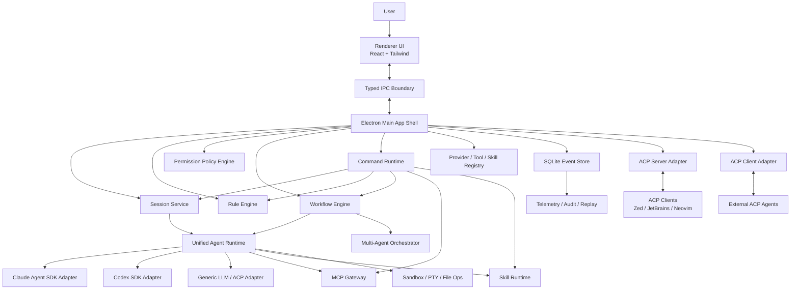
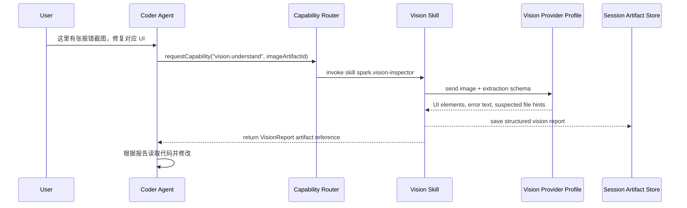
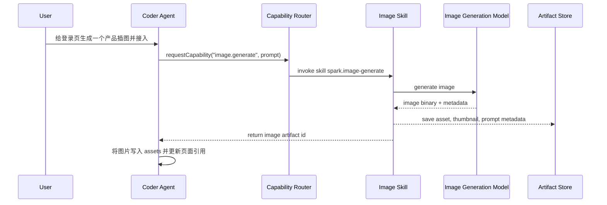
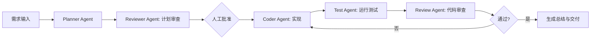

# Spark Agent Desktop Development Guide

版本: 0.1  
日期: 2026-05-26  
目标: 设计并逐步实现一个综合性的桌面端 agent 程序，融合 Claude Agent SDK 与 Codex SDK 的能力，支持 ACP、MCP、Skills、多层规则、工作流、可视化多 agent、团队协作与高性能本地执行。

---

## 1. 产品定位

Spark Agent 是一个本地优先的桌面端 AI Agent 工作台。它不是单一聊天窗口，而是一个可配置、可扩展、可审计的 agent 操作系统:

- 面向个人开发者: 像 Claude Desktop/Codex Desktop 一样完成代码、文档、研究、自动化任务。
- 面向团队: 提供共享规则、共享技能、协作任务、权限审批、运行记录和可复盘的执行链路。
- 面向高级用户: 支持 ACP 协议、MCP 服务、Skill 包、工作流编排、多 agent/subagent、沙箱、模型路由和自定义提供商。

核心原则:

- 本地优先: 项目文件、规则、会话、工作流、审计日志优先存在本地，可选择同步。
- 协议优先: 内部以 ACP 风格的 session/message/event/tool schema 为核心，外部通过 ACP/MCP 适配。
- SDK 双内核: Claude Agent SDK 和 Codex SDK 是默认强力执行内核，但业务层不直接绑定任一 SDK。
- 可观察、可回放、可治理: 每个 agent 动作都有事件、权限、上下文来源、成本和结果。
- 渐进扩展: 单机 MVP 先跑通，后续扩展团队、多机器、远程执行和插件生态。

---

## 2. 外部能力与约束

### 2.1 Claude Agent SDK

Claude Code SDK 已更名为 Claude Agent SDK。它提供 Python 和 TypeScript SDK，能复用 Claude Code 的工具、agent loop 和上下文管理能力。SDK 支持内置文件读取、命令执行、代码编辑、MCP 配置、权限控制、hooks、checkpoint、成本追踪和 OpenTelemetry。TypeScript SDK 包含平台相关 Claude Code binary，通常不需要单独安装 Claude Code CLI。

设计约束:

- Spark Agent 不应伪装为 Claude Desktop 或 Claude Code。
- 第三方产品默认应使用 Anthropic API key、Bedrock、Vertex、Azure 等官方支持鉴权方式，而不是向最终用户提供 claude.ai 登录或订阅额度代理。
- Claude Agent SDK 是强执行内核之一，但 Spark 的会话、权限、规则、事件与 UI 需要独立建模。

### 2.2 OpenAI Codex SDK

Codex SDK 的 TypeScript 包为 `@openai/codex-sdk`。它通过启动 `@openai/codex` CLI，并用 stdin/stdout JSONL 事件与 CLI 通信，提供 `Codex`、`Thread`、`run()`、`runStreamed()` 等接口。它适合接入代码任务、流式事件、工具调用、文件变更与 usage 信息。

设计约束:

- Codex SDK 的执行环境依赖本机 Codex CLI 能正常运行。
- 需要把 Codex 的 JSONL 事件转换成 Spark 内部统一事件。
- 需要提供 CLI 版本检查、路径选择、登录状态诊断和错误恢复。

### 2.3 ACP

本文中的 ACP 指 Agent Client Protocol。ACP 标准化编辑器客户端与 coding agent 之间的通信，常见实现基于 JSON-RPC 2.0 和双向 stdio，包含 session、prompt、streaming update、tool call、permission 等结构。

Spark 中 ACP 的定位:

- 内部核心协议: 用 ACP 风格 schema 表达 session、turn、message、tool call、permission request、file change、terminal output、agent status。
- 外部 ACP Server: 让 Zed、JetBrains、Neovim 等 ACP client 能连接 Spark Agent 的 agent。
- 外部 ACP Client: 让 Spark Desktop 能连接其他 ACP agent，例如 Claude Code ACP、Codex ACP、Gemini CLI ACP、OpenCode 等。

### 2.4 MCP

MCP 用于连接外部工具与数据源。Spark 需要支持 stdio、HTTP/SSE 或 Streamable HTTP 类型的 MCP 服务，支持系统级、用户级、项目级和会话级配置。

设计约束:

- MCP 工具必须经过权限策略与 allowlist/disallowlist。
- MCP server 的连接状态、工具 schema、错误必须可见。
- 大量 MCP 工具需要 tool search 或工具分组，避免上下文爆炸。

### 2.5 对 Claude Desktop 与 Codex Desktop 的能力吸收

Spark Agent 不复制任何单一产品，而是吸收两类桌面 agent 的优势，并在本地优先、团队治理和可视化编排上做差异化。

Claude Desktop 值得吸收的特长:

- 连接器与 MCP 体验: Claude Desktop 已把本地 desktop extensions 与远程 MCP connectors 作为重要能力。Spark 应提供同样低摩擦的连接体验，并增强本地权限、工具审计和项目级配置。
- Artifacts 思路: Claude 的 artifact 能把对话输出变成可持续迭代的产物。Spark 应把 artifact 扩展为代码 diff、报告、HTML 预览、工作流输出、运行诊断包等多类型资产。
- Projects/上下文体验: Claude 的项目化上下文降低重复说明成本。Spark 应进一步把项目规则、索引、文件选择、会话摘要和 token 预算做成可观察的 Context Ledger。
- 普通用户可理解的工具入口: Claude 的设置、连接器、artifact 浏览更偏产品化。Spark 的高级能力也要有 UI 入口，而不是只依赖配置文件。

Codex Desktop / Codex CLI 值得吸收的特长:

- 代码任务中心化: Codex 的核心优势是围绕本地代码仓库执行、解释、修改、测试、展示 diff。Spark 的 Project Session 应把代码变更、命令输出、测试结果和审批放在主时间线。
- 事件流与运行透明度: Codex SDK/CLI 的流式事件适合做 timeline、trace、usage、tool call 和 resume。Spark 应用统一 AgentEvent 抹平 Claude/Codex 差异。
- `/` 命令系统: Codex 的 slash commands 适合高频切换模型、审批模式、历史、压缩上下文、撤销等操作。Spark 应在输入框中实现更强的命令面板、命令补全、作用域提示和安全预览。
- 本地运行的清晰心智: Codex 强调本地 coding agent。Spark 也应把“当前 agent 正在哪个 workspace、用什么权限、占用多少资源、准备修改哪些文件”持续展示出来。

Spark 的创新方向:

- Context Governor: 把上下文选择、压缩、摘要、预算、来源、污染风险和丢弃策略显式化。
- Resource Governor: 把 CPU、内存、子进程、并发 agent、MCP server、token 成本变成可控预算。
- Visual Agent Graph: 把多 agent/subagent/工具/人类审批变成可暂停、可重跑、可追踪的图。
- Workflow Studio: 把一次性对话提升为可复用、可版本化、可分享的流程编排。
- Command Runtime: 把输入框变成 agent 操作系统的统一入口，而不是只用于发送自然语言。

---

## 3. 推荐技术栈

### 3.1 桌面框架

推荐: Electron + TypeScript + React

原因:

- Claude Agent SDK 和 Codex SDK 都有 TypeScript 路径，Electron 主进程可直接集成 Node 包、CLI 子进程、文件系统、PTY、MCP stdio。
- 相比 Tauri，Electron 更适合快速构建 AI desktop 的 agent runtime、进程管理、插件系统和本地任务编排。
- 性能可通过进程隔离、worker、虚拟列表、事件分页、SQLite WAL 和懒加载解决。

后续可扩展:

- 对高风险执行可引入 Rust sidecar 或微虚拟机沙箱。
- 对重型索引可引入 Rust/Go sidecar。

### 3.2 前端

- React 19 或当前稳定版 React
- TypeScript
- Vite
- Tailwind CSS
- Radix UI / Ariakit 作为无障碍交互基础
- TanStack Query 处理异步状态
- Zustand 或 Jotai 处理局部 UI 状态
- React Flow 或 XYFlow 处理可视化 workflow/multi-agent 图
- Monaco Editor 处理规则、prompt、diff、配置编辑
- xterm.js 处理终端输出
- shiki 或 CodeMirror/Monaco 处理代码块渲染

为什么选 Tailwind CSS:

- 对 AI 辅助开发友好，局部样式可读、迭代快。
- 适合构建复杂工具型界面，配合 design tokens 和组件封装能保持一致。
- Less 更适合传统样式组织，但对快速生成和重构不如 Tailwind 直接。

### 3.3 后端与本地运行时

- Electron main process: 桌面能力、IPC、窗口、权限、进程编排。
- Node worker threads: 规则合成、日志压缩、索引、事件转换。
- Child process / PTY: Claude/Codex CLI、MCP stdio server、用户命令。
- SQLite + WAL: 本地元数据、事件日志、会话、配置、规则、审计。
- LanceDB 或 SQLite FTS5: 初期用于本地检索；后续可接入向量库。
- OpenTelemetry: trace、span、usage、tool call、错误链路。

### 3.4 包管理与工程

- pnpm workspace
- Turborepo 可选；MVP 阶段不强制
- Vitest 单元测试
- Playwright 端到端测试
- ESLint + Prettier
- electron-builder 或 Electron Forge 打包

---

## 4. 总体架构



核心分层:

- UI 层: 显示会话、任务、工作流、权限弹窗、文件 diff、终端、设置。
- App Shell 层: 管理窗口、IPC、安全边界、系统托盘、全局快捷键。
- Agent Runtime 层: 将不同 SDK/agent 统一成 Spark 内部事件模型。
- Protocol Gateway 层: ACP、MCP、Skill、工具调用的适配与治理。
- Command Runtime 层: 输入框 `/` 命令、命令补全、命令预览、命令审计。
- Workflow 层: 多 agent 图、任务队列、依赖、重试、人工审批。
- Persistence 层: 事件溯源、配置、规则、密钥引用、运行状态、审计。

---

## 5. 核心功能设计

### 5.0 核心特色能力

Spark Agent 的产品特色不应只停留在“接入更多模型和工具”。它需要形成几项用户能明显感知、开发上也能落地的核心能力。

#### 5.0.1 Context Governor 上下文智能控制

目标: 让用户知道 agent 正在使用哪些上下文、为什么使用、占用多少预算、哪些内容被压缩或丢弃，并能随时接管。

能力:

- Context Ledger: 每次 run 记录上下文来源，包括用户消息、规则、项目文件、MCP resources、Skill 文档、会话摘要、手动 pin 的内容。
- Token Budget Planner: 运行前估算上下文预算，按 system/rules/files/history/tools/output reserve 分配。
- Smart Context Packs: 根据任务自动构建上下文包，例如 `architecture-pack`、`bugfix-pack`、`release-pack`、`review-pack`。
- Context Pinning: 用户可 pin 文件、目录、代码片段、规则、MCP resource，保证不被自动压缩。
- Context Exclusion: 用户可排除大文件、敏感目录、生成产物、锁文件、日志。
- Summarization Ladder: 会话过长时分层摘要，包括 turn summary、topic summary、decision summary、artifact summary。
- Context Diff: 当上下文自动变化时，UI 显示“新增/移除/压缩了什么”。
- Pollution Detector: 检测过期规则、冲突需求、无关搜索结果、重复文件、异常大上下文。
- Manual Override: 用户可在发送前切换自动/手动/最小上下文模式。

上下文模式:

```ts
type ContextMode =
  | "minimal"       // 只使用当前消息和显式附件
  | "project-smart" // 默认模式，使用项目索引和规则
  | "deep-research" // 扩大检索范围，适合调研和架构
  | "surgical"      // 精准修改，严格限制文件范围
  | "review"        // 读取 diff、测试、相关规则
  | "manual";       // 用户手动选择上下文
```

UI 表现:

- 输入框左侧显示当前上下文模式。
- 右侧 Inspector 显示上下文预算环形图。
- Timeline 中每个 agent run 可展开 Context Ledger。
- 当 agent 请求读取新文件时，显示原因、路径、大小和风险。

#### 5.0.2 Resource Governor 系统资源占用控制

目标: 桌面 agent 不能把用户电脑拖慢。Spark 需要像任务管理器一样管理 agent、MCP、索引、终端命令和模型调用。

能力:

- Run Budget: 每次运行可设置 token、成本、时间、文件写入数、命令数、网络调用数。
- Process Budget: 限制并发子进程、PTY、MCP server、worker thread。
- CPU/Memory Watchdog: 监控 Electron、adapter、MCP server、indexer、shell command 的 CPU 与内存。
- Adaptive Throttling: 用户正在高负载工作时降低索引频率、暂停后台摘要、限制并发 subagent。
- Background Queue: 长任务进入后台队列，支持暂停、恢复、取消、优先级。
- Thermal Mode: 笔记本电池供电或高温时自动切换省电策略。
- Workspace Quotas: 每个项目可配置最大索引大小、最大 artifact 存储、最大日志保留天数。
- Kill Switch: 一键停止当前 workspace 的所有 agent、命令和 MCP server。

资源档位:

```ts
type ResourceProfile = {
  id: "eco" | "balanced" | "turbo" | "custom";
  maxConcurrentRuns: number;
  maxSubagentsPerRun: number;
  maxMcpServers: number;
  maxShellProcesses: number;
  maxMemoryMb: number;
  maxRunMinutes: number;
  backgroundIndexing: "off" | "low" | "normal";
};
```

默认策略:

- `eco`: 适合电池模式，只允许 1 个 run、暂停后台索引。
- `balanced`: 默认模式，允许 2-3 个 run，后台任务低优先级。
- `turbo`: 插电和高性能机器使用，允许更多 subagent 并行。

#### 5.0.3 Workflow Studio 流程编排能力

目标: 把优秀的一次性 agent 工作沉淀成可复用流程。

能力:

- 可视化 DAG 编排，支持 agent、tool、script、approval、branch、parallel、merge、artifact 节点。
- 节点级模型、上下文、规则、权限、资源预算。
- 输入输出 schema，节点之间通过 typed artifact 传递。
- 从任意节点重跑，不必重跑整个流程。
- Human-in-the-loop 审批节点。
- Workflow Templates: 功能开发、代码审查、Issue triage、发布检查、研究报告、文档生成。
- Run Replay: 复盘每个节点使用的上下文、工具、输出和耗时。
- Workflow Versioning: 流程版本化，团队可共享稳定版本。

Spark 创新点:

- Conversation-to-Workflow: 用户可把一次成功的会话“提炼”为工作流模板。
- Workflow Guardrails: 每个流程携带安全边界，例如禁止生产环境命令、限制外部网络、强制 review 节点。
- Workflow Scorecard: 每次运行输出成功率、重试次数、人工介入次数、成本和耗时。

#### 5.0.4 Visual Agent Graph agent 可视化

目标: 让用户看见多 agent 正在如何协作，而不是只看到混杂的聊天记录。

能力:

- Agent Graph: 展示 primary agent、subagent、tool、MCP server、human approval 的实时拓扑。
- Status Overlay: 每个节点展示 idle/running/waiting/failed/completed、当前模型、权限、资源占用。
- Message Edges: 展示 agent 之间传递了什么 artifact 或上下文包。
- Drilldown: 点击节点查看 prompt、规则、上下文、工具调用、产物、错误。
- Control Surface: 用户可以暂停单个 agent、取消分支、重跑节点、接管输出。
- Diff-aware Visualization: 文件修改按 agent 归属着色，便于追责和回滚。
- Team Presence: 团队成员可在图上认领审批或评论某个节点。

#### 5.0.5 Command Runtime 输入即操作系统

目标: 输入框既能接受自然语言，也能执行结构化命令。它是 Spark 的统一操作入口。

能力:

- `/` 命令补全。
- 命令分组、搜索、别名、最近使用。
- 参数表单化输入。
- 命令执行前预览影响范围。
- 命令可由系统、Skill、MCP、Workflow、Team policy 注册。
- 命令可被权限引擎拦截。
- 命令执行结果进入 timeline，成为可审计事件。

#### 5.0.6 Run Capsule 可复盘运行胶囊

目标: 每次重要运行都可复盘、复用、分享。

Run Capsule 包含:

- 输入需求。
- 有效规则包。
- 上下文清单。
- 模型路由。
- 工具/MCP 清单。
- 权限决策。
- 文件 diff。
- 测试输出。
- 成本与耗时。
- 最终 artifact。

用途:

- 复盘失败原因。
- 团队异步 review。
- 生成 PR 描述。
- 创建 workflow 模板。
- 作为合规审计证据。

### 5.1 工作台首页

首页不是营销页，而是实际工作入口。

功能:

- 最近会话、最近项目、正在运行任务、失败任务。
- 快速开始:
  - 新建聊天
  - 打开项目
  - 运行工作流
  - 连接 MCP
  - 创建 Skill
  - 启动团队任务
- Agent 状态栏:
  - Claude/Codex 可用性
  - API key/login 状态
  - MCP server 状态
  - 当前沙箱模式
  - 今日 token/成本

### 5.2 会话系统

会话分组原则:

- Project 是会话的一级分组。用户进入应用后，所有 Chat、Project、Workflow、Multi-Agent、Team run 都优先挂在某个 Project 下。
- Project 以一个本地文件夹地址为基础，`rootPath` 是项目身份的核心字段。
- 同一个文件夹地址默认对应一个 Project；如果路径移动，需要通过“重新定位项目”维护历史会话。
- 支持创建空白文件夹作为新项目。用户选择父目录和项目名后，Spark 创建文件夹，并初始化 `.spark/` 与 `.agent_spark/`。
- 支持打开已有文件夹作为项目。若不存在 `.spark/`，Spark 提示是否初始化项目配置；若用户拒绝，仍可作为临时项目打开，但项目级规则和工作流不可持久化。
- 会话列表按 Project 分组展示。全局 Chat 可以存在，但默认落在 `Personal / Scratch` 这类系统项目下，避免会话游离在项目之外。
- 跨项目会话作为高级模式处理，必须显式选择多个 Project，并在 UI 中展示每个文件访问属于哪个 Project。

会话类型:

- Chat Session: 归属于一个 Project 的通用聊天、研究、写作、问答。
- Project Session: 绑定一个 Project，支持文件读写、终端、diff。
- Workflow Session: 归属于一个 Project，由工作流图驱动，可能包含多个 agent run。
- Team Session: 归属于一个 Team Project，多人协作、共享任务、评论、审批。
- ACP Session: 来自外部 ACP client 的会话。

会话能力:

- 流式输出。
- 工具调用时间线。
- 文件修改 diff。
- 终端输出折叠。
- 权限请求与审批。
- 失败重试。
- 分支/回滚/checkpoint。
- 导出为 Markdown、JSONL、HTML。
- 会话内规则覆盖。

### 5.2.1 输入框 `/` 命令系统

Spark 的输入框分为三种输入:

- Natural Prompt: 普通自然语言消息。
- Slash Command: 以 `/` 开头的结构化命令。
- Mention / Attach: 以 `@` 引用文件、agent、workflow、MCP tool、artifact、team member。

设计目标:

- 保留 Codex 风格的高效命令入口。
- 让非技术用户也能通过补全、说明、参数表单使用命令。
- 把所有命令纳入权限、审计、规则和工作流系统。

#### 命令交互

输入 `/` 后弹出命令面板:

- 支持模糊搜索，例如输入 `/mod` 匹配 `/model`。
- 命令按分组展示: Session、Model、Context、Permission、Workflow、Agent、MCP、Skill、Team、System。
- 每个命令显示描述、作用域、风险等级、快捷参数。
- 命令有参数时，支持 inline 参数和表单参数两种方式。
- 命令执行前如涉及高风险操作，展示预览和审批。
- 命令执行结果进入当前 timeline。

命令语法:

```text
/command [subcommand] [--flag value] [@target] [free text]
```

示例:

```text
/model coder codex-high
/approval workspace-write
/context mode surgical @src/runtime
/compact --keep decisions,artifacts
/workflow run feature-development --from plan
/agent spawn reviewer --model claude-fast
/mcp enable github --session
/skill install ./skills/code-review
/resource eco
/team request-approval @alex "允许执行数据库迁移检查"
```

#### 内置命令清单

Session:

- `/help`: 打开命令帮助。
- `/status`: 显示当前 session、provider、模型、权限、资源、MCP 状态。
- `/history`: 打开会话历史。
- `/sessions`: 切换或搜索会话。
- `/rename <title>`: 重命名会话。
- `/export markdown|jsonl|html`: 导出会话。
- `/undo`: 撤销上一组未提交文件变更。
- `/checkpoint create|restore|list`: 管理 checkpoint。

Model:

- `/model [role] [profile]`: 切换当前或某个角色的模型。
- `/provider [provider-id]`: 切换 provider。
- `/reason none|minimal|low|medium|high`: 调整 reasoning effort。
- `/fallback on|off`: 开关 fallback 模型。
- `/budget tokens|cost|time <value>`: 设置本次运行预算。

Context:

- `/context`: 打开 Context Ledger。
- `/context mode minimal|project-smart|deep-research|surgical|review|manual`: 切换上下文模式。
- `/pin @file|@folder|@artifact`: 固定上下文。
- `/exclude @file|@folder|pattern`: 排除上下文。
- `/compact`: 压缩当前会话上下文。
- `/summarize decisions|files|artifacts|all`: 生成摘要。
- `/clear-context`: 清空会话临时上下文。

Permission:

- `/approval ask|read-only|workspace-write|full-auto`: 切换审批模式。
- `/allow tool|path|command --session`: 临时允许某项能力。
- `/deny tool|path|command --session`: 临时禁止某项能力。
- `/sandbox level 0|1|2|3|4`: 切换沙箱等级。
- `/audit`: 打开权限和工具调用审计。

Workflow:

- `/workflow list`: 查看工作流。
- `/workflow run <id>`: 运行工作流。
- `/workflow pause|resume|cancel`: 控制当前工作流。
- `/workflow rerun <node-id>`: 从节点重跑。
- `/workflow create-from-session`: 从当前会话提炼工作流。
- `/workflow inspect`: 打开 workflow graph。

Agent:

- `/agent list`: 查看 agent。
- `/agent spawn <role>`: 创建 subagent。
- `/agent pause|resume|cancel <id>`: 控制 agent。
- `/agent graph`: 打开可视化 agent graph。
- `/handoff <agent-id>`: 将当前任务交给指定 agent。

MCP:

- `/mcp list`: 查看 MCP servers。
- `/mcp enable|disable <server>`: 启用或禁用 server。
- `/mcp tools <server>`: 查看工具。
- `/mcp call <tool>`: 手动调用工具。
- `/mcp diagnose <server>`: 诊断连接。

Skill:

- `/skill list`: 查看 skills。
- `/skill search <query>`: 搜索 skill。
- `/skill install <source>`: 安装 skill。
- `/skill enable|disable <id>`: 启用或禁用。
- `/skill run <id>`: 运行 skill。

Resource:

- `/resource eco|balanced|turbo`: 切换资源档位。
- `/resource status`: 查看资源占用。
- `/queue`: 查看后台任务队列。
- `/kill-run`: 停止当前 run。
- `/kill-workspace`: 停止当前 workspace 的所有 agent 和 MCP 子进程。

Team:

- `/team invite <email>`: 邀请成员。
- `/team request-approval @member <reason>`: 请求审批。
- `/assign @member`: 指派任务。
- `/comment <text>`: 给当前 run 留评论。
- `/policy inspect`: 查看团队策略。

#### 命令注册接口

命令由 Command Registry 管理，系统、Skill、MCP、Workflow 都可以注册命令。

```ts
type SlashCommand = {
  id: string;
  name: string;
  aliases: string[];
  group:
    | "session"
    | "model"
    | "context"
    | "permission"
    | "workflow"
    | "agent"
    | "mcp"
    | "skill"
    | "resource"
    | "team"
    | "system";
  description: string;
  scope: "global" | "workspace" | "session" | "workflow" | "team";
  risk: "none" | "low" | "medium" | "high";
  argsSchema: JsonSchema;
  preview?: (args: unknown, env: CommandEnv) => Promise<CommandPreview>;
  execute: (args: unknown, env: CommandEnv) => AsyncIterable<AgentEvent>;
};
```

命令执行流程:

1. 输入解析: 将用户输入解析为 command、subcommand、flags、targets、free text。
2. 补全: 根据当前 session/workspace/team 状态返回候选命令和参数。
3. 参数校验: 使用 zod/JSON Schema 校验。
4. 预览: 展示将修改的配置、目标文件、权限变化、可能启动的进程。
5. 权限检查: 交给 Permission Engine 判断是否需要审批。
6. 执行: Command Runtime 调用对应 handler。
7. 事件落库: 生成 `CommandInvokedEvent`、`CommandPreviewEvent`、`CommandResultEvent`。
8. UI 更新: Timeline、Inspector、Toast、Settings 同步变化。

#### 命令与自然语言混合

Spark 支持命令后追加自然语言，用于给 agent 提供上下文:

```text
/agent spawn reviewer 请只检查权限系统和 MCP 工具暴露风险
/workflow run feature-development 实现 Phase 0 项目骨架，先写最小测试
/context mode surgical 只允许查看 adapter 相关文件
```

解析策略:

- flags 和 mention 优先解析。
- 剩余文本作为 `freeText` 传给 command handler。
- handler 决定 freeText 是作为 agent prompt、workflow input 还是备注。

#### 命令安全策略

- 高风险命令必须有 preview，例如 `/kill-workspace`、`/approval full-auto`、`/allow command --project`。
- Team policy 可以隐藏或禁用某些命令。
- Skill 注册的命令默认 `risk=medium`，除非 manifest 明确声明低风险且通过 vetting。
- MCP 注册的命令不能绕过 MCP Gateway。
- 所有命令都进入 audit log。

### 5.3 模型与 Provider 配置

配置目标:

- 用户可配置多个 provider profile。
- provider profile 只分两种协议格式: `anthropic` 和 `openai`。
- 每个 provider profile 自带 `baseUrl`、`apiKey`、`defaultModel` 和 `modelIds[]`，不再依赖独立 model profile 才能运行。
- DeepSeek、OpenRouter、Ollama、LM Studio、自建网关等都作为“供应商名称 + endpoint”的具体实例接入，而不是单独的 adapter 类型。
- agent/workflow/session 绑定 provider profile；需要切模型时，在同一个 provider profile 的 `modelIds[]` 中选择，或切换到另一个 provider profile。
- 设置页提供一组内置供应商 preset，preset 只负责预填官方公开可验证的 `baseUrl` 与一组推荐 `modelIds[]`，保存后落库的仍然是普通 provider profile。
- 内置 preset 首批覆盖腾讯云 Coding Plan、阿里云百炼 Coding Plan、智谱 GLM Coding Plan、DeepSeek API、MiniMax、Kimi、硅基流动、OpenRouter，同时保留完全自定义入口。

设计约束:

- 适配器层只保留 `AnthropicAdapter` 和 `OpenAIAdapter`。
- 供应商差异通过 endpoint、header、鉴权和模型 ID 体现，不再为每个供应商创建单独 adapter。
- 历史 `model_profiles` 结构保留为迁移兼容层，不再作为主配置入口。

Provider Profile 字段:

```ts
type ProviderProfile = {
  id: string;
  displayName: string;
  provider: "anthropic" | "openai";
  baseUrl?: string;
  secretRef: string;
  defaultModel: string;
  modelIds: string[];
  enabled: boolean;
  isDefault: boolean;
  metadata?: {
    vendorName?: string;
    notes?: string;
    defaultHeaders?: Record<string, string>;
  };
};
```

说明:

- `provider` 表示请求协议格式，而不是商业供应商枚举。
- 供应商品牌信息放在 `displayName` 或 `metadata.vendorName`。
- `defaultModel` 是默认运行模型，必须同时出现在 `modelIds[]` 中。
- `modelIds[]` 支持用户手动维护更多模型 ID，供会话或工作流覆盖使用。
- preset 只是创建时的模板来源，不参与运行时路由判定，也不限制用户后续修改 endpoint、默认模型或模型列表。

路由策略:

- Manual: 用户手动选择。
- Role-based: planner/reviewer/coder 使用不同 profile。
- Cost-aware: 超出成本阈值后切换低成本模型。
- Latency-aware: 交互式任务优先低延迟模型。
- Capability-aware: 需要代码编辑、沙箱、MCP、长上下文时选择匹配 provider。

### 5.3.1 Token、成本与用量统计

Spark 必须同时支持 agent 级、模型级、provider 级、session 级、workflow 级和团队级 token 统计。UI 中 Home 的“今日 TOKEN/成本”、Multi-Agent 卡片的 agent token、Chat 右侧 Inspector 的输入/输出 token、Workflow 节点卡片的 token 和 Settings Provider 的模型用量都来自同一套 Usage Ledger。

统计层级:

- Global Daily Usage: 今日总 token、成本、运行任务数、沙箱等级。
- Provider Usage: 按 provider 统计调用次数、成功率、延迟、输入/输出 token、成本。
- Model Usage: 按具体模型 ID 统计 token、成本、平均首 token 延迟、平均完成耗时，并关联其所属 provider profile。
- Agent Usage: 每个 agent/subagent 统计本次 run token、工具次数、耗时、成本、失败率。
- Session Usage: 会话内累计输入、输出、工具、缓存、图片、音频等用量。
- Workflow Usage: 按 workflow run、节点、边、重试次数汇总。
- Team Usage: 团队成员、项目、规则、工作流维度汇总，支持预算和配额。

统一用量结构:

```ts
type TokenUsage = {
  inputTokens: number;
  outputTokens: number;
  cachedInputTokens?: number;
  cacheWriteTokens?: number;
  reasoningTokens?: number;
  toolCallTokens?: number;
  toolResultTokens?: number;
  systemRuleTokens?: number;
  contextFileTokens?: number;
  historyTokens?: number;
  estimated: boolean;
};

type MediaUsage = {
  imageInputCount?: number;
  imageOutputCount?: number;
  imageInputPixels?: number;
  imageOutputPixels?: number;
  audioInputSeconds?: number;
  audioOutputSeconds?: number;
  videoInputSeconds?: number;
  fileInputBytes?: number;
};

type UsageLedgerEntry = {
  id: string;
  sessionId?: string;
  runId?: string;
  turnId?: string;
  workflowNodeId?: string;
  agentId?: string;
  providerId: string;
  modelId: string;
  operation: "chat" | "tool" | "embedding" | "image-generate" | "image-edit" | "vision" | "audio" | "rerank";
  tokenUsage: TokenUsage;
  mediaUsage?: MediaUsage;
  cost: {
    currency: "USD" | "CNY";
    estimatedAmount: number;
    finalAmount?: number;
  };
  latencyMs: {
    queue?: number;
    firstToken?: number;
    total: number;
  };
  source: "provider-reported" | "adapter-computed" | "local-estimate";
};
```

统计策略:

- Provider-reported 优先: 如果服务商返回 usage，原样保存到 `rawUsage`，再映射到统一字段。
- Adapter-computed 兜底: 对兼容接口缺失的字段用 tokenizer 或字符估算。
- Estimate 标记: 所有估算值必须标记 `estimated=true`，UI 用虚线或 `≈` 显示。
- 多模态计费拆分: 图片、音频、视频不强行换算成文本 token，保留 provider 原生单位和估算金额。
- 缓存 token 拆分: cache read/cache write 单独记账，否则成本会失真。
- 规则 token 拆分: system/team/user/project/session/skill 注入的 token 分开统计，便于优化规则栈。
- 工具 token 拆分: tool schema、tool call、tool result 分开统计，便于发现 MCP 工具上下文膨胀。

UI 表现:

- Home: 今日 token、成本、运行任务、待审批、沙箱等级。
- Multi-Agent: 每张 agent 卡展示本次 token、工具数、耗时、状态。
- Workflow: 每个节点展示 token、耗时、状态，连线可显示传递 artifact 大小。
- Chat Inspector: 输入 token、输出 token、工具调用、成本、耗时、上下文窗口进度条。
- Settings > Provider: provider 健康状态、profile 数、延迟、今日/本月成本。
- Settings > Provider: 查看默认模型、模型列表、单模型用量趋势和近 7 天成本。
- Team Dashboard: 按成员/项目/workflow/provider/model 做预算看板。

预算与限流:

- 每个 provider profile 可设置默认模型与可用模型列表，并在运行时叠加 session/workflow 级预算。
- 每个 agent 可设置单次任务和每日预算。
- 每个 workflow 可设置总预算和节点预算。
- 团队可设置成员、项目、provider、模型维度预算。
- 预算达到 80% 时 UI 提醒，达到 100% 时进入人工审批或自动 fallback。

### 5.3.2 多模态模型与能力路由

Spark 的 agent 不应被绑定为“只能文本”或“只能代码”。模型能力通过 Model Capability Registry 描述，再由 Router 按任务选择模型或工具。

能力类型:

- Text: 聊天、总结、结构化输出、长文档。
- Code: 代码生成、代码编辑、diff、测试、review。
- Vision Understanding: 图片理解、截图解释、UI 走查、图表读取。
- Image Generation: 文生图、图生图、海报/插图/图标生成。
- Image Editing: 局部修改、风格迁移、背景替换。
- Audio: 转写、语音生成、会议纪要。
- Embedding/Rerank: 本地索引、语义检索、上下文召回。
- Video: 视频理解或生成，后续扩展。

多模态路由规则:

- 如果用户输入包含图片，优先选择 `visionUnderstanding=true` 的模型。
- 如果当前 agent 是 Coder，但任务需要看 UI 截图，Router 可以临时调用 vision skill，再把结构化结果返回给 Coder。
- 如果当前 agent 是 Coder，但任务需要生成图标或封面，Router 可以临时调用 image generation skill，产物作为 artifact 挂到会话。
- 如果当前默认模型不支持图片输入，系统先尝试同一 provider profile 的其他已配置模型；没有则切换到具备视觉能力的 provider profile；仍没有则请求用户补充配置。
- 多模态产物必须进入 Artifact Store，并带上来源模型、prompt、seed、尺寸、版权/安全标记和成本。

示例: 编码 agent 扩展图片理解能力



示例: 编码 agent 扩展生图能力



多模态权限:

- 图片理解默认 `read-media` 权限。
- 生图默认 `generate-media` 权限，若写入项目文件还需要 `filesystem:write`。
- 涉及人物、品牌、版权或敏感内容时进入人工审批。
- 团队模式下可限制某些 provider 或生图模型只能由指定角色使用。

### 5.4 ACP 核心协议层

Spark 内部定义 `Spark Agent Protocol`，保持与 ACP 概念兼容，但加入桌面产品需要的扩展字段。

核心对象:

```ts
type AgentSession = {
  id: string;
  kind: "chat" | "project" | "workflow" | "team" | "acp";
  projectId: string;
  workspaceIds: string[];
  createdBy: string;
  activeAgentIds: string[];
  ruleBundleId: string;
  permissionProfileId: string;
  status: "idle" | "running" | "waiting_approval" | "failed" | "completed" | "cancelled";
};

type AgentEvent =
  | UserMessageEvent
  | AssistantMessageEvent
  | ToolCallEvent
  | ToolResultEvent
  | PermissionRequestEvent
  | PermissionDecisionEvent
  | FileChangeEvent
  | TerminalOutputEvent
  | AgentStatusEvent
  | UsageEvent
  | ErrorEvent;
```

适配方向:

- Claude Adapter: Claude Agent SDK message -> AgentEvent。
- Codex Adapter: Codex JSONL event -> AgentEvent。
- MCP Gateway: MCP tool call/result -> AgentEvent。
- ACP Server: AgentEvent -> ACP JSON-RPC notification/response。
- UI: AgentEvent -> timeline/diff/terminal/approval components。

### 5.5 Claude Agent SDK 适配器

职责:

- 创建 Claude query。
- 注入规则合成后的 system prompt / append prompt。
- 注入 workspace、allowed tools、disallowed tools、MCP servers。
- 监听 message stream 并转换事件。
- 处理 tool permission、hooks、checkpoint、usage。
- 处理 SDK 错误并映射为用户可理解诊断。

接口:

```ts
interface AgentProviderAdapter {
  id: string;
  capabilities: AgentCapabilities;
  healthCheck(): Promise<ProviderHealth>;
  startSession(input: StartAgentSessionInput): Promise<ProviderSession>;
  sendTurn(input: SendTurnInput): AsyncIterable<AgentEvent>;
  cancel(sessionId: string): Promise<void>;
  resume(sessionId: string): Promise<ProviderSession>;
}
```

Claude Adapter 特殊能力:

- 内置工具权限映射: Read/Edit/Bash/Glob/Grep/MCP。
- `settingSources` 控制项目 `.mcp.json` 和 settings 读取。
- hooks 对接 Spark permission policy。
- checkpoint 对接 Spark session checkpoint UI。

### 5.6 Codex SDK 适配器

职责:

- 检查 `@openai/codex` CLI 可用性。
- 通过 `@openai/codex-sdk` 创建 Codex thread。
- 将 `runStreamed()` 的 structured events 转换为 AgentEvent。
- 处理 Codex item、turn.completed、usage、file change、permission。
- 提供 thread 继续对话、resume、取消。

Codex Adapter 特殊能力:

- 支持长任务队列。
- 支持以代码项目为中心的多 agent 执行。
- 支持将 Codex 的计划、diff、命令输出以 Codex Desktop 类似体验展示。

### 5.7 Skill 系统

Skill 是一个可安装、可版本化、可共享的能力包，包含说明、资源、脚本和可选 UI/schema。

目录结构:

```text
skills/
  <skill-id>/
    SKILL.md
    skill.json
    scripts/
    templates/
    assets/
    tests/
```

`skill.json`:

```json
{
  "id": "spark.code-review",
  "name": "Code Review",
  "version": "0.1.0",
  "description": "Review code changes with severity-ranked findings.",
  "triggers": ["code review", "review PR"],
  "permissions": {
    "filesystem": "read",
    "network": "optional",
    "shell": "deny"
  },
  "inputs": {
    "repositoryPath": "string",
    "diffRef": "string"
  }
}
```

增强版 `skill.json` 需要支持能力声明、模型依赖和产物类型:

```json
{
  "id": "spark.vision-inspector",
  "name": "Vision Inspector",
  "version": "0.1.0",
  "description": "Extract UI, text, layout, error and chart information from images.",
  "triggers": ["看图", "图片理解", "截图分析", "ui screenshot", "vision"],
  "capabilitiesProvided": ["vision.understand", "ui.inspect", "chart.extract"],
  "modelRequirements": [
    {
      "role": "vision",
      "requiredCapabilities": ["visionUnderstanding", "structuredOutput"],
      "acceptedInput": ["image", "text"],
      "expectedOutput": ["text"]
    }
  ],
  "permissions": {
    "filesystem": "read",
    "network": "optional",
    "media": "read",
    "shell": "deny"
  },
  "inputs": {
    "imageArtifactId": "string",
    "question": "string",
    "outputSchema": "object"
  },
  "outputs": {
    "visionReport": "artifact:json"
  }
}
```

```json
{
  "id": "spark.image-generate",
  "name": "Image Generator",
  "version": "0.1.0",
  "description": "Generate or edit image assets and return managed artifacts.",
  "triggers": ["生图", "生成图片", "生成图标", "image generation", "cover art"],
  "capabilitiesProvided": ["image.generate", "image.edit"],
  "modelRequirements": [
    {
      "role": "image-generation",
      "requiredCapabilities": ["imageGeneration"],
      "acceptedInput": ["text", "image"],
      "expectedOutput": ["image"]
    }
  ],
  "permissions": {
    "filesystem": "optional-write",
    "network": "required",
    "media": "generate",
    "shell": "deny"
  },
  "inputs": {
    "prompt": "string",
    "referenceArtifactIds": "string[]",
    "size": "string",
    "style": "string"
  },
  "outputs": {
    "imageAsset": "artifact:image",
    "thumbnail": "artifact:image",
    "metadata": "artifact:json"
  }
}
```

Skill 功能:

- 系统级 Skill: 随应用内置。
- 用户级 Skill: 用户安装，所有项目可用。
- 项目级 Skill: 项目仓库内提供。
- 团队级 Skill: 团队共享并受管理员治理。
- Skill Store: 本地索引、远程市场、私有 registry。
- Skill Vetting: 安装前检查脚本、网络、权限、依赖、来源。

运行方式:

- Prompt Skill: 只注入说明。
- Script Skill: 允许执行脚本。
- MCP Skill: 启动或配置 MCP server。
- Workflow Skill: 提供可视化节点模板。
- Capability Skill: 给 agent 增加某类能力，例如图片理解、生图、语音转写、网页浏览。
- Model-bound Skill: skill 明确要求某类模型能力或模型 ID，例如 vision/image-generation/embedding。

Skill 与 Agent 的能力组合:

```ts
type AgentTemplate = {
  id: string;
  name: string;
  role: "planner" | "coder" | "reviewer" | "tester" | "researcher" | "designer" | "custom";
  primaryProviderProfileId: string;
  fallbackProviderProfileIds: string[];
  modelOverride?: string;
  enabledSkillIds: string[];
  enabledToolIds: string[];
  ruleRefs: string[];
  permissionProfileId: string;
  resourceProfileId: string;
  budgets: {
    maxTokensPerRun?: number;
    maxCostPerRun?: number;
    maxMinutesPerRun?: number;
  };
};
```

示例: Coder Agent 主模型是 Codex，但通过 Skill 扩展图片能力:

```json
{
  "id": "agent.coder.default",
  "name": "Coder Agent",
  "role": "coder",
  "primaryProviderProfileId": "openai-coder-prod",
  "fallbackProviderProfileIds": ["openai-compatible-fast", "anthropic-reviewer"],
  "modelOverride": "gpt-5-codex",
  "enabledSkillIds": [
    "spark.code-review",
    "spark.test-runner",
    "spark.vision-inspector",
    "spark.image-generate"
  ],
  "enabledToolIds": ["Read", "Edit", "Bash", "Grep", "Git", "filesystem"],
  "permissionProfileId": "project-l2-write-approval",
  "resourceProfileId": "balanced",
  "budgets": {
    "maxTokensPerRun": 200000,
    "maxCostPerRun": 5,
    "maxMinutesPerRun": 20
  }
}
```

调用规则:

- Agent 的 primary model 负责主任务上下文和最终决策。
- 当 agent 调用自己不具备的能力时，向 Capability Router 发起 `requestCapability()`。
- Router 根据 skill 的 `capabilitiesProvided`、`modelRequirements`、权限策略和预算选择 skill 与模型。
- Skill 返回 artifact reference，而不是把大图片或长报告直接塞回 prompt。
- Agent 只读取必要摘要；需要更多细节时再按需展开 artifact。
- 所有跨模型调用都写入 Usage Ledger，并归属到原 agent 的 run 成本中。

### 5.8 MCP 管理

MCP 配置作用域:

- System: 应用内置，例如 filesystem、git、browser。
- User: 用户全局，例如 GitHub、Notion、Slack。
- Project: 项目 `.spark/mcp.json`。
- Conversation: 当前会话临时启用。
- Team: 团队管理员发布。

MCP 管理 UI:

- Server 列表与状态。
- 工具列表、schema、示例。
- 连接日志。
- secret 绑定。
- allowlist/disallowlist。
- 一键诊断。
- 按 agent/session/workflow 绑定。

连接生命周期:

1. 读取多层配置。
2. 合成有效 MCP 配置。
3. 启动或连接 server。
4. 拉取 tools/resources/prompts。
5. 根据权限策略裁剪工具。
6. 将工具暴露给 provider adapter。
7. 记录调用与结果。
8. 会话结束后释放会话级 server。

### 5.9 多层规则系统

规则层级:

1. System Rules: 应用内置，不可被普通用户删除。
2. Organization/Team Rules: 团队管理员配置。
3. User Rules: 用户全局偏好。
4. Project Rules: 项目 `.spark/rules/*.md`、`AGENTS.md`、`CLAUDE.md` 等。
5. Conversation Rules: 当前会话临时规则。
6. Workflow/Agent Rules: 某个 workflow 节点或 subagent 的专用规则。

优先级:

```text
System > Team > User > Project > Workflow > Agent > Conversation message
```

规则不是简单拼接。需要 Rule Engine 做结构化合成:

- identity: 角色、语气、目标。
- safety: 禁止行为、敏感路径、命令策略。
- workspace: 项目上下文、构建命令、测试命令。
- tools: 可用工具、禁用工具、审批策略。
- style: 代码风格、文档风格、语言偏好。
- workflow: 分工、交付格式、完成标准。

冲突策略:

- 更高层的 deny 覆盖低层 allow。
- 更高层的必需项不能被低层删除。
- 低层可以增加细节，但不能削弱安全规则。
- 规则合成输出要可预览，并显示来源。

规则文件建议:

```text
.spark/
  rules/
    project.md
    coding-style.md
    testing.md
  workflows/
  skills/
  mcp.json
  permissions.json
AGENTS.md
CLAUDE.md
```

### 5.10 权限与安全

权限对象:

- 文件读。
- 文件写。
- 命令执行。
- 网络访问。
- MCP 工具调用。
- Git 操作。
- 外部应用控制。
- secret 读取。
- 长任务后台执行。

审批模式:

- Ask every time。
- Allow for session。
- Allow for project。
- Deny。
- Dry-run only。
- Team approval required。

安全策略:

- 高风险命令默认审批，例如 `rm -rf`、`git push --force`、`curl | sh`、密钥导出。
- secret 只通过 secret reference 注入，不进入 prompt 明文。
- 项目外文件访问默认需要审批。
- MCP server 默认最小权限。
- Team 模式下管理员可强制策略。
- 所有工具调用写入审计日志。

沙箱分级:

- Level 0: Chat only，无工具。
- Level 1: Read-only workspace。
- Level 2: Workspace write，命令需审批。
- Level 3: Full project automation，危险命令审批。
- Level 4: Isolated sandbox/microVM。

### 5.11 工作流系统

工作流是可视化 agent 编排图。

节点类型:

- Prompt Node: 调用模型生成文本。
- Agent Node: 调用 Claude/Codex/外部 ACP agent。
- Tool Node: 调用 MCP 或内置工具。
- Script Node: 执行本地脚本。
- Vision Node: 调用图片理解模型或 vision skill，输入图片 artifact，输出结构化报告。
- Image Generation Node: 调用生图/修图模型或 image skill，输出图片 artifact。
- Embedding Node: 生成向量索引或召回上下文。
- Rerank Node: 对检索结果排序，减少无关上下文。
- Human Approval Node: 等待用户/团队审批。
- Branch Node: 条件分支。
- Parallel Node: 并发执行。
- Merge Node: 合并结果。
- Review Node: 质量检查。
- Artifact Node: 输出文件、PR、报告、PPT、表格。

工作流能力:

- 拖拽编辑。
- 节点级模型/规则/权限配置。
- 节点级 token/cost/time 预算。
- 节点级输入输出 artifact schema。
- 节点级 provider/model override。
- 节点级 capability requirement，例如 `vision.understand`、`image.generate`。
- 输入输出 schema。
- 运行前校验。
- 单节点重跑。
- 从失败节点恢复。
- 模板库。
- 版本管理。

Workflow Studio UI 规格:

- 画布左侧工具栏: 选择、Agent、Tool、Approval、Branch、Merge、Artifact、Terminal、Layer。
- 顶部栏: workflow 名称、节点数、运行状态、待审批数、快捷命令。
- 节点卡片: 名称、角色、模型 profile、状态、token、耗时、成本、最近动作。
- 节点边: 表示 artifact/message/control flow，悬停展示数据类型和大小。
- 右侧配置抽屉: 节点名称、角色、模型 profile、fallback、规则附加、启用工具、权限策略、失败策略、当前运行指标。
- 底部 mini map: 大型 workflow 导航。
- 运行模式: dry-run、interactive、background、team approval。
- 失败策略: stop、retry xN、fallback model、fallback agent、handoff to human。

示例工作流: 代码功能开发



### 5.12 可视化多 Agent 与 Subagent

Agent 类型:

- Primary Agent: 当前会话主 agent。
- Subagent: 由主 agent 或 workflow 派生的任务 agent。
- Specialist Agent: 固定角色，例如 planner、coder、reviewer、tester、researcher、security。
- External ACP Agent: 外部 agent。
- Human Agent: 团队成员或审批者。

多 agent 编排策略:

- Sequential: 顺序执行。
- Parallel: 并行执行并合并。
- Debate: 多 agent 给出方案，judge agent 选择。
- Map-reduce: 大任务拆分后汇总。
- Supervisor: 主控 agent 分派和验收。
- Swarm: 多 agent 共享任务池，后期再做。

可视化要求:

- 图中展示 agent、状态、当前工具、token、耗时。
- 点击 agent 可看上下文、规则、工具、输出。
- 显示 agent 之间的消息和产物传递。
- 支持暂停、取消、重跑、接管。

Multi-Agent 页面规格:

- 顶部 summary: run id、agent 数量、运行状态、耗时、成本。
- Agent cards:
  - role icon。
  - agent 名称和模型 profile。
  - 状态: idle/running/waiting/completed/failed。
  - token、工具数、耗时、评分或检查点数。
  - 当前动作，例如 `Edit src/search/index.ts`。
- 协作时间线:
  - 用户启动任务。
  - Planner 拆分子任务。
  - Researcher 调用搜索或 MCP。
  - Reviewer 计划审查和评分。
  - Human Approval 审批。
  - Coder 接管执行。
  - Tester 运行测试。
- 时间线过滤:
  - 全部。
  - 消息。
  - 工具。
  - 审批。
  - 文件变更。
  - 用量。
- 接管模式:
  - 用户可暂停某个 agent。
  - 用户可编辑 agent 当前指令。
  - 用户可把任务从一个 agent 转给另一个 agent。
  - 用户可将 subagent 输出提升为主上下文。

Agent 运行指标:

```ts
type AgentRunMetrics = {
  agentId: string;
  runId: string;
  status: "idle" | "running" | "waiting_approval" | "completed" | "failed" | "cancelled";
  providerProfileId: string;
  modelId: string;
  tokenUsage: TokenUsage;
  mediaUsage?: MediaUsage;
  toolCallCount: number;
  fileChangeCount: number;
  elapsedMs: number;
  estimatedCost: number;
  currentAction?: string;
  qualityScore?: number;
};
```

### 5.13 团队模式

团队模式目标:

- 多用户共享项目工作台。
- 团队级规则、MCP、Skill、模型配置。
- 任务分派、审批、评论、审计。
- 企业治理与可控扩展。

MVP 后实现。团队模式需要一个可选 Spark Server。

单机版:

- Local user profile。
- 本地团队模拟空间。
- 共享规则通过 Git repo。

团队版:

- Spark Server: auth、workspace registry、team policy、event sync。
- PostgreSQL: 团队元数据。
- Object storage: artifact、日志归档。
- WebSocket: 任务事件同步。
- RBAC: owner/admin/member/viewer。
- SSO: 后续支持 OIDC。

团队功能:

- 共享 agent 模板。
- 共享 Skill registry。
- 共享 MCP profiles。
- 项目规则审批。
- 高风险工具调用双人审批。
- Agent run 评论和指派。
- Run replay 与审计导出。

### 5.14 项目与上下文管理

Project 定义:

- Project 是 Spark 的核心工作单元，等价于“一个被 Spark 管理的本地文件夹”。
- Project 的唯一稳定标识由 `id` 管理，`rootPath` 是当前文件夹地址。不要只用路径当数据库主键，因为用户可能移动目录。
- Project 可以是已有代码仓库、普通资料目录，也可以是 Spark 创建的空白文件夹。
- Project 下的会话、工作流运行、agent 运行、MCP 绑定、规则、Skill 和临时产物都按 project 归档。

创建项目:

- Open Existing Folder: 用户选择一个已有文件夹，Spark 扫描 Git、包管理器、构建脚本和现有规则文件。
- Create Blank Project: 用户选择父目录、输入项目名，Spark 创建空白文件夹。
- Clone/Open Git Project: 后续支持从 Git URL clone 后打开。
- Import Project: 后续支持从压缩包或团队空间导入。

项目初始化:

```text
<project-root>/
  .spark/
    project.json
    rules/
    workflows/
    skills/
    mcp.json
    permissions.json
  .agent_spark/
    runs/
    cache/
    artifacts/
    index/
    logs/
    tmp/
    checkpoints/
```

`.spark/` 是用户可读、可版本管理的项目配置目录:

- 保存项目规则、工作流模板、项目级 Skill、MCP 配置和权限策略。
- 可以提交到 Git，供团队共享。
- 不保存 secret 明文。

`.agent_spark/` 是 agent 在项目下的临时运行目录:

- `runs/`: 每次 run 的临时计划、事件片段、子任务状态。
- `cache/`: provider capability cache、MCP schema cache、上下文摘要缓存。
- `artifacts/`: 本项目会话产生的图片、报告、HTML preview、结构化 vision report 等产物。
- `index/`: 项目索引、向量索引、文件摘要、符号索引。
- `logs/`: 项目级 agent、MCP、命令执行日志，默认脱敏。
- `tmp/`: 工具执行中间文件、下载临时文件、patch staging。
- `checkpoints/`: checkpoint 元数据和回滚辅助文件。

`.agent_spark/` 规则:

- 默认加入 `.gitignore`，不建议提交到 Git。
- 用户可以在 Settings 中修改临时目录名，但默认固定为 `.agent_spark`。
- Spark 可安全清理其中的 cache/tmp/logs，但清理 artifacts/checkpoints 前必须提示用户。
- Agent 不应把长期项目配置写入 `.agent_spark/`；长期配置必须写入 `.spark/`。
- 如果 `.agent_spark/` 被删除，Spark 应能重建索引与缓存，但历史 artifact 可能丢失。

Workspace 功能:

- 多项目打开。
- 文件树。
- Git 状态。
- 代码搜索。
- 终端。
- 任务检测: package scripts、Makefile、pytest、cargo、go test 等。
- 项目索引。
- 上下文包构建。

上下文策略:

- 用户显式选择文件优先。
- 根据任务自动检索相关文件。
- 控制上下文预算。
- 记录每次上下文来源。
- 大项目使用增量索引和摘要缓存。

### 5.15 Artifacts 与文件变更

Artifact 类型:

- 文本/Markdown。
- 代码 patch。
- 图片。
- HTML preview。
- 报告。
- 表格。
- 工作流运行结果。

文件变更:

- 所有编辑先进入 pending patch。
- UI 展示 diff。
- 用户可接受/拒绝单个文件或 hunk。
- 支持 checkpoint 回滚。
- 支持 Git commit 辅助。

### 5.16 可观察性

每个 run 记录:

- 输入 prompt。
- 合成规则摘要。
- 模型 profile。
- provider profile。
- model capability snapshot。
- 工具清单。
- 工具调用。
- 文件变更。
- 权限决策。
- token/成本，按 input/output/cache/reasoning/tool/media 拆分。
- 多模态 artifact，包括图片、音频、视频、文件和结构化报告。
- 耗时。
- 首 token 延迟。
- provider 返回 usage 与 Spark 估算 usage 的差异。
- 错误与重试。

UI:

- Timeline。
- Trace tree。
- Usage dashboard。
- MCP diagnostics。
- Provider health。
- Run replay。
- Agent usage cards。
- Model usage trends。
- Context window meter。

Usage Dashboard 指标:

- 今日、本周、本月 token 与成本。
- Provider、Model、Agent、Workflow、Project、Team member 维度切换。
- 估算 usage 与 provider-reported usage 的占比。
- cache token 节省估算。
- 工具 schema/token 膨胀排行。
- 失败 run 成本排行。
- 多模态产物数量与成本。
- 预算超限和人工审批记录。

---

## 6. 数据设计

### 6.1 SQLite 表

初期使用 SQLite，启用 WAL。

核心表:

```sql
CREATE TABLE workspaces (
  id TEXT PRIMARY KEY,
  name TEXT NOT NULL,
  root_path TEXT NOT NULL,
  spark_config_path TEXT NOT NULL,
  agent_runtime_path TEXT NOT NULL,
  project_kind TEXT NOT NULL,
  relocated_from_json TEXT,
  created_at TEXT NOT NULL,
  updated_at TEXT NOT NULL
);

CREATE TABLE sessions (
  id TEXT PRIMARY KEY,
  kind TEXT NOT NULL,
  title TEXT NOT NULL,
  status TEXT NOT NULL,
  project_id TEXT NOT NULL,
  workspace_ids_json TEXT NOT NULL,
  rule_bundle_id TEXT,
  permission_profile_id TEXT,
  created_at TEXT NOT NULL,
  updated_at TEXT NOT NULL
);

CREATE INDEX idx_sessions_project_updated
  ON sessions(project_id, updated_at);

CREATE TABLE agent_events (
  id TEXT PRIMARY KEY,
  session_id TEXT NOT NULL,
  run_id TEXT,
  turn_id TEXT,
  event_type TEXT NOT NULL,
  event_json TEXT NOT NULL,
  created_at TEXT NOT NULL
);

CREATE INDEX idx_agent_events_session_created
  ON agent_events(session_id, created_at);

CREATE TABLE provider_profiles (
  id TEXT PRIMARY KEY,
  provider_type TEXT NOT NULL,
  name TEXT NOT NULL,
  config_json TEXT NOT NULL,
  enabled INTEGER NOT NULL,
  created_at TEXT NOT NULL,
  updated_at TEXT NOT NULL
);

-- 兼容历史版本保留，不再作为主配置入口
CREATE TABLE model_profiles (
  id TEXT PRIMARY KEY,
  provider_id TEXT NOT NULL,
  name TEXT NOT NULL,
  config_json TEXT NOT NULL,
  enabled INTEGER NOT NULL,
  created_at TEXT NOT NULL,
  updated_at TEXT NOT NULL
);

CREATE TABLE provider_catalog_presets (
  id TEXT PRIMARY KEY,
  name TEXT NOT NULL,
  category TEXT NOT NULL,
  compatibility TEXT NOT NULL,
  auth_schema_json TEXT NOT NULL,
  default_config_json TEXT NOT NULL,
  capability_probe_json TEXT NOT NULL,
  enabled INTEGER NOT NULL,
  updated_at TEXT NOT NULL
);

CREATE TABLE model_capabilities (
  id TEXT PRIMARY KEY,
  model_profile_id TEXT NOT NULL,
  modalities_json TEXT NOT NULL,
  capabilities_json TEXT NOT NULL,
  context_window_tokens INTEGER,
  max_input_tokens INTEGER,
  max_output_tokens INTEGER,
  tokenizer TEXT NOT NULL,
  pricing_json TEXT NOT NULL,
  source TEXT NOT NULL,
  probed_at TEXT
);

CREATE TABLE usage_ledger (
  id TEXT PRIMARY KEY,
  session_id TEXT,
  run_id TEXT,
  turn_id TEXT,
  workflow_node_id TEXT,
  agent_id TEXT,
  provider_id TEXT NOT NULL,
  model_profile_id TEXT NOT NULL,
  operation TEXT NOT NULL,
  token_usage_json TEXT NOT NULL,
  media_usage_json TEXT,
  cost_json TEXT NOT NULL,
  latency_json TEXT NOT NULL,
  source TEXT NOT NULL,
  raw_usage_json TEXT,
  created_at TEXT NOT NULL
);

CREATE INDEX idx_usage_ledger_session_created
  ON usage_ledger(session_id, created_at);

CREATE INDEX idx_usage_ledger_model_created
  ON usage_ledger(model_profile_id, created_at);

CREATE TABLE run_usage_summaries (
  id TEXT PRIMARY KEY,
  run_id TEXT NOT NULL,
  session_id TEXT,
  workflow_id TEXT,
  agent_id TEXT,
  input_tokens INTEGER NOT NULL,
  output_tokens INTEGER NOT NULL,
  cached_input_tokens INTEGER NOT NULL,
  reasoning_tokens INTEGER NOT NULL,
  tool_tokens INTEGER NOT NULL,
  estimated_cost_json TEXT NOT NULL,
  media_usage_json TEXT,
  tool_call_count INTEGER NOT NULL,
  elapsed_ms INTEGER NOT NULL,
  updated_at TEXT NOT NULL
);

CREATE TABLE media_artifacts (
  id TEXT PRIMARY KEY,
  session_id TEXT,
  run_id TEXT,
  kind TEXT NOT NULL,
  mime_type TEXT NOT NULL,
  storage_uri TEXT NOT NULL,
  thumbnail_uri TEXT,
  width INTEGER,
  height INTEGER,
  duration_ms INTEGER,
  source_provider_id TEXT,
  source_model_profile_id TEXT,
  prompt_hash TEXT,
  metadata_json TEXT NOT NULL,
  created_at TEXT NOT NULL
);

CREATE TABLE rules (
  id TEXT PRIMARY KEY,
  scope TEXT NOT NULL,
  scope_ref TEXT,
  name TEXT NOT NULL,
  content TEXT NOT NULL,
  priority INTEGER NOT NULL,
  enabled INTEGER NOT NULL,
  created_at TEXT NOT NULL,
  updated_at TEXT NOT NULL
);

CREATE TABLE mcp_servers (
  id TEXT PRIMARY KEY,
  scope TEXT NOT NULL,
  name TEXT NOT NULL,
  config_json TEXT NOT NULL,
  enabled INTEGER NOT NULL,
  created_at TEXT NOT NULL,
  updated_at TEXT NOT NULL
);

CREATE TABLE skills (
  id TEXT PRIMARY KEY,
  scope TEXT NOT NULL,
  name TEXT NOT NULL,
  version TEXT NOT NULL,
  root_path TEXT NOT NULL,
  manifest_json TEXT NOT NULL,
  enabled INTEGER NOT NULL,
  created_at TEXT NOT NULL,
  updated_at TEXT NOT NULL
);

CREATE TABLE workflows (
  id TEXT PRIMARY KEY,
  scope TEXT NOT NULL,
  name TEXT NOT NULL,
  version TEXT NOT NULL,
  graph_json TEXT NOT NULL,
  created_at TEXT NOT NULL,
  updated_at TEXT NOT NULL
);

CREATE TABLE slash_commands (
  id TEXT PRIMARY KEY,
  source TEXT NOT NULL,
  scope TEXT NOT NULL,
  name TEXT NOT NULL,
  aliases_json TEXT NOT NULL,
  group_name TEXT NOT NULL,
  risk TEXT NOT NULL,
  schema_json TEXT NOT NULL,
  enabled INTEGER NOT NULL,
  created_at TEXT NOT NULL,
  updated_at TEXT NOT NULL
);

CREATE TABLE resource_samples (
  id TEXT PRIMARY KEY,
  run_id TEXT,
  process_label TEXT NOT NULL,
  cpu_percent REAL NOT NULL,
  memory_mb REAL NOT NULL,
  open_files INTEGER,
  child_processes INTEGER,
  sampled_at TEXT NOT NULL
);
```

### 6.2 事件存储

事件必须 append-only。UI 通过事件重建会话状态，必要时保存 snapshot。

事件设计原则:

- 原始 provider event 保留在 `raw` 字段。
- 统一字段用于 UI 和工作流。
- 大字段，例如终端输出和 artifact，可外置到 artifact store。
- 所有 permission decision 都是不可变审计记录。

---

## 7. 模块与目录结构

推荐初始目录:

```text
Spark-Agent/
  apps/
    desktop/
      src/
        main/
          app.ts
          ipc/
          windows/
          security/
        renderer/
          app/
          components/
          features/
          routes/
          styles/
        preload/
  packages/
    agent-runtime/
      src/
        adapters/
          claude/
          codex/
          acp/
        events/
        sessions/
        providers/
    protocol/
      src/
        spark-agent-protocol.ts
        acp-mapping.ts
        mcp-mapping.ts
    rule-engine/
      src/
    permission-engine/
      src/
    command-runtime/
      src/
    mcp-gateway/
      src/
    skill-runtime/
      src/
    workflow-engine/
      src/
    storage/
      src/
        migrations/
        repositories/
    ui-kit/
      src/
    shared/
      src/
  docs/
    desktop-agent-development-guide.md
    adr/
  scripts/
  tests/
    e2e/
```

模块职责:

- `protocol`: 所有跨模块类型、事件 schema、ACP/MCP 映射。
- `agent-runtime`: 统一 agent provider 生命周期与事件流。
- `rule-engine`: 多层规则读取、合成、冲突检测、预览。
- `permission-engine`: 权限策略、审批、风险检测。
- `command-runtime`: `/` 命令注册、解析、补全、预览、执行和审计。
- `mcp-gateway`: MCP server 生命周期、工具发现、调用代理。
- `skill-runtime`: Skill 安装、校验、加载、触发、执行。
- `workflow-engine`: DAG 执行、节点调度、状态机。
- `storage`: SQLite schema、repository、migration。
- `ui-kit`: 桌面工具型组件。
- `desktop`: Electron app 与 UI。

---

## 8. IPC 设计

Renderer 不直接访问 Node API。所有能力通过 typed IPC。

IPC 类别:

- `session.create`
- `session.sendTurn`
- `session.cancel`
- `session.listEvents`
- `workspace.open`
- `provider.list`
- `provider.healthCheck`
- `modelProfile.save`
- `rules.previewBundle`
- `command.suggest`
- `command.preview`
- `command.execute`
- `mcp.startServer`
- `mcp.listTools`
- `skill.install`
- `workflow.run`
- `permission.decide`

事件订阅:

- `session.events.subscribe(sessionId)`
- `workflow.events.subscribe(runId)`
- `provider.health.subscribe()`
- `mcp.status.subscribe()`
- `resource.status.subscribe()`

安全要求:

- IPC 输入全部 zod 校验。
- Renderer 只能传 session/workspace id，不能传任意 shell command 给底层执行。
- 文件路径必须经过 workspace boundary 检查。
- `/` 命令必须通过 Command Runtime，不能在 Renderer 中直接执行副作用。

---

## 9. UI 信息架构

左侧主导航:

- Home
- Chat
- Projects
- Workflows
- Agents
- Skills
- MCP
- Team
- Settings

Home 页面:

- 顶部全局栏:
  - app/workspace 名称、当前 git branch 或项目别名。
  - 待审批入口与数量。
  - 当前视图搜索框。
  - Command Palette 快捷键。
- 欢迎区:
  - 用户名和状态摘要。
  - 正在运行任务数。
  - 等待审批数。
  - 当前可用模型摘要，例如 `Claude Sonnet 4.5 · Codex GPT-5 已就绪`。
- 今日指标卡:
  - 今日 token。
  - 今日成本。
  - 运行任务数。
  - 当前沙箱等级。
- 快捷操作卡:
  - 新建聊天。
  - 打开项目。
  - 运行工作流。
  - 连接 MCP。
  - 创建 Skill。
- 最近会话:
  - 会话标题、项目、provider/model、状态、最近时间。
  - 状态标签: 运行中、待审批、已完成、失败。
- Provider 状态:
  - Anthropic、Codex SDK、OpenAI API、DeepSeek、Bailian、Tencent Cloud、Ollama、Bedrock 等 provider。
  - profile 数、延迟、登录状态、启用状态。
  - 一键进入 Provider 设置。
- 正在运行:
  - run 名称、agent 当前动作、已耗时或剩余时间、进度条。
  - 支持暂停、取消、打开详情。

Chat 页面:

- 左侧会话列表:
  - 搜索会话。
  - 置顶会话。
  - 按今天/昨天/更早分组。
  - provider/model 标签和状态。
- 中间消息区:
  - 用户消息。
  - agent 消息。
  - 工具调用卡片。
  - 文件读取/修改卡片。
  - diff 卡片。
  - 审批卡片。
  - artifact 卡片。
- 顶部会话工具:
  - 当前项目 scope。
  - 会话标题。
  - 分支。
  - checkpoint。
  - 导出。
  - 布局切换。
- 右侧 Inspector:
  - 当前会话模型、agent 角色、沙箱等级、checkpoint 数。
  - 输入 token、输出 token、工具调用、成本、耗时。
  - 启用工具列表与配置入口。
  - 生效规则列表与预览入口。
  - 上下文窗口占用。
  - 已加载文件数量。
- 底部输入框:
  - context chips。
  - 模型选择。
  - 沙箱等级选择。
  - `/` 命令。
  - `@` 文件/agent/artifact 引用。
  - 附件和图片输入。

Project 页面:

- 项目选择器: 按最近打开、收藏、团队、归档分组。
- 新建空白项目: 选择父目录、输入项目名、初始化 `.spark/` 和 `.agent_spark/`。
- 打开已有文件夹: 扫描项目类型，提示是否初始化 Spark 配置。
- 重新定位项目: 当 rootPath 不存在时，用户可选择新路径恢复历史会话。
- 文件树
- 会话列表
- 当前 agent 时间线
- Diff panel
- Terminal panel
- Context panel
- Rule panel
- Resource panel
- `.agent_spark` 管理:
  - 查看运行缓存大小。
  - 清理 tmp/cache/logs。
  - 打开 artifacts。
  - 查看 checkpoints。

Workflow 页面:

- 图编辑器
- 节点配置抽屉
- 运行时间线
- 输入输出 artifact
- 运行历史
- 节点 token/cost/time 预算。
- 节点模型、fallback、工具、规则、权限。
- 画布 mini map、缩放、自动布局。
- dry-run 校验结果。
- 运行中的节点高亮。

Agents 页面:

- Agent 模板列表: Planner、Coder、Reviewer、Tester、Researcher、Designer、自定义。
- Agent profile:
  - 主模型 profile。
  - fallback 模型。
  - 启用 skill。
  - 启用工具。
  - 规则附加。
  - 权限策略。
  - token/cost/time 预算。
- Run history:
  - 每个 agent 的成功率、平均成本、平均耗时、常用工具。
- Capability view:
  - 当前 agent 具备哪些能力。
  - 哪些能力由主模型提供。
  - 哪些能力由 skill 或 MCP 提供。
  - 缺失能力的一键配置入口。

Skills 页面:

- 已安装 Skill。
- 内置 Skill。
- 项目 Skill。
- 团队 Skill。
- Skill manifest 预览。
- 权限声明。
- 能力声明。
- 依赖模型要求。
- 触发词与 slash commands。
- 安装前 vetting 结果。

MCP 页面:

- MCP server 列表。
- server 状态、启动命令、连接日志。
- 工具 schema、资源、prompts。
- 工具 allowlist/disallowlist。
- provider/agent/workflow 绑定关系。
- 失败诊断。

Settings 页面:

- Providers
- Rules
- Permissions
- MCP
- Skills
- Team
- Usage
- Telemetry
- Updates

Settings > Providers:

- Provider 列表:
  - 图标/名称。
  - 协议格式: anthropic / openai。
  - 在线状态。
  - 默认模型和模型数量。
  - 设置、更多操作。
- 添加 Provider:
  - 选择协议格式。
  - 填写 base URL。
  - 选择 secret 存储位置。
  - 填写默认模型。
  - 手动维护模型 ID 列表。
  - 测试连接。
- Provider 健康检查:
  - 鉴权是否有效。
  - endpoint 是否可达。
  - 首 token 延迟。
  - usage 字段是否可用。
  - 是否支持工具调用。
  - 是否支持图片输入/输出。
  - 上下文窗口。
  - 单价。
  - 支持能力。
  - 近 7 天用量。
- Profile 编辑:
  - role。
  - modalities。
  - capabilities。
  - max input/output。
  - temperature/reasoning effort。
  - tokenizer。
  - pricing。
  - fallback。
  - 单 run 预算。
  - 是否允许 team 使用。

Settings > Usage:

- 今日/本月 token 和成本。
- provider/model/agent/workflow/team member 维度分析。
- 估算值和服务商返回值差异。
- 预算设置和超限策略。
- CSV/JSON 导出。

输入框设计:

- 左侧 Scope Selector: 当前输入会应用到 `Session`、`Project`、`Workflow`、`Team` 还是指定 agent。
- 中间 Prompt Composer: 支持自然语言、`/` 命令、`@` 引用和文件拖拽。
- Slash Command Palette: 输入 `/` 后浮层展示命令、描述、风险、参数和快捷入口。
- Context Chips: 展示已 pin 的文件、artifact、agent、workflow input。
- Resource Badge: 展示本次 run 的资源档位、token/cost/time 预算。
- Approval Preview: 高风险命令发送前在输入框上方展开预览。

设计风格:

- 工具型、紧凑、专业。
- 支持 Command Palette。
- 支持多面板布局。
- 支持键盘快捷键。
- 支持浅色/深色主题。
- 重要审批弹窗必须清晰展示风险、来源、命令、路径和影响。

---

## 10. 开发路线图

### Phase 0: 项目基础

目标: 建立可运行的桌面应用骨架。

任务:

- 初始化 pnpm workspace。
- 创建 Electron + Vite + React + TypeScript。
- 接入 Tailwind CSS。
- 建立 packages 目录。
- 配置 ESLint、Prettier、Vitest、Playwright。
- 建立 SQLite storage 基础。
- 建立 typed IPC 基础。
- 建立基础窗口、Home、Settings。

验收:

- `pnpm dev` 可启动桌面应用。
- 首页与设置页可打开。
- SQLite 数据库可初始化。
- IPC ping/pong 测试通过。

### Phase 1: 单会话 MVP

目标: 能创建会话并调用 Claude/Codex 之一完成流式响应。

任务:

- 实现 `protocol` 的 AgentEvent。
- 实现 `agent-runtime` 基础接口。
- 实现 Claude Adapter。
- 实现 Codex Adapter 的 health check 与基础 run。
- 实现 session event store。
- UI 展示消息流、工具事件、错误、usage。
- Settings 配置 provider/model。
- 实现最小 `/` 命令系统: `/help`、`/status`、`/model`、`/approval`、`/compact`。

验收:

- 用户可创建 chat session。
- 用户可选择 Claude 或 Codex profile。
- Agent 可流式输出。
- 事件写入 SQLite。
- provider 不可用时显示可诊断错误。
- 输入框输入 `/` 能出现命令补全并执行安全命令。

### Phase 2: 项目工作区与权限

目标: 支持打开项目、读取文件、执行受控工具、展示 diff。

任务:

- Workspace 管理。
- 文件边界检查。
- 权限策略引擎。
- 审批弹窗。
- 文件 diff UI。
- 命令输出 UI。
- checkpoint 元数据。
- Context Governor MVP: context mode、pin/exclude、Context Ledger。
- Resource Governor MVP: resource profile、run budget、进程监控、kill switch。
- Usage Ledger MVP: agent/model/provider/session 级 token、成本和延迟统计。
- Provider Catalog MVP: OpenAI、Anthropic、Codex、DeepSeek、OpenAI-compatible、本地模型 preset。

验收:

- Agent 访问项目外文件会触发审批或拒绝。
- Bash/命令工具调用可审批。
- 文件变更可查看 diff。
- 可取消运行。
- 用户可查看本次 run 的上下文来源与资源占用。
- 资源超限时 run 会暂停、降级或请求用户决策。
- Home、Chat Inspector、Agent card 能显示 token、成本、耗时和 provider/model。
- Provider 不返回 usage 时，UI 明确标记为估算值。

### Phase 3: 规则、MCP、Skill

目标: 支持可扩展上下文与工具生态。

任务:

- Rule Engine 多层规则合成。
- 规则预览 UI。
- MCP Gateway。
- MCP server 管理 UI。
- Skill manifest 解析。
- Skill 安装与触发。
- Skill 安全检查。
- Capability Skill: vision、image generation、embedding 至少完成 schema 与 demo。
- 多模态 Artifact Store: 图片输入、图片输出、结构化 vision report。
- Provider preset 扩展: 腾讯云、百炼、MiniMax、智谱、讯飞星火、千帆、火山方舟、OpenRouter、SiliconFlow。

验收:

- 系统/用户/项目/会话规则可合成并显示来源。
- MCP server 可启动、查看工具、调用。
- Skill 可为 Coder Agent 扩展图片理解或生图能力。
- 多模态调用写入 Usage Ledger 和 Artifact Store。
- Skill 可安装、启用、禁用。
- 高风险 Skill 脚本有明确警告。

### Phase 4: 工作流与多 Agent

目标: 可视化编排多个 agent。

任务:

- Workflow Studio graph schema。
- React Flow 图编辑器。
- Workflow engine DAG 执行。
- Agent node、Tool node、Approval node。
- Parallel 与 Merge。
- Multi-agent timeline。
- 节点级模型/规则/权限。
- Visual Agent Graph。
- Conversation-to-Workflow 提炼。

验收:

- 用户可创建并运行代码开发工作流。
- 多 agent 状态可视化。
- 失败节点可重跑。
- 人工审批节点可暂停和继续。
- 用户可从一次会话生成工作流草稿。

### Phase 5: 团队模式基础

目标: 为多人协作与治理打基础。

任务:

- Local team workspace。
- Team policy。
- Team shared skills/rules/mcp profiles。
- Run comments。
- Approval assignment。
- Spark Server 原型。
- WebSocket event sync。

验收:

- 团队空间可共享规则与 Skill。
- 高风险任务可指派审批。
- 运行记录可评论。
- Server 原型可同步 run events。

### Phase 6: 发布与生态

目标: 构建可分发产品。

任务:

- 自动更新。
- 崩溃收集。
- 日志导出。
- 安装包签名。
- 插件/Skill registry。
- ACP Server 对外暴露。
- ACP Client 连接外部 agent。
- 文档站。

验收:

- macOS/Windows/Linux 至少两个平台可打包。
- 用户可导出诊断包。
- 外部 ACP client 可连接 Spark agent。
- Spark 可连接外部 ACP agent。

---

## 11. 开发顺序建议

建议先做 Claude Adapter 和 Codex Adapter 的最薄可用版本，而不是先做完整 UI。原因是这个项目的核心风险在 SDK 适配和事件归一。

推荐前 10 个开发切片:

1. 初始化 workspace 与 Electron app。
2. 定义 `AgentEvent` 和 `AgentProviderAdapter`。
3. 实现 SQLite event store。
4. 实现 provider health check。
5. 实现 Claude Adapter stream demo。
6. 实现 Codex Adapter stream demo。
7. 实现 SessionService 把事件写入 store。
8. 实现 Renderer timeline。
9. 实现 Settings 里的 provider profile 与模型列表管理。
10. 实现 Command Runtime 的最小 `/` 命令补全和 `/status`。

随后 5 个切片:

11. 实现 Rule Engine 的最小合成。
12. 实现 Context Governor MVP: context mode、Context Ledger、pin/exclude。
13. 实现 Resource Governor MVP: resource profile、run budget、kill switch。
14. 实现 Permission Engine 与审批弹窗。
15. 实现 Workflow Studio 的最小 DAG 和 Agent Graph。

每个切片都要有:

- 单元测试。
- 最小 UI 或 CLI 验证。
- 错误路径测试。
- 一次小提交。

---

## 12. 测试策略

### 12.1 单元测试

覆盖:

- 事件转换。
- 规则合成。
- 权限判断。
- MCP config merge。
- Skill manifest 校验。
- Workflow DAG 校验。
- Slash command parser、suggestion、preview。
- Context budget planner 和 context source merge。
- Resource profile 与 run budget enforcement。

### 12.2 集成测试

覆盖:

- Claude Adapter mock stream。
- Codex Adapter mock JSONL stream。
- SQLite event persistence。
- MCP stdio server 生命周期。
- IPC schema validation。
- Command Runtime 与 Permission Engine 集成。
- Resource Watchdog 对子进程超限的处理。

### 12.3 E2E 测试

覆盖:

- 创建会话。
- 配置 provider。
- 发送 prompt。
- 查看流式输出。
- 审批工具调用。
- 运行 workflow。
- 输入 `/` 打开命令面板并执行 `/status`。
- 切换 `/context mode surgical` 后运行项目任务。
- 切换 `/resource eco` 后验证后台索引降级。

### 12.4 视觉与性能测试

覆盖:

- 5000 条事件的 timeline 虚拟滚动。
- 大 diff 渲染。
- 长终端输出。
- workflow 图 100 节点。
- app 启动时间。

目标:

- 冷启动小于 3 秒。
- 打开最近会话小于 500ms。
- 事件流 UI 延迟小于 100ms。
- 1 万条事件不阻塞主线程。

---

## 13. 性能设计

关键策略:

- Provider stream 事件先写入 append-only queue，再批量 flush 到 SQLite。
- Renderer 使用虚拟列表显示 timeline。
- 大文本 artifact 分块存储。
- Terminal 输出按 chunk 合并。
- Rule bundle 缓存，只有规则源变化才重算。
- MCP tool schema 缓存。
- Workflow 节点并发有上限。
- Agent run 使用 backpressure，避免 UI 被事件淹没。
- 主进程不做重 CPU 工作，交给 worker。
- Context Governor 在运行前估算 token 预算，超过阈值时先摘要、裁剪或请求用户选择。
- Resource Governor 对每个 run、MCP server、shell command、indexer 记录资源样本。
- 后台索引、摘要和 workflow 并行节点必须响应 backpressure 与资源档位变化。

事件吞吐建议:

- Main process event bus 内部使用 async iterator + bounded queue。
- UI 每 50-100ms 批量接收事件。
- SQLite 每 100-500ms 批量事务写入。

资源治理建议:

- 每个 provider adapter 都必须支持 `cancel()`；不支持可靠取消的任务必须运行在可终止子进程中。
- 每个 shell command 启动时分配 `process_label`、`run_id`、`resource_profile_id`。
- Resource Watchdog 每 1-2 秒采样一次，写入短期 ring buffer，异常时再持久化。
- 超过 soft limit: 降低并发、暂停后台任务、提示用户。
- 超过 hard limit: 暂停 run 并请求用户继续、降级或终止。
- `/resource status` 必须能解释当前资源占用来自哪些 agent、MCP server 和命令。

---

## 14. 错误处理与恢复

错误分类:

- ProviderUnavailable。
- AuthMissing。
- ModelUnavailable。
- MCPConnectionFailed。
- PermissionDenied。
- SandboxViolation。
- ContextBudgetExceeded。
- ResourceLimitExceeded。
- CommandExecutionFailed。
- ToolExecutionFailed。
- WorkflowNodeFailed。
- StorageError。
- RendererCrashed。

恢复策略:

- Provider 不可用: 显示诊断和修复动作。
- MCP 连接失败: 不阻塞会话，但标记工具不可用。
- 上下文超限: 显示 Context Ledger、建议压缩或切换上下文模式。
- 资源超限: 暂停后台任务或当前 run，提供 eco/balanced/turbo 切换。
- `/` 命令失败: 显示命令、参数、权限判断和可重试动作。
- 工具失败: 可重试、跳过、改由人工处理。
- Workflow 节点失败: 停在失败节点，允许修改配置后重跑。
- 应用崩溃: 启动后从 event store 恢复 session 状态。
- 长任务中断: 如果 provider 支持 resume，则恢复；否则保留已完成事件并提示重新运行。

---

## 15. 配置文件设计

用户级:

```text
~/Library/Application Support/Spark Agent/
  config.json
  spark.db
  logs/
  skills/
  mcp/
  secrets/
```

项目级:

```text
<project>/
  .spark/
    project.json
    rules/
    workflows/
    skills/
    mcp.json
    permissions.json
  .agent_spark/
    runs/
    cache/
    artifacts/
    index/
    logs/
    tmp/
    checkpoints/
```

示例 `.spark/project.json`:

```json
{
  "schemaVersion": 1,
  "name": "Example Project",
  "rootPathPolicy": "folder-bound",
  "agentRuntimeDir": ".agent_spark",
  "defaultModelProfileId": "codex-default",
  "permissionProfileId": "project-standard",
  "enabledSkills": ["spark.code-review", "spark.test-runner"],
  "enabledWorkflows": ["feature-development"]
}
```

建议 `.gitignore`:

```gitignore
.agent_spark/
```

---

## 16. 发布方案

### 16.1 本地开发

命令:

```bash
pnpm install
pnpm dev
pnpm test
pnpm lint
pnpm e2e
```

### 16.2 打包

使用 electron-builder:

- macOS: dmg + zip，签名与 notarization。
- Windows: nsis，签名。
- Linux: AppImage/deb。

### 16.3 更新

- MVP 可手动下载。
- Phase 6 接入自动更新。
- 企业版支持固定版本和禁用自动更新。

### 16.4 诊断包

诊断包包含:

- app version。
- OS 信息。
- provider health。
- MCP 状态。
- 最近错误日志。
- 脱敏后的 run trace。
- 不包含 API key、secret、完整用户代码。

---

## 17. 风险与对策

| 风险 | 影响 | 对策 |
| --- | --- | --- |
| SDK 事件格式变化 | Adapter 失效 | Adapter 层隔离，契约测试，版本检测 |
| Codex CLI 未安装或登录失败 | Codex 不可用 | health check、安装指引、fallback provider |
| MCP 工具过多 | 上下文膨胀 | 工具分组、tool search、按需启用 |
| 多层规则冲突 | 行为不可预测 | 规则预览、冲突检测、高层 deny 优先 |
| Agent 执行危险命令 | 数据损坏 | 权限引擎、沙箱、审批、审计 |
| UI 被事件流卡死 | 体验差 | 事件批处理、虚拟列表、worker |
| Team 模式过早复杂化 | 延迟 MVP | 先本地单机，团队能力 Phase 5 |
| 插件/Skill 安全 | 供应链风险 | vetting、签名、权限声明、隔离执行 |

---

## 18. MVP 范围边界

MVP 必须包含:

- Electron 桌面 app。
- Provider/model 配置。
- Provider preset catalog 和 model capability 标记。
- Agent/model/provider/session token 统计。
- Claude 或 Codex 至少一个完整可用，另一个有 health check 与基础 demo。
- 会话、流式事件、SQLite event store。
- 项目 workspace。
- 最小规则系统。
- 最小权限审批。
- MCP 配置读取与一个 stdio MCP server demo。

MVP 不包含:

- 真正多人团队 server。
- 完整 Skill 市场。
- 完整 ACP 外部 server/client。
- 微虚拟机沙箱。
- 自动更新。
- 插件签名体系。
- 全量多模态 provider 深度适配；MVP 只做 capability schema、artifact store 和一个 vision/image skill demo。

这些放到 Phase 4-6。

---

## 19. 第一周执行计划

Day 1:

- 初始化 pnpm workspace。
- 创建 Electron + Vite + React。
- 接入 Tailwind。
- 建立 `packages/protocol`。
- 定义 AgentEvent 类型。

Day 2:

- 建立 SQLite storage。
- 实现 migrations。
- 实现 sessions/events repository。
- 写单元测试。

Day 3:

- 建立 typed IPC。
- 实现 session create/list/sendTurn skeleton。
- Renderer 做 Home、Session 页面骨架。

Day 4:

- 实现 Claude Adapter mock。
- 实现 Codex Adapter mock。
- 用 mock stream 跑通 timeline。

Day 5:

- 接入真实 Claude Agent SDK。
- 做 provider health check。
- 处理 auth missing/provider unavailable。

Day 6:

- 接入真实 Codex SDK。
- 检查 CLI 可用性。
- 转换 Codex stream event。

Day 7:

- 完成 settings UI。
- 完成 Command Runtime skeleton 和 `/status`。
- 写 Playwright smoke test。
- 写项目 README 和开发命令。

---

## 20. 推荐 ADR

需要在 `docs/adr/` 中记录:

- ADR-001: 选择 Electron 而非 Tauri。
- ADR-002: 使用 Tailwind CSS 作为主要样式方案。
- ADR-003: 使用 ACP 风格事件作为内部协议核心。
- ADR-004: SDK adapter 隔离 Claude/Codex 差异。
- ADR-005: SQLite append-only event store。
- ADR-006: 多层规则合成策略。
- ADR-007: 权限引擎与沙箱分级。
- ADR-008: Command Runtime 与 `/` 命令注册模型。
- ADR-009: Context Governor 上下文预算与来源审计。
- ADR-010: Resource Governor 系统资源治理策略。

---

## 21. 参考资料

- Claude Agent SDK overview: https://code.claude.com/docs/en/agent-sdk/overview
- Claude Agent SDK MCP: https://code.claude.com/docs/en/agent-sdk/mcp
- Claude Desktop local MCP servers / desktop extensions: https://support.anthropic.com/en/articles/10949351-getting-started-with-local-mcp-servers-on-claude-desktop
- Claude custom connectors using remote MCP: https://support.anthropic.com/en/articles/11175166-getting-started-with-custom-integrations-using-remote-mcp
- Claude artifacts: https://support.anthropic.com/en/articles/9547008-discovering-publishing-customizing-and-sharing-artifacts
- Codex SDK TypeScript README: https://github.com/openai/codex/blob/main/sdk/typescript/README.md
- Codex CLI repository: https://github.com/openai/codex
- Agent Client Protocol: https://zed.dev/acp
- Agent Client Protocol repository: https://github.com/zed-industries/agent-client-protocol

---

## 22. 下一步

建议下一步不是继续扩大需求，而是创建 Phase 0 的实施计划和项目骨架。Phase 0 完成后，再把 Claude/Codex adapter 作为最高风险点优先验证。
