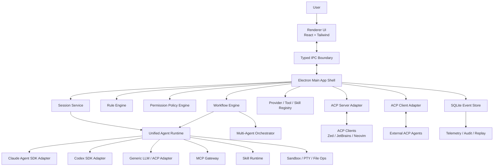

# Spark Agent Desktop Development Guide

版本: 0.1  
日期: 2026-05-26  
目标: 设计并逐步实现一个综合性的桌面端 agent 程序，融合 Claude Agent SDK 与 Codex SDK 的能力，支持 ACP、MCP、Skills、多层规则、工作流、可视化多 agent、团队协作与高性能本地执行。

---

## 1. 产品定位

Spark Agent 是一个本地优先的桌面端 AI Agent 工作台。它不是单一聊天窗口，而是一个可配置、可扩展、可审计的 agent 操作系统:

- 面向个人开发者: 像 Claude Desktop/Codex Desktop 一样完成代码、文档、研究、自动化任务。
- 面向团队: 提供共享规则、共享技能、协作任务、权限审批、运行记录和可复盘的执行链路。
- 面向高级用户: 支持 ACP 协议、MCP 服务、Skill 包、工作流编排、多 agent/subagent、沙箱、模型路由和自定义提供商。

核心原则:

- 本地优先: 项目文件、规则、会话、工作流、审计日志优先存在本地，可选择同步。
- 协议优先: 内部以 ACP 风格的 session/message/event/tool schema 为核心，外部通过 ACP/MCP 适配。
- SDK 双内核: Claude Agent SDK 和 Codex SDK 是默认强力执行内核，但业务层不直接绑定任一 SDK。
- 可观察、可回放、可治理: 每个 agent 动作都有事件、权限、上下文来源、成本和结果。
- 渐进扩展: 单机 MVP 先跑通，后续扩展团队、多机器、远程执行和插件生态。

---

## 2. 外部能力与约束

### 2.1 Claude Agent SDK

Claude Code SDK 已更名为 Claude Agent SDK。它提供 Python 和 TypeScript SDK，能复用 Claude Code 的工具、agent loop 和上下文管理能力。SDK 支持内置文件读取、命令执行、代码编辑、MCP 配置、权限控制、hooks、checkpoint、成本追踪和 OpenTelemetry。TypeScript SDK 包含平台相关 Claude Code binary，通常不需要单独安装 Claude Code CLI。

设计约束:

- Spark Agent 不应伪装为 Claude Desktop 或 Claude Code。
- 第三方产品默认应使用 Anthropic API key、Bedrock、Vertex、Azure 等官方支持鉴权方式，而不是向最终用户提供 claude.ai 登录或订阅额度代理。
- Claude Agent SDK 是强执行内核之一，但 Spark 的会话、权限、规则、事件与 UI 需要独立建模。

### 2.2 OpenAI Codex SDK

Codex SDK 的 TypeScript 包为 `@openai/codex-sdk`。它通过启动 `@openai/codex` CLI，并用 stdin/stdout JSONL 事件与 CLI 通信，提供 `Codex`、`Thread`、`run()`、`runStreamed()` 等接口。它适合接入代码任务、流式事件、工具调用、文件变更与 usage 信息。

设计约束:

- Codex SDK 的执行环境依赖本机 Codex CLI 能正常运行。
- 需要把 Codex 的 JSONL 事件转换成 Spark 内部统一事件。
- 需要提供 CLI 版本检查、路径选择、登录状态诊断和错误恢复。

### 2.3 ACP

本文中的 ACP 指 Agent Client Protocol。ACP 标准化编辑器客户端与 coding agent 之间的通信，常见实现基于 JSON-RPC 2.0 和双向 stdio，包含 session、prompt、streaming update、tool call、permission 等结构。

Spark 中 ACP 的定位:

- 内部核心协议: 用 ACP 风格 schema 表达 session、turn、message、tool call、permission request、file change、terminal output、agent status。
- 外部 ACP Server: 让 Zed、JetBrains、Neovim 等 ACP client 能连接 Spark Agent 的 agent。
- 外部 ACP Client: 让 Spark Desktop 能连接其他 ACP agent，例如 Claude Code ACP、Codex ACP、Gemini CLI ACP、OpenCode 等。

### 2.4 MCP

MCP 用于连接外部工具与数据源。Spark 需要支持 stdio、HTTP/SSE 或 Streamable HTTP 类型的 MCP 服务，支持系统级、用户级、项目级和会话级配置。

设计约束:

- MCP 工具必须经过权限策略与 allowlist/disallowlist。
- MCP server 的连接状态、工具 schema、错误必须可见。
- 大量 MCP 工具需要 tool search 或工具分组，避免上下文爆炸。

---

## 3. 推荐技术栈

### 3.1 桌面框架

推荐: Electron + TypeScript + React

原因:

- Claude Agent SDK 和 Codex SDK 都有 TypeScript 路径，Electron 主进程可直接集成 Node 包、CLI 子进程、文件系统、PTY、MCP stdio。
- 相比 Tauri，Electron 更适合快速构建 AI desktop 的 agent runtime、进程管理、插件系统和本地任务编排。
- 性能可通过进程隔离、worker、虚拟列表、事件分页、SQLite WAL 和懒加载解决。

后续可扩展:

- 对高风险执行可引入 Rust sidecar 或微虚拟机沙箱。
- 对重型索引可引入 Rust/Go sidecar。

### 3.2 前端

- React 19 或当前稳定版 React
- TypeScript
- Vite
- Tailwind CSS
- Radix UI / Ariakit 作为无障碍交互基础
- TanStack Query 处理异步状态
- Zustand 或 Jotai 处理局部 UI 状态
- React Flow 或 XYFlow 处理可视化 workflow/multi-agent 图
- Monaco Editor 处理规则、prompt、diff、配置编辑
- xterm.js 处理终端输出
- shiki 或 CodeMirror/Monaco 处理代码块渲染

为什么选 Tailwind CSS:

- 对 AI 辅助开发友好，局部样式可读、迭代快。
- 适合构建复杂工具型界面，配合 design tokens 和组件封装能保持一致。
- Less 更适合传统样式组织，但对快速生成和重构不如 Tailwind 直接。

### 3.3 后端与本地运行时

- Electron main process: 桌面能力、IPC、窗口、权限、进程编排。
- Node worker threads: 规则合成、日志压缩、索引、事件转换。
- Child process / PTY: Claude/Codex CLI、MCP stdio server、用户命令。
- SQLite + WAL: 本地元数据、事件日志、会话、配置、规则、审计。
- LanceDB 或 SQLite FTS5: 初期用于本地检索；后续可接入向量库。
- OpenTelemetry: trace、span、usage、tool call、错误链路。

### 3.4 包管理与工程

- pnpm workspace
- Turborepo 可选；MVP 阶段不强制
- Vitest 单元测试
- Playwright 端到端测试
- ESLint + Prettier
- electron-builder 或 Electron Forge 打包

---

## 4. 总体架构



核心分层:

- UI 层: 显示会话、任务、工作流、权限弹窗、文件 diff、终端、设置。
- App Shell 层: 管理窗口、IPC、安全边界、系统托盘、全局快捷键。
- Agent Runtime 层: 将不同 SDK/agent 统一成 Spark 内部事件模型。
- Protocol Gateway 层: ACP、MCP、Skill、工具调用的适配与治理。
- Workflow 层: 多 agent 图、任务队列、依赖、重试、人工审批。
- Persistence 层: 事件溯源、配置、规则、密钥引用、运行状态、审计。

---

## 5. 核心功能设计

### 5.1 工作台首页

首页不是营销页，而是实际工作入口。

功能:

- 最近会话、最近项目、正在运行任务、失败任务。
- 快速开始:
  - 新建聊天
  - 打开项目
  - 运行工作流
  - 连接 MCP
  - 创建 Skill
  - 启动团队任务
- Agent 状态栏:
  - Claude/Codex 可用性
  - API key/login 状态
  - MCP server 状态
  - 当前沙箱模式
  - 今日 token/成本

### 5.2 会话系统

会话类型:

- Chat Session: 通用聊天、研究、写作、问答。
- Project Session: 绑定一个或多个 workspace，支持文件读写、终端、diff。
- Workflow Session: 由工作流图驱动，可能包含多个 agent run。
- Team Session: 多人协作、共享任务、评论、审批。
- ACP Session: 来自外部 ACP client 的会话。

会话能力:

- 流式输出。
- 工具调用时间线。
- 文件修改 diff。
- 终端输出折叠。
- 权限请求与审批。
- 失败重试。
- 分支/回滚/checkpoint。
- 导出为 Markdown、JSONL、HTML。
- 会话内规则覆盖。

### 5.3 模型与 Provider 配置

模型配置目标:

- 用户可配置多个 provider。
- 每个 provider 可配置多个 model profile。
- 每个 agent/workflow/session 可指定模型策略。
- 支持自动路由、成本上限和 fallback。

Provider 类型:

- Claude Agent SDK
- Codex SDK
- OpenAI Responses/Agents API
- Anthropic Messages API
- OpenRouter 或兼容 OpenAI API 的 provider
- 本地模型服务，例如 Ollama、LM Studio、vLLM
- 外部 ACP agent

Model Profile 字段:

```ts
type ModelProfile = {
  id: string;
  providerId: string;
  displayName: string;
  model: string;
  role: "default" | "planner" | "coder" | "reviewer" | "fast" | "vision" | "long-context";
  maxInputTokens?: number;
  maxOutputTokens?: number;
  temperature?: number;
  reasoningEffort?: "none" | "minimal" | "low" | "medium" | "high";
  costLimitUsdPerRun?: number;
  timeoutMs?: number;
  fallbackProfileIds: string[];
  enabled: boolean;
};
```

路由策略:

- Manual: 用户手动选择。
- Role-based: planner/reviewer/coder 使用不同 profile。
- Cost-aware: 超出成本阈值后切换低成本模型。
- Latency-aware: 交互式任务优先低延迟模型。
- Capability-aware: 需要代码编辑、沙箱、MCP、长上下文时选择匹配 provider。

### 5.4 ACP 核心协议层

Spark 内部定义 `Spark Agent Protocol`，保持与 ACP 概念兼容，但加入桌面产品需要的扩展字段。

核心对象:

```ts
type AgentSession = {
  id: string;
  kind: "chat" | "project" | "workflow" | "team" | "acp";
  workspaceIds: string[];
  createdBy: string;
  activeAgentIds: string[];
  ruleBundleId: string;
  permissionProfileId: string;
  status: "idle" | "running" | "waiting_approval" | "failed" | "completed" | "cancelled";
};

type AgentEvent =
  | UserMessageEvent
  | AssistantMessageEvent
  | ToolCallEvent
  | ToolResultEvent
  | PermissionRequestEvent
  | PermissionDecisionEvent
  | FileChangeEvent
  | TerminalOutputEvent
  | AgentStatusEvent
  | UsageEvent
  | ErrorEvent;
```

适配方向:

- Claude Adapter: Claude Agent SDK message -> AgentEvent。
- Codex Adapter: Codex JSONL event -> AgentEvent。
- MCP Gateway: MCP tool call/result -> AgentEvent。
- ACP Server: AgentEvent -> ACP JSON-RPC notification/response。
- UI: AgentEvent -> timeline/diff/terminal/approval components。

### 5.5 Claude Agent SDK 适配器

职责:

- 创建 Claude query。
- 注入规则合成后的 system prompt / append prompt。
- 注入 workspace、allowed tools、disallowed tools、MCP servers。
- 监听 message stream 并转换事件。
- 处理 tool permission、hooks、checkpoint、usage。
- 处理 SDK 错误并映射为用户可理解诊断。

接口:

```ts
interface AgentProviderAdapter {
  id: string;
  capabilities: AgentCapabilities;
  healthCheck(): Promise<ProviderHealth>;
  startSession(input: StartAgentSessionInput): Promise<ProviderSession>;
  sendTurn(input: SendTurnInput): AsyncIterable<AgentEvent>;
  cancel(sessionId: string): Promise<void>;
  resume(sessionId: string): Promise<ProviderSession>;
}
```

Claude Adapter 特殊能力:

- 内置工具权限映射: Read/Edit/Bash/Glob/Grep/MCP。
- `settingSources` 控制项目 `.mcp.json` 和 settings 读取。
- hooks 对接 Spark permission policy。
- checkpoint 对接 Spark session checkpoint UI。

### 5.6 Codex SDK 适配器

职责:

- 检查 `@openai/codex` CLI 可用性。
- 通过 `@openai/codex-sdk` 创建 Codex thread。
- 将 `runStreamed()` 的 structured events 转换为 AgentEvent。
- 处理 Codex item、turn.completed、usage、file change、permission。
- 提供 thread 继续对话、resume、取消。

Codex Adapter 特殊能力:

- 支持长任务队列。
- 支持以代码项目为中心的多 agent 执行。
- 支持将 Codex 的计划、diff、命令输出以 Codex Desktop 类似体验展示。

### 5.7 Skill 系统

Skill 是一个可安装、可版本化、可共享的能力包，包含说明、资源、脚本和可选 UI/schema。

目录结构:

```text
skills/
  <skill-id>/
    SKILL.md
    skill.json
    scripts/
    templates/
    assets/
    tests/
```

`skill.json`:

```json
{
  "id": "spark.code-review",
  "name": "Code Review",
  "version": "0.1.0",
  "description": "Review code changes with severity-ranked findings.",
  "triggers": ["code review", "review PR"],
  "permissions": {
    "filesystem": "read",
    "network": "optional",
    "shell": "deny"
  },
  "inputs": {
    "repositoryPath": "string",
    "diffRef": "string"
  }
}
```

Skill 功能:

- 系统级 Skill: 随应用内置。
- 用户级 Skill: 用户安装，所有项目可用。
- 项目级 Skill: 项目仓库内提供。
- 团队级 Skill: 团队共享并受管理员治理。
- Skill Store: 本地索引、远程市场、私有 registry。
- Skill Vetting: 安装前检查脚本、网络、权限、依赖、来源。

运行方式:

- Prompt Skill: 只注入说明。
- Script Skill: 允许执行脚本。
- MCP Skill: 启动或配置 MCP server。
- Workflow Skill: 提供可视化节点模板。

### 5.8 MCP 管理

MCP 配置作用域:

- System: 应用内置，例如 filesystem、git、browser。
- User: 用户全局，例如 GitHub、Notion、Slack。
- Project: 项目 `.spark/mcp.json`。
- Conversation: 当前会话临时启用。
- Team: 团队管理员发布。

MCP 管理 UI:

- Server 列表与状态。
- 工具列表、schema、示例。
- 连接日志。
- secret 绑定。
- allowlist/disallowlist。
- 一键诊断。
- 按 agent/session/workflow 绑定。

连接生命周期:

1. 读取多层配置。
2. 合成有效 MCP 配置。
3. 启动或连接 server。
4. 拉取 tools/resources/prompts。
5. 根据权限策略裁剪工具。
6. 将工具暴露给 provider adapter。
7. 记录调用与结果。
8. 会话结束后释放会话级 server。

### 5.9 多层规则系统

规则层级:

1. System Rules: 应用内置，不可被普通用户删除。
2. Organization/Team Rules: 团队管理员配置。
3. User Rules: 用户全局偏好。
4. Project Rules: 项目 `.spark/rules/*.md`、`AGENTS.md`、`CLAUDE.md` 等。
5. Conversation Rules: 当前会话临时规则。
6. Workflow/Agent Rules: 某个 workflow 节点或 subagent 的专用规则。

优先级:

```text
System > Team > User > Project > Workflow > Agent > Conversation message
```

规则不是简单拼接。需要 Rule Engine 做结构化合成:

- identity: 角色、语气、目标。
- safety: 禁止行为、敏感路径、命令策略。
- workspace: 项目上下文、构建命令、测试命令。
- tools: 可用工具、禁用工具、审批策略。
- style: 代码风格、文档风格、语言偏好。
- workflow: 分工、交付格式、完成标准。

冲突策略:

- 更高层的 deny 覆盖低层 allow。
- 更高层的必需项不能被低层删除。
- 低层可以增加细节，但不能削弱安全规则。
- 规则合成输出要可预览，并显示来源。

规则文件建议:

```text
.spark/
  rules/
    project.md
    coding-style.md
    testing.md
  workflows/
  skills/
  mcp.json
  permissions.json
AGENTS.md
CLAUDE.md
```

### 5.10 权限与安全

权限对象:

- 文件读。
- 文件写。
- 命令执行。
- 网络访问。
- MCP 工具调用。
- Git 操作。
- 外部应用控制。
- secret 读取。
- 长任务后台执行。

审批模式:

- Ask every time。
- Allow for session。
- Allow for project。
- Deny。
- Dry-run only。
- Team approval required。

安全策略:

- 高风险命令默认审批，例如 `rm -rf`、`git push --force`、`curl | sh`、密钥导出。
- secret 只通过 secret reference 注入，不进入 prompt 明文。
- 项目外文件访问默认需要审批。
- MCP server 默认最小权限。
- Team 模式下管理员可强制策略。
- 所有工具调用写入审计日志。

沙箱分级:

- Level 0: Chat only，无工具。
- Level 1: Read-only workspace。
- Level 2: Workspace write，命令需审批。
- Level 3: Full project automation，危险命令审批。
- Level 4: Isolated sandbox/microVM。

### 5.11 工作流系统

工作流是可视化 agent 编排图。

节点类型:

- Prompt Node: 调用模型生成文本。
- Agent Node: 调用 Claude/Codex/外部 ACP agent。
- Tool Node: 调用 MCP 或内置工具。
- Script Node: 执行本地脚本。
- Human Approval Node: 等待用户/团队审批。
- Branch Node: 条件分支。
- Parallel Node: 并发执行。
- Merge Node: 合并结果。
- Review Node: 质量检查。
- Artifact Node: 输出文件、PR、报告、PPT、表格。

工作流能力:

- 拖拽编辑。
- 节点级模型/规则/权限配置。
- 输入输出 schema。
- 运行前校验。
- 单节点重跑。
- 从失败节点恢复。
- 模板库。
- 版本管理。

示例工作流: 代码功能开发


### 5.12 可视化多 Agent 与 Subagent

Agent 类型:

- Primary Agent: 当前会话主 agent。
- Subagent: 由主 agent 或 workflow 派生的任务 agent。
- Specialist Agent: 固定角色，例如 planner、coder、reviewer、tester、researcher、security。
- External ACP Agent: 外部 agent。
- Human Agent: 团队成员或审批者。

多 agent 编排策略:

- Sequential: 顺序执行。
- Parallel: 并行执行并合并。
- Debate: 多 agent 给出方案，judge agent 选择。
- Map-reduce: 大任务拆分后汇总。
- Supervisor: 主控 agent 分派和验收。
- Swarm: 多 agent 共享任务池，后期再做。

可视化要求:

- 图中展示 agent、状态、当前工具、token、耗时。
- 点击 agent 可看上下文、规则、工具、输出。
- 显示 agent 之间的消息和产物传递。
- 支持暂停、取消、重跑、接管。

### 5.13 团队模式

团队模式目标:

- 多用户共享项目工作台。
- 团队级规则、MCP、Skill、模型配置。
- 任务分派、审批、评论、审计。
- 企业治理与可控扩展。

MVP 后实现。团队模式需要一个可选 Spark Server。

单机版:

- Local user profile。
- 本地团队模拟空间。
- 共享规则通过 Git repo。

团队版:

- Spark Server: auth、workspace registry、team policy、event sync。
- PostgreSQL: 团队元数据。
- Object storage: artifact、日志归档。
- WebSocket: 任务事件同步。
- RBAC: owner/admin/member/viewer。
- SSO: 后续支持 OIDC。

团队功能:

- 共享 agent 模板。
- 共享 Skill registry。
- 共享 MCP profiles。
- 项目规则审批。
- 高风险工具调用双人审批。
- Agent run 评论和指派。
- Run replay 与审计导出。

### 5.14 项目与上下文管理

Workspace 功能:

- 多项目打开。
- 文件树。
- Git 状态。
- 代码搜索。
- 终端。
- 任务检测: package scripts、Makefile、pytest、cargo、go test 等。
- 项目索引。
- 上下文包构建。

上下文策略:

- 用户显式选择文件优先。
- 根据任务自动检索相关文件。
- 控制上下文预算。
- 记录每次上下文来源。
- 大项目使用增量索引和摘要缓存。

### 5.15 Artifacts 与文件变更

Artifact 类型:

- 文本/Markdown。
- 代码 patch。
- 图片。
- HTML preview。
- 报告。
- 表格。
- 工作流运行结果。

文件变更:

- 所有编辑先进入 pending patch。
- UI 展示 diff。
- 用户可接受/拒绝单个文件或 hunk。
- 支持 checkpoint 回滚。
- 支持 Git commit 辅助。

### 5.16 可观察性

每个 run 记录:

- 输入 prompt。
- 合成规则摘要。
- 模型 profile。
- 工具清单。
- 工具调用。
- 文件变更。
- 权限决策。
- token/成本。
- 耗时。
- 错误与重试。

UI:

- Timeline。
- Trace tree。
- Usage dashboard。
- MCP diagnostics。
- Provider health。
- Run replay。

---

## 6. 数据设计

### 6.1 SQLite 表

初期使用 SQLite，启用 WAL。

核心表:

```sql
CREATE TABLE workspaces (
  id TEXT PRIMARY KEY,
  name TEXT NOT NULL,
  root_path TEXT NOT NULL,
  created_at TEXT NOT NULL,
  updated_at TEXT NOT NULL
);

CREATE TABLE sessions (
  id TEXT PRIMARY KEY,
  kind TEXT NOT NULL,
  title TEXT NOT NULL,
  status TEXT NOT NULL,
  workspace_ids_json TEXT NOT NULL,
  rule_bundle_id TEXT,
  permission_profile_id TEXT,
  created_at TEXT NOT NULL,
  updated_at TEXT NOT NULL
);

CREATE TABLE agent_events (
  id TEXT PRIMARY KEY,
  session_id TEXT NOT NULL,
  run_id TEXT,
  turn_id TEXT,
  event_type TEXT NOT NULL,
  event_json TEXT NOT NULL,
  created_at TEXT NOT NULL
);

CREATE INDEX idx_agent_events_session_created
  ON agent_events(session_id, created_at);

CREATE TABLE provider_profiles (
  id TEXT PRIMARY KEY,
  provider_type TEXT NOT NULL,
  name TEXT NOT NULL,
  config_json TEXT NOT NULL,
  enabled INTEGER NOT NULL,
  created_at TEXT NOT NULL,
  updated_at TEXT NOT NULL
);

CREATE TABLE model_profiles (
  id TEXT PRIMARY KEY,
  provider_id TEXT NOT NULL,
  name TEXT NOT NULL,
  config_json TEXT NOT NULL,
  enabled INTEGER NOT NULL,
  created_at TEXT NOT NULL,
  updated_at TEXT NOT NULL
);

CREATE TABLE rules (
  id TEXT PRIMARY KEY,
  scope TEXT NOT NULL,
  scope_ref TEXT,
  name TEXT NOT NULL,
  content TEXT NOT NULL,
  priority INTEGER NOT NULL,
  enabled INTEGER NOT NULL,
  created_at TEXT NOT NULL,
  updated_at TEXT NOT NULL
);

CREATE TABLE mcp_servers (
  id TEXT PRIMARY KEY,
  scope TEXT NOT NULL,
  name TEXT NOT NULL,
  config_json TEXT NOT NULL,
  enabled INTEGER NOT NULL,
  created_at TEXT NOT NULL,
  updated_at TEXT NOT NULL
);

CREATE TABLE skills (
  id TEXT PRIMARY KEY,
  scope TEXT NOT NULL,
  name TEXT NOT NULL,
  version TEXT NOT NULL,
  root_path TEXT NOT NULL,
  manifest_json TEXT NOT NULL,
  enabled INTEGER NOT NULL,
  created_at TEXT NOT NULL,
  updated_at TEXT NOT NULL
);

CREATE TABLE workflows (
  id TEXT PRIMARY KEY,
  scope TEXT NOT NULL,
  name TEXT NOT NULL,
  version TEXT NOT NULL,
  graph_json TEXT NOT NULL,
  created_at TEXT NOT NULL,
  updated_at TEXT NOT NULL
);
```

### 6.2 事件存储

事件必须 append-only。UI 通过事件重建会话状态，必要时保存 snapshot。

事件设计原则:

- 原始 provider event 保留在 `raw` 字段。
- 统一字段用于 UI 和工作流。
- 大字段，例如终端输出和 artifact，可外置到 artifact store。
- 所有 permission decision 都是不可变审计记录。

---

## 7. 模块与目录结构

推荐初始目录:

```text
Spark-Agent/
  apps/
    desktop/
      src/
        main/
          app.ts
          ipc/
          windows/
          security/
        renderer/
          app/
          components/
          features/
          routes/
          styles/
        preload/
  packages/
    agent-runtime/
      src/
        adapters/
          claude/
          codex/
          acp/
        events/
        sessions/
        providers/
    protocol/
      src/
        spark-agent-protocol.ts
        acp-mapping.ts
        mcp-mapping.ts
    rule-engine/
      src/
    permission-engine/
      src/
    mcp-gateway/
      src/
    skill-runtime/
      src/
    workflow-engine/
      src/
    storage/
      src/
        migrations/
        repositories/
    ui-kit/
      src/
    shared/
      src/
  docs/
    desktop-agent-development-guide.md
    adr/
  scripts/
  tests/
    e2e/
```

模块职责:

- `protocol`: 所有跨模块类型、事件 schema、ACP/MCP 映射。
- `agent-runtime`: 统一 agent provider 生命周期与事件流。
- `rule-engine`: 多层规则读取、合成、冲突检测、预览。
- `permission-engine`: 权限策略、审批、风险检测。
- `mcp-gateway`: MCP server 生命周期、工具发现、调用代理。
- `skill-runtime`: Skill 安装、校验、加载、触发、执行。
- `workflow-engine`: DAG 执行、节点调度、状态机。
- `storage`: SQLite schema、repository、migration。
- `ui-kit`: 桌面工具型组件。
- `desktop`: Electron app 与 UI。

---

## 8. IPC 设计

Renderer 不直接访问 Node API。所有能力通过 typed IPC。

IPC 类别:

- `session.create`
- `session.sendTurn`
- `session.cancel`
- `session.listEvents`
- `workspace.open`
- `provider.list`
- `provider.healthCheck`
- `modelProfile.save`
- `rules.previewBundle`
- `mcp.startServer`
- `mcp.listTools`
- `skill.install`
- `workflow.run`
- `permission.decide`

事件订阅:

- `session.events.subscribe(sessionId)`
- `workflow.events.subscribe(runId)`
- `provider.health.subscribe()`
- `mcp.status.subscribe()`

安全要求:

- IPC 输入全部 zod 校验。
- Renderer 只能传 session/workspace id，不能传任意 shell command 给底层执行。
- 文件路径必须经过 workspace boundary 检查。

---

## 9. UI 信息架构

左侧主导航:

- Home
- Chat
- Projects
- Workflows
- Agents
- Skills
- MCP
- Team
- Settings

Project 页面:

- 文件树
- 会话列表
- 当前 agent 时间线
- Diff panel
- Terminal panel
- Context panel
- Rule panel

Workflow 页面:

- 图编辑器
- 节点配置抽屉
- 运行时间线
- 输入输出 artifact
- 运行历史

Settings 页面:

- Models
- Providers
- Rules
- Permissions
- MCP
- Skills
- Team
- Telemetry
- Updates

设计风格:

- 工具型、紧凑、专业。
- 支持 Command Palette。
- 支持多面板布局。
- 支持键盘快捷键。
- 支持浅色/深色主题。
- 重要审批弹窗必须清晰展示风险、来源、命令、路径和影响。

---

## 10. 开发路线图

### Phase 0: 项目基础

目标: 建立可运行的桌面应用骨架。

任务:

- 初始化 pnpm workspace。
- 创建 Electron + Vite + React + TypeScript。
- 接入 Tailwind CSS。
- 建立 packages 目录。
- 配置 ESLint、Prettier、Vitest、Playwright。
- 建立 SQLite storage 基础。
- 建立 typed IPC 基础。
- 建立基础窗口、Home、Settings。

验收:

- `pnpm dev` 可启动桌面应用。
- 首页与设置页可打开。
- SQLite 数据库可初始化。
- IPC ping/pong 测试通过。

### Phase 1: 单会话 MVP

目标: 能创建会话并调用 Claude/Codex 之一完成流式响应。

任务:

- 实现 `protocol` 的 AgentEvent。
- 实现 `agent-runtime` 基础接口。
- 实现 Claude Adapter。
- 实现 Codex Adapter 的 health check 与基础 run。
- 实现 session event store。
- UI 展示消息流、工具事件、错误、usage。
- Settings 配置 provider/model。

验收:

- 用户可创建 chat session。
- 用户可选择 Claude 或 Codex profile。
- Agent 可流式输出。
- 事件写入 SQLite。
- provider 不可用时显示可诊断错误。

### Phase 2: 项目工作区与权限

目标: 支持打开项目、读取文件、执行受控工具、展示 diff。

任务:

- Workspace 管理。
- 文件边界检查。
- 权限策略引擎。
- 审批弹窗。
- 文件 diff UI。
- 命令输出 UI。
- checkpoint 元数据。

验收:

- Agent 访问项目外文件会触发审批或拒绝。
- Bash/命令工具调用可审批。
- 文件变更可查看 diff。
- 可取消运行。

### Phase 3: 规则、MCP、Skill

目标: 支持可扩展上下文与工具生态。

任务:

- Rule Engine 多层规则合成。
- 规则预览 UI。
- MCP Gateway。
- MCP server 管理 UI。
- Skill manifest 解析。
- Skill 安装与触发。
- Skill 安全检查。

验收:

- 系统/用户/项目/会话规则可合成并显示来源。
- MCP server 可启动、查看工具、调用。
- Skill 可安装、启用、禁用。
- 高风险 Skill 脚本有明确警告。

### Phase 4: 工作流与多 Agent

目标: 可视化编排多个 agent。

任务:

- Workflow graph schema。
- React Flow 图编辑器。
- Workflow engine DAG 执行。
- Agent node、Tool node、Approval node。
- Parallel 与 Merge。
- Multi-agent timeline。
- 节点级模型/规则/权限。

验收:

- 用户可创建并运行代码开发工作流。
- 多 agent 状态可视化。
- 失败节点可重跑。
- 人工审批节点可暂停和继续。

### Phase 5: 团队模式基础

目标: 为多人协作与治理打基础。

任务:

- Local team workspace。
- Team policy。
- Team shared skills/rules/mcp profiles。
- Run comments。
- Approval assignment。
- Spark Server 原型。
- WebSocket event sync。

验收:

- 团队空间可共享规则与 Skill。
- 高风险任务可指派审批。
- 运行记录可评论。
- Server 原型可同步 run events。

### Phase 6: 发布与生态

目标: 构建可分发产品。

任务:

- 自动更新。
- 崩溃收集。
- 日志导出。
- 安装包签名。
- 插件/Skill registry。
- ACP Server 对外暴露。
- ACP Client 连接外部 agent。
- 文档站。

验收:

- macOS/Windows/Linux 至少两个平台可打包。
- 用户可导出诊断包。
- 外部 ACP client 可连接 Spark agent。
- Spark 可连接外部 ACP agent。

---

## 11. 开发顺序建议

建议先做 Claude Adapter 和 Codex Adapter 的最薄可用版本，而不是先做完整 UI。原因是这个项目的核心风险在 SDK 适配和事件归一。

推荐前 10 个开发切片:

1. 初始化 workspace 与 Electron app。
2. 定义 `AgentEvent` 和 `AgentProviderAdapter`。
3. 实现 SQLite event store。
4. 实现 provider health check。
5. 实现 Claude Adapter stream demo。
6. 实现 Codex Adapter stream demo。
7. 实现 SessionService 把事件写入 store。
8. 实现 Renderer timeline。
9. 实现 Settings 里的 provider/model profile。
10. 实现 Rule Engine 的最小合成。

每个切片都要有:

- 单元测试。
- 最小 UI 或 CLI 验证。
- 错误路径测试。
- 一次小提交。

---

## 12. 测试策略

### 12.1 单元测试

覆盖:

- 事件转换。
- 规则合成。
- 权限判断。
- MCP config merge。
- Skill manifest 校验。
- Workflow DAG 校验。

### 12.2 集成测试

覆盖:

- Claude Adapter mock stream。
- Codex Adapter mock JSONL stream。
- SQLite event persistence。
- MCP stdio server 生命周期。
- IPC schema validation。

### 12.3 E2E 测试

覆盖:

- 创建会话。
- 配置 provider。
- 发送 prompt。
- 查看流式输出。
- 审批工具调用。
- 运行 workflow。

### 12.4 视觉与性能测试

覆盖:

- 5000 条事件的 timeline 虚拟滚动。
- 大 diff 渲染。
- 长终端输出。
- workflow 图 100 节点。
- app 启动时间。

目标:

- 冷启动小于 3 秒。
- 打开最近会话小于 500ms。
- 事件流 UI 延迟小于 100ms。
- 1 万条事件不阻塞主线程。

---

## 13. 性能设计

关键策略:

- Provider stream 事件先写入 append-only queue，再批量 flush 到 SQLite。
- Renderer 使用虚拟列表显示 timeline。
- 大文本 artifact 分块存储。
- Terminal 输出按 chunk 合并。
- Rule bundle 缓存，只有规则源变化才重算。
- MCP tool schema 缓存。
- Workflow 节点并发有上限。
- Agent run 使用 backpressure，避免 UI 被事件淹没。
- 主进程不做重 CPU 工作，交给 worker。

事件吞吐建议:

- Main process event bus 内部使用 async iterator + bounded queue。
- UI 每 50-100ms 批量接收事件。
- SQLite 每 100-500ms 批量事务写入。

---

## 14. 错误处理与恢复

错误分类:

- ProviderUnavailable。
- AuthMissing。
- ModelUnavailable。
- MCPConnectionFailed。
- PermissionDenied。
- SandboxViolation。
- ToolExecutionFailed。
- WorkflowNodeFailed。
- StorageError。
- RendererCrashed。

恢复策略:

- Provider 不可用: 显示诊断和修复动作。
- MCP 连接失败: 不阻塞会话，但标记工具不可用。
- 工具失败: 可重试、跳过、改由人工处理。
- Workflow 节点失败: 停在失败节点，允许修改配置后重跑。
- 应用崩溃: 启动后从 event store 恢复 session 状态。
- 长任务中断: 如果 provider 支持 resume，则恢复；否则保留已完成事件并提示重新运行。

---

## 15. 配置文件设计

用户级:

```text
~/Library/Application Support/Spark Agent/
  config.json
  spark.db
  logs/
  skills/
  mcp/
  secrets/
```

项目级:

```text
<project>/
  .spark/
    project.json
    rules/
    workflows/
    skills/
    mcp.json
    permissions.json
```

示例 `.spark/project.json`:

```json
{
  "schemaVersion": 1,
  "name": "Example Project",
  "defaultModelProfileId": "codex-default",
  "permissionProfileId": "project-standard",
  "enabledSkills": ["spark.code-review", "spark.test-runner"],
  "enabledWorkflows": ["feature-development"]
}
```

---

## 16. 发布方案

### 16.1 本地开发

命令:

```bash
pnpm install
pnpm dev
pnpm test
pnpm lint
pnpm e2e
```

### 16.2 打包

使用 electron-builder:

- macOS: dmg + zip，签名与 notarization。
- Windows: nsis，签名。
- Linux: AppImage/deb。

### 16.3 更新

- MVP 可手动下载。
- Phase 6 接入自动更新。
- 企业版支持固定版本和禁用自动更新。

### 16.4 诊断包

诊断包包含:

- app version。
- OS 信息。
- provider health。
- MCP 状态。
- 最近错误日志。
- 脱敏后的 run trace。
- 不包含 API key、secret、完整用户代码。

---

## 17. 风险与对策

| 风险 | 影响 | 对策 |
| --- | --- | --- |
| SDK 事件格式变化 | Adapter 失效 | Adapter 层隔离，契约测试，版本检测 |
| Codex CLI 未安装或登录失败 | Codex 不可用 | health check、安装指引、fallback provider |
| MCP 工具过多 | 上下文膨胀 | 工具分组、tool search、按需启用 |
| 多层规则冲突 | 行为不可预测 | 规则预览、冲突检测、高层 deny 优先 |
| Agent 执行危险命令 | 数据损坏 | 权限引擎、沙箱、审批、审计 |
| UI 被事件流卡死 | 体验差 | 事件批处理、虚拟列表、worker |
| Team 模式过早复杂化 | 延迟 MVP | 先本地单机，团队能力 Phase 5 |
| 插件/Skill 安全 | 供应链风险 | vetting、签名、权限声明、隔离执行 |

---

## 18. MVP 范围边界

MVP 必须包含:

- Electron 桌面 app。
- Provider/model 配置。
- Claude 或 Codex 至少一个完整可用，另一个有 health check 与基础 demo。
- 会话、流式事件、SQLite event store。
- 项目 workspace。
- 最小规则系统。
- 最小权限审批。
- MCP 配置读取与一个 stdio MCP server demo。

MVP 不包含:

- 真正多人团队 server。
- 完整 Skill 市场。
- 完整 ACP 外部 server/client。
- 微虚拟机沙箱。
- 自动更新。
- 插件签名体系。

这些放到 Phase 4-6。

---

## 19. 第一周执行计划

Day 1:

- 初始化 pnpm workspace。
- 创建 Electron + Vite + React。
- 接入 Tailwind。
- 建立 `packages/protocol`。
- 定义 AgentEvent 类型。

Day 2:

- 建立 SQLite storage。
- 实现 migrations。
- 实现 sessions/events repository。
- 写单元测试。

Day 3:

- 建立 typed IPC。
- 实现 session create/list/sendTurn skeleton。
- Renderer 做 Home、Session 页面骨架。

Day 4:

- 实现 Claude Adapter mock。
- 实现 Codex Adapter mock。
- 用 mock stream 跑通 timeline。

Day 5:

- 接入真实 Claude Agent SDK。
- 做 provider health check。
- 处理 auth missing/provider unavailable。

Day 6:

- 接入真实 Codex SDK。
- 检查 CLI 可用性。
- 转换 Codex stream event。

Day 7:

- 完成 settings UI。
- 写 Playwright smoke test。
- 写项目 README 和开发命令。

---

## 20. 推荐 ADR

需要在 `docs/adr/` 中记录:

- ADR-001: 选择 Electron 而非 Tauri。
- ADR-002: 使用 Tailwind CSS 作为主要样式方案。
- ADR-003: 使用 ACP 风格事件作为内部协议核心。
- ADR-004: SDK adapter 隔离 Claude/Codex 差异。
- ADR-005: SQLite append-only event store。
- ADR-006: 多层规则合成策略。
- ADR-007: 权限引擎与沙箱分级。

---

## 21. 参考资料

- Claude Agent SDK overview: https://code.claude.com/docs/en/agent-sdk/overview
- Claude Agent SDK MCP: https://code.claude.com/docs/en/agent-sdk/mcp
- Codex SDK TypeScript README: https://github.com/openai/codex/blob/main/sdk/typescript/README.md
- Agent Client Protocol: https://zed.dev/acp
- Agent Client Protocol repository: https://github.com/zed-industries/agent-client-protocol

---

## 22. 下一步

建议下一步不是继续扩大需求，而是创建 Phase 0 的实施计划和项目骨架。Phase 0 完成后，再把 Claude/Codex adapter 作为最高风险点优先验证。

