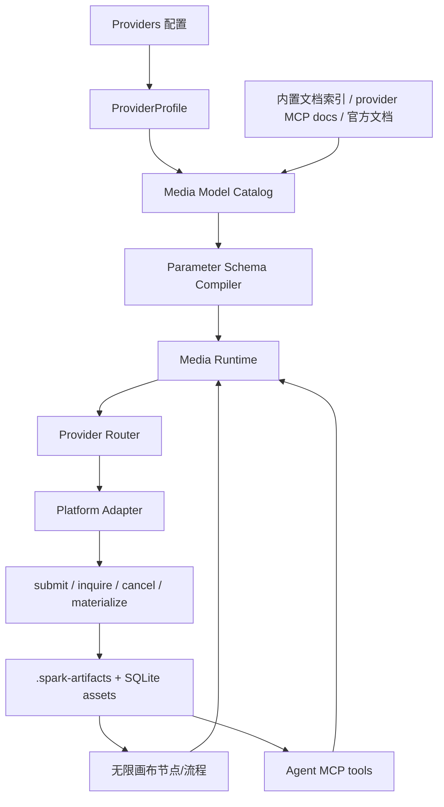

# 多媒体模型运行时与无限画布生产工作台方案

> 日期：2026-06-14  
> 状态：Phase 1 基础设施开发中  
> 范围：文生图、图生图、图片编辑、多图合成、文生视频、图生视频、视频编辑、语音相关能力，以及无限画布中的流程编排式内容生产。

## 0. 当前落地进度

已完成第一批基础设施：

- 新增 `MediaModelManifest` 协议、zod schema、`ProviderMediaModelRef`。
- 新增内置 manifest seeds，覆盖 APIMart、xAI、OpenAI Images、Google/Veo、Volcengine Seedance，以及 Kling、PixVerse、Wan、HappyHorse、Omni、MiniMax-Hailuo 的首版占位能力清单。
- 新增 SQLite migration `028_media_model_manifests.sql` 和 `MediaModelManifestRepository`。
- 新增 `MediaModelCatalogService`，支持 seed/list/describe/link provider models。
- Provider 配置、导入导出和运行时 `config_json` 已支持 `mediaModelRefs`。
- `spark_media` MCP 新增 `list_models`、`describe_model`，SessionService 会把 provider 的 manifest refs 注入 `SPARK_MEDIA_MANIFESTS_JSON`。
- `MediaRouterService` 的能力判断已能读取 manifest capabilities，但 HTTP 调用仍保持旧 adapter 逻辑，避免兼容性风险。
- 新增 `media_generation_tasks` 落库和 `MediaTaskRuntimeService.submit / submitBackground / inquire / cancel / materialize` 生命周期。
- 无限画布媒体任务默认后台提交：`canvas:task:create-media` 可传 `waitForCompletion:false` 立即返回 running task，完成/失败后通过 `stream:canvas:media-task` 单次推送写回画布。
- 画布参数面板已能读取 manifest `paramSchema`，把用户参数作为 `modelParams` 随任务提交，并在 Inspector 中展示实际调用参数。
- 画布 AI 操作已支持组合节点输入展开：选中 group 发起图片编辑、多图合成、图生视频等任务时，会自动把组内图片/音频/视频作为 `inputFiles`，把组内文本/Prompt 合并进 prompt，并把实际成员节点写入任务输入血缘。
- Inline AI Composer 已补充常用模型参数预设与本地缓存：图片尺寸、比例、分辨率、质量、数量，视频比例/时长/质量，音频 voice/format/speed 等可从下拉项选择；创建任务后会按 operation + model 记住 `modelParams`、自定义参数和输入传输方式。
- 新增 manifest-driven `TemplateMediaAdapter`：当 provider 绑定了匹配 capability 的 `MediaModelManifest` 时，`MediaRouterService` 会优先按 `requestTemplate` 组装 JSON 请求、按 `response`/`polling` 提取 task id 和产物，并把画布选择的 `modelId` 作为 effective model 真正传给 provider。
- `spark_media` MCP 的生成/编辑/转写工具已支持可选 `model`，可以按 manifest id 或 provider model id 选择模型；MCP 内部复用 manifest 的 defaults、aliases、requestTemplate、response/resultPaths 和 polling 配置，把 agent 对话入口也接到同一套数据化调用路径。
- 新增 MCP manifest executor 回归测试，覆盖 manifest 模板渲染、参数别名/defaults 合并、provider 请求体组装、远程 URL 产物下载落盘。
- 无限画布节点已能展示输入/输出 lineage 计数，Inspector 可查看所选节点的上游/下游节点、边类型和关联任务；节点卡片提供基于当前节点继续创建 AI 任务的快捷入口，为后续流程编排/节点级 agent 调用打基础。
- 无限画布手动连线已持久化：素材/Prompt 连到任务节点会同步为 `used_as_input` 并写入任务输入，任务节点连到产物节点会同步为 `generated` 并写入任务输出，其它连线保存为 `references`，打开项目后血缘关系仍可恢复。
- 无限画布项目已支持导入/导出 `.spark-canvas.json`：导出包包含项目快照、节点、素材、任务和血缘；图片类本地素材会内联为 data URL，导入时重新生成项目/节点/素材/任务 ID 并作为新项目落库，避免覆盖现有项目。

尚未完成：

- multipart/binary/file-job/回调式 manifest invocation 的通用化。
- 无限画布 UI/UX 重构、流程编排节点和重跑/分支比较等生产工作台能力。

## 1. 目标

应用内要形成一套统一的“多媒体模型能力基础设施”：

1. 用户在 Provider 中配置模型后，Agent 对话和无限画布都能立即使用。
2. Agent 通过内置 MCP 工具调用能力，不接触 API key。
3. 无限画布每个 AI 节点都可视为一次受控 agent/model 调用，节点输入、参数、任务状态、产物和血缘关系可追踪。
4. 支持多供应商、多接口形态、多参数 schema、多返回产物形态，不因为平台参数变动就频繁改业务代码。
5. 先覆盖 APIMart、xAI、OpenAI、Gemini/Veo、Seedance 母平台，以及 PixVerse、Omni、Kling、HappyHorse、Wan、MiniMax-Hailuo 等模型系列；后续扩展 PPT、网页、DOCX、Excel 等内容生产节点。

## 2. 当前基础与主要问题

仓库已有基础：

- `packages/protocol/src/media-config.ts` 已定义 `MediaCapabilityId`、`MediaProviderKind`、`CanvasOperationType`、operation 到 capability 的映射。
- `packages/agent-runtime/src/services/media/` 已有 `MediaRouterService`、`MediaProviderAdapter`、APIMart/xAI adapter、OpenAI-compatible 基类、产物落盘服务。
- `packages/agent-runtime/src/tools/media-generation-mcp-server.mjs` 已有 `spark_media` MCP 原型。
- `apps/desktop/src/main/ipc/index.ts` 已有 `canvas:media-capabilities:list`、`canvas:task:create-media`。
- 无限画布已有 task/node/asset/edge 类型、SQLite snapshot、`createMediaTask` 写回产物。

主要问题：

1. 能力元数据偏硬编码：`MediaProviderKind`、adapter capabilities、参数处理都固定在代码里，模型差异无法数据化。
2. `modelParams: Record<string, unknown>` 无 schema，画布 UI 无法知道模型支持的尺寸、比例、时长、分辨率、voice、是否多图等。
3. 当前 adapter 多为“一次 invoke + 内部轮询”，不适合 5-20 分钟的视频任务，也不利于取消、恢复、重试。
4. `spark_image` 和 `spark_media` 仍有逻辑分叉，旧图片工具的 provider 解析、参数转换、结果提取没有完全复用统一 runtime。
5. 无限画布已有真实调用入口，但还不是流程编排工作台：缺节点级 schema、能力推荐、任务队列、重跑、分支比较、产物版本、复杂工作流。

## 3. 总体架构

推荐采用“模型能力清单 + 文档发现 + 参数 schema 编译 + 任务生命周期运行时 + 双入口调用”的架构。



核心原则：

- Provider 只保存密钥、endpoint、平台类型、默认模型和本地 overrides。
- Model Catalog 保存“模型支持什么、怎么调用、参数怎么校验、结果怎么取”。
- Adapter 负责平台级协议差异；模型差异尽量来自 catalog/schema，不写死在 adapter。
- MCP 和无限画布共用同一个 Media Runtime。

## 4. 能力与模型元数据设计

新增 `MediaModelManifest`，作为多媒体模型调用的单一事实源。

```ts
type MediaDomain = 'image' | 'audio' | 'video' | 'text' | 'document' | 'web' | 'slide' | 'sheet'

type MediaCapabilityId =
  | 'image.generate'
  | 'image.image_to_image'
  | 'image.edit'
  | 'image.compose'
  | 'video.generate'
  | 'video.image_to_video'
  | 'video.edit'
  | 'audio.speech'
  | 'audio.transcription'
  | string

type MediaInvocationMode = 'sync' | 'async_polling' | 'async_callback' | 'stream' | 'file_job'

type ArtifactRetrieval =
  | { kind: 'inline_base64'; jsonPaths: string[] }
  | { kind: 'url'; jsonPaths: string[]; download: boolean }
  | { kind: 'task_poll'; taskIdPaths: string[]; statusEndpoint: string; resultPaths: string[] }
  | { kind: 'binary_response' }

type MediaModelManifest = {
  id: string
  providerKind: string
  modelId: string
  displayName: string
  version?: string
  domains: MediaDomain[]
  capabilities: Array<{
    id: MediaCapabilityId
    input: {
      required: Array<'prompt' | 'image' | 'images' | 'video' | 'audio' | 'mask' | 'text'>
      maxImages?: number
      acceptedMimeTypes?: string[]
    }
    output: {
      types: Array<'image' | 'video' | 'audio' | 'text' | 'file'>
      mimeTypes?: string[]
    }
    paramSchema: Record<string, unknown>
    defaults?: Record<string, unknown>
    aliases?: Record<string, string>
  }>
  invocation: {
    mode: MediaInvocationMode
    endpoint: string
    method: 'GET' | 'POST'
    contentType: 'json' | 'multipart' | 'binary'
    requestTemplate: Record<string, unknown>
    response: ArtifactRetrieval
    polling?: {
      intervalMs: number
      timeoutMs: number
      statusMap: Record<string, 'queued' | 'running' | 'succeeded' | 'failed' | 'cancelled'>
      retry?: { maxAttempts: number; backoffMs: number }
    }
  }
  docs: {
    sourceUrls: string[]
    lastCheckedAt?: string
    docMcp?: { serverName: string; toolName: string }
  }
  safety?: {
    maxPromptLength?: number
    allowLocalFiles?: boolean
    maxInputBytes?: number
  }
}
```

落库建议：

- `media_model_manifests`：内置和用户导入的 manifest。
- `media_provider_models`：provider profile 到 manifest/model 的启用关系、默认参数 overrides。
- Provider `config_json` 保留兼容字段，但新增 `mediaModelRefs` 指向 manifests。

## 5. 文档自动发现与参数更新

你的“内置参数 + 模型自动查询对应文档”的想法是对的，但不能让 agent 每次调用都临场读网页再拼参数。建议做成缓存化的“文档发现层”：

1. 内置一批 manifest seeds，应用安装即有基础能力。
2. 每个 manifest 带 `sourceUrls`、可选 `docMcp`、`lastCheckedAt`。
3. 用户配置 provider 或点击“刷新模型能力”时，运行 Doc Resolver：
   - 优先调用供应商 MCP 文档工具。
   - 没有 MCP 时走官方文档 URL。
   - 对 APIMart 这类聚合平台，优先读具体模型 API Reference。
   - 抽取 endpoint、必填参数、可选参数、枚举、异步状态字段、产物字段。
4. 生成候选 manifest diff，只允许用户确认或以“建议更新”方式落库。
5. 调用时只使用已缓存并通过 schema 校验的 manifest，避免运行时不可控。

这样既能跟上供应商变化，又不会把每次生成变成不稳定的在线文档解析。

## 6. Provider 与 Adapter 分层

Provider 配置需要拆成四层：

1. `providerProfile`：用户密钥、endpoint、默认 provider、启用状态。
2. `providerKind`：平台协议，如 `openai-images`、`google-generative-ai`、`volcengine-ark`、`kling`、`minimax-hailuo`、`apimart`。
3. `modelManifest`：具体模型能力和参数 schema。
4. `adapter`：负责鉴权、HTTP 请求、multipart、轮询、错误归一化、产物落盘。

`MediaProviderKind` 不建议长期只用 `apimart | xai | openai-compatible | custom`。应扩展为 registry：

```ts
type MediaAdapterRegistration = {
  id: string
  label: string
  endpointDefaults: string[]
  auth: 'bearer' | 'api-key-header' | 'query-key' | 'custom'
  supports: {
    invocationModes: MediaInvocationMode[]
    contentTypes: Array<'json' | 'multipart' | 'binary'>
    taskControl: Array<'submit' | 'inquire' | 'cancel'>
  }
}
```

首批 adapter 建议：

- `openai-images`：OpenAI 图片能力。
- `openai-compatible-media`：APIMart、部分中转平台的通用兼容层。
- `xai-media`：xAI Imagine 图片/视频/音频。
- `google-generative-ai`：Gemini 图片、Veo 视频。
- `volcengine-ark`：Seedream/Seedance 母平台。
- `kling`：可灵视频/图片能力。
- `pixverse`：PixVerse 视频。
- `minimax-hailuo`：Hailuo 视频/图片。
- `custom-template`：用户可通过 manifest + request template 自定义。

APIMart 作为“综合中转平台”，既可以有 `apimart` adapter，也可以使用 `openai-compatible-media` adapter + APIMart 模型 manifest。关键是模型 manifest 不能混在 adapter 代码里。

## 7. 参数组装策略

调用参数统一经过四步：

1. **Normalize**：把用户输入、画布节点输入、agent tool 参数转成统一 `MediaRunInput`。
2. **Validate**：用 manifest 的 JSON Schema/Zod schema 校验，给出 UI 可读错误。
3. **Map**：根据 `aliases` 和 `requestTemplate` 转成 provider 原生字段。
4. **Sanitize**：只允许 schema 中声明的 provider-specific 参数透传，禁止当前的任意 `extraJson` 无约束直传。

示例：

```ts
type MediaRunInput = {
  capability: MediaCapabilityId
  providerProfileId?: string
  modelManifestId?: string
  prompt?: string
  negativePrompt?: string
  inputs: Array<{
    type: 'image' | 'video' | 'audio' | 'text' | 'file'
    filePath?: string
    url?: string
    dataUrl?: string
    assetId?: string
    mimeType?: string
  }>
  params: Record<string, unknown>
  context: {
    source: 'agent' | 'canvas' | 'workflow'
    projectId?: string
    nodeId?: string
    taskId?: string
  }
}
```

画布 UI 读取 `paramSchema` 自动生成控件：

- enum -> Select / segmented control。
- boolean -> Switch。
- number range -> Slider + Input。
- string -> Input / TextArea。
- file/image/video/audio -> 资产选择器。

## 8. 任务生命周期

把当前 `invoke()` 拆为四段：

```ts
interface MediaRuntime {
  submit(input: MediaRunInput): Promise<MediaTask>
  inquire(taskId: string): Promise<MediaTaskStatus>
  cancel(taskId: string): Promise<void>
  materialize(taskId: string): Promise<MediaArtifact[]>
}
```

任务状态表：

```ts
type MediaTask = {
  id: string
  source: 'agent' | 'canvas' | 'workflow'
  providerProfileId: string
  adapterId: string
  modelManifestId: string
  capability: string
  status: 'queued' | 'running' | 'succeeded' | 'failed' | 'cancelled' | 'timeout'
  remoteTaskId?: string
  progress?: number
  retryCount: number
  inputJson: string
  sanitizedRequestJson?: string
  rawResponseJson?: string
  errorCode?: string
  errorMessage?: string
  createdAt: string
  updatedAt: string
  completedAt?: string
}
```

运行策略：

- 同步接口：`submit` 后立即 materialize。
- 异步接口：`submit` 返回本地 task，后台 runner 轮询，画布订阅进度。
- 长视频：支持应用重启后恢复未完成任务。
- 失败：错误区分 `retryable`、`user_fixable`、`fatal`。
- 取消：adapter 支持则调用远程 cancel；不支持则本地标记 cancelled。

## 9. 产物获取与资产管理

产物统一进入 `MediaArtifactService`，并登记到画布资产：

```ts
type MediaArtifact = {
  id: string
  taskId: string
  type: 'image' | 'video' | 'audio' | 'text' | 'file'
  filePath?: string
  url?: string
  mimeType?: string
  width?: number
  height?: number
  durationMs?: number
  sizeBytes?: number
  hash?: string
  thumbnailPath?: string
  metadata: Record<string, unknown>
}
```

建议增强：

- 内容 hash 去重，避免重复下载。
- 图片/视频缩略图生成。
- safe-file URL 统一封装。
- 产物保留远程 URL、下载时间、过期时间。
- 原始响应脱敏后保存。
- 清理策略：按项目、按大小、按过期远程 URL。

## 10. Agent MCP 工具设计

保留兼容：

- `spark_image.generate_image` 继续存在，但内部委托 `spark_media`/Media Runtime。

新增统一工具：

- `mcp__spark_media__list_models`
- `mcp__spark_media__describe_model`
- `mcp__spark_media__generate_image`
- `mcp__spark_media__edit_image`
- `mcp__spark_media__compose_images`
- `mcp__spark_media__generate_video`
- `mcp__spark_media__image_to_video`
- `mcp__spark_media__edit_video`
- `mcp__spark_media__generate_audio`
- `mcp__spark_media__transcribe_audio`
- `mcp__spark_media__get_task`
- `mcp__spark_media__cancel_task`

Agent 使用流程：

1. `list_models` 看可用模型和 capability。
2. `describe_model` 获取参数 schema、输入要求、默认值。
3. 调用具体生成工具。
4. 长任务返回 task id，agent 可 `get_task` 查询，最终返回本地文件路径和 asset 摘要。

MCP server 不应直接实现 provider HTTP 细节。它应作为 Media Runtime 的 thin wrapper，避免主进程 IPC 和 MCP 两套逻辑。

## 11. 无限画布产品与交互方案

无限画布要从“节点 demo”升级为“内容生产工作台”。

### 11.1 画布节点类型

基础节点：

- Prompt/Text 节点
- Image 节点
- Video 节点
- Audio 节点
- File 节点
- Model Task 节点
- Agent Node
- Group/Frame 节点

后续节点：

- PPT 节点
- Web 页面节点
- DOCX 节点
- Excel/Sheet 节点
- Data/JSON 节点

### 11.2 核心交互

- 选中节点后，浮动操作条只展示可用能力。
- 从节点拖出连线，弹出“下一步生成”菜单。
- 右侧 Inspector 显示当前节点、任务、模型参数、产物版本。
- Task 节点展示 provider、model、状态、耗时、错误、重试按钮。
- 输出自动排布到输入节点右侧，并保留 `used_as_input`、`generated`、`derived_from` 边。
- 支持一键重跑、复制任务为分支、替换模型重跑、参数对比。

### 11.3 流程编排

流程不是单纯画图，而是可执行 DAG：

```ts
type CanvasWorkflowNode = {
  nodeId: string
  kind: 'asset' | 'prompt' | 'agent' | 'media_model' | 'transform' | 'export'
  inputs: string[]
  outputs: string[]
  runtime: {
    agentId?: string
    providerProfileId?: string
    modelManifestId?: string
    capability?: string
    params?: Record<string, unknown>
  }
}
```

执行方式：

- 单节点运行：当前选区生成。
- 局部运行：从某节点向后运行。
- 全流程运行：按 DAG 拓扑执行。
- 失败可从失败节点继续。
- 每个 AI 节点本质上是一个带上下文和工具权限的 agent 调用。

### 11.4 画布与真实生产能力对接

Renderer 不直接调用 provider。流程：

1. Renderer 创建本地 task/node，状态为 queued/running。
2. Main process 提交 Media Runtime task。
3. Runtime 解析 provider、manifest、参数 schema。
4. Adapter 调远程模型，处理轮询/同步返回。
5. ArtifactService 下载产物并写资产。
6. Renderer 订阅 `stream:canvas:media-task`，只在完成/失败/取消时写回 canvas asset/node/edge，避免拖拽/滑步过程中被高频进度刷新打断。

## 12. 错误处理

统一错误：

```ts
type MediaErrorCode =
  | 'provider_not_configured'
  | 'model_not_found'
  | 'capability_not_supported'
  | 'api_key_missing'
  | 'invalid_input'
  | 'schema_validation_failed'
  | 'provider_http_error'
  | 'provider_rate_limited'
  | 'task_failed'
  | 'task_timeout'
  | 'task_cancelled'
  | 'artifact_download_failed'
  | 'artifact_write_failed'
  | 'doc_resolution_failed'
```

错误对象：

```ts
type MediaRuntimeError = {
  code: MediaErrorCode
  message: string
  retryable: boolean
  userFixable: boolean
  providerStatusCode?: number
  providerErrorCode?: string
  details?: Record<string, unknown>
}
```

画布 UI：

- 用户参数错：高亮参数控件。
- 配置错：给出“去 Providers 修复”的入口。
- 供应商限流/超时：允许重试和换模型。
- 长任务失败：保留失败节点和原始响应摘要。

## 13. 首批供应商适配策略

### APIMart

定位：综合中转平台，适合优先作为聚合接入。  
策略：`apimart` adapter + APIMart model manifests。支持 OpenAI-compatible 接口时复用通用 adapter；非标准模型通过 manifest request template 覆盖。

### xAI

定位：Imagine 图片/视频、音频能力。  
策略：保留 `xai-media` adapter，补全 task lifecycle、模型 manifest、video/audio schema。

### OpenAI

定位：官方图片能力。  
策略：新增 `openai-images` adapter，不再只走 legacy `spark_image`。MCP 和画布统一调用 Media Runtime。

### Gemini / Veo

定位：Gemini 图片与 Veo 视频。  
策略：新增 `google-generative-ai` adapter，处理 Google 原生 schema、长任务轮询和文件产物。

### Seedance / Seedream 母平台

定位：火山/字节视频图片模型。  
策略：新增 `volcengine-ark` adapter，manifest 区分 Seedream 图片、Seedance 视频、图生视频。

### PixVerse / Kling / Wan / MiniMax-Hailuo / HappyHorse / Omni

定位：各自视频/图像模型系列。  
策略：若官方接口形态接近，则用 `custom-template` 或 `openai-compatible-media`；若有独立鉴权/任务协议，则单独 adapter。首批至少要有 manifest + docs link + schema，即使 adapter 暂时走 custom。

## 14. 开发拆分

### Phase 1：协议与 manifest 基础

- 新增 `MediaModelManifest` 类型、schema、存储表。
- 扩展 Provider profile，支持 `mediaModelRefs`。
- 新增画布模型 discovery IPC：`canvas:media-models:list`、`canvas:media-models:describe`。
- Provider 编辑面板可通过 catalog 模式选择内置 manifest，并保存为 `mediaModelRefs`。
- Inline AI Composer 可以读取 manifest 模型目录，按能力选择 provider/model，动态渲染 `paramSchema`，并把 `modelId/modelParams` 传入真实任务调用。
- Canvas Inspector 可展示任务节点的 provider/model/requestId 与本次 `modelParams` 摘要。
- Provider UI 从固定字段升级为“模型能力清单 + 参数默认值”（第一版已支持 manifest 勾选，动态参数表单继续深化）。
- 增加 `list_models`、`describe_model` 能力。

### Phase 2：Media Runtime 任务化

- 新增 `media_generation_tasks` 存储表和 `MediaGenerationTaskRepository`。
- 新增 `MediaTaskRuntimeService`，提供 `submit/inquire/cancel/materialize` 生命周期 facade。
- `canvas:task:create-media` 已通过 `MediaTaskRuntimeService.submit` 记录任务状态、产物、request id 和错误。
- 后续把 `MediaRouterService.invoke` 的同步等待拆成后台 runner。
- 统一错误对象、retryable 标记、状态映射。
- `spark_media` MCP 改为 runtime thin wrapper。
- `spark_image` 委托统一 runtime。

### Phase 3：首批 Adapter 与 Manifest

- APIMart、xAI、OpenAI Images。
- Gemini/Veo。
- Volcengine Seedream/Seedance。
- PixVerse、Kling、Wan、MiniMax-Hailuo 等先以 manifest + custom-template 接入，再逐步独立 adapter。

### Phase 4：无限画布 UI/UX 重构

- 能力感知的浮动工具条。
- 节点参数 Inspector（基于 manifest `paramSchema` 动态渲染参数表单）。
- 任务队列和进度订阅。
- 产物版本、分支重跑、换模型重跑。
- 视频/音频节点播放、缩略图、素材抽屉增强。

### Phase 5：流程编排

- DAG workflow model。
- 从选中节点运行、从某节点继续、全流程运行。
- 每个 AI 节点作为 agent runtime 调用，支持工具权限和上下文。
- 为 PPT、Web、DOCX、Excel 节点预留 artifact/runtime 接口。

## 15. 验收标准

1. 用户配置一个支持图片/视频的 Provider 后，Agent `list_models` 能看到模型，`generate_image`/`generate_video` 能产出本地文件。
2. 无限画布中选中 prompt/image 后，只展示可用操作；提交后显示真实任务节点、进度和产物节点。
3. 不同 provider 的参数由 manifest/schema 驱动，UI 不需要为每个模型写死表单。
4. 视频异步任务支持后台轮询、失败保留、重试、重启恢复。
5. 所有产物落盘、入库、可预览，并保留 provider/model/requestId/参数/血缘。
6. 新增一个类似 Kling/PixVerse 的平台时，优先只新增 manifest 和少量 adapter glue，不改画布业务逻辑。

## 16. 本次实现建议

即将开发时，建议不要先大改 UI，而是先把基础设施打稳：

1. 先做 `MediaModelManifest` + Provider 配置整理。
2. 再把 Runtime 任务化，解决长视频任务。
3. 再把 MCP 和 Canvas 都切到统一 Runtime。
4. 最后重构无限画布交互。

这能避免 UI 做完后发现 provider/schema/task 生命周期撑不住。
