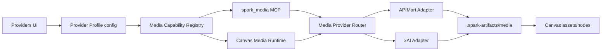

# APIMart / xAI / Agnes 多媒体模型适配开发设计

> 状态: 已落地（manifest 驱动的 TemplateMediaAdapter 已在 MediaRouterService 中接入；APIMart / xAI / Agnes / Volcengine / Google Gemini/Veo/Omni / Midjourney 网关专用与 seed manifest 均已纳入。） | 最后核对: 2026-07-02
>
> 日期: 2026-06-14
> 目标: 让 APIMart 与 xAI 的图片、语音、视频模型可以在 Spark Agent 中完成模型录入、作为 agent 技能调用，并让无限画布能直接通过平台适配器调用这些模型生成多媒体资产。

## 用户自定义 Manifest（2026-07-01 基础阶段已落地）

Provider 的 `mediaModelRefs` 现可选携带完整 `manifest`。解析优先级为“引用内联 Manifest → 目录 Manifest → 旧 `custom:` 合成兜底”，因此旧模板和专用 Adapter 路由保持不变，新自定义图片/视频模型则可由 `TemplateMediaAdapter` 在画布与 `spark_media` 中共用。

Provider 高级设置在 `mediaProvider=custom` 时会为新模型生成同步 JSON 或异步轮询基础 Manifest，并提供完整 JSON 编辑与保存前语义校验。当前通用协议范围仍为 JSON submit、task polling、URL/base64/binary 结果；multipart、文件上传、mask 与复杂多参考输入属于后续阶段。

媒体诊断日志统一把 data URL 和裸 base64 转成 MIME、估算字节数、SHA-256 短摘要与极短首尾预览，Authorization、API Key 和 token 完全掩码。

## 火山方舟（VolcengineArk）专用适配器（2026-06-26 新增）

火山方舟的 Seedance 2.0 系列视频 API 要求请求体为 `model + content[]` 嵌套数组（每元素 `{type, role}`），以及顶层 `generate_audio/ratio/duration/resolution/seed/watermark/return_last_frame/service_tier` 等参数；Seedream 4.5/5.0 图片 API 为 OpenAI 兼容 `/images/generations`，支持 `image`(单图/多图数组)、`size`、`sequential_image_generation`+`max_images`、`tools:[{type:'web_search'}]`。

模板适配器的 `{{var}}` 插值无法表达对象数组结构，故新增 `VolcengineArkMediaAdapter`（`packages/agent-runtime/src/services/media/adapters/volcengine-ark-media.adapter.ts`），注册到 `MediaRouterService`。当 `mediaProvider='volcengine-ark'` 且该 adapter `supports(capability)` 为真时，路由（`media-router.service.ts` 的 `shouldUseManifestAdapter` 判定）优先走专用 adapter 而非模板适配器——manifest 的 `requestTemplate` 不再生效，但 `paramSchema`/`defaults`/`aliases` 仍驱动 Provider 表单与画布参数面板。

- **视频**：`POST {apiEndpoint}/contents/generations/tasks`，按 `inputFiles` 的 role 聚合 `content[]`（text → first_frame → last_frame → reference_image → reference_video → reference_audio），响应取 `id` 轮询 `GET .../tasks/{id}` → `content.video_url`。
- **图片**：`POST {apiEndpoint}/images/generations`，同步返回 `data[].url`/`data[].b64_json`。

模型清单见 `BUILTIN_MEDIA_MODEL_MANIFESTS`：`volcengine:doubao-seedance-2-0-260128` / `-fast-260128` / `-mini-260615`（视频）、`volcengine:doubao-seedream-4-5-251128` / `doubao-seedream-5-0-260128`（图片）。预设见 `provider-presets.ts`：`volcengine-seedance-video`、`volcengine-seedream-image`。

> 注：Doubao-Seed-2.1（pro/turbo/evolving）是文本/多模态理解 LLM，走标准 OpenAI 兼容聊天端点（预设 `volcengine-ark-seed21`），不经过媒体适配器。

## Google Gemini / Veo / Omni 与 Midjourney 网关（2026-07-01 新增）

官方文档核对结论：

- Google Nano Banana 图片生成走 Gemini API Interactions API，官方示例使用 `POST /v1beta/interactions`、`x-goog-api-key` 和 `model=gemini-3.1-flash-image`，输出通过 `output_image.data` 返回 base64 图片。文档列出的直连图片模型包括 `gemini-3.1-flash-lite-image`、`gemini-3.1-flash-image`、`gemini-3-pro-image`、`gemini-2.5-flash-image`。
- Google Veo 3.1 视频生成走 `models/{model}:predictLongRunning`，返回 operation name 后轮询 `GET /v1beta/{operation_name}`，最终从 `response.generateVideoResponse.generatedSamples[].video.uri` 下载视频；下载 Gemini 文件 URI 也需要 `x-goog-api-key`。
- Gemini Omni Flash 是 preview 模型，模型码 `gemini-omni-flash-preview`，输入支持 Text / Image / Video，输出 Video，适合作为 `omni` provider kind 的视频生成/编辑预设。
- Midjourney 公开文档提供官网/Discord/Web 使用说明，但没有公开官方 HTTP API。因此本项目只接入 `MidjourneyMediaAdapter` 作为用户自备合法外部网关：默认提交 `/imagine`、轮询 `/tasks/{{taskId}}`，不内置 Discord 自动化，也不声称是官方 API。

代码落点：

- `GoogleGenerativeAiMediaAdapter` 注册为 `google-generative-ai` 与 `omni` 两个 kind；图片走 Interactions API，视频走 long-running operation polling。
- `MidjourneyMediaAdapter` 注册为 `midjourney` kind；只依赖用户配置的 `apiEndpoint`，适配常见 submit + poll 网关响应。
- `BUILTIN_MEDIA_MODEL_MANIFESTS` 新增 `google:gemini-*image`、`google:veo`、`omni:gemini-omni-flash-preview`、`midjourney:gateway`。
- Provider 预设新增 `google-gemini-images`、`google-veo-video`、`google-omni-video`、`midjourney-gateway`，无限画布和 `spark_media` 共用同一套能力发现。

## Agnes AI 统一 Provider（2026-07-02 新增）

Agnes 的接入目标与 APIMart/xAI 不同: 不再拆成“文本 Provider + 单独图片 Provider”，而是提供一个单独可直接使用的统一模板。配置一份 Agnes API Key 后，同一个 `multimodal` Provider 既能走 OpenAI 兼容聊天路径提供文本/图像理解，也能通过 `spark_media` 和画布直接调用 Agnes 图片与视频模型。

文档核对结论:

- 文本/图像理解走 `POST /v1/chat/completions`，模型 `agnes-2.0-flash`。
- 图片生成与图生图都走 `POST /v1/images/generations`；图生图输入放在 `extra_body.image`，支持 URL 与 Data URI Base64。
- 视频生成走 `POST /v1/videos`；创建任务响应同时返回 `task_id` 与 `video_id`。
- 视频轮询推荐使用 `GET /agnesapi?video_id=<VIDEO_ID>&model_name=agnes-video-v2.0`，`GET /v1/videos/<TASK_ID>` 作为兼容兜底。

代码落点:

- `provider-presets.ts` 新增 `agnes-ai` 统一模板，预填 `agnes-2.0-flash` 文本模型、Agnes 图片/视频 manifest、media defaults 和 capabilities。
- `media-model-manifest.ts` 新增 `agnes:agnes-image-2.0-flash`、`agnes:agnes-image-2.1-flash`、`agnes:agnes-video-v2.0`。
- `AgnesMediaAdapter` 注册到 `MediaRouterService`，负责 Agnes 图片请求体、视频尺寸/帧数换算以及 `video_id` 优先轮询。
- `ProvidersView` 放宽到允许 `modelType=multimodal` 的 Provider 保存 media config；`SessionService.resolveMediaGenerationContext()` 也放宽为“非 legacy image profile 但显式声明了 media capabilities/manifests”即可注入 `spark_media`。

## 1. 文档依据

- Agnes AI 总览: https://agnes-ai.com/zh-Hans/docs/overview
- Google Gemini Nano Banana 图片生成: https://ai.google.dev/gemini-api/docs/image-generation
- Google Veo 视频生成: https://ai.google.dev/gemini-api/docs/veo
- Gemini Omni Flash 模型页: https://ai.google.dev/gemini-api/docs/models/gemini-omni-flash
- OpenAI Images / Vision: https://developers.openai.com/api/docs/guides/images-vision
- Midjourney 官方帮助中心: https://docs.midjourney.com/
- APIMart 中文文档: https://docs.apimart.ai/cn
- APIMart Whisper 文档: https://docs.apimart.ai/cn/api-reference/audios/whisper-1
- APIMart GPT Image 2 文档: https://docs.apimart.ai/cn/api-reference/images/gpt-image-2/official
- APIMart VEO 3 文档: https://docs.apimart.ai/cn/api-reference/videos/veo3/generation
- xAI Imagine 文档: https://docs.x.ai/developers/model-capabilities/imagine
- xAI 视频生成文档: https://docs.x.ai/developers/model-capabilities/video/generation
- xAI TTS 文档: https://docs.x.ai/developers/model-capabilities/audio/text-to-speech

外部文档结论:

- Agnes 提供 OpenAI 兼容文本/图像理解入口，但图片与视频生成接口包含自身的 `extra_body.image`、`video_id` 轮询等约定，因此需要单独媒体适配器而不是只依赖通用模板。
- APIMart 是 OpenAI 兼容风格的聚合平台，图片、语音、视频能力按模型族拆 API Reference。图片/视频生成可能返回直接产物，也可能返回异步任务 id，需要轮询任务状态再提取 URL/base64。
- xAI 的图片生成使用 Imagine 能力，常见入口是 `/v1/images/generations`；视频生成使用 `/v1/videos/generations` 创建请求，并通过 request id 轮询；语音合成使用 `/v1/audio/speech`。
- 两个平台都不能只用现有 `modelType=image + imageProvider + imageApiType` 覆盖。语音、视频、图片编辑、图生视频、多图参考等能力需要统一的多媒体能力注册表和按 operation 路由的 provider adapter。

## 2. 当前代码状态

已有能力:

- Provider UI 已有 `modelType` 枚举: `image | text | multimodal | voice | video`，位置在 `apps/desktop/src/renderer/design/views/ProvidersView.tsx`。
- 图片 provider 额外保存 `imageProvider` 与 `imageApiType`，运行时通过 `spark_image` MCP 暴露 `mcp__spark_image__generate_image`。
- `packages/agent-runtime/src/tools/image-generation-mcp-server.mjs` 已实现 OpenAI/APIMart/OpenRouter/Gemini/Seedream/Bailian/Zhipu/xAI 风格的生图请求、异步轮询和文件落地。
- 无限画布已有本地 demo 数据层，支持 `text_to_image`、`image_to_image`、`image_edit`、`image_compose`、`text_generate`、`prompt_optimize`、`image_to_video` 等 operation，但 `createTask` 仍是 localStorage demo。

主要缺口:

- Provider 配置没有保存多媒体 adapter 元信息，例如 `mediaProvider`、`mediaApiType`、`mediaCapabilities`、默认尺寸/质量/时长/语音参数。
- Agent runtime 只有图片 MCP，没有语音/视频/多媒体统一 MCP。
- 无限画布没有真实调用 provider adapter，也没有统一的生成任务状态、产物下载、音视频 asset 写回。
- Preset 中 APIMart/xAI 多媒体模型大多未启用或缺少细分能力。

## 3. 产品目标

### 3.1 Provider 录入

Provider 新增“多媒体模型”配置能力，支持 APIMart 和 xAI 的图片、语音、视频模型。

用户在 Providers 中应能选择:

- 模型类型: 图片 / 语音 / 视频 / 多模态。
- 平台适配器: APIMart / xAI / OpenAI Compatible / Custom。
- 支持能力:
  - `image.generate`
  - `image.edit`
  - `image.variations`
  - `audio.speech`
  - `audio.transcription`
  - `video.generate`
  - `video.image_to_video`
- 调用方式: `sync | async | auto`。
- 默认模型 ID 与可用模型列表。
- 能力参数默认值: 尺寸、比例、数量、质量、时长、voice、format、poll interval、timeout。

### 3.2 Agent 技能调用

Agent 需要通过受控 MCP 工具使用多媒体能力，而不是拿到 API key。

新增统一 MCP server:

```text
spark_media
```

工具:

```text
mcp__spark_media__generate_image
mcp__spark_media__edit_image
mcp__spark_media__generate_audio
mcp__spark_media__transcribe_audio
mcp__spark_media__generate_video
```

旧 `spark_image` 兼容保留，但实现应逐步委托到统一 media runtime，避免两套 provider 适配逻辑继续分叉。

### 3.3 无限画布直接调用

无限画布 AI 任务不再只创建 demo task node。它应根据 operation 直接选择一个具备能力的 provider profile，调用平台 adapter，等待同步结果或异步轮询，然后把输出写回:

- `canvas_tasks`: 记录状态、进度、providerProfileId、modelId、operation、requestId、rawResponse。
- `canvas_assets`: 写入图片、音频、视频、文本资产。
- `canvas_nodes`: 自动创建输出节点。
- `canvas_edges`: 写入 `used_as_input` 和 `generated` 血缘关系。

## 4. 设计方案

采用“能力注册表 + 平台 adapter + 双入口调用”的方案。



推荐理由:

- Provider 录入、agent skill、画布任务共用同一个能力描述和 adapter，减少重复逻辑。
- APIMart 和 xAI 的异步任务差异被封装在 adapter 内，画布只关心 task progress 与 output assets。
- 后续接入 Runway、Kling、Veo、Sora、Seedream、OpenAI Audio 时只新增 adapter 或 capability preset。

## 5. 数据结构扩展

### 5.1 Provider Profile config

在现有 `config_json` 中新增可选字段，保持向后兼容:

```ts
type MediaProviderKind = 'apimart' | 'xai' | 'openai-compatible' | 'custom'
type MediaApiType = 'sync' | 'async' | 'auto'
type MediaCapabilityId =
  | 'image.generate'
  | 'image.edit'
  | 'image.variations'
  | 'audio.speech'
  | 'audio.transcription'
  | 'video.generate'
  | 'video.image_to_video'

type ProviderMediaConfig = {
  mediaProvider?: MediaProviderKind
  mediaApiType?: MediaApiType
  mediaCapabilities?: MediaCapabilityId[]
  mediaDefaults?: {
    image?: {
      size?: string
      aspectRatio?: string
      quality?: string
      n?: number
      outputFormat?: 'png' | 'jpeg' | 'webp'
    }
    audio?: {
      voice?: string
      format?: 'mp3' | 'wav' | 'opus' | 'aac' | 'flac' | 'pcm'
      speed?: number
      language?: string
    }
    video?: {
      aspectRatio?: string
      durationSeconds?: number
      quality?: string
      fps?: number
    }
    polling?: {
      intervalMs?: number
      timeoutMs?: number
    }
  }
}
```

兼容规则:

- 现有 `modelType=image + imageProvider + imageApiType` 继续可用。
- 保存 `modelType=image` 时同步写入:
  - `mediaProvider = imageProvider`
  - `mediaApiType = imageApiType`
  - `mediaCapabilities` 至少包含 `image.generate`
- 保存 `modelType=voice` 时必须至少包含 `audio.speech` 或 `audio.transcription`。
- 保存 `modelType=video` 时必须至少包含 `video.generate` 或 `video.image_to_video`。

### 5.2 Canvas operation 扩展

扩展 `CanvasOperationType`:

```ts
type CanvasOperationType =
  | 'text_to_image'
  | 'image_to_image'
  | 'image_edit'
  | 'image_compose'
  | 'text_generate'
  | 'text_rewrite'
  | 'prompt_optimize'
  | 'text_to_audio'
  | 'audio_transcribe'
  | 'text_to_video'
  | 'image_to_video'
```

operation 到 capability 映射:

| Canvas operation   | Capability             | 输入              | 输出  |
| ------------------ | ---------------------- | ----------------- | ----- |
| `text_to_image`    | `image.generate`       | prompt/text       | image |
| `image_to_image`   | `image.edit`           | image + prompt    | image |
| `image_edit`       | `image.edit`           | image + prompt    | image |
| `image_compose`    | `image.edit`           | 多 image + prompt | image |
| `text_to_audio`    | `audio.speech`         | text/prompt       | audio |
| `audio_transcribe` | `audio.transcription`  | audio             | text  |
| `text_to_video`    | `video.generate`       | prompt            | video |
| `image_to_video`   | `video.image_to_video` | image + prompt    | video |

## 6. Adapter 接口

新增 runtime 接口:

```ts
type MediaGenerateInput = {
  operation: CanvasOperationType
  capability: MediaCapabilityId
  prompt?: string
  negativePrompt?: string
  inputFiles?: Array<{
    path?: string
    url?: string
    dataUrl?: string
    mimeType?: string
    type: 'image' | 'audio' | 'video' | 'file'
  }>
  modelParams?: Record<string, unknown>
  outputDir: string
}

type MediaGenerateOutput = {
  provider: string
  model: string
  mode: 'sync' | 'async'
  requestId?: string
  assets: Array<{
    type: 'image' | 'audio' | 'video' | 'text'
    filePath?: string
    url?: string
    mimeType?: string
    width?: number
    height?: number
    durationMs?: number
    contentText?: string
    raw?: unknown
  }>
  rawResponse?: unknown
}

interface MediaProviderAdapter {
  readonly id: 'apimart' | 'xai' | 'openai-compatible' | 'custom'
  supports(capability: MediaCapabilityId): boolean
  invoke(input: MediaGenerateInput, context: MediaProviderContext): Promise<MediaGenerateOutput>
}
```

### 6.1 APIMart adapter

默认配置:

```ts
{
  mediaProvider: 'apimart',
  mediaApiType: 'auto',
  apiEndpoint: 'https://api.apimart.ai/v1'
}
```

能力策略:

- 图片: 优先走 OpenAI compatible `/images/generations` 或对应 APIMart model path。若响应无直接图片但有 task/request/job id，则进入轮询。
- 图片编辑/多图参考: 统一视为 `image.edit`。APIMart `gpt-image-2` 使用 `/images/generations` + `image_urls`；本地 dataUrl / safe-file 输入先通过登录用户的云上传 `/api/v1/upload` 获取 `aiUrl`，公网 URL 则直接传入。
- 语音转文字: Whisper 类模型，输入 audio file，输出 text asset。
- 语音合成: TTS 类模型，输出 audio asset。
- 视频: VEO/Sora/Runway/Kling 等异步模型，创建 task 后轮询状态，完成后下载视频 URL 到 `.spark-artifacts/media/videos`。

### 6.2 xAI adapter

默认配置:

```ts
{
  mediaProvider: 'xai',
  mediaApiType: 'auto',
  apiEndpoint: 'https://api.x.ai/v1'
}
```

能力策略:

- 图片生成: `/images/generations`，默认模型由 profile.defaultModel 决定，例如 `grok-imagine-image`。
- 图片编辑/图生图: `/images/edits`，支持 public URL、base64 data URI、file_id；画布默认对 xAI 使用 base64，以规避国内公网地址不可访问的问题。
- 视频生成: `/videos/generations` 创建请求，保存 `request_id`，轮询 `/videos/{request_id}` 获取最终 video URL，下载为本地视频 asset；`expired` 与 `failed` 都按终态失败处理。
- 参考图生视频: 使用 `/videos/generations` 的 `reference_images`，协议能力登记为 `video.reference_to_video`，spark_media 可通过 `capability: "video.reference_to_video"` 或 `videoMode: "reference_to_video"` 调用。
- 视频扩展: `/videos/extensions`，输入 `video: { url }`，`duration` 限制为 1-15 秒；画布提供独立 `video_extend` 操作，spark_media 可通过 `capability: "video.extend"` 或 `videoMode: "extend"` 调用。
- 语音合成: `/audio/speech`，默认模型由 profile.defaultModel 决定，例如 xAI voice/TTS 模型；voice、format、speed 从 `mediaDefaults.audio` 或 `modelParams` 读取。
- xAI 图片/视频的 quality、aspect_ratio、duration 等字段不在 UI 中硬编码死，允许通过 `modelParams` 透传，并在 preset 中给常用默认值。

## 7. Agent 技能与 MCP 设计

新增文件建议:

```text
packages/agent-runtime/src/tools/media-generation-mcp-server.mjs
packages/agent-runtime/src/services/media/media-adapter.types.ts
packages/agent-runtime/src/services/media/media-router.service.ts
packages/agent-runtime/src/services/media/adapters/apimart-media.adapter.ts
packages/agent-runtime/src/services/media/adapters/xai-media.adapter.ts
packages/agent-runtime/src/services/media/media-artifact.service.ts
```

MCP server 输入 schema:

- `generate_image`: prompt, model, size, n, inputImages, filename, extraJson。
- `edit_image`: prompt, model, imageFiles/imageUrls, mask, size, n, filename, extraJson。
- `generate_audio`: text, model, voice, format, filename, extraJson。
- `transcribe_audio`: audioFile/audioUrl, model, language, responseFormat, extraJson。
- `generate_video`: prompt, model, inputImages, aspectRatio, durationSeconds, filename, extraJson。

MCP manifest executor:

- `model` 可以是 manifest id、provider model id 或 displayName；未传时使用 provider 的默认模型或首个匹配 capability 的 manifest。
- 工具按输入形态选择 capability：例如 `generate_image + inputImages` 优先匹配 `image.image_to_image`，`generate_video + inputImages` 优先匹配 `video.image_to_video`。
- `extraJson` 与工具标准参数先合并，再与 capability defaults 合并；最终通过 capability aliases 映射成供应商字段。
- JSON invocation 使用 `requestTemplate` 渲染请求体，`response.jsonPaths` / `response.resultPaths` 提取 URL、base64 或文本，`task_poll` 响应没有立即产物时再按 `statusEndpoint` 轮询。

Agent system prompt 增补:

- 只有存在可用 provider 且 keystore 可读时注入。
- 明确 API key 只在 Spark MCP server 内部使用。
- 要求 agent 对图片/音频/视频请求调用对应 MCP 工具。
- 成功后返回 files/urls，并把本地文件用 Markdown 链接展示。

## 8. 无限画布运行时设计

新增桌面侧 IPC:

```text
canvas:media-capabilities:list
canvas:task:create-media
canvas:task:get
canvas:task:cancel
```

`create-media` 流程:

1. Renderer 创建 optimistic task node。
2. Main process 根据 operation 解析 required capability。
3. 从 provider profiles 选择可用模型:
   - 用户指定 `providerProfileId` 优先。
   - 项目/画布默认多媒体 provider 次之。
   - capability registry 中第一个 enabled provider 兜底。
4. 调用 `MediaRouterService.invoke`。
5. 同步模型直接返回；异步模型写入 requestId 并轮询。
6. 产物下载到:

```text
.spark-artifacts/media/images
.spark-artifacts/media/audio
.spark-artifacts/media/videos
```

7. 写回 localStorage demo 层或后续 SQLite canvas repository。
8. Renderer 刷新 snapshot，输出节点出现在 task node 右侧。

首版范围:

- 保持当前画布 localStorage demo 存储，不强行做 SQLite 迁移。
- 真实 provider 调用走 main process IPC，避免 renderer 直接拿 API key。
- 图片、音频、视频产物都先落本地文件路径，asset metadata 保存 provider/model/requestId/rawUsage。

## 9. Provider UI 设计

遵守项目 AGENTS.md UI 组件栈:

- 优先 `@lobehub/ui`。
- 不恢复 Arco、Radix、`@spark/ui-kit` 或本地基础控件封装。
- Select、Drawer、Button、Tag、Tooltip 等继续使用 `@lobehub/ui`，必要时用 `antd` 补位。

ProviderEditPanel 改造:

- `modelType=image|voice|video` 时显示“多媒体能力”区块。
- 平台适配器 Select:
  - APIMart
  - xAI
  - OpenAI Compatible
  - Custom
- 能力 Checkbox group:
  - 生图、图片编辑、图片变体、语音合成、语音转写、文生视频、图生视频。
- 调用方式 Select: sync / async / auto。
- 参数默认值折叠区:
  - 图片: size/aspect ratio/quality/n/format。
  - 语音: voice/format/speed/language。
  - 视频: aspect ratio/duration/quality/fps。
  - 轮询: interval/timeout。

Preset 建议:

```text
apimart-images
apimart-audio-whisper
apimart-audio-tts
apimart-video-veo3
apimart-video-sora2
xai-imagine-image
xai-imagine-video
xai-tts
```

## 10. 错误处理

统一错误码:

```ts
type MediaErrorCode =
  | 'provider_not_configured'
  | 'capability_not_supported'
  | 'api_key_missing'
  | 'invalid_input'
  | 'provider_http_error'
  | 'task_failed'
  | 'task_timeout'
  | 'artifact_download_failed'
```

画布表现:

- task node 保留在画布上，状态变为 failed。
- Inspector 显示 provider、model、requestId、错误摘要。
- 支持 retry，复用原 prompt/inputAssetIds/modelParams。

## 11. 测试计划

单元测试:

- Provider config normalize: image 旧字段同步到 media 字段；voice/video 不写 image-only 字段。
- Capability registry: operation 能映射到正确 capability。
- APIMart adapter: mock 同步图片响应、异步 task id、失败状态、超时。
- xAI adapter: mock image generation、video request/poll、audio speech。
- Artifact service: URL/base64 下载/写盘，mime 到扩展名映射。

Renderer 测试:

- ProviderEditPanel 对 image/voice/video 显示正确字段。
- 选择 APIMart/xAI preset 后 endpoint、model、capabilities、mediaApiType 自动填充。
- CanvasInlineAiComposer 可以选择音频/视频 operation。

集成验证:

```text
pnpm --filter @spark/agent-runtime test
pnpm --filter @spark/desktop test
pnpm --filter @spark/desktop typecheck
pnpm --filter @spark/desktop build
```

如果没有真实 API key，开发者必须用 mock adapter 或 nock/fetch mock 完成测试；不能把真实 key 写入测试。

## 12. 开发任务拆分

### Task 1: 扩展协议与 provider config

修改:

- `packages/protocol/src/ipc/index.ts`
- `packages/protocol/src/schemas/index.ts`
- `packages/protocol/src/provider-export.ts`
- `packages/protocol/src/provider-presets.ts`
- `packages/agent-runtime/src/services/provider.service.ts`
- `packages/agent-runtime/src/__tests__/services/provider.service.test.ts`

交付:

- 新增 media config 类型、schema、导入导出支持。
- APIMart/xAI 多媒体 preset 可在 UI 中选择。
- 旧 image provider 兼容不破坏。

### Task 2: 新增 media adapter runtime

修改/新增:

- `packages/agent-runtime/src/services/media/*`
- `packages/agent-runtime/src/tools/media-generation-mcp-server.mjs`
- `packages/agent-runtime/src/services/session.service.ts`

交付:

- `spark_media` MCP server 可注入 agent runtime。
- APIMart/xAI adapter 支持图片、语音、视频的 mock 测试。
- 旧 `spark_image` 保留，优先复用新 router。

### Task 3: Provider UI 支持多媒体能力录入

修改:

- `apps/desktop/src/renderer/design/views/ProvidersView.tsx`
- `apps/desktop/src/renderer/design/views/ProvidersView.less`
- 必要时更新 provider adapter tests。

交付:

- image/voice/video 均可配置 media provider、capabilities、defaults。
- 不引入被禁 UI 栈。
- 不新增本地基础控件封装。

### Task 4: 无限画布接入真实 media 调用

修改/新增:

- `apps/desktop/src/main/ipc/index.ts`
- `apps/desktop/src/renderer/design/views/canvas/canvas.types.ts`
- `apps/desktop/src/renderer/design/views/canvas/canvas.capabilities.ts`
- `apps/desktop/src/renderer/design/views/canvas/canvas.api.ts`
- `apps/desktop/src/renderer/design/views/canvas/canvas.store.ts`
- `apps/desktop/src/renderer/design/views/canvas/CanvasInlineAiComposer.tsx`
- `apps/desktop/src/renderer/design/views/canvas/CanvasTaskQueue.tsx`
- `apps/desktop/src/renderer/design/views/canvas/CanvasNode.tsx`

交付:

- 画布能创建图片、音频、视频真实任务。
- 任务状态和结果节点写回 snapshot。
- 输出 asset 保存 provider/model/requestId/rawResponse。

### Task 5: 文档与回归

修改:

- `docs/image-generation-providers.md`
- 新增或更新多媒体 provider 使用文档。

交付:

- 说明 APIMart/xAI 配置方式、agent MCP 工具、画布调用方式。
- 跑完测试与 typecheck。

## 13. 验收标准

必须满足:

- 可以在 Providers 中创建 APIMart 图片、APIMart 视频、xAI Imagine 图片、xAI Imagine 视频、xAI TTS provider profile。
- Agent 有可用 provider 时会注入 `spark_media` MCP，并能通过工具生成图片/音频/视频资产。
- 无限画布中选择文本节点可文生图、文生音频、文生视频；选择图片节点可图生视频。
- 任务完成后输出资产节点自动出现在画布，资产抽屉可看到类型、provider、model、来源任务。
- API key 不进入 renderer，不出现在日志、asset metadata、MCP tool result。
- 无真实 key 时，所有 mock 测试仍可通过。
- 不引入 Arco、Radix、`@spark/ui-kit` 或新的本地基础控件封装。

## 14. 给 Claude Code 的执行提示

请按本文件 Task 1 到 Task 5 顺序实现。实现时遵守根目录 `AGENTS.md` 的 UI 组件栈规则。不要把真实 API key 写入代码或测试。每个 task 完成后运行相关测试，最后至少运行:

```text
pnpm --filter @spark/agent-runtime test
pnpm --filter @spark/desktop typecheck
```

如果现有测试脚本名称不同，先查看对应 package.json，再选择最接近的 test/typecheck/build 命令。
