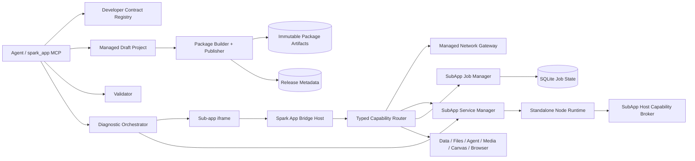

# SparkWork 子应用开发平台详细设计

> 状态: 已落地 | 最后核对: 2026-09-08

## 1. 文档目的

本文定义 SparkWork 子应用从“单 HTML 页面运行器”升级为完整本地应用平台的目标架构、协议、数据模型、安全边界、开发工具、兼容策略与实施顺序。

本设计同时解决两类已确认问题：

1. Agent 缺少可按需查询、与运行时一致的子应用开发契约，导致生成代码时猜测 SDK、IPC 参数、生命周期和安全边界；
2. 子应用没有正式的后台能力，无法安全调用带凭据的外部接口，也无法在页面关闭后继续运行服务或长任务。

本文是后续实现、评审和验收的事实基线。实现开始后应把状态更新为“实施中”，全部验收项落地后更新为“已落地”。

## 2. 结论摘要

本设计采用以下核心决策：

- 增加内建的 `spark_app_developer_guide`，但不把静态手册当成唯一解决方案；同时提供脚手架、静态校验、真实运行诊断、后台状态和日志工具，形成完整开发闭环。
- 后台能力拆成三层：受管接口请求、受管后台服务、持久后台任务。三者分别解决凭据/CORS、页面外服务生命周期、长任务恢复与进度管理问题。
- 子应用升级为 V2 版本化应用包；前端、后台产物、manifest、接口 Schema、依赖锁和权限声明作为同一发布版本原子保存和回滚。
- 现有单 HTML 应用保持兼容，继续按 V1 运行；不批量迁移、不因新架构立即破坏存量应用。
- V2 子应用默认只能调用稳定、类型化的 `window.sparkApp` SDK，不再默认暴露任意平台 IPC，也不返回 Provider 明文密钥。
- 子应用后台由桌面主进程持有的 `SubAppServiceManager` 管理，生命周期不依赖 Agent 会话、renderer 页面或某个 iframe。
- 首版后台运行时只支持 Spark 随包 Node.js 执行预构建 JavaScript；不在启用或调用阶段执行 `npm install`，不要求子应用自行监听 localhost 端口。
- 复用 Tool Process 已验证的进程管理、帧解析、取消、日志和 Capability Broker 基础设施，但子应用服务使用独立协议和独立领域服务，不把 Tool Package 直接伪装成子应用后台。
- SparkWork 是本地优先平台。后台进程属于 `trusted-local`，拥有当前用户 OS 权限，不宣传为安全沙箱；通过发布内容完整性、本地扫描、权限与 OS effects 展示、调用审计和用户控制提供透明治理。

## 3. 当前实现基线

以下事实来自当前源码，后续实现不得假设现有系统已具备尚未存在的能力。

| 领域 | 当前事实 | 直接影响 |
| --- | --- | --- |
| 发布模型 | `sub_apps` 和 `sub_app_releases` 保存单个 `source` 字符串、配置和 manifest 字段 | 无法把前端、后台、依赖锁和接口契约组成同一版本 |
| 前端运行 | 源码被合成为运行文档，经 `capability-asset://subapp-runtime/*` 加载到 `sandbox="allow-scripts"` iframe | 页面关闭或卸载后，前端代码、监听与 Bridge 一并销毁 |
| SDK | bootstrap 注入 `runtime/theme/data/ui/navigation/files/agent/media/canvas/browser/ipc/platform` | SDK 已有一定能力，但缺少统一可查询的方法与返回契约 |
| 权限 | `useSubAppRunner` 当前把应用以 `trusted: true` 运行 | manifest permissions 对当前内置应用不产生实际裁剪 |
| 原始 IPC | `sparkApp.ipc` / `sparkApp.platform` 可转发任意已注册 invoke 和 stream channel | 能力强，但参数不可发现、安全边界不稳定、应用容易猜错 |
| Provider 凭据 | 当前可通过 `provider:get-api-key` 向 renderer 返回明文密钥 | 不适合作为新应用调用 Provider 的标准方式 |
| 直接网络 | iframe CSP 可按设置允许 HTTP(S) `fetch` | 仍受目标 CORS 约束，且无法安全持有凭据 |
| 数据 | `sparkApp.data` 为应用隔离的 JSON KV，单值序列化上限 512 KB | 适合设置/小型状态，不适合大文件和任务日志 |
| 文件 | `sparkApp.files` 仅操作应用隔离目录中的 UTF-8 文本，单文件 2 MB、列表最多 500 项 | 不能替代二进制资产、包文件和任意系统文件能力 |
| Bridge | 单 iframe 最多 8 个在途请求，默认请求超时 30 秒，审计只记录能力/操作/结果 | 不适合承载长任务；长任务必须返回 jobId |
| Agent 工具 | `spark_app_create/update_draft` 的描述中重复塞入大量规则 | 上下文成本高，仍无法按方法、错误码或 IPC 精确查询 |
| 运行诊断 | 没有 Agent 可调用的真实 iframe/后台联合诊断入口 | “写入草稿成功”无法证明应用可运行 |
| 可复用基础 | Tool Process 已具备 persistent 进程、stdio 帧协议、超时/取消、进程树清理、日志/进度与 Capability Broker | 可抽取共用底层，但其目录、权限和调用语义不等同于子应用 |

当前关键源码位置：

- `packages/protocol/src/sub-app.ts`
- `packages/storage/migrations/083_sub_apps.sql`
- `packages/storage/src/repositories/sub-app.repository.ts`
- `apps/desktop/src/renderer/design/sub-app/appRuntimeDocument.ts`
- `apps/desktop/src/renderer/design/sub-app/bridgeHost.ts`
- `apps/desktop/src/renderer/design/sub-app/useSubAppRunner.ts`
- `apps/desktop/src/main/ipc/subAppBackend.ts`
- `packages/agent-runtime/src/tools/sub-app-mcp-server.mjs`
- `packages/agent-runtime/src/services/tool-packages/tool-process-host.ts`
- `packages/agent-runtime/src/services/tool-packages/tool-host-capability-broker.ts`

## 4. 问题定义

### 4.1 Agent 不知道“应该怎样开发”

当前工具描述把部分规则平铺在创建和更新工具里，但无法回答以下精确问题：

- 某个 `sparkApp.*` 方法是否真实存在、参数和返回值是什么；
- 某个 surface 的尺寸、滚动、透明背景和主题规则是什么；
- 某个 IPC channel 是否存在、需要什么请求结构、是否允许新应用调用；
- 某类数据应放 `data`、`files`、用户选择文件还是发布包；
- 页面关闭后哪些逻辑会终止，哪些任务能够继续；
- 直接 fetch、受管网络请求、Provider 调用和后台服务分别适用于什么场景；
- 发布前如何判断代码、权限、资源、接口 Schema 和运行时是否一致。

仅增加更长的提示词会继续产生重复、过期和上下文膨胀，不能形成工程闭环。

### 4.2 “调用接口”和“运行后台”是不同需求

应用方提出的 `provider:proxy-request` 可以解决一部分 Provider 代理请求，但不能覆盖完整后台需求：

- 调用外部 REST/GraphQL/Webhook，需要 CORS 规避、凭据注入、响应治理和连接配置；
- 在页面关闭后维持同步、监听或本地计算，需要独立服务生命周期；
- 导入、生成、扫描、下载等长耗时动作，需要持久 jobId、进度、取消和恢复；
- 自带 npm 依赖和多文件源码，需要应用包、构建产物、完整性和原子发布。

因此不能用一个“万能代理 IPC”承载所有场景。

## 5. 目标、非目标与设计原则

### 5.1 目标

- Agent 和人工开发者能查询当前版本的权威开发契约，并获得可运行的最小示例。
- 支持纯前端、前端 + 受管请求、前端 + 后台服务、后台任务型四类应用。
- 凭据由宿主安全保存和注入，前端源码、日志和应用数据不接触明文密钥。
- 后台服务可随应用启用启动，页面关闭后继续运行，并可查询健康状态、日志和崩溃原因。
- 长任务具备稳定 jobId、状态、进度、取消、结果和重启后的明确恢复语义。
- 发布和回滚保持前端、后台、manifest、Schema、权限和依赖的一致版本。
- 对 V1 应用保持向后兼容，同时为 V2 建立更稳定的 SDK 和权限边界。
- 开发工具能完成“查契约 → 脚手架 → 写代码 → 校验 → 真实诊断 → 发布 → 观察”的闭环。

### 5.2 非目标

- 首版不提供 Docker、任意容器编排或让每个子应用自行监听端口的服务模型。
- 首版不支持 Python、Java、Rust 等多后台运行时；后续可通过 Spark 制品系统扩展。
- 首版不承诺后台进程是恶意代码安全沙箱。
- 首版不把所有平台内部 IPC 公开为稳定公共 API。
- 首版不自动迁移或重写存量 V1 HTML 应用。
- 首版不提供云端常驻服务；所有后台能力随本机 SparkWork 生命周期运行。
- 首版不提供任意公网入站 Webhook 或内网穿透。OAuth 本机回调由 Connection 服务托管；普通后台可维持主动发起的轮询、SSE 或 WebSocket 出站连接。

### 5.3 原则

1. **稳定 SDK 优先**：公共能力通过类型化 `sparkApp` SDK 暴露，原始 IPC 只保留 legacy 兼容。
2. **能力分层**：短请求、服务 RPC、持久任务分别建模，禁止用 30 秒 Bridge Promise 假装长任务。
3. **版本原子性**：一次 release 是可校验、不可变、可回滚的完整应用单元。
4. **本地能力透明**：允许本地文件、网络、进程等高能力场景，但如实展示 OS effects、来源与授权。
5. **密钥不下发**：Keychain 中的凭据只在宿主受管请求边界使用。
6. **契约单一事实源**：SDK、手册、类型、校验器和工具描述从同一注册表生成或校验。
7. **失败可诊断**：每个失败都有稳定错误码、correlationId 和可检索日志，不用“白屏”作为错误反馈。
8. **兼容优先、逐步收紧**：先提供 V2 正确路径和迁移诊断，再根据存量使用情况处理 legacy 能力。

## 6. 能力分层

| 层级 | 公共 API | 生命周期 | 适用场景 | 不适用场景 |
| --- | --- | --- | --- | --- |
| 页面能力 | `sparkApp.theme/data/files/ui/...` | 跟随 iframe | UI、主题、小型数据、页面交互 | 页面关闭后继续工作 |
| 受管请求 | `sparkApp.network.request` | 单次请求 | REST/GraphQL、CORS、凭据注入 | 监听器、长时间驻留、CPU 密集任务 |
| Provider 代理 | `sparkApp.provider.request` | 单次请求 | Provider 特有且平台未抽象的 API | 常规模型/Agent 调用、任意后台逻辑 |
| 后台 RPC | `sparkApp.backend.invoke/on` | 独立服务进程 | 本地计算、同步、缓存、事件 | 需要跨重启可追踪的长任务 |
| 持久任务 | `sparkApp.jobs.create/get/list/cancel/onProgress` | 独立于页面并落库 | 导入、下载、批处理、生成、索引 | 毫秒级同步请求 |

选择顺序：

1. 平台已有稳定 SDK 时直接使用现有能力；
2. 只需访问外部 API 时使用受管请求，不创建后台服务；
3. 需要页面外运行、本地依赖、事件或缓存时增加后台服务；
4. 预计超过 10 秒、需要进度/取消/恢复的操作建模为 job；
5. 仅在平台没有等价稳定能力时使用 Provider 原始代理；禁止新 V2 应用读取明文密钥。

## 7. 总体架构



### 7.1 进程归属

- **renderer**：承载 iframe、主题、可视预览和页面侧 Bridge；不得持有后台生命周期。
- **desktop main**：持有 `SubAppServiceManager`、`SubAppJobManager`、网络代理、凭据绑定、包文件、日志和应用启停联动。
- **agent-runtime**：暴露 `spark_app_*` MCP 工具，通过 Platform Bridge 调用桌面/存储领域服务；不得成为后台服务的唯一宿主。
- **service child process**：执行某个 appId + releaseId 的预构建后台代码，通过 stdio 帧协议调用宿主能力。

将后台服务放在 desktop main 的原因：Agent 会话可以结束、切换模型或根本未打开；子应用服务生命周期必须只跟 SparkWork 和应用状态关联。

## 8. V2 应用包

### 8.1 目录结构

```text
spark-app.json
frontend/
  index.html
  assets/
service/
  main.mjs
schemas/
  backend-actions.json
  jobs.json
package-lock.json
README.md
```

发布包只包含运行所需文件和可选说明，不包含开发缓存、`.git`、测试覆盖率、源码映射中的绝对路径或明文 secret。

### 8.2 manifest 草案

```json
{
  "schemaVersion": 2,
  "name": "知识库同步",
  "description": "同步外部知识库并在 SparkWork 中检索",
  "icon": "builtin:database",
  "surface": "content",
  "frontend": {
    "entry": "frontend/index.html"
  },
  "service": {
    "runtime": "node",
    "entry": "service/main.mjs",
    "lifecycle": "application",
    "idleTimeoutSeconds": 300,
    "healthAction": "health"
  },
  "permissions": {
    "sparkCapabilities": ["data", "files", "network", "backend", "jobs"],
    "osEffects": ["network"],
    "connections": ["knowledge-api"]
  },
  "connections": {
    "knowledge-api": {
      "kind": "http-api",
      "displayName": "知识库 API",
      "allowedOrigins": ["https://api.example.com"],
      "allowPrivateNetwork": false
    }
  },
  "contracts": {
    "backendActions": "schemas/backend-actions.json",
    "jobs": "schemas/jobs.json"
  }
}
```

### 8.3 manifest 规则

- `schemaVersion` 决定运行和权限模型；V1 不伪装成 V2。
- `frontend.entry`、`service.entry` 和 Schema 路径必须是包内 POSIX 相对路径，不允许 `..`、绝对路径或协议前缀。
- `service` 可省略；纯前端应用不因此承担后台进程成本。
- `lifecycle` 只允许：
  - `on-demand`：首次 RPC/job 调用时启动，空闲超时后退出；
  - `application`：应用启用时启动，页面关闭不停止，禁用/归档/退出时停止。
- `connections` 声明应用所需的逻辑连接槽，不保存真实密钥。
- `osEffects` 如实声明后台代码可能产生的当前用户级 OS 行为；本地扫描只能辅助发现，不构成平台担保。
- `contracts` 指向 JSON Schema 目录，用于前后端调用、开发手册和运行时输入输出校验。

### 8.4 构建与依赖

- 开发阶段可以存在 TypeScript、React、构建脚本和 npm 依赖；发布包必须包含预构建的前端和 service JavaScript。
- `package-lock.json`、`pnpm-lock.yaml`、`yarn.lock` 三者最多保留一个，具体取决于项目模板；校验器拒绝多个互相冲突的锁文件。
- 发布/启用/运行阶段不执行依赖安装。依赖安装与构建是显式开发动作，遵守 Spark 制品优先和下载确认规则。
- 首版 service 入口为 ESM `.mjs` 或 package 声明为 module 的 `.js`，不得依赖 Electron renderer API。
- 包构建后生成 SHA-256 清单；release 保存整个包摘要、manifest 摘要和构建器版本。

### 8.5 前端包资源加载

V2 不把多文件应用拼回单个 HTML，也不暴露 `file://`：

- 发布/诊断时登记 runtime token，把包目录映射为 `capability-asset://subapp-package/<token>/...`；
- iframe 入口指向已验证的 `frontend.entry`，相对 JS、CSS、字体、图片和媒体仍按包内相对路径加载；
- protocol handler 每次解析 token 对应的 artifact/draft root，再做 decode、规范化、realpath 和包根边界检查；
- CSP 为包资源显式允许 `capability-asset:`，外部 HTTP(S)、direct fetch 和 `unsafe-eval` 仍受应用设置与 manifest 策略控制；
- runtime token 只在当前实例有效，卸载后释放，不能作为持久文件地址；
- draft token 和 published token 分离，草稿预览不能覆盖已发布运行目录。

## 9. 草稿、制品与发布存储

### 9.1 存储布局

建议使用三个独立空间：

```text
userData/
  sub-app-projects/<appId>/draft/        # 可编辑受管项目
  sub-app-artifacts/<sha256>/package.zip # 内容寻址不可变发布包
  sub-app-runtime/<appId>/<releaseId>/   # 解包后的只读运行目录
  sub-app-files/<appId>/                 # 现有应用数据文件空间
```

- 草稿目录是可编辑项目，不作为可信发布输入直接运行；校验/构建后生成候选包。
- 发布包以 digest 内容寻址。相同内容可以去重，但 release 记录仍独立。
- 运行目录从已校验 artifact 解包，只读使用；启动前再次核对 digest。
- 现有 `sub-app-files` 保持应用数据语义，不与源码、依赖或 release 混用。

### 9.2 数据库模型

保留现有表并增量扩展，建议新增：

#### `sub_app_artifacts`

| 字段 | 含义 |
| --- | --- |
| `id` | artifact UUID |
| `sha256` | 内容摘要，唯一索引 |
| `schema_version` | 包 Schema 版本 |
| `relative_path` | userData 下受管相对路径 |
| `byte_length` | 包大小 |
| `manifest_json` | 发布时规范化 manifest |
| `build_info_json` | 构建器版本、入口和校验摘要 |
| `created_at` | 创建时间 |

#### `sub_app_release_artifacts`

| 字段 | 含义 |
| --- | --- |
| `release_id` | 关联现有 `sub_app_releases.id`，唯一 |
| `artifact_id` | 关联不可变 artifact |
| `frontend_entry` | 已验证入口 |
| `service_entry` | 可空 |
| `contract_digest` | 接口 Schema 摘要 |
| `permission_digest` | 权限声明摘要 |

#### `sub_app_connection_bindings`

| 字段 | 含义 |
| --- | --- |
| `app_id` | 应用 |
| `slot` | manifest 逻辑连接名 |
| `binding_kind` | `api-connection` / `provider-profile` |
| `binding_id` | 平台配置 ID，不是密钥 |
| `updated_at` | 更新时间 |

#### `api_connections`

新增通用 API Connection 领域，不能假设 Provider 配置可以表达所有第三方 API：

| 字段 | 含义 |
| --- | --- |
| `id` | connection UUID |
| `name` | 用户可识别名称 |
| `base_url` | 受管请求基地址 |
| `auth_kind` | `none` / `api-key-header` / `bearer` / `basic` / `oauth2` |
| `auth_config_json` | Header 名、OAuth endpoints/scopes 等非 secret 配置 |
| `secret_ref` | Keychain 引用，不保存 secret 正文 |
| `network_policy_json` | origin、私网与重定向策略 |
| `created_at/updated_at` | 时间戳 |

API Connection 可被多个应用槽绑定，但授权按应用 + release + slot 记录；应用不能枚举或读取未绑定 Connection 的详情和 secret。

#### `sub_app_permission_grants`

保存 appId、releaseId、permission digest、用户确认时间和授权来源。新 release 新增权限、连接域名或 OS effects 时必须重新确认；权限完全相同可延续授权。

#### `sub_app_service_state`

保存期望状态、最后健康状态、崩溃次数、退避截止时间、当前/排空 releaseId 和最后错误码。进程 PID 仅用于当前运行期观测，不作为重启后的可信状态。

#### `sub_app_release_deployments`

保存 release 的 `pending | active | deployment_failed | superseded | blocked` 状态、部署尝试、健康结果、错误码和激活时间。创建不可变 release 与切换当前 active release 是两个明确步骤。

#### `sub_app_jobs`

保存 jobId、appId、releaseId、jobName、输入摘要/受限输入、状态、进度、checkpoint、结果引用、错误、重试次数和时间戳。大结果写入应用文件/Artifact，只在表中保存引用。

#### `sub_app_job_events`

保存有界状态变化与关键进度快照，不保存每个高频 tick。默认每个 job 最多保留固定数量事件，避免数据库无限增长。

### 9.3 原子发布

发布顺序：

1. 锁定 `expectedDraftRevision`；
2. 在 staging 目录构建并校验候选包；
3. 计算清单和 SHA-256；
4. 原子移动到内容寻址 artifact 目录；
5. 在数据库事务内创建 artifact 元数据、不可变 release、release-artifact 关联和 `pending` deployment，**此时不切换当前 published 指针**；
6. 对带 service 的 release 启动候选进程，完成 ready、contract 和 health 检查；纯前端 release 直接视为候选就绪；
7. 在第二个短事务内用 CAS 切换 published 指针，把新 deployment 标为 active、旧版本标为 superseded；
8. 事务提交后再广播目录变化，让新 iframe 和新调用统一看到同一个 release；旧 service 只为其已固定的旧 job 进入 draining；
9. 候选 service 部署失败时把 release 标为 `deployment_failed`，published 指针保持旧值。若没有旧版本，应用仍不启用；UI/Agent 报告“版本已保存但未激活”。

这样可以避免“新前端已经生效，但后台仍是旧 contract”的半发布状态。

V2 首次发布若包含 service、新 connection、扩大后的 Spark capabilities 或 OS effects，只有在用户完成授权后才进入步骤 6；不得沿用 V1“发布即自动启用”的行为绕过授权。权限无变化的已启用 V2 应用可以在候选健康后自动切换。V1 继续保持现有发布即启用语义。

文件移动先于 DB 提交可能产生孤儿 artifact；由启动时/定期 GC 仅清理“无数据库引用且超过安全保留期”的 artifact。GC 不删除任何仍被 release、job 或回滚记录引用的制品。

### 9.4 回滚

- V1 保持现有“历史 release 恢复为草稿”的语义。
- V2 增加“切换当前 release”能力：目标 release 的前端、service、Schema 和权限一起切换。
- 若目标 release 需要当前未授权的权限或缺少连接绑定，回滚进入 `blocked`，不得半激活。
- 正在运行的 job 仍固定到创建时的 release，不被回滚改写。

### 9.5 备份、恢复与制品缺失

V2 release 不再全部存于 SQLite，因此数据库备份必须同步升级：

- 备份清单包含数据库、被 release/job 引用的 package artifact、连接的非 secret 元数据和应用文件；
- Keychain secret 不写入普通备份，恢复后 Connection 显示“需要重新授权”；
- 恢复先校验 artifact digest，再恢复 active 指针和应用启用状态；digest 不一致的版本标为 `artifact_corrupt`，不启动 service；
- 仅恢复数据库但缺少 artifact 时，版本仍显示在历史中并标为 `artifact_missing`，不得静默回退到其他内容；
- 导出应用包不默认包含用户数据、job 历史或连接 binding；需要迁移数据时使用单独、明确的导出选项。

## 10. 受管网络与 Provider 请求

### 10.1 SDK

```ts
const response = await sparkApp.network.request({
  connection: 'knowledge-api',
  method: 'GET',
  path: '/v1/documents',
  query: { cursor },
  headers: { Accept: 'application/json' },
  responseType: 'json',
  timeoutMs: 20_000,
})
```

返回建议结构：

```ts
interface SparkNetworkResponse<T = unknown> {
  status: number
  ok: boolean
  headers: Record<string, string>
  data: T
  requestId: string
}
```

对于大文件：

```ts
const result = await sparkApp.network.download({
  connection: 'knowledge-api',
  path: '/v1/export',
  destination: 'imports/export.zip'
})
```

下载结果进入应用隔离文件/资产空间，不把大二进制穿过 postMessage。

### 10.2 连接绑定

- manifest 只声明逻辑连接槽、允许 origin、是否允许私网、鉴权类型提示和用途说明。
- 用户在应用详情中把槽绑定到现有 API Connection 或 Provider Profile。
- Keychain secret 由宿主在请求边界注入，前端、service、Bridge 响应和日志均不得返回 secret。
- 同一个应用在不同设备可绑定不同连接，不把本机 binding 写入发布包。

平台新增 API Connection 管理服务和安全表单：

- `none`、API Key Header、Bearer 和 Basic 凭据直接存 Keychain；Agent 工具参数永不接收或返回 secret；
- OAuth2 由宿主打开系统浏览器、托管带随机 state/PKCE 的本机回调、交换并刷新 token；子应用只看到 connection slot 是否 ready；
- OAuth 回调监听器按授权流程临时启动，使用随机端口和一次性 state，不等同于给子应用开放常驻 localhost server；
- connection 健康检查只做明确、只读、可配置的探测，不因健康检查失败泄露响应正文；
- 解绑、过期、刷新失败分别返回稳定错误和修复入口。

### 10.3 Provider 代理

提供专用入口以覆盖 Provider 特有 API：

```ts
await sparkApp.provider.request({
  connection: 'ai-provider',
  method: 'POST',
  path: '/v1/embeddings',
  body: { model: 'text-embedding-3-small', input }
})
```

边界：

- 它是宿主代理请求的一种连接类型，不代表完整后台能力。
- 常规模型调用优先使用平台稳定的 Agent/Model/Media API，以获得路由、任务、文件和错误治理。
- V2 禁止 `provider:get-api-key`；校验器对源码中的该 channel、Authorization 明文和疑似密钥报 error。
- V1 继续兼容现状，但开发手册标记为 legacy/high-risk，并提供迁移建议。

### 10.4 网络策略

SparkWork 不默认宣称 localhost、局域网或私网是非法目标。策略采用“声明 + 可见授权 + 每次重定向复核”：

- 默认连接只允许 manifest 声明的 origin；path 必须相对该 origin。
- 访问 localhost/私网时必须在 connection 声明 `allowPrivateNetwork: true`，授权 UI 明确展示目标网段能力。
- DNS 解析结果、重定向目标和最终连接地址都重新检查，避免声明公网域名后跳转到未授权地址。
- 禁止应用覆盖 `Host`、`Content-Length`、连接控制类 Header；Authorization 由绑定注入时应用不得覆盖。
- 默认超时 30 秒，可在 1–120 秒范围内缩短或延长；后台 job 的网络调用仍以单次请求为单位。
- 普通响应默认上限 10 MB；更大响应必须使用 download/file 模式。
- 响应 Header 过滤 `set-cookie` 等敏感或不适合转发的字段。
- 日志只记录 connection slot、method、origin、状态、字节数、耗时和 requestId，不记录凭据与完整正文。

### 10.5 与直接 fetch 的关系

V2 仍可按用户的子应用网络设置允许直接 HTTP(S) fetch，用于公开、支持 CORS、无需凭据的资源。开发手册应明确：

- 公开 CDN、公开 JSON 可直接 fetch；
- 需要 secret、绕过 CORS、统一审计或访问受管连接时使用 `sparkApp.network`；
- 直接 fetch 不自动获得 Connection 凭据，也不视为后台服务。

## 11. 受管后台服务

### 11.1 前端 SDK

```ts
const result = await sparkApp.backend.invoke('search', {
  query: 'runtime contract'
})

const unsubscribe = await sparkApp.backend.on('index-updated', (event) => {
  renderCount(event.count)
})
```

- action 名和输入输出由 `backend-actions.json` 声明。
- `invoke` 适合短 RPC，默认超时 30 秒，Schema 可声明最高不超过 120 秒。
- 预计超过 10 秒或需要进度的 action，校验器建议改为 job。
- `on` 是实时事件，不保证离线重放；需要恢复的状态必须通过 `data` 或 `jobs.get` 查询。

### 11.2 服务协议

定义独立的 `spark-app-service-v1` JSON Lines 协议。所有帧包含 `protocolVersion`、`requestId` 和递增 `sequence`。

宿主到服务：

- `initialize`：appId、releaseId、packageVersion、service config、已授权 capability 列表；
- `invoke`：invocationId、action、input、context；
- `job.start`：jobId、jobName、input、checkpoint、attempt；
- `job.cancel`：jobId、原因；
- `shutdown`：原因和宽限期；
- `capability.result/error`：响应服务发起的宿主能力请求。

服务到宿主：

- `ready`：协议版本、已注册 action/job、健康信息；
- `result/error`：RPC 结果或稳定错误；
- `event`：面向前端的实时事件；
- `job.progress/checkpoint/result/error`：任务状态；
- `log`：结构化日志；
- `capability.request`：请求宿主 network/files/data/agent/media 等能力。

协议帧保留与 Tool Process 相似的传输和防护规则，但 action、job、release pinning 和应用事件是子应用领域语义，不能直接复用 Tool Package 的 toolName/invocation catalog。

### 11.3 Service SDK

官方 `@spark/sub-app-service-sdk` 提供：

```ts
serveSubApp({
  actions: {
    health: async () => ({ ok: true }),
    search: async ({ query }, ctx) => searchIndex(query, ctx.signal)
  },
  jobs: {
    'sync-library': async (input, ctx) => {
      ctx.progress({ percent: 10, message: '读取远端目录' })
      const docs = await ctx.capabilities.network.request({
        connection: 'knowledge-api',
        method: 'GET',
        path: '/documents'
      })
      await ctx.checkpoint({ cursor: docs.nextCursor })
      return { imported: docs.items.length }
    }
  }
})
```

SDK 负责帧解析、Schema 校验衔接、取消信号、日志、进度、checkpoint 和优雅退出，应用作者不手写 stdio 协议。

### 11.4 生命周期

`SubAppServiceManager` 以 `(appId, releaseId, mode)` 为进程键：

- `application`：SparkWork ready 后扫描已启用应用并启动；发布/回滚部署新 release；禁用、归档、删除和退出时停止。
- `on-demand`：首次 backend/job 调用时启动；无活动 RPC、订阅和 job 后达到 idle timeout 才停止。
- draft 诊断使用独立 `mode=diagnostic` 进程，不占用 published service，不访问未授权真实 secret，除非诊断调用显式选择真实连接测试。
- 同一 release 的并发启动请求合并成一个 Promise，避免重复进程。
- 单应用默认最多 16 个在途 RPC；超过返回 `RATE_LIMITED`，不无限排队。

### 11.5 崩溃与健康

服务状态机：

```text
stopped -> starting -> healthy -> stopping -> stopped
                  \-> degraded -> backoff -> starting
                  \-> crashed
```

- 初始化默认 15 秒超时；未发送 ready 视为启动失败。
- `healthAction` 存在时默认每 60 秒检查一次，连续 3 次失败进入 degraded。
- 非主动退出采用指数退避：1s、5s、30s、2m、5m，10 分钟窗口内最多 5 次；超过后进入 crashed，停止自动重启。
- 用户手动重启会清除退避计数，但不会掩盖根因日志。
- 候选新版本启动失败时 published 指针保持旧版本，旧前端和旧后台继续配套运行；不得让一个后台故障产生跨版本混搭，也不得阻断整个 SparkWork 会话。
- shutdown 先发送协议帧，默认等待 3 秒，再终止进程树；应用退出时保证所有子进程被回收。

### 11.6 运行权限

- 子应用 service 进程是 `trusted-local`，技术上拥有当前用户权限；Spark Capability Broker 只治理通过 SDK 请求的宿主能力，不能声称限制了原生 Node 的全部 OS 行为。
- 启用带 service 的应用前展示：发布来源、digest、本地扫描结果、网络域名、OS effects、Spark capabilities、连接绑定和自启动策略。
- 新 release 若扩大 OS effects、连接范围或 Spark capabilities，需要重新确认。
- 后台环境只注入最小运行变量和非 secret 配置；Connection secret 不进入 `process.env`，只能通过 capability request 使用。

## 12. 持久后台任务

### 12.1 SDK

```ts
const { jobId } = await sparkApp.jobs.create('sync-library', {
  full: false
})

const snapshot = await sparkApp.jobs.get(jobId)
const page = await sparkApp.jobs.list({ status: ['running', 'failed'] })
await sparkApp.jobs.cancel(jobId)

const unsubscribe = await sparkApp.jobs.onProgress(jobId, (progress) => {
  updateProgress(progress.percent, progress.message)
})
```

`create` 必须快速返回 jobId；任务执行不依赖 iframe。重新打开页面时先 `get/list` 获取持久状态，再订阅后续实时进度。

### 12.2 状态机

```text
queued -> running -> succeeded
                  -> failed
                  -> cancel_requested -> cancelled
running -> interrupted -> queued/running（仅允许恢复时）
```

- `cancel` 是请求，不伪造立即取消；只有服务确认或进程终止后状态才变为 cancelled。
- SparkWork 异常退出时，数据库中的 running job 在下次启动先变为 interrupted。
- job contract 必须声明恢复策略：
  - `none`：保持 interrupted，等待用户重试；
  - `restart`：从原输入重新执行，要求 idempotency 为 safe/keyed；
  - `checkpoint`：把受限 checkpoint 交给 handler 恢复。
- 自动重试只适用于声明为 safe/keyed 且错误标记 retryable 的 job；默认不自动重试。
- input、checkpoint 和内联 result 各设有容量上限；大内容必须写文件并返回引用。

### 12.3 版本固定与发布

- job 创建时固定 `releaseId`、job contract digest 和 handler 版本。
- 发布新 release 后，新 job 使用新版本；旧 job 继续由旧 release 的 draining service 完成。
- service manager 最多保留一个旧 draining release。若再次发布时更老 release 仍有活动 job，发布预检返回阻断项，要求等待、取消或明确迁移。
- 回滚不改写既有 job 的 releaseId。
- 禁用应用后拒绝新 job；运行中的 job 按 manifest `disablePolicy` 处理，默认请求取消并等待宽限期。
- 归档/删除前必须展示活动 job 数量和结果文件影响；删除属于破坏性操作，继续要求用户确认。

## 13. Bridge 与公共 SDK V2

### 13.1 版本协商

- 保留 transport protocol version，用于 postMessage 信封兼容。
- 新增 `sdkVersion`、`packageSchemaVersion` 和 `securityModel`：
  - `legacy-trusted`：V1 当前行为；
  - `declared-v2`：按稳定 capability registry 和 grant 裁剪。
- `runtime.getInfo()` 返回宿主支持的 capability 版本，应用可以做渐进增强。

### 13.2 V2 能力

在现有 `SUB_APP_CAPABILITIES` 基础上增加：

- `network`
- `provider`
- `backend`
- `jobs`

`clipboard`、`notifications` 当前只有枚举没有完整 SDK/路由，实现前手册必须显示 `reserved/not-implemented`，不能因为枚举存在就宣称可用。

### 13.3 原始 IPC 兼容

- V1 published/draft 继续 `trusted: true`，避免突然破坏已有应用。
- V2 `declared-v2` 不注入 `sparkApp.ipc` 和 `sparkApp.platform.invoke/on`，或注入只会返回 `LEGACY_CAPABILITY_DISABLED` 的兼容提示。
- 官方内部应用如确需原始 IPC，使用单独的 `platform-internal` 签名/来源标记，不允许普通 Agent 创建时自行声明。
- 发布校验对 V1 的 raw IPC 给 warning，对 V2 给 error。
- 在收紧 V1 之前先增加使用遥测的本地聚合统计或源码扫描报告，确认存量依赖；不上传应用源码与密钥。

### 13.4 错误模型

所有 SDK 错误统一包含：

```ts
interface SparkAppErrorShape {
  code: string
  message: string
  retryable: boolean
  requestId?: string
  correlationId?: string
  details?: Record<string, unknown>
}
```

稳定错误码至少包括：

- `PROTOCOL_VERSION_MISMATCH`
- `CAPABILITY_NOT_DECLARED`
- `CAPABILITY_NOT_AUTHORIZED`
- `CAPABILITY_UNAVAILABLE`
- `LEGACY_CAPABILITY_DISABLED`
- `CONNECTION_NOT_BOUND`
- `ORIGIN_NOT_ALLOWED`
- `PRIVATE_NETWORK_NOT_AUTHORIZED`
- `REQUEST_TOO_LARGE`
- `RESPONSE_TOO_LARGE`
- `RATE_LIMITED`
- `SERVICE_NOT_CONFIGURED`
- `SERVICE_START_TIMEOUT`
- `SERVICE_CRASHED`
- `ACTION_NOT_FOUND`
- `ACTION_INPUT_INVALID`
- `ACTION_OUTPUT_INVALID`
- `JOB_NOT_FOUND`
- `JOB_NOT_CANCELLABLE`
- `RELEASE_NOT_READY`

未知内部异常向应用返回通用消息和 correlationId，完整堆栈只进本地日志。

## 14. 权威开发契约与手册工具

### 14.1 单一事实源

新增 `SubAppDeveloperContractRegistry`，条目由以下来源组成：

- `window.sparkApp` 方法注册表：名称、版本、能力、签名、Schema、状态、示例；
- Bridge capability router：真实实现和错误码；
- surface 注册表：容器语义、尺寸策略、背景、滚动、关闭行为；
- manifest/package Schema；
- service/job 协议与 SDK 版本；
- connection/network 策略；
- 允许公开的 IPC 目录；
- recipes 和 troubleshooting 文档片段。

SDK 类型、bootstrap 投影、开发手册、静态校验器和测试共同引用该注册表。不能再在 `sub-app-mcp-server.mjs` 与 renderer 源码中分别手写两份不受校验的能力清单。

### 14.2 `spark_app_developer_guide`

输入建议：

```ts
interface DeveloperGuideRequest {
  topic?:
    | 'overview'
    | 'surfaces'
    | 'runtime-sdk'
    | 'theme'
    | 'data'
    | 'files'
    | 'network'
    | 'provider'
    | 'backend'
    | 'jobs'
    | 'agent'
    | 'media'
    | 'canvas'
    | 'browser'
    | 'security'
    | 'lifecycle'
    | 'publishing'
    | 'troubleshooting'
    | 'recipes'
  query?: string
  symbol?: string
  surface?: SubAppSurface
  includeExamples?: boolean
}
```

返回：

- 当前宿主/SDK/包协议版本；
- 命中的契约条目；
- `implemented | reserved | legacy | deprecated` 状态；
- 方法签名、输入输出 Schema、默认值、限制和错误码；
- 最小示例、常见误用和替代方案；
- 对应源码生成版本/digest，便于判断手册是否与运行时一致。

无参数时只返回导航目录，不一次倾倒整本手册。按 symbol 查询例如 `sparkApp.backend.invoke`；按 query 可搜索“页面关闭后继续”“Provider 密钥”“panel 滚动”等意图。

### 14.3 现有工具描述精简

`spark_app_create/update_draft` 只保留：

- 工具做什么；
- 关键输入与 CAS 语义；
- `projectDir/draftFilePath` 的选择；
- “复杂应用先查 guide，写入前 validate，发布前 diagnose”的短流程。

不再重复注入数千字符的 SDK、主题、数据、浏览器、IPC 和 CDN 说明。

## 15. Agent 开发工具闭环

### 15.1 工具列表

| 工具 | 用途 | 是否改变状态 |
| --- | --- | --- |
| `spark_app_developer_guide` | 查询契约、边界、示例、错误码 | 否 |
| `spark_app_scaffold` | 创建 V1 HTML 或 V2 前后端受管项目 | 是，写工作区/受管项目 |
| `spark_app_export_project` | 导出完整 V2 草稿或 release | 是，写工作区导出目录 |
| `spark_app_validate` | 静态校验源码/项目/草稿/release | 否 |
| `spark_app_diagnose` | 在真实 iframe + service 环境运行诊断 | 会启动临时运行实例，不发布 |
| `spark_app_service_status` | 查询 published/draft 诊断服务状态 | 否 |
| `spark_app_service_logs` | 分页读取受限、脱敏日志 | 否 |
| `spark_app_service_restart` | 重启已启用应用后台 | 是，低风险运行状态变更 |
| `spark_app_jobs_list/get` | 诊断应用后台任务 | 否 |
| `spark_app_jobs_cancel` | 取消任务 | 是，需要明确目标 |
| `spark_app_create/update_draft` | 支持单 HTML 和 V2 projectDir/packagePath | 是 |
| `spark_app_publish` | 校验通过后创建完整不可变 release | 是，需要用户明确发布意图 |

### 15.2 脚手架模板

至少提供：

1. `frontend-basic`：自包含或构建后的前端应用；
2. `frontend-network`：受管 connection 请求示例；
3. `frontend-service`：backend action、健康检查与事件；
4. `frontend-jobs`：持久 job、进度、取消和恢复；
5. `react-service`：TypeScript strict、React、service SDK 和构建配置。

模板必须使用当前 SDK 和主题 token，不复制过期 API；模板测试参与 CI。

### 15.3 推荐工作流

```text
guide overview/相关 topic
  -> scaffold 或 export_project
  -> 编辑项目
  -> validate
  -> 修复 error，评估 warning
  -> diagnose
  -> 用户预览/确认
  -> update draft
  -> publish
  -> service_status / logs / jobs 验证
```

创建和更新成功结果附带诊断摘要，但不自动发布。发布入口必须重新运行确定性校验，不能信任之前的缓存结果。

## 16. 静态校验

### 16.1 结果模型

```ts
interface SubAppValidationResult {
  valid: boolean
  readyToPreview: boolean
  readyToPublish: boolean
  detectedCapabilities: string[]
  diagnostics: Array<{
    severity: 'error' | 'warning' | 'suggestion'
    code: string
    message: string
    file?: string
    line?: number
    column?: number
    helpTopic?: string
  }>
  contractDigest: string
}
```

### 16.2 必检项

#### 包与发布

- manifest Schema、入口存在性、路径逃逸、大小和文件数量；
- 前端/service/Schema/lockfile 是否包含在包内；
- source map、缓存、`.env`、Keychain 导出、疑似 secret；
- 构建产物与 manifest entry 一致；
- release digest 和文件清单完整。

#### 前端 SDK

- 不存在或 reserved 的 `sparkApp.*` 方法；
- V2 使用 raw IPC、`provider:get-api-key` 或明文 Authorization；
- 调用能力未在 manifest 声明；
- `data.delete` 缺少 revision、异步调用缺少错误处理等可确定问题；
- 事件订阅未释放作为 warning，不做不可靠的强制错误判断。

#### 后台契约

- action/job 名称、输入输出 JSON Schema 合法；
- 前端调用名称与 service 注册/contract 一致；
- service SDK/协议版本兼容；
- job 恢复策略与 idempotency/checkpoint 配置一致；
- application lifecycle 缺少健康检查给 warning。

#### 网络与权限

- connection slot 已声明且 origin 合法；
- 私网声明和 OS effects 一致；
- Header 覆盖、绝对 URL 绕过、重定向策略冲突；
- 新 release 权限相对当前版本的增量摘要。

#### 运行容器

- `frame/object/embed/base` 等当前 CSP 明确不支持的结构，以及会被拦截的原生表单提交；
- 本地相对资源在 V1 单 HTML 中不可解析；V2 必须能从包资源协议加载；
- `unsafe-eval`、外部 CDN、网络开关依赖；
- theme token、transparent overlay、小窗口 surface 铺满与滚动建议；
- V1 source 硬上限和用户设置限制、data/files 容量边界。

### 16.3 校验边界

静态分析不能证明任意 JavaScript 一定无错。校验器必须区分：

- **确定性 error**：Schema 不合法、入口不存在、未授权能力、V2 明文密钥、契约不匹配；
- **高置信 warning**：可能未释放订阅、可能依赖 unsafe-eval、长 RPC；
- **suggestion**：主题、可访问性、surface 布局等改进。

发布只阻断 error。warning 由用户决定，不能把启发式规则冒充确定缺陷。

## 17. 真实运行诊断

### 17.1 诊断范围

`spark_app_diagnose` 组合执行：

1. 构建/解包候选草稿；
2. 启动独立 draft service；
3. 在真实 SparkWork renderer 诊断容器中加载 iframe；
4. 等待 `app/ready`；
5. 捕获 JS error、unhandled rejection、CSP violation、资源加载失败、Bridge 错误和 service 启动状态；
6. 可选执行 manifest 声明的 smoke actions；
7. 可选生成截图；
8. 停止临时 iframe/service，输出结构化报告。

### 17.2 采集实现

- bootstrap 在 diagnostic mode 注入 `error`、`unhandledrejection`、`securitypolicyviolation` 和资源 error 监听。
- 诊断模式可包装 fetch/XHR 记录失败元数据，但不得记录 Authorization、请求正文和响应正文。
- renderer 诊断宿主读取 Bridge audit，并将 console/webContents 事件关联到 diagnostic runId。
- service manager 使用同一 runId/correlationId 关联启动、协议、stderr、健康与退出事件。
- 对真实 connection 的请求默认不执行；若 smoke test 会产生费用、外部写入或使用 secret，工具必须明确列出并取得用户同意。

### 17.3 结果

```ts
interface SubAppDiagnosticReport {
  runId: string
  ready: boolean
  frontend: {
    readyMs?: number
    errors: DiagnosticIssue[]
    bridgeCalls: BridgeAuditSummary
    screenshotPath?: string
  }
  service?: {
    state: string
    readyMs?: number
    health?: unknown
    exitCode?: number
    errors: DiagnosticIssue[]
  }
  smokeTests: Array<{ name: string; ok: boolean; durationMs: number; errorCode?: string }>
  readyToPublish: boolean
}
```

写入草稿成功不等于诊断通过；最终交付必须明确区分“已保存”“静态校验通过”“真实运行通过”“已发布”。

## 18. 可观测性与运维

### 18.1 日志

- namespace：`sub-app:service:<appId>`、`sub-app:network:<appId>`、`sub-app:jobs:<appId>`。
- 字段：timestamp、level、appId、releaseId、jobId/invocationId、correlationId、event、errorCode。
- 默认不记录输入输出正文、secret、完整 Header 和用户文件内容。
- service stdout 只能承载协议帧；普通日志通过 SDK `log` 帧或 stderr，stderr 有字节上限。
- 单应用日志读取分页、按时间/level/correlationId 过滤；UI 和 Agent 工具使用同一查询服务。
- 实际文件日志沿用平台轮转；应用详情只展示受限窗口，不复制一份无限增长的日志数据库。

### 18.2 状态面板

应用详情增加扁平分段，不使用卡片墙：

- 概览：当前 release、surface、启用状态；
- 源码/项目：草稿、构建和 digest；
- 权限与连接：能力、OS effects、binding、授权差异；
- 后台服务：状态、健康、版本、崩溃计数、启动/重启/停止；
- 后台任务：运行中/失败/完成任务与取消；
- 诊断：最近报告、错误和截图；
- 发布版本：版本、权限变化、回滚和 artifact 完整性。

后台崩溃只影响对应应用能力，不应导致会话、其他子应用或主窗口不可用。

## 19. 安全与信任模型

### 19.1 前端 iframe

- 继续使用 opaque-origin `sandbox="allow-scripts"`。
- Bridge 继续校验 `event.source`、instanceId、appId、versionId 和 protocolVersion。
- V2 capability 必须同时满足 manifest 声明、release grant 和运行时实现。
- postMessage 仍因 opaque origin 使用 `targetOrigin='*'`，安全依赖 source + identity envelope，不把 origin 当作身份。
- 单实例限流、超时、Schema 和有界响应继续保留。

### 19.2 后台进程

- 如实标记 `trusted-local`：不是容器沙箱，不能阻止恶意 Node 代码直接访问当前用户权限范围内资源。
- 安装/导入和发布阶段执行本地扫描：路径逃逸、可执行文件、install scripts、混淆/高风险模式、疑似 secret、依赖清单和完整性。
- UI 文案必须写“本地检查结果”，不暗示平台审核、签名担保或绝对安全。
- 宿主把运行时目录当作不可变内容，并在支持的平台设置只读权限；这只能防误写，不是对 trusted-local 进程的安全边界。启动时的 digest 检查负责发现篡改，应用持久状态必须写入专用数据目录。
- 服务启动不使用 shell 拼接；命令和 args 分离；退出时清理进程树。

### 19.3 凭据

- secret 只存在 Keychain/凭据服务和受管请求执行栈的最小内存窗口。
- 不通过 Bridge、service env、日志、diagnostic report、job checkpoint 或应用 data 返回。
- Connection binding 删除或失效时，调用返回 `CONNECTION_NOT_BOUND`/`CAPABILITY_UNAVAILABLE`，不回退到匿名或其他凭据。

## 20. 兼容与迁移

### 20.1 V1 保持不变的行为

- 单 HTML source 的创建、更新、发布、回滚和现有菜单入口继续可用。
- 现有 data/files 存储不迁移、不清空。
- 现有应用仍按 legacy trusted 运行，避免首版升级即失效。
- 现有 release 表和 API 继续返回兼容形状；V2 字段作为可选扩展。

### 20.2 V1 引导迁移

校验器输出迁移报告：

- raw IPC channel 使用清单；
- `provider:get-api-key` 和疑似密钥路径；
- 外部 CDN/unsafe-eval 依赖；
- 可映射到稳定 SDK 的调用；
- 是否需要 backend/jobs；
- 建议生成的 V2 manifest/connection/contract。

提供显式 `spark_app_migrate_project`（可在后续阶段实现）把 V1 source 导出到 V2 草稿项目，但不自动覆盖、发布或禁用原应用。

### 20.3 API 演进

- V2 新字段全部可选，旧客户端仍可读取基础摘要。
- `SubAppDetails` 使用 discriminated package descriptor，避免在一个接口里依靠字段猜版本。
- protocol、SDK、package schema 分别版本化；只在 transport 不兼容时提升 protocolVersion。
- 弃用能力先经历 `legacy -> deprecated -> disabled-for-v2`，V1 是否彻底移除另行评审。

## 21. 代码组织建议

为避免现有文件继续膨胀，新增逻辑按领域拆分：

```text
packages/protocol/src/sub-app/
  core.ts
  package.ts
  bridge.ts
  network.ts
  service.ts
  jobs.ts
  diagnostics.ts
  developer-contract.ts

packages/storage/src/repositories/
  sub-app.repository.ts              # 现有兼容 facade/核心元数据
  sub-app-artifact.repository.ts
  sub-app-connection.repository.ts
  sub-app-service-state.repository.ts
  sub-app-job.repository.ts

apps/desktop/src/main/services/sub-app/
  SubAppPackageStore.ts
  SubAppPublisher.ts
  SubAppNetworkGateway.ts
  SubAppServiceManager.ts
  SubAppServiceProcess.ts
  SubAppJobManager.ts
  SubAppLogReader.ts
  SubAppDiagnosticOrchestrator.ts

apps/desktop/src/renderer/design/sub-app/
  runtime/                         # bootstrap 与 SDK 投影
  bridge/                          # capability routers
  diagnostics/
  management/

packages/agent-runtime/src/services/sub-app/
  developer-contract-registry.ts
  sub-app-validator.ts
  sub-app-project-service.ts
  sub-app-tool-presenter.ts
```

现有 `sub-app-mcp-server.mjs` 已接近 900 行，新增工具定义、参数解析和结果展示应拆到独立模块；`bridgeHost.ts` 继续按 capability router 拆分，避免形成单一巨型路由文件。

共用进程基础设施建议从 Tool Package 私有目录抽取为不含领域语义的模块，例如：

- bounded JSON Lines reader/writer；
- child process tree lifecycle；
- pending request/timeout/cancellation；
- structured log/progress redaction；
- generic capability registry transport。

Tool Package 和 Sub App 分别保留自己的 manifest、授权、调用和状态管理。

## 22. 实施阶段

### Phase 0：契约与可观测基础

- 拆分协议模块并建立 `SubAppDeveloperContractRegistry`；
- 实现 `spark_app_developer_guide`；
- 标记真实 implemented/reserved/legacy 能力；
- 精简 create/update 工具描述；
- 增加现有 V1 的静态校验基础和错误码统一。

验收：Agent 能准确查询所有现有 SDK、surface、限制和错误；枚举存在但未实现的能力不会被误报为可用。

### Phase 1：V2 应用包与发布

- package Schema、受管草稿项目、artifact store、digest；
- V2 release 数据表和原子发布；
- 包资源协议与 V2 frontend entry 加载；
- scaffold/export/update/publish 支持 projectDir；
- V1 兼容测试。

验收：一个多文件纯前端 V2 应用可构建、发布、回滚，前端资源不依赖外部本地路径。

### Phase 2：受管网络与连接

- Connection slot/binding/grant；
- `sparkApp.network` 与 Provider proxy；
- Keychain 注入、origin/redirect/size/timeout/log 治理；
- V2 阻止明文密钥和 raw provider key channel。

验收：应用能在不读取 secret 的情况下调用公开 API、鉴权 API和明确授权的本地/私网 API。

### Phase 3：后台服务

- 抽取通用进程底层；
- `spark-app-service-v1` 与 service SDK；
- service manager、生命周期、健康、退避、日志；
- `sparkApp.backend`、状态/日志/重启工具。

验收：application service 在页面关闭后继续运行，SparkWork 重启后按启用状态恢复，崩溃不会影响其他功能。

### Phase 4：持久任务

- jobs 表、状态机、进度/checkpoint/取消；
- `sparkApp.jobs` 与 Agent job 工具；
- release pinning 和 draining service；
- 禁用、发布、回滚、退出策略。

验收：页面关闭后任务继续；重新打开可恢复状态；应用/宿主重启后的行为符合 contract，而非静默丢失。

### Phase 5：校验、真实诊断与 UI 收口

- 完整静态校验规则；
- renderer 诊断容器、service 联合诊断、截图和 smoke test；
- 应用详情中的权限/连接/服务/jobs/诊断/版本分段；
- 发布前 error 阻断和 warning 决策。

验收：Agent 和人工开发者都能从具体错误定位到文件、契约条目、运行日志和修复建议。

### Phase 6：迁移与生态

- V1 依赖扫描与显式迁移项目；
- V2 包导入/导出、本地完整性扫描；
- 后续市场发布格式、publisher 和更新链路；
- 评估是否进一步收紧 V1 raw IPC。

## 23. 测试策略

### 23.1 协议和 Schema

- manifest、path、connection、action、job、诊断结果的 Zod 正反例；
- SDK 注册表与 Bridge router 一致性测试；
- 每个公开 SDK 方法必须有 guide 条目、输入输出 Schema、实现状态和错误码；
- reserved 能力不得进入 scaffold 的可调用 API。

### 23.2 存储和发布

- V1/V2 共存、CAS 冲突、不可变 release、digest 校验；
- staging/DB 事务不同失败点的恢复和孤儿清理；
- rollback、权限差异、连接缺失、活动 job 固定；
- 删除/归档不误删仍被引用 artifact 或 job 结果。

### 23.3 网络

- 公网、localhost、私网声明；DNS/redirect 目标变化；
- Keychain 注入但不出现在日志/错误/响应；
- 超时、并发、响应大小、下载到文件、敏感 Header 过滤；
- 连接解绑与 Provider 配置失效的明确错误。

### 23.4 服务进程

- 初始化、RPC、Schema 错误、取消、超时、事件、日志；
- 并发启动合并、on-demand idle、application 自启动；
- 崩溃退避、健康失败、手动重启、优雅/强制停止和进程树清理；
- 新部署失败保持旧服务健康。

### 23.5 Jobs

- 状态转换合法性、取消竞态、checkpoint、重启恢复、幂等重试；
- release pinning、draining 上限、再次发布阻断；
- 高频 progress 节流和大结果引用。

### 23.6 真实运行

- V1 与 V2 iframe ready、主题切换、各 surface 布局；
- CSP、资源加载、JS error、Bridge 审计和 service 错误捕获；
- 诊断清理后无遗留 iframe、订阅和子进程；
- UI 手动验证浅色/深色、窄面板、loading/empty/error/crashed 状态。

## 24. 验收标准

完整方案达到“已落地”至少需要满足：

1. Agent 可通过 guide 精确查询现有和新增能力，不再依赖 create/update 的超长描述猜测 API。
2. V1 应用的创建、编辑、发布、运行、数据和回滚行为保持兼容。
3. V2 前后端包能原子发布、完整性校验和整体回滚。
4. 子应用无需接触明文 API key 即可调用受管外部接口和 Provider 特有接口。
5. 明确声明后可访问 localhost/私网，不被不合理的一刀切策略阻断。
6. application service 在 iframe 关闭后仍运行；禁用、归档、删除、退出能正确清理。
7. 长任务有 jobId、状态、进度、取消、结果和宿主重启后的确定语义。
8. 发布新版本时，运行中任务和服务版本不会被无声替换或破坏。
9. 静态校验只把确定缺陷列为 error，不把启发式猜测当成阻断缺陷。
10. 真实诊断能捕获 ready、JS/CSP/资源、Bridge、service、health 和 smoke test 结果。
11. 凭据不会出现在源码、Bridge 返回、service env、日志、任务 checkpoint 和诊断报告中。
12. 后台服务崩溃不会阻断主会话、其他子应用或 SparkWork 主窗口。
13. 关键协议、存储、网络、服务、jobs、兼容和 renderer 运行路径均有聚焦测试。
14. 应用管理 UI 使用扁平清晰的分段层级，并覆盖 loading/empty/error/degraded/crashed 状态。

## 25. 风险与缓解

| 风险 | 缓解措施 |
| --- | --- |
| trusted-local 后台代码拥有用户权限 | 明确信任模型、本地扫描、完整性、来源/OS effects 展示、显式启用与可停止状态 |
| V1 raw IPC/明文密钥迁移破坏兼容 | V1 保持 legacy；V2 禁用；先扫描和提供迁移报告，再单独决策收紧时间 |
| 包文件与数据库事务无法天然原子 | staging + 内容寻址原子 rename + DB 事务 + 延迟孤儿 GC |
| 后台服务随应用数量增长占用资源 | 纯前端不启动；优先 on-demand；idle 回收；应用级并发/内存观测和崩溃退避 |
| 运行中 job 与 release 切换冲突 | job release pinning、单 draining generation、再次发布预检阻断 |
| 手册再次过期 | 注册表单一事实源 + CI 一致性测试 + guide 返回 contract digest |
| 校验器产生误报 | 严格区分 error/warning/suggestion；发布只阻断确定性 error |
| MCP 工具继续膨胀 | 工具定义、参数解析、RPC 客户端、presenter、contract 查询按模块拆分 |
| 真实诊断意外调用付费/写接口 | 默认禁用外部副作用 smoke；执行前展示调用并要求明确同意 |

## 26. 后续实现评审门槛

每个 Phase 开发前应提交该阶段的文件级改动计划、兼容影响和验证命令；开发完成后必须：

- 从源码逐项复核设计中的接口和状态转换已真实落地；
- 审查新增缺陷、向后兼容、异常回退和单点失败隔离；
- 运行与风险匹配的 typecheck、单测和真实 UI/运行验证；
- 工作树有并行改动时只处理本任务文件，精准核对 `git diff`，不覆盖或暂存他人改动；
- 更新本文实施状态和对应完成项。

本设计不使用 GitNexus；实现阶段继续以直接源码检索、调用点核对、聚焦测试和 `git diff` 完成影响分析与变更审查。

## 27. 落地核对（2026-09-08）

本设计的 Phase 0–6 已在桌面端、协议层、存储层和 Agent Runtime 形成可用闭环：

- Phase 0：权威开发契约、按需手册、V1 静态校验与 bootstrap SDK 一致性测试已落地。
- Phase 1：V2 manifest Schema、版本化草稿、内容寻址制品、digest 运行前复验、多文件资源协议、整体发布与回滚已落地；V1 路径保持兼容。
- Phase 2：Connection slot/binding、Provider/API Connection 凭据注入、origin 双重约束、DNS 私网检查、重定向复验、超时/响应容量/敏感响应脱敏已落地。
- Phase 3：独立 Node 进程、stdio 帧协议、on-demand/application 生命周期、候选 release 健康预检、崩溃退避、有界日志和事件订阅已落地。
- Phase 4：持久 job 状态机、progress/checkpoint/result、取消、release pinning、活动任务发布阻断与宿主重启中断语义已落地。
- Phase 5：子应用页新增扁平的项目/连接/后台/任务/诊断分段；iframe 会上报 ready、JS、Promise、资源错误和 Bridge 审计。
- Phase 6：Agent 可将 V2 项目安全导入/导出至工作区，可生成 V1 迁移报告并显式转换草稿；存量 V1 release 不被重写。

实现中的安全收紧：V2 禁止 raw IPC 和未实现保留能力；每次 V2 发布后保持禁用，必须展示 trusted-local/OS effects 后由用户显式重新启用。
