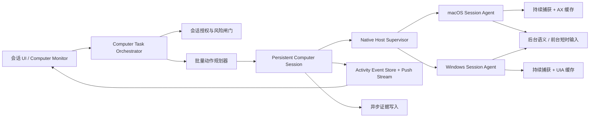

# Computer Use V2：可靠安装、实时控制与人机协同升级计划

> 状态: 实施中 | 最后核对: 2026-08-02

## 1. 文档目标

本计划用于把当前“可选、易失败、依赖反复轮询”的 Computer Use，升级为可作为核心能力交付的桌面操作系统。实施顺序遵循：

1. 先修复正式安装包在 macOS、Windows 上无法启动 Native Host 的问题。
2. 再把一次一截图、一次一动作、同步落审计的慢链路改为持久会话。
3. 再实现目标应用绑定、人机协同、可见控制状态和实时操作日志。
4. 最后通过灰度、指标和自动回退替换现有实现。

本文是开发执行基线。若实施期间改变协议边界、信任模型或平台控制策略，应先补 ADR，再同步更新本文状态。

## 2. 当前问题与结论

### 2.1 已观察到的正式安装故障

| 平台    | 用户侧错误                 | 当前可推断范围                                            | 不能仅凭截图确定的内容                                               |
| ------- | -------------------------- | --------------------------------------------------------- | -------------------------------------------------------------------- |
| macOS   | `native_host_incompatible` | 产物清单、架构、协议、Host 启动或握手中的某一步失败       | 究竟是 manifest、arch、spawn、协议还是 Host 崩溃                     |
| Windows | `native_host_untrusted`    | App、Host、manifest、证书发布者或摘要信任链中的某一步失败 | 究竟是证书状态、thumbprint、hash、安装后文件变化还是本地信任模式冲突 |

当前错误码是“错误大类”，不是可用于排障的根因。产品层直接展示这些内部错误码，只会让用户看到失败而无法自助修复。

### 2.2 现有架构的主要瓶颈

1. **发布验证停在构建目录**：打包脚本会生成并验证 Host，但没有从最终 DMG/NSIS 安装后启动 App、启动 Host、完成协议握手的端到端测试。
2. **错误归因过度折叠**：manifest 解析、版本不匹配、架构不匹配、签名失败、进程启动失败、握手失败等均可能折叠成 `native_host_incompatible` 或 `native_host_untrusted`。
3. **观察链路重复且昂贵**：每步动作前后重复列举窗口、抓全图、读可访问性树、加密证据并写库。
4. **模型调用粒度过细**：通常一次模型决策只产生一个动作，简单的四步 UI 操作需要多轮截图、推理和验证。
5. **全局输入抢占用户**：macOS 当前执行前会聚焦目标窗口，坐标点击和键盘输入使用全局事件，用户无法稳定操作其他应用。
6. **治理在热路径上**：低风险动作仍经过完整的策略、审批对象、证据同步写入链路，增加延迟但没有带来对应的用户价值。
7. **缺少持续会话与控制状态**：Native Host 是无 UI 的 stdio 进程，没有长期捕获会话、系统状态指示、窗口控制标签、暂停/接管入口。
8. **日志协议存在但产品链路未完成**：已有 Computer Use 生命周期事件，但缺少人类可读动作、执行通道和耗时；`computer-use:get-timeline` 当前固定返回“未安装持久化存储”。
9. **等待方式错误**：上层通过多个“Wait for computer task progress”后台任务轮询，既污染会话，又放大超时和竞态。

### 2.3 V2 的核心产品决策

- 使用**持久控制会话**，不再把每一步当成独立的冷启动任务。
- 默认使用**全桌面委托**，Agent 可跟随前台窗口跨应用完成端到端任务；只有用户或调用方显式提供 `targetWindowId` 时才启用单窗口绑定。
- 全桌面委托不生成或检查应用白名单；旧任务合同中的 `allowedApps` 仅为持久化兼容字段并被忽略。应用切换不再触发首次应用审批。
- 默认使用**后台语义操作通道**；只有语义能力不足时，才短暂使用前台全局输入。
- 使用 macOS/Windows 的**系统级捕获/控制状态**加产品自己的跨平台可见标识。
- 安全策略保留，但从“每步审批”改为“会话授权 + 风险动作提交前确认”。
- 操作日志展示“做了什么、结果如何”，不展示模型私有思维链。
- Native Host 不可用时允许能力降级，但不能把降级伪装成任务成功，也不能无提示切换到不等价的网页操作。
- **功能可用性优先**：校验用于阻止真实风险，不得把重复校验、同步审计和保守重试变成普通操作的固定阻碍。
- **一次证明，多次复用**：产物信任、应用身份、目标绑定和会话授权在合理有效期内缓存，不在每个动作上重新做完整验证。
- **失败优先自愈**：非安全边界错误先执行一次有界恢复；只有确定不可恢复或涉及风险升级时才中断用户任务。

### 2.4 可用性与安全性的边界

V2 不是删除所有校验，而是把校验放到正确的位置。以下规则是开发时不可退化的架构约束：

1. **信任校验前置**：App/Host 签名、manifest、hash、协议和架构在 Host 建连时完成，会话内只监听产物或进程身份是否变化。
2. **目标校验会话化**：全桌面任务按当前前台应用/窗口执行；显式单窗口任务才校验固定绑定。应用身份与权限状态在会话开始时确认，未变化时不重复做全量校验。
3. **动作校验轻量化**：低风险动作只验证当前观察与动作目标一致、元素/布局版本仍可用、用户未接管；显式单窗口任务额外验证绑定仍有效，不能同步执行完整审计流程。
4. **风险校验边界化**：只有动作从 L0/L1 跨到 L2/L3/L4 时，才创建审批、阻塞执行或要求用户接管。
5. **审计写入异步化**：除高风险动作关键证据外，数据库、截图加密和详细事件落盘不得阻塞动作返回。
6. **重复校验合并**：同一批动作共享一次策略判断、目标验证和观察基线；平台 Host 与 Broker 不重复做语义相同的全量检查。
7. **未知不等于全部拒绝**：无法获取非关键审计字段时可以降级记录并继续低风险动作；无法证明可执行文件可信、目标仍绑定或用户未接管时必须停止。
8. **恢复必须有界**：缓存刷新、元素重定位、Host 重连各最多自动尝试一次，避免“为了可靠”演变成无限等待。

任何新增校验都必须在 PR 中回答：

- 它防止的具体失败或风险是什么？
- 为什么不能放在安装、建连、会话开始或风险提交边界？
- 是否已有等价校验？
- 失败后能否自动恢复或降级？
- 给普通动作增加多少 P95 延迟和同步 I/O？

## 3. 范围与非目标

### 3.1 本期范围

- macOS 14+，Apple Silicon 与 x64。
- Windows 10/11，x64；Windows arm64 只有在 CI 和实机矩阵完整后才能发布。
- SparkWork 正式签名包、本地开发包和升级安装场景。
- Native Host 产物、信任、握手、观察、执行、日志、控制状态和故障诊断。
- 默认全桌面任务可跟随 Agent 激活的前台应用跨应用执行；显式单窗口任务中，用户操作其他应用时 Agent 继续控制已绑定目标。

### 3.2 非目标

- 不承诺在同一个 macOS/Windows 桌面上，用户和 Agent 同时对两个应用执行任意鼠标、任意键盘操作且完全无冲突。系统全局指针和键盘焦点只有一份。
- 不在 V2 首期支持 Linux 桌面控制。
- 不用隐藏控制状态或绕过系统隐私指示。
- 不向会话 UI 输出模型完整推理过程。
- 不用浏览器 fallback 冒充桌面客户端任务已经完成。

## 4. 目标架构



### 4.1 进程职责

| 组件                   | 职责                                                                            |
| ---------------------- | ------------------------------------------------------------------------------- |
| Renderer               | 展示任务卡、操作日志、控制状态、暂停/继续/接管、诊断与修复入口                  |
| Electron Main          | 会话编排、目标绑定、风险决策、Host 生命周期、事件持久化与推送                   |
| Native Host Supervisor | 产物验证、进程启动、握手、健康检查、崩溃重启、能力协商                          |
| macOS Session Agent    | ScreenCaptureKit 持久流、Accessibility 语义操作、必要时 CGEvent 前台短时输入    |
| Windows Session Agent  | Windows Graphics Capture、UI Automation 语义操作、必要时 SendInput 前台短时输入 |
| Evidence Writer        | 异步加密关键帧与审计数据，不阻塞低风险动作返回                                  |

### 4.2 三种执行通道

```ts
type ComputerExecutionLane = 'semantic_background' | 'foreground_burst' | 'isolated_desktop'
```

#### `semantic_background`

- macOS 使用 AX 元素动作、值写入、选择、滚动。
- Windows 使用 UI Automation Pattern。
- 不主动切换前台应用，不移动系统指针。
- 用户可以正常操作其他应用。
- 这是默认通道，也是“人机协同”成立的基础。

#### `foreground_burst`

- 用于画布、游戏式控件、无可访问性语义的自绘 UI。
- 执行前检查用户是否正在使用目标应用或全局输入是否活跃。
- 保存当前前台应用、焦点元素和指针位置。
- 在短时间窗口内聚焦目标应用，完成一个小批次动作，然后恢复用户现场。
- 状态栏和目标窗口标签必须明确显示“Agent 正在操作”。
- 用户点击目标应用或选择“立即接管”时，300 ms 内停止并释放按键。

#### `isolated_desktop`

- 对“用户和 Agent 都要同时进行任意鼠标键盘操作”的高级场景，使用独立桌面、虚拟机或远程会话。
- 不作为 V2 首期默认能力，但协议和 UI 预留通道。

## 5. 协议与数据模型

### 5.1 细粒度 Host 健康诊断

新增公共诊断码，替代运行时把原因直接折叠成两个大类：

```ts
type NativeHostDiagnosticCode =
  | 'artifact_missing'
  | 'manifest_missing'
  | 'manifest_invalid'
  | 'platform_mismatch'
  | 'architecture_mismatch'
  | 'host_version_unsupported'
  | 'protocol_version_unsupported'
  | 'artifact_hash_mismatch'
  | 'app_signature_invalid'
  | 'host_signature_invalid'
  | 'publisher_mismatch'
  | 'trust_mode_mismatch'
  | 'spawn_denied'
  | 'spawn_failed'
  | 'handshake_timeout'
  | 'handshake_schema_invalid'
  | 'capability_mismatch'
  | 'host_crashed'
  | 'screen_permission_missing'
  | 'accessibility_permission_missing'
  | 'input_permission_missing'
  | 'capture_unavailable'
```

对外保留稳定大类以兼容旧调用方，但必须携带诊断详情：

```ts
interface ComputerUseFailure {
  code:
    | 'native_host_missing'
    | 'native_host_untrusted'
    | 'native_host_incompatible'
    | 'permission_required'
    | 'environment_unavailable'
  diagnosticCode: NativeHostDiagnosticCode
  stage: 'discover' | 'verify' | 'spawn' | 'handshake' | 'permission' | 'capture' | 'execute'
  retryable: boolean
  repairAction?:
    | 'reinstall'
    | 'restart_host'
    | 'grant_permission'
    | 'update_app'
    | 'contact_support'
  details: {
    appVersion: string
    hostVersion?: string
    protocolVersion?: number
    platform: 'macos' | 'windows'
    architecture: 'arm64' | 'x64'
    trustMode?: 'signed' | 'local'
    correlationId: string
  }
}
```

不得包含截图原文、用户输入、文件内容、证书私钥位置或环境变量秘密。

### 5.2 Host 兼容策略

- 构建时 App 与 Host 使用同一个版本源，不允许脚本内分别硬编码 `0.1.0` 和协议 `1`。
- 新增 `packages/protocol/src/computer-use/native-version.ts`：
  - `NATIVE_HOST_SCHEMA_VERSION`
  - `NATIVE_HOST_PROTOCOL_MIN`
  - `NATIVE_HOST_PROTOCOL_MAX`
  - `NATIVE_HOST_BUILD_VERSION`
- 正式包要求 Host build version 与 App 发布清单完全匹配。
- 协议允许当前版本 N 与上一版本 N-1，仅用于应用自动更新切换窗口；超过范围要求更新或重装。
- 握手返回 Host 构建 commit、能力清单和最小/最大协议，不用猜测兼容性。

### 5.3 批量动作协议

```ts
interface ComputerActionBatch {
  batchId: string
  computerSessionId: string
  target: { appId: string; windowId: string }
  lane: ComputerExecutionLane
  summary: string
  actions: Array<{
    actionId: string
    label: string
    action: ComputerAction
    precondition?: ComputerCondition
    postcondition?: ComputerCondition
    onFailure: 'stop' | 'reobserve_and_retry_once' | 'handoff'
  }>
  stopOn: Array<'user_takeover' | 'target_changed' | 'unexpected_dialog' | 'sensitive_input'>
}
```

- 一次模型调用可产生 1–8 个低风险动作。
- Native Host 每步验证前置条件，不盲目执行完整序列。
- 语义动作绑定 `elementId + treeGeneration`。
- 坐标动作绑定 `windowId + boundsVersion + frameTimestamp`，不再要求所有动作严格等于同一个截图 hash。
- 任意可见状态变化超出预期，立即停止批次并重新观察。

### 5.4 用户可见操作事件

```ts
interface ComputerActivityEvent {
  id: string
  seq: number
  sessionId: string
  computerSessionId: string
  batchId?: string
  actionId?: string
  timestamp: string
  phase: 'preflight' | 'observe' | 'plan' | 'act' | 'verify' | 'repair'
  status: 'queued' | 'running' | 'succeeded' | 'failed' | 'paused' | 'canceled'
  label: string
  targetLabel?: string
  lane?: ComputerExecutionLane
  durationMs?: number
  error?: Pick<ComputerUseFailure, 'code' | 'diagnosticCode' | 'retryable' | 'repairAction'>
  evidencePreviewId?: string
}
```

示例：

- “读取 SparkWork 当前界面”
- “打开会话主题选择器”
- “切换到星图工作台”
- “确认主题标题、背景和卡片样式”

这些内容来自动作类型、可访问性元素名称和简短任务摘要，不包含模型私有推理。

## 6. 分阶段实施计划

### Phase 0：建立基线与冻结发布

**目标**：在不知道真实根因时，不继续用零散补丁发布。

> 实施进度（2026-07-31）：只读诊断 IPC/MCP、Beta 标识、细粒度阶段归因与无内容指标采集已落地；macOS/Windows 失败安装包样本和真实四步任务基线仍等待 Phase 1 发布基建签收，不能以单元测试数据冒充真实基线。

#### 任务

1. 收集一份 macOS 失败包和一份 Windows 失败包的：
   - App 版本、OS 版本、CPU 架构；
   - manifest；
   - App 与 Host 签名摘要；
   - Host 启动 stderr；
   - 握手阶段与 correlationId。
2. 增加只读诊断命令 `computer-use:diagnose-native-host`。
3. 建立当前版本的冷启动、首次权限、简单四步任务性能基线。
4. 在 P0 门禁完成前，正式版将 Computer Use 标记为 Beta，失败时提供“查看诊断/复制诊断”，不再输出生硬的内部兜底叙述。

#### 验收

- 同一个失败能稳定定位到一个 `diagnosticCode + stage`。
- 日志可以区分“产物不可信”和“Host 已可信但握手失败”。
- 不需要用户打开开发者工具才能获取诊断。

#### 已落地的基线采集口径

- `native_host_capability_ms`：从首次请求到可信 Host capability handshake 完成；失败同样计数。
- `permission_request_ms`：首次屏幕录制/辅助功能权限请求耗时。
- `observation_ms`：观察链路（窗口选择、Host 观察、证据内存可见）耗时。
- `action_ms`：单动作执行与 after observation 总耗时。
- 预留 `takeover_stop_ms`、`four_step_task_ms`，由 Phase 4/5 的真实转换点写入。
- 所有指标只按 platform、architecture、App version、Host version、trust mode 分桶，不采集截图、输入文本、目标内容或用户数据。

### Phase 1：P0 正式安装包可靠性

**目标**：macOS/Windows 正式安装后 Native Host 启动成功率达到 99.9%，否则禁止发布。

> 实施进度（2026-08-01）：自主发布门禁代码已落地。App wire、macOS/Windows manifest 与 `native-host-build.json` 共用 `packages/protocol/src/computer-use/native-version.json`；build provenance 记录平台、架构、协议范围、Host 版本、commit、trust mode 与生成时间。两平台独立验证器会复算最终 Host bytes、拒绝 symlink/架构/版本漂移，校验签名身份与时间戳/公证，并由最终 Electron App 在隔离 user-data 下完成受信任父进程 `get_capabilities` handshake。验证器同时接入 `afterSign`（安装器生成/上传前硬阻断）与 release wrapper（二次防线）。macOS 还会通过 `ditto` 安装到临时 Applications 目录后再次验证。真实 DMG 挂载安装、NSIS 静默安装、干净 VM/非 ASCII 用户/Defender/SmartScreen/升级卸载与 100 次黄金任务仍须发布 CI/真机执行，不以本机或 mock 结果代替。

#### 1.1 统一版本与产物布局

修改：

- `packages/protocol/src/computer-use/native-version.ts`（新增）
- `apps/desktop/scripts/package-native-host.js`
- `apps/desktop/scripts/package-windows-native-host.js`
- `apps/desktop/src/main/services/computer-use/NativeHostArtifact.ts`
- `apps/desktop/src/main/services/computer-use/NativeHostBackendFactory.ts`

要求：

- 删除构建脚本和原生项目里的重复版本常量。
- 生成 `native-host-build.json`，记录平台、架构、协议范围、commit、构建模式。
- manifest 必须在所有会改变 Host bytes 的签名步骤完成后生成。
- 最终安装包再验证一次实际 bytes 与 manifest hash。

#### 1.2 macOS 发布门禁

新增 `apps/desktop/scripts/verify-packaged-native-host-macos.js`：

1. 验证 `.app/Contents/Helpers/SparkComputerHost` 存在、权限为 `0755`、非符号链接。
2. 验证架构与 Electron App 当前 slice 一致。
3. 对 App 与 Host 执行严格 codesign 验证。
4. 校验 Host identifier、Team ID、hardened runtime 和 manifest。
5. 从最终 `.app` 启动 Host，完成 `get_capabilities` 握手。
6. 在公证后验证 stapled ticket 和最终 Host hash。
7. 将 App 安装到临时 Applications 目录后再执行一次启动验证。

架构调整：

- 新增签名的 `SparkComputerSessionAgent.app`，设置 `LSUIElement=1`。
- Session Agent 负责 ScreenCaptureKit 会话和状态菜单；stdio Host 只作为 Electron 与 Session Agent 的受控桥接。
- 若先做止血，可保留现有 CLI Host，但必须在 Phase 3 前完成 Session Agent 拆分。

#### 1.3 Windows 发布门禁

新增 `apps/desktop/scripts/verify-packaged-native-host-windows.js`：

1. 从 NSIS 安装产物静默安装到干净 Windows Sandbox/VM。
2. 验证 App、Host、独立 Node runtime 均存在。
3. 校验三者 Authenticode 状态、SHA-256 发布者指纹和 RFC 3161 时间戳策略。
4. 校验 manifest 指纹和最终 Host bytes。
5. 以普通用户启动 Host，完成 `get_capabilities` 握手。
6. 覆盖 Windows Defender 开启、SmartScreen 默认、非管理员安装路径和含空格用户名。
7. 完成测试后正常卸载并确认无残留 Host 进程。

信任策略：

- 正式发布只接受公开受信任、与 App 同发布者的证书。
- 自签名/本地信任只允许开发渠道，manifest 和 UI 必须显示 `local`，不能进入正式更新通道。
- 运行时不要仅依赖根证书状态判断“同发布者”；分别报告签名存在、链状态、发布者匹配和 hash 匹配。

#### 1.4 安装与升级测试矩阵

| 场景              | macOS                      | Windows                    |
| ----------------- | -------------------------- | -------------------------- |
| 全新安装          | arm64、x64                 | x64                        |
| 覆盖升级          | N-1 → N                    | N-1 → N                    |
| 自动更新          | 更新前会话关闭、更新后重连 | 更新前会话关闭、更新后重连 |
| 非管理员用户      | 标准账户                   | 标准账户                   |
| 非 ASCII 用户名   | 必测                       | 必测                       |
| 权限拒绝后重试    | 屏幕录制、辅助功能         | UIA/捕获可用性             |
| Host 被隔离/删除  | 可诊断、提示重装           | 可诊断、提示修复           |
| manifest 被修改   | 拒绝并精确报告             | 拒绝并精确报告             |
| Host bytes 被修改 | 拒绝并精确报告             | 拒绝并精确报告             |

#### Phase 1 验收

- 最终 DMG/NSIS 的安装后 Host smoke test 是 release blocking job。
- macOS 截图问题不再只显示 `native_host_incompatible`。
- Windows 截图问题不再只显示 `native_host_untrusted`。
- 用户能从诊断页执行“重启 Host”“打开权限设置”或“重新安装匹配版本”。
- 不允许失败后自动把桌面任务改成网页任务并宣称等价完成。

### Phase 2：持久 Host 与低延迟观察链路

**目标**：消除每动作冷启动、重复全量观察和同步证据写入。

#### 2.1 Host Supervisor 状态机

新增：

- `apps/desktop/src/main/services/computer-use/NativeHostSupervisor.ts`
- `apps/desktop/src/main/services/computer-use/NativeHostHealthService.ts`

状态：

```text
absent → verifying → starting → handshaking → ready
                                      ↓
                         degraded / restarting / failed
```

- App 启动后惰性预热；首次打开 Computer Use 时保证 Host 已 ready。
- 心跳 5 秒一次，连续 3 次失败才重启。
- 会话中崩溃最多自动重启 1 次；重启后必须重新绑定目标和观察，绝不续执行旧动作。
- 退出 App 或用户停止控制时释放输入、捕获流和权限会话。

#### 2.2 持续捕获与增量可访问性树

> 实施进度（2026-08-01）：持久视觉捕获与可访问性事件缓存代码已落地并默认启用。`observe` 增加向后兼容的可选 `persistentCapture` 扩展；环境 opt-out 或 runtime rollback 后下一请求自动回到旧单帧路径。macOS 使用按 app/window/PID/代码身份绑定的 `SCStream`，Windows 使用按 HWND/进程/可执行身份绑定的 WGC 长会话；两端都只接受本次 observe 单调时钟起点之后的新帧，队列有界，目标/flag/cancel 变化立即释放，启动或 2 秒取帧失败最多回退一次既有单帧路径。AXObserver 与 UIA event handler 以目标身份、订阅状态、事件 generation 和 1 秒最大年龄共同决定树缓存复用；目标变化、事件、动作执行或超时都会强制重新遍历。Swift 43 项、Rust 23 项、Windows x64/arm64 `clippy -D warnings` 与 TS/协议聚焦回归通过。SCContentSharingPicker 和真实平台 CPU/P95 预算仍是发布签收项。

macOS：

- 用 `SCStream` 替代每次 `SCScreenshotManager.captureImage`。
- 使用 `SCContentSharingPicker` 选择并持久绑定窗口。
- 内存中保留最近 2–3 帧的有界 ring buffer。
- 使用 `AXObserver` 监听焦点、值、窗口和布局变化。
- `MacAccessibilityController.observe` 支持按目标 window 获取树，不要求它必须是全局 focused window。

Windows：

- 使用 Windows Graphics Capture 持久帧池。
- 使用 UI Automation event handler 构建增量元素缓存。
- 窗口句柄变化或应用重启时使绑定失效并请求用户确认重绑。

#### 2.3 异步证据

- 动作返回只等待内存中的 after state，不等待图片加密和 SQLite 提交。
- `ComputerObservationEvidenceStore` 改为有界队列后台写入。
- 关键帧必须保留：会话开始、高风险动作前后、失败、最终验证。
- 连续低风险动作只保留批次首尾和发生异常的帧。
- 队列满时丢弃非关键中间帧并上报指标，不阻塞输入线程。

#### Phase 2 验收

- 已授权机器会话启动 P95 < 2 秒。
- 获取最新可用观察 P95 < 250 ms。
- 后台语义动作本地执行 P95 < 300 ms，不含模型推理。
- Host 空闲 CPU < 2%，捕获时平均 CPU 和内存有明确平台预算。
- 任意退出路径不会遗留按键按下、鼠标锁定或孤儿 Host。

### Phase 3：动作批处理与模型决策加速

**目标**：简单任务不再每一步都进行完整模型往返。

#### 任务

1. 在 `ComputerDecisionAdapter.ts` 增加 `ComputerActionBatchSchema`。
2. 对 OpenAI/Claude 原生 Computer Use 能力使用对应原生协议；其他模型使用紧凑通用 schema。
3. 首轮发送裁剪后的可交互元素、目标窗口图像和任务合约。
4. 后续优先发送：
   - 图像差分或最新关键帧；
   - AX/UIA tree delta；
   - 已完成步骤与失败条件；
   - 不重复发送 100k–200k 字符的完整树。
5. `ComputerTaskOperator.ts` 执行一个 batch，并将每步事件推送给 UI。
6. 只有状态超出预期、元素失效、出现对话框或批次结束时才重新请求模型。
7. 为常见动作提供确定性本地恢复：
   - 元素短暂失效：按稳定属性重新定位一次；
   - 窗口移动：刷新 bounds 后重算坐标；
   - 加载中：等待平台事件，不轮询模型；
   - 目标应用崩溃：停止并请求用户重开。

#### 验收

- “打开选择器 → 选择主题 → 确认结果”最多 2 次模型调用。
- 同类四步任务总耗时相比当前基线降低至少 50%。
- 任何 batch 不超过 8 步、15 秒或一次风险边界。
- 批次中某步失败时，后续动作不会继续盲执行。

### Phase 4：人机协同与可选目标隔离

**目标**：用户操作其他应用时，不影响 Agent 操作其目标应用。

> 实施进度（2026-08-02）：execution lane、macOS/Windows 输入冲突、系统 Tray/产品控制卡、AppControlBridge、精确窗口绑定/picker 均已落地。MCP `start_task` 默认全桌面委托：未提供 `targetWindowId` 时不绑定启动瞬间的 Spark 窗口，可跟随前台窗口跨应用执行；不生成、不检查应用白名单，旧 `allowedApps` 值仅作协议兼容并被忽略。显式目标任务只绑定精确窗口，不再要求目标应用预先出现在任务合同中。初始前台仍是 Spark 自身时只做一次性截图，不创建持续捕获；切入外部目标进程后才启用持续捕获。Agent turn 手动终止以及 operator 成功/失败都会下发 Native Host `cancel_session`，清除目标绑定并停止持续捕获。Windows Host 使用低级键鼠 Hook 区分真实输入与 SendInput 注入，目标窗口真实输入 fail-closed 为 `handoff_required`，其他应用输入只延后前台输入；拖拽、组合键与长文本逐步复核接管状态并由释放守卫清理按键。代码/交叉编译验收完成；真实签名 Windows 桌面的 20 个后台动作、状态一致性与接管 P50/P95/P99（P99 < 300 ms）仍列为发布签收门禁。

#### 4.1 全桌面委托与可选目标绑定

- 默认任务不绑定启动时恰好聚焦的窗口，按当前前台窗口跨应用执行。
- 用户通过系统 picker、产品窗口选择器或 `targetWindowId` 显式限定目标时，才绑定精确窗口；此类会话只允许操作绑定目标，但换绑时可选择任意可见应用窗口。
- 默认任务状态标签显示“所有应用”；显式窗口任务显示绑定窗口，标签可点击打开控制面板。
- 主状态栏/菜单栏显示“正在控制：应用名”，提供暂停、停止、接管。

#### 4.2 输入冲突规则

| 用户行为                                   | Agent 行为                             |
| ------------------------------------------ | -------------------------------------- |
| 用户操作其他应用，Agent 处于后台语义通道   | 继续执行                               |
| 用户操作其他应用，Agent 需要前台短时输入   | 等待全局输入空闲窗口，显示即将短暂接管 |
| 用户点击目标应用                           | 立即暂停，视为接管                     |
| 用户移动鼠标但未进入目标应用               | 后台语义通道不受影响；前台短时输入延后 |
| 用户按全局“停止控制”快捷键                 | 300 ms 内取消、释放按键、停止流        |
| Agent 遇到密码、支付、系统权限或不可逆提交 | 暂停并请求用户完成/确认                |

#### 4.3 SparkWork 内部应用桥

对于 SparkWork 自身或可集成的受控应用，优先实现应用内 `AppControlBridge`：

- 通过受认证的本地 IPC 调用稳定 command，而不是坐标点击。
- command 返回语义结果和 UI revision。
- UI 仍显示操作箭头/高亮，让用户知道 Agent 操作了哪里。
- Bridge 不是通用后门，只暴露白名单 command，并绑定当前 Computer Session。

这条路径能提供最好的并行性、速度和确定性，应优先覆盖主题切换、导航、表单填充等自有应用场景。

#### Phase 4 验收

- Agent 在目标应用执行 20 个后台语义动作期间，用户可在另一应用连续输入，无焦点跳转、无字符串入。
- 用户接管目标应用后，Agent P99 在 300 ms 内停止。
- 前台短时输入结束后恢复原前台应用和指针位置；恢复失败时明确提示。
- 系统状态、产品状态和实际会话状态一致，不出现“显示已停止但仍在输入”。

### Phase 5：可见控制状态与会话操作日志

**目标**：达到“系统知道正在被控制、应用知道正在被控制、用户知道 Agent 正在做什么”的体验。

> 实施进度（2026-07-31）：5.2 会话日志链路已完成持久化 Event Store、14 类生命周期事件、实时推送、Renderer 重启回放、`computerSessionId + seq` 去重排序与独立 `ComputerActivityBlock`；5.1 系统级状态/Overlay 和 5.3 上层去轮询仍随 Phase 4/7 推进，因此 Phase 5 整体保持实施中。

#### 5.1 系统级状态

macOS：

- 由长期存活的 Session Agent 持有 ScreenCaptureKit 会话。
- 使用系统选择器和系统提供的屏幕捕获状态，不伪造 macOS 紫色状态标识。
- 菜单栏状态项提供当前目标、暂停、停止和打开 SparkWork。

Windows：

- 使用透明、不可激活、点击穿透的目标窗口边框/标签。
- 托盘状态提供当前目标、暂停、停止和诊断。
- 不依赖修改被控制应用自身 UI。

跨平台：

- 在目标窗口左上角或边缘显示“Agent 控制中”标签。
- 最近一次点击显示 500–800 ms 的指针箭头/波纹；敏感区域不显示文本。
- Overlay 必须不抢焦点、不拦截用户点击，并跟随窗口移动、缩放、最小化。

#### 5.2 会话日志链路

修改：

- `packages/protocol/src/computer-use/events.ts`
- `packages/protocol/src/computer-use/ipc.ts`
- `apps/desktop/src/main/ipc/registerComputerUseIpc.ts`
- `apps/desktop/src/renderer/design/services/event-mapper.ts`
- `apps/desktop/src/renderer/design/views/ChatView.tsx`

新增：

- `packages/storage/migrations/064_computer_use_activity_events.sql`
- `apps/desktop/src/main/services/computer-use/ComputerActivityEventStore.ts`
- `apps/desktop/src/renderer/design/components/ComputerActivityBlock.tsx`
- `stream:computer-use:activity-event` 推送通道。

行为：

- `computer-use:get-timeline` 从数据库回放，不再固定报错。
- Event Store 先落轻量事件，再异步关联 evidence preview。
- Renderer 按 `computerSessionId + seq` 合并回放与实时事件，去重并保证顺序。
- 一条用户任务只显示一个 Computer Use 卡片，不生成多个后台等待任务卡。
- 默认展示用户级步骤；展开后显示 lane、耗时、重试、失败码和证据缩略图。
- 任务完成后折叠成最终步骤摘要，失败时保留失败点与修复动作。

#### 5.3 去除轮询噪声

- 删除上层“Wait for computer task progress”式循环。
- 启动调用返回 `computerSessionId` 和 completion promise/订阅句柄。
- Orchestrator 通过事件流等待完成、失败、暂停或用户输入。
- 超时由会话状态机统一管理，不再通过创建另一个 Agent 任务等待。

#### Phase 5 验收

- Native Host 动作开始后 200 ms 内，会话区出现对应运行中日志。
- 日志顺序与真实执行顺序一致，重启 Renderer 后可完整回放。
- 用户能从失败日志直接执行建议的修复动作。
- 会话不再出现多个“后台任务已完成/再等一轮”的卡片。

### Phase 6：治理瘦身与风险闸门

**目标**：安全能力保留，但不拖慢普通操作。

> 实施进度（2026-08-02）：会话任务合同承载 L0/L1 会话授权；默认全桌面任务允许跨应用执行，显式 `targetWindowId` 任务才应用精确窗口隔离。应用白名单及“新应用首次动作升档”已移除；普通导航/输入不创建审批。L2/L3 继续使用 digest-bound 单次 ticket，L4/unattended 继续 handoff。`codex-full-access` / `claude-bypass` 跳过逐动作审批，但仍保留系统权限、Host 信任、敏感凭据和不可逆动作边界。低风险证据保持异步，高风险动作在 ticket 消费和 backend 执行前同步 flush 当前 before-frame；落盘失败 action blocked、ticket 不消费。

#### 新策略

| 风险 | 示例                                 | 默认处理                 |
| ---- | ------------------------------------ | ------------------------ |
| L0   | 观察、滚动、移动                     | 会话授权后自动执行       |
| L1   | 普通点击、非敏感输入、应用内设置     | 会话授权后自动执行并记录 |
| L2   | 发送消息、上传文件、保存覆盖、发布   | 在最终提交前一次确认     |
| L3   | 支付、删除、权限变更、安装执行       | 精确动作确认或用户接管   |
| L4   | 密码、验证码、生物识别、系统安全设置 | 必须用户接管             |

#### 实施

- 会话开始时用户一次性确认全桌面或显式单窗口范围及 L0/L1 权限。
- 对 batch 先做一次静态策略判断；只有跨风险边界时拆 batch。
- 审批对象只为 L2/L3 创建，低风险步骤不创建空审批记录。
- 审计写入使用异步批量提交；高风险 before frame 保持同步落盘。
- 所有权限模式均不使用应用白名单；Full Access 额外取消 L2/L3 逐动作弹窗。显式单窗口范围、系统权限、Host 信任、敏感凭据与不可逆动作边界仍保留。

#### 校验分层与缓存

| 校验                            | 执行时机          | 缓存/失效条件                                           | 是否阻塞普通动作               |
| ------------------------------- | ----------------- | ------------------------------------------------------- | ------------------------------ |
| Host 文件、签名、hash、manifest | Host 建连前       | Host path、mtime、inode/file ID、App 版本变化时失效     | 仅首次建连                     |
| 协议与能力握手                  | Host 建连/重连    | Host 进程退出或版本变化时失效                           | 仅首次建连                     |
| 屏幕录制、AX/UIA、输入权限      | 会话 preflight    | OS 权限变化事件、能力调用明确返回 denied 时失效         | 仅缺少本次所需能力时           |
| App 身份和窗口绑定              | 会话开始/目标重绑 | PID、签名身份、window handle 或绑定 revision 变化时失效 | 目标未变化时不阻塞             |
| 策略与数据风险                  | batch 规划后      | batch 内容、目标或数据类别变化时失效                    | L0/L1 不审批                   |
| 元素/布局新鲜度                 | 每个动作          | 使用轻量 generation/revision                            | 只做毫秒级判断                 |
| 截图加密、详细审计、指标        | 动作后异步        | 无                                                      | 否                             |
| 最终任务验证                    | batch/任务结束    | 结果状态变化时重做                                      | 不阻塞已经完成的低风险中间动作 |

#### 热路径预算

- L0/L1 单动作的本地校验预算 P95 ≤ 20 ms。
- 一个 batch 最多进行一次策略分类和一次目标身份检查。
- 动作热路径同步 SQLite transaction 数为 0；高风险提交前关键证据除外。
- 不允许每个动作重新验证 Host 文件签名、重新列举全部窗口或重新读取完整可访问性树。
- 同一失败不得同时在 Decision Adapter、Broker 和 Native Host 各重试一次；由 Session Orchestrator 统一拥有重试预算。
- 可恢复错误自动恢复成功时，只在操作日志中显示一次“已恢复”，不弹阻断对话框。
- 非关键观测能力缺失时按能力降级，例如无 AX/UIA 时转视觉通道；不能直接把整个 Computer Use 判为不可用。

#### 验收

- L0/L1 动作不出现审批对话框。
- L2/L3 在真正外部副作用发生前拦截，而不是在打开页面时提前打断。
- 安全回归测试全部通过，且低风险热路径 DB 写入次数显著下降。
- 普通动作不会重复验证 Host 签名、manifest、App 身份和全量窗口列表。
- 因内部校验重复、审计写入或审批对象创建导致的 L0/L1 任务失败率 < 0.1%。
- 可恢复的 stale element、窗口移动和 Host 短暂断连，自动恢复成功率 ≥ 90%。
- 每项仍处于热路径的同步校验都有明确风险说明、耗时指标和唯一责任组件。

### Phase 7：灰度、迁移与删除旧链路

> 实施进度（2026-08-01）：统一 `ComputerUseV2FlagStore` 已接管 Supervisor、持久捕获、增量树、批处理、诊断、后台语义、Timeline 与可见控制标识；全部已落地 V2 链路默认启用，环境变量可显式关闭，运行期指标只回退关联单项。`ComputerUseV2RolloutController` 使用有界样本和最小样本门槛评估 Host 崩溃、安装制品错误、错误动作、接管 P99 与持续捕获预算。Supervisor 回退会释放持久连接并切回基础单连接路径，batch 回退下一决策轮生效。Agent `wait_for_completion` 使用事件等待，系统提示明确禁止轮询 `get_status` 或创建后台等待任务。跨版本 Beta 百分比与两个稳定版本后删旧链路属于发布运营签收。

#### Feature Flags

```text
computerUseV2.hostSupervisor
computerUseV2.installedArtifactDiagnostics
computerUseV2.persistentCapture
computerUseV2.actionBatch
computerUseV2.backgroundSemanticLane
computerUseV2.activityTimeline
computerUseV2.visibleControlIndicator
computerUseV2.incrementalTree
```

#### 灰度顺序

1. 内部开发包：诊断 + 安装门禁。
2. 内部签名包：持久 Host + 持续捕获。
3. 5% Beta：日志与后台语义通道。
4. 25% Beta：动作批处理。
5. 100%：V2 默认，旧链路仅作一版只读回退。
6. 连续两个稳定版本后删除旧轮询与单动作热路径。

#### 自动回退条件

满足任一条件，关闭对应 flag，不降级整个 Computer Use：

- Host 崩溃率 > 0.5% 会话。
- `native_host_incompatible/untrusted` 合计 > 0.1% 已安装设备。
- 用户接管停止 P99 > 500 ms。
- 错误动作率高于旧版基线。
- 持续捕获导致平台预算超限。

## 7. 代码改造清单

| 工作包              | 主要文件                                                                                       | 结果                              |
| ------------------- | ---------------------------------------------------------------------------------------------- | --------------------------------- |
| WP1 诊断模型        | `packages/protocol/src/computer-use/errors.ts`、`NativeHostArtifact.ts`、`NativeHostClient.ts` | 每个失败有 stage、根因、修复动作  |
| WP2 发布门禁        | `apps/desktop/scripts/package-*.js`、`after-pack.js`、`notarize.js`、新增 verifier             | 最终安装包握手测试                |
| WP3 Host Supervisor | 新增 `NativeHostSupervisor.ts`、改 `NativeHostBackendFactory.ts`                               | 持久连接、健康检查、受控重启      |
| WP4 平台会话        | macOS Swift Host、Windows Rust Host                                                            | 长期捕获、增量 AX/UIA、状态控制   |
| WP5 执行通道        | 平台 Host、native wire protocol                                                                | background/foreground lane 和接管 |
| WP6 批量规划        | `ComputerDecisionAdapter.ts`、`ComputerTaskOperator.ts`                                        | 1–8 步 batch、差分观察            |
| WP7 证据异步化      | `ComputerObservationEvidenceStore.ts`、`ComputerControlBroker.ts`                              | 关键帧同步、普通帧异步            |
| WP8 时间线          | migration 064、events/ipc、event mapper、ChatView                                              | 实时可回放操作日志                |
| WP9 控制状态 UI     | 新增 Session Agent、Overlay、Monitor UI                                                        | 系统状态、窗口标签、箭头、暂停    |
| WP10 治理瘦身       | `ComputerPolicyService.ts`、`ComputerActionApprovalPresenter.ts`                               | 会话授权与风险提交闸门            |

任何现有文件超过 3000 行时，不继续堆叠：

- `ChatView.tsx` 只增加 block 接入，具体 UI 放到 `ComputerActivityBlock.tsx`。
- `registerComputerUseIpc.ts` 将诊断、timeline、session control 分拆到独立 registrar。
- Native Host 将 capture、accessibility/UIA、overlay、session state 分模块。

## 8. 测试策略

### 8.1 单元与协议测试

- manifest 所有诊断分支逐一覆盖。
- App/Host 版本范围、架构、平台、trust mode 组合测试。
- Host framing：半包、粘包、超大包、错误 schema、stderr 洪泛、超时、崩溃。
- Action batch：前置条件失败、批次中断、重观察、风险边界拆分。
- Timeline：回放 + 实时去重、乱序恢复、Renderer 重启。
- Policy：L0–L4 和敏感输入回归。

### 8.2 平台集成测试

macOS：

- ScreenCaptureKit picker、授权拒绝/撤销/重授。
- AX 后台操作不激活目标应用。
- CGEvent 前台短时输入保存/恢复现场。
- 多显示器、Retina 缩放、Spaces、窗口最小化、应用重启。

Windows：

- Authenticode 正常、无签名、错误发布者、证书链异常、hash 被改。
- UIA 后台 Pattern 与 SendInput fallback。
- 100%/125%/150% 缩放、多显示器、UAC 边界、窗口重建。
- Defender/SmartScreen 默认配置。

### 8.3 故障注入

- Host 在观察中和动作中崩溃。
- 捕获流断开。
- 权限在会话中被撤销。
- App 自动更新替换 Host。
- 用户快速切换前台、移动鼠标、按键。
- 目标窗口移动、关闭、重开、弹出意外对话框。
- Evidence 队列满、磁盘满、数据库暂时忙。

### 8.4 端到端黄金任务

每个平台至少固化以下任务：

1. 打开目标应用并切换主题。
2. 在表单中填入非敏感内容并保存草稿。
3. 用户在另一应用持续输入时，Agent 在目标应用完成后台语义操作。
4. 任务中出现 L2 提交，确认后继续。
5. 用户在中途接管，Agent 立即停止。
6. Host 不可用，诊断页准确给出根因和修复动作。

## 9. 质量指标与发布 SLO

| 指标                                               | 发布目标              |
| -------------------------------------------------- | --------------------- |
| 最终安装包 Host 启动并握手成功率                   | ≥ 99.9%               |
| `native_host_incompatible + native_host_untrusted` | < 0.1% 活跃设备       |
| 已授权会话启动 P95                                 | < 2 s                 |
| 最新观察获取 P95                                   | < 250 ms              |
| 本地后台语义动作 P95                               | < 300 ms              |
| 四步普通任务总耗时                                 | 比当前基线降低 ≥ 50%  |
| 操作事件到 UI P95                                  | < 200 ms              |
| 用户接管停止 P99                                   | < 300 ms              |
| 后台语义模式对其他应用焦点干扰                     | 0                     |
| L0/L1 审批弹窗数                                   | 0                     |
| L0/L1 本地校验开销 P95                             | ≤ 20 ms/动作          |
| 校验/审计基础设施导致的 L0/L1 失败率               | < 0.1%                |
| 可恢复平台错误自动恢复成功率                       | ≥ 90%                 |
| 单动作同步 SQLite transaction 数                   | 0，高风险关键证据除外 |
| Host 崩溃后盲目续执行动作数                        | 0                     |

所有指标按平台、架构、App 版本、Host 版本、trust mode 分桶；不采集截图内容和输入文本。

## 10. 开发顺序、依赖与工作量

推荐 2–3 名工程师并行，约 6–8 周；单人完整实施预计 10–14 周。P0 不受该总工期约束，应优先独立发布。

| 周期      | 工作包                          | 依赖       | 建议投入   |
| --------- | ------------------------------- | ---------- | ---------- |
| 第 1 周   | WP1 诊断、WP2 最终安装包门禁    | 无         | 8–12 人日  |
| 第 2 周   | WP3 Supervisor、统一版本协议    | WP1        | 6–8 人日   |
| 第 2–4 周 | WP4 macOS/Windows 持久会话      | WP2、WP3   | 16–24 人日 |
| 第 3–5 周 | WP5 执行通道、接管规则          | WP4        | 12–18 人日 |
| 第 4–5 周 | WP6 批量规划、WP7 证据异步化    | WP3        | 12–16 人日 |
| 第 4–6 周 | WP8 时间线、WP9 状态 UI         | WP3、WP4   | 14–20 人日 |
| 第 6–7 周 | WP10 治理瘦身、全平台 E2E       | 前述工作包 | 10–15 人日 |
| 第 8 周   | Beta 灰度、指标修正、旧链路收敛 | 全部       | 5–8 人日   |

若只能单线开发，严格按以下顺序：

```text
诊断 → 安装包门禁 → Supervisor → 持久捕获 → 后台语义通道
→ Timeline → 批量动作 → 前台短时输入 → Overlay → 治理瘦身
```

不要先做漂亮的箭头和标签，再继续依赖不可启动的 Host。

## 11. 发布阻断清单

以下任一项未通过，不得把 Computer Use 标为正式可用：

- [ ] macOS 最终 DMG 安装后 Host 握手通过。
- [ ] Windows 最终 NSIS 安装后 Host 握手通过。
- [x] App、Host、manifest 的版本来自同一构建源。
- [x] 签名、hash、协议、架构错误均能显示独立诊断。
- [ ] 首次权限、拒绝后重试、撤销权限流程通过。
- [ ] 用户接管在 300 ms 内停止且释放全部输入。
- [x] Timeline 可实时展示并在重启后回放。
- [x] L0/L1 无审批，L2/L3 在副作用发生前拦截。
- [x] Host 信任、目标绑定和权限结果按失效条件缓存，不在每个动作重复全量校验。
- [ ] L0/L1 动作达到 20 ms 校验预算且没有同步审计写入。
- [x] stale element、窗口移动和 Host 短暂断连具有统一、有界的自动恢复。
- [x] 不把不等价网页 fallback 标为桌面任务成功。
- [x] 关键 SLO 已接入版本分桶指标和告警。
- [ ] macOS/Windows 黄金任务在干净 VM 连续通过 100 次。

## 12. 完成定义

Computer Use V2 只有同时满足以下条件才算完成：

1. 用户安装正式包后无需手工修补 Native Host。
2. 两个平台的失败都能定位、解释和修复，不再只有大类错误码。
3. Agent 对目标应用的普通语义操作不会抢走用户在其他应用中的焦点。
4. 需要全局输入时有明确状态、短时执行、现场恢复和用户接管。
5. 会话区持续显示真实操作步骤、状态、耗时和失败点。
6. 简单多步任务使用批量动作，性能达到本计划 SLO。
7. 安全边界从逐步打断改为会话授权和风险提交闸门。
8. Host 信任、目标和权限等稳定事实只在建连或失效时重验，不在动作热路径反复证明。
9. 普通操作遇到非安全性短暂错误时可以自动恢复，不用让用户处理内部技术问题。
10. 系统状态指示、窗口标签、控制面板和实际 Host 会话保持一致。
11. 最终安装包 E2E 成为强制发布门禁。
12. 旧轮询等待链路和固定失败的 timeline handler 已删除。

## 13. 实施期间需同步更新的文档

- `docs/COMPUTER_USE_PLAN.md`：V2 开始实施时更新总体路线和状态。
- `docs/design/computer-control-broker-design.md`：更新 Supervisor、batch、execution lane 和异步证据边界。
- `docs/design/computer-use-threat-model.md`：更新会话授权、overlay、AppControlBridge 与 isolated desktop 威胁。
- `docs/design/macos-native-host-design.md`：更新 Session Agent、SCStream、AXObserver 和系统状态设计。
- 新增 Windows 持久 Host 设计文档，避免平台差异继续隐藏在实现中。
- 新增 ADR：选择“后台语义优先 + 前台短时输入 + 隔离桌面预留”的三通道执行模型。
