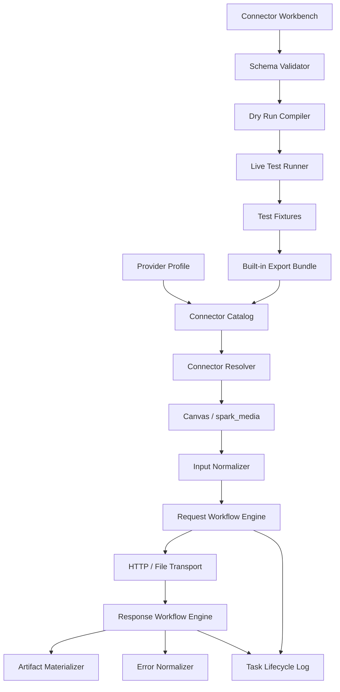

# 多媒体自定义连接器协议与配置工作台实施计划

> 状态: 待开发 | 最后核对: 2026-08-04

## 1. 目标

将当前“内置 Provider adapter + 内置 MediaModelManifest”的多媒体接入方式，扩展为一套可配置、可测试、可导入导出的多媒体连接器运行时（Media Connector Runtime）。

用户可以通过配置工具完全定义一个多媒体模型的协议契约，包括：

- 画布输入、Prompt、媒体文件和模型参数如何映射到供应商请求。
- 模型参数的类型、默认值、枚举值、范围、互斥关系和条件规则。
- 请求 URL、HTTP method、Query、Header、鉴权方式和请求体。
- JSON、form、multipart、binary 等请求编码，以及文件上传和多步骤请求。
- 同步响应的字段结构、产物类型和产物提取方式。
- 异步任务提交响应、轮询地址、轮询 method、轮询请求体和状态机。
- URL、Base64、Data URL、Binary、文本等返回产物的落盘方式。
- Provider 错误结构、错误码、错误消息、参数名、重试性和内部错误归一。
- 连接器测试样例、请求/响应快照、测试结果和版本。

同一份配置必须同时驱动画布、`spark_media` skill/MCP、模型参数面板、请求编译器、媒体路由、任务日志和错误提示。

## 2. 背景与现状

项目已经存在一部分可复用基础：

- [`MediaModelManifest`](/Users/zhangyang/spark_ai_project/Spark-Agent/packages/protocol/src/media-model-manifest.ts) 描述模型能力、输入输出、参数 Schema、请求模板、结果提取和错误契约。
- [`media-model-contract.ts`](/Users/zhangyang/spark_ai_project/Spark-Agent/packages/protocol/src/media-model-contract.ts) 已包含参数映射、透传、值转换、禁止字段、冲突和错误归一类型。
- [`media-request-compiler.ts`](/Users/zhangyang/spark_ai_project/Spark-Agent/packages/agent-runtime/src/services/media/media-request-compiler.ts) 已统一执行参数校验、默认值合并和字段裁剪。
- [`template-media.adapter.ts`](/Users/zhangyang/spark_ai_project/Spark-Agent/packages/agent-runtime/src/services/media/adapters/template-media.adapter.ts) 已支持一部分 JSON 同步请求、异步轮询、URL/base64/binary 产物。
- [`ProvidersView.tsx`](/Users/zhangyang/spark_ai_project/Spark-Agent/apps/desktop/src/renderer/design/views/ProvidersView.tsx) 已有自定义 manifest 编辑、Schema/语义校验和 dry-run 入口。
- [`media-model-catalog.service.ts`](/Users/zhangyang/spark_ai_project/Spark-Agent/packages/agent-runtime/src/services/media/media-model-catalog.service.ts) 和 resolver 已具备模型目录、Provider 绑定和自定义模型解析基础。

但当前实现还不是“完全自主定义协议”：

1. `invocation` 主要是单次请求模板，尚未抽象成通用请求步骤或状态机。
2. `TemplateMediaAdapter` 对请求内容类型存在 JSON 限制，multipart、form 和复杂文件上传仍需专用代码。
3. 轮询默认假设 GET + URL，不能完整表达 POST 轮询、Query 轮询、Body 轮询或多阶段任务流程。
4. 模板变量、映射和转换能力仍主要由运行时代码预置，用户无法完全控制所有画布输入到供应商字段的映射。
5. 错误契约主要是路径读取和 code 映射，还需要支持 HTTP 状态、Body 条件、字符串匹配和多级错误结构。
6. 当前配置 UI 更像 JSON 高级编辑器，不足以支撑复杂协议的可视化配置、调试和测试。
7. “临时配置测试后内置”的导出物、测试样例和源代码落地流程尚未正式建立。

## 3. 核心决策

### 3.1 重新定义产品边界

本项目不再把目标称为“自定义模型配置”，而定义为：

> 多媒体连接器协议（Media Connector Contract）+ 声明式请求运行时（Declarative Media Runtime）+ 配置与测试工作台（Connector Workbench）。

模型只是连接器中的一个资源。连接器负责描述一个 Provider/模型/能力组合在 Spark 中的完整执行契约。

### 3.2 配置采用声明式 DSL，不执行任意代码

协议必须足够表达复杂请求，但不允许导入配置执行任意 JavaScript、Shell 或远程脚本。可配置能力通过以下受限机制组合：

- 模板变量读取。
- JSONPath/路径读取。
- 显式字段映射。
- 常量、默认值和条件字段。
- 字符串、数字、布尔值、数组和对象的有限转换。
- 文件引用编码为 URL、Data URL、Base64 或 multipart part。
- 状态匹配、状态映射和重试策略。

如果某个协议仍无法通过 DSL 表达，再进入专用 adapter/plugin 机制。这样可以防止配置系统退化成不可审计的脚本执行器。

### 3.3 Provider 凭据与连接器配置分离

连接器配置中不能保存明文 API Key、Secret、签名密钥或 OAuth refresh token。连接器只声明鉴权方式和凭据引用，例如：

```json
{
  "auth": {
    "type": "bearer",
    "credentialRef": "provider-api-key"
  }
}
```

具体凭据由 Provider Profile、系统密钥存储或运行时注入。导出、分享和内置化时必须自动脱敏。

### 3.4 内置模型和用户模型使用同一运行链路

内置模型不是另一套代码路径，而是经过验证的连接器包：

```text
内置连接器 = connector.json + test fixtures + 文档来源 + 可选专用 adapter
用户连接器 = 相同 connector.json 结构，存储在本地目录或 Provider 配置中
```

这样能够保证“用户先配置测试，团队再内置”不会因为换了一套实现而产生行为差异。

## 4. 总体架构



运行时职责必须清晰分层：

| 层级 | 职责 | 不负责的内容 |
|---|---|---|
| Provider Profile | 地址、凭据、全局超时、连接级默认值 | 模型具体参数和响应结构 |
| Connector Manifest | 模型能力、输入映射、请求流程、响应流程、错误契约 | 保存明文密钥、执行任意代码 |
| Workflow Engine | 解释声明式请求步骤、状态机和映射表达式 | 硬编码某个厂商模型 |
| Specialized Adapter | 处理 DSL 无法表达的特殊协议 | 替代所有普通连接器 |
| Canvas/MCP | 提供统一用户输入和能力调用 | 拼接 Provider 原生请求 |
| Workbench | 编辑、验证、调试、测试、导入导出 | 直接绕过运行时发请求 |

## 5. 协议设计

### 5.1 顶层结构

建议新增独立的 `MediaConnectorDefinition`，不要继续把所有能力都塞入现有 `MediaModelManifest`：

```ts
interface MediaConnectorDefinition {
  protocolVersion: '1.0'
  id: string
  providerKind: string
  displayName: string
  version: string
  model: {
    modelId: string
    displayName: string
    domains: MediaDomain[]
  }
  auth: MediaConnectorAuth
  capabilities: MediaConnectorCapability[]
  defaults?: MediaConnectorDefaults
  tests?: MediaConnectorTestSuite
  docs?: MediaConnectorDocs
  safety?: MediaConnectorSafety
}
```

现有 `MediaModelManifest` 可以作为兼容投影或第一版基础类型，但新的复杂协议应逐步迁移到连接器模型。

### 5.2 Provider 与鉴权

Provider Profile 保存：

- `profileId`
- `baseUrl`
- `mediaApiEndpoint`
- `credentialRef`
- `apiKey` 的存储引用，而不是密钥正文
- 全局 timeout、polling timeout、proxy 和 TLS 策略

连接器声明鉴权行为：

```ts
type MediaConnectorAuth =
  | { type: 'none' }
  | { type: 'bearer'; credentialRef: string; header?: string }
  | { type: 'header'; credentialRef: string; header: string; prefix?: string }
  | { type: 'query'; credentialRef: string; query: string }
  | { type: 'basic'; usernameRef: string; passwordRef: string }
```

首期不在协议中支持任意签名脚本。HMAC、AWS SigV4、OAuth token exchange 等特殊鉴权通过受控内置 auth provider 扩展。

### 5.3 Capability 与画布输入

每个 capability 必须定义 Spark 侧统一输入和 Provider 侧映射：

```ts
interface MediaConnectorCapability {
  id: string
  label: string
  input: MediaConnectorInputContract
  parameters: MediaConnectorParameterSchema
  mapping: MediaInputMapping
  request: MediaRequestWorkflow
  response: MediaResponseWorkflow
  errors?: MediaErrorWorkflow
}
```

Spark 侧输入来源至少包括：

- `modelId`
- `prompt`
- `negativePrompt`
- `inputFiles`
- `inputFiles[].url`
- `inputFiles[].dataUrl`
- `inputFiles[].path`
- `inputFiles[].role`
- `modelParams.*`
- Provider 默认值
- Capability 默认值

映射能力包括：

- 直接读取字段。
- 重命名字段。
- 写入嵌套对象。
- 组装数组。
- 只在值存在时写入。
- 根据输入文件类型或角色筛选文件。
- 根据能力、模型或参数条件选择字段。
- 将文件转换为 URL、Data URL、Base64 或 multipart part。

示例语义：

```text
Canvas prompt                  -> body.input.prompt
Canvas modelId                 -> body.model
modelParams.aspectRatio       -> body.input.aspect_ratio
first input image URL         -> body.input.image_url
all reference image URLs      -> body.input.reference_images[]
last frame URL                -> body.input.last_frame
```

### 5.4 参数契约

参数系统采用受限 JSON Schema 子集，第一阶段必须覆盖：

- `string`、`number`、`integer`、`boolean`、`array`、`object`
- `enum`
- `minimum`、`maximum`
- `minLength`、`maxLength`
- `minItems`、`maxItems`
- `default`
- `description`
- `examples`
- `visibleWhen`
- `requiredWhen`
- `conflictsWith`
- `dependsOn`

每个参数还需要声明：

- Spark canonical 名称。
- Provider 原生名称。
- 请求位置：path/query/header/body/form/multipart。
- 输入控件类型：文本、数字、开关、下拉、多选、文件、颜色等。
- 是否允许透传。
- 是否允许空值。
- 值转换规则。
- 错误反馈路径。

参数面板必须从协议生成，不能由画布组件再写一套 Provider 分支。

### 5.5 请求工作流

请求不再只用 `endpoint + requestTemplate` 表达，而是由步骤组成：

```ts
interface MediaRequestWorkflow {
  submit: MediaRequestStep
  prepare?: MediaRequestStep[]
  poll?: MediaPollingWorkflow
  cancel?: MediaRequestStep
}

interface MediaRequestStep {
  method: 'GET' | 'POST' | 'PUT' | 'PATCH' | 'DELETE'
  url: MediaTemplateValue
  query?: Record<string, MediaTemplateValue>
  headers?: Record<string, MediaTemplateValue>
  body?: MediaRequestBody
  timeoutMs?: number
  retry?: MediaRetryPolicy
}
```

请求体至少支持：

```ts
type MediaRequestBody =
  | { kind: 'none' }
  | { kind: 'json'; value: MediaTemplateValue }
  | { kind: 'form'; fields: Record<string, MediaTemplateValue> }
  | { kind: 'multipart'; parts: MediaMultipartPart[] }
  | { kind: 'binary'; source: MediaTemplateValue; mimeType?: MediaTemplateValue }
```

`MediaTemplateValue` 不能只是字符串替换，还要支持递归对象、数组、条件、映射和文件引用：

```ts
type MediaTemplateValue =
  | string
  | number
  | boolean
  | null
  | { variable: string; default?: unknown }
  | { object: Record<string, MediaTemplateValue> }
  | { array: MediaTemplateValue[] }
  | { if: MediaCondition; then: MediaTemplateValue; else?: MediaTemplateValue }
  | { map: MediaTemplateValue; using: Record<string, MediaTemplateValue> }
  | { file: MediaFileSelector; encoding: 'url' | 'data_url' | 'base64' | 'path' }
```

运行时应区分“字段缺失”和“空字符串”，并支持 `omitIfEmpty`、`omitIfNull`，避免生成供应商不接受的空字段。

### 5.6 Multipart 与文件上传

Multipart 不能只把文件路径塞进 JSON。需要定义：

- 文件筛选条件：类型、role、顺序、数量上限。
- part name。
- filename 来源。
- content type 来源。
- 文件内容编码：binary、Data URL、Base64、公开 URL。
- 是否需要先上传到 Provider。
- 上传步骤的响应字段提取。
- 上传结果如何注入主请求。

例如：

```text
prepare.uploadImage:
  POST /files
  multipart: file=<first image>
  result: response.data.file_id

submit:
  POST /images/edits
  multipart:
    image_id=<prepare.uploadImage.result>
    prompt=<canvas.prompt>
```

### 5.7 同步响应与产物提取

响应协议必须定义成功条件和产物提取，不假设固定的 `data[].url`：

```ts
interface MediaResponseWorkflow {
  contentType: 'json' | 'text' | 'binary'
  success?: MediaResponseCondition[]
  artifacts: MediaArtifactExtractor[]
  metadata?: Record<string, MediaPathExpression>
}

interface MediaArtifactExtractor {
  type: 'image' | 'video' | 'audio' | 'text' | 'file'
  source: MediaPathExpression
  encoding: 'url' | 'data_url' | 'base64' | 'binary' | 'text'
  download?: boolean
  mimeType?: MediaTemplateValue
  filename?: MediaTemplateValue
}
```

需要支持：

- 多个产物。
- 数组展开。
- 结果字段不存在时的明确错误。
- MIME 类型从响应、Data URL、参数或固定值推断。
- URL 是否立即下载。
- 供应商返回临时 URL 的下载重试。
- 产物元信息，例如宽高、时长、requestId。

### 5.8 异步任务和轮询状态机

轮询必须从“固定 GET”升级为独立工作流：

```ts
interface MediaPollingWorkflow {
  taskId: MediaPathExpression
  request: MediaRequestStep
  status: {
    source: MediaPathExpression
    mapping: Record<string, 'queued' | 'running' | 'succeeded' | 'failed' | 'cancelled'>
    successWhen?: MediaResponseCondition[]
    failureWhen?: MediaResponseCondition[]
  }
  result: MediaArtifactExtractor[]
  intervalMs: number
  timeoutMs: number
  retry?: MediaRetryPolicy
}
```

轮询请求的上下文必须包含：

- `taskId`
- 提交响应中的任意字段。
- 当前轮询次数。
- 上一次轮询响应中的字段。
- Provider Profile 和模型上下文。

需要支持：

- GET URL 路径轮询。
- GET Query 轮询。
- POST JSON 轮询。
- POST form 轮询。
- 任务 ID 写入 Header。
- 提交响应直接返回产物，跳过轮询。
- 成功响应与状态字段同时判断。
- Provider 返回 HTTP 200 但 Body 表示失败。
- 轮询失败重试和任务总超时。
- 轮询取消。

### 5.9 错误处理与归一

错误定义应支持多层匹配：

```ts
interface MediaErrorWorkflow {
  rules: MediaErrorRule[]
  fallback: {
    code: 'provider_http_error'
    message: MediaTemplateValue
  }
}

interface MediaErrorRule {
  when: {
    httpStatus?: number | number[]
    body?: MediaCondition[]
    headers?: MediaCondition[]
  }
  extract?: {
    providerCode?: MediaPathExpression
    message?: MediaPathExpression
    requestId?: MediaPathExpression
    paramName?: MediaPathExpression
  }
  normalizedCode: MediaNormalizedErrorCode
  retryable?: boolean
}
```

错误规则需要覆盖：

- HTTP 4xx/5xx。
- HTTP 200 + `success=false`。
- Provider code。
- Provider message 正则。
- Body 嵌套错误对象。
- 参数名提取。
- 任务失败状态。
- 轮询超时。
- 产物下载失败。
- 认证、额度、限流和内容安全错误。

### 5.10 Path 和表达式引擎

首期只实现可审计的路径和有限表达式：

- 点路径：`data.output.url`
- 数组展开：`data.images[].url`
- 数组索引：`data.images[0].url`
- 选择第一个非空值。
- 字段存在判断。
- 类型转换：string/number/boolean。
- 字符串拼接。
- 数组过滤：按文件类型和 role。
- 简单条件判断。

首期不支持：

- 任意 JavaScript。
- 任意网络请求。
- 用户自定义递归函数。
- 不受限的正则执行。
- 动态导入模块。

## 6. 运行时改造

### 阶段 R1：协议模型与验证

**目标：** 建立独立的连接器协议类型、Zod Schema 和语义验证。

**建议文件：**

- 新建 `packages/protocol/src/media-connector.ts`
- 新建 `packages/protocol/src/media-connector-schema.ts`
- 新建 `packages/protocol/src/media-connector-validation.ts`
- 扩展 `packages/protocol/src/media-model-contract.ts`
- 扩展 `packages/protocol/src/index.ts`

**任务：**

- 定义 `MediaConnectorDefinition`、capability、input、request、response、polling、error 类型。
- 定义 `protocolVersion` 和兼容策略。
- 实现 Schema 校验。
- 实现跨字段语义校验。
- 校验模板引用的变量存在。
- 校验轮询配置完整性。
- 校验响应 extractor 的输出类型和 capability 输出类型一致。
- 校验 multipart part、文件选择器和输入类型一致。
- 校验错误规则是否存在不可达或冲突条件。
- 保留 `MediaModelManifest` 到新协议的兼容投影。

**测试：**

- 合法同步图片连接器。
- 合法异步视频连接器。
- multipart 图片编辑连接器。
- POST 轮询连接器。
- 缺失 taskId、result、status 的非法配置。
- 参数默认值、枚举、条件字段和冲突配置。
- 未知模板变量。
- 错误规则冲突。

### 阶段 R2：输入映射与模板编译器

**目标：** 把画布/MCP 的统一输入编译成连接器请求上下文。

**建议文件：**

- 新建 `packages/agent-runtime/src/services/media/connector-input-context.ts`
- 新建 `packages/agent-runtime/src/services/media/connector-expression-runtime.ts`
- 新建 `packages/agent-runtime/src/services/media/connector-request-compiler.ts`
- 扩展 `packages/agent-runtime/src/services/media/media-request-compiler.ts`

**任务：**

- 构造统一输入上下文。
- 统一处理 prompt、negativePrompt、inputFiles、modelParams 和 defaults。
- 实现对象、数组和条件模板渲染。
- 实现文件选择器和文件编码。
- 实现 `omitIfEmpty`、`omitIfNull`。
- 实现参数字段重命名和嵌套路径写入。
- 实现类型转换和值映射。
- 生成最终 URL、Query、Header、Body 的 dry-run 结果。
- 记录每个字段的来源和被丢弃原因。
- 对 Header 和请求日志做密钥、Data URL、临时 URL 脱敏。

**测试：**

- 画布参数到嵌套 JSON 的映射。
- 多图片、多视频、多音频按 role 映射。
- 空字段裁剪。
- 枚举值转换。
- Multipart 文件映射。
- 条件字段和冲突字段。
- 请求体和 Query 同时存在。
- 密钥和 base64 脱敏。

### 阶段 R3：通用 HTTP/文件传输层

**目标：** 让声明式连接器真正支持不同的请求编码和文件流程。

**建议文件：**

- 新建 `packages/agent-runtime/src/services/media/connector-transport.ts`
- 新建 `packages/agent-runtime/src/services/media/connector-multipart.ts`
- 扩展 `packages/agent-runtime/src/services/media/media-http.util.ts`
- 复用 `media-artifact.service.ts` 的产物落盘能力

**任务：**

- 支持 JSON、form、multipart、binary 请求。
- 支持 Query、Header 和 URL 模板。
- 支持请求步骤之间的结果引用。
- 支持上传预处理步骤。
- 统一单次请求超时和连接器总超时。
- 支持幂等请求重试。
- 区分网络失败、HTTP 错误、Provider 业务错误。
- 记录可审计的请求摘要。
- 限制请求体大小、文件大小和响应大小。
- 处理重定向、压缩和 Content-Type。

**测试：**

- JSON 请求。
- form 请求。
- multipart 图片上传。
- binary 请求和 binary 响应。
- 上传步骤结果注入主请求。
- 超时、重试和取消。
- 文件大小超限。
- 非 JSON 错误响应。

### 阶段 R4：响应解析和产物物化

**目标：** 以连接器定义为准解析同步、轮询和多产物响应。

**建议文件：**

- 新建 `packages/agent-runtime/src/services/media/connector-response-parser.ts`
- 新建 `packages/agent-runtime/src/services/media/connector-artifact-extractor.ts`
- 扩展 `packages/agent-runtime/src/services/media/media-extract.mjs`

**任务：**

- 实现路径、数组展开和第一个非空值读取。
- 解析 URL、Data URL、Base64、Binary 和文本。
- 支持多个图片/视频/音频产物。
- 支持 MIME、文件名和元信息提取。
- 支持临时 URL 下载和下载重试。
- 对缺失产物、错误类型和非法 Base64 给出统一错误。
- 保留原始响应摘要用于任务详情。

### 阶段 R5：异步状态机

**目标：** 把提交、轮询、成功、失败、取消和超时纳入统一任务执行器。

**建议文件：**

- 新建 `packages/agent-runtime/src/services/media/connector-task-machine.ts`
- 扩展 `packages/agent-runtime/src/services/media/media-timeout.ts`
- 扩展 `packages/agent-runtime/src/services/media/media-router.service.ts`

**任务：**

- 提交请求后提取 task ID。
- 支持提交响应直接包含产物。
- 根据 status 规则进入 queued/running/succeeded/failed/cancelled。
- 每次轮询可重新编译 URL、Header、Query 和 Body。
- 支持任务上下文引用提交响应。
- 支持轮询 retry、backoff、最大次数和总超时。
- 支持取消任务。
- 任务日志记录每个阶段及其脱敏请求摘要。
- 保持现有 Canvas 任务生命周期和 MCP 返回结构兼容。

### 阶段 R6：错误归一运行时

**目标：** 按连接器 error contract 产生统一的 `MediaProviderError` 和 normalized error。

**建议文件：**

- 新建 `packages/agent-runtime/src/services/media/connector-error-runtime.ts`
- 扩展 `packages/agent-runtime/src/services/media/media-error-normalizer.ts`
- 扩展 `packages/agent-runtime/src/services/media/media-adapter.types.ts`

**任务：**

- 按 HTTP 状态和响应 Body 匹配错误规则。
- 提取 provider code、message、requestId、paramName。
- 映射内部错误码。
- 计算 retryable。
- 给画布展示可操作的参数错误。
- 给 MCP 返回稳定、可供 Agent 纠正的错误结构。
- 保留旧 adapter 的 errorExtractor 兼容路径。

### 阶段 R7：Router 与 Provider Profile 接入

**目标：** 让连接器可以和内置 adapter 并存，并按 manifest 选择正确执行路径。

**建议文件：**

- 扩展 `packages/agent-runtime/src/services/media/media-router.service.ts`
- 扩展 `packages/agent-runtime/src/services/media/media-model-resolver.ts`
- 扩展 `packages/agent-runtime/src/services/media/media-model-catalog.service.ts`
- 扩展 `packages/agent-runtime/src/services/media/media-mcp-runtime-config.ts`
- 扩展 `packages/agent-runtime/src/services/provider.service.ts`

**路由规则：**

1. 完整 Connector Definition 优先使用通用连接器运行时。
2. 只有声明 `adapterRef` 的连接器才进入专用 adapter。
3. 内联用户连接器和目录连接器使用相同执行流程。
4. 未配置连接器但命中旧内置 manifest 时继续走兼容路径。
5. 显式 model/manifest 选择失败时必须报错，不能静默回退到另一个模型。
6. Provider Profile 只提供地址、凭据和连接级默认值。

## 7. 配置工作台

### 7.1 页面结构

建议新增独立的 `Media Connector Workbench`，不要继续把所有复杂编辑能力堆入 `ProvidersView.tsx`。

页面分为：

1. 连接器列表。
2. Provider Profile 选择。
3. 模型和 capability 概览。
4. 输入与参数设计器。
5. 请求流程设计器。
6. 响应与产物设计器。
7. 轮询状态机设计器。
8. 错误处理设计器。
9. 测试台。
10. 版本、导入导出和内置化。

### 7.2 参数设计器

支持结构化配置，不强迫用户直接编辑 JSON：

- 添加参数。
- 设置类型、标题、说明和默认值。
- 设置 enum、范围和长度。
- 设置可见条件和互斥条件。
- 设置 Provider 字段名。
- 设置发送位置。
- 设置值映射。
- 设置是否必填、透传或禁止。
- 提供 JSON 高级编辑模式。

### 7.3 请求设计器

每个请求步骤显示：

- method。
- URL 模板。
- Query 参数。
- Header。
- 鉴权注入。
- Body 类型。
- Body 树形编辑器。
- 文件/素材选择器。
- 条件字段。
- 请求预览。

Body 编辑器需要支持“从示例 JSON 导入”，然后自动生成可编辑模板；也支持从画布输入拖拽字段到请求体节点。

### 7.4 响应设计器

用户可以粘贴一份示例响应，然后：

- 点击字段生成路径。
- 标记 taskId。
- 标记 status。
- 标记 image/video/audio 产物。
- 选择 URL/Base64/Binary/Text 编码。
- 设置数组展开。
- 设置 MIME 和文件名。
- 设置成功和失败条件。

### 7.5 轮询设计器

需要可视化展示：

```text
提交请求
  -> 提取 taskId
  -> 轮询请求
  -> 读取 status
  -> queued/running 继续
  -> succeeded 提取产物
  -> failed 进入错误处理
  -> timeout 进入超时处理
```

轮询请求必须和提交请求一样支持 method、URL、Query、Header、Body 和变量引用。

### 7.6 测试台

测试台分为三种模式：

#### Compile Test

只编译，不发网络请求，展示：

- 最终 URL。
- Query。
- 脱敏 Header。
- 请求体。
- 文件 part 摘要。
- 被丢弃字段。
- 参数校验问题。

#### Mock Replay

使用本地测试样例模拟提交和轮询，验证：

- taskId 提取。
- status 判断。
- 轮询终止。
- 产物提取。
- 错误映射。

#### Live Test

使用真实 Provider 凭据执行一次完整流程，展示：

- 每个请求步骤。
- 每次轮询。
- 响应摘要。
- 最终产物。
- 错误归一结果。

Live Test 默认不保存原始 prompt、原始响应和完整 Base64；用户明确选择后才保存脱敏 fixture。

## 8. 存储、导入导出与版本

### 8.1 草稿与发布状态

连接器需要有明确状态：

- `draft`：仅当前用户可见，允许不完整编辑。
- `validated`：Schema 和语义校验通过。
- `tested`：至少一个同步/异步测试通过。
- `enabled`：可被画布和 MCP 选择。
- `disabled`：保留配置但不参与路由。
- `built_in_candidate`：已通过测试，等待导出到项目。

### 8.2 数据库存储

建议新增：

- `media_connectors`
- `media_connector_versions`
- `media_connector_tests`
- `media_connector_test_runs`
- `media_connector_provider_links`

数据库中保存：

- connector JSON。
- 版本。
- schemaVersion。
- sourceUrls。
- owner/profile 关联。
- enabled 状态。
- 最后测试时间。
- 测试摘要。
- manifest hash。

凭据不进入 connector JSON，继续使用现有密钥存储。

### 8.3 导入导出包

建议导出格式：

```text
spark-media-connector/
├── connector.json
├── tests/
│   ├── sync-success.json
│   ├── async-success.json
│   ├── provider-error.json
│   └── timeout.json
├── docs.json
└── README.md
```

导出时必须：

- 删除密钥。
- 脱敏 Authorization、Cookie、签名和 Data URL。
- 标记需要用户重新配置的 credentialRef。
- 校验 URL 和模板大小。
- 记录协议版本和运行时最低版本。

## 9. 测试策略

### 9.1 协议层测试

- Schema 合法性。
- 语义校验。
- 版本兼容。
- 模板变量检查。
- 参数条件和冲突。
- 输入文件选择器。

### 9.2 编译器测试

- 输入映射。
- 请求体树渲染。
- Query/Header 渲染。
- multipart 构建。
- 文件编码。
- 空字段裁剪。
- 条件和数组。
- 脱敏。

### 9.3 传输层测试

- JSON、form、multipart、binary。
- 4xx、5xx、网络错误、超时。
- 重试和取消。
- 上传预处理。
- 请求步骤上下文传递。

### 9.4 响应层测试

- URL、Data URL、Base64、Binary、Text。
- 单产物、多产物、数组展开。
- 任务提交直接成功。
- taskId 缺失。
- 结果路径缺失。
- MIME 和文件名提取。

### 9.5 状态机测试

- queued -> running -> succeeded。
- queued -> failed。
- running -> cancelled。
- HTTP 成功但业务失败。
- 轮询 POST。
- 轮询总超时。
- 轮询瞬时错误重试。

### 9.6 真实 Provider fixture

至少沉淀以下类型的脱敏 fixture：

1. 同步 JSON 图片。
2. 异步 JSON 视频。
3. POST 轮询视频。
4. multipart 图片编辑。
5. Base64 图片。
6. URL 数组多图。
7. Provider 额度错误。
8. Provider 参数错误。
9. Provider 任务失败。
10. 产物下载失败。

### 9.7 端到端测试

- Provider 配置到模型列表。
- 画布参数面板渲染。
- 画布提交。
- MCP `list_models` 和生成调用。
- 异步任务恢复和重试。
- 多 Provider 同名模型歧义。
- 导入导出后行为一致。

## 10. “测试后内置”流程

### 10.1 用户侧临时连接器

1. 创建 Provider Profile。
2. 创建 draft connector。
3. 配置 capability、参数和请求流程。
4. Compile Test。
5. Mock Replay。
6. Live Test。
7. 启用连接器。

### 10.2 团队侧内置化

1. 从工作台导出 connector bundle。
2. 执行脱敏检查。
3. 生成内置 manifest/connector 源文件。
4. 生成 protocol、compiler、adapter、fixture 测试骨架。
5. 人工确认文档来源、模型限制和安全策略。
6. 将文件放入 `packages/protocol/src/media-connectors/`。
7. 更新内置目录和 Provider preset。
8. 运行全量多媒体测试。
9. 执行 GitNexus analyze 和 detect changes。
10. 提交代码。

“内置化”不建议直接由生产桌面端写入项目源码。桌面端负责导出标准 bundle；开发环境的 CLI 或脚本负责生成源码和测试，避免应用运行时修改自身代码。

### 10.3 内置化产物

每个内置连接器至少包含：

- 连接器 JSON/TypeScript 定义。
- Provider preset 绑定。
- 参数和响应 fixture。
- 关键错误 fixture。
- 供应商文档来源。
- 最后核对时间。
- 连接器版本。
- 是否依赖专用 adapter。

## 11. 分阶段实施计划

### Phase 0：范围冻结与基线审计

**目标：** 确认现有链路、协议边界和第一批目标 Provider。

- 盘点画布、MCP、skill、Provider 配置和任务日志的媒体入口。
- 盘点当前 adapter 能力和不可复用的协议假设。
- 选取至少 5 个代表性协议：同步 JSON、异步 GET 轮询、异步 POST 轮询、multipart、Base64/binary。
- 为每种协议保留脱敏请求/响应样例。
- 定义首期非目标：WebSocket、回调服务端、任意签名脚本和任意代码执行。
- 输出协议兼容矩阵和迁移清单。

**完成标准：** 代表性协议都有样例；团队明确哪些场景纯配置支持、哪些场景需要 adapter。

### Phase 1：连接器协议 V1

**目标：** 完成可验证的协议模型，不改变现有运行时。

- 新建 Connector Definition 类型和 Schema。
- 完成 input、parameter、request、response、polling、error contract。
- 完成协议语义验证。
- 增加旧 `MediaModelManifest` 的兼容转换。
- 增加协议版本、connector hash、sourceUrls 和 runtime 版本字段。

**完成标准：** 5 种代表性协议可以被 Schema 完整表达并通过语义校验。

### Phase 2：声明式表达式和请求编译器

**目标：** 不依赖 Provider 专用代码生成请求。

- 实现统一输入上下文。
- 实现模板变量和路径表达式。
- 实现对象、数组、条件和字段裁剪。
- 实现参数到 Query/Header/Body/Form/Multipart 的映射。
- 实现文件选择和编码。
- 实现 compile dry-run。
- 实现请求脱敏摘要。

**完成标准：** 同一个 Connector Definition 能在 Canvas 和 MCP 生成相同的请求摘要。

### Phase 3：通用传输和响应引擎

**目标：** 让运行时真正支持协议定义的请求和响应。

- 支持 JSON、form、multipart、binary。
- 支持多步骤 prepare/upload/submit。
- 支持同步产物提取。
- 支持多产物、Base64、URL、Binary、Text。
- 支持错误响应读取和错误归一。
- 接入任务日志和媒体产物服务。

**完成标准：** 5 种代表性 Provider 协议在 mock 和真实测试中均能完成端到端调用。

### Phase 4：统一异步任务状态机

**目标：** 解耦轮询协议，支持任意声明式轮询请求。

- 支持 GET/POST/form/binary 轮询。
- 支持 taskId、submit response 和上一轮响应变量。
- 支持状态映射、成功/失败条件、取消和超时。
- 支持重试和退避。
- 保持现有 Canvas/MCP 任务返回格式兼容。

**完成标准：** GET 轮询、POST 轮询、提交直接成功、任务失败和超时场景全部通过。

### Phase 5：连接器目录和持久化

**目标：** 草稿、自定义、启用、版本和测试记录可持久化。

- 新增 connector 表和版本表。
- Provider Profile 绑定 connector。
- resolver 返回 connector 能力和参数 Schema。
- Canvas/MCP 只读取 resolver 结果。
- 支持启用、禁用、复制、版本回退。

**完成标准：** 重启应用后自定义连接器、测试记录和模型参数仍然可用。

### Phase 6：配置工作台 MVP

**目标：** 用户无需手写完整 JSON 即可完成普通连接器配置。

- 连接器列表和状态。
- 参数 Schema 编辑器。
- 请求步骤编辑器。
- 请求体树编辑器。
- 响应字段拾取器。
- 轮询配置器。
- 错误规则配置器。
- JSON 高级模式与结构化模式双向同步。

**完成标准：** 用 UI 配置出 Phase 0 的同步 JSON 和异步 JSON 连接器，并与手写配置结果一致。

### Phase 7：测试台和诊断能力

**目标：** 用户能定位“请求发错、轮询失败、字段提取失败”的具体原因。

- Compile Test。
- Mock Replay。
- Live Test。
- 每步请求/响应查看。
- 参数来源和字段映射追踪。
- 任务状态机可视化。
- 脱敏日志。
- 测试样例保存、复制和导出。

**完成标准：** 不打开开发者工具，用户能通过测试台定位常见配置错误。

### Phase 8：内置化导出和 CLI

**目标：** 测试通过的连接器可以沉淀到项目源码。

- 定义 bundle 格式。
- 导出脱敏检查。
- 生成内置文件。
- 生成测试骨架和 fixture。
- 更新内置 catalog/preset 的辅助脚本。
- 增加内置连接器一致性校验。

**完成标准：** 一个通过 Live Test 的临时连接器，可以导出、生成源码、运行测试并作为内置模型加载。

### Phase 9：兼容迁移和发布

**目标：** 不破坏现有内置 Provider、Canvas 和 MCP。

- 旧 manifest 双读。
- 旧 Provider profile 兼容回退。
- 新连接器按显式配置优先。
- 失败时保留可诊断错误，禁止静默切换模型。
- 完成回归测试和性能测试。
- 更新 `docs/design/` 和 `docs/superpowers/` 文档状态。
- 更新 GitNexus 索引并执行变更检测。

## 12. 性能、可靠性与安全

### 安全

- 不允许任意代码执行。
- Manifest 不保存明文密钥。
- 导入配置必须确认 endpoint 和网络访问范围。
- 限制协议可访问的 URL scheme。
- 防止通过连接器访问不应访问的本地地址；开发模式和生产模式分开。
- 限制请求体、响应体、文件和 Base64 大小。
- 所有日志自动脱敏。
- 测试 fixture 默认不保存原始媒体和敏感 prompt。
- Header、Query、错误响应中的密钥字段统一脱敏。

### 可靠性

- 每个请求步骤有超时。
- 异步任务有总超时。
- 轮询重试不能突破总超时。
- 只对幂等请求自动重试。
- 任务状态和 requestId 持久化。
- 配置版本发生变化时，已运行任务使用任务快照，不读取最新配置重放。

### 性能

- 编译器不重复解析相同模板。
- Manifest Schema 解析结果缓存。
- 大文件不在 JSON 上下文中复制多份。
- Base64 只在明确需要时生成。
- 轮询日志只保存摘要，不保存完整响应。
- 配置编辑器对大型 JSON 使用分段或懒加载。

## 13. 兼容与迁移策略

### 现有内置 Manifest

保留现有内置 manifest 作为 V1/V1-compatible connector 的来源，逐步增加兼容转换，不一次性重写所有 Provider。

### 现有专用 Adapter

专用 adapter 继续存在，但改为显式能力声明：

```text
connector.execution = "declarative"
connector.execution = "adapter:volcengine-ark"
```

普通 JSON、轮询、URL/Base64 统一走声明式运行时；协议特殊的模型继续走 adapter。

### 现有 Provider 配置

- `mediaModelRefs` 继续可读。
- 内联 manifest 转换成 connector definition。
- `modelIds` 继续作为旧兼容字段，但不再作为完整媒体协议来源。
- 未配置 connector 的旧 profile 继续按现有 resolver 逻辑工作。

### 任务快照

任务创建时保存：

- connectorId。
- connectorVersion。
- manifest/connector hash。
- providerProfileId。
- modelId。
- capabilityId。
- 编译后的请求摘要。

重试优先使用任务快照，避免用户修改配置后旧任务行为改变。

## 14. 非目标与后续扩展

首期不承诺以下能力：

- 任意 JavaScript adapter。
- 任意 OAuth 流程编排。
- WebSocket 长连接。
- Provider 回调服务器自动暴露。
- 任意自定义加密/签名代码。
- 任意 GraphQL/ gRPC/ WebRTC 协议。
- 复杂多轮工作流的图形化编排。

这些能力可以在连接器协议稳定后，通过受控 runtime plugin 或专用 adapter 扩展，不应在第一版协议中引入无限复杂度。

## 15. 总体验收标准

项目完成后，用户可以在不修改 Spark 源码的情况下完成以下流程：

1. 创建一个 Provider Profile。
2. 创建一个完全自定义的多媒体连接器。
3. 定义画布输入和参数。
4. 定义任意嵌套请求 URL、Query、Header 和 Body。
5. 定义同步或异步响应结构。
6. 定义 GET/POST 轮询请求和状态机。
7. 定义 URL/Base64/Binary/文本产物提取。
8. 定义 Provider 错误匹配和内部错误映射。
9. 在测试台看到最终请求和每一步响应。
10. 让画布和 `spark_media` 使用同一份配置执行。
11. 保存为可复用的本地连接器。
12. 导出为脱敏 bundle，并生成可提交到项目的内置连接器和测试。

最终目标不是让所有 Provider 都不需要代码，而是让绝大多数 HTTP/JSON/文件型多媒体协议不再需要新增业务代码；只有真正超出声明式 DSL 能力的协议，才需要专用 adapter。

## 16. 交付顺序建议

建议不要一次性开发完整 UI。推荐顺序：

```text
协议 Schema
  -> 表达式/请求编译器
  -> Mock 运行时
  -> 通用 HTTP 运行时
  -> 响应/轮询/错误状态机
  -> 目录与持久化
  -> 配置工作台
  -> Live Test
  -> 内置化导出
```

第一阶段的关键交付物应是一个可以用 JSON 配置并通过测试的连接器运行时；配置界面可以随后迭代。否则很容易先做出复杂 UI，却没有稳定的协议语义和执行基础。

## 17. 深入代码探查后的复核与低风险修订

本节是对前述方案的实施前复核。若本节与前文存在取舍冲突，以本节的兼容性和发布闸门要求为准。

### 17.1 复核结论

总体方向可行，但不能把它当成“给现有 `MediaModelManifest` 增加几个字段”或“把所有 Provider adapter 替换成一个模板执行器”。当前代码已经有三条必须保留的稳定边界：

1. 现有 Provider、Canvas 和 MCP 依赖 `MediaModelManifest`、`MediaCapabilityId`、`CanvasOperationType` 等已发布结构；它们是封闭枚举和成熟兼容路径，不能在首期改成任意字符串并要求全链路立即理解。
2. TS 运行时和独立的 MCP 子进程各自有一份请求编译、响应提取和轮询实现；如果只改其中一份，会出现画布成功而 `spark_media` 失败，或反过来的协议漂移。
3. 当前路由器同时管理原生 adapter 和 `TemplateMediaAdapter`。自定义连接器一旦被明确选中，执行失败只能返回可诊断错误，不能继续落入原生分支，否则可能向错误 Provider 发送错误格式的请求。

因此，首期采用“可选接入、双轨运行、显式执行、按能力渐进开放”的策略：

- 旧 profile 没有连接器字段时，代码路径和行为保持不变。
- 新连接器作为 `ProviderMediaModelRef` 的可选字段接入，先存放在现有 `provider_profiles.config_json`，不先引入一组新的数据库表。
- 连接器向 Canvas/MCP 提供兼容的“展示投影”，但真实请求由连接器运行时按连接器快照执行。
- 连接器配置错误只影响该连接器的测试/运行，不影响 Provider 列表、内置模型或其他连接器加载。
- 首期不要求把“任意新能力”伪装成现有画布操作；没有明确绑定的能力可编辑、校验和测试，但在 Canvas/MCP 中显示为未绑定，不参与运行。

### 17.2 源码探查证据与影响范围

以下结论来自对协议、运行时、桌面 IPC、MCP 子进程、Provider 持久化和现有测试的直接阅读；GitNexus 索引已刷新后用于符号上下文导航，遇到 FTS 查询退化时以源码检索和测试证据为准。

| 代码区域 | 当前事实 | 对计划的约束 |
|---|---|---|
| [`media-model-manifest.ts`](/Users/zhangyang/spark_ai_project/Spark-Agent/packages/protocol/src/media-model-manifest.ts) | Manifest 已描述能力、参数、请求模板、响应、轮询和错误，但仍是有限模板模型 | 新协议不能破坏旧 Manifest；应增加独立连接器定义和兼容投影 |
| [`media-model-contract.ts`](/Users/zhangyang/spark_ai_project/Spark-Agent/packages/protocol/src/media-model-contract.ts) | 已有参数策略、别名、转换、冲突和错误契约 | 连接器协议应复用已有语义，避免出现两套参数校验规则 |
| [`template-media.adapter.ts`](/Users/zhangyang/spark_ai_project/Spark-Agent/packages/agent-runtime/src/services/media/adapters/template-media.adapter.ts) | 当前明确拒绝非 JSON content type；轮询能力有限 | 不能把现有 Template Adapter 宣称为完整通用运行时，需新增声明式执行器并保留旧适配器 |
| [`media-http.util.ts`](/Users/zhangyang/spark_ai_project/packages/agent-runtime/src/services/media/media-http.util.ts) | 已支持部分 JSON/Binary 响应和错误契约，但轮询请求假设仍较强 | 轮询 method、query、body、header、状态机必须由新引擎实现，旧路径不改行为 |
| [`media-router.service.ts`](/Users/zhangyang/spark_ai_project/packages/agent-runtime/src/services/media/media-router.service.ts) | adapter map 按封闭 ProviderKind 选择；manifest adapter 有显式分支 | 不能仅新增任意 `providerKind` 就期待 Router 自动执行；需引入显式 `execution` 决策 |
| [`media-model-resolver.ts`](/Users/zhangyang/spark_ai_project/packages/agent-runtime/src/services/media/media-model-resolver.ts) | 已处理内联 Manifest、catalog 和旧 `modelIds` 回退 | 连接器解析应是可选分支；解析失败要保留其他模型，不得让整个 Provider 失效 |
| [`index.ts`](/Users/zhangyang/spark_ai_project/apps/desktop/src/main/ipc/index.ts) | Canvas 通过 profile、catalog、manifest 生成模型摘要；创建任务会捕获失败 | 新字段要完整穿过 IPC；校验提示继续保持 advisory，执行失败转换成结构化失败响应 |
| [`media-config.ts`](/Users/zhangyang/spark_ai_project/packages/protocol/src/media-config.ts) | `MediaCapabilityId` 和 `CanvasOperationType` 是封闭集合 | 新连接器必须显式绑定已有 capability/operation；新增能力另立后续协议，不首期放开任意字符串运行 |
| [`media-task-runtime.service.ts`](/Users/zhangyang/spark_ai_project/packages/agent-runtime/src/services/media/media-task-runtime.service.ts) | 任务创建后再调用 Router，失败被转成任务记录；当前不保存连接器快照 | 首期必须增加可空快照字段和迁移，旧任务不受影响，新任务重试不读取最新配置 |
| [`media-generation-task.repository.ts`](/Users/zhangyang/spark_ai_project/packages/storage/src/repositories/media-generation-task.repository.ts) | 表结构没有 connector version/hash/snapshot | 使用新增 nullable migration，禁止重建或覆盖旧任务数据 |
| [`provider.service.ts`](/Users/zhangyang/spark_ai_project/packages/agent-runtime/src/services/provider.service.ts) | normalize/create/update/export 只保留已知媒体字段，未知字段会被丢弃 | 所有 normalize、update、export/import 分支必须显式保留 connector 字段 |
| [`ProvidersView.tsx`](/Users/zhangyang/spark_ai_project/apps/desktop/src/renderer/design/views/ProvidersView.tsx) | 现有表单有自定义 Manifest 编辑器，但只归一化部分 `mediaModelRefs` 字段 | Workbench 应独立建设；旧表单最小接入引用选择，不扩大为复杂协议编辑器 |
| [`media-mcp-runtime-config.ts`](/Users/zhangyang/spark_ai_project/packages/agent-runtime/src/services/media/media-mcp-runtime-config.ts) | MCP 运行配置由 Provider route 生成，子进程通过临时 JSON 文件读取 | connector 必须进入 runtime file；旧 legacy config 和旧 manifests 继续可读 |
| [`media-generation-mcp-server.mjs`](/Users/zhangyang/spark_ai_project/packages/agent-runtime/src/tools/media-generation-mcp-server.mjs) | 工具 schema 静态，manifest 执行仅覆盖 JSON；非 JSON manifest 可能返回 `null` 后落入原生分支 | 必须修复静默回退；首期保留静态工具和 `extraJson` 兼容入口，新增连接器参数描述 |

### 17.3 修订后的接入模型

连接器不是替换 Manifest，而是作为 Provider 模型引用的可选执行定义：

```text
旧路径（完全保留）
ProviderProfile
  -> mediaModelRefs.manifest / catalog manifest
  -> MediaModelResolver
  -> MediaRouterService
  -> native adapter 或旧 TemplateMediaAdapter

新路径（仅 connector 字段启用）
ProviderProfile
  -> mediaModelRefs.connector
  -> ConnectorResolver
  -> 兼容 MediaModelManifest 投影（列表、描述、参数面板、Canvas 摘要）
  -> ConnectorRuntime（按任务快照执行）
  -> Canvas / spark_media / Workbench Live Test
```

建议将协议拆成三层，避免“展示模型”和“执行契约”互相污染：

```ts
interface ProviderMediaModelRef {
  manifestId: string
  modelId: string
  enabled: boolean
  manifest?: MediaModelManifest       // 旧路径，保持原语义
  connector?: MediaConnectorDefinition // 新路径，可选
}

interface MediaConnectorDefinition {
  protocolVersion: '1.0'
  id: string
  version: string
  providerKind: string
  model: { modelId: string; displayName: string; domains: MediaDomain[] }
  execution: {
    kind: 'declarative' | 'adapter'
    adapterRef?: string
    features: string[]
  }
  binding: {
    canvas?: { operation: CanvasOperationType; capabilityId: MediaCapabilityId }
    mcp?: { tool: string; capabilityId: MediaCapabilityId }
  }
  auth: MediaConnectorAuth
  capabilities: MediaConnectorCapability[]
  workflow: MediaConnectorWorkflow
  error?: MediaConnectorErrorContract
}
```

关键规则：

- 旧 `manifest` 和新 `connector` 均可为空，但至少一个必须存在。
- 新连接器优先使用 `connector` 作为执行真源；Manifest 只作为兼容投影，不得在运行时把复杂连接器降级成有限模板。
- 如果同一个引用同时存在两份定义，默认要求 `modelId`、能力绑定和投影 hash 一致；不一致时标记为配置冲突，不自动选择一份。
- `execution.kind = declarative` 时不得进入任何 native adapter；引擎不支持某个 feature 时返回 `connector_execution_not_supported`。
- `execution.kind = adapter` 时必须有白名单 `adapterRef`，不能把用户配置中的字符串直接当作模块路径加载。
- `binding` 是能力开放闸门。未绑定到当前 Canvas/MCP 能力的连接器仍可在 Workbench 中测试，但不能显示为可运行的画布模型。

### 17.4 必须坚持的向后兼容规则

#### 数据与类型兼容

- 新增字段全部可选；旧 `ProviderMediaModelRef`、旧导出包和旧 runtime file 能继续解析。
- 不修改现有 `MediaCapabilityId`、`CanvasOperationType` 和原生 `MediaProviderKind` 的含义。
- Zod schema 不得因为新字段缺失而拒绝旧配置；新字段未知/非法只隔离到对应 connector。
- Provider normalize、create、update、list、export、import、renderer normalize、IPC 映射必须成套修改。特别注意，当前 `ProvidersView.tsx` 的 `normalizeMediaModelRefs` 会主动重建对象，若未补字段会导致用户保存后 connector 丢失。
- 首期 connector 存入现有 Provider `config_json` 的 `mediaModelRefs[].connector`。待协议稳定、需要跨 Provider 复用后，再评估独立 catalog 表；不能以新表迁移作为首期运行前置条件。

#### 路由与执行兼容

- 没有 `connector` 的旧 profile 继续按照现有 `effectiveProviderKind`、adapter map、manifest adapter 和旧 capability 判断运行。
- 有 `connector` 但未启用、未绑定、未通过校验的引用，不影响同一 Provider 下其他 manifest；模型列表显示原因，运行指定模型时只返回该 connector 的错误。
- 用户明确选择了 connector 后，失败不得静默切换到另一个模型、另一个 Provider 或 native adapter。
- 旧的 inline custom manifest 继续走现有 Template Adapter；只有新增 connector 字段才走新 Connector Runtime。
- `skipValidation` 仍只表示沿用现有“最终请求时再执行”的策略，不能跳过 connector 的安全校验、版本校验、endpoint scheme 校验和执行能力检查。

#### 任务与重试兼容

- 在 `MediaGenerationTaskRepository` 增加 nullable 的 `connector_id`、`connector_version`、`connector_hash`、`connector_snapshot_json` 字段，使用新编号 migration；旧行全部允许为空。
- 新连接器任务在调用网络前保存不可变快照；重试、恢复、查看详情优先使用快照，不读取当前 Provider 中的新版本。
- 旧任务没有快照时继续使用旧 `manifestId/modelId/providerProfileId` 解析逻辑，不尝试猜测 connector。
- 数据库迁移失败时不得阻断应用启动：迁移必须可重入；connector 功能进入 disabled 状态并保留旧媒体能力，明确提示需要升级数据库。

### 17.5 必须修复的“报错和阻断”风险

#### 连接器解析隔离

模型列表、Provider 列表和 MCP route 构建采用逐项结果，而不是整个数组一次性 parse：

```ts
type ConnectorResolutionResult =
  | { status: 'valid'; connector: MediaConnectorDefinition; projectedManifest: MediaModelManifest }
  | { status: 'invalid'; refId: string; issues: ConnectorValidationIssue[] }
```

- 一个错误 connector 只标记自身 `invalid`，不让其他内置模型消失。
- `list_models`、Canvas 模型列表和 Provider 页面都能展示“不可运行原因”。
- Workbench 保存 draft 允许不完整；点击 Test/Enable 时才要求完整语义校验。
- Canvas 的参数裁剪继续保持当前 advisory 行为：manifest/connector 不可解析时返回原参数和 `fallbackReason`，不因 UI 预检失败阻止旧任务创建。

#### 选择性执行失败

Connector Runtime 错误应分层：

| 错误类别 | 影响范围 | 用户看到的行为 |
|---|---|---|
| `connector_schema_invalid` | 当前连接器 | Workbench/模型项标红，其他模型正常 |
| `connector_binding_missing` | 当前入口 | 可在 Workbench 测试，Canvas/MCP 显示未绑定 |
| `connector_execution_not_supported` | 当前连接器/功能 | 返回明确缺少 feature，不调用错误 adapter |
| `connector_endpoint_invalid` | 当前连接器 | Test/Run 失败并给出 URL 校验原因，不影响应用启动 |
| `connector_transport_error` | 当前任务 | 按现有任务失败结构记录，保留 requestId/脱敏摘要 |
| `connector_provider_error` | 当前任务 | 归一为 `MediaProviderError`，保留 provider code/message |
| `connector_runtime_internal_error` | 当前任务 | 记录详细诊断，向 Canvas/MCP 返回稳定错误，不抛穿 renderer |

禁止以下行为：

- `handleManifestTool()` 因为 content type 不支持返回 `null`，然后让 `handleGenerateImage/Video` 继续执行原生分支。
- 解析一个 connector 失败后自动使用同名模型的旧 Manifest。
- 连接器配置缺少可选字段时直接访问 undefined 并让 MCP 子进程退出。
- 把 Workbench 的校验 warning 当作所有 Provider 的全局阻断条件。

### 17.6 TS 运行时与 MCP 子进程的一致性方案

当前 `packages/agent-runtime/src/services/media/media-request-compiler.ts` 与 `media-generation-mcp-server.mjs` 内存在重复的编译语义。新连接器不能再复制第三份 DSL 解释器。

首期推荐增加一个无副作用、可被 Node TS 编译产物和独立 MCP 子进程共同加载的核心包，例如：

```text
packages/media-connector-core/
  src/connector-core.mjs       # 输入上下文、模板、path、转换、状态匹配
  src/connector-core.d.ts      # TS 类型声明
  test/                         # 协议 fixture 和 parity test
```

实施要求：

- `ConnectorRuntime` 和 MCP server 都调用同一个 core；Transport、文件系统和凭据注入留在各自宿主层。
- 不从独立 `.mjs` 子进程反向 import TS 源码，避免生产打包和启动失败。
- 对同一 fixture 比较 TS 宿主和 MCP 子进程的 URL、headers 脱敏结果、body、轮询状态和产物摘要。
- MCP 仍保留现有静态工具名和 `extraJson` 入口，不首期动态生成大量工具 schema，避免破坏 Agent 的调用契约。
- `describe_model` 返回 connector 参数、绑定、支持的 feature 和示例；system prompt 明确提示模型使用 `extraJson`/统一参数对象。
- runtime file 同时保留 legacy profile/manifests 和 connector definitions；旧版本子进程遇到新字段时应安全忽略并继续旧能力，启用新 connector 前检查 runtime 版本。

### 17.7 逐文件实施清单与依赖顺序

以下是从源码调用关系反推的最小改动顺序。每一步都应先增加回归测试，再切换调用方。

#### A. 协议和兼容投影

涉及：

- [`packages/protocol/src/media-connector.ts`](/Users/zhangyang/spark_ai_project/Spark-Agent/packages/protocol/src/media-connector.ts)
- [`packages/protocol/src/media-connector-schema.ts`](/Users/zhangyang/spark_ai_project/Spark-Agent/packages/protocol/src/media-connector-schema.ts)
- [`packages/protocol/src/media-connector-validation.ts`](/Users/zhangyang/spark_ai_project/Spark-Agent/packages/protocol/src/media-connector-validation.ts)
- [`packages/protocol/src/media-model-manifest.ts`](/Users/zhangyang/spark_ai_project/Spark-Agent/packages/protocol/src/media-model-manifest.ts)
- [`packages/protocol/src/schemas/index.ts`](/Users/zhangyang/spark_ai_project/Spark-Agent/packages/protocol/src/schemas/index.ts)

具体任务：

1. 增加可选 `ProviderMediaModelRef.connector`，保持 `manifest`、`templateManifestId`、`defaults` 等旧字段原样。
2. 定义 `execution`、`binding`、`workflow`、`feature` 和版本/hash 语义。
3. 定义 connector 到 `MediaModelManifest` 的投影器，投影失败返回 issue，不抛出进程级异常。
4. schema 只负责结构；语义校验单独返回 error/warning，支持 draft 和 runnable 两种级别。
5. 为 URL、Header、Query、Body、multipart、轮询、响应、错误规则定义明确的大小、深度、步数和耗时上限。

#### B. Provider 与 resolver 管道

涉及：

- [`packages/agent-runtime/src/services/provider.service.ts`](/Users/zhangyang/spark_ai_project/Spark-Agent/packages/agent-runtime/src/services/provider.service.ts)
- [`packages/agent-runtime/src/services/media/media-model-resolver.ts`](/Users/zhangyang/spark_ai_project/Spark-Agent/packages/agent-runtime/src/services/media/media-model-resolver.ts)
- [`packages/agent-runtime/src/services/media/media-model-catalog.service.ts`](/Users/zhangyang/spark_ai_project/Spark-Agent/packages/agent-runtime/src/services/media/media-model-catalog.service.ts)
- [`packages/storage/src/repositories/provider.repository.ts`](/Users/zhangyang/spark_ai_project/Spark-Agent/packages/storage/src/repositories/provider.repository.ts)
- [`apps/desktop/src/renderer/design/views/ProvidersView.tsx`](/Users/zhangyang/spark_ai_project/Spark-Agent/apps/desktop/src/renderer/design/views/ProvidersView.tsx)

具体任务：

1. 修正所有 profile 类型、normalize、create/update、list、export/import 的字段保留逻辑。
2. resolver 返回 `manifest`、`connector`、`status` 和投影 manifest，不让 invalid connector 中断 catalog。
3. 旧 Provider 表单继续编辑旧 Manifest；新增 connector 通过 Workbench 和轻量引用选择接入。
4. 保存后立即 round-trip 检查：`输入 connector -> 读取 -> normalize -> 再读取` 必须 hash 不变。
5. 现有 Provider 测试和 inline manifest 测试必须原样通过。

#### C. Router 与任务快照

涉及：

- [`packages/agent-runtime/src/services/media/media-router.service.ts`](/Users/zhangyang/spark_ai_project/Spark-Agent/packages/agent-runtime/src/services/media/media-router.service.ts)
- [`packages/agent-runtime/src/services/media/media-task-runtime.service.ts`](/Users/zhangyang/spark_ai_project/Spark-Agent/packages/agent-runtime/src/services/media/media-task-runtime.service.ts)
- [`packages/storage/src/repositories/media-generation-task.repository.ts`](/Users/zhangyang/spark_ai_project/packages/storage/src/repositories/media-generation-task.repository.ts)
- [`packages/storage/migrations`](/Users/zhangyang/spark_ai_project/packages/storage/migrations)

具体任务：

1. 在 `InvokeOptions` 增加可选 connector identity/snapshot，不改变旧调用者签名的必填项。
2. 路由前做一次 execution decision：`legacy-native`、`legacy-template`、`connector-declarative`、`connector-adapter`。
3. 将 decision 写入请求捕获和任务诊断；connector 路由失败不得重新调用另一个 decision。
4. 任务行先保存 nullable connector snapshot，再启动网络请求；旧任务继续按旧字段执行。
5. migration 使用下一个可用编号、可重入、只新增 nullable 列；补充数据库升级和降级启动测试。

#### D. 共享运行时、Canvas 和 MCP

涉及：

- 新增共享 connector core（按 17.6 方案）。
- [`packages/agent-runtime/src/services/media/media-mcp-runtime-config.ts`](/Users/zhangyang/spark_ai_project/Spark-Agent/packages/agent-runtime/src/services/media/media-mcp-runtime-config.ts)
- [`packages/agent-runtime/src/services/session.service.ts`](/Users/zhangyang/spark_ai_project/packages/agent-runtime/src/services/session.service.ts)
- [`packages/agent-runtime/src/tools/media-generation-mcp-server.mjs`](/Users/zhangyang/spark_ai_project/packages/agent-runtime/src/tools/media-generation-mcp-server.mjs)
- [`apps/desktop/src/main/ipc/index.ts`](/Users/zhangyang/spark_ai_project/apps/desktop/src/main/ipc/index.ts)
- [`packages/protocol/src/ipc/index.ts`](/Users/zhangyang/spark_ai_project/packages/protocol/src/ipc/index.ts)

具体任务：

1. runtime file 增加 connector definitions、projected manifests、status 和 runtime feature version。
2. Canvas create 请求可携带 connector id/version/hash，但字段全部 optional；旧任务请求无需补字段。
3. Canvas 只允许执行已有 operation/capability binding；缺少 binding 时在模型摘要中标记不可运行。
4. MCP 的 `list_models`/`describe_model` 可列出 connector；执行时显式调用 shared core；旧工具行为、参数名和 legacy env fallback 不变。
5. 修复 MCP 的 null fallback：connector 运行结果必须是成功、结构化 connector error 或明确 unsupported，不能返回 null 让上层猜测。

#### E. Workbench、导出和内置化

涉及：

- 新建 Workbench renderer/main IPC 层和对应 protocol 请求响应。
- 复用现有 `canvas:media:prune-model-params` / inline manifest dry-run 的 advisory 设计。
- 新建 connector bundle 导入导出与内置化生成器。

具体任务：

1. 编辑器按模型、能力、输入、参数、请求步骤、响应、轮询、错误、测试和版本分区。
2. 每个 tab 显示结构问题、语义 warning、运行时 feature 缺口，不把 warning 变成全局阻断。
3. Test 先执行本地 mock/编译，再执行用户确认的 Live Test；失败保存脱敏诊断。
4. Export 只导出 connector 和 fixtures，不沿用现有包含 API key 的 Provider backup export 作为“无密钥包”。
5. Promote 生成内置 catalog entry、fixture、测试骨架和变更摘要；不自动覆盖手工 adapter。

### 17.8 首期能力边界：完整表达与渐进实现

用户期望的是完全自主定义 URL、入参、参数枚举、请求体、响应、轮询和错误。协议层可以完整描述这些维度，但运行时必须声明支持矩阵，避免“配置能保存、运行时才崩”。

首期建议按 feature gate 划分：

| Feature | 首期是否可执行 | 说明 |
|---|---:|---|
| JSON GET/POST、Query、Header、嵌套 Body | 是 | 作为最小可用闭环 |
| 参数类型/枚举/默认值/别名/条件/冲突 | 是 | 复用现有 contract 语义 |
| 同步 URL、Data URL、Base64、文本、Binary 产物 | 是 | 统一物化和大小限制 |
| GET/POST 轮询、Query/Header/Body、状态映射 | 是 | 新状态机负责，旧 adapter 不改 |
| Provider 错误 code/message/requestId/param/retryable | 是 | 统一归一为 MediaProviderError |
| form-urlencoded | 是 | 独立编码器和 fixture |
| multipart 文件 part | 分阶段 | 先支持本地文件/URL/Base64 三类稳定 part |
| 多步骤 upload -> submit -> poll | 分阶段 | 协议先定义，运行时按 feature gate 开放 |
| 自定义签名、OAuth token exchange | 否 | 进入白名单 auth provider |
| Webhook callback、WebSocket、任意脚本 | 否 | 不作为首期阻断项或隐式 fallback |

对于尚未支持的配置：

- 可以保存和编辑 draft。
- 可以进行 schema/语义校验和 mock dry-run。
- `Test` 和 `Run` 返回精确的 unsupported feature，不触发错误 adapter。
- 该连接器不会让旧模型消失，也不会阻断应用启动。

### 17.9 低风险分阶段实施计划（复核版）

#### Gate 0：基线冻结，不改生产路径

- 为 Router、Template Adapter、Canvas create、MCP legacy tool、Provider round-trip 增加/确认回归测试。
- 固化至少三类旧样本：原生 Provider、旧 inline custom manifest、旧无 manifest `modelIds` profile。
- 固化 TS 与 MCP 子进程的现有请求编译 parity fixture。
- 仅完成协议草案和 mock，不改变默认执行路径。

出口条件：旧测试全绿，且可以证明没有 connector 字段时调用链与当前版本一致。

#### Gate 1：可选字段和无损存储

- 增加 optional `connector` 字段、Schema、normalize 和 round-trip。
- 增加 connector 状态/问题返回，不接入真实网络执行。
- 让 ProvidersView 能显示引用但不要求用户迁移旧 Manifest。

出口条件：旧导入导出、旧 Provider 保存、旧 Canvas/MCP 全部通过；connector hash 无损保存。

#### Gate 2：Mock 编译与共享 core

- 完成输入上下文、表达式安全子集、请求编译和响应/状态机 mock。
- TS 和 MCP 子进程共同使用 core；完成 parity tests。
- Workbench 先实现结构编辑和 mock dry-run，不提供 Live Test 开关。

出口条件：不联网即可覆盖请求体、轮询、错误和产物提取的主要协议组合。

#### Gate 3：显式 Connector Runtime

- 新增 `connector-declarative` execution decision。
- 只在 connector 存在、通过 runnable validation、feature 支持且入口 binding 完整时启用。
- unsupported 和 provider error 都转为结构化任务失败；严禁 native fallback。
- 先接 Router，再接 Canvas，最后接 MCP，单入口逐步放量。

出口条件：一个完整 JSON 同步模型和一个 POST 轮询模型可以分别从 Canvas、MCP 和 Workbench 执行相同 fixture。

#### Gate 4：任务快照和真实任务恢复

- 执行前保存 connector snapshot/hash/version。
- 新增 nullable migration，验证旧数据库和旧任务。
- 测试修改 connector 后旧任务重试仍使用原快照。

出口条件：数据库迁移失败或字段为空时不影响旧任务查询和旧 Provider 执行。

#### Gate 5：multipart、多步骤和诊断增强

- 在稳定的 JSON/轮询闭环上逐步开放 form、multipart、upload step、多产物和更复杂错误条件。
- 每个 feature 单独有 schema capability、mock fixture、live fixture 和回滚开关。
- 不因为后续 feature 不稳定而回退已上线的 connector 基础能力。

#### Gate 6：Workbench Live Test、导入导出和内置化

- Live Test 需要用户确认 endpoint/credential 使用。
- 结果、请求摘要、response 摘要、错误和重试过程全部脱敏。
- Export connector bundle；Promote 生成内置代码和测试，不直接改写已有 adapter。
- 内置后继续使用同一 connector runtime 或显式 adapterRef，确保临时测试和内置运行语义一致。

#### Gate 7：灰度与默认策略

- 全局 `mediaConnectorRuntimeEnabled` 默认关闭或仅对新建 connector 开启。
- 单 connector `enabled`、`runnable`、`featureFlags` 可独立控制。
- 保留一键禁用 connector 的入口；禁用后旧模型仍可用。
- 至少观察一个版本周期的任务失败率、超时率、轮询次数、MCP/Canvas parity 和配置校验失败原因，再扩大默认开启范围。

### 17.10 复核后的验收矩阵

| 场景 | 预期结果 | 不能发生的结果 |
|---|---|---|
| 升级后读取旧 Provider | 与升级前模型、参数、adapter 选择一致 | 旧字段丢失、Provider 列表为空 |
| 保存旧 Provider | config round-trip 不变 | 旧 `mediaModelRefs` 被重建后丢字段 |
| 一个 connector JSON 非法 | 该模型显示 invalid | 整个 Provider 或应用启动失败 |
| connector endpoint 不可达 | 当前任务失败并有诊断 | 自动切到另一个模型或原生 adapter |
| connector content type 暂不支持 | 返回 unsupported feature | MCP `null` 后继续原生请求 |
| 新 connector 无 Canvas binding | Workbench 可测试，Canvas 不可运行并说明原因 | 被错误映射到相近操作 |
| 新 connector 有现有 binding | Canvas 参数、请求、产物与 Workbench fixture 一致 | 画布使用另一套参数/响应逻辑 |
| MCP 子进程读取新 runtime file | 与 TS runtime 结果一致 | 子进程退出、工具消失、参数语义漂移 |
| connector 被编辑后重试旧任务 | 使用旧 snapshot | 旧任务悄悄使用新 URL/Body |
| migration 在旧数据库运行 | 新列为空，旧功能正常 | 启动阻断或旧任务不可读 |
| Provider export | 连接器 bundle 无密钥；Provider backup 明确标注其现有密钥语义 | 把含 API key 的备份包误当成安全分享包 |
| Live Test provider 返回业务错误 | 归一并显示 provider code/message | 原始敏感响应完整写入日志 |

### 17.11 实施前必须确认的设计取舍

这些不是阻塞当前计划的澄清问题，而是实施时必须写入 ADR/协议版本的固定决策：

1. `connector` 首期嵌入 `mediaModelRefs`，还是先建立独立 connector catalog。低风险默认选择前者。
2. shared core 采用独立无依赖 package，还是可被 TS/MJS 同时加载的 `.mjs + .d.ts`。低风险默认选择独立 package。
3. 未绑定新 capability 是否允许只在 Workbench Test Runner 中运行。低风险默认允许，但不进入 Canvas/MCP。
4. connector snapshot 保存完整定义还是编译后的不可逆摘要。为支持重试和审计，默认保存脱敏后的完整执行定义加 hash；凭据仍由运行时引用注入。
5. private endpoint 的网络策略采用用户确认 + scheme 校验 + 可配置本地网络访问，而不是简单禁止所有私网地址；否则会破坏企业内网 Provider 的实际使用。

### 17.12 最终复核判断

该项目可行，但应按“协议先行、旧路径不动、逐入口接入、每个新 feature 单独放量”的方式执行。风险最高的部分不是 Workbench UI，而是 Router 决策、Provider normalize/export、MCP 独立进程一致性和任务快照。

只要按本节的 Gate 0 至 Gate 7 推进，就能达到以下低风险目标：

- 内置模型继续按现有 adapter/Manifest 工作。
- 用户可以先在 Workbench 配置和测试未内置的模型。
- 支持范围逐步覆盖 URL、入参、参数枚举、请求体、响应、轮询和错误处理。
- 配置无法表达或运行时尚未支持时，系统明确报错但不崩溃、不阻断其他模型、不静默发错请求。
- 通过测试的 connector 可以生成脱敏 bundle 和内置化产物，减少重复开发，但仍保留专用 adapter 作为超出 DSL 能力时的安全出口。
