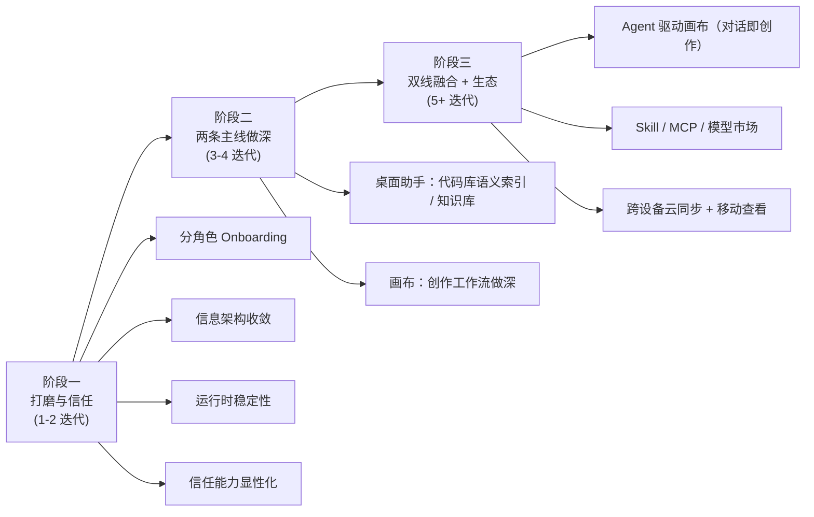
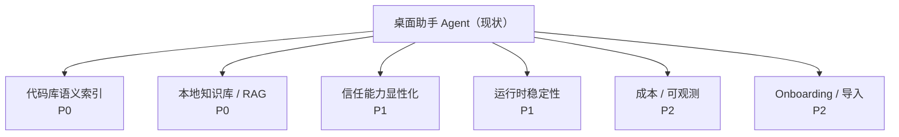
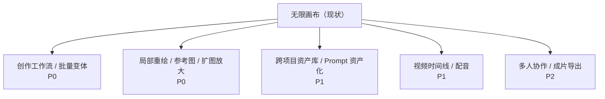
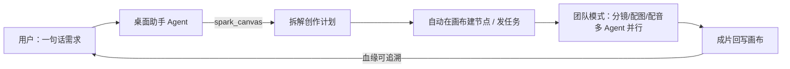

# Spark Agent 后期演进计划 —— 桌面助手 Agent × 无限画布

> 状态: 待开发（规划文档） | 最后核对: 2026-07-04
>
> 适用对象：产品 / 架构 / 实现 Agent。本文档不重复设计已落地能力，只聚焦「还能往哪走、怎么走」。
> 关联：[团队模式开发.md](./团队模式开发.md)、[ai-infinite-canvas-mvp.md](./ai-infinite-canvas-mvp.md)、[liblib-infinite-canvas-retrofit-development-guide.md](./liblib-infinite-canvas-retrofit-development-guide.md)、[multimedia-agent-canvas-infrastructure-plan.md](./multimedia-agent-canvas-infrastructure-plan.md)

---

## 0. 演进总原则

Spark Agent 当前**完成度已经很高、广度领先**。下一阶段的胜负手不在继续堆功能，而在三件事：

1. **做深而非做宽** —— 选「桌面助手 Agent」和「无限画布」两条主线打穿，让单点深度追上甚至超过专精竞品。
2. **降低认知负荷** —— 功能密度极高，体验风险集中在"用户看不懂、不敢托付、记不住入口"。
3. **打通两条线** —— 桌面助手 Agent 与无限画布目前相对独立，最大的差异化机会是让 **Agent 成为画布的创作大脑**，形成"对话即创作"的闭环。

衡量标准：每个迭代结束，用户应能多说出一句"我为什么留在 Spark，而不是回去用 Cursor / Liblib / Cherry"。

---

## 1. 分阶段路线图（总览）

| 阶段 | 主题 | 目标 |
|------|------|------|
| **一** | 打磨与信任 | 不加大功能，把"能用"变"好用、敢用"；补运行时稳定性 |
| **二** | 两条主线做深 | 桌面助手补齐代码理解/知识库；画布补齐创作工作流深度 |
| **三** | 双线融合 + 生态 | Agent 成为画布创作大脑；市场与跨设备生态成形 |

---

## 2. 桌面助手 Agent 演进（重点）

### 2.1 现状盘点（已落地，不再赘述）

双内核（Claude SDK + Codex）、内置 PTY 终端、Git Worktree 隔离、HunkDiff 逐块审阅/回滚、会话检查点恢复、Debug 调试模式、浏览器自动化、三层记忆、MCP / Skill 生态、权限审批 / 用量账本 / Hooks / 审计。

### 2.2 真实差距与演进方向

#### 🔴 P0 —— 代码库语义理解（追赶 Cursor 的关键）

**问题**：当前 Agent 停在"文件读写工具"层级，缺整库语义理解，复杂仓库里定位能力弱。

**演进**：
- 本地代码库索引（符号 / 调用图 / 引用），提供 `@codebase` / `@symbol` 引用与"相关文件自动召回"。
- 可复用本仓库已接入的 **GitNexus** 能力（symbols / relationships / 执行流）作为索引底座，避免从零造轮子。
- 编辑前的"影响面/受影响调用方"提示，做进 Agent 工作流而非仅 CLI。

#### 🔴 P0 —— 本地知识库 / RAG（确认缺口）

**问题**：记忆系统 V2 已对"记忆条目本身"引入 sqlite-vec + 可选 embedding 的混合检索（详见 `todo/agent记忆系统-v2-优化提升方案.md`），但向量只覆盖"结论性事实"，**未覆盖用户挂载的外部文档原文**——"挂载本地文档/PDF/资料做语义检索注入"这一高级用户刚需仍缺位（AnythingLLM / Cherry 都有）。

**演进**：
- 可选的本地知识库模块：挂载文件夹/文档 → 本地或可插拔 embedding → 检索注入。
- 与三层记忆互补：记忆存"结论性事实"，知识库存"可检索原文"。
- 坚持本地优先，embedding 引擎可插拔（本地模型 / 远程 API 二选一）。

#### 🟡 P1 —— 信任能力显性化

**问题**：HunkDiff 回滚、`restoreCheckpoint` 已在运行时存在，但 UI 上不够"看得见、找得到"。

**演进**：
- **Checkpoint 时间线 UI**：会话侧栏可视化每一步检查点，一键"回到这一步"（对标 Cursor checkpoints）。
- **变更总览面板**：一次 Agent 执行涉及的所有文件改动集中展示，支持批量接受/拒绝。
- **执行回放 / 审计导出**：审计事件已落库，补"完整回放一次执行（工具调用 + 权限决策 + 产出）"的界面与导出。

#### 🟡 P1 —— 运行时稳定性

**问题**：reviews 显示 Claude SDK `resume` 因多轮报错被临时关闭、改用本地历史重建；曾出现 provider/model 串线、Plan mode 双审批等。

**演进**：
- 把 SDK resume 做成**带健康检测 + 自动回退**的能力，而非默认关闭。
- 建立多轮对话 / 切 provider / 切内核的**回归测试基线**，纳入 CI。
- 统一错误态恢复体验（失败→可一键重试当前 turn，不丢上下文）。

#### 🟢 P2 —— 成本与可观测

- 用量账本之上补**预算上限 / 阈值告警 / 按 Agent·会话维度归因**。
- 把 Debug 模式的日志能力延伸到"普通会话也能一键查看本轮工具/Provider 调用链"。

#### 🟢 P2 —— 上手与扩展

- **分角色 Onboarding**：首启选"写代码 / 做创作 / 搭团队"，据此预置 Agent、默认视图、前 3 步引导。
- **导入扩展**：HistoryImport 目前只吃 Claude Code / Codex，补 Cherry / ChatBox / Lobe 导入，降低获客门槛。

---

## 3. 无限画布演进（重点）

### 3.1 现状盘点（已落地）

项目 → 多画布管理、图片/视频/文本/Prompt/任务/分组节点、文生图/图生图/图片编辑/多图合成/文/视频生成、后台任务 + 进度回写、血缘边、资产侧栏 + 资产管理面板 + Film Asset Center + 底部工具坞、manifest 驱动的多平台媒体适配。

### 3.2 当前刻意未做（MVP 圈定的边界）

多人实时协作、时间线剪辑、精细蒙版编辑、图层系统、复杂 DAG 编排器、跨项目资产库、模型市场/计费。**这些正是后期演进的候选空间。**

### 3.3 演进方向

#### 🔴 P0 —— 从"生成工具"升级为"创作工作流"

**问题**：当前是"选节点→发起单次任务"的点状操作，缺连续创作的"流程感"。

**演进**：
- **节点级编排（轻量 DAG）**：把"文生图→图生视频→配音"串成可复用的画布内流水线模板，区别于重型 Workflow DAG（后者面向自动化，前者面向创作）。
- **批量 / 变体生成**：一次发起 N 个变体、参数网格（seed/比例/风格矩阵），结果以对比墙呈现。
- **迭代派生强化**：基于血缘做"在这版基础上微调"的一键继续，沉淀"创作树"。

#### 🔴 P0 —— 编辑能力补齐（追赶 Liblib / 创作工具）

- **局部重绘 / 蒙版（inpainting）**：选区涂抹 + 指令重绘，是创作工作台的硬门槛。
- **参考图 / 风格控制**：参考图、风格迁移、构图控制（对接支持 ControlNet 类能力的 provider）。
- **画布内轻编辑**：裁剪、扩图（outpainting）、放大（upscale）、去背。

#### 🟡 P1 —— 资产与项目治理

- **跨项目资产库**：素材/风格/Prompt 预设跨项目复用（当前资产限项目内）。
- **Prompt 资产化**：Prompt 模板库、变量化 Prompt、收藏与复用。
- **版本与快照**：画布级快照、版本对比，配合桌面助手的 checkpoint 心智统一。

#### 🟡 P1 —— 视频/音频创作深化

- 当前视频偏"生成 + 预览"。补**简易时间线**：多片段拼接、配音对齐、转场——不做 PR 级剪辑，做"AI 生成内容的快速成片"。
- 语音：分镜配音、多音色、字幕对齐。

#### 🟢 P2 —— 协作与导出

- **多人协作**（与服务端云同步联动）：画布共享、评论、协同。
- **成片导出**：画布 → 图集 / 视频 / PDF / 分享页一键导出。

---

## 4. 双线融合 —— 最大的差异化机会

桌面助手 Agent 与无限画布目前相对独立。**让 Agent 成为画布的"创作大脑"**，是 Spark 区别于所有竞品（Cursor 没画布、Liblib 没 Agent）的护城河。

**演进设想**：
- **对话即创作**：在画布里对 Agent 说"做一支 15 秒产品短视频"，Agent 经 `spark_canvas` 自动拆解→建节点→调度生成→成片。`spark_canvas` MCP 已存在，是现成的接入点。
- **团队模式 × 画布**：把"分镜师 / 美术 / 配音"做成成员 Agent，A2A 并行产出，结果汇入同一画布。
- **创作记忆**：把项目的风格偏好、常用 Prompt、品牌资产沉淀进记忆/知识库，让 Agent 越用越懂这个项目。

---

## 5. 支撑性基建（贯穿各阶段）

- **生态市场**：Skill 商店第二阶段真实 API 接入（替换 Mock Adapter）、MCP 市场、媒体模型市场。
- **跨设备**：服务端云同步落地后，移动端查看长任务进度（配合远程 IM 触达，体验闭环）。
- **质量**：UI 栈已收敛到 `@lobehub/ui`，持续清理历史样式债；文档保鲜机制（见 AGENTS.md）季度复核。

---

## 6. 优先级一页纸

| 优先级 | 桌面助手 Agent | 无限画布 |
|--------|----------------|----------|
| **P0** | 代码库语义索引、本地知识库/RAG | 创作工作流/批量变体、局部重绘/参考图/扩图放大 |
| **P1** | 信任能力显性化、运行时稳定性 | 跨项目资产库/Prompt 资产化、视频时间线/配音 |
| **P2** | 成本预算/可观测、Onboarding/导入 | 多人协作、成片导出 |
| **融合** | —— Agent 驱动画布「对话即创作」+ 团队模式 × 画布 —— | |

> 一句话：**桌面助手往"更懂代码、更懂资料、更敢托付"走；画布往"更像创作工作台"走；最终让 Agent 成为画布的创作大脑。**
