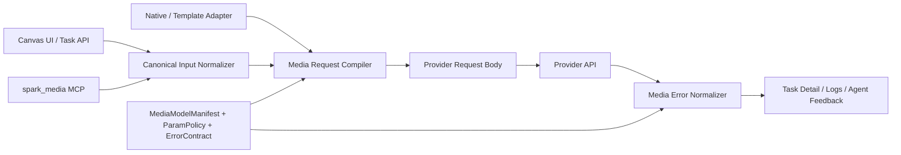

# 多媒体模型契约与错误标准化升级方案

> 状态: 实施中 | 最后核对: 2026-07-05

## 一、说明（背景、目标与现状判断）

### 背景

Spark-Agent 已经通过 `MediaModelManifest` 把多媒体模型能力从硬编码里抽了出来：模型支持哪些 capability、有哪些参数、默认值、参数别名、请求模板、响应提取方式，都可以在 `packages/protocol/src/media-model-manifest.ts` 中描述。画布、Provider 配置和 `spark_media` MCP 也已经开始共用这套清单。

但当前 manifest 仍然更像“能力清单 + 调用模板”，还不是完整的“模型调用契约”。随着接入的模型从 OpenAI-compatible、APIMart、xAI、火山方舟、Google、Agnes、Midjourney 网关继续扩展到更多图像、视频、音频模型，以下问题会越来越频繁：

1. 不同 provider 对同一语义参数使用不同字段名，例如 `aspectRatio`、`aspect_ratio`、`ratio`、`size`。
2. 不同模型对同一字段支持范围不同，例如图片模型支持 `output_format`，视频模型不支持；Seedream 5 lite 支持联网搜索，Seedream 主模型不支持。
3. 有些模型严格拒绝未知参数，直接返回 HTTP 400，例如 `output_format is not supported by the current model`。
4. 画布会继承上游节点的 `modelParams`，换模型或换供应商后，旧模型参数可能污染新模型请求。
5. `spark_media` MCP 工具入参是通用 schema，agent 使用 skill 时容易把通用参数发给目标模型不支持的接口。
6. provider 错误响应结构不统一，任务详情里常只看到 `provider_http_error` 和原始 HTTP 文本，无法准确归因、自动修复或引导用户。

### 当前代码判断

关键链路已经具备基础：

- `MediaModelManifest` 定义 capability、`paramSchema`、`defaults`、`aliases`、`requestTemplate`、`response`。
- `MediaRouterService` 负责根据 operation/capability/provider/model/manifest 选择专用 adapter 或 `TemplateMediaAdapter`。
- `TemplateMediaAdapter` 会按 `paramSchema` 做基础类型/枚举/范围校验，并把 `aliases` 转成 provider 原生参数。
- `media-http.util.ts` 已有 `ErrorExtractor` 钩子，专用 adapter 可以解析自家错误。
- 画布参数面板会读取 manifest 的 `paramSchema` 生成控件。
- `spark_media` MCP server 可以 `list_models` / `describe_model`，并能按 manifest 发起通用调用。

主要缺口也很清晰：

- `paramSchema.additionalProperties` 在很多内置模型中仍为 `true`，未知参数会继续放行。
- `TemplateMediaAdapter` 和 MCP server 分别实现了参数归一与模板渲染，逻辑已经分叉。
- 专用 adapter 里有一些局部补丁，例如 xAI 丢弃 `size`、火山按 manifest 判断 `searchEnabled`，但没有沉淀成通用契约。
- 错误归一没有进入 manifest，无法让自定义模型也享受结构化错误解析。
- 画布在合并继承参数后，没有按最终选中的 manifest/capability 再做一次严格裁剪。
- Agent/MCP 调用缺少“先按目标模型编译参数，再调用 provider”的统一 preflight。

### 目标

本方案目标是把现有 `MediaModelManifest` 升级为 **Media Model Contract V2**：让每个模型不仅声明“能做什么”，还声明“内部标准输入如何编译成 provider 请求、哪些参数允许发送、哪些参数必须转换或丢弃、错误响应如何归一化”。

最终效果：

- 提高画布与内置多媒体 skill 的调用准确率。
- 降低 HTTP 400/422 等参数错误。
- 让新增模型主要通过 contract 配置完成，不需要每次在 adapter 里写补丁。
- 错误能被归一为内部可理解的错误码，便于任务详情展示、自动重试、用户提示和后续遥测。
- 保持现有专用 adapter 的能力，但把参数标准化和错误解析逐步下沉到共享编译层。

### 非目标

- 本期不重写所有 provider adapter。
- 本期不强制删除现有 `paramSchema/defaults/aliases/requestTemplate/response` 字段。
- 本期不实现 provider 文档自动抓取和自动更新 manifest。
- 本期不把所有复杂协议都模板化，例如多端点上传、multipart、视频复杂对象数组仍可继续由专用 adapter 处理。
- 本期不让 agent 自动修改 provider 配置或自动授权；agent 只消费已保存的 contract。

---

## 二、功能需求设计

### FR1 内部标准参数模型（Canonical Media Input）

建立一套内部标准参数命名，画布、MCP、skill、adapter 入口都先归一到这套语义字段。

基础字段：

```ts
type CanonicalMediaParams = {
  prompt?: string
  negativePrompt?: string
  size?: string
  aspectRatio?: string
  resolution?: string
  durationSeconds?: number
  fps?: number
  n?: number
  seed?: number
  quality?: string
  outputFormat?: string
  responseFormat?: string
  voice?: string
  format?: string
  speed?: number
  editStrength?: number
  watermark?: boolean
  generateAudio?: boolean
  returnLastFrame?: boolean
  searchEnabled?: boolean
  filename?: string
}
```

要求：

- `aspect_ratio`、`ratio`、`duration`、`output_format` 等 provider/native 写法进入系统后，都应尽量归一为 canonical 字段。
- 允许保留少量 provider 原生字段，但必须经过 contract 的 `passthrough` 白名单。
- `filename` 只作为本地产物命名参数，不应进入 provider 请求。

### FR2 参数策略（Param Policy）

为每个 capability 增加参数策略，用于声明目标模型到底支持什么、怎么转换、怎么处理未知参数。

建议在 `MediaModelCapabilityManifest` 下新增：

```ts
interface MediaModelParamPolicy {
  strict?: boolean
  passthrough?: {
    enabled: boolean
    allowScalarsOnly?: boolean
    allow?: string[]
    deny?: string[]
  }
  aliases?: Record<string, string>
  transforms?: MediaParamTransformRule[]
  forbidden?: Array<{
    name: string
    reason: string
  }>
  conflicts?: Array<{
    fields: string[]
    strategy: 'prefer_first' | 'prefer_last' | 'error'
  }>
  conditionals?: MediaParamConditionalRule[]
}
```

策略语义：

- `strict: true`：只允许 `paramSchema.properties` 和 `passthrough.allow` 中声明的参数进入 provider 请求。
- `strict: false`：保持兼容，允许额外参数，但仍执行 `forbidden` 和基础安全过滤。
- `aliases`：canonical 字段到 provider 字段名，例如 `aspectRatio -> ratio`。
- `transforms`：字段值转换，例如 `"智能比例" -> "adaptive"`、`size: "16:9" -> aspect_ratio: "16:9"`。
- `forbidden`：明确不支持的字段，例如某模型禁止 `outputFormat`。
- `conflicts`：互斥字段处理，例如 `durationSeconds` 与 `frames`。
- `conditionals`：基于 capability、输入文件、模型 id 或其他参数的条件规则。

首期可以先实现以下最小集合：

- `strict`
- `passthrough.allow`
- `passthrough.deny`
- `aliases`
- `forbidden`
- `conflicts`

`transforms` 和 `conditionals` 可以先支持内置固定 transform 类型，不必做任意表达式引擎。

### FR3 共享参数编译器（Media Request Compiler）

新增共享编译器，作为画布、MCP、TemplateAdapter、专用 adapter 的共同前置层。

建议新增：

```text
packages/protocol/src/media-model-contract.ts
packages/protocol/src/media-model-contract-validation.ts
packages/agent-runtime/src/services/media/media-request-compiler.ts
```

核心函数：

```ts
interface CompileMediaRequestInput {
  manifest: MediaModelManifest
  capability: MediaModelCapabilityManifest
  modelId: string
  input: MediaGenerateInputLike
  providerDefaults?: Record<string, unknown>
  mode: 'canvas' | 'mcp' | 'adapter'
}

interface CompileMediaRequestResult {
  canonicalParams: Record<string, unknown>
  providerParams: Record<string, unknown>
  droppedParams: MediaDroppedParam[]
  warnings: MediaContractWarning[]
  validationIssues: MediaContractIssue[]
}
```

要求：

- 所有参数先清理空值。
- `defaults` 与显式参数合并后再校验，显式参数优先。
- schema 校验失败返回 `invalid_input`，不要等 provider 返回 400。
- 不支持参数按策略丢弃或报错。
- 丢弃参数必须记录原因，用于任务详情和调试日志。
- `providerParams` 是唯一允许进入 request body 的参数集合。

### FR4 请求模板使用编译产物

`TemplateMediaAdapter` 不再自己散落执行参数归一逻辑，而是调用共享编译器：

1. `compileMediaRequest(...)`
2. 构造标准变量：
   - `params` = canonical params
   - `providerParams` = 编译后的 provider 参数
   - `droppedParams` = 被丢弃参数
3. `renderTemplate(requestTemplate, variables)`
4. `mergeProviderParams(requestBody, providerParams)`

如果 `compileMediaRequest` 发现 `validationIssues` 中有 `severity='error'`，直接抛 `MediaProviderError('invalid_input')`。

### FR5 专用 adapter 逐步接入编译器

专用 adapter 不必一次性重写，但所有高风险 provider 先接入 preflight：

优先级：

1. `openai-compatible-media.adapter.ts`
2. `volcengine-ark-media.adapter.ts`
3. `google-generative-ai-media.adapter.ts`
4. `xai-media.adapter.ts`
5. `apimart-media.adapter.ts`
6. `agnes-media.adapter.ts`
7. `midjourney-media.adapter.ts`

接入方式：

- adapter 入口先调用 `compileMediaRequest`。
- adapter 内继续负责复杂协议组装，例如 content 数组、文件上传、轮询。
- adapter 不再从 `input.modelParams` 直接透传未知标量，除非 contract 允许。
- 已有局部补丁逐步迁移为 manifest policy，例如 xAI `size` 规则、火山 `searchEnabled` 规则。

### FR6 错误契约（Error Contract）

在 `MediaModelManifest` 或 provider-level contract 中新增错误解析规则：

```ts
interface MediaErrorContract {
  codePaths?: string[]
  messagePaths?: string[]
  requestIdPaths?: string[]
  paramNamePaths?: string[]
  paramNamePatterns?: string[]
  mappings?: Record<string, MediaNormalizedErrorCode>
  retryableCodes?: string[]
}

type MediaNormalizedErrorCode =
  | 'unsupported_parameter'
  | 'invalid_parameter_value'
  | 'missing_required_input'
  | 'auth_failed'
  | 'quota_exceeded'
  | 'rate_limited'
  | 'content_policy_blocked'
  | 'task_failed'
  | 'task_timeout'
  | 'bad_provider_response'
  | 'artifact_download_failed'
  | 'provider_http_error'
```

要求：

- `fetchJson` 支持从 manifest/context 读取 `MediaErrorContract` 并生成统一错误对象。
- 专用 adapter 的 `errorExtractor` 可以保留，但优先迁移为 declarative error contract。
- 错误对象包含：
  - `code`
  - `providerCode`
  - `message`
  - `statusCode`
  - `requestId`
  - `paramName`
  - `retryable`
  - `rawSnippet`
- 对截图中的错误，应归一为：

```json
{
  "code": "unsupported_parameter",
  "providerCode": "InvalidParameter",
  "paramName": "output_format",
  "message": "当前模型不支持参数 output_format，已阻止或请移除该参数后重试"
}
```

### FR7 画布参数提交前裁剪

画布在以下位置必须按最终选中的 manifest/capability 做参数裁剪：

- `CanvasInlineAiComposer` 点击提交前。
- `CanvasOperationPanel` 点击运行前。
- `canvas.api.ts` 创建任务时，合并 preset、继承参数、用户输入参数之后。
- 任务重跑、复制节点、从 pipeline 生成新任务时。

原则：

- UI 只显示目标模型支持的字段。
- 用户手工添加的 custom params 也要按 contract 检查。
- 从上游继承来的参数只能作为候选值，不能绕过目标模型 contract。
- 被丢弃参数写入任务诊断摘要，不打断用户，除非 contract 标记为 `error`。

### FR8 MCP / skill 调用前约束

`spark_media` MCP server 必须在实际请求前走同一个编译器。

要求：

- `generate_image/edit_image/generate_video/generate_audio/transcribe_audio` 解析到 manifest 后，先 `compileMediaRequest`。
- `extraJson` 不再无条件透传，必须受 `passthrough` 策略限制。
- `describe_model` 返回 capability 的 `paramSchema`、`paramPolicy`、错误提示和示例参数。
- 工具返回中包含 `droppedParams` 和 `warnings`，方便 agent 自我纠正。
- 如果模型不支持某参数，MCP 工具应在本地给出结构化错误或忽略提示，而不是把错误留给 provider。

### FR9 任务详情与调试日志

任务详情中增加：

- `normalizedParams`
- `providerParams`
- `droppedParams`
- `contractWarnings`
- `normalizedError`
- `requestId`
- `manifestId`
- `capability`

日志要求：

- 不记录 API key、Authorization、完整 base64、完整 data URL。
- 长 prompt、长 JSON、二进制摘要使用既有 `compactForLog` 策略。
- 记录“实际发送给 provider 的参数集合”，便于复盘。

### FR10 向后兼容

- 旧 manifest 无 `paramPolicy` 时，自动生成兼容策略：
  - 如果 `paramSchema.additionalProperties === false`，视为 `strict: true`。
  - 如果 `paramSchema.additionalProperties === true`，视为 `strict: false`，但仍执行安全黑名单。
  - 如果没有 `properties`，保持旧行为，但记录 `contractWarnings`。
- 自定义模型保存时提示用户选择“严格模式”或“兼容模式”，默认严格模式。
- 内置 manifest 分批收紧，不要求一次性全部 strict。

---

## 三、技术开发文档

### 3.1 总体架构



核心原则：

- Manifest/contract 是单一事实源。
- UI 只负责展示字段，不负责判断 provider 是否支持。
- Adapter 只负责协议形状，不负责猜参数合法性。
- MCP 和画布共享同一套编译逻辑。

### 3.2 协议层改动

修改 `packages/protocol/src/media-model-manifest.ts`：

```ts
export interface MediaModelCapabilityManifest {
  id: MediaManifestCapabilityId
  label: string
  input: {
    required: MediaManifestInputKind[]
    maxImages?: number
    acceptedMimeTypes?: string[]
  }
  output: {
    types: MediaManifestOutputKind[]
    mimeTypes?: string[]
  }
  paramSchema: Record<string, unknown>
  defaults?: Record<string, unknown>
  aliases?: Record<string, string>
  paramPolicy?: MediaModelParamPolicy
}

export interface MediaModelManifest {
  // existing fields...
  error?: MediaErrorContract
}
```

新增 `packages/protocol/src/media-model-contract.ts`：

```ts
export interface MediaDroppedParam {
  name: string
  providerName?: string
  valuePreview?: string
  reason:
    | 'unsupported_by_model'
    | 'forbidden_by_contract'
    | 'conflict_removed'
    | 'blank_value'
    | 'unsafe_passthrough'
    | 'local_only'
}

export interface MediaContractWarning {
  code:
    | 'param_dropped'
    | 'compat_passthrough'
    | 'missing_param_policy'
    | 'coerced_value'
  message: string
  path?: Array<string | number>
}

export interface MediaContractIssue {
  severity: 'error' | 'warning'
  code:
    | 'invalid_type'
    | 'invalid_enum'
    | 'out_of_range'
    | 'missing_required'
    | 'forbidden_param'
    | 'conflicting_params'
  message: string
  path: Array<string | number>
}
```

新增 Zod schema：

- `MediaModelParamPolicySchema`
- `MediaErrorContractSchema`
- `MediaDroppedParamSchema`
- `MediaContractWarningSchema`
- `MediaContractIssueSchema`

### 3.3 编译器设计

新增 `packages/agent-runtime/src/services/media/media-request-compiler.ts`。

核心流程：

```ts
export function compileMediaRequest(input: CompileMediaRequestInput): CompileMediaRequestResult {
  const rawParams = removeBlankParams(input.input.modelParams ?? {})
  const canonical = normalizeCanonicalParams(rawParams)
  const withDefaults = applyDefaults(input.capability.defaults, canonical)
  const schemaChecked = validateAgainstParamSchema(withDefaults, input.capability.paramSchema)
  const policy = resolveParamPolicy(input.capability)
  const transformed = applyPolicyTransforms(schemaChecked.params, policy, input)
  const conflictResolved = resolveConflicts(transformed.params, policy)
  const providerParams = toProviderParams(conflictResolved.params, policy, input.capability.aliases)
  const filtered = filterProviderParams(providerParams, policy, input.capability.paramSchema)
  return {
    canonicalParams: conflictResolved.canonicalParams,
    providerParams: filtered.params,
    droppedParams: [...schemaChecked.dropped, ...transformed.dropped, ...conflictResolved.dropped, ...filtered.dropped],
    warnings: [...schemaChecked.warnings, ...filtered.warnings],
    validationIssues: [...schemaChecked.issues, ...filtered.issues],
  }
}
```

最小实现规则：

- `removeBlankParams`：移除 `undefined/null/''`。
- `normalizeCanonicalParams`：
  - `aspect_ratio -> aspectRatio`
  - `ratio -> aspectRatio` 仅在 policy 声明时回填，不全局强行转换。
  - `duration -> durationSeconds`
  - `output_format -> outputFormat`
  - `response_format -> responseFormat`
  - `generate_audio -> generateAudio`
  - `return_last_frame -> returnLastFrame`
  - `search_enabled/enable_search -> searchEnabled`
- `validateAgainstParamSchema`：复用当前 `normalizeParamValue` 的类型、枚举、范围、字符串长度逻辑。
- `toProviderParams`：优先 `paramPolicy.aliases`，其次旧 `capability.aliases`，最后原名。
- `filterProviderParams`：
  - 本地字段 `filename` 永远不发。
  - `strict: true` 时，只允许 schema properties 和 `passthrough.allow`。
  - `passthrough.deny` 永远删除。
  - `forbidden` 命中时按策略生成 error 或 dropped。

### 3.4 错误归一设计

新增 `packages/agent-runtime/src/services/media/media-error-normalizer.ts`。

接口：

```ts
export interface NormalizeMediaErrorInput {
  statusCode?: number
  body: unknown
  rawText: string
  contract?: MediaErrorContract
  providerKind?: string
}

export interface NormalizedMediaError {
  code: MediaNormalizedErrorCode
  providerCode?: string
  message: string
  requestId?: string
  paramName?: string
  retryable: boolean
  rawSnippet?: string
}
```

解析顺序：

1. 从 `codePaths` 提取 provider code。
2. 从 `messagePaths` 提取 message。
3. 从 `requestIdPaths` 提取 request id。
4. 从 `paramNamePaths` 或 `paramNamePatterns` 提取参数名。
5. 用 `mappings` 把 provider code 映射为内部 code。
6. 如果 message 命中 `not supported`、`unsupported`、`InvalidParameter` 且有 paramName，归一为 `unsupported_parameter`。
7. 如果 HTTP 401/403，归一为 `auth_failed`。
8. 如果 HTTP 429，归一为 `rate_limited`。
9. 如果 HTTP 402 或 message 命中 quota/balance，归一为 `quota_exceeded`。
10. 否则保留 `provider_http_error`。

`fetchJson` 增加：

```ts
errorContract?: MediaErrorContract
```

并在抛出 `MediaProviderError` 时挂载：

```ts
normalized?: NormalizedMediaError
```

### 3.5 画布接入点

需要修改：

- `apps/desktop/src/renderer/design/views/canvas/CanvasInlineAiComposer.tsx`
- `apps/desktop/src/renderer/design/views/canvas/CanvasOperationPanel.tsx`
- `apps/desktop/src/renderer/design/views/canvas/canvas.api.ts`
- `apps/desktop/src/renderer/design/views/canvas/canvas.tools.ts`
- 相关测试：`CanvasInlineAiComposer.test.ts`、`canvasOperationInheritance.test.ts`、`canvas.store.test.ts`

建议新增 renderer 侧轻量工具：

```text
apps/desktop/src/renderer/design/views/canvas/canvasMediaContract.ts
```

职责：

- 根据 selected model/capability 读取 `paramSchema/paramPolicy/defaults`。
- 在 UI 提交前调用协议层纯函数版本的参数裁剪。
- 生成给用户展示的 `droppedParams` 摘要。

注意：renderer 不应依赖 runtime 的 Node/Electron 代码；共享的纯函数应放 `@spark/protocol`，runtime 编译器再负责 request/body 层。

### 3.6 MCP 接入点

修改 `packages/agent-runtime/src/tools/media-generation-mcp-server.mjs`：

- `argsToModelParams` 只负责收集候选参数，不再决定最终请求参数。
- `buildManifestVariables` 调用共享 contract 编译逻辑。
- `extraJson` 必须受 `paramPolicy.passthrough` 管控。
- `handleManifestTool` 返回 `droppedParams/warnings`。
- fallback hardcode 分支也要至少执行基础过滤，尤其是 xAI/openai-compatible。

为了让 `.mjs` 复用 TS 编译器，有两种选择：

1. 把纯函数编译器放在 `packages/agent-runtime/src/services/media/media-request-compiler.mjs`，TS 层 import JS。
2. 保持 TS 编译器，同时为 MCP server 提供等价的零依赖 JS helper。

推荐第一种，减少逻辑分叉。

### 3.7 Provider 配置和 Manifest 编辑器

Provider 自定义模型向导新增：

- 严格模式开关，默认开。
- “允许透传参数”白名单编辑。
- 错误响应路径配置：
  - code path
  - message path
  - request id path
  - 参数名正则
- 保存前 dry-run：
  - 输入一组示例参数。
  - 展示 canonical params、provider params、dropped params。
  - 不发真实 provider 请求。

### 3.8 数据与 IPC

如果任务详情已经持久化 `modelParams` 与 `rawResponse`，首期可不新增数据库字段，先把 `requestCall` 类似的诊断信息挂在画布任务快照中。

若要持久化，建议后续迁移：

```sql
ALTER TABLE media_generation_tasks ADD COLUMN normalized_params_json TEXT;
ALTER TABLE media_generation_tasks ADD COLUMN provider_params_json TEXT;
ALTER TABLE media_generation_tasks ADD COLUMN dropped_params_json TEXT;
ALTER TABLE media_generation_tasks ADD COLUMN normalized_error_json TEXT;
```

首期建议少动 storage，先把诊断信息通过 runtime output 返回给画布，由画布自己的任务快照保存。

---

## 四、任务清单（Todolist）

### M0 设计冻结与风险确认

- [x] 核对所有内置 manifest 中 `additionalProperties: true` 的模型，列出需要严格化的清单。
- [x] 核对现有 provider adapter 中手写参数补丁，整理成 contract 规则候选。
- [x] 确认 `MediaProviderError` 是否增加 `normalized` 字段，还是新增子类。
- [x] 确认首期是否持久化 dropped params；建议首期只走内存返回和画布快照。
- [x] 更新本文件状态为「实施中」后开始编码。

#### M0.1 内置 manifest 严格化清单（62 个内置 manifest）

按 provider 分组，标注当前 schema 状态与 M5 计划动作：

| Provider | 数量 | 当前 `additionalProperties` | M5 动作 |
|---|---|---|---|
| `agnes` | 3 | 全部 `true` | 收紧为 `false`，保留 `passthrough.allow` 仅必要字段 |
| `apimart` | 18 | 全部 `true`（聚合平台） | **保留兼容透传**，但显式声明 `passthrough.allow/deny` 白名单 |
| `bailian` | 11 | 全部 `true` | 收紧核心字段，按 happyhorse/wan 文档枚举字段严格化 |
| `google` | 5 | 全部 `true` | `outputFormat` 按 Gemini/Veo 模型分别 forbidden 或 allow |
| `kling` | 5 | 全部 `true` | 收紧为 `false`，按可灵文档枚举字段 |
| `midjourney` | 1 | `true` | 保留白名单（submitPath/statusPath 等运行时字段） |
| `minimax` | 5 | 全部 `true` | 收紧为 `false`，按 minimax 文档枚举 |
| `omni` | 1 | `true` | 收紧为 `false` |
| `openai` | 1 | `true`（共享 `imageSizeSchema` 是 `false`） | 收紧 gpt-image-1 |
| `volcengine` | 12 | 全部 `true` | xAI `size` 规则、Seedream lite `searchEnabled -> tools` 条件迁移 |
| `xai` | 3 | 全部 `true` | `size` transform 为 `aspect_ratio`；视频编辑 forbidden aspectRatio/resolution |

已 `additionalProperties: false` 的共享 schema：`imageSizeSchema`、`videoSchema`、`audioSpeechSchema`（仅被个别内置 manifest 引用）。

#### M0.2 现有 provider adapter 局部补丁（待迁移为 contract policy）

| Adapter | 局部补丁 | M5/M8 迁移目标 |
|---|---|---|
| `xai-media.adapter.ts` | 丢弃 `size` 字段、不透传 `quality` 等 | `paramPolicy.forbidden` + `transforms.ratio_size_to_aspect` |
| `volcengine-ark-media.adapter.ts` | `manifestSupportsParam('searchEnabled')` 局部判断 | Seedream lite manifest 声明 `searchEnabled`，主模型 `forbidden` |
| `google-generative-ai-media.adapter.ts` | 按 Gemini/Veo 模型分别组装字段 | manifest 分别声明 `outputFormat/resolution/duration` |
| `apimart-media.adapter.ts` | 全量透传 `modelParams` | 显式 `passthrough.allow` 白名单 |
| `openai-compatible-media.adapter.ts` | 默认透传未知标量 | 通过 compiler allowlist 收紧 |

#### M0.3 `MediaProviderError.normalized` 设计确认

采用方案：在 `MediaProviderError` 上**新增可选字段 `normalized?: NormalizedMediaError`**，不新增子类。理由：

- 自定义子类需要更新所有 catch 站点的 `instanceof` 判断，影响面更大。
- router / canvas / MCP 既有 `err.code` 判断逻辑可保留，`normalized` 是渐进叠加的诊断字段。
- 与现有 `requestCall` 字段保持一致的"附加摘要"风格。

#### M0.4 dropped params 持久化决策

**首期不持久化到数据库**。理由：

- 现有 `media_generation_tasks` 表迁移成本高，且方案目标是先验证归一逻辑的稳定性。
- 画布任务快照已经能持久化任意诊断 JSON。
- 通过 `MediaGenerateOutput` 返回 `droppedParams/warnings/normalizedError`，由调用方（画布、MCP）按需写入任务快照或日志。

后续若需独立字段检索，再走 3.8 节的 SQL 迁移。

#### M0.5 文档状态

状态已更新为「实施中」，最后核对日期 `2026-07-05`。下一步进入 M1。

### M1 协议层 Contract V2

- [ ] 修改 `packages/protocol/src/media-model-manifest.ts`，增加 `paramPolicy` 和 `error` 字段。
- [ ] 新增 `packages/protocol/src/media-model-contract.ts`，定义 dropped/warning/issue/error 类型。
- [ ] 新增 Zod schema 并接入 `MediaModelManifestSchema`。
- [ ] 扩展 `validateMediaModelManifestSemantics`，校验：
  - `forbidden` 字段必须存在于 schema 或 aliases 中。
  - `passthrough.allow` 与 `passthrough.deny` 不得冲突。
  - `conflicts.fields` 至少两个字段。
  - `error.*Paths` 不能为空字符串。
- [ ] 增加 `packages/protocol/src/__tests__/media-model-contract.test.ts`。
- [ ] 运行 `pnpm --filter @spark/protocol test:unit`。
- [ ] 运行 `pnpm --filter @spark/protocol typecheck`。

### M2 共享参数编译器

- [ ] 新增 `packages/agent-runtime/src/services/media/media-request-compiler.ts`。
- [ ] 从 `TemplateMediaAdapter` 中抽出可复用的类型校验和空值清理逻辑。
- [ ] 实现 canonical 归一、schema 校验、alias 映射、strict 过滤、passthrough 白名单、conflict 处理。
- [ ] 给以下场景写单测：
  - `output_format` 对不支持模型被丢弃。
  - `aspectRatio` 映射为 `ratio`。
  - `durationSeconds` 映射为 `duration`。
  - `filename` 永远不进入 provider params。
  - `additionalProperties: false` 时未知参数被丢弃。
  - `passthrough.allow` 允许指定额外参数。
  - 冲突字段按 `prefer_first` 删除后者。
- [ ] 运行 `pnpm --filter @spark/agent-runtime test:unit -- media-request-compiler`。

### M3 TemplateMediaAdapter 接入

- [ ] 修改 `packages/agent-runtime/src/services/media/adapters/template-media.adapter.ts`，用 `compileMediaRequest` 替代局部 `normalizeParamsForSchema`。
- [ ] 保留 `buildVariables` 的 input file/media 聚合能力。
- [ ] 把 `droppedParams/warnings` 加入 `MediaGenerateOutput` 或 `rawResponse` 的诊断字段。
- [ ] 更新 `packages/agent-runtime/src/__tests__/tools/media-generation-mcp-server.test.ts` 和 `media-adapters.test.ts`。
- [ ] 增加回归测试：manifest 模板调用时，用户传 `output_format` 但 schema 未声明，最终请求 body 不包含该字段。
- [ ] 运行 `pnpm --filter @spark/agent-runtime test:unit -- media-adapters`。

### M4 错误归一

- [ ] 新增 `packages/agent-runtime/src/services/media/media-error-normalizer.ts`。
- [ ] 修改 `MediaProviderError`，增加 `normalized?: NormalizedMediaError`。
- [ ] 修改 `fetchJson`，支持 `errorContract`。
- [ ] 为火山错误、xAI 错误、Google 错误、OpenAI-compatible 错误各写 fixture 单测。
- [ ] 把截图中的错误格式加入测试：

```json
{
  "error": {
    "code": "InvalidParameter",
    "message": "The parameter `output_format` specified in the request is not valid: the parameter `output_format` is not supported by the current model."
  },
  "request_id": "021783234719056d323cdad39964ab14a5fcc08ad1c36506f5fb0"
}
```

- [ ] 期望归一为 `unsupported_parameter`，`paramName=output_format`，保留 request id。
- [ ] 运行 `pnpm --filter @spark/agent-runtime test:unit -- media-error-normalizer`。

### M5 内置 Manifest 收紧

- [ ] 从高风险图片模型开始，把不需要透传的 `additionalProperties: true` 改为 `false`。
- [ ] 给 xAI 图片 manifest 添加禁止 `size` 或 transform 到 `aspect_ratio` 的规则。
- [ ] 给火山 Seedream 5 lite 添加 `searchEnabled -> tools` 的条件规则；主模型不声明该字段。
- [ ] 给 Google 图片模型确认 `outputFormat` 是否支持，不支持的模型显式 forbidden。
- [ ] 给 APIMart/GPT Image 聚合模型保留有限 passthrough 白名单。
- [ ] 每改一类 manifest，补一个 compiler snapshot 测试。
- [ ] 运行 `pnpm --filter @spark/protocol test:unit`。

### M6 画布提交前裁剪

- [ ] 新增 `apps/desktop/src/renderer/design/views/canvas/canvasMediaContract.ts`。
- [ ] 修改 `CanvasInlineAiComposer`，提交 payload 前调用裁剪。
- [ ] 修改 `CanvasOperationPanel`，运行任务前调用裁剪。
- [ ] 修改 `canvas.api.ts`，在 preset/继承/input 合并后按目标模型再次裁剪。
- [ ] 在任务节点详情或 debug 信息里展示 `droppedParams`。
- [ ] 更新 `CanvasInlineAiComposer.test.ts`：
  - 选择不支持 `outputFormat` 的模型时，提交 payload 不包含该参数。
  - custom param 不在 passthrough 白名单时被丢弃。
- [ ] 更新 `canvasOperationInheritance.test.ts`：
  - 上游节点有 `outputFormat`，下游换成不支持该字段的模型后不继承该字段。
- [ ] 运行 `pnpm --filter @spark/desktop test:unit -- CanvasInlineAiComposer`。

### M7 MCP / Skill 接入

- [ ] 修改 `packages/agent-runtime/src/tools/media-generation-mcp-server.mjs`，manifest 调用前执行 contract 编译。
- [ ] 约束 `extraJson` 只按 passthrough 白名单进入 provider 请求。
- [ ] `describe_model` 返回 `paramPolicy` 和错误解析说明。
- [ ] 工具成功返回中增加 `droppedParams/warnings`。
- [ ] 工具失败返回中优先返回 normalized error。
- [ ] 增加 MCP server 单测：
  - agent 传 `output_format` 给不支持模型，工具本地丢弃，不触发 provider 400。
  - `extraJson` 中未知字段在 strict 模型下被丢弃。
  - `describe_model` 能看到字段约束。
- [ ] 运行 `pnpm --filter @spark/agent-runtime test:unit -- media-generation-mcp-server`。

### M8 专用 Adapter 分批接入

- [ ] `openai-compatible-media.adapter.ts`：去掉默认透传未知标量的行为，改走 compiler allowlist。
- [ ] `volcengine-ark-media.adapter.ts`：把 `manifestSupportsParam` 迁移为 compiler/policy。
- [ ] `google-generative-ai-media.adapter.ts`：按 Gemini/Veo 模型分别过滤 `outputFormat/resolution/duration`。
- [ ] `xai-media.adapter.ts`：把 `size` 处理迁移为 policy transform。
- [ ] `apimart-media.adapter.ts`：保留聚合平台白名单透传，不再全量透传。
- [ ] 每个 adapter 至少补一个“拒绝未知参数”的请求 body 测试。
- [ ] 运行 `pnpm --filter @spark/agent-runtime test:unit -- media-adapters`。

### M9 Provider 配置与自定义 Manifest UX

- [ ] Provider 自定义模型编辑器增加严格模式开关。
- [ ] 增加 passthrough 白名单/黑名单编辑。
- [ ] 增加错误解析路径编辑。
- [ ] 增加 dry-run 参数预览，不发 provider 请求。
- [ ] 保存前跑 `MediaModelManifestSchema.parse` 和 semantic validation。
- [ ] 更新 Provider 相关测试。

### M10 文档、回归和发布前检查

- [ ] 更新 `docs/multimedia-model-platform-adapters-design.md`，记录 Contract V2 已落地。
- [ ] 更新 `docs/superpowers/specs/2026-07-01-custom-media-model-manifests-design.md`，补充 param policy/error contract。
- [ ] 如果新增 docs 计划/设计文档，按项目规则写状态行并刷新日期。
- [ ] 运行 `pnpm --filter @spark/protocol typecheck`。
- [ ] 运行 `pnpm --filter @spark/agent-runtime typecheck`。
- [ ] 运行 `pnpm --filter @spark/desktop typecheck`。
- [ ] 运行相关 unit tests。
- [ ] 开发完成后按项目规则运行 GitNexus `detect_changes()` 或 CLI 等价能力，核对影响范围。

---

## 五、关键注意事项

### 5.1 不要只在 UI 层过滤

UI 层过滤只能减少用户误填，不能防止以下来源：

- 上游节点参数继承。
- MCP skill 的 `extraJson`。
- 旧任务重跑。
- Provider 默认参数。
- 自定义 preset。
- agent 直接调用工具时传入通用参数。

所以必须在 runtime adapter 前做最终 preflight。

### 5.2 新模型默认严格模式

新增内置模型和自定义模型应默认：

```json
{
  "paramPolicy": {
    "strict": true,
    "passthrough": { "enabled": false }
  }
}
```

只有经过确认的聚合平台才允许开启 passthrough。

### 5.3 兼容模式要可见

如果旧 manifest 因 `additionalProperties: true` 进入兼容模式，任务详情和日志应记录 warning：

```text
missing_param_policy: 当前模型使用兼容参数透传，可能被 provider 拒绝未知字段。
```

这样后续排查模型报错时，能快速知道是 contract 还没收紧。

### 5.4 不要引入任意表达式引擎

`conditionals/transforms` 首期不要做 JS 表达式或用户可写脚本，避免安全和调试复杂度。

推荐做枚举式 transform：

```ts
type MediaParamTransformRule =
  | { kind: 'rename'; from: string; to: string }
  | { kind: 'map_value'; field: string; values: Record<string, string> }
  | { kind: 'ratio_size_to_aspect'; from: 'size'; to: 'aspectRatio' }
  | { kind: 'drop_when_input_kind'; field: string; inputKinds: string[] }
```

### 5.5 错误归一不能吞掉原始信息

归一错误用于展示和逻辑判断，但仍要保留安全截断后的原始片段：

- 方便 provider 客服排障。
- 避免归一逻辑误判时丢失线索。
- 保留 request id。

### 5.6 任务详情不能泄露敏感数据

展示 `providerParams` 时必须复用安全摘要：

- API key、Authorization、token 全掩码。
- base64/data URL 只显示 MIME、长度和短 hash。
- 本地路径按现有安全策略处理。

### 5.7 与专用 adapter 的边界

Contract 负责“参数是否合法、叫什么、要不要发”。

Adapter 负责“怎么按 provider 协议发”：

- endpoint 拼接。
- content 数组结构。
- multipart/binary 上传。
- async polling。
- artifact 下载。

不要把复杂协议硬塞进 contract，也不要让 adapter 继续猜未知参数能不能透传。

### 5.8 文档保鲜

本文件位于 `todo/`，仍按当前 `todo` 文档惯例写状态行。真正实现时，如果同步修改 `docs/` 下计划/设计文档，必须按项目规则刷新：

```text
> 状态: [待开发 | 实施中 | 已落地 | 已废弃] | 最后核对: YYYY-MM-DD
```

### 5.9 GitNexus 使用边界

本文件只是方案文档，不涉及代码符号修改。真正开始实现时，按项目规则：

- 修改函数/类/方法前先做影响分析。
- 大功能开发完成后更新 `docs/` 相关文档。
- 提交前运行变更检测，确认只影响预期符号和流程。

---

## 六、测试方案与验收标准

### 6.1 协议层验收

通过标准：

- `MediaModelManifestSchema` 能解析旧 manifest 和新 contract manifest。
- 新字段 `paramPolicy/error` 有 Zod 校验。
- semantic validation 能发现：
  - passthrough allow/deny 冲突。
  - conflicts 少于两个字段。
  - error path 为空字符串。
  - forbidden 字段配置不合理。
- 旧 manifest 不破坏现有测试。

命令：

```bash
pnpm --filter @spark/protocol test:unit
pnpm --filter @spark/protocol typecheck
```

### 6.2 参数编译器验收

必须覆盖：

1. 不支持 `output_format` 的模型，输入 `output_format: "png"`，输出 providerParams 不包含该字段。
2. 支持 `outputFormat` 且 alias 为 `output_format` 的模型，输入 `outputFormat: "png"`，输出 providerParams 包含 `output_format: "png"`。
3. strict 模型收到未知字段 `foo`，被丢弃并记录 `unsupported_by_model`。
4. passthrough allow 模型收到 `style`，可以进入 providerParams。
5. passthrough deny 模型收到 `debug`，必须丢弃。
6. `filename` 永远不进入 providerParams。
7. `aspectRatio` 可映射为 `ratio`。
8. `durationSeconds` 可映射为 `duration`。
9. enum/range/type 错误会产生 `validationIssues`。

命令：

```bash
pnpm --filter @spark/agent-runtime test:unit -- media-request-compiler
pnpm --filter @spark/agent-runtime typecheck
```

### 6.3 错误归一验收

必须覆盖：

1. 火山/Ark 风格 `{ error: { code, message }, RequestId }`。
2. OpenAI-compatible 风格 `{ error: { type/code/message/param } }`。
3. xAI 风格 `{ error: { type, message } }`。
4. Google 风格 `{ error: { code, message, status } }`。
5. 非 JSON 错误文本。
6. 截图中的 `output_format is not supported` 场景。

通过标准：

- 能提取 provider code。
- 能提取 message。
- 能提取 request id。
- 能提取参数名。
- 能映射为正确内部 code。
- `MediaProviderError.normalized` 存在。

### 6.4 TemplateMediaAdapter 验收

必须覆盖：

- request body 只包含编译后的 providerParams。
- `requestTemplate` 仍能使用 `{{prompt}}`、`{{image}}`、`{{providerParams.xxx}}`。
- async polling 不受影响。
- URL/base64/binary result materialize 不受影响。
- dropped params 出现在 output 诊断信息中。

命令：

```bash
pnpm --filter @spark/agent-runtime test:unit -- media-adapters
```

### 6.5 画布验收

必须覆盖：

1. Inline composer 选择模型 A，填了 A 支持字段；切换到模型 B 后，不支持字段不再提交。
2. Operation panel 从旧任务读到 `outputFormat`，目标模型不支持时不提交。
3. `canvas.api.ts` 合并上游继承参数后，目标模型不支持的字段被裁剪。
4. custom param 不在 allowlist 时被丢弃。
5. dropped params 在任务详情中可见。

命令：

```bash
pnpm --filter @spark/desktop test:unit -- CanvasInlineAiComposer
pnpm --filter @spark/desktop test:unit -- canvasOperationInheritance
pnpm --filter @spark/desktop typecheck
```

### 6.6 MCP / Skill 验收

必须覆盖：

1. `describe_model` 返回新 contract 字段。
2. `generate_image` 传入目标模型不支持的 `output_format` 时，本地丢弃，不发给 provider。
3. `extraJson` 在 strict 模型下不会绕过过滤。
4. provider 返回 unsupported parameter 时，MCP 返回 normalized error。
5. 成功调用结果包含 `droppedParams/warnings`。

命令：

```bash
pnpm --filter @spark/agent-runtime test:unit -- media-generation-mcp-server
```

### 6.7 回归验收

现有能力不得回退：

- APIMart 图片生成/编辑仍能生成并落盘。
- xAI 图片生成不发送 `size`。
- 火山 Seedance 视频异步轮询仍能完成。
- 火山 Seedream 支持图片 URL/base64 输出。
- Google 图片/视频仍能提取产物。
- Agnes 图片/视频仍能调用。
- Midjourney 网关 submit/poll 仍能执行。
- 自定义 manifest 的同步 JSON 与 async polling 仍能执行。

建议命令：

```bash
pnpm --filter @spark/protocol test:unit
pnpm --filter @spark/agent-runtime test:unit
pnpm --filter @spark/desktop test:unit
pnpm --filter @spark/protocol typecheck
pnpm --filter @spark/agent-runtime typecheck
pnpm --filter @spark/desktop typecheck
```

### 6.8 手工验收场景

场景 A：截图问题复现

1. 选择一个不支持 `output_format` 的图片模型。
2. 通过画布或 MCP 传入 `output_format: "png"`。
3. 确认发给 provider 的请求体没有 `output_format`。
4. 确认任务详情显示该参数已被丢弃，原因是 `unsupported_by_model`。

场景 B：换模型继承参数

1. 节点 1 使用支持 `outputFormat` 的模型生成图片。
2. 节点 2 接节点 1 输出，切换为不支持 `outputFormat` 的模型。
3. 运行节点 2。
4. 确认节点 2 请求体不包含 `output_format/outputFormat`。

场景 C：MCP skill 调用

1. Agent 调用 `spark_media.generate_image`，传入 `extraJson: { output_format: "png", style: "xxx" }`。
2. 目标模型 strict 且未 allow `style`。
3. 确认两个字段都不进入 providerParams，并在结果中返回 dropped params。

场景 D：错误归一

1. Mock provider 返回截图中的 HTTP 400。
2. 确认前端任务详情显示：
   - 错误类型：不支持的参数。
   - 参数名：`output_format`。
   - provider code：`InvalidParameter`。
   - request id。
3. 确认日志不泄露密钥或完整 base64。

---

## 七、完成定义

本方案视为完成，需要同时满足：

- Contract V2 类型、schema、编译器、错误归一均已落地。
- TemplateMediaAdapter 和 MCP manifest 调用已使用共享编译器。
- 画布提交前和 runtime 调用前都有参数裁剪。
- 至少 5 个高风险内置模型的 manifest 已切到 strict 或明确 passthrough。
- 截图中的 `output_format unsupported` 场景不会再打到 provider。
- 错误详情能归一为 `unsupported_parameter` 并提取参数名/request id。
- 相关 unit/typecheck 通过。
- `docs/` 中多媒体 manifest/adapters 设计文档已刷新状态和日期。
- 开发完成后已运行项目要求的变更检测，确认影响范围符合预期。
