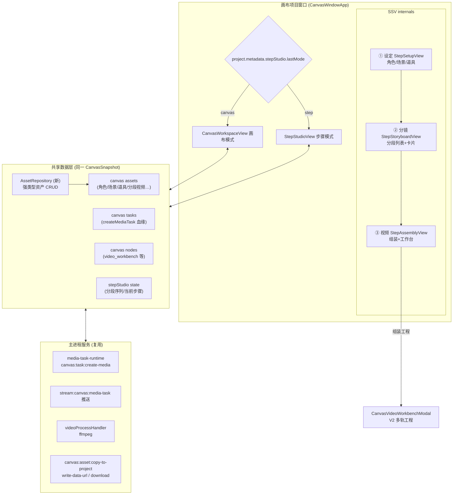

# 步骤模式（Step Studio）与项目资产库全面改造设计

> 状态: 全部代码完成并通过全面审查修复（P1-P6 + 二期遗留 4 项 + 三期体验增强已交付，待真机验收） | 最后核对: 2026-08-30

## 1. 背景与目标

无限画布目前是唯一创作形态：自由度高，但对「线性视频创作」用户（先定角色场景道具 → 再排分镜逐段生成 → 最后合成）来说心智负担重、链路散。

本设计新增**步骤模式（Step Studio）**：三步向导式创作界面（设定 → 分镜 → 视频），与画布模式在**项目级并存、可随时互相切换**，两种模式**共用同一套项目资产库**。

同时借此机会**全面改造项目资产库**：现有形态（双 UI 并列、功能缺陷多）推倒重做为统一的资产库数据层 + UI。

参考形态：用户提供的 6 张竞品截图（设定页资产 Tab、新增角色弹窗三种来源、分镜页分段卡片、视频页时间线预览）。

### 设计原则

1. **数据层不动摇**：步骤模式与画布模式共享同一份 `CanvasSnapshot`（节点/边/资产/任务），不新建平行数据体系。
2. **复用优先**：媒体生成链路、分镜工具链、视频工作台、流水线语义模型全部复用，步骤模式是「线性向导视图」而非新领域。
3. **向后兼容**：不迁移 SQLite 表结构，模式标志与分镜数据落 `project.metadata` / 快照 JSON；老项目打开行为不变。
4. **资产库重构分层**：先收窄类型 + 统一访问层 + 修缺陷（低风险），再换 UI（独立交付）。**不建独立资产表**（2026-08-29 确认）：抽表会造成资产表与画布快照双数据源双写同步，即数据重复风险源头；Repository 访问层即未来抽表的替换点（见 §9 决策 3 演进路径）。

## 2. 现状盘点（2026-08-29 代码调查）

### 2.1 项目资产库现状

**双 UI 并列：**

| UI                       | 主组件                                  | 问题                                                                                            |
| ------------------------ | --------------------------------------- | ----------------------------------------------------------------------------------------------- |
| 右侧面板「资产」Tab      | `CanvasAssetManagerPanel.tsx`（781 行） | 列表/网格 + 虚拟滚动，无分类语义（只有类型下拉），与影视资产中心功能重叠                        |
| 底部「项目资产中心」弹窗 | `CanvasFilmAssetCenter.tsx`（3306 行）  | 影视语义 Tab（文稿/剧本/角色/场景/道具/特效/分镜分组/提示词库/Files），但 3306 行巨型组件难维护 |

另有 `CanvasAssetsPanel.tsx` 为**无挂载点的死代码**（仅 download helper 被 import）。

**数据模型**：`CanvasAsset` 内嵌在 `CanvasSnapshot.assets`（整体 JSON 快照落 SQLite + 项目目录 `latest.json`），无独立资产表；影视子类靠 `metadata.kind`（弱类型 `Record<string, unknown>` 上散落十余个魔法 key）。

**已知缺陷清单**（改造时必须处理）：

1. 引用统计 `referencesByAsset` 不过滤 `hidden` 软删节点 → 已删节点仍计入「N 引用」
2. 删节点不回收资产引用计数，资产只增不减
3. 批量删除 N+1 串行 `await deleteFilmAsset`，无批处理
4. Provider 文件清理只认 `metadata.providerProfileId/fileId`，AI 生成资产未写 metadata 时文件泄漏
5. `storageKey` 语义不统一（可能是绝对路径或相对），下载前需正则判断
6. 节点 data 与 asset 双份数据单向漂移（节点改名/替换图不回写 asset；duplicateNodes 共享 assetId 不重映射）
7. `CanvasAssetMeta` 的 `folderId/favorite/archived` 已定义但无 UI 消费
8. 无分页，搜索/筛选每次全量 filter
9. metadata 弱类型无 schema 校验

### 2.2 画布与项目模型现状

- 画布工作区运行在**独立 BrowserWindow**（`CanvasWindowService` 创建，query `window=canvas&projectId`，`main.tsx` 分流到 `CanvasWindowApp` → `CanvasWorkspaceView`，9262 行）。
- `CanvasProject` **无 `mode` 字段**；`metadata?: Record<string, unknown>` 是官方扩展位（影视元数据 `CanvasFilmProjectMetadata` 已用此位）。
- **已有六阶段流水线领域模型**（可直接支撑步骤化）：
  - `PipelineStageKey`：`manuscript/screenplay/resource/shot/keyframe/video` 六阶段 + `computePipelineProgress`（含 nextAction CTA）
  - `CanvasProductionState`：`empty→drafting→draft→confirmed→stale`（节点级确认闸门）
  - `CANVAS_PIPELINE_OPS` 流水线操作目录（剧本拆解、角色三视图、场景图、分镜转关键帧等）
  - 分镜工具链：`canvasShotPlanner`、`canvasStoryboardNodeSplit`、`storyboard_grid` 操作节点、`CanvasShotDirectorPanel`
- 画布 Agent 侧栏 `CanvasAgentModal`（可拖宽、会话机制完整），新视图可直接复用同款交互。

### 2.3 视频工作台与媒体生成现状

- **工作台**：`CanvasVideoWorkbenchModal` + V2 多轨工程（video/overlay/audio/text/subtitle 轨，clip 级 speed/transform/audio/fade），工程数据存画布节点 `data.videoWorkbench`（`VideoWorkbenchProjectV2`，schemaVersion=2，undo/redo 100 步 + 防抖持久化）。
- **媒体生成统一链路**（可直接复用为分段生成通道）：渲染端 `createMediaTask`（`canvas.api.ts`）→ IPC `canvas:task:create-media`（后台模式）→ 主进程 `media-task-runtime.service`（SQLite `media_generation_tasks` 表 + 适配器路由 + 恢复轮询）→ 流式推送 `stream:canvas:media-task` → `applyMediaTaskResult` 写资产/节点/边。
- **ffmpeg**：`FfmpegRunner`（外部进程）+ `videoProcessHandler`（probe/trim/concat/transcode/speed/reverse/crop/关键帧提取等原子操作齐全），managed 二进制优先、系统回退。
- 缺口：无任务并发上限/全局队列；工作台内不能直接发起 AI 生成（均经画布操作节点）。

## 3. 总体架构

### 3.1 核心决策

| 决策点           | 方案                                                                                                                  | 理由                                                                                                                                     |
| ---------------- | --------------------------------------------------------------------------------------------------------------------- | ---------------------------------------------------------------------------------------------------------------------------------------- |
| 步骤模式挂载位置 | **画布项目窗口内新增模式**（`CanvasWindowApp` 内按项目 mode 渲染 `CanvasWorkspaceView` 或 `StepStudioView`）          | 项目级双模式诉求；同窗口切换不弹新窗；共享窗口服务/会话/IPC                                                                              |
| 模式标志存储     | `project.metadata.stepStudio.lastMode`（`'canvas' \| 'step'`）                                                        | 官方扩展位，无 DB 迁移；记忆用户上次使用模式                                                                                             |
| 步骤划分         | **设定 → 分镜 → 视频** 三步                                                                                           | 对齐参考形态；映射现有六阶段（resource→shot+keyframe→video），manuscript/screenplay 由画布模式或分镜内导入承担                           |
| 资产库存储       | 保持快照内嵌，抽出**强类型 AssetRepository 访问层**；**不建独立资产表**（已确认，2026-08-29）                         | 快照存储非当前瓶颈（百级资产）；抽表 = 表与快照节点双数据源双写同步，引入数据重复与一致性风险，收益不抵；Repository 层留作未来抽表替换点 |
| 资产库 UI        | **新建统一资产库组件**（`ProjectAssetLibrary`），替换 `CanvasFilmAssetCenter` 巨型弹窗，右侧 Tab 面板保留轻量引用视图 | 双 UI 收敛为一个语义清晰、可分页、可扩展的组件                                                                                           |
| 分镜数据         | 快照内新增 `StepStudioState`（分段序列），分段引用资产 ID，生成产物挂资产 + 任务血缘                                  | 数据落快照（复用持久化链路），领域类型新建                                                                                               |
| 视频步骤         | 分段视频自动组装为工作台工程（物化 `video_workbench` 节点），复用 `CanvasVideoWorkbenchModal` 全部编辑能力            | 工作台已是最强合成端，不重复造                                                                                                           |

### 3.2 双模式切换

```
CanvasWindowApp
 ├─ project.metadata.stepStudio.lastMode === 'canvas'
 │    → CanvasWorkspaceView（现有画布）
 └─ lastMode === 'step'
      → StepStudioView（新：三步向导）
```

- 两个视图顶栏均有**模式切换器**（图标 + 文案，如「画布 / 步骤」），点击即切换（同窗口 swap，不重开窗口、不丢会话）。
- 切换即写 `lastMode` 并 flush 持久化；下次打开项目恢复上次模式。
- 画布模式的「制作面板六阶段」与步骤模式三步**共享** `computePipelineProgress` 进度源，两侧进度一致（资产/节点/任务同源）。
- 步骤模式产生的所有节点（如物化的分段视频节点、最终工作台节点）都落在画布上，切到画布模式可见、可继续深加工。

### 3.3 架构图



## 4. 数据模型设计

### 4.1 项目级扩展（落 `project.metadata`）

```ts
/** packages/shared 或 canvas.types.ts 新增 */
export type CanvasProjectMode = 'canvas' | 'step'

export interface StepStudioProjectMeta {
  /** 上次使用的创作模式（项目级记忆） */
  lastMode: CanvasProjectMode
  /** 步骤模式当前停留步骤 */
  activeStep: StepStudioStageKey
}

export type StepStudioStageKey = 'setup' | 'storyboard' | 'assembly'
```

> 兼容：读取时 `readStepStudioMeta(project)` 做缺省容错（无字段 → `lastMode: 'canvas'`），老项目零迁移。

### 4.2 步骤模式状态（落 `project.metadata.stepStudioState`）

```ts
export interface StepStudioState {
  schemaVersion: 1
  /** 分段序列（分镜步骤的核心数据） */
  sequences: StepShotSequence[]
  /** 组装产物：最终工作台节点 ID（物化后存在） */
  assemblyNodeId?: string | null
}

export interface StepShotSequence {
  id: string
  projectId: string
  title: string // 如「第一集 / 正片」
  order: number
  segments: StepShotSegment[]
}

export interface StepShotSegment {
  id: string
  sequenceId: string
  order: number // 拖拽排序
  // ── 分镜内容 ──
  script: string // 本段剧本/描述（支持 @引用标记）
  durationSec?: number
  // ── 资产引用（设定步骤产出的角色/场景/道具）──
  characterAssetIds: string[]
  sceneAssetId?: string | null
  propAssetIds: string[]
  // ── 参考图（可由资产生成或单独上传；挂在 segment 下的图片资产 ID）──
  referenceAssetIds: string[] // 全能参考模式
  firstFrameAssetId?: string | null // 首尾帧模式
  lastFrameAssetId?: string | null
  /** 生成模式：全能参考（多参考图） / 首尾帧 */
  genMode: 'reference' | 'first_last_frame'
  // ── 生成参数（透传现有 CanvasTask 模型参数）──
  modelParams?: Record<string, unknown>
  providerProfileId?: string
  modelId?: string
  // ── 产物血缘 ──
  outputVideoAssetIds: string[] // 历次生成的分段视频（最新在末尾）
  taskId?: string | null // 最近一次任务
  status: StepSegmentStatus
}

export type StepSegmentStatus =
  | 'draft' // 草稿（未生成）
  | 'generating' // 生成中
  | 'done' // 已有可用产物
  | 'failed' // 最近一次失败（可重试）
```

> 序列化位置（P3 实施修正）：`project.metadata.stepStudioState`（可选键，老项目缺省为无）。
> 原设计为 `CanvasSnapshot.stepStudio` 快照字段，实施时核查发现快照在 `fullSnapshotFromDb` / `snapshotFromDb` / `persistAllProjects` / `loadSnapshotFromStorage` 四处**按字段逐一组装**，新增快照字段会被静默丢弃，并非"零改动兼容"。改存 `project.metadata`（整体读写、随项目持久化，且是 activeBoardId / 风格预设 / 制作圣经等既有惯例位置）。
> 与模式元数据 `metadata.stepStudio` 分两个键：`updateProjectMetadata` 为浅合并整键替换，模式切换（高频小写入）与分段内容（低频大写入）分键可避免读-改-写互相覆盖。类型定义落在 `canvas.types.ts`，读写 helper 见 `stepStudio/stepStudioMeta.ts`（含对损坏元数据的逐字段容错）。

### 4.3 资产类型收窄（AssetRepository 一期核心）

将散落的 `metadata` 魔法 key 收敛为**判别联合**，读写统一走新模块 `canvas/assetLibrary/`：

```ts
/** 按-kind-判别的影视资产载荷（替代 metadata.kind 散读） */
export type FilmAssetPayload =
  | {
      kind: 'character'
      character: {
        appearance: string
        personality?: string
        subviewAssets?: { view: string; assetId: string }[]
      }
    }
  | { kind: 'scene'; scene: { description: string; timeOfDay?: string } }
  | { kind: 'prop'; prop: { description: string } }
  | { kind: 'effect'; effect: { description: string } }
  | {
      kind: 'manuscript' | 'chapter' | 'script' | 'prompt_library' | 'shot_group'
      raw: Record<string, unknown>
    }

export interface AssetRepository {
  list(projectId: string, query: AssetListQuery): Promise<AssetPage> // 分页 + 筛选（kind/type/关键词/收藏）
  get(projectId: string, assetId: string): Promise<CanvasAsset | null>
  upsert(asset: CanvasAssetInput): Promise<CanvasAsset> // 含引用计数维护
  batchDelete(projectId: string, assetIds: string[]): Promise<BatchDeleteResult> // 级联软删引用节点 + 批量清源文件
  addReference(assetId: string, nodeId: string): void // 修复：删节点时回收
  removeReference(nodeId: string): void
  recordGenerationOrigin(
    assetId: string,
    origin: { taskId: string; providerProfileId?: string; fileId?: string },
  ): void // 修复 Provider 清理
}
```

一期实现仍基于内存快照 db（`readDb()/writeDb()` + 防抖 flush），但调用面只有 Repository——二期换独立 SQLite 表时 UI/视图层不动。

### 4.4 资产与节点的引用修复

- `referencesByAsset` 统计过滤 `hidden` 软删节点（对齐下载口径）。
- `deleteNodes`（软删）时调用 `assetRepo.removeReference` 回收引用计数。
- AI 生成资产落库时强制写 `metadata.providerProfileId/fileId/originTaskId`（`applyMediaTaskResult` 补齐）。
- `storageKey` 归一：新写入一律存相对 key（相对 `project.rootPath`），读取端兼容绝对路径历史数据。
- 批量删除一次遍历收集文件清理请求后单次 IPC，消灭 N+1。

## 5. UI 设计

### 5.0 步骤模式整体布局（对齐参考形态）

```
┌────────────────────────────────────────────────────────────────┐
│ ← 返回  项目名✏️        [设定]──[分镜]──[视频]      模式:画布⇄步骤 │ ← 顶栏：三步导航 + 模式切换
├──────────┬─────────────────────────────────────────────────────┤
│ 左侧栏    │  主内容区（随步骤切换）                                 │
│ 步骤内    │  ① 设定：资产分类 Tab + 卡片网格                        │
│ 导航/列表 │  ② 分镜：分段列表（左）+ 分镜卡片编辑（中）+ 引用面板（右）│
│          │  ③ 视频：预览 + 分段轨时间线 + 组装/导出                 │
├──────────┴─────────────────────────────────────────────────────┤
│ 底部 Dock（复用画布式样）：生成任务进度 / Agent 入口                │
└────────────────────────────────────────────────────────────────┘
```

视觉遵循项目既有偏好：**扁平简洁、无渐变光晕、层级靠分割线/色点/文字明暗、禁止分块盒子式分组**（项目记忆 prj_9263e734 / prj_e5112b80）。hover/focus/disabled/loading/empty/error 全状态覆盖。

### 5.1 第一步：设定（StepSetupView）

- **左侧分类**：角色 / 场景 / 道具 /（可选）特效——即 `FilmAssetKind` 收窄后的核心四类；每类显示数量色点。
- **主区卡片网格**：每卡片 = 形象图（占位则首字母/图标）+ 名称 + 状态徽标（`CanvasProductionState`：草稿/已确认）+ 引用数。支持多选批量操作。
- **新建资产弹窗（对齐参考图三种来源）**：
  1. **AI 生成**：输入名称 + 形象描述 → 选模型 → 生成（走 `createMediaTask`，产物自动挂资产 kind）。角色可追加「三视图/多面向」生成（复用 `character.three_view` pipeline op）。
  2. **本地上传**：文件选择 → `canvas:asset:copy-to-project` 入项目 → 建资产。
  3. **从画布选择**：列出该项目画布上的图片节点资产（含已在库但未归类资产），勾选后归类为对应 kind。
  4. **从资产库选择**（参考图「从角色库选择」）：**从其他项目资产库导入**（本次实现，2026-08-29 确认）——浏览/搜索其他项目的资产，勾选后**复制式**导入当前项目（复制 payload 与参考图引用，媒体文件本身不复制，仍指向同一 Provider 文件/URL；两项目各自管理各自副本，删除互不影响）。不做全局共享资产表——那会引入跨项目引用计数与删除策略纠缠，与「不单独搞一套数据」方向相反。
- **资产详情侧栏**：描述编辑、设定文本（外貌/性格）、参考图集、生成历史（任务血缘）、引用位置（点击定位到画布节点）。
- **状态流转**：卡片上直接切 `draft → confirmed`（已确认资产才在分镜步骤默认引用列表置顶；不阻断使用）。

### 5.2 第二步：分镜（StepStoryboardView）

- **左侧**：分段序列列表（一集/一组），分段条目可拖拽排序（复用画布内 DnD 交互习惯）；顶部「+ 新增分段」「AI 拆分剧本」（粘贴剧本 → 复用 `canvasShotPlanner`/剧本拆解 op 自动生成分段草稿）。
- **中部分镜卡片**（当前选中分段）：
  - 剧本文本域，支持 `@` 引用（输入 `@` 弹出已确认的角色/场景/道具资产选择——复用会话区 @ 提及弹窗交互模式，含 ESC 关闭与关闭按钮，项目记忆 prj_02b8bd73 / prj_69855734 的捕获阶段拦截经验）
  - 出镜引用区：角色 chip（多选）、场景（单选）、道具 chip（多选）——全部来自设定步骤资产
  - 参考图区：`genMode` 切换「全能参考 / 首尾帧」；参考图可从引用资产生成、上传、或取分段视频历史首帧
  - 生成参数：模型选择（复用画布操作面板的模型/参数组件）、时长
- **生成动作**：单段「生视频」+ 顶部「批量生视频」（仅对 `draft/failed` 段排队）；全部走 `createMediaTask`，任务进度在底部 Dock 任务面板展示；产物自动回填 `outputVideoAssetIds` 并刷新缩略图。
- **分段卡片列表（右侧或下方）**：每段一行缩略图 + 状态（draft/generating/done/failed 色点）+ 失败重试（复用 repoll/retry 契约）。

### 5.3 第三步：视频（StepAssemblyView）

- 进入时若未组装：一键「组装时间线」→ 后台将各段最新视频资产按序生成工作台工程：
  - 创建/复用 `video_workbench` 节点（`subtype: 'video_workbench'`），按分段顺序铺主轨 clip（每段一个 clip，`timelineStartSec` 顺序累加），段间默认硬切（后续可在工作台调转场/变速）。
  - 写入 `StepStudioState.assemblyNodeId`，组装幂等（已有产物则提示增量更新：只追加新完成分段）。
- 主区两态：
  - **轻量预览**：分段轨时间线 + 顺序播放预览（直接 `<video>` 逐段播，不启动完整工作台）。
  - **精剪**：打开 `CanvasVideoWorkbenchModal`（复用全部多轨/变速/裁剪/关键帧/导出能力；工程即 assemblyNode 的 `data.videoWorkbench`）。
- **导出**：工作台既有导出（`handleExportTrack` concat 链路）+ 「物化到画布」既有动作，零新开发。
- 增量联动：分镜步骤补生成/替换某段后，回到第三步提示「时间线可更新」，增量替换对应 clip（保留用户在工作台做过的该 clip 参数则提示冲突，默认保留用户版）。

### 5.4 资产库统一 UI（ProjectAssetLibrary，双模式共用）

替换 `CanvasFilmAssetCenter`（3306 行退役拆分）为模块化组件树：

```
assetLibrary/
├── ProjectAssetLibrary.tsx        # 容器：左分类 + 主网格 + 详情侧栏
├── AssetLibrarySidebar.tsx        # 分类导航（角色/场景/道具/特效/文稿/剧本/提示词/Files）+ 收藏/最近
├── AssetGrid.tsx                  # 虚拟滚动卡片网格（分页加载，server-style 分页参数走 AssetRepository.list）
├── AssetDetailDrawer.tsx          # 详情：元信息/引用/生成历史/定位画布
├── AssetCreateModal.tsx           # 新建（AI 生成/上传/画布选择——与设定步骤共用子组件）
├── AssetBatchActions.tsx          # 批量：插入画布/下载/删除/归档/收藏
└── useAssetLibrary.ts             # 列表状态 + 分页 + 筛选 hooks
```

- **入口**：① 步骤模式设定页（即本组件的步骤态嵌入）；② 画布模式底部 Dock「资产库」按钮（替换原资产中心弹窗）；③ 右侧「资产」Tab 保留 `CanvasAssetManagerPanel` 的轻量引用视图改造为只读快览 + 「打开资产库」跳转（避免功能重复）。
- **能力保留**：原资产中心的文稿导入分章、剧本拆解、分镜分组等影视工作流入口**收敛进「文稿/剧本」分类的工具条**，不丢失。
- **单文件 ≤ 3000 行红线**：模块化拆分后每文件目标 < 800 行。

## 6. 与参考形态的能力映射

| 参考图功能                                | 本设计落点                                | 复用/新建                      |
| ----------------------------------------- | ----------------------------------------- | ------------------------------ |
| 设定页角色/场景/道具 Tab + 卡片网格       | StepSetupView + ProjectAssetLibrary       | 新 UI，复用资产数据层          |
| 新增角色：AI 生成 / 角色库选择 / 本地上传 | AssetCreateModal 三 Tab                   | 新建；生成走 createMediaTask   |
| 分镜页左侧集数 + 卡片拖拽排序             | StepStoryboardView 序列/分段              | 新建（DnD 复用习惯）           |
| @引用式提示词 + 出镜角色/场景/道具        | StepShotSegment 引用字段 + @提及组件      | 新建                           |
| 全能参考 / 首尾帧两种生成模式             | genMode + createMediaTask 参图/首尾帧入参 | 复用现有 image_to_video 能力   |
| 批量生视频 + 进度                         | 批量排队 + stream:canvas:media-task       | 复用                           |
| 视频页时间线 + 导出                       | StepAssemblyView + 工作台                 | 复用 CanvasVideoWorkbenchModal |
| 导出/下载                                 | 工作台导出 + canvas:asset:download        | 复用                           |
| 积分显示                                  | 不做（无积分体系）                        | —                              |

## 7. 实施计划（分期交付）

| Phase             | 内容                                                                                                   | 交付物                                     | 依赖 |
| ----------------- | ------------------------------------------------------------------------------------------------------ | ------------------------------------------ | ---- |
| **P1 资产数据层** | `FilmAssetPayload` 判别联合 + `AssetRepository` + 引用计数/Provider 元数据/storageKey/批删四项缺陷修复 | `canvas/assetLibrary/` 数据模块 + 缺陷修复 | 无   |

**P1 验收记录（2026-08-29，验收方 Spark助手）**：ZCode 交付整体合格（模块划分 / 契约 / 测试 47 项属实），验收时发现并修复 6 处问题：

1. 🔴 `applyMediaTaskResult` 的 `storageKey`/`metadata.filePath` 误用拷贝前源路径 `assetOut.filePath`（应为项目内权威副本 `persistedFilePath`）——源在项目外时资产指向可被清理的全局产物目录、与 displayUrl 不一致、删资产清错文件；
2. 🟡 `deleteBoard` 软删节点未回收引用计数（与 `deleteNodes` 口径不一致）；
3. 🟡 `removeReference` 不检查 `hidden`，已软删节点重复调用会重复递减 usageCount；
4. 🟡 `FilmAssetPayload` raw 分支 `kind: string` 吞掉判别收窄（typecheck 实际报 5 处错误，执行端自验遗漏）→ 调用侧改经 `isStructuredFilmAssetPayload` 守卫；
5. 🟢 `recordGenerationOrigin` 无变化时不必要的写库；未刷新 `updatedAt`；
6. 🟢 `list({archived: true})` 无效语义补全；关键词搜索纳入结构化描述（角色外貌/性格、场景/道具描述）。

验收后状态：53/53 聚焦测试通过、全项目 typecheck 0 错误、eslint 0 问题。真机冒烟（引用数展示 / 批删 / 清理 / 下载）仍需用户手动验收。

P2 交付记录（2026-08-29，本 Agent 直接开发）：`canvas/assetLibrary/` 新增 8 文件（ProjectAssetLibrary 容器 / AssetLibrarySidebar / AssetGrid / AssetDetailDrawer / AssetBatchActions / AssetShotsView / useAssetLibrary / assetLibrary.less，均 <300 行）+ `canvas.api.setFilmAssetFavorite` + store 导出 `refreshCanvasSnapshot`。接线：`CanvasWorkspaceView` Dock「资产中心」入口切至新库；旧 `CanvasFilmAssetCenter` handlers 抽为共享 `filmCenterHandlers`，经库内「完整文稿 / 剧本编辑工具」按钮过渡进入（取代原计划的 localStorage 回退开关——应用内逃生口更直接可用）。验证：typecheck 0 错误、assetLibrary 模块 eslint 0 警告。真机验收待用户执行（网格分页 / 批量管理 / 详情抽屉 / 收藏 / 分镜分组治理 / 提示词库与 Files 嵌入）。

P3 交付记录（2026-08-29，本 Agent 直接开发）：`canvas/stepStudio/` 新增 5 文件——`stepStudioMeta.ts`（模式/状态读写 helper，损坏元数据逐字段容错）、`StepModeSwitcher.tsx`（画布⇄步骤胶囊切换器，两模式共用）、`StepStudioView.tsx`（三步骨架：顶栏 + 左侧导航 + 占位主区）、`stepStudio.less`（cinema token 扁平样式）、`stepStudioMeta.test.ts`。`canvas.types.ts` 增加 `CanvasProjectMode`/`StepStudioStageKey`/`StepSegmentStatus`/`StepStudioState` 等领域类型。接线：分流点为 `CanvasWorkspaceView` 渲染层（store/会话保持单例，视图 swap 不弹新窗，独立窗口与主窗口两入口同享），`lastMode === 'step'` 时渲染 StepStudioView；模式切换写 `metadata.stepStudio` 后 `saveCanvas()` 落库（重开项目恢复上次模式）；步骤内切换只写 activeStep 不落盘。`CanvasWorkspaceChrome` 增 `mode`/`onSwitchMode` props 渲染顶栏切换器。验证：typecheck 0 错误、eslint 0 error（70 条 warning 均存量）、12/12 测试通过（stepStudioMeta 8 + Chrome 切换器 4）。真机冒烟待用户执行（双向切换 / activeStep 持久化 / 重开恢复模式）。

P4 交付记录（2026-08-29，本 Agent 直接开发）：`stepStudio/StepSetupView.tsx`（设定步骤主视图：分类 Tab + 卡片网格 + 状态统计）+ `assetLibrary/AssetCreateModal.tsx`（三来源建资产弹窗：AI 生成 / 本地上传 / 从画布选择，共用类型 `assetCreateTypes.ts`）。资产直接进项目资产库（两模式共享）。验证：typecheck 0 错误、模块 eslint 0 error。

P5 交付记录（2026-08-29，本 Agent 直接开发）：`stepStudio/StepStoryboardView.tsx`（序列侧栏 + 分段卡片列表 + 批量生成并发池，默认 4 可调 1-8）+ `StepSegmentCard.tsx`（分段卡片：剧本 / 出镜角色·场景·道具 / 全能参考·首尾帧双模式 / 时长 / 四态徽章）+ `stepStoryboardModel.ts`（纯数据层：序列与分段 CRUD、normalize 容错、deriveSegmentRuntime 任务态派生、buildStepSegmentPrompt 风格+设定+剧本注入、collectSegmentInputFiles 参考图精确 role、22 个聚焦测试）。草稿编辑走本地叠加层 + 700ms 防抖落盘，结构操作立即写；任务终态由 effect 同步回写持久化 status / outputVideoAssetIds（供 P6 组装消费）。验证：typecheck 0 错误、eslint 0 error、22/22 测试通过。

P6 交付记录（2026-08-29，本 Agent 直接开发）：`stepStudio/stepAssemblyModel.ts`（组装纯数据层：collectAssemblySources 按 order 收集 done 段最新 video 产物；applyAssemblyToProject 幂等组装——`stepres_`/`stepclip_` id 前缀标记 step 内容，重组装只替换标记项、用户在工作台手动添加的资源/片段/轨道原样保留，step clips 铺主轨 appendTime 之后避免重叠；损坏工程容错落默认工程；10 个聚焦测试）+ `StepAssemblyView.tsx`（组装总览 + 分段轨 + `<video>` 逐段连播轻量预览 + 打开工作台精剪入口）。接线：`CanvasWorkspaceView.assembleStepTimeline`（幂等复用 `assemblyNodeId` 指向节点，被删则重建并回填；`updateNodeData` merge 语义只写 videoWorkbench 字段），步骤模式分支渲染共享的 `CanvasVideoWorkbenchModal`（精剪/导出零新开发）。验证：typecheck 0 错误、eslint 0 error、stepStudio 40/40 测试通过；canvas 全量 292 文件 / 2073 测试无回归。

全面审查与修复记录（2026-08-29，两个并行审查子代理报告 → 逐条源码核实 → 修复，共 2 P0 + 8 P1 + 19 P2）：

- **P0 级（全修）**：① 分镜生成任务落 `boards[0]` 而非激活画板——`snapshotFromDb` 按激活画板过滤 tasks，多画板项目进度/终态/组装整链路看不到任务；改用 `snapshot.board.id` 并校验缺失。② 终态同步 effect 以渲染闭包 `persisted` 整键写 `stepStudioState`，与防抖 flush 交错时静默覆盖用户草稿；抽 `mergeDraftsIntoLatest` 共享合并函数（最新持久化 + 未落盘草稿），flush 与终态同步统一写入基准。
- **P1 级（全修）**：批量生成 worker 无 try/finally（异常后按钮永久禁用）+ 完成提示不区分失败；重新生成保留旧 taskId 致提交窗口可重复点击付费任务（marking 同时清 taskId）；批量排队误含 done 段（收紧为仅 draft/failed）；taskId 已回填但任务被删时分段永久卡 generating（派生 failed 给重试出口）；视频步骤 sources 只读持久化状态、用户停留等待时永不出现新完成段（改 `deriveSegmentRuntime` 实时派生，展示口径不写库）；分镜 props 内联回调击穿 700ms 草稿防抖（容器 `useCallback` 固化 + 卸载冲刷改挂载期固定依赖）；`outputVideoAssetIds` 整体覆盖违背类型契约（改去重追加、最新在末尾）；useAssetLibrary 分页在筛选/刷新代次变化时以旧页码取新切片（loadShape 查询形状驱动重置）；AssetCreateModal「从画布选择」切走再切回旧页码追加重复（canvasSessionRef 会话判定）。
- **P2 级（修 17 项）**：ESC 输入框误关库、下载双重 toast、列表加载失败无区分态（error 横幅 + 重试）、`recordGenerationOrigin` 对 metadata=undefined 的索引崩溃（`?? {}` 防护）、序列重命名逐键全量写库（改失焦提交）、初始化默认序列在用户删光后自动复活（改首次挂载判定）、组装/设定图/分组展开删除等 6 处异步操作缺 catch、工作台节点被删后打开无提示（打开前校验并引导重组装）、`stepStudioModePatch` 死代码删除、`inputAssetIds` 语义污染（删假 id 传参）等。
- **P2 级（不修，记录权衡）**：收藏切换后列表 remount 回到顶部——涉及「仓储返回 db 活引用 vs 快照替换」的数据层语义，当前 renderKey 强刷是既有权衡，改动风险大于收益；已知行为，后续资产数据层活引用治理时一并处理。
- **分期项（已于二期全部完成，见下方二期交付记录）**：分段 `@` 提及资产引用语法、AI 拆分剧本自动生成分段草稿、分段拖拽排序（上移/下移按钮保留为键盘可达操作）、重组装时保留用户对 step clip 的手动裁剪。
- 验证：typecheck 0 错误；改动文件 eslint 0 error（StepStoryboardView 修复过程中自查出 1 条 react-hooks/refs 渲染期写 ref 警告，当即改为 effect 内同步）；canvas 全量回归 292 文件 / 2072 测试通过（较上次少 1 条为删除死代码用例）。

二期遗留项交付记录（2026-08-29，本 Agent 直接开发，4 项全交付）：

- **R2-1 分段拖拽排序**：`@dnd-kit`（PointerSensor 6px 激活阈值 + KeyboardSensor，`restrictToVerticalAxis` 约束纵向），`reorderSegment(state, seqId, segmentId, toIndex)` 纯函数（越界钳制、同位/未知分段不变更），上移/下移按钮保留为键盘可达操作。3 个聚焦测试。
- **R2-3 分段 `@` 提及资产引用**：`detectMentionQuery`（'@' 前须行首/空白，查询 ≤24 字符，光标越界返回 null）/ `applyMention`（区间替换 '@'→光标，光标在查询中间时向后清残字并消费紧邻空白防双空格）/ `filterMentionOptions` 纯函数 + `SegmentMentionInput` 组件（IME 安全：确认只看方向键显式高亮信号，prj_43f90082；文本快照守卫外部变更作废面板；渲染后光标恢复）+ `StepSegmentCard` 接线（角色/场景/道具三类候选合并，选择后写入对应引用字段去重追加）。10 个聚焦测试。
- **R2-2 AI 拆分剧本**：toolbar「AI 拆剧本」弹窗（粘贴剧本 → `createTextTask` text_generate 任务，prompt 含项目资产名单约束与严格 JSON 数组输出要求）；任务指针 `StepStudioState.breakdown` 持久化（跨页面存活）；终态同步 effect 扩展——completed 后读文本产物 `contentText` → `parseBreakdownDrafts`（容忍 ```json 围栏，非法条目逐项容错）→ 名称「精确→包含」匹配项目资产绑定引用字段 → 追加分段草稿到目标序列（`breakdownHandledRef` 防终态写入落盘前 effect 重跑重复追加）；解析失败/序列被删提示手动处理，文本产物保留画布。顺手修复：`persisted`useMemo 与`mergeDraftsIntoLatest`整键重构丢`assemblyNodeId`/`breakdown` 字段（改展开保留）。7 个聚焦测试。
- **R2-4 重组装保留手动裁剪**：`stepAssemblyModel` 迁移策略——重组装只替换 `stepclip_` 标记项的素材指向（sourceUrl/资源 id），保留用户对该 clip 设置的 trimIn/trimOut/速度等手动裁剪；`stepres_` 资源池整体重建。既有测试更新 + 新增防回归用例。
- 验证：typecheck 0 错误；stepStudio 模块 eslint 0 error；canvas 全量回归 292 文件 / 2090 测试通过（+18 项二期聚焦测试）。

三期体验增强交付记录（2026-08-30，本 Agent 直接开发；来源：用户真机反馈「生成参数（画幅等）没按画布模式提供、抽屉看不到任务状态、无模型/参数选择」）：

- **R3-1 生成参数配置补齐**：新建 `useAssetGenerationConfig` hook（统一「模型 + 参数」配置态：模型经 `listMediaModels({enabledOnly:true})` 过滤 `image.generate` 能力；参数字段按画布模式同款三层合并——schema 字段 ⊕ operation 建议字段 ⊕ 模型建议字段；默认值取「偏好记忆 > capability.defaults > operation 默认」；size↔画幅互斥、空值剔除、类型转换复用画布 `canvasModelParameterDraft` 既有纯函数）。提交侧 `buildSubmitConfig()` 编译 manifestId/providerProfileId/modelId/modelParams，成功后 `rememberPreferences()` 写入画布模式同一份偏好存储（`spark-canvas:model-parameter-preferences:v1`），两模式参数记忆互通。
- **R3-2 任务状态与抽屉生成入口**：新建 `assetGenerationStatus.ts`——从快照节点反查 `outputFilmAssetId` 聚合各资产最近一次生成任务状态（五态 pending/running/completed/failed/cancelled + progress + message）；流式任务更新随 snapshot 传导自动刷新。UI 三处落位：① `AssetDetailDrawer` 顶部状态横幅（生成中 spinner+进度百分比、失败红边框+错误信息、完成态时间戳）；② `AssetGrid` 卡片左上「生成中」角标（generatingIds）；③ 抽屉内嵌「生成设定图」配置区（模型+参数面板+发起按钮，生成中禁用并发起重发）。
- **接线结构**：`StepSetupView` 顶层持有一份 `useAssetGenerationConfig`，经 `generationController` 注入 `AssetCreateModal`（新建弹窗）与抽屉生成区——**两入口共享同一模型/参数选择**，任一处选定另一处保持一致；`AssetCreateModal` 未注入时自建（独立可用，enabled 门控避免弹窗未开白拉模型）。画布模式 `ProjectAssetLibrary` 抽屉轻量接入状态横幅（生成链路 `onGenerateAssetReference` 不动）。校验契约告警（CanvasTaskValidationError → 确认弹窗 → skipParameterValidation 重提）与画布模式完全对齐。
- 验证：typecheck 0 错误；assetLibrary + stepStudio 8 文件 92/92 测试通过（含 hook 5 用例：默认选中/参数变更/互斥/enabled 门控/偏好恢复）；eslint 0 error。

| **P2 资产库 UI** | ProjectAssetLibrary 组件树替换资产中心；右侧 Tab 收敛为快览 | 新资产库（画布模式入口） | P1 |
| **P3 步骤模式框架** | `StepStudioProjectMeta` + `CanvasWorkspaceView` 渲染层模式分流 + StepStudioView 三步骨架 + 顶栏切换器 | 可切换的空骨架（三步占位） | 无（可与 P1 并行） |
| **P4 设定步骤** | StepSetupView 完整功能 + AssetCreateModal | 三来源建资产 + 分类管理 | P2, P3 |
| **P5 分镜步骤** | StepStoryboardView + StepShotSequence/Segment 状态 + 批量生成 + @引用 | 分段生成闭环 | P4 |
| **P6 视频步骤** | StepAssemblyView 组装 + 增量更新 + 工作台衔接 | 三步全流程打通 | P5 |

每 Phase 结束跑 typecheck + 聚焦自测；UI Phase（P2/P4/P5/P6）需真机验收由用户手动确认。

## 8. 风险与兼容性

1. **`CanvasWorkspaceView` 体量风险**（9262 行）：步骤模式**不进**该文件，全部独立目录 `canvas/stepStudio/`，通过 props/`useCanvasWorkspace` store 共享数据，避免继续膨胀。
2. **快照体积**：分段数据 + 资产增长仍走整包快照；一期量级可控（分段数十条）；P1 的 AssetRepository 接口为未来可能的抽表演进留缝（仅当资产量级达到性能瓶颈且愿意承担迁移时才启动，届时资产迁出快照、节点只存资产 ID，保持单一数据源）。
3. **双模式并发编辑**：切换是同窗口视图 swap，不存在并发写；但画布模式与步骤模式对同一资产的修改在切换后需刷新——`useCanvasWorkspace` 快照订阅天然覆盖（同一 store）。
4. **老项目兼容**：`stepStudio` 字段全部可选缺省；`lastMode` 缺省 `'canvas'`；资产 metadata 老数据由 `readAssetKind` 兼容读取（收窄类型只约束新写入）。
5. **`CanvasFilmAssetCenter` 退役节奏**：P2 上线新库后旧组件保留一个版本周期做回退开关（临时 feature flag localStorage），确认稳定后删除（含死代码 `CanvasAssetsPanel` 一并清理）。
6. **批量生成并发控制**：批量生视频做**渲染端排队**，并发上限**默认 4、用户可调 1–8**（批量生成入口旁展示当前并发数，设置记忆到项目），完成一个补一个，不动主进程队列（避免影响画布现有行为）。默认 4 的依据：视频渠道（火山 Seedance / MiniMax Hailuo）并发配额普遍 3–5，过高并发触发限流后产生失败重试风暴反而更慢；用户嫌 2 偏低（2026-08-29 反馈），上调为 4 并开放调节。主进程全局队列另行立项。
7. **Agent 面板**：步骤模式一期复用 `CanvasAgentModal`（挂载于 StepStudioView 侧栏），注入当前分段/资产上下文。

## 9. 决策记录（2026-08-29 用户已确认）

1. **不设第四步「文稿/剧本」**：维持设定 → 分镜 → 视频三步；剧本能力保留在画布模式 + 分镜步骤的「AI 拆分剧本」入口（粘贴剧本自动生成分段草稿），原资产中心的文稿导入分章/剧本拆解收敛进新资产库「文稿/剧本」分类工具条。
2. **资产库共享本次一起做透**：一个项目一份资产数据，画布模式与步骤模式完全共用，**绝不单独搞一套项目文件**。跨项目维度以**复制式「从其他项目导入」**满足（见 §5.1 来源 4），不做全局共享资产表。
3. **不建独立资产 SQLite 表**：判断依据「重要性/必要性 + 数据重复」——抽表会造成资产表与画布快照双数据源、双写同步与软删对齐负担，正是数据重复风险源头；当前百级资产量级下快照内嵌无性能瓶颈。演进路径：AssetRepository 作为唯一访问层隔离存储实现，未来确需抽表时替换 Repository 实现、资产迁出快照、节点只存资产 ID，保持单一数据源，UI 层零改动。
4. **批量生成并发上限默认 4**（原设计 2 偏低，用户反馈上调），用户可调 1–8，设置记忆到项目（见 §8 风险 6 的依据与限流考量）。
